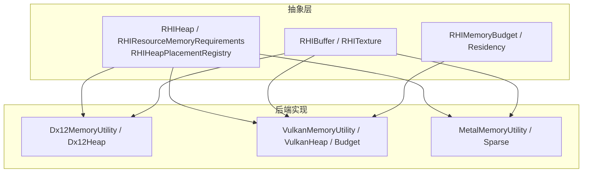
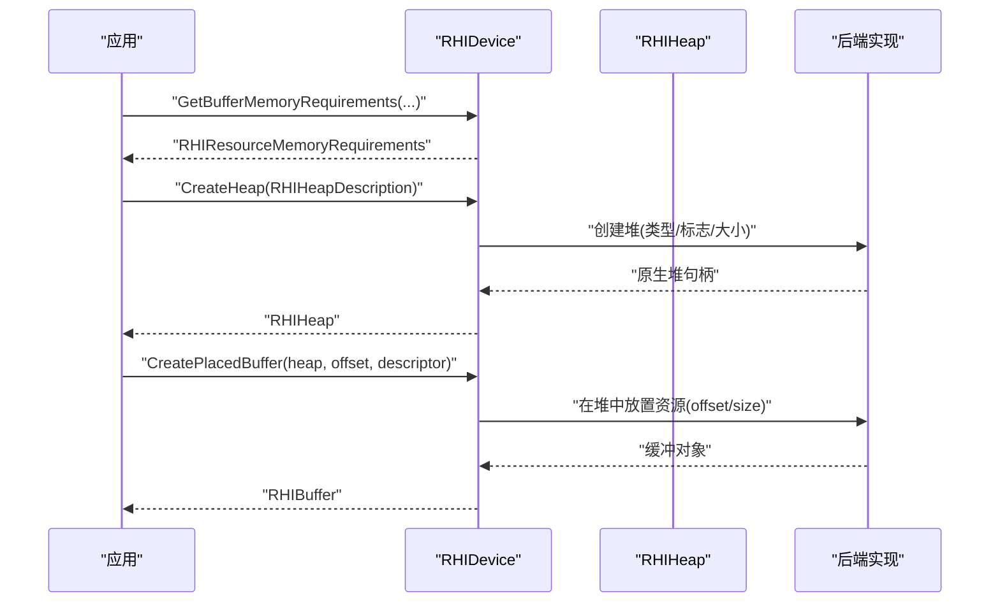
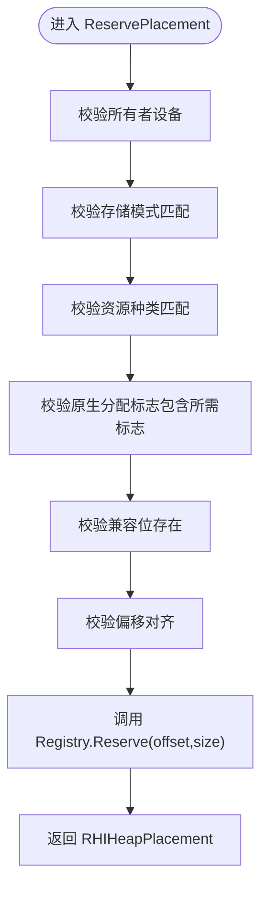
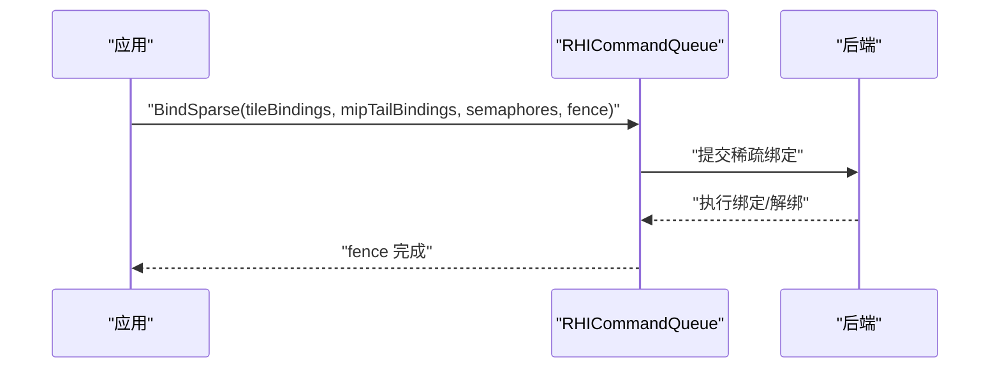
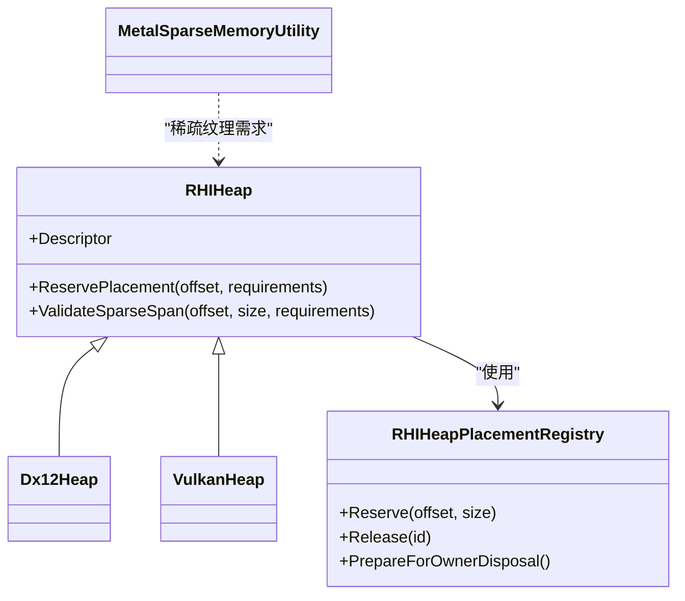

# 内存管理

<cite>
**本文引用的文件**
- [RHIMemory.cs](file://src/SharpGPU/Abstract/RHIMemory.cs)
- [Dx12Memory.cs](file://src/SharpGPU/Dx12/Dx12Memory.cs)
- [VulkanMemory.cs](file://src/SharpGPU/Vulkan/VulkanMemory.cs)
- [MetalMemory.cs](file://src/SharpGPU/Metal/MetalMemory.cs)
- [RHIBuffer.cs](file://src/SharpGPU/Abstract/RHIBuffer.cs)
- [RHITexture.cs](file://src/SharpGPU/Abstract/RHITexture.cs)
- [SharpGpuMemoryMechanismTests.cs](file://tests/SharpGPU.Conformance.Tests/SharpGpuMemoryMechanismTests.cs)
- [SharpGpuMemoryGpuTests.cs](file://tests/SharpGPU.Conformance.Tests/SharpGpuMemoryGpuTests.cs)
</cite>

## 目录
1. [简介](#简介)
2. [项目结构](#项目结构)
3. [核心组件](#核心组件)
4. [架构总览](#架构总览)
5. [详细组件分析](#详细组件分析)
6. [依赖关系分析](#依赖关系分析)
7. [性能考量](#性能考量)
8. [故障排除指南](#故障排除指南)
9. [结论](#结论)
10. [附录](#附录)

## 简介
本文件系统性梳理 SharpGPU 的内存管理机制，覆盖内存分配策略、堆与放置式资源、稀疏纹理、预算查询、驻留性控制、跨后端（Direct3D 12、Vulkan、Metal）的差异与适配，以及内存对齐、屏障与缓存一致性等底层概念。文档同时给出内存泄漏检测、使用统计与性能分析的实践建议，并提供优化最佳实践与示例路径，帮助开发者高效、安全地管理 GPU 内存。

## 项目结构
SharpGPU 将内存抽象统一在 Abstract 层，并通过 Dx12、Vulkan、Metal 三个后端分别实现具体平台细节。测试位于 Conformance.Tests，用于验证内存机制的正确性与跨平台行为。

图表来源
- [RHIMemory.cs:17-116](file://src/SharpGPU/Abstract/RHIMemory.cs#L17-L116)
- [Dx12Memory.cs:7-124](file://src/SharpGPU/Dx12/Dx12Memory.cs#L7-L124)
- [VulkanMemory.cs:7-127](file://src/SharpGPU/Vulkan/VulkanMemory.cs#L7-L127)
- [MetalMemory.cs:8-87](file://src/SharpGPU/Metal/MetalMemory.cs#L8-L87)

章节来源
- [RHIMemory.cs:17-116](file://src/SharpGPU/Abstract/RHIMemory.cs#L17-L116)
- [Dx12Memory.cs:7-124](file://src/SharpGPU/Dx12/Dx12Memory.cs#L7-L124)
- [VulkanMemory.cs:7-127](file://src/SharpGPU/Vulkan/VulkanMemory.cs#L7-L127)
- [MetalMemory.cs:8-87](file://src/SharpGPU/Metal/MetalMemory.cs#L8-L87)

## 核心组件
- 资源内存需求与堆描述：通过 RHIResourceMemoryRequirements 与 RHIHeapDescription 表达大小、对齐、存储模式、兼容性掩码与原生分配标志，确保跨后端一致的资源布局语义。
- 堆与放置式资源：RHIHeap 封装原生堆，RHIHeapPlacementRegistry 负责堆内偏移分配与重叠保护，支持线程安全的预留与释放。
- 稀疏纹理：RHISparseTextureMemoryRequirements 提供虚拟大小、瓦片尺寸、瓦片网格与 mip tail 信息；绑定/解绑通过 RHISparseTextureTileBinding 与队列操作完成。
- 预算与驻留：RHIMemoryBudget 暴露预算与用量；驻留请求通过 ERHIResidencyOperation 驱动后端驻留或驱逐。
- 缓冲区与纹理抽象：RHIBuffer 与 RHITexture 暴露分配模式、映射接口与视图创建，承载不同后端的具体实现。

章节来源
- [RHIMemory.cs:23-116](file://src/SharpGPU/Abstract/RHIMemory.cs#L23-L116)
- [RHIMemory.cs:167-333](file://src/SharpGPU/Abstract/RHIMemory.cs#L167-L333)
- [RHIMemory.cs:353-457](file://src/SharpGPU/Abstract/RHIMemory.cs#L353-L457)
- [RHIMemory.cs:459-800](file://src/SharpGPU/Abstract/RHIMemory.cs#L459-L800)
- [RHIBuffer.cs:6-47](file://src/SharpGPU/Abstract/RHIBuffer.cs#L6-L47)
- [RHITexture.cs:39-141](file://src/SharpGPU/Abstract/RHITexture.cs#L39-L141)

## 架构总览
SharpGPU 采用“抽象 + 后端”的分层设计：
- 抽象层定义统一的内存模型（需求、堆、预算、驻留、稀疏），屏蔽后端差异。
- 后端层将抽象语义映射到具体 API：
  - Direct3D 12：堆类型与资源标志、保留纹理与瓦片查询、驻留性控制。
  - Vulkan：内存类型过滤、扩展预算查询、稀疏图像要求与粒度。
  - Metal：放置稀疏纹理、瓦片尺寸查询、页大小与尾块处理。

图表来源
- [RHIMemory.cs:23-116](file://src/SharpGPU/Abstract/RHIMemory.cs#L23-L116)
- [Dx12Memory.cs:318-355](file://src/SharpGPU/Dx12/Dx12Memory.cs#L318-L355)
- [VulkanMemory.cs:539-728](file://src/SharpGPU/Vulkan/VulkanMemory.cs#L539-L728)

## 详细组件分析

### 内存需求与堆分配
- 内存需求校验：大小非零、对齐为2的幂、兼容性掩码非空，保证后端可正确选择内存类。
- 堆描述校验：堆大小需满足资源需求且对齐；存储模式必须匹配。
- 堆内放置：RHIHeap.ReservePlacement 检查设备归属、存储模式、资源种类、原生标志、兼容位与偏移对齐，返回受保护的 Placement 句柄，防止越界与重叠。
- 稀疏跨度校验：ValidateSparseSpan 确保范围非空、对齐、不溢出且不超出堆大小，并限制仅纹理可用。

图表来源
- [RHIMemory.cs:218-267](file://src/SharpGPU/Abstract/RHIMemory.cs#L218-L267)
- [RHIMemory.cs:353-457](file://src/SharpGPU/Abstract/RHIMemory.cs#L353-L457)

章节来源
- [RHIMemory.cs:23-116](file://src/SharpGPU/Abstract/RHIMemory.cs#L23-L116)
- [RHIMemory.cs:218-333](file://src/SharpGPU/Abstract/RHIMemory.cs#L218-L333)
- [RHIMemory.cs:353-457](file://src/SharpGPU/Abstract/RHIMemory.cs#L353-L457)

### 后端内存类型与堆
- Direct3D 12：
  - 资源描述构建与存储模式校验，纹理强制 GPU 本地存储。
  - 兼容性掩码区分 Buffer、非渲染目标纹理、渲染目标纹理三类。
  - 堆标志根据兼容位选择，创建 ID3D12Heap。
- Vulkan：
  - 内存类型过滤：依据存储模式属性筛选可用的 memoryTypeBits。
  - 预算查询：通过 VK_EXT_memory_budget 聚合 heapBudget 与 heapUsage。
  - 堆创建：vkAllocateMemory，支持附加分配标志。
- Metal：
  - 纹理描述构建，CPU 缓存模式按存储模式设置。
  - 放置稀疏纹理：查询稀疏页大小与瓦片几何，构造稀疏纹理。

章节来源
- [Dx12Memory.cs:7-124](file://src/SharpGPU/Dx12/Dx12Memory.cs#L7-L124)
- [Dx12Memory.cs:318-355](file://src/SharpGPU/Dx12/Dx12Memory.cs#L318-L355)
- [VulkanMemory.cs:7-127](file://src/SharpGPU/Vulkan/VulkanMemory.cs#L7-L127)
- [VulkanMemory.cs:376-533](file://src/SharpGPU/Vulkan/VulkanMemory.cs#L376-L533)
- [VulkanMemory.cs:539-728](file://src/SharpGPU/Vulkan/VulkanMemory.cs#L539-L728)
- [MetalMemory.cs:8-87](file://src/SharpGPU/Metal/MetalMemory.cs#L8-L87)

### 稀疏纹理与瓦片绑定
- 需求查询：
  - DX12：通过 GetResourceTiling 获取标准瓦片与 packed mip tail，计算虚拟大小与瓦片尺寸。
  - Vulkan：vkGetImageSparseMemoryRequirements 获取粒度、标准 mip 数量与 mip tail 信息。
  - Metal：查询 SparseTileSizeInBytes 与 SparseTileSize，计算标准瓦片与尾块大小。
- 绑定流程：
  - 构建 tile 绑定与 mip tail 绑定，提交到命令队列的 BindSparse，使用信号量/栅栏同步。
  - 解绑时仅指定纹理、面、mip、数组层与瓦片区域，不携带堆信息。

图表来源
- [Dx12Memory.cs:191-302](file://src/SharpGPU/Dx12/Dx12Memory.cs#L191-L302)
- [VulkanMemory.cs:206-359](file://src/SharpGPU/Vulkan/VulkanMemory.cs#L206-L359)
- [MetalMemory.cs:219-341](file://src/SharpGPU/Metal/MetalMemory.cs#L219-L341)
- [SharpGpuMemoryGpuTests.cs:324-387](file://tests/SharpGPU.Conformance.Tests/SharpGpuMemoryGpuTests.cs#L324-L387)

章节来源
- [Dx12Memory.cs:130-313](file://src/SharpGPU/Dx12/Dx12Memory.cs#L130-L313)
- [VulkanMemory.cs:133-370](file://src/SharpGPU/Vulkan/VulkanMemory.cs#L133-L370)
- [MetalMemory.cs:92-354](file://src/SharpGPU/Metal/MetalMemory.cs#L92-L354)
- [SharpGpuMemoryGpuTests.cs:263-387](file://tests/SharpGPU.Conformance.Tests/SharpGpuMemoryGpuTests.cs#L263-L387)

### 预算与驻留性
- 预算查询：
  - Vulkan：通过扩展聚合各 heap 的预算与用量，返回 RHIMemoryBudget。
  - 其他后端：能力探测失败时抛出异常或不支持。
- 驻留性：
  - DX12：支持 MakeResident/Evict，通过 fence 等待完成。
  - Vulkan/Metal：当前未提供驻留能力，调用会失败关闭。

章节来源
- [VulkanMemory.cs:376-533](file://src/SharpGPU/Vulkan/VulkanMemory.cs#L376-L533)
- [SharpGpuMemoryGpuTests.cs:16-42](file://tests/SharpGPU.Conformance.Tests/SharpGpuMemoryGpuTests.cs#L16-L42)
- [SharpGpuMemoryGpuTests.cs:222-260](file://tests/SharpGPU.Conformance.Tests/SharpGpuMemoryGpuTests.cs#L222-L260)
- [SharpGpuMemoryGpuTests.cs:121-150](file://tests/SharpGPU.Conformance.Tests/SharpGpuMemoryGpuTests.cs#L121-L150)

### 缓冲区与纹理抽象
- 缓冲区：
  - 描述符包含大小、格式、用途与存储模式。
  - 抽象基类暴露 Map/UnMap 与视图创建，具体后端实现映射与地址管理。
- 纹理：
  - 描述符包含维度、宽高深、mip 数、采样数、格式、用途与存储模式。
  - 支持采样器反馈图配对与模式配置。

章节来源
- [RHIBuffer.cs:6-47](file://src/SharpGPU/Abstract/RHIBuffer.cs#L6-L47)
- [RHITexture.cs:39-141](file://src/SharpGPU/Abstract/RHITexture.cs#L39-L141)

## 依赖关系分析
- 抽象层对后端无直接耦合，通过兼容性掩码与存储模式传递约束。
- 后端各自实现堆创建、资源放置、稀疏瓦片查询与预算/驻留能力。
- 测试用例验证堆放置的对齐、重叠保护、设备归属、稀疏绑定同步与能力探测。

图表来源
- [RHIMemory.cs:167-333](file://src/SharpGPU/Abstract/RHIMemory.cs#L167-L333)
- [RHIMemory.cs:353-457](file://src/SharpGPU/Abstract/RHIMemory.cs#L353-L457)
- [Dx12Memory.cs:318-355](file://src/SharpGPU/Dx12/Dx12Memory.cs#L318-L355)
- [VulkanMemory.cs:539-728](file://src/SharpGPU/Vulkan/VulkanMemory.cs#L539-L728)
- [MetalMemory.cs:92-354](file://src/SharpGPU/Metal/MetalMemory.cs#L92-L354)

章节来源
- [RHIMemory.cs:167-457](file://src/SharpGPU/Abstract/RHIMemory.cs#L167-L457)
- [Dx12Memory.cs:318-355](file://src/SharpGPU/Dx12/Dx12Memory.cs#L318-L355)
- [VulkanMemory.cs:539-728](file://src/SharpGPU/Vulkan/VulkanMemory.cs#L539-L728)
- [MetalMemory.cs:92-354](file://src/SharpGPU/Metal/MetalMemory.cs#L92-L354)

## 性能考量
- 批量分配与复用：
  - 优先使用放置式资源在同一堆内多次分配，减少堆创建与碎片化。
  - 利用 RHIHeapPlacementRegistry 的预留/释放机制，避免重叠与越界。
- 对齐与边界：
  - 严格遵循资源需求的对齐要求，避免无效访问与性能退化。
- 稀疏纹理：
  - 按需绑定瓦片，减少显存占用；合理划分 mip tail 以平衡延迟与带宽。
- 预算感知：
  - 查询预算并在接近阈值时调整资源规模或触发驱逐，避免 OOM。
- 映射与缓存一致性：
  - Vulkan 共享映射使用 Invalidate/Flush 确保 CPU/GPU 一致性；Metal 按存储模式设置 CPU 缓存模式。

[本节为通用指导，无需特定文件引用]

## 故障排除指南
- 常见错误与定位：
  - 对齐错误：偏移或大小未对齐导致 ReservePlacement 抛出参数异常。
  - 重叠冲突：同一堆内重复预留相同范围引发 InvalidOperationException。
  - 设备归属不一致：requirements 与 heap 所属设备不同导致 ArgumentException。
  - 存储模式不匹配：堆与资源的存储模式不一致。
  - 稀疏绑定参数非法：操作枚举无效、面掩码非法、解绑携带堆信息等。
- 调试步骤：
  - 打印 RHIResourceMemoryRequirements 的大小、对齐与兼容性掩码。
  - 检查堆大小与对齐是否满足所有资源需求。
  - 确认稀疏纹理的瓦片尺寸与 mip tail 对齐。
  - 使用测试用例中的断言思路复现问题，逐步缩小范围。

章节来源
- [SharpGpuMemoryMechanismTests.cs:16-81](file://tests/SharpGPU.Conformance.Tests/SharpGpuMemoryMechanismTests.cs#L16-L81)
- [SharpGpuMemoryMechanismTests.cs:147-190](file://tests/SharpGPU.Conformance.Tests/SharpGpuMemoryMechanismTests.cs#L147-L190)
- [SharpGpuMemoryMechanismTests.cs:192-327](file://tests/SharpGPU.Conformance.Tests/SharpGpuMemoryMechanismTests.cs#L192-L327)

## 结论
SharpGPU 通过统一的抽象层与多后端实现，提供了稳健的内存管理机制：严格的内存需求与堆管理、灵活的放置式资源、精细的稀疏纹理控制、预算与驻留能力探测。借助测试覆盖与清晰的错误语义，开发者可以高效地进行内存优化与故障排查。建议在大型应用中结合预算感知、批量分配与稀疏技术，以获得更优的显存利用率与运行时稳定性。

[本节为总结，无需特定文件引用]

## 附录

### 内存类型与使用场景
- 设备内存（GPU Local）：适合高频读写的纹理与缓冲，减少拷贝开销。
- 主机上传内存（Host Upload）：适合从 CPU 向 GPU 传输数据。
- 统一内存（如适用）：由后端决定映射策略，注意缓存一致性与同步。

章节来源
- [Dx12Memory.cs:115-123](file://src/SharpGPU/Dx12/Dx12Memory.cs#L115-L123)
- [VulkanMemory.cs:92-118](file://src/SharpGPU/Vulkan/VulkanMemory.cs#L92-L118)
- [MetalMemory.cs:68-73](file://src/SharpGPU/Metal/MetalMemory.cs#L68-L73)

### 内存对齐与屏障
- 对齐要求：资源需求中的 Alignment 必须为2的幂，堆内偏移与大小均需对齐。
- 屏障与一致性：
  - Vulkan 共享映射使用 Invalidate/Flush 保证一致性。
  - 纹理与缓冲使用前需进行状态转换与屏障（由上层编码器处理）。

章节来源
- [RHIMemory.cs:23-77](file://src/SharpGPU/Abstract/RHIMemory.cs#L23-L77)
- [VulkanMemory.cs:591-672](file://src/SharpGPU/Vulkan/VulkanMemory.cs#L591-L672)

### 内存泄漏检测与统计
- 泄漏检测：
  - 确保所有 RHIHeapPlacement 在使用后释放，避免堆无法销毁。
  - 使用测试中的并发预留/释放场景验证竞态条件。
- 使用统计：
  - 通过 QueryMemoryBudget 获取预算与用量，监控趋势。
  - 记录堆创建次数、放置资源数量与稀疏绑定频率。

章节来源
- [RHIMemory.cs:353-457](file://src/SharpGPU/Abstract/RHIMemory.cs#L353-L457)
- [VulkanMemory.cs:376-533](file://src/SharpGPU/Vulkan/VulkanMemory.cs#L376-L533)
- [SharpGpuMemoryMechanismTests.cs:83-145](file://tests/SharpGPU.Conformance.Tests/SharpGpuMemoryMechanismTests.cs#L83-L145)

### 优化最佳实践
- 内存复用：
  - 重用堆与放置资源，减少频繁分配。
  - 将相似生命周期资源放入同一堆。
- 批量分配：
  - 预先计算所需堆大小并对齐，一次性分配。
  - 使用 ReservePlacement 顺序分配，避免碎片。
- 碎片整理：
  - 定期重建堆或迁移活跃资源，降低碎片率。
  - 结合预算查询在低水位时触发整理。

[本节为通用指导，无需特定文件引用]

### 跨平台差异与适配
- Direct3D 12：
  - 纹理强制 GPU 本地存储；堆标志与资源类别严格对应。
  - 支持驻留性控制。
- Vulkan：
  - 内存类型过滤基于属性；预算通过扩展查询。
  - 稀疏纹理粒度与 mip tail 由设备报告。
- Metal：
  - 放置稀疏纹理页大小与瓦片几何由设备查询。
  - 不支持驻留性。

章节来源
- [Dx12Memory.cs:29-71](file://src/SharpGPU/Dx12/Dx12Memory.cs#L29-L71)
- [VulkanMemory.cs:33-90](file://src/SharpGPU/Vulkan/VulkanMemory.cs#L33-L90)
- [MetalMemory.cs:22-73](file://src/SharpGPU/Metal/MetalMemory.cs#L22-L73)

### 代码示例路径
- 放置式缓冲与预算查询：
  - [SharpGpuMemoryGpuTests.cs:153-220](file://tests/SharpGPU.Conformance.Tests/SharpGpuMemoryGpuTests.cs#L153-L220)
- DX12 驻留性：
  - [SharpGpuMemoryGpuTests.cs:222-260](file://tests/SharpGPU.Conformance.Tests/SharpGpuMemoryGpuTests.cs#L222-L260)
- 稀疏纹理绑定与解绑：
  - [SharpGpuMemoryGpuTests.cs:263-387](file://tests/SharpGPU.Conformance.Tests/SharpGpuMemoryGpuTests.cs#L263-L387)
- 堆放置对齐与重叠保护：
  - [SharpGpuMemoryMechanismTests.cs:16-81](file://tests/SharpGPU.Conformance.Tests/SharpGpuMemoryMechanismTests.cs#L16-L81)