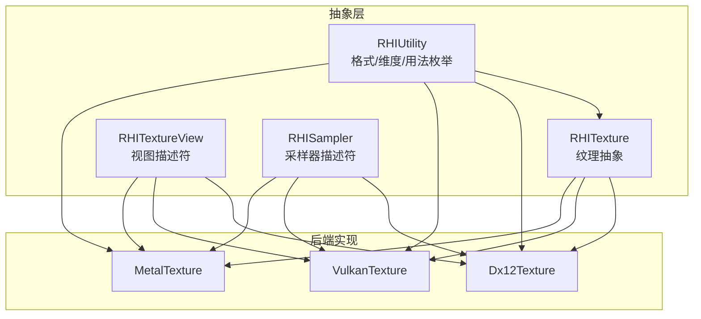
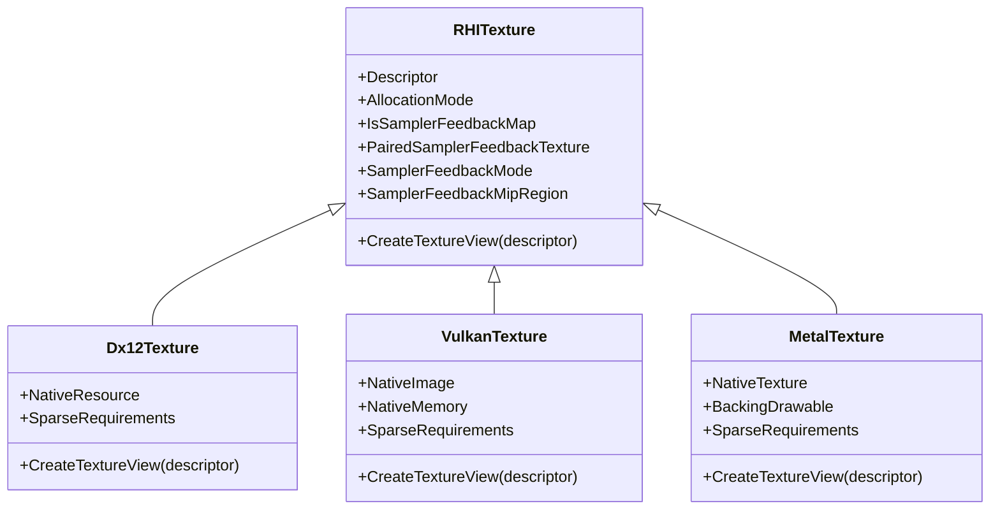
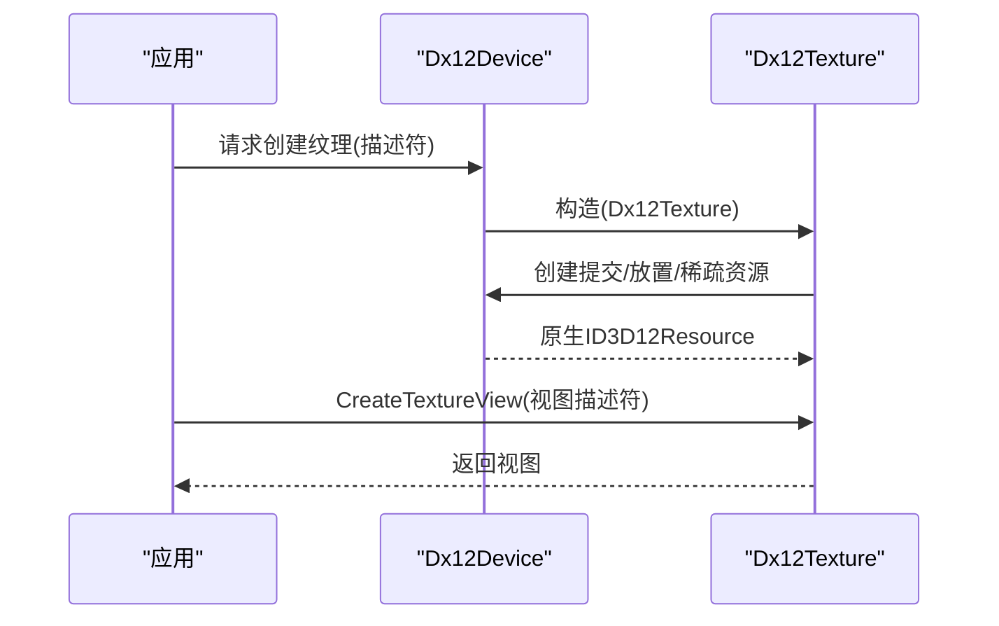
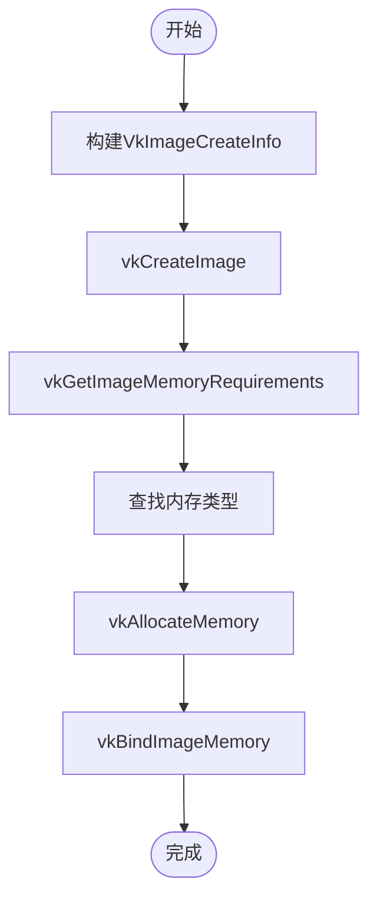
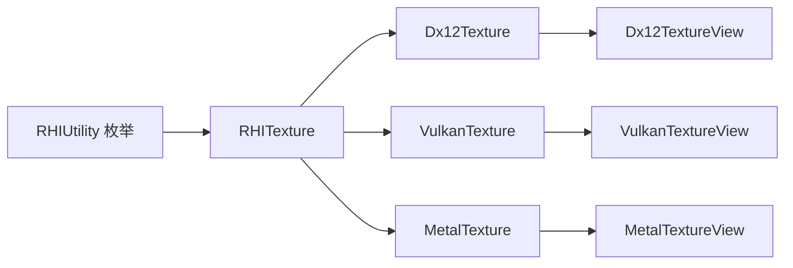

# 纹理管理

<cite>
**本文引用的文件**
- [RHITexture.cs](file://src/SharpGPU/Abstract/RHITexture.cs)
- [RHIUtility.cs](file://src/SharpGPU/Abstract/RHIUtility.cs)
- [RHITextureView.cs](file://src/SharpGPU/Abstract/RHITextureView.cs)
- [RHISampler.cs](file://src/SharpGPU/Abstract/RHISampler.cs)
- [Dx12Texture.cs](file://src/SharpGPU/Dx12/Dx12Texture.cs)
- [VulkanTexture.cs](file://src/SharpGPU/Vulkan/VulkanTexture.cs)
- [MetalTexture.cs](file://src/SharpGPU/Metal/MetalTexture.cs)
</cite>

## 目录
1. [简介](#简介)
2. [项目结构](#项目结构)
3. [核心组件](#核心组件)
4. [架构总览](#架构总览)
5. [详细组件分析](#详细组件分析)
6. [依赖关系分析](#依赖关系分析)
7. [性能考虑](#性能考虑)
8. [故障排查指南](#故障排查指南)
9. [结论](#结论)
10. [附录：使用示例与最佳实践](#附录使用示例与最佳实践)

## 简介
本文件围绕 SharpGPU 的纹理管理能力，系统性阐述 RHITexture 抽象类的设计理念、后端实现（DirectX 12、Vulkan、Metal）以及跨后端的统一接口。内容涵盖纹理格式支持、维度配置、Mipmap 生成、采样器绑定、创建流程、内存布局、数据上传与更新机制；并覆盖不同纹理类型（2D、2DMS、Cube、CubeArray、3D）的使用场景与配置选项，压缩格式、多采样、动态更新等高级特性，同时给出性能优化策略、内存使用最佳实践和常见问题诊断方法。

## 项目结构
SharpGPU 将纹理抽象定义在 Abstract 层，具体后端实现位于 Dx12、Vulkan、Metal 三个目录中。纹理视图与采样器相关描述符也集中在 Abstract 层，便于跨后端复用。

图表来源
- [RHITexture.cs:50-139](file://src/SharpGPU/Abstract/RHITexture.cs#L50-L139)
- [RHIUtility.cs:184-277](file://src/SharpGPU/Abstract/RHIUtility.cs#L184-L277)
- [RHIUtility.cs:353-363](file://src/SharpGPU/Abstract/RHIUtility.cs#L353-L363)
- [RHIUtility.cs:644-654](file://src/SharpGPU/Abstract/RHIUtility.cs#L644-L654)
- [RHITextureView.cs:5-16](file://src/SharpGPU/Abstract/RHITextureView.cs#L5-L16)
- [RHISampler.cs:6-19](file://src/SharpGPU/Abstract/RHISampler.cs#L6-L19)
- [Dx12Texture.cs:7-199](file://src/SharpGPU/Dx12/Dx12Texture.cs#L7-L199)
- [VulkanTexture.cs:8-247](file://src/SharpGPU/Vulkan/VulkanTexture.cs#L8-L247)
- [MetalTexture.cs:9-197](file://src/SharpGPU/Metal/MetalTexture.cs#L9-L197)

章节来源
- [RHITexture.cs:50-139](file://src/SharpGPU/Abstract/RHITexture.cs#L50-L139)
- [RHIUtility.cs:184-277](file://src/SharpGPU/Abstract/RHIUtility.cs#L184-L277)
- [RHIUtility.cs:353-363](file://src/SharpGPU/Abstract/RHIUtility.cs#L353-L363)
- [RHIUtility.cs:644-654](file://src/SharpGPU/Abstract/RHIUtility.cs#L644-L654)
- [RHITextureView.cs:5-16](file://src/SharpGPU/Abstract/RHITextureView.cs#L5-L16)
- [RHISampler.cs:6-19](file://src/SharpGPU/Abstract/RHISampler.cs#L6-L19)
- [Dx12Texture.cs:7-199](file://src/SharpGPU/Dx12/Dx12Texture.cs#L7-L199)
- [VulkanTexture.cs:8-247](file://src/SharpGPU/Vulkan/VulkanTexture.cs#L8-L247)
- [MetalTexture.cs:9-197](file://src/SharpGPU/Metal/MetalTexture.cs#L9-L197)

## 核心组件
- RHITexture：纹理抽象基类，提供统一的描述符访问、分配模式、采样反馈图能力与视图创建入口。
- RHITextureDescriptor：纹理创建描述符，包含 Mipmap 数量、尺寸、像素格式、采样数、存储模式、用途标志、维度。
- RHITextureViewDescriptor：视图描述符，指定 Mip/数组切片范围与视图类型。
- RHIUtility 中的枚举：像素格式、纹理维度、采样数、用途标志、地址模式、过滤模式等。
- RHISampler：采样器描述符，控制 LOD、各向异性、过滤与寻址模式。

章节来源
- [RHITexture.cs:39-139](file://src/SharpGPU/Abstract/RHITexture.cs#L39-L139)
- [RHITextureView.cs:5-16](file://src/SharpGPU/Abstract/RHITextureView.cs#L5-L16)
- [RHIUtility.cs:184-277](file://src/SharpGPU/Abstract/RHIUtility.cs#L184-L277)
- [RHIUtility.cs:353-363](file://src/SharpGPU/Abstract/RHIUtility.cs#L353-L363)
- [RHIUtility.cs:434-441](file://src/SharpGPU/Abstract/RHIUtility.cs#L434-L441)
- [RHIUtility.cs:644-654](file://src/SharpGPU/Abstract/RHIUtility.cs#L644-L654)
- [RHISampler.cs:6-19](file://src/SharpGPU/Abstract/RHISampler.cs#L6-L19)

## 架构总览
SharpGPU 通过 RHITexture 抽象出跨后端一致的纹理对象，各后端实现负责将描述符转换为原生资源（DX12 ID3D12Resource、Vulkan VkImage、Metal MTLTexture），并处理内存分配、稀疏资源、外部资源包装等细节。纹理视图由后端根据描述符创建，用于着色器或计算阶段访问。

图表来源
- [RHITexture.cs:50-139](file://src/SharpGPU/Abstract/RHITexture.cs#L50-L139)
- [Dx12Texture.cs:7-199](file://src/SharpGPU/Dx12/Dx12Texture.cs#L7-L199)
- [VulkanTexture.cs:8-247](file://src/SharpGPU/Vulkan/VulkanTexture.cs#L8-L247)
- [MetalTexture.cs:9-197](file://src/SharpGPU/Metal/MetalTexture.cs#L9-L197)

## 详细组件分析

### RHITexture 抽象设计与通用能力
- 描述符与分配模式：通过 Descriptor 暴露创建参数，AllocationMode 指示 Committed/Placed/Sparse/External 等分配方式。
- 采样反馈图：支持创建不透明采样反馈图，并在创建时绑定被采样的纹理与 mip 区域，避免编码器阶段错误配对。
- 视图创建：统一入口 CreateTextureView，交由后端实现具体视图构建。

章节来源
- [RHITexture.cs:39-139](file://src/SharpGPU/Abstract/RHITexture.cs#L39-L139)

### DirectX 12 后端实现（Dx12Texture）
- 创建路径：
  - 提交资源：基于堆属性与资源描述创建 ID3D12Resource。
  - 放置资源：从堆偏移处创建资源，记录 Placement。
  - 稀疏资源：预留纹理并查询需求。
  - 外部资源：包装已有原生资源，标记为 External 分配模式。
- 采样反馈图：专用工厂方法创建不透明反馈图，设置 mip 区域并与目标采样纹理建立配对。
- 视图创建：返回 Dx12TextureView。

图表来源
- [Dx12Texture.cs:30-83](file://src/SharpGPU/Dx12/Dx12Texture.cs#L30-L83)
- [Dx12Texture.cs:118-132](file://src/SharpGPU/Dx12/Dx12Texture.cs#L118-L132)
- [Dx12Texture.cs:134-180](file://src/SharpGPU/Dx12/Dx12Texture.cs#L134-L180)
- [Dx12Texture.cs:182-186](file://src/SharpGPU/Dx12/Dx12Texture.cs#L182-L186)

章节来源
- [Dx12Texture.cs:30-186](file://src/SharpGPU/Dx12/Dx12Texture.cs#L30-L186)

### Vulkan 后端实现（VulkanTexture）
- 创建路径：
  - 常规纹理：创建 VkImage，查询内存需求，选择内存类型并分配，绑定图像与内存。
  - 放置纹理：从堆内存偏移绑定图像。
  - 稀疏纹理：创建稀疏图像并查询需求。
  - 外部纹理：包装已有 VkImage，标记为 External。
- 子资源范围规范化：提供工具函数校验 aspect、mip、array 范围是否越界，确保一致性。
- 视图创建：返回 VulkanTextureView。

图表来源
- [VulkanTexture.cs:43-107](file://src/SharpGPU/Vulkan/VulkanTexture.cs#L43-L107)
- [VulkanTexture.cs:109-147](file://src/SharpGPU/Vulkan/VulkanTexture.cs#L109-L147)
- [VulkanTexture.cs:149-186](file://src/SharpGPU/Vulkan/VulkanTexture.cs#L149-L186)
- [VulkanTexture.cs:253-343](file://src/SharpGPU/Vulkan/VulkanTexture.cs#L253-L343)

章节来源
- [VulkanTexture.cs:43-247](file://src/SharpGPU/Vulkan/VulkanTexture.cs#L43-L247)
- [VulkanTexture.cs:253-343](file://src/SharpGPU/Vulkan/VulkanTexture.cs#L253-L343)

### Metal 后端实现（MetalTexture）
- 创建路径：
  - 常规纹理：构建 MTLTextureDescriptor 并通过设备创建。
  - 放置纹理：从堆创建纹理。
  - 稀疏纹理：创建稀疏纹理并查询需求。
  - 外部纹理：包装已有 MTLTexture，可选择是否拥有所有权。
- 反向构建描述符：可从原生纹理反推 RHI 描述符（维度、格式、采样数、存储模式等）。
- 视图创建：返回 MetalTextureView。

章节来源
- [MetalTexture.cs:23-197](file://src/SharpGPU/Metal/MetalTexture.cs#L23-L197)

### 纹理格式与维度、用途、采样
- 像素格式：包含基础浮点/整数、深度模板、块压缩（DXT/BC/ASTC）、自适应压缩、YUV 视频格式及采样反馈专用不透明格式。
- 纹理维度：2D、2DMS、2DArray、2DArrayMS、Cube、CubeArray、3D。
- 用途标志：CopySrc/CopyDst、DepthStencil、RenderTarget、ResolveTarget、ShaderResource、UnorderedAccess。
- 采样数：None/Count2/Count4/Count8。
- 地址模式与过滤：Repeat/ClampToEdge/MirrorRepeat；Point/Linear/Anisotropic。
- 比较模式：Never/Less/Equal/LessEqual/Greater/NotEqual/GreaterEqual/Always。

章节来源
- [RHIUtility.cs:184-277](file://src/SharpGPU/Abstract/RHIUtility.cs#L184-L277)
- [RHIUtility.cs:353-363](file://src/SharpGPU/Abstract/RHIUtility.cs#L353-L363)
- [RHIUtility.cs:365-379](file://src/SharpGPU/Abstract/RHIUtility.cs#L365-L379)
- [RHIUtility.cs:434-441](file://src/SharpGPU/Abstract/RHIUtility.cs#L434-L441)
- [RHIUtility.cs:495-506](file://src/SharpGPU/Abstract/RHIUtility.cs#L495-L506)
- [RHIUtility.cs:644-654](file://src/SharpGPU/Abstract/RHIUtility.cs#L644-L654)

### 纹理视图与采样器绑定
- 视图描述符：可指定 Mip 数量、起始 Mip、数组数量、起始数组切片与视图类型（ShaderResource/UnorderedAccess）。
- 采样器描述符：LOD 范围、Mip LOD Bias、各向异性级别、过滤模式、寻址模式、比较模式。
- 绑定流程：纹理通过视图暴露给管线，采样器作为独立对象绑定到着色器阶段，二者组合决定采样行为。

章节来源
- [RHITextureView.cs:5-16](file://src/SharpGPU/Abstract/RHITextureView.cs#L5-L16)
- [RHISampler.cs:6-19](file://src/SharpGPU/Abstract/RHISampler.cs#L6-L19)

### 采样反馈图（Sampler Feedback Map）
- 目的：记录采样过程中使用的最小 Mip 或 Mip 区域使用情况，用于优化纹理流式加载与带宽。
- 创建：仅能通过设备级 API 创建，并在创建时绑定被采样的纹理与 mip 区域。
- 后端差异：DX12 提供专用不透明格式与资源描述字段以启用反馈区域；其他后端遵循抽象语义。

章节来源
- [RHITexture.cs:7-37](file://src/SharpGPU/Abstract/RHITexture.cs#L7-L37)
- [RHITexture.cs:69-139](file://src/SharpGPU/Abstract/RHITexture.cs#L69-L139)
- [Dx12Texture.cs:134-180](file://src/SharpGPU/Dx12/Dx12Texture.cs#L134-L180)

## 依赖关系分析
- RHITexture 依赖 RHIUtility 的枚举定义，保证跨后端一致的配置语义。
- 各后端实现依赖各自内存与工具模块（如 Dx12MemoryUtility、VulkanMemoryUtility、MetalMemoryUtility）将描述符转为原生资源。
- 视图创建依赖后端视图实现，采样器作为独立对象参与管线绑定。

图表来源
- [RHIUtility.cs:184-277](file://src/SharpGPU/Abstract/RHIUtility.cs#L184-L277)
- [RHITexture.cs:50-139](file://src/SharpGPU/Abstract/RHITexture.cs#L50-L139)
- [Dx12Texture.cs:182-186](file://src/SharpGPU/Dx12/Dx12Texture.cs#L182-L186)
- [VulkanTexture.cs:206-210](file://src/SharpGPU/Vulkan/VulkanTexture.cs#L206-L210)
- [MetalTexture.cs:178-182](file://src/SharpGPU/Metal/MetalTexture.cs#L178-L182)

章节来源
- [RHIUtility.cs:184-277](file://src/SharpGPU/Abstract/RHIUtility.cs#L184-L277)
- [RHITexture.cs:50-139](file://src/SharpGPU/Abstract/RHITexture.cs#L50-L139)
- [Dx12Texture.cs:182-186](file://src/SharpGPU/Dx12/Dx12Texture.cs#L182-L186)
- [VulkanTexture.cs:206-210](file://src/SharpGPU/Vulkan/VulkanTexture.cs#L206-L210)
- [MetalTexture.cs:178-182](file://src/SharpGPU/Metal/MetalTexture.cs#L178-L182)

## 性能考虑
- 选择合适的像素格式：优先使用压缩格式（DXT/BC/ASTC）降低带宽与显存占用；对精度敏感的路径使用浮点格式。
- 合理设置用途标志：仅在需要时使用 RenderTarget/DepthStencil/UnorderedAccess，减少状态切换与屏障开销。
- 多采样渲染：使用 2DMS/2DArrayMS 配合 ResolveTarget 进行抗锯齿，注意 resolve 阶段的额外成本。
- Mipmap 与 LOD：为静态纹理预生成 Mipmap，减少运行时缩放开销；合理设置采样器的 LODMin/LODBias。
- 内存分配模式：
  - Committed：简单直接，适合小对象或一次性资源。
  - Placed：批量分配，减少碎片，适合大量同构纹理。
  - Sparse：按需驻留，适合超大纹理或体积纹理。
  - External：与外部系统共享资源，避免重复拷贝。
- 数据上传与更新：
  - 使用 GPUUpload/HostUpload 存储模式结合命令缓冲进行批量上传。
  - 频繁更新的动态纹理建议采用 UnorderedAccess 或 Compute 写入，减少 CPU-GPU 同步。
- 采样反馈：启用采样反馈图以减少不必要的 Mip 加载，提升流式加载效率。

[本节为通用指导，无需特定文件引用]

## 故障排查指南
- 创建失败：
  - DX12：检查 HRESULT 与 DeviceRemovedReason，确认堆属性与资源状态是否正确。
  - Vulkan：检查 vkCreateImage/vkAllocateMemory/vkBindImageMemory 的错误码，确认内存类型与属性匹配。
  - Metal：检查 MTLTexture 创建返回值，确认描述符与设备能力兼容。
- 视图范围越界：
  - Vulkan 子资源范围规范化会抛出异常，检查 BaseMipLevel、MipLevelCount、BaseArrayLayer、ArrayLayerCount 是否在有效范围内。
- 用途不合法：
  - 各后端在包装外部纹理时会校验 ERHITextureUsage，确保为非零且已知位组合。
- 采样反馈图：
  - 必须通过设备级 API 创建并建立配对，不能在编码器阶段临时绑定。

章节来源
- [Dx12Texture.cs:47-52](file://src/SharpGPU/Dx12/Dx12Texture.cs#L47-L52)
- [Dx12Texture.cs:118-132](file://src/SharpGPU/Dx12/Dx12Texture.cs#L118-L132)
- [VulkanTexture.cs:188-204](file://src/SharpGPU/Vulkan/VulkanTexture.cs#L188-L204)
- [VulkanTexture.cs:253-343](file://src/SharpGPU/Vulkan/VulkanTexture.cs#L253-L343)
- [MetalTexture.cs:127-146](file://src/SharpGPU/Metal/MetalTexture.cs#L127-L146)

## 结论
SharpGPU 通过 RHITexture 抽象提供了跨后端的统一纹理管理接口，后端实现分别封装了各自的资源创建、内存管理与视图构建逻辑。借助丰富的格式与维度支持、灵活的用途标志与采样器配置，开发者可以高效地构建高性能图形与计算管线。合理使用压缩格式、多采样、Mipmap、采样反馈与合适的内存分配模式，是获得稳定性能的关键。

[本节为总结性内容，无需特定文件引用]

## 附录：使用示例与最佳实践
以下示例以“步骤说明”形式展示正确使用方法，具体代码请参照对应源文件路径。

- 创建 2D 纹理（含 Mipmap）
  - 步骤：
    - 准备 RHITextureDescriptor：设置 Extent、Format、MipCount、StorageMode、UsageFlag、Dimension=Texture2D。
    - 调用设备创建纹理（各后端内部构造相应纹理对象）。
    - 创建视图：设置 ViewType=ShaderResource，指定 BaseMipLevel 与 MipCount。
  - 参考路径
    - [RHITexture.cs:39-48](file://src/SharpGPU/Abstract/RHITexture.cs#L39-L48)
    - [RHIUtility.cs:353-363](file://src/SharpGPU/Abstract/RHIUtility.cs#L353-L363)
    - [RHIUtility.cs:644-654](file://src/SharpGPU/Abstract/RHIUtility.cs#L644-L654)
    - [RHITextureView.cs:5-16](file://src/SharpGPU/Abstract/RHITextureView.cs#L5-L16)

- 创建 3D 纹理（体素数据）
  - 步骤：
    - Dimension=Texture3D，Extent.z 表示深度层数。
    - UsageFlag 包含 ShaderResource 或 UnorderedAccess（视读写需求）。
    - 可选：启用 Mipmap 以提升采样质量。
  - 参考路径
    - [RHIUtility.cs:353-363](file://src/SharpGPU/Abstract/RHIUtility.cs#L353-L363)
    - [RHIUtility.cs:644-654](file://src/SharpGPU/Abstract/RHIUtility.cs#L644-L654)

- 创建立方体贴图（Cube/CubeArray）
  - 步骤：
    - Dimension=TextureCube 或 TextureCubeArray。
    - CubeArray 的 Extent.z 表示面片数量（通常为 6 的倍数）。
    - 常用于环境贴图、反射/折射效果。
  - 参考路径
    - [RHIUtility.cs:353-363](file://src/SharpGPU/Abstract/RHIUtility.cs#L353-L363)

- 多采样纹理（MSAA）
  - 步骤：
    - SampleCount=Count2/Count4/Count8，Dimension=Texture2DMS 或 Texture2DArrayMS。
    - 渲染至 MSAA 纹理后，使用 ResolveTarget 进行解析。
  - 参考路径
    - [RHIUtility.cs:434-441](file://src/SharpGPU/Abstract/RHIUtility.cs#L434-L441)
    - [RHIUtility.cs:644-654](file://src/SharpGPU/Abstract/RHIUtility.cs#L644-L654)

- 压缩纹理（DXT/BC/ASTC）
  - 步骤：
    - 选择合适压缩格式（如 RGBA_BC7_SRGB、RGBA_ASTC8X8_UNorm）。
    - 注意平台支持与解码成本，尽量在离线阶段生成压缩资源。
  - 参考路径
    - [RHIUtility.cs:234-268](file://src/SharpGPU/Abstract/RHIUtility.cs#L234-L268)

- 动态纹理更新（CPU 写入）
  - 步骤：
    - 使用 StorageMode=GPUUpload/HostUpload，配合命令缓冲进行数据上传。
    - 若需 GPU 侧频繁写入，使用 UnorderedAccess 并在计算着色器中更新。
  - 参考路径
    - [RHIUtility.cs:569-577](file://src/SharpGPU/Abstract/RHIUtility.cs#L569-L577)
    - [RHIUtility.cs:644-654](file://src/SharpGPU/Abstract/RHIUtility.cs#L644-L654)

- 采样器绑定与过滤
  - 步骤：
    - 配置 RHISamplerDescriptor：设置 LodMin/LodMax、MipLODBias、Anisotropy、MinFilter/MagFilter/MipFilter、AddressModeU/V/W、ComparisonMode。
    - 将采样器与纹理视图绑定到着色器阶段。
  - 参考路径
    - [RHISampler.cs:6-19](file://src/SharpGPU/Abstract/RHISampler.cs#L6-L19)
    - [RHIUtility.cs:365-379](file://src/SharpGPU/Abstract/RHIUtility.cs#L365-L379)
    - [RHIUtility.cs:495-506](file://src/SharpGPU/Abstract/RHIUtility.cs#L495-L506)

- 采样反馈图
  - 步骤：
    - 通过设备级 API 创建采样反馈图，并绑定被采样纹理与 mip 区域。
    - 在渲染/计算中使用反馈图记录采样信息，驱动纹理流式加载。
  - 参考路径
    - [RHITexture.cs:7-37](file://src/SharpGPU/Abstract/RHITexture.cs#L7-L37)
    - [RHITexture.cs:69-139](file://src/SharpGPU/Abstract/RHITexture.cs#L69-L139)
    - [Dx12Texture.cs:134-180](file://src/SharpGPU/Dx12/Dx12Texture.cs#L134-L180)