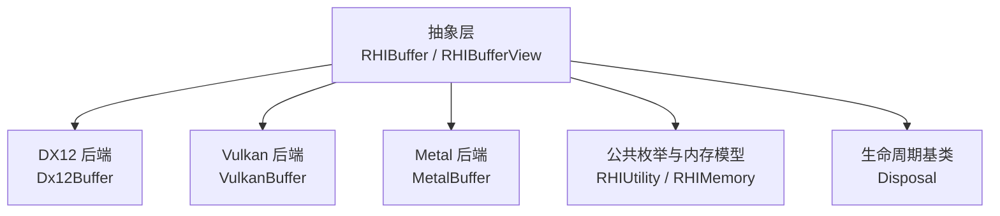
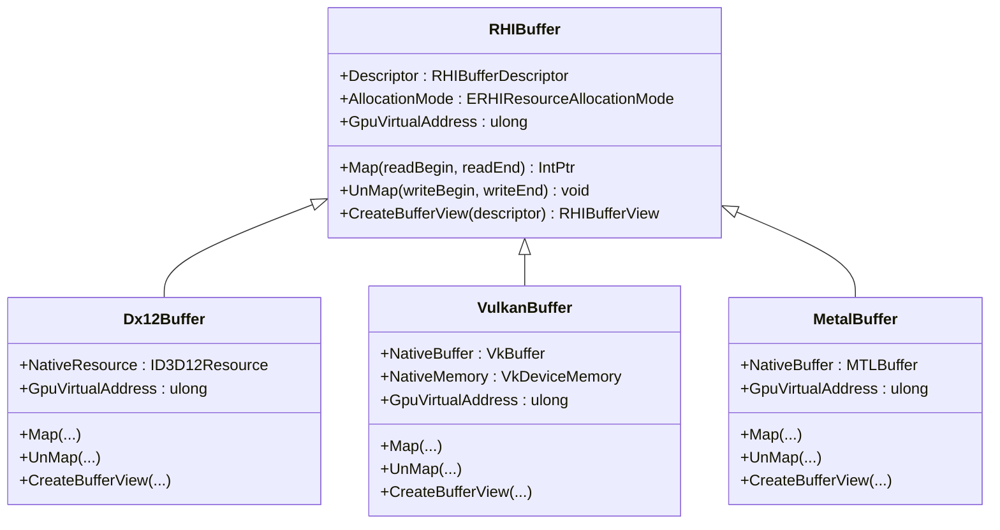
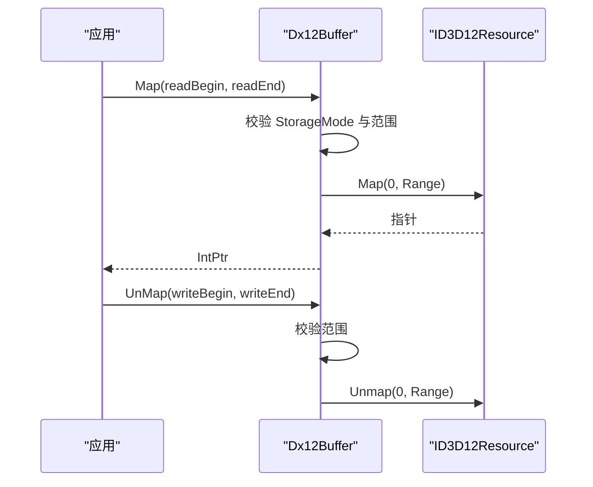
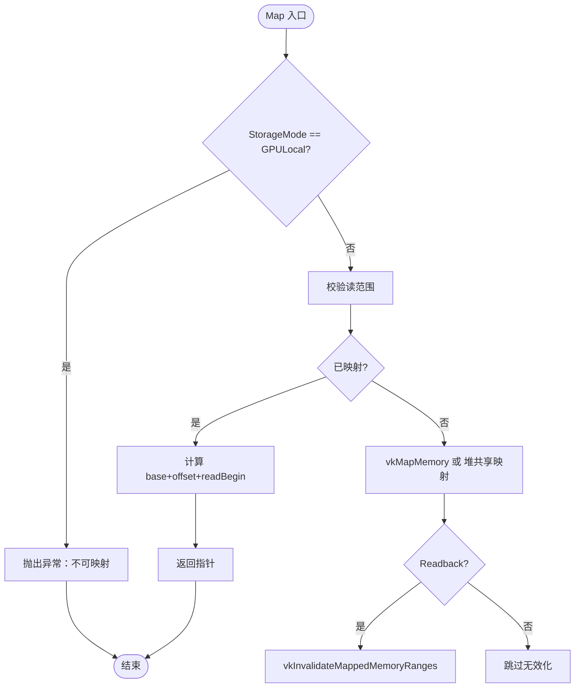
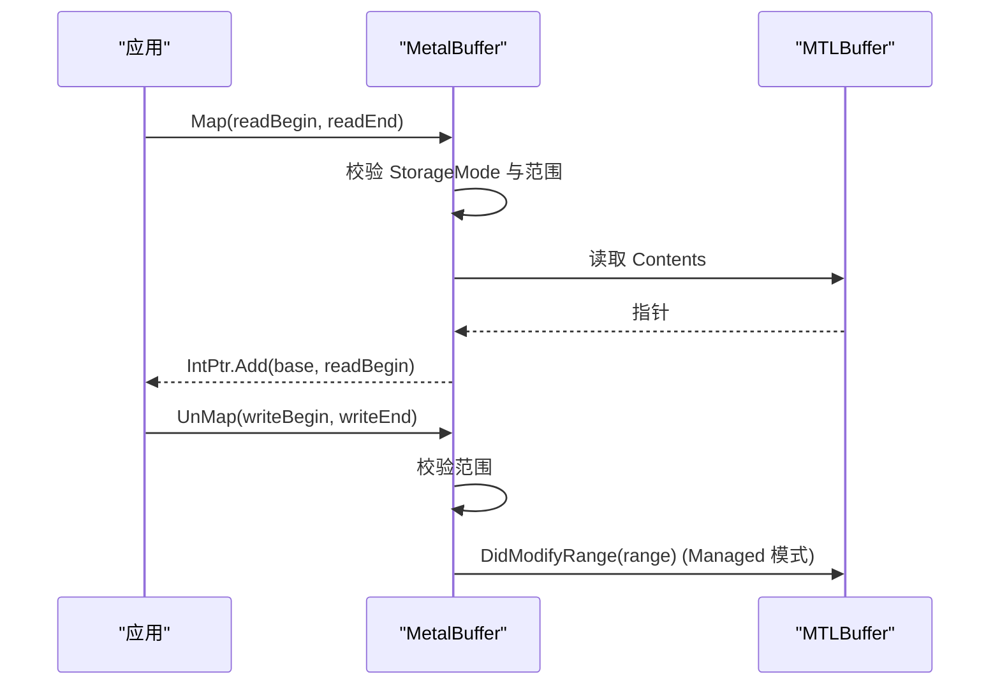
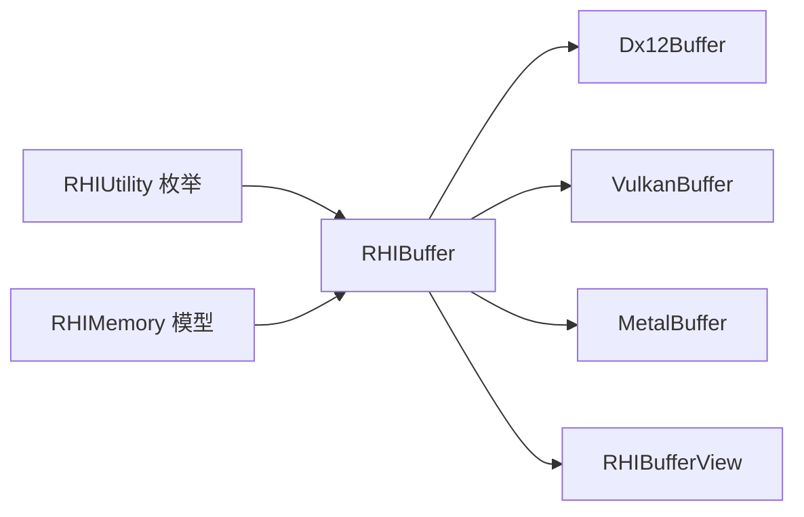

# 缓冲区管理

<cite>
**本文引用的文件**
- [RHIBuffer.cs](file://src/SharpGPU/Abstract/RHIBuffer.cs)
- [RHIUtility.cs](file://src/SharpGPU/Abstract/RHIUtility.cs)
- [RHIMemory.cs](file://src/SharpGPU/Abstract/RHIMemory.cs)
- [Disposal.cs](file://src/SharpGPU/Common/Core/Disposal.cs)
- [Dx12Buffer.cs](file://src/SharpGPU/Dx12/Dx12Buffer.cs)
- [VulkanBuffer.cs](file://src/SharpGPU/Vulkan/VulkanBuffer.cs)
- [MetalBuffer.cs](file://src/SharpGPU/Metal/MetalBuffer.cs)
- [RHIBufferView.cs](file://src/SharpGPU/Abstract/RHIBufferView.cs)
</cite>

## 目录
1. [简介](#简介)
2. [项目结构](#项目结构)
3. [核心组件](#核心组件)
4. [架构总览](#架构总览)
5. [详细组件分析](#详细组件分析)
6. [依赖关系分析](#依赖关系分析)
7. [性能考量](#性能考量)
8. [故障排查指南](#故障排查指南)
9. [结论](#结论)
10. [附录：最佳实践与示例路径](#附录：最佳实践与示例路径)

## 简介
本文件聚焦 SharpGPU 的缓冲区管理机制，围绕抽象接口 RHIBuffer 及其三大后端实现（DX12、Vulkan、Metal）展开，系统阐述以下主题：
- 缓冲区描述符配置：大小、格式、用途标志、存储模式
- 内存分配模式选择：Committed、Placed、External、Sparse
- GPU 虚拟地址访问：各后端的获取方式与限制
- 缓冲区的创建流程与数据映射机制（Map/UnMap）
- 存储模式设置与用途标志配置对行为的影响
- 不同后端在缓冲区实现上的差异与优化策略
- 使用最佳实践：性能优化、内存泄漏防护、常见问题定位

## 项目结构
SharpGPU 将缓冲区抽象定义在 Abstract 层，具体后端实现在 Dx12、Vulkan、Metal 三个子目录中。公共枚举与内存模型位于 Abstract/RHIUtility.cs 与 Abstract/RHIMemory.cs；资源生命周期基类位于 Common/Core/Disposal.cs。

图表来源
- [RHIBuffer.cs:14-47](file://src/SharpGPU/Abstract/RHIBuffer.cs#L14-L47)
- [RHIUtility.cs:569-641](file://src/SharpGPU/Abstract/RHIUtility.cs#L569-L641)
- [RHIMemory.cs:9-15](file://src/SharpGPU/Abstract/RHIMemory.cs#L9-L15)
- [Disposal.cs:7-63](file://src/SharpGPU/Common/Core/Disposal.cs#L7-L63)

章节来源
- [RHIBuffer.cs:1-47](file://src/SharpGPU/Abstract/RHIBuffer.cs#L1-L47)
- [RHIUtility.cs:569-641](file://src/SharpGPU/Abstract/RHIUtility.cs#L569-L641)
- [RHIMemory.cs:9-15](file://src/SharpGPU/Abstract/RHIMemory.cs#L9-L15)
- [Disposal.cs:7-63](file://src/SharpGPU/Common/Core/Disposal.cs#L7-L63)

## 核心组件
- RHIBufferDescriptor：描述缓冲区大小、格式、用途标志、存储模式
- RHIBuffer：抽象缓冲区对象，提供 Map/UnMap、CreateBufferView、GpuVirtualAddress 等能力
- ERHIStorageMode：存储模式（GPULocal、Readback、GPUUpload、HostUpload、Memoryless）
- ERHIBufferUsage：用途标志（CopySrc/CopyDst、IndexBuffer/VertexBuffer、UniformBuffer、IndirectBuffer、ShaderResource、UnorderedAccess、AccelStruct）
- ERHIResourceAllocationMode：分配模式（Committed、Placed、Sparse、External）
- RHIBufferViewDescriptor：视图描述（Count、Offset、Stride、ViewType）

章节来源
- [RHIBuffer.cs:6-47](file://src/SharpGPU/Abstract/RHIBuffer.cs#L6-L47)
- [RHIUtility.cs:569-641](file://src/SharpGPU/Abstract/RHIUtility.cs#L569-L641)
- [RHIMemory.cs:9-15](file://src/SharpGPU/Abstract/RHIMemory.cs#L9-L15)
- [RHIBufferView.cs:5-16](file://src/SharpGPU/Abstract/RHIBufferView.cs#L5-L16)

## 架构总览
下图展示了缓冲区从抽象到后端实现的层次关系，以及关键能力（创建、映射、视图、GPU 地址）的流向。

图表来源
- [RHIBuffer.cs:14-47](file://src/SharpGPU/Abstract/RHIBuffer.cs#L14-L47)
- [Dx12Buffer.cs:8-147](file://src/SharpGPU/Dx12/Dx12Buffer.cs#L8-L147)
- [VulkanBuffer.cs:7-339](file://src/SharpGPU/Vulkan/VulkanBuffer.cs#L7-L339)
- [MetalBuffer.cs:8-139](file://src/SharpGPU/Metal/MetalBuffer.cs#L8-L139)

## 详细组件分析

### 抽象层：RHIBuffer 与描述符
- 描述符字段
  - ByteSize：缓冲区字节大小
  - Format：缓冲区元素格式（如 UInt16/UInt32）
  - UsageFlag：用途标志组合（例如 ShaderResource、UnorderedAccess、UniformBuffer 等）
  - StorageMode：存储模式（决定 CPU/GPU 访问语义与是否可映射）
- 分配模式
  - Committed：由后端直接提交资源（DX12 CreateCommittedResource）
  - Placed：通过堆偏移放置资源（DX12 CreatePlacedResource / Vulkan vkBindBufferMemory 指定偏移 / Metal MTLHeap.NewBuffer 指定偏移）
  - External：外部资源包装
  - Sparse：稀疏绑定（主要用于纹理，缓冲区一般不采用）
- GPU 虚拟地址
  - 默认抛出“不支持”，由各后端按需暴露
- 映射接口
  - Map/readBegin/readEnd：返回可读指针或偏移后的指针
  - UnMap/writeBegin/writeEnd：释放映射并可选刷新缓存
- 视图创建
  - CreateBufferView：基于 RHIBufferViewDescriptor 生成后端视图

章节来源
- [RHIBuffer.cs:6-47](file://src/SharpGPU/Abstract/RHIBuffer.cs#L6-L47)
- [RHIUtility.cs:569-641](file://src/SharpGPU/Abstract/RHIUtility.cs#L569-L641)
- [RHIMemory.cs:9-15](file://src/SharpGPU/Abstract/RHIMemory.cs#L9-L15)
- [RHIBufferView.cs:5-16](file://src/SharpGPU/Abstract/RHIBufferView.cs#L5-L16)

### DX12 后端：Dx12Buffer
- 创建
  - Committed：调用 CreateCommittedResource，根据 StorageMode 转换 HeapProperties 与初始状态
  - Placed：调用 CreatePlacedResource，绑定到已有堆与偏移
  - External：直接包装外部 ID3D12Resource
- 映射
  - 仅非 GPULocal 可映射；校验范围合法性；调用 ID3D12Resource.Map 返回指针
  - Unmap：调用 ID3D12Resource.Unmap
- GPU 虚拟地址
  - 通过 ID3D12Resource.GPUVirtualAddress 暴露
- 视图
  - 创建 Dx12BufferView

图表来源
- [Dx12Buffer.cs:37-86](file://src/SharpGPU/Dx12/Dx12Buffer.cs#L37-L86)
- [Dx12Buffer.cs:99-133](file://src/SharpGPU/Dx12/Dx12Buffer.cs#L99-L133)
- [Dx12Buffer.cs:24-32](file://src/SharpGPU/Dx12/Dx12Buffer.cs#L24-L32)

章节来源
- [Dx12Buffer.cs:8-147](file://src/SharpGPU/Dx12/Dx12Buffer.cs#L8-L147)

### Vulkan 后端：VulkanBuffer
- 创建
  - Committed：vkCreateBuffer + vkGetBufferMemoryRequirements + vkAllocateMemory + vkBindBufferMemory
  - Placed：vkCreateBuffer + vkBindBufferMemory(指定 heapOffset)，不拥有内存
  - 支持设备地址：当 usage 包含 ShaderDeviceAddress 时，附加 DeviceAddress 标志
- 映射
  - 仅非 GPULocal 可映射；首次 Map 时 vkMapMemory 或复用堆共享映射；Readback 模式会执行 InvalidateMappedMemoryRanges
  - UnMap：Write 模式（GPUUpload/HostUpload）会 FlushMappedMemoryRanges，然后 vkUnmapMemory
- GPU 虚拟地址
  - 通过 vkGetBufferDeviceAddress 获取，需启用相应能力
- 视图
  - 创建 VulkanBufferView

图表来源
- [VulkanBuffer.cs:65-138](file://src/SharpGPU/Vulkan/VulkanBuffer.cs#L65-L138)
- [VulkanBuffer.cs:192-250](file://src/SharpGPU/Vulkan/VulkanBuffer.cs#L192-L250)
- [VulkanBuffer.cs:252-303](file://src/SharpGPU/Vulkan/VulkanBuffer.cs#L252-L303)
- [VulkanBuffer.cs:30-52](file://src/SharpGPU/Vulkan/VulkanBuffer.cs#L30-L52)

章节来源
- [VulkanBuffer.cs:7-339](file://src/SharpGPU/Vulkan/VulkanBuffer.cs#L7-L339)

### Metal 后端：MetalBuffer
- 创建
  - Committed：MTLDevice.NewBuffer，按 StorageMode 选择选项
  - Placed：MTLHeap.NewBuffer(长度, 选项, offset)
  - External：包装外部 MTLBuffer
- 映射
  - 仅非 GPULocal/Memoryless 可映射；返回 Contents 指针并按 readBegin 偏移
  - UnMap：若为 Managed 存储模式，调用 DidModifyRange 通知修改区域
- GPU 虚拟地址
  - 通过 MTLBuffer.GpuAddress 获取；若为 0 则抛出不支持
- 视图
  - 创建 MetalBufferView

图表来源
- [MetalBuffer.cs:31-83](file://src/SharpGPU/Metal/MetalBuffer.cs#L31-L83)
- [MetalBuffer.cs:85-120](file://src/SharpGPU/Metal/MetalBuffer.cs#L85-L120)
- [MetalBuffer.cs:12-24](file://src/SharpGPU/Metal/MetalBuffer.cs#L12-L24)

章节来源
- [MetalBuffer.cs:8-139](file://src/SharpGPU/Metal/MetalBuffer.cs#L8-L139)

### 视图：RHIBufferView
- 描述符字段：Count、Offset、Stride、ViewType（UniformBuffer、ShaderResource、UnorderedAccess、AccelStruct）
- 各后端分别实现具体视图类型以适配原生 API

章节来源
- [RHIBufferView.cs:5-16](file://src/SharpGPU/Abstract/RHIBufferView.cs#L5-L16)

## 依赖关系分析
- 抽象层依赖
  - RHIBuffer 依赖 RHIUtility 中的枚举（ERHIStorageMode、ERHIBufferUsage、ERHIBufferFormat、ERHIBufferViewType）
  - RHIBuffer 继承 Disposal，确保资源释放
  - 分配模式与堆管理依赖 RHIMemory（RHIResourceMemoryRequirements、RHIHeap、RHIHeapPlacement）
- 后端依赖
  - Dx12Buffer 依赖 ID3D12Resource 与堆属性转换
  - VulkanBuffer 依赖 VkBuffer/VkDeviceMemory 与设备地址查询
  - MetalBuffer 依赖 MTLBuffer 与托管内存同步

图表来源
- [RHIUtility.cs:569-641](file://src/SharpGPU/Abstract/RHIUtility.cs#L569-L641)
- [RHIMemory.cs:9-15](file://src/SharpGPU/Abstract/RHIMemory.cs#L9-L15)
- [RHIBuffer.cs:14-47](file://src/SharpGPU/Abstract/RHIBuffer.cs#L14-L47)

章节来源
- [RHIUtility.cs:569-641](file://src/SharpGPU/Abstract/RHIUtility.cs#L569-L641)
- [RHIMemory.cs:9-15](file://src/SharpGPU/Abstract/RHIMemory.cs#L9-L15)
- [RHIBuffer.cs:14-47](file://src/SharpGPU/Abstract/RHIBuffer.cs#L14-L47)

## 性能考量
- 存储模式选择
  - GPULocal：GPU 独占，性能最优但不可映射；适合纯 GPU 读写
  - GPUUpload/HostUpload：用于上传数据，配合合适的屏障与批量写入减少同步开销
  - Readback：用于下载结果，注意 InvalidateMappedMemoryRanges 的必要性
  - Memoryless：仅特定平台可用，通常不可映射
- 映射与缓存一致性
  - Vulkan：Write 路径需要 FlushMappedMemoryRanges；Read 路径需要 InvalidateMappedMemoryRanges
  - Metal：Managed 模式下需调用 DidModifyRange 通知修改区域
  - DX12：Map/Unmap 由驱动处理缓存一致性，但仍需避免频繁映射
- 分配模式
  - Committed：简单但可能碎片化；适合小对象或一次性资源
  - Placed：通过堆集中分配，减少碎片、提升批量化效率
- 用途标志最小化
  - 仅声明必要用途（如 ShaderResource 或 UnorderedAccess），避免不必要的状态切换与验证开销
- GPU 虚拟地址
  - 仅在需要时使用（如动态索引、间接绘制），并确保后端能力满足

[本节为通用指导，不直接分析具体文件]

## 故障排查指南
- 映射失败
  - 检查 StorageMode 是否为 GPULocal/Memoryless（这些模式禁止映射）
  - 校验 readBegin/readEnd 或 writeBegin/writeEnd 是否在缓冲区范围内
  - Vulkan：确认未重复 Unmap；必要时先 Flush/Invalidate
- GPU 虚拟地址不可用
  - DX12：资源必须支持 GVA；某些堆类型或状态可能不支持
  - Vulkan：需启用设备地址能力并通过 vkGetBufferDeviceAddress 获取
  - Metal：若 GpuAddress 为 0，表示该缓冲区未暴露 GPU 地址
- 内存泄漏
  - 确保所有 RHIBuffer 实例被正确 Dispose；Disposal 基类会在调试模式下检测未释放对象
  - 对于 Placed 资源，确保 RHIHeapPlacement 被正确释放
- 视图创建失败
  - 检查 RHIBufferViewDescriptor 的 Count/Stride/Offset 是否与缓冲区实际布局一致

章节来源
- [Dx12Buffer.cs:99-133](file://src/SharpGPU/Dx12/Dx12Buffer.cs#L99-L133)
- [VulkanBuffer.cs:192-303](file://src/SharpGPU/Vulkan/VulkanBuffer.cs#L192-L303)
- [MetalBuffer.cs:85-120](file://src/SharpGPU/Metal/MetalBuffer.cs#L85-L120)
- [Disposal.cs:13-23](file://src/SharpGPU/Common/Core/Disposal.cs#L13-L23)

## 结论
SharpGPU 的缓冲区管理通过统一的抽象接口屏蔽了后端差异，同时提供了灵活的存储模式与分配模式以满足不同场景的性能需求。DX12、Vulkan、Metal 各自实现了高效的映射与视图机制，并在 GPU 虚拟地址方面提供了必要的支持。遵循最佳实践（合理选择存储模式、最小化用途标志、正确使用 Map/UnMap、及时释放资源）可以显著提升性能并避免常见陷阱。

[本节为总结性内容，不直接分析具体文件]

## 附录：最佳实践与示例路径
- 正确的缓冲区管理模式
  - 创建阶段：根据用途选择 StorageMode 与 UsageFlag；优先使用 Placed 分配以减少碎片
  - 数据更新：尽量批量写入并使用 GPUUpload/HostUpload；避免每帧频繁 Map/Unmap
  - 映射与同步：Vulkan 写路径 Flush，读路径 Invalidate；Metal Managed 模式调用 DidModifyRange
  - 视图绑定：使用 RHIBufferViewDescriptor 精确描述 Count/Stride/Offset，避免越界
  - 资源释放：使用 using 或显式 Dispose；确保 Placed 资源的 Placement 也被释放
- 参考实现路径（不包含代码内容）
  - 抽象接口与描述符：[RHIBuffer.cs:6-47](file://src/SharpGPU/Abstract/RHIBuffer.cs#L6-L47)、[RHIUtility.cs:569-641](file://src/SharpGPU/Abstract/RHIUtility.cs#L569-L641)
  - DX12 后端：[Dx12Buffer.cs:37-133](file://src/SharpGPU/Dx12/Dx12Buffer.cs#L37-L133)
  - Vulkan 后端：[VulkanBuffer.cs:65-303](file://src/SharpGPU/Vulkan/VulkanBuffer.cs#L65-L303)
  - Metal 后端：[MetalBuffer.cs:31-120](file://src/SharpGPU/Metal/MetalBuffer.cs#L31-L120)
  - 视图描述：[RHIBufferView.cs:5-16](file://src/SharpGPU/Abstract/RHIBufferView.cs#L5-L16)
  - 生命周期基类：[Disposal.cs:7-63](file://src/SharpGPU/Common/Core/Disposal.cs#L7-L63)

[本节为指引性内容，不直接分析具体文件]