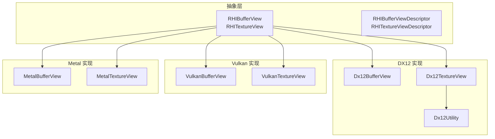
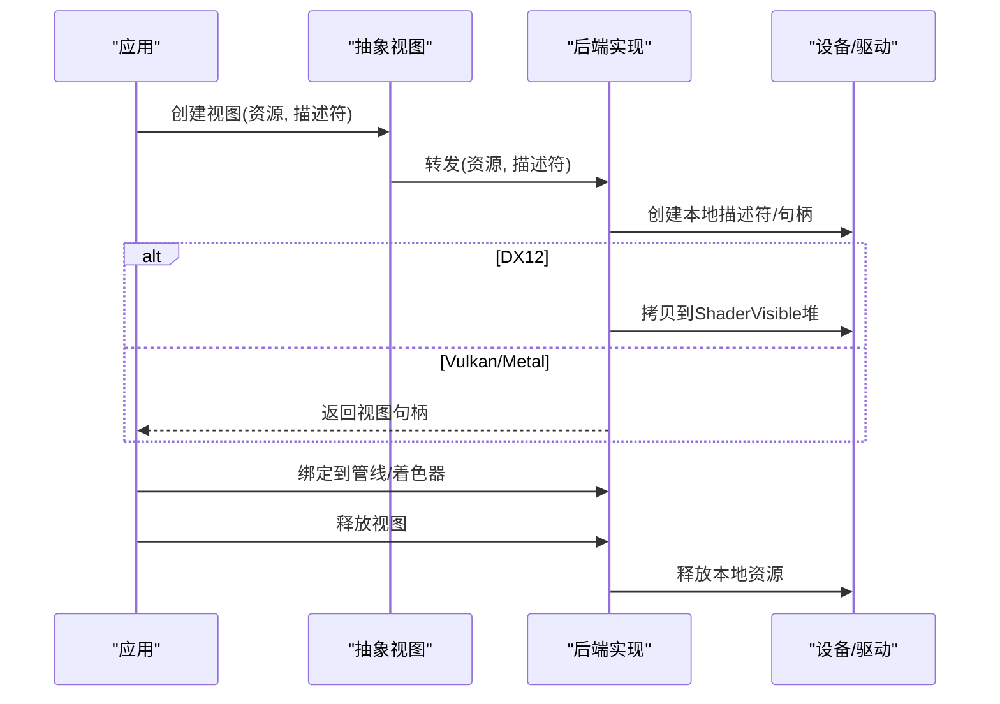
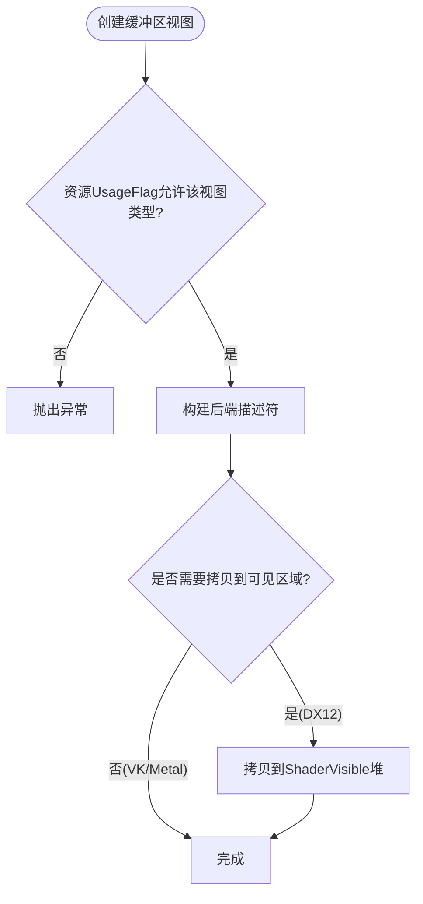
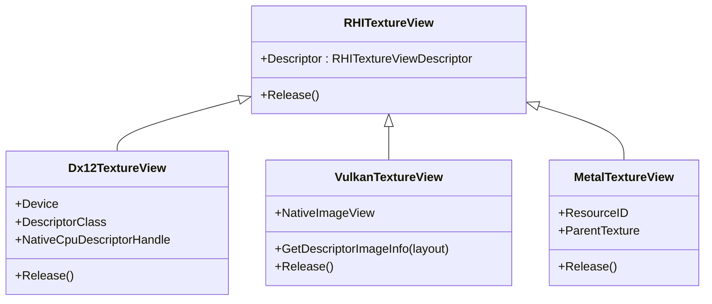
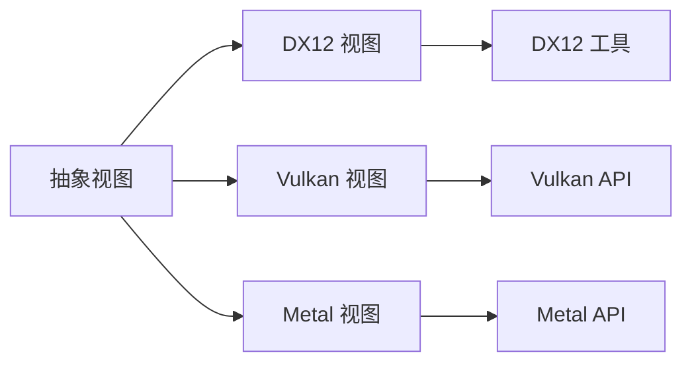

# 视图管理

<cite>
**本文引用的文件**
- [RHIBufferView.cs](file://src/SharpGPU/Abstract/RHIBufferView.cs)
- [RHITextureView.cs](file://src/SharpGPU/Abstract/RHITextureView.cs)
- [Dx12BufferView.cs](file://src/SharpGPU/Dx12/Dx12BufferView.cs)
- [Dx12TextureView.cs](file://src/SharpGPU/Dx12/Dx12TextureView.cs)
- [Dx12Utility.cs](file://src/SharpGPU/Dx12/Dx12Utility.cs)
- [VulkanBufferView.cs](file://src/SharpGPU/Vulkan/VulkanBufferView.cs)
- [VulkanTextureView.cs](file://src/SharpGPU/Vulkan/VulkanTextureView.cs)
- [MetalBufferView.cs](file://src/SharpGPU/Metal/MetalBufferView.cs)
- [MetalTextureView.cs](file://src/SharpGPU/Metal/MetalTextureView.cs)
- [RHIUtility.cs](file://src/SharpGPU/Abstract/RHIUtility.cs)
</cite>

## 目录
1. [简介](#简介)
2. [项目结构](#项目结构)
3. [核心组件](#核心组件)
4. [架构总览](#架构总览)
5. [详细组件分析](#详细组件分析)
6. [依赖关系分析](#依赖关系分析)
7. [性能考量](#性能考量)
8. [故障排查指南](#故障排查指南)
9. [结论](#结论)
10. [附录：最佳实践与示例路径](#附录最佳实践与示例路径)

## 简介
本文件聚焦 SharpGPU 的“视图管理”，系统阐述缓冲区视图与纹理视图的概念、作用、描述符配置、资源绑定机制与生命周期管理。文档覆盖着色器资源视图（SRV）、无序访问视图（UAV）、渲染目标视图（RTV）等类型的使用场景与参数，说明视图与底层资源的关联、内存共享与同步考虑，并给出在渲染管线中的角色、性能影响与优化策略，最后提供避免重复创建、合理配置范围及常见陷阱的最佳实践与代码示例路径。

## 项目结构
SharpGPU 采用抽象接口 + 多后端实现的组织方式：
- 抽象层定义统一的视图描述符与基类，屏蔽后端差异
- 各后端（DX12、Vulkan、Metal）实现具体视图对象，负责创建本地描述符/句柄、拷贝到可见区域、释放资源
- 工具类提供格式转换、维度映射、填充视图描述等通用逻辑

图表来源
- [RHIBufferView.cs:5-16](file://src/SharpGPU/Abstract/RHIBufferView.cs#L5-L16)
- [RHITextureView.cs:5-21](file://src/SharpGPU/Abstract/RHITextureView.cs#L5-L21)
- [Dx12BufferView.cs:5-123](file://src/SharpGPU/Dx12/Dx12BufferView.cs#L5-L123)
- [Dx12TextureView.cs:6-122](file://src/SharpGPU/Dx12/Dx12TextureView.cs#L6-L122)
- [Dx12Utility.cs:2156-2301](file://src/SharpGPU/Dx12/Dx12Utility.cs#L2156-L2301)
- [VulkanBufferView.cs:5-35](file://src/SharpGPU/Vulkan/VulkanBufferView.cs#L5-L35)
- [VulkanTextureView.cs:5-67](file://src/SharpGPU/Vulkan/VulkanTextureView.cs#L5-L67)
- [MetalBufferView.cs:3-20](file://src/SharpGPU/Metal/MetalBufferView.cs#L3-L20)
- [MetalTextureView.cs:106-165](file://src/SharpGPU/Metal/MetalTextureView.cs#L106-L165)

章节来源
- [RHIBufferView.cs:1-18](file://src/SharpGPU/Abstract/RHIBufferView.cs#L1-L18)
- [RHITextureView.cs:1-23](file://src/SharpGPU/Abstract/RHITextureView.cs#L1-L23)

## 核心组件
- 缓冲区视图描述符 RHIBufferViewDescriptor：包含 Count、Offset、Stride、ViewType，用于指定缓冲区的子集与步长，以及视图用途（如 SRV/UAV/UniformBuffer/AccelStruct）。
- 纹理视图描述符 RHITextureViewDescriptor：包含 MipCount、BaseMipLevel、ArrayCount、BaseArraySlice、ViewType，用于限定 mipmap 层级、数组切片和视图用途（如 SRV/UAV）。
- 抽象基类 RHIBufferView / RHITextureView：统一生命周期管理与后端无关的接口。
- 后端实现：
  - DX12：通过描述符对（Staging + ShaderVisible）创建并拷贝至 GPU 可见堆；支持 SRV/UAV/UniformBuffer/AccelStruct。
  - Vulkan：构造 VkImageView/VkDescriptorBufferInfo，按布局提交使用。
  - Metal：使用池化索引与 MTLTextureView 或全视图快速路径，减少对象创建。

章节来源
- [RHIBufferView.cs:5-16](file://src/SharpGPU/Abstract/RHIBufferView.cs#L5-L16)
- [RHITextureView.cs:5-21](file://src/SharpGPU/Abstract/RHITextureView.cs#L5-L21)
- [Dx12BufferView.cs:38-113](file://src/SharpGPU/Dx12/Dx12BufferView.cs#L38-L113)
- [Dx12TextureView.cs:39-112](file://src/SharpGPU/Dx12/Dx12TextureView.cs#L39-L112)
- [VulkanBufferView.cs:14-31](file://src/SharpGPU/Vulkan/VulkanBufferView.cs#L14-L31)
- [VulkanTextureView.cs:17-67](file://src/SharpGPU/Vulkan/VulkanTextureView.cs#L17-L67)
- [MetalTextureView.cs:118-165](file://src/SharpGPU/Metal/MetalTextureView.cs#L118-L165)

## 架构总览
视图管理的核心流程：
- 应用层根据资源用途选择视图类型，填写描述符（偏移、范围、步长、mip/array 范围等）
- 调用后端视图构造函数，内部校验资源使用标志位是否允许该视图类型
- 后端创建本地描述符/句柄，必要时拷贝到 GPU 可见区域（DX12），或直接生成图像视图（Vulkan/Metal）
- 在命令编码阶段将视图绑定到着色器/渲染通道，并在合适的屏障后使用
- 视图析构时释放对应后端资源（DX12 释放描述符对，Vulkan 销毁图像视图，Metal 归还池索引）

图表来源
- [Dx12BufferView.cs:38-113](file://src/SharpGPU/Dx12/Dx12BufferView.cs#L38-L113)
- [Dx12TextureView.cs:39-112](file://src/SharpGPU/Dx12/Dx12TextureView.cs#L39-L112)
- [VulkanTextureView.cs:17-67](file://src/SharpGPU/Vulkan/VulkanTextureView.cs#L17-L67)
- [MetalTextureView.cs:118-165](file://src/SharpGPU/Metal/MetalTextureView.cs#L118-L165)

## 详细组件分析

### 缓冲区视图（Buffer View）
- 描述符字段
  - Count：元素数量（用于结构化缓冲）
  - Offset：起始字节偏移
  - Stride：元素步长（结构化缓冲必须非零）
  - ViewType：SRV/UAV/UniformBuffer/AccelStruct
- 后端行为
  - DX12：依据 ViewType 构建 CBV/SRV/UAV/AS 描述符，写入 Staging 堆并拷贝到 ShaderVisible 堆；若资源 UsageFlag 不匹配则抛错
  - Vulkan：返回 VkDescriptorBufferInfo，range 由 ViewType 决定（UniformBuffer 用 Stride，其他用 Count*Stride）
  - Metal：轻量包装，保留描述符供上层组合使用
- 典型用法
  - SRV：读取结构化缓冲数据
  - UAV：读写/原子操作
  - UniformBuffer：常量缓冲绑定
  - AccelStruct：光线追踪加速结构引用

图表来源
- [Dx12BufferView.cs:38-113](file://src/SharpGPU/Dx12/Dx12BufferView.cs#L38-L113)
- [VulkanBufferView.cs:14-31](file://src/SharpGPU/Vulkan/VulkanBufferView.cs#L14-L31)

章节来源
- [RHIBufferView.cs:5-16](file://src/SharpGPU/Abstract/RHIBufferView.cs#L5-L16)
- [Dx12BufferView.cs:38-113](file://src/SharpGPU/Dx12/Dx12BufferView.cs#L38-L113)
- [VulkanBufferView.cs:14-31](file://src/SharpGPU/Vulkan/VulkanBufferView.cs#L14-L31)
- [MetalBufferView.cs:3-20](file://src/SharpGPU/Metal/MetalBufferView.cs#L3-L20)

### 纹理视图（Texture View）
- 描述符字段
  - BaseMipLevel/MipCount：mipmap 范围
  - BaseArraySlice/ArrayCount：数组切片范围
  - ViewType：SRV/UAV（RTV/DSV 通常由渲染附件直接管理，但工具函数提供填充方法）
- 后端行为
  - DX12：根据维度与类型填充 SRV/UAV 描述符；采样反馈图有额外约束（不可作为可读 SRV，UAV 需配对采样纹理存活）
  - Vulkan：创建 VkImageView，设置 subresourceRange 为 mip/array 范围
  - Metal：优先使用全视图快速路径，否则创建 MTLTextureView；使用池化索引降低分配开销
- 典型用法
  - SRV：采样纹理
  - UAV：计算着色写入
  - RTV/DSV：渲染/深度模板输出（工具函数提供填充）

图表来源
- [RHITextureView.cs:5-21](file://src/SharpGPU/Abstract/RHITextureView.cs#L5-L21)
- [Dx12TextureView.cs:6-122](file://src/SharpGPU/Dx12/Dx12TextureView.cs#L6-L122)
- [VulkanTextureView.cs:5-67](file://src/SharpGPU/Vulkan/VulkanTextureView.cs#L5-L67)
- [MetalTextureView.cs:106-165](file://src/SharpGPU/Metal/MetalTextureView.cs#L106-L165)

章节来源
- [RHITextureView.cs:5-21](file://src/SharpGPU/Abstract/RHITextureView.cs#L5-L21)
- [Dx12TextureView.cs:39-112](file://src/SharpGPU/Dx12/Dx12TextureView.cs#L39-L112)
- [VulkanTextureView.cs:17-67](file://src/SharpGPU/Vulkan/VulkanTextureView.cs#L17-L67)
- [MetalTextureView.cs:118-165](file://src/SharpGPU/Metal/MetalTextureView.cs#L118-L165)

### 视图描述符与工具
- DX12 工具函数集中填充各类视图描述符（SRV/UAV/RTV/DSV），按维度选择性填充字段，避免无效赋值
- 视图类型枚举定义于抽象层，统一语义

章节来源
- [Dx12Utility.cs:2156-2301](file://src/SharpGPU/Dx12/Dx12Utility.cs#L2156-L2301)
- [RHIUtility.cs:634-660](file://src/SharpGPU/Abstract/RHIUtility.cs#L634-L660)

## 依赖关系分析
- 抽象层依赖：无后端特定类型，仅定义描述符与基类
- DX12 实现依赖：
  - 设备与描述符堆管理（view 只占 CPU staging；BindingTable 自有 CPU 镜像 + GPU 段，SetBindingTable flush）
  - 工具函数进行格式/维度转换与描述符填充
- Vulkan 实现依赖：
  - VkImageView 创建与销毁
  - 描述符信息（VkDescriptorBufferInfo）构造
- Metal 实现依赖：
  - 池化索引分配/释放
  - MTLTextureView 创建与全视图快速路径

图表来源
- [Dx12BufferView.cs:38-113](file://src/SharpGPU/Dx12/Dx12BufferView.cs#L38-L113)
- [Dx12TextureView.cs:39-112](file://src/SharpGPU/Dx12/Dx12TextureView.cs#L39-L112)
- [Dx12Utility.cs:2156-2301](file://src/SharpGPU/Dx12/Dx12Utility.cs#L2156-L2301)
- [VulkanBufferView.cs:14-31](file://src/SharpGPU/Vulkan/VulkanBufferView.cs#L14-L31)
- [VulkanTextureView.cs:17-67](file://src/SharpGPU/Vulkan/VulkanTextureView.cs#L17-L67)
- [MetalTextureView.cs:118-165](file://src/SharpGPU/Metal/MetalTextureView.cs#L118-L165)

章节来源
- [Dx12BufferView.cs:38-113](file://src/SharpGPU/Dx12/Dx12BufferView.cs#L38-L113)
- [Dx12TextureView.cs:39-112](file://src/SharpGPU/Dx12/Dx12TextureView.cs#L39-L112)
- [VulkanBufferView.cs:14-31](file://src/SharpGPU/Vulkan/VulkanBufferView.cs#L14-L31)
- [VulkanTextureView.cs:17-67](file://src/SharpGPU/Vulkan/VulkanTextureView.cs#L17-L67)
- [MetalTextureView.cs:118-165](file://src/SharpGPU/Metal/MetalTextureView.cs#L118-L165)

## 性能考量
- 描述符拷贝成本（DX12）：每次创建视图都会将描述符从 Staging 拷贝到 ShaderVisible 堆。建议：
  - 复用视图对象，避免每帧重建
  - 批量创建与缓存常用视图
- 视图范围裁剪：尽量精确设置 BaseMipLevel/MipCount/BaseArraySlice/ArrayCount，减少不必要的采样/写入区域
- 全视图快速路径（Metal）：当 BaseMipLevel=0、BaseArraySlice=0、且范围覆盖完整资源时，可直接使用池化全视图，避免创建新对象
- 采样反馈图限制：不可作为可读 SRV；UAV 需要配对采样纹理存活，否则会失败
- 资源使用标志位匹配：确保资源创建时的 UsageFlag 与视图类型一致，否则无法创建视图

[本节为通用性能指导，不直接分析具体文件]

## 故障排查指南
- 创建失败（DX12）：当资源 UsageFlag 不支持请求的视图类型时会抛出异常。检查资源创建时的 UsageFlag 是否与视图类型匹配
- 采样反馈图错误：尝试将采样反馈图用作 SRV 会失败；应先将结果解码为可采样的纹理再创建 SRV
- 配对纹理失效：采样反馈 UAV 要求创建时配对的采样纹理仍然存活，否则抛错
- 池耗尽（Metal）：纹理视图池容量有限，未释放会导致后续分配失败；确保及时释放视图以归还池索引
- 范围越界：描述符中 mip/array 范围超出资源实际大小会导致无效视图；请核对 BaseMipLevel/MipCount/BaseArraySlice/ArrayCount

章节来源
- [Dx12BufferView.cs:110-113](file://src/SharpGPU/Dx12/Dx12BufferView.cs#L110-L113)
- [Dx12TextureView.cs:46-53](file://src/SharpGPU/Dx12/Dx12TextureView.cs#L46-L53)
- [Dx12TextureView.cs:75-83](file://src/SharpGPU/Dx12/Dx12TextureView.cs#L75-L83)
- [MetalTextureView.cs:48-77](file://src/SharpGPU/Metal/MetalTextureView.cs#L48-L77)

## 结论
SharpGPU 的视图管理通过抽象描述符与后端实现解耦，提供了跨平台的缓冲区与纹理视图能力。DX12 通过描述符对与可见堆拷贝实现高效绑定；Vulkan 直接创建图像视图并按布局使用；Metal 借助池化与全视图快速路径降低分配成本。正确配置视图范围、匹配资源使用标志、遵循采样反馈图约束，并结合合理的生命周期管理，可在保证正确性的同时获得良好性能。

## 附录：最佳实践与示例路径
- 避免重复创建
  - 缓存常用视图对象，仅在资源变化时更新
  - 参考路径：[Dx12BufferView.cs:38-113](file://src/SharpGPU/Dx12/Dx12BufferView.cs#L38-L113)、[Dx12TextureView.cs:39-112](file://src/SharpGPU/Dx12/Dx12TextureView.cs#L39-L112)
- 合理配置视图范围
  - 精确设置 BaseMipLevel/MipCount/BaseArraySlice/ArrayCount，减少多余处理
  - 参考路径：[Dx12Utility.cs:2156-2301](file://src/SharpGPU/Dx12/Dx12Utility.cs#L2156-L2301)
- 正确使用不同类型视图
  - SRV：只读采样/读取缓冲
  - UAV：读写/原子操作
  - UniformBuffer：常量缓冲
  - AccelStruct：光线追踪结构引用
  - 参考路径：[RHIBufferView.cs:5-16](file://src/SharpGPU/Abstract/RHIBufferView.cs#L5-L16)、[RHITextureView.cs:5-21](file://src/SharpGPU/Abstract/RHITextureView.cs#L5-L21)
- 生命周期管理
  - 显式释放视图以回收后端资源（DX12 描述符对、Vulkan 图像视图、Metal 池索引）
  - 参考路径：[Dx12BufferView.cs:116-123](file://src/SharpGPU/Dx12/Dx12BufferView.cs#L116-L123)、[Dx12TextureView.cs:115-122](file://src/SharpGPU/Dx12/Dx12TextureView.cs#L115-L122)、[VulkanTextureView.cs:64-67](file://src/SharpGPU/Vulkan/VulkanTextureView.cs#L64-L67)、[MetalTextureView.cs:161-165](file://src/SharpGPU/Metal/MetalTextureView.cs#L161-L165)
- 常见陷阱
  - 资源 UsageFlag 与视图类型不匹配导致创建失败
  - 采样反馈图不可作为可读 SRV
  - 配对采样纹理在 UAV 使用时必须存活
  - Metal 视图池耗尽未及时释放
  - 参考路径：[Dx12BufferView.cs:110-113](file://src/SharpGPU/Dx12/Dx12BufferView.cs#L110-L113)、[Dx12TextureView.cs:46-53](file://src/SharpGPU/Dx12/Dx12TextureView.cs#L46-L53)、[Dx12TextureView.cs:75-83](file://src/SharpGPU/Dx12/Dx12TextureView.cs#L75-L83)、[MetalTextureView.cs:48-77](file://src/SharpGPU/Metal/MetalTextureView.cs#L48-L77)