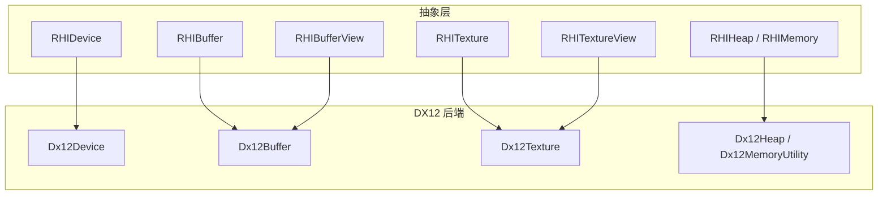
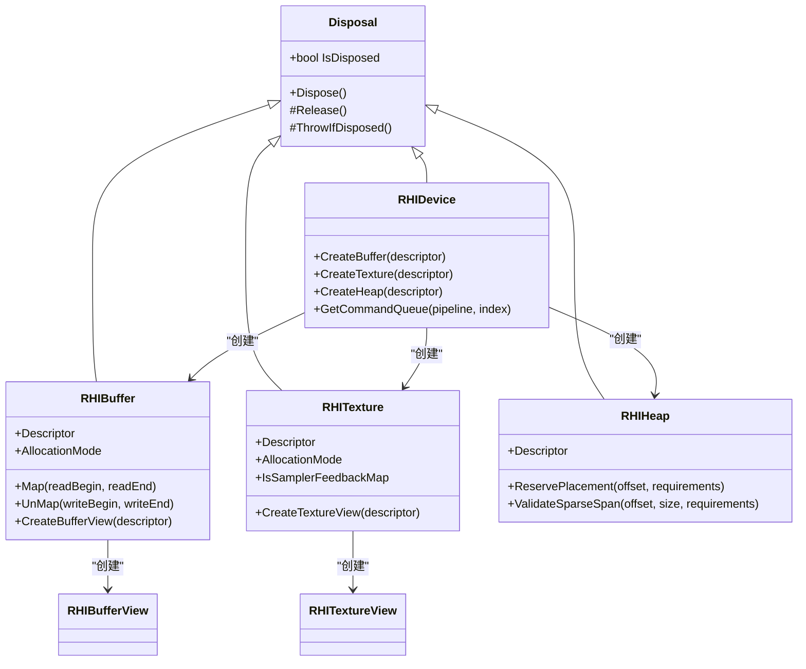
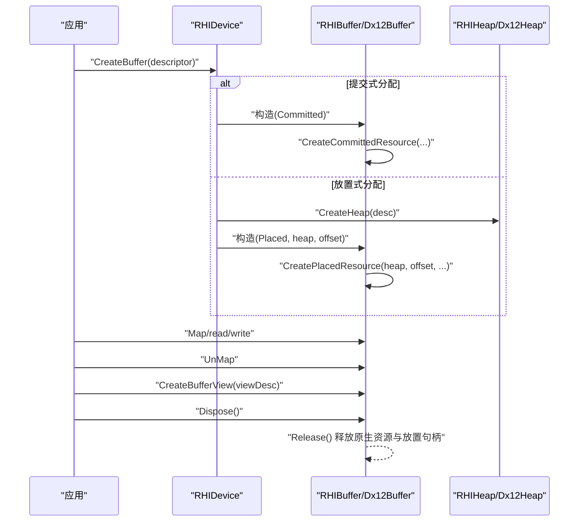
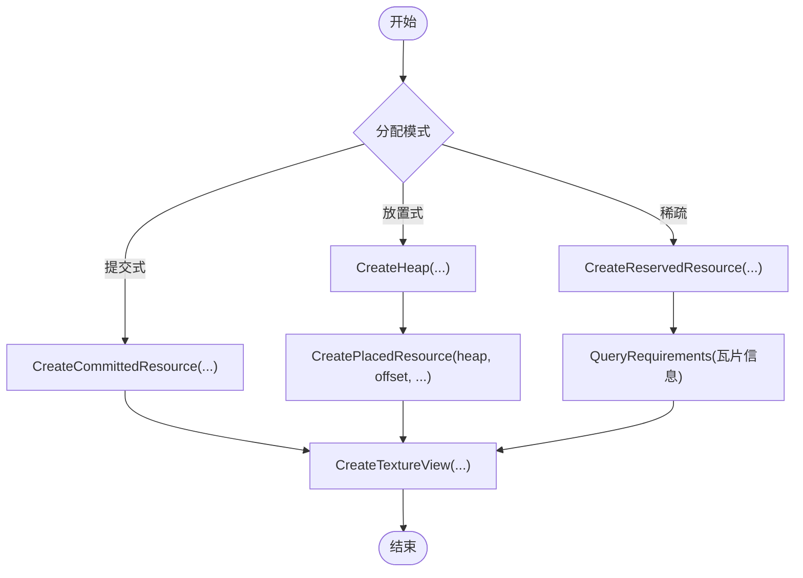
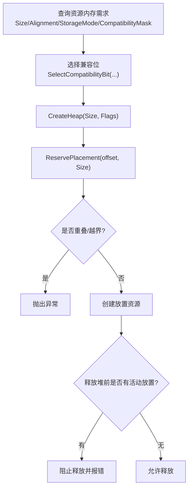
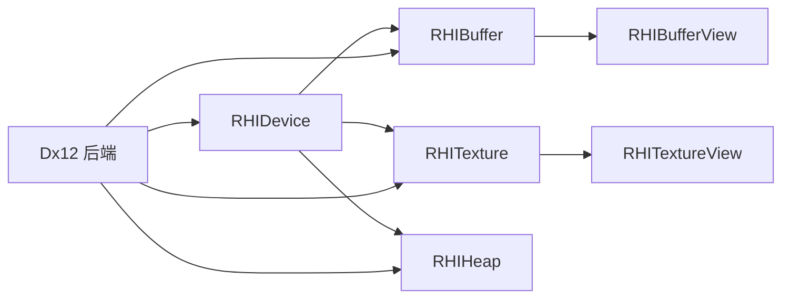

# 资源管理

<cite>
**本文引用的文件**
- [RHIBuffer.cs](file://src/SharpGPU/Abstract/RHIBuffer.cs)
- [RHITexture.cs](file://src/SharpGPU/Abstract/RHITexture.cs)
- [RHIMemory.cs](file://src/SharpGPU/Abstract/RHIMemory.cs)
- [RHIDevice.cs](file://src/SharpGPU/Abstract/RHIDevice.cs)
- [Disposal.cs](file://src/SharpGPU/Common/Core/Disposal.cs)
- [Dx12Buffer.cs](file://src/SharpGPU/Dx12/Dx12Buffer.cs)
- [Dx12Texture.cs](file://src/SharpGPU/Dx12/Dx12Texture.cs)
- [Dx12Memory.cs](file://src/SharpGPU/Dx12/Dx12Memory.cs)
- [RHIBufferView.cs](file://src/SharpGPU/Abstract/RHIBufferView.cs)
- [RHITextureView.cs](file://src/SharpGPU/Abstract/RHITextureView.cs)
- [Program.cs](file://samples/ComputeAndDraw/Program.cs)
</cite>

## 目录
1. [简介](#简介)
2. [项目结构](#项目结构)
3. [核心组件](#核心组件)
4. [架构总览](#架构总览)
5. [详细组件分析](#详细组件分析)
6. [依赖关系分析](#依赖关系分析)
7. [性能考量](#性能考量)
8. [故障排查指南](#故障排查指南)
9. [结论](#结论)
10. [附录：最佳实践与示例路径](#附录最佳实践与示例路径)

## 简介
本文件系统性梳理 SharpGPU 的 GPU 资源管理机制，覆盖缓冲区、纹理、视图等资源的创建、配置、使用与销毁；解释内存分配策略（提交式、放置式、稀疏、外部）、资源绑定机制、视图管理与内存同步问题；并给出生命周期管理、垃圾回收优化、内存泄漏防护等高级主题。文末提供最佳实践、性能优化技巧与常见问题解决方案，以及指向具体代码实现的路径，便于读者对照源码深入理解。

## 项目结构
SharpGPU 采用抽象 RHI + 后端实现的层次化设计：
- 抽象层（Abstract）：定义跨后端的资源类型、描述符、内存模型与设备接口。
- 后端实现（Dx12/Metal/Vulkan）：将抽象接口映射到具体原生 API。
- 通用基础设施（Common）：包含释放基类、集合、作用域等公共能力。
- 示例（samples）：演示计算与渲染工作负载的资源使用流程。

图表来源
- [RHIDevice.cs:422-553](file://src/SharpGPU/Abstract/RHIDevice.cs#L422-L553)
- [RHIBuffer.cs:14-47](file://src/SharpGPU/Abstract/RHIBuffer.cs#L14-L47)
- [RHITexture.cs:50-120](file://src/SharpGPU/Abstract/RHITexture.cs#L50-L120)
- [RHIMemory.cs:173-333](file://src/SharpGPU/Abstract/RHIMemory.cs#L173-L333)
- [Dx12Buffer.cs:8-146](file://src/SharpGPU/Dx12/Dx12Buffer.cs#L8-L146)
- [Dx12Texture.cs:7-195](file://src/SharpGPU/Dx12/Dx12Texture.cs#L7-L195)
- [Dx12Memory.cs:7-124](file://src/SharpGPU/Dx12/Dx12Memory.cs#L7-L124)

章节来源
- [README.md:1-23](file://README.md#L1-L23)

## 核心组件
- 设备（RHIDevice）：资源工厂入口，负责创建缓冲、纹理、堆、查询、交换链等同步对象，并提供能力查询与状态管理。
- 缓冲（RHIBuffer）：线性数据容器，支持映射/解映射、视图创建、GPU 虚拟地址（部分后端）。
- 纹理（RHITexture）：二维/三维图像数据容器，支持多级 mip、采样反馈图配对、视图创建。
- 内存与堆（RHIHeap/RHIMemory）：统一抽象物理内存分配、对齐、放置与稀疏贴图管理。
- 视图（RHIBufferView/RHITextureView）：对底层资源的“视角”描述，用于着色器或管线阶段访问。
- 释放基类（Disposal）：统一的资源生命周期与释放语义，防止重复释放与未释放检测。

章节来源
- [RHIDevice.cs:422-553](file://src/SharpGPU/Abstract/RHIDevice.cs#L422-L553)
- [RHIBuffer.cs:14-47](file://src/SharpGPU/Abstract/RHIBuffer.cs#L14-L47)
- [RHITexture.cs:50-120](file://src/SharpGPU/Abstract/RHITexture.cs#L50-L120)
- [RHIMemory.cs:173-333](file://src/SharpGPU/Abstract/RHIMemory.cs#L173-L333)
- [RHIBufferView.cs:5-16](file://src/SharpGPU/Abstract/RHIBufferView.cs#L5-L16)
- [RHITextureView.cs:5-21](file://src/SharpGPU/Abstract/RHITextureView.cs#L5-L21)
- [Disposal.cs:7-63](file://src/SharpGPU/Common/Core/Disposal.cs#L7-L63)

## 架构总览
SharpGPU 通过抽象 RHI 屏蔽后端差异，所有资源均继承自 Disposal，确保一致的释放语义。设备作为资源工厂，根据存储模式与用途创建不同分配模式的资源；视图作为轻量描述符，不拥有底层资源所有权。

图表来源
- [Disposal.cs:7-63](file://src/SharpGPU/Common/Core/Disposal.cs#L7-L63)
- [RHIDevice.cs:422-553](file://src/SharpGPU/Abstract/RHIDevice.cs#L422-L553)
- [RHIBuffer.cs:14-47](file://src/SharpGPU/Abstract/RHIBuffer.cs#L14-L47)
- [RHITexture.cs:50-120](file://src/SharpGPU/Abstract/RHITexture.cs#L50-L120)
- [RHIMemory.cs:173-333](file://src/SharpGPU/Abstract/RHIMemory.cs#L173-L333)

## 详细组件分析

### 缓冲区资源（RHIBuffer 与 Dx12Buffer）
- 创建：通过设备接口创建，支持提交式（Committed）与放置式（Placed）两种分配模式；DX12 后端在提交模式下调用 CreateCommittedResource，在放置模式下调用 CreatePlacedResource 并关联堆偏移。
- 映射/解映射：CPU 可映射非 GPU 本地缓冲区的指定范围进行读写；DX12 后端对 GPU 本地缓冲拒绝映射。
- 视图：通过 CreateBufferView 生成缓冲视图，供着色器或管线阶段访问。
- 释放：释放时释放原生资源与堆放置句柄，避免悬挂引用。

图表来源
- [Dx12Buffer.cs:37-86](file://src/SharpGPU/Dx12/Dx12Buffer.cs#L37-L86)
- [Dx12Buffer.cs:99-139](file://src/SharpGPU/Dx12/Dx12Buffer.cs#L99-L139)
- [Dx12Buffer.cs:141-146](file://src/SharpGPU/Dx12/Dx12Buffer.cs#L141-L146)
- [RHIDevice.cs:534-553](file://src/SharpGPU/Abstract/RHIDevice.cs#L534-L553)

章节来源
- [RHIBuffer.cs:14-47](file://src/SharpGPU/Abstract/RHIBuffer.cs#L14-L47)
- [Dx12Buffer.cs:8-146](file://src/SharpGPU/Dx12/Dx12Buffer.cs#L8-L146)
- [RHIBufferView.cs:5-16](file://src/SharpGPU/Abstract/RHIBufferView.cs#L5-L16)

### 纹理资源（RHITexture 与 Dx12Texture）
- 创建：支持提交式与放置式；DX12 后端要求纹理为 GPU 本地存储；支持稀疏纹理（Reserved Texture），并通过查询获得精确的瓦片信息。
- 采样反馈图：可通过设备接口创建与采样纹理配对的采样反馈图，配对在创建时建立，编码器无法动态配对。
- 视图：通过 CreateTextureView 生成纹理视图，支持多级 mip、数组层等。
- 释放：释放时释放原生资源与堆放置句柄。

图表来源
- [Dx12Texture.cs:30-83](file://src/SharpGPU/Dx12/Dx12Texture.cs#L30-L83)
- [Dx12Texture.cs:85-116](file://src/SharpGPU/Dx12/Dx12Texture.cs#L85-L116)
- [Dx12Texture.cs:134-186](file://src/SharpGPU/Dx12/Dx12Texture.cs#L134-L186)
- [Dx12Memory.cs:162-302](file://src/SharpGPU/Dx12/Dx12Memory.cs#L162-L302)

章节来源
- [RHITexture.cs:39-120](file://src/SharpGPU/Abstract/RHITexture.cs#L39-L120)
- [Dx12Texture.cs:7-195](file://src/SharpGPU/Dx12/Dx12Texture.cs#L7-L195)
- [RHITextureView.cs:5-21](file://src/SharpGPU/Abstract/RHITextureView.cs#L5-L21)

### 内存与堆（RHIHeap 与内存需求）
- 内存需求：通过设备查询缓冲/纹理的精确大小、对齐、存储模式与兼容性掩码，用于选择合适堆。
- 堆创建：基于兼容性掩码选择堆标志，创建物理堆。
- 放置注册：堆内部维护放置注册表，防止重叠分配，并在所有者释放前检查是否仍有活动放置。
- 稀疏纹理：提供子资源瓦片信息与尾级 mip 信息，校验对齐、溢出与重叠约束。

图表来源
- [RHIMemory.cs:28-77](file://src/SharpGPU/Abstract/RHIMemory.cs#L28-L77)
- [RHIMemory.cs:173-333](file://src/SharpGPU/Abstract/RHIMemory.cs#L173-L333)
- [RHIMemory.cs:353-457](file://src/SharpGPU/Abstract/RHIMemory.cs#L353-L457)
- [Dx12Memory.cs:73-124](file://src/SharpGPU/Dx12/Dx12Memory.cs#L73-L124)

章节来源
- [RHIMemory.cs:28-457](file://src/SharpGPU/Abstract/RHIMemory.cs#L28-L457)
- [Dx12Memory.cs:7-124](file://src/SharpGPU/Dx12/Dx12Memory.cs#L7-L124)

### 视图管理（缓冲视图与纹理视图）
- 缓冲视图：描述缓冲的计数、偏移、步长与视图类型，用于着色器或管线阶段访问。
- 纹理视图：描述 mip 数量、起始级别、数组层数与视图类型；采样反馈 UAV 视图消费创建时的配对信息。
- 视图本身不拥有底层资源，仅作为“视角”存在，生命周期通常短于资源。

章节来源
- [RHIBufferView.cs:5-16](file://src/SharpGPU/Abstract/RHIBufferView.cs#L5-L16)
- [RHITextureView.cs:5-21](file://src/SharpGPU/Abstract/RHITextureView.cs#L5-L21)
- [RHITexture.cs:25-37](file://src/SharpGPU/Abstract/RHITexture.cs#L25-L37)

### 生命周期与释放（Disposal）
- 所有资源继承 Disposal，提供 IsDisposed、Dispose、ThrowIfDisposed 等统一语义。
- 释放过程先执行 ValidateCanDispose，再调用 Release，最后抑制终结器。
- 调试模式下，若对象未被显式释放，终结器会记录错误，辅助定位内存泄漏。

章节来源
- [Disposal.cs:7-63](file://src/SharpGPU/Common/Core/Disposal.cs#L7-L63)
- [Dx12Buffer.cs:141-146](file://src/SharpGPU/Dx12/Dx12Buffer.cs#L141-L146)
- [Dx12Texture.cs:188-195](file://src/SharpGPU/Dx12/Dx12Texture.cs#L188-L195)

## 依赖关系分析
- 设备依赖：设备是所有资源的工厂，负责创建缓冲、纹理、堆、查询等；同时提供能力查询与状态管理。
- 资源依赖：缓冲与纹理依赖设备与堆；视图依赖对应资源。
- 后端依赖：DX12 后端通过 Vortice 绑定调用原生 API；内存工具类负责构建描述符与选择堆标志。

图表来源
- [RHIDevice.cs:422-553](file://src/SharpGPU/Abstract/RHIDevice.cs#L422-L553)
- [Dx12Buffer.cs:8-146](file://src/SharpGPU/Dx12/Dx12Buffer.cs#L8-L146)
- [Dx12Texture.cs:7-195](file://src/SharpGPU/Dx12/Dx12Texture.cs#L7-L195)
- [Dx12Memory.cs:7-124](file://src/SharpGPU/Dx12/Dx12Memory.cs#L7-L124)

章节来源
- [RHIDevice.cs:422-553](file://src/SharpGPU/Abstract/RHIDevice.cs#L422-L553)
- [Dx12Buffer.cs:8-146](file://src/SharpGPU/Dx12/Dx12Buffer.cs#L8-L146)
- [Dx12Texture.cs:7-195](file://src/SharpGPU/Dx12/Dx12Texture.cs#L7-L195)
- [Dx12Memory.cs:7-124](file://src/SharpGPU/Dx12/Dx12Memory.cs#L7-L124)

## 性能考量
- 优先使用放置式分配：将多个资源放置在同一个堆中，减少堆碎片与分配开销。
- 合理设置纹理用途：仅在需要的阶段启用相应用途标志，避免不必要的状态转换。
- 利用采样反馈图：在需要时启用采样反馈，减少不必要的重采样与带宽浪费。
- 控制映射范围：仅映射必要的缓冲范围，降低 CPU-GPU 同步成本。
- 稀疏纹理：对超大纹理使用稀疏分配，按需绑定瓦片，降低显存占用。

[本节为通用指导，不直接分析具体文件]

## 故障排查指南
- 设备丢失：设备状态变为 Lost/Removed/Reset 时，后续操作应抛出诊断异常；应用需捕获并处理。
- 堆释放冲突：堆释放前若有活动放置，将阻止释放并报错；需确保所有放置资源已释放。
- 映射越界：缓冲映射范围必须在缓冲大小内，否则抛出参数异常。
- 纹理格式不支持：纹理创建时对格式、维度、采样数等进行严格校验，不符合则抛异常。
- 未释放资源：调试模式下终结器会记录未释放对象，帮助定位内存泄漏。

章节来源
- [RHIDevice.cs:465-525](file://src/SharpGPU/Abstract/RHIDevice.cs#L465-L525)
- [RHIMemory.cs:329-333](file://src/SharpGPU/Abstract/RHIMemory.cs#L329-L333)
- [Dx12Buffer.cs:99-133](file://src/SharpGPU/Dx12/Dx12Buffer.cs#L99-L133)
- [Dx12Memory.cs:29-71](file://src/SharpGPU/Dx12/Dx12Memory.cs#L29-L71)
- [Disposal.cs:13-23](file://src/SharpGPU/Common/Core/Disposal.cs#L13-L23)

## 结论
SharpGPU 通过清晰的抽象层与后端实现分离，提供了统一且高效的 GPU 资源管理方案。其内存模型支持多种分配模式，视图机制简化了资源访问，释放基类确保了资源生命周期的安全性。遵循本文的最佳实践与故障排查建议，可有效提升资源使用效率与稳定性。

[本节为总结性内容，不直接分析具体文件]

## 附录：最佳实践与示例路径
- 资源创建顺序：先创建堆（如需放置式），再创建资源，最后创建视图。
- 资源使用顺序：先映射写入缓冲，再解映射并提交命令；纹理使用前确保状态正确。
- 资源销毁顺序：先销毁视图，再销毁资源，最后销毁堆。
- 示例参考：
  - 计算与绘制示例入口：[Program.cs](file://samples/ComputeAndDraw/Program.cs)
  - 缓冲创建与映射：[Dx12Buffer.cs](file://src/SharpGPU/Dx12/Dx12Buffer.cs)
  - 纹理创建与采样反馈：[Dx12Texture.cs](file://src/SharpGPU/Dx12/Dx12Texture.cs)
  - 内存需求与堆管理：[RHIMemory.cs](file://src/SharpGPU/Abstract/RHIMemory.cs), [Dx12Memory.cs](file://src/SharpGPU/Dx12/Dx12Memory.cs)

章节来源
- [Program.cs:7-15](file://samples/ComputeAndDraw/Program.cs#L7-L15)
- [Dx12Buffer.cs:37-139](file://src/SharpGPU/Dx12/Dx12Buffer.cs#L37-L139)
- [Dx12Texture.cs:30-186](file://src/SharpGPU/Dx12/Dx12Texture.cs#L30-L186)
- [RHIMemory.cs:28-457](file://src/SharpGPU/Abstract/RHIMemory.cs#L28-L457)
- [Dx12Memory.cs:7-124](file://src/SharpGPU/Dx12/Dx12Memory.cs#L7-L124)