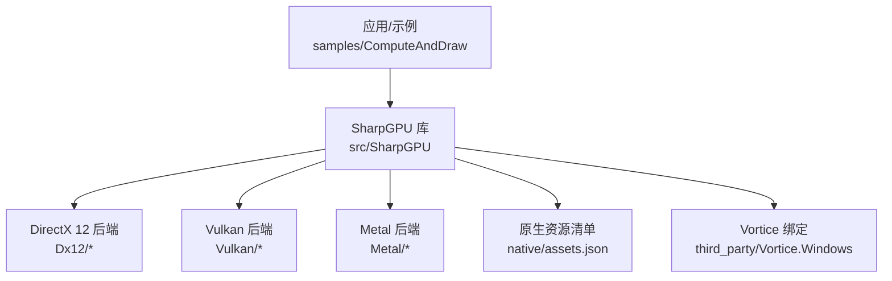
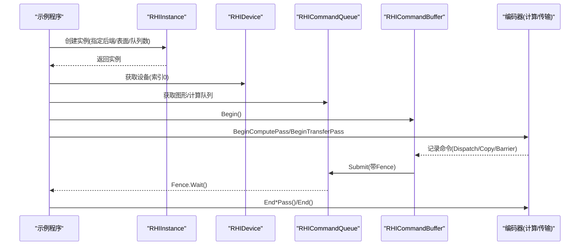
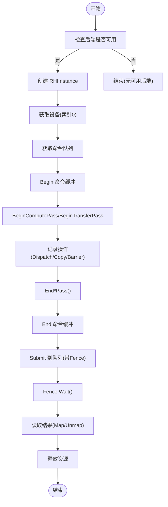
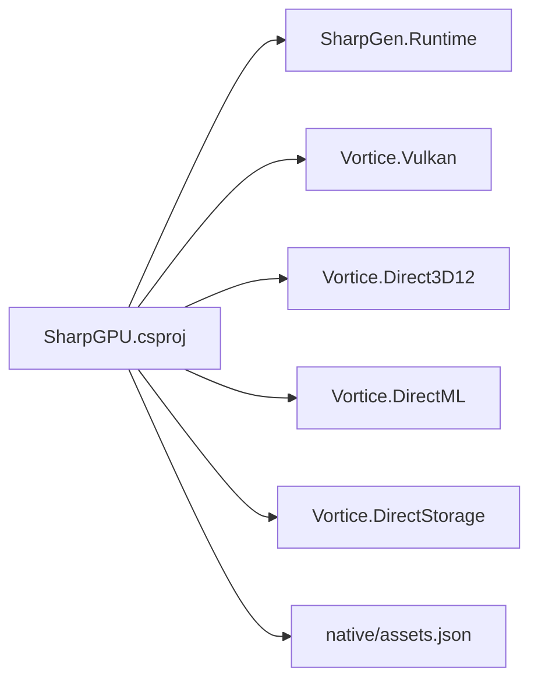

# 快速开始指南

<cite>
**本文引用的文件**
- [README.md](file://README.md)
- [global.json](file://global.json)
- [stack.local.props.example](file://stack.local.props.example)
- [docs/VERIFICATION.md](file://docs/VERIFICATION.md)
- [src/SharpGPU/SharpGPU.csproj](file://src/SharpGPU/SharpGPU.csproj)
- [native/assets.json](file://native/assets.json)
- [src/SharpGPU/Common/SharpGpuNativeLibraries.cs](file://src/SharpGPU/Common/SharpGpuNativeLibraries.cs)
- [samples/ComputeAndDraw/Program.cs](file://samples/ComputeAndDraw/Program.cs)
- [samples/ComputeAndDraw/ComputeWorkload.cs](file://samples/ComputeAndDraw/ComputeWorkload.cs)
- [samples/ComputeAndDraw/RasterWorkload.cs](file://samples/ComputeAndDraw/RasterWorkload.cs)
- [samples/ComputeAndDraw/ComputeAndDraw.csproj](file://samples/ComputeAndDraw/ComputeAndDraw.csproj)
</cite>

## 目录
1. [简介](#简介)
2. [项目结构](#项目结构)
3. [核心组件](#核心组件)
4. [架构总览](#架构总览)
5. [详细组件分析](#详细组件分析)
6. [依赖关系分析](#依赖关系分析)
7. [性能注意事项](#性能注意事项)
8. [故障排除指南](#故障排除指南)
9. [结论](#结论)
10. [附录：学习路径与最小示例](#附录学习路径与最小示例)

## 简介
本指南帮助你在最短时间内运行第一个 SharpGPU 程序。你将了解：
- 环境要求（.NET SDK、平台）
- 如何配置本地开发环境（Source 模式与 Package 模式）
- 如何运行官方示例，创建实例、获取设备并执行计算任务
- 常见问题与排错方法
- 从入门到进阶的学习路径建议

## 项目结构
仓库采用分层组织：
- src/SharpGPU：运行时 GPU HAL（DirectX 12、Vulkan、Metal）
- samples/ComputeAndDraw：可运行的计算与光栅化示例
- docs：构建验证、特性矩阵、快速开始等文档
- native：原生资源清单与许可证
- eng：CI/验证脚本
- third_party/Vortice.Windows：维护的 Vortice 绑定与补丁

图表来源
- [src/SharpGPU/SharpGPU.csproj:1-47](file://src/SharpGPU/SharpGPU.csproj#L1-L47)
- [native/assets.json:1-244](file://native/assets.json#L1-L244)

章节来源
- [README.md:1-23](file://README.md#L1-L23)

## 核心组件
- RHIInstance：创建 GPU 实例，选择后端（DirectX 12 / Vulkan），管理设备生命周期
- RHIDevice：代表一个 GPU 设备，提供命令队列、管线、缓冲、纹理等资源创建能力
- RHICommandQueue / RHICommandBuffer：提交命令、编码渲染/计算/传输通道
- RHIFunction / RHIPipeline：封装着色器函数与管线状态
- RHIBuffer / RHITexture：GPU 内存与图像资源
- 传输通道：用于缓冲/纹理之间的拷贝、重映射、查询解析等

章节来源
- [samples/ComputeAndDraw/ComputeWorkload.cs:45-162](file://samples/ComputeAndDraw/ComputeWorkload.cs#L45-L162)
- [samples/ComputeAndDraw/RasterWorkload.cs:37-161](file://samples/ComputeAndDraw/RasterWorkload.cs#L37-L161)

## 架构总览
SharpGPU 通过统一的 RHI 抽象屏蔽底层 DirectX 12、Vulkan、Metal 差异。示例程序通过 RHIInstance 选择后端并获取设备，再使用命令队列和编码器完成计算或绘制。

图表来源
- [samples/ComputeAndDraw/ComputeWorkload.cs:45-162](file://samples/ComputeAndDraw/ComputeWorkload.cs#L45-L162)
- [samples/ComputeAndDraw/RasterWorkload.cs:37-161](file://samples/ComputeAndDraw/RasterWorkload.cs#L37-L161)

## 详细组件分析

### 环境与安装
- .NET SDK：使用 global.json 指定的版本（当前为 10.0.100，允许最新功能更新）
- 平台：Windows x64 是当前已验证的主机；其他平台需匹配主机环境
- 包/源模式：可通过 StackReferenceMode 切换 Source 或 Package 模式

步骤
1. 安装由 global.json 指定的 .NET SDK
2. 如需源码模式开发，复制 stack.local.props.example 为 stack.local.props，并调整依赖根路径
3. 参考 docs/VERIFICATION.md 中的权威命令进行恢复、构建、测试与打包
4. 从 samples/ComputeAndDraw 启动独立示例

章节来源
- [global.json:1-8](file://global.json#L1-L8)
- [stack.local.props.example:1-12](file://stack.local.props.example#L1-L12)
- [docs/VERIFICATION.md:1-404](file://docs/VERIFICATION.md#L1-L404)

### 运行第一个计算任务（最小示例）
目标：创建两个缓冲，打开传输通道，拷贝字节，让作用域结束编码器。

要点
- 使用 RHIDescriptorDefaults 简化描述符构造
- 使用 BeginScopedTransferPass 自动管理通道生命周期
- 使用 CopyBufferToBuffer 完成缓冲间拷贝

参考路径
- [docs/SharpGPU/QuickStart.md:1-31](file://docs/SharpGPU/QuickStart.md#L1-L31)

注意：该片段展示了最小化的“传输”用法，不涉及完整设备初始化。完整流程请参考下方“运行示例”。

章节来源
- [docs/SharpGPU/QuickStart.md:1-31](file://docs/SharpGPU/QuickStart.md#L1-L31)

### 运行官方示例（计算+绘制）
示例入口会先运行计算负载，然后依次尝试 DirectX 12 与 Vulkan 后端，若支持则运行绘制负载。

步骤
1. 在仓库根目录执行 dotnet run --project samples/ComputeAndDraw
2. 观察控制台输出：设备名称、dispatch/readback 结果、三角形绘制统计
3. 如未检测到可用后端，请检查驱动与系统组件

关键调用链
- Program.Main -> ComputeWorkload.Run -> RHIInstance.Create -> RHIDevice -> 计算/传输/读取
- Program.Main -> RasterWorkload.Run -> RHIInstance.Create -> RHIDevice -> 光栅化通道/查询

章节来源
- [samples/ComputeAndDraw/Program.cs:1-18](file://samples/ComputeAndDraw/Program.cs#L1-L18)
- [samples/ComputeAndDraw/ComputeWorkload.cs:17-162](file://samples/ComputeAndDraw/ComputeWorkload.cs#L17-L162)
- [samples/ComputeAndDraw/RasterWorkload.cs:37-161](file://samples/ComputeAndDraw/RasterWorkload.cs#L37-L161)

### 创建实例、获取设备、执行简单计算的流程图

图表来源
- [samples/ComputeAndDraw/ComputeWorkload.cs:45-162](file://samples/ComputeAndDraw/ComputeWorkload.cs#L45-L162)

## 依赖关系分析
- 运行时目标框架：net10.0
- 外部依赖：
  - SharpGen.Runtime
  - Vortice.Vulkan（固定版本）
  - Vortice.Direct3D12、Vortice.DirectML、Vortice.DirectStorage（通过项目引用）
- 原生资源：D3D12Agility、DirectML、DirectStorage、PIX 等按 RID 分发
- 可选数学/Metal 依赖：根据 StackReferenceMode 切换 Source 或 Package 引用

图表来源
- [src/SharpGPU/SharpGPU.csproj:1-47](file://src/SharpGPU/SharpGPU.csproj#L1-L47)
- [native/assets.json:1-244](file://native/assets.json#L1-L244)

章节来源
- [src/SharpGPU/SharpGPU.csproj:1-47](file://src/SharpGPU/SharpGPU.csproj#L1-L47)
- [native/assets.json:1-244](file://native/assets.json#L1-L244)

## 性能注意事项
- 合理使用屏障（Barrier）减少不必要的同步开销
- 尽量复用命令缓冲与管线对象，避免频繁创建销毁
- 使用合适的存储模式（HostUpload/Readback/GPULocal）优化数据流
- 对大尺寸数据传输，优先批量拷贝与合并提交
- 启用查询（Statistics）评估吞吐瓶颈（输入装配、像素着色器调用次数等）

[本节为通用指导，不直接分析具体文件]

## 故障排除指南
常见问题与解决思路
- 无法找到 .NET SDK 或版本不匹配
  - 确认安装了 global.json 指定的 SDK 版本
  - 使用 dotnet --info 核对当前 SDK
- 无可用后端（DirectX 12 / Vulkan）
  - 确保显卡驱动已更新，系统具备对应 API 支持
  - 使用 IsBackendSupported 检测后再创建实例
- 原生 DLL 加载失败或路径问题
  - 检查应用部署目录下的 runtimes/win-<arch>/native 是否存在所需 DLL
  - 可通过 SharpGpuNativeLibraries.Configure 显式设置 DirectML/DirectStorage/PIX 目录（必须在首次运行时之前配置）
- 长路径导致 NativeLibrary 加载失败
  - 将应用移动到较短路径下运行，或使用修复后的包/路径策略
- 包模式与源模式混用导致解析错误
  - 保持 StackReferenceMode 一致，不要混合 ProjectReference 与 PackageReference
- 构建/测试失败
  - 参考 docs/VERIFICATION.md 中的权威命令，使用隔离缓存与明确参数重新执行

章节来源
- [src/SharpGPU/Common/SharpGpuNativeLibraries.cs:1-76](file://src/SharpGPU/Common/SharpGpuNativeLibraries.cs#L1-L76)
- [docs/VERIFICATION.md:1-404](file://docs/VERIFICATION.md#L1-L404)

## 结论
通过本指南，你应能：
- 正确安装 .NET SDK 并配置本地开发环境
- 运行官方示例，完成实例创建、设备获取与计算/绘制任务
- 理解依赖关系与原生资源布局
- 定位并解决常见环境问题
建议从最小传输示例入手，逐步过渡到完整的计算与绘制工作负载。

[本节为总结性内容，不直接分析具体文件]

## 附录：学习路径与最小示例

### 推荐学习路径
- 入门
  - 阅读 QuickStart 的最小传输示例，理解缓冲与传输通道
  - 运行 samples/ComputeAndDraw，观察计算与绘制流程
- 进阶
  - 深入 RHI 抽象层：命令缓冲、通道、屏障、管线布局
  - 探索不同后端的差异与能力探测
  - 学习查询与统计，定位性能瓶颈
- 高级
  - 自定义着色器编译与绑定表布局
  - 多设备/多队列管理与资源共享
  - 原生资源部署与调试工具集成（PIX、验证层）

### 最小代码示例（参考路径）
- 最小传输示例（创建缓冲、拷贝）
  - 参考：[docs/SharpGPU/QuickStart.md:1-31](file://docs/SharpGPU/QuickStart.md#L1-L31)
- 完整计算示例（编译着色器、创建管线、Dispatch、读回）
  - 参考：[samples/ComputeAndDraw/ComputeWorkload.cs:17-162](file://samples/ComputeAndDraw/ComputeWorkload.cs#L17-L162)
- 完整绘制示例（顶点/像素着色器、光栅化通道、查询）
  - 参考：[samples/ComputeAndDraw/RasterWorkload.cs:37-161](file://samples/ComputeAndDraw/RasterWorkload.cs#L37-L161)

章节来源
- [docs/SharpGPU/QuickStart.md:1-31](file://docs/SharpGPU/QuickStart.md#L1-L31)
- [samples/ComputeAndDraw/ComputeWorkload.cs:17-162](file://samples/ComputeAndDraw/ComputeWorkload.cs#L17-L162)
- [samples/ComputeAndDraw/RasterWorkload.cs:37-161](file://samples/ComputeAndDraw/RasterWorkload.cs#L37-L161)