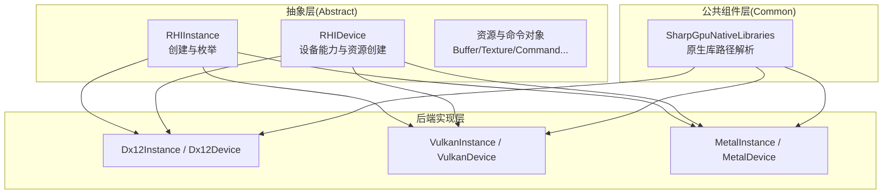
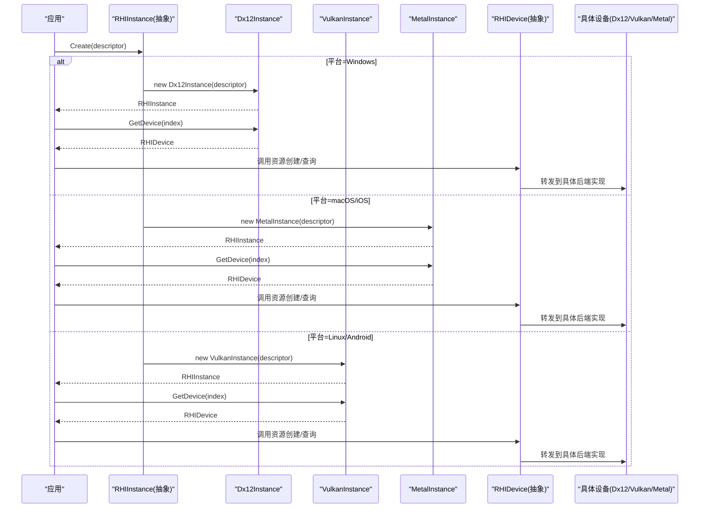
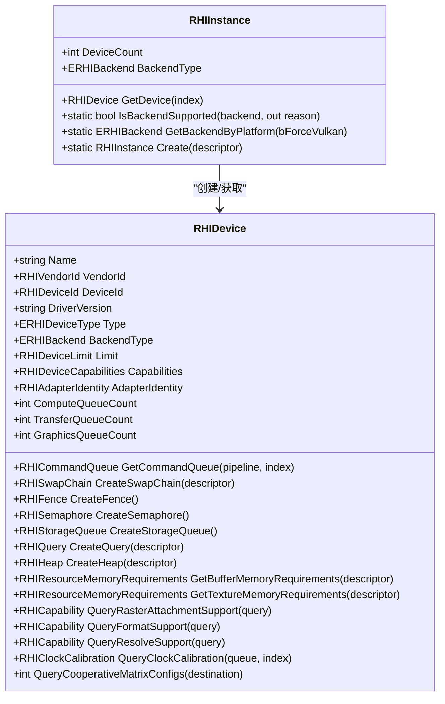
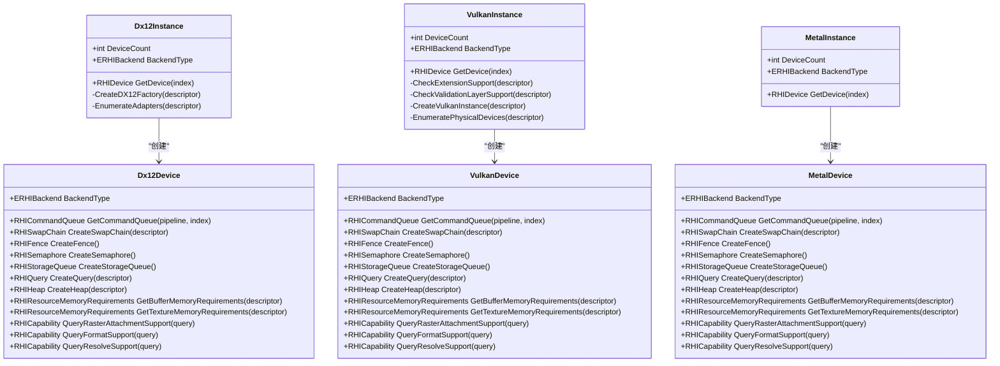
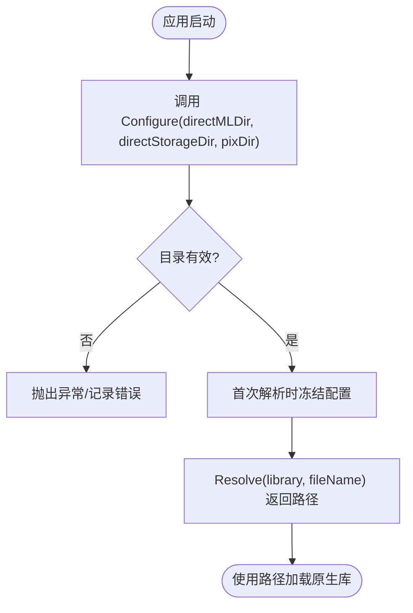
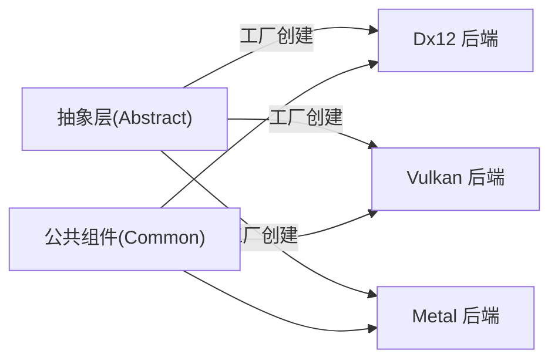

# 分层架构设计

<cite>
**本文引用的文件**
- [src/SharpGPU/Abstract/RHIDevice.cs](file://src/SharpGPU/Abstract/RHIDevice.cs)
- [src/SharpGPU/Abstract/RHIInstance.cs](file://src/SharpGPU/Abstract/RHIInstance.cs)
- [src/SharpGPU/Dx12/Dx12Device.cs](file://src/SharpGPU/Dx12/Dx12Device.cs)
- [src/SharpGPU/Dx12/Dx12Instance.cs](file://src/SharpGPU/Dx12/Dx12Instance.cs)
- [src/SharpGPU/Vulkan/VulkanDevice.cs](file://src/SharpGPU/Vulkan/VulkanDevice.cs)
- [src/SharpGPU/Vulkan/VulkanInstance.cs](file://src/SharpGPU/Vulkan/VulkanInstance.cs)
- [src/SharpGPU/Metal/MetalDevice.cs](file://src/SharpGPU/Metal/MetalDevice.cs)
- [src/SharpGPU/Metal/MetalInstance.cs](file://src/SharpGPU/Metal/MetalInstance.cs)
- [src/SharpGPU/Common/SharpGpuNativeLibraries.cs](file://src/SharpGPU/Common/SharpGpuNativeLibraries.cs)
</cite>

## 目录
1. [简介](#简介)
2. [项目结构](#项目结构)
3. [核心组件](#核心组件)
4. [架构总览](#架构总览)
5. [详细组件分析](#详细组件分析)
6. [依赖关系分析](#依赖关系分析)
7. [性能考量](#性能考量)
8. [故障排查指南](#故障排查指南)
9. [结论](#结论)
10. [附录](#附录)

## 简介
本章节阐述 SharpGPU 的三层架构：抽象层（Abstract）定义统一的 RHI 接口规范；后端实现层（Dx12/Vulkan/Metal）提供具体 API 实现；公共组件层（Common）提供共享功能。通过抽象层屏蔽不同图形 API 的差异，实现跨平台兼容性，并支持新后端的扩展与现有后端的维护。

## 项目结构
SharpGPU 的核心代码位于 src/SharpGPU，按职责划分为三个层次：
- 抽象层（Abstract）：定义设备、实例、命令缓冲、资源等统一接口与数据结构，如 RHIDevice、RHIInstance 以及各类描述符和查询类型。
- 后端实现层（Dx12/Vulkan/Metal）：分别实现各平台的设备、实例、资源与命令编码逻辑，封装底层原生 API。
- 公共组件层（Common）：提供跨后端共享的基础设施，如原生库定位、集合、作用域工具等。

图表来源
- [src/SharpGPU/Abstract/RHIInstance.cs:122-156](file://src/SharpGPU/Abstract/RHIInstance.cs#L122-L156)
- [src/SharpGPU/Abstract/RHIDevice.cs:422-601](file://src/SharpGPU/Abstract/RHIDevice.cs#L422-L601)
- [src/SharpGPU/Dx12/Dx12Instance.cs:20-131](file://src/SharpGPU/Dx12/Dx12Instance.cs#L20-L131)
- [src/SharpGPU/Vulkan/VulkanInstance.cs:74-85](file://src/SharpGPU/Vulkan/VulkanInstance.cs#L74-L85)
- [src/SharpGPU/Metal/MetalInstance.cs:16-54](file://src/SharpGPU/Metal/MetalInstance.cs#L16-L54)
- [src/SharpGPU/Common/SharpGpuNativeLibraries.cs:16-57](file://src/SharpGPU/Common/SharpGpuNativeLibraries.cs#L16-L57)

章节来源
- [src/SharpGPU/Abstract/RHIInstance.cs:122-156](file://src/SharpGPU/Abstract/RHIInstance.cs#L122-L156)
- [src/SharpGPU/Abstract/RHIDevice.cs:422-601](file://src/SharpGPU/Abstract/RHIDevice.cs#L422-L601)
- [src/SharpGPU/Dx12/Dx12Instance.cs:20-131](file://src/SharpGPU/Dx12/Dx12Instance.cs#L20-L131)
- [src/SharpGPU/Vulkan/VulkanInstance.cs:74-85](file://src/SharpGPU/Vulkan/VulkanInstance.cs#L74-L85)
- [src/SharpGPU/Metal/MetalInstance.cs:16-54](file://src/SharpGPU/Metal/MetalInstance.cs#L16-L54)
- [src/SharpGPU/Common/SharpGpuNativeLibraries.cs:16-57](file://src/SharpGPU/Common/SharpGpuNativeLibraries.cs#L16-L57)

## 核心组件
- RHIInstance：负责后端选择、平台检测、实例创建与设备枚举。提供静态工厂方法 Create，根据后端类型返回对应实例。
- RHIDevice：定义设备能力查询、队列获取、资源创建（Buffer/Texture/Heap/SwapChain/Fence/Semaphore/Query）、内存需求查询、格式/附件/解析支持查询等统一接口。
- 后端实例与设备：每个后端实现各自的 Instance/Device，封装原生 API 调用与平台特性探测。
- Common：提供原生库路径解析与加载配置，确保运行时可定位 DirectML/DirectStorage/PIX 等原生组件。

章节来源
- [src/SharpGPU/Abstract/RHIInstance.cs:6-159](file://src/SharpGPU/Abstract/RHIInstance.cs#L6-L159)
- [src/SharpGPU/Abstract/RHIDevice.cs:422-800](file://src/SharpGPU/Abstract/RHIDevice.cs#L422-L800)
- [src/SharpGPU/Common/SharpGpuNativeLibraries.cs:16-57](file://src/SharpGPU/Common/SharpGpuNativeLibraries.cs#L16-L57)

## 架构总览
SharpGPU 采用“抽象层 + 多后端实现”的分层模式：
- 上层应用仅依赖抽象层接口，不感知具体后端差异。
- 抽象层通过 RHIInstance.Create 进行后端分发，依据平台与配置选择合适后端。
- 后端实现层各自管理原生对象生命周期、能力探测与资源创建。
- 公共组件层为后端提供通用能力，如原生库定位。

图表来源
- [src/SharpGPU/Abstract/RHIInstance.cs:122-156](file://src/SharpGPU/Abstract/RHIInstance.cs#L122-L156)
- [src/SharpGPU/Dx12/Dx12Instance.cs:20-131](file://src/SharpGPU/Dx12/Dx12Instance.cs#L20-L131)
- [src/SharpGPU/Vulkan/VulkanInstance.cs:74-85](file://src/SharpGPU/Vulkan/VulkanInstance.cs#L74-L85)
- [src/SharpGPU/Metal/MetalInstance.cs:16-54](file://src/SharpGPU/Metal/MetalInstance.cs#L16-L54)

## 详细组件分析

### 抽象层：RHIInstance 与 RHIDevice
- RHIInstance
  - 提供 IsBackendSupported 进行平台能力检查。
  - 提供 GetBackendByPlatform 自动选择默认后端。
  - 提供 Create 静态工厂，根据后端类型返回具体实例。
- RHIDevice
  - 暴露设备信息（名称、厂商、驱动版本、类型）。
  - 提供队列获取、SwapChain/ Fence/ Semaphore/ StorageQueue/ Query/ Heap 创建。
  - 提供内存需求查询（Buffer/Texture），以及格式/附件/解析支持查询。
  - 提供时钟校准、协作矩阵配置查询等高级能力。

图表来源
- [src/SharpGPU/Abstract/RHIInstance.cs:6-159](file://src/SharpGPU/Abstract/RHIInstance.cs#L6-L159)
- [src/SharpGPU/Abstract/RHIDevice.cs:422-800](file://src/SharpGPU/Abstract/RHIDevice.cs#L422-L800)

章节来源
- [src/SharpGPU/Abstract/RHIInstance.cs:6-159](file://src/SharpGPU/Abstract/RHIInstance.cs#L6-L159)
- [src/SharpGPU/Abstract/RHIDevice.cs:422-800](file://src/SharpGPU/Abstract/RHIDevice.cs#L422-L800)

### 后端实现层：Dx12/Vulkan/Metal
- Dx12
  - Dx12Instance：创建 DXGI 工厂，启用调试/验证层，枚举适配器并创建设备列表。
  - Dx12Device：实现设备能力探测、队列创建、资源创建与内存需求查询，映射 D3D12 特性到 RHI 能力。
- Vulkan
  - VulkanInstance：检查扩展与验证层支持，创建 VkInstance，枚举物理设备并创建设备列表。
  - VulkanDevice：查询物理设备属性与扩展，构建设备特性链，创建队列族与设备对象。
- Metal
  - MetalInstance：枚举 MTLDevice，必要时创建默认设备，构造设备列表。
  - MetalDevice：探测 Metal 版本与能力，创建队列与纹理视图池，实现资源创建与能力查询。

图表来源
- [src/SharpGPU/Dx12/Dx12Instance.cs:20-131](file://src/SharpGPU/Dx12/Dx12Instance.cs#L20-L131)
- [src/SharpGPU/Dx12/Dx12Device.cs:48-800](file://src/SharpGPU/Dx12/Dx12Device.cs#L48-L800)
- [src/SharpGPU/Vulkan/VulkanInstance.cs:74-200](file://src/SharpGPU/Vulkan/VulkanInstance.cs#L74-L200)
- [src/SharpGPU/Vulkan/VulkanDevice.cs:11-800](file://src/SharpGPU/Vulkan/VulkanDevice.cs#L11-L800)
- [src/SharpGPU/Metal/MetalInstance.cs:16-79](file://src/SharpGPU/Metal/MetalInstance.cs#L16-L79)
- [src/SharpGPU/Metal/MetalDevice.cs:12-800](file://src/SharpGPU/Metal/MetalDevice.cs#L12-L800)

章节来源
- [src/SharpGPU/Dx12/Dx12Instance.cs:20-131](file://src/SharpGPU/Dx12/Dx12Instance.cs#L20-L131)
- [src/SharpGPU/Dx12/Dx12Device.cs:48-800](file://src/SharpGPU/Dx12/Dx12Device.cs#L48-L800)
- [src/SharpGPU/Vulkan/VulkanInstance.cs:74-200](file://src/SharpGPU/Vulkan/VulkanInstance.cs#L74-L200)
- [src/SharpGPU/Vulkan/VulkanDevice.cs:11-800](file://src/SharpGPU/Vulkan/VulkanDevice.cs#L11-L800)
- [src/SharpGPU/Metal/MetalInstance.cs:16-79](file://src/SharpGPU/Metal/MetalInstance.cs#L16-L79)
- [src/SharpGPU/Metal/MetalDevice.cs:12-800](file://src/SharpGPU/Metal/MetalDevice.cs#L12-L800)

### 公共组件层：原生库定位
- SharpGpuNativeLibraries：提供 Configure 与 Resolve，用于在运行前配置 DirectML/DirectStorage/PIX 的原生目录，并在首次请求时冻结配置，按平台架构解析 portable 或自定义路径。

图表来源
- [src/SharpGPU/Common/SharpGpuNativeLibraries.cs:16-57](file://src/SharpGPU/Common/SharpGpuNativeLibraries.cs#L16-L57)

章节来源
- [src/SharpGPU/Common/SharpGpuNativeLibraries.cs:16-57](file://src/SharpGPU/Common/SharpGpuNativeLibraries.cs#L16-L57)

## 依赖关系分析
- 抽象层对后端无编译期依赖，仅在运行时通过工厂方法创建具体实例。
- 后端实现层依赖各自的原生库（DirectX12/Vulkan/Metal），并通过抽象接口向上暴露统一能力。
- 公共组件层被后端引用以解决原生库定位问题，避免后端直接耦合路径策略。

图表来源
- [src/SharpGPU/Abstract/RHIInstance.cs:122-156](file://src/SharpGPU/Abstract/RHIInstance.cs#L122-L156)
- [src/SharpGPU/Common/SharpGpuNativeLibraries.cs:16-57](file://src/SharpGPU/Common/SharpGpuNativeLibraries.cs#L16-L57)

章节来源
- [src/SharpGPU/Abstract/RHIInstance.cs:122-156](file://src/SharpGPU/Abstract/RHIInstance.cs#L122-L156)
- [src/SharpGPU/Common/SharpGpuNativeLibraries.cs:16-57](file://src/SharpGPU/Common/SharpGpuNativeLibraries.cs#L16-L57)

## 性能考量
- 能力探测与降级：后端通过 Query*Support 精确探测格式/附件/解析支持，避免不必要的回退路径。
- 队列与资源分配：后端按需创建队列族与堆，减少多余对象开销。
- 原生库定位：一次性解析与冻结路径，降低重复 IO 与锁竞争。
- 错误诊断：设备丢失与提交失败通过统一异常与状态上报，便于上层快速恢复。

[本节为通用指导，不直接分析具体文件]

## 故障排查指南
- 设备丢失与不可用：RHIDevice 提供 MarkDeviceLost 与 ThrowIfDeviceUnavailable，后端在错误回调中设置诊断信息并转换设备状态。
- 后端不支持：RHIInstance.IsBackendSupported 返回不支持原因，Create 会抛出 NotSupportedException。
- 原生库未找到：SharpGpuNativeLibraries.Resolve 在路径无效或架构不支持时抛出异常，需检查 Configure 参数与部署结构。

章节来源
- [src/SharpGPU/Abstract/RHIDevice.cs:465-525](file://src/SharpGPU/Abstract/RHIDevice.cs#L465-L525)
- [src/SharpGPU/Abstract/RHIInstance.cs:59-156](file://src/SharpGPU/Abstract/RHIInstance.cs#L59-L156)
- [src/SharpGPU/Common/SharpGpuNativeLibraries.cs:16-57](file://src/SharpGPU/Common/SharpGpuNativeLibraries.cs#L16-L57)

## 结论
SharpGPU 通过清晰的三层架构实现了跨平台图形抽象：
- 抽象层定义稳定接口，屏蔽后端差异。
- 后端实现层专注平台细节与能力映射。
- 公共组件层提供可复用的基础设施。
该设计使新增后端只需实现抽象接口，不影响上层应用；同时便于维护现有后端，提升可扩展性与稳定性。

[本节为总结性内容，不直接分析具体文件]

## 附录
- 典型调用流程：应用通过 RHIInstance.Create 获取实例，再 GetDevice 获取设备，随后调用 RHIDevice 的资源创建与查询接口。
- 能力查询示例：后端实现 QueryFormatSupport/QueryRasterAttachmentSupport/QueryResolveSupport，返回 RHICapability 表示可用性与限制。
- 错误处理示例：后端在设备丢失或提交失败时调用 MarkDeviceLost，上层通过 ThrowIfDeviceUnavailable 抛出诊断异常。

[本节为补充说明，不直接分析具体文件]