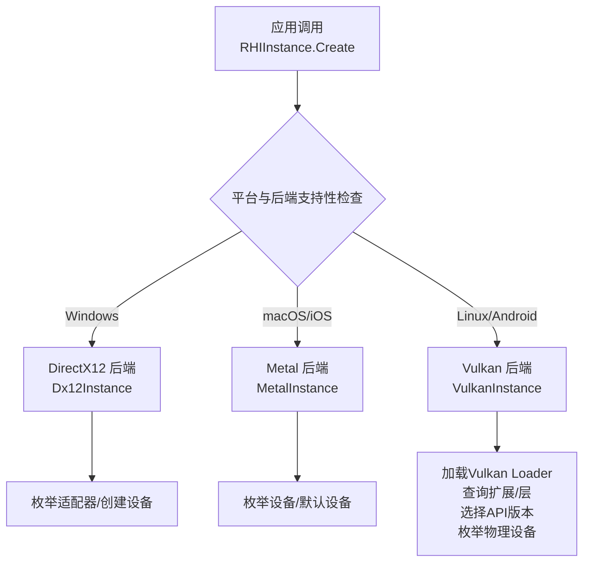
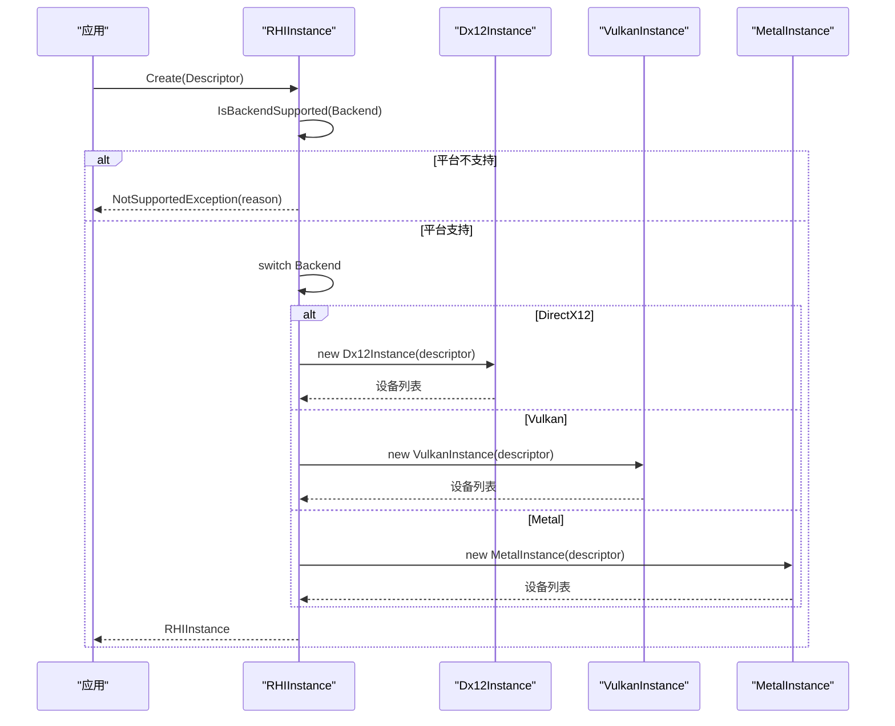
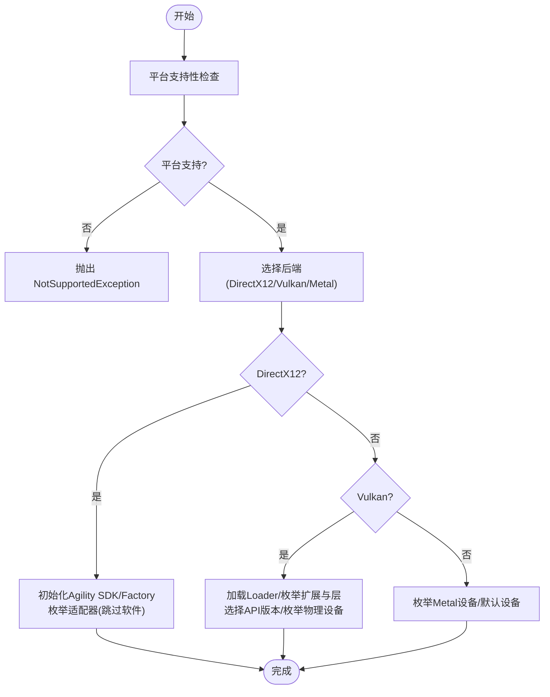
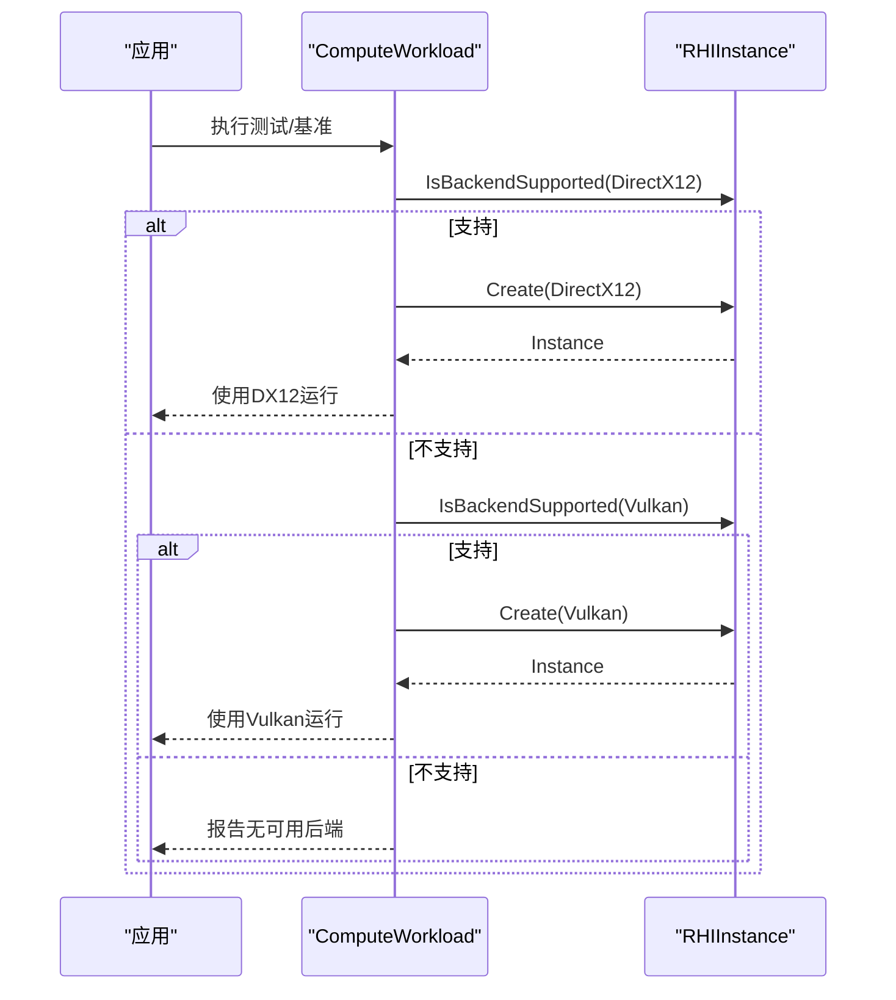
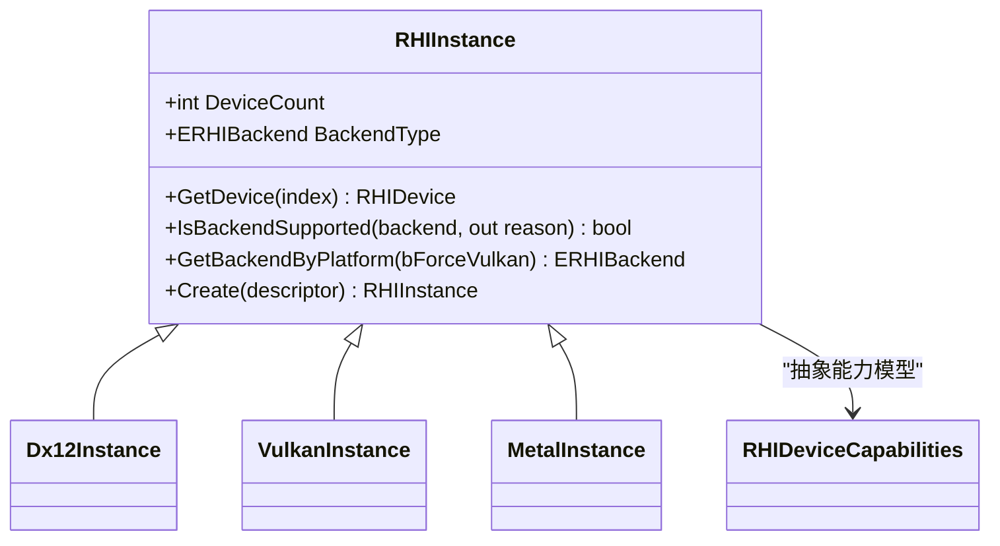

# 后端选择机制

<cite>
**本文引用的文件**
- [RHIInstance.cs](file://src/SharpGPU/Abstract/RHIInstance.cs)
- [Dx12Instance.cs](file://src/SharpGPU/Dx12/Dx12Instance.cs)
- [VulkanInstance.cs](file://src/SharpGPU/Vulkan/VulkanInstance.cs)
- [MetalInstance.cs](file://src/SharpGPU/Metal/MetalInstance.cs)
- [RHIUtility.cs](file://src/SharpGPU/Abstract/RHIUtility.cs)
- [RHIDevice.cs](file://src/SharpGPU/Abstract/RHIDevice.cs)
- [ComputeWorkload.cs](file://samples/ComputeAndDraw/ComputeWorkload.cs)
- [Program.cs](file://benchmarks/SharpGPU.Benchmarks/Program.cs)
</cite>

## 目录
1. [简介](#简介)
2. [项目结构](#项目结构)
3. [核心组件](#核心组件)
4. [架构总览](#架构总览)
5. [详细组件分析](#详细组件分析)
6. [依赖关系分析](#依赖关系分析)
7. [性能考虑](#性能考虑)
8. [故障排查指南](#故障排查指南)
9. [结论](#结论)
10. [附录](#附录)

## 简介
本章节面向 SharpGPU 的后端选择机制，系统性说明运行时能力探测、后端优先级排序与降级策略、错误处理与调试方法。内容覆盖：
- 如何检测系统支持的图形 API 版本、硬件能力与驱动特性
- 后端切换逻辑与失败恢复流程
- 自定义后端的配置方式与问题定位方法
- 通过流程图展示后端选择的决策过程

## 项目结构
SharpGPU 在后端抽象层提供统一的实例创建入口，具体后端（DirectX12、Vulkan、Metal）各自实现设备枚举与能力探测。关键路径如下：
- 抽象层：RHIInstance 负责平台判断、后端支持性检查与实例创建
- DirectX12：Dx12Instance 使用 DXGI/D3D12 Agility 初始化并枚举适配器
- Vulkan：VulkanInstance 动态加载 loader、查询扩展与层、选择实例 API 版本并枚举物理设备
- Metal：MetalInstance 枚举系统设备或回退到默认设备
- 工具与枚举：RHIUtility 定义后端枚举等公共类型；RHIDevice 定义设备能力模型

图表来源
- [RHIInstance.cs:60-120](file://src/SharpGPU/Abstract/RHIInstance.cs#L60-L120)
- [Dx12Instance.cs:20-106](file://src/SharpGPU/Dx12/Dx12Instance.cs#L20-L106)
- [VulkanInstance.cs:74-85](file://src/SharpGPU/Vulkan/VulkanInstance.cs#L74-L85)
- [MetalInstance.cs:16-54](file://src/SharpGPU/Metal/MetalInstance.cs#L16-L54)

章节来源
- [RHIInstance.cs:60-159](file://src/SharpGPU/Abstract/RHIInstance.cs#L60-L159)
- [Dx12Instance.cs:20-131](file://src/SharpGPU/Dx12/Dx12Instance.cs#L20-L131)
- [VulkanInstance.cs:74-418](file://src/SharpGPU/Vulkan/VulkanInstance.cs#L74-L418)
- [MetalInstance.cs:16-79](file://src/SharpGPU/Metal/MetalInstance.cs#L16-L79)

## 核心组件
- RHIInstance：统一入口，提供 IsBackendSupported、GetBackendByPlatform、Create 等方法，完成平台判断、后端支持性验证与实例化
- Dx12Instance：基于 DXGI 工厂枚举适配器，跳过软件适配器，构建设备列表
- VulkanInstance：动态加载 Vulkan loader，枚举实例扩展与层，选择实例 API 版本，枚举物理设备并过滤 Android 最低版本要求
- MetalInstance：枚举所有 MTLDevice，若无可用则创建默认设备
- RHIUtility：定义 ERHIBackend 等公共枚举
- RHIDeviceCapabilities：抽象设备能力集合，用于后续能力探测与降级决策

章节来源
- [RHIInstance.cs:6-159](file://src/SharpGPU/Abstract/RHIInstance.cs#L6-L159)
- [RHIUtility.cs:24-30](file://src/SharpGPU/Abstract/RHIUtility.cs#L24-L30)
- [RHIDevice.cs:1958-2105](file://src/SharpGPU/Abstract/RHIDevice.cs#L1958-L2105)

## 架构总览
后端选择遵循“平台优先 + 显式配置 + 运行时支持性校验”的策略：
- 平台优先：根据操作系统决定首选后端（Windows→DX12，macOS/iOS→Metal，Linux/Android→Vulkan）
- 显式配置：可通过 RHIInstanceDescriptor.Backend 指定后端；若强制 Vulkan 则忽略平台默认
- 运行时支持性：IsBackendSupported 检查平台兼容性；各后端在构造时进行更细粒度的能力探测（如 DX12 Agility SDK、Vulkan 扩展/层、Metal 设备可用性）
- 失败恢复：当首选后端不可用或初始化失败时，上层可尝试其他后端（示例中按顺序尝试 DX12、Vulkan）

图表来源
- [RHIInstance.cs:122-156](file://src/SharpGPU/Abstract/RHIInstance.cs#L122-L156)
- [Dx12Instance.cs:20-106](file://src/SharpGPU/Dx12/Dx12Instance.cs#L20-L106)
- [VulkanInstance.cs:74-418](file://src/SharpGPU/Vulkan/VulkanInstance.cs#L74-L418)
- [MetalInstance.cs:16-54](file://src/SharpGPU/Metal/MetalInstance.cs#L16-L54)

## 详细组件分析

### 运行时能力探测算法
- 平台级探测：RHIInstance.IsBackendSupported 依据当前操作系统判断后端是否受支持，返回原因字符串
- 后端级探测：
  - DirectX12：初始化 DX12 Agility SDK，启用 Debug/Validation（可选），通过 DXGI 枚举适配器并跳过软件适配器
  - Vulkan：动态加载 Vulkan loader，枚举实例扩展与层，根据 SurfaceKind 选择必需扩展，选择实例 API 版本，枚举物理设备并按平台要求过滤
  - Metal：枚举所有设备，若无可用则创建默认设备；若仍无设备则抛出异常
- 设备能力：RHIDeviceCapabilities 提供统一的能力模型，由各后端实现具体探测（此处为抽象接口）

图表来源
- [RHIInstance.cs:60-120](file://src/SharpGPU/Abstract/RHIInstance.cs#L60-L120)
- [Dx12Instance.cs:20-106](file://src/SharpGPU/Dx12/Dx12Instance.cs#L20-L106)
- [VulkanInstance.cs:127-418](file://src/SharpGPU/Vulkan/VulkanInstance.cs#L127-L418)
- [MetalInstance.cs:16-54](file://src/SharpGPU/Metal/MetalInstance.cs#L16-L54)

章节来源
- [RHIInstance.cs:60-120](file://src/SharpGPU/Abstract/RHIInstance.cs#L60-L120)
- [Dx12Instance.cs:20-106](file://src/SharpGPU/Dx12/Dx12Instance.cs#L20-L106)
- [VulkanInstance.cs:127-418](file://src/SharpGPU/Vulkan/VulkanInstance.cs#L127-L418)
- [MetalInstance.cs:16-54](file://src/SharpGPU/Metal/MetalInstance.cs#L16-L54)
- [RHIDevice.cs:1958-2105](file://src/SharpGPU/Abstract/RHIDevice.cs#L1958-L2105)

### 后端优先级排序与降级策略
- 默认优先级：
  - Windows：DirectX12
  - macOS/iOS：Metal
  - Linux/Android：Vulkan
- 强制 Vulkan：当 bForceVulkan=true 时，忽略平台默认，直接选择 Vulkan
- 降级策略：
  - 若首选后端初始化失败（例如 DX12 Agility SDK 未就绪、Vulkan 扩展缺失、Metal 无可用设备），上层可按顺序尝试其他后端
  - 示例中 ComputeWorkload 先尝试 DirectX12，再尝试 Vulkan，体现简单降级流程

图表来源
- [ComputeWorkload.cs:28-36](file://samples/ComputeAndDraw/ComputeWorkload.cs#L28-L36)
- [RHIInstance.cs:60-156](file://src/SharpGPU/Abstract/RHIInstance.cs#L60-L156)

章节来源
- [RHIInstance.cs:105-120](file://src/SharpGPU/Abstract/RHIInstance.cs#L105-L120)
- [ComputeWorkload.cs:28-36](file://samples/ComputeAndDraw/ComputeWorkload.cs#L28-L36)

### 错误处理机制
- 平台不支持：IsBackendSupported 返回 false 并提供原因；Create 抛出 NotSupportedException
- 后端初始化失败：
  - DX12：Agility SDK 未就绪或 Debug 接口不可用会抛出异常；设备创建失败包含适配器信息
  - Vulkan：缺少必需扩展或层、Android 最低版本不满足时会抛出异常；loader 函数加载失败也会报错
  - Metal：无法创建默认设备或无可用设备时抛出异常
- 设备访问越界：GetDevice 索引越界抛出 ArgumentOutOfRangeException

章节来源
- [RHIInstance.cs:122-156](file://src/SharpGPU/Abstract/RHIInstance.cs#L122-L156)
- [Dx12Instance.cs:26-106](file://src/SharpGPU/Dx12/Dx12Instance.cs#L26-L106)
- [VulkanInstance.cs:127-418](file://src/SharpGPU/Vulkan/VulkanInstance.cs#L127-L418)
- [MetalInstance.cs:16-54](file://src/SharpGPU/Metal/MetalInstance.cs#L16-L54)

### 配置自定义后端与调试
- 配置后端：
  - 通过 RHIInstanceDescriptor.Backend 指定后端
  - 通过 RHIInstanceDescriptor.EnableDebugLayer/EnableValidation 控制调试与验证层
  - 通过 ComputeQueueRequestCount/TransferQueueRequestCount/GraphicsQueueRequestCount 请求队列数量
- 调试建议：
  - DX12：启用 Debug Layer 与 GPU-Based Validation，便于捕获初始化与设备创建错误
  - Vulkan：启用 VK_EXT_debug_utils 与 Khronos 验证层，收集实例与设备创建阶段的诊断信息
  - 使用示例程序按顺序尝试多个后端，快速定位问题所在后端

章节来源
- [RHIInstance.cs:6-15](file://src/SharpGPU/Abstract/RHIInstance.cs#L6-L15)
- [Dx12Instance.cs:26-76](file://src/SharpGPU/Dx12/Dx12Instance.cs#L26-L76)
- [VulkanInstance.cs:183-229](file://src/SharpGPU/Vulkan/VulkanInstance.cs#L183-L229)

## 依赖关系分析
- RHIInstance 依赖平台信息与后端实现类，负责统一入口与策略分发
- 各后端实现依赖各自的底层库：
  - DX12：Vortice.Direct3D12、DXGI、Agility SDK
  - Vulkan：Vulkan loader、扩展与层
  - Metal：SharpMetal 绑定
- 设备能力模型 RHIDeviceCapabilities 作为抽象接口，供上层进行能力评估与功能分支

图表来源
- [RHIInstance.cs:46-159](file://src/SharpGPU/Abstract/RHIInstance.cs#L46-L159)
- [RHIDevice.cs:1958-2105](file://src/SharpGPU/Abstract/RHIDevice.cs#L1958-L2105)

章节来源
- [RHIInstance.cs:46-159](file://src/SharpGPU/Abstract/RHIInstance.cs#L46-L159)
- [RHIDevice.cs:1958-2105](file://src/SharpGPU/Abstract/RHIDevice.cs#L1958-L2105)

## 性能考虑
- 后端选择应在应用启动早期完成，避免重复探测开销
- 合理设置队列请求数量，避免过多队列导致资源竞争
- 启用验证层仅在调试阶段，生产环境关闭以提升性能
- 对 DX12 与 Vulkan 的初始化成本较高，应缓存结果并在必要时重试

[本节为通用指导，无需特定文件引用]

## 故障排查指南
- 常见错误与定位：
  - 平台不支持：检查 IsBackendSupported 返回的原因字符串
  - DX12 初始化失败：确认 Agility SDK 存在且可加载，检查 Debug/Validation 配置
  - Vulkan 初始化失败：检查必需扩展与层是否可用，确认 Android 最低版本要求
  - Metal 无可用设备：确认系统设备枚举成功或默认设备创建成功
- 调试步骤：
  - 启用 Debug Layer/Validation 层
  - 使用示例程序按顺序尝试多个后端，观察失败点
  - 记录后端选择日志与异常堆栈，定位具体后端与阶段

章节来源
- [RHIInstance.cs:60-156](file://src/SharpGPU/Abstract/RHIInstance.cs#L60-L156)
- [Dx12Instance.cs:26-106](file://src/SharpGPU/Dx12/Dx12Instance.cs#L26-L106)
- [VulkanInstance.cs:127-418](file://src/SharpGPU/Vulkan/VulkanInstance.cs#L127-L418)
- [MetalInstance.cs:16-54](file://src/SharpGPU/Metal/MetalInstance.cs#L16-L54)

## 结论
SharpGPU 的后端选择机制以平台优先为基础，结合显式配置与运行时支持性检查，确保在不同环境下稳定选择可用后端。各后端实现具备完善的初始化与错误处理，上层可通过简单降级策略提升鲁棒性。通过启用调试与验证功能，可有效定位与解决后端选择问题。

[本节为总结，无需特定文件引用]

## 附录
- 示例与基准：
  - 基准程序展示了如何指定后端并运行测试
  - 示例程序演示了按顺序尝试多个后端的降级流程

章节来源
- [Program.cs:214-214](file://benchmarks/SharpGPU.Benchmarks/Program.cs#L214-L214)
- [ComputeWorkload.cs:28-36](file://samples/ComputeAndDraw/ComputeWorkload.cs#L28-L36)