# 技术架构概览

<cite>
**本文引用的文件**
- [README.md](file://README.md)
- [DESIGN.md](file://DESIGN.md)
- [RHIInstance.cs](file://src/SharpGPU/Abstract/RHIInstance.cs)
- [RHIDevice.cs](file://src/SharpGPU/Abstract/RHIDevice.cs)
- [RHICommandQueue.cs](file://src/SharpGPU/Abstract/RHICommandQueue.cs)
- [RHICommandBuffer.cs](file://src/SharpGPU/Abstract/RHICommandBuffer.cs)
- [RHIBuffer.cs](file://src/SharpGPU/Abstract/RHIBuffer.cs)
- [RHITexture.cs](file://src/SharpGPU/Abstract/RHITexture.cs)
- [Dx12Instance.cs](file://src/SharpGPU/Dx12/Dx12Instance.cs)
- [VulkanInstance.cs](file://src/SharpGPU/Vulkan/VulkanInstance.cs)
- [MetalInstance.cs](file://src/SharpGPU/Metal/MetalInstance.cs)
- [SharpGpuNativeLibraries.cs](file://src/SharpGPU/Common/SharpGpuNativeLibraries.cs)
</cite>

## 目录
1. [简介](#简介)
2. [项目结构](#项目结构)
3. [核心组件](#核心组件)
4. [架构总览](#架构总览)
5. [详细组件分析](#详细组件分析)
6. [依赖关系分析](#依赖关系分析)
7. [性能考量](#性能考量)
8. [故障排查指南](#故障排查指南)
9. [结论](#结论)
10. [附录](#附录)

## 简介
SharpGPU 是一个面向 .NET 的低级 GPU 抽象层（RHI），统一封装 DirectX 12、Vulkan 与 Metal 三种后端，提供设备管理、资源管理、命令系统等核心能力。其设计目标是屏蔽不同图形 API 的差异，向上暴露一致的编程接口；在运行时进行能力探测并选择合适后端，确保跨平台与跨厂商设备的可移植性与稳定性。

## 项目结构
- 抽象层（Abstract）：定义 RHI 的公共接口与数据契约，如设备、实例、队列、命令缓冲、资源等。
- 后端实现层（Dx12 / Vulkan / Metal）：针对具体图形 API 的实现，负责原生交互、能力枚举、驱动特性适配。
- 公共组件层（Common）：提供通用工具、原生库定位、集合与内存管理等基础设施。

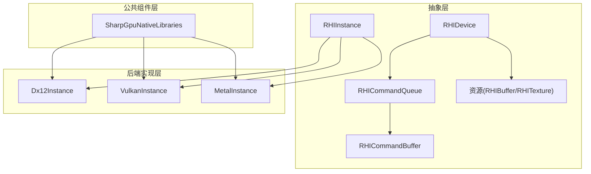

图表来源
- [RHIInstance.cs:46-156](file://src/SharpGPU/Abstract/RHIInstance.cs#L46-L156)
- [Dx12Instance.cs:8-131](file://src/SharpGPU/Dx12/Dx12Instance.cs#L8-L131)
- [VulkanInstance.cs:9-85](file://src/SharpGPU/Vulkan/VulkanInstance.cs#L9-L85)
- [MetalInstance.cs:9-54](file://src/SharpGPU/Metal/MetalInstance.cs#L9-L54)
- [SharpGpuNativeLibraries.cs:7-73](file://src/SharpGPU/Common/SharpGpuNativeLibraries.cs#L7-L73)

章节来源
- [README.md:1-23](file://README.md#L1-L23)
- [DESIGN.md:1-33](file://DESIGN.md#L1-L33)

## 核心组件
- RHIInstance：后端入口，负责创建实例、枚举设备、平台与后端支持性检查、按平台选择默认后端。
- RHIDevice：设备抽象，承载能力查询、资源创建（缓冲、纹理、堆、查询等）、队列获取、交换链创建、时钟校准、协作矩阵配置等。
- RHICommandQueue：提交命令的队列，负责命令缓冲提交、同步原语（信号量/栅栏）校验与提交流程控制。
- RHICommandBuffer：命令缓冲状态机，管理 Begin/End 与各 Pass 编码器（传输、计算、光线追踪、光栅化、机器学习、WorkGraph）。
- 资源抽象：RHIBuffer 与 RHITexture 提供统一的资源描述、视图创建、映射/解映射、采样器反馈等能力。

章节来源
- [RHIInstance.cs:46-156](file://src/SharpGPU/Abstract/RHIInstance.cs#L46-L156)
- [RHIDevice.cs:422-800](file://src/SharpGPU/Abstract/RHIDevice.cs#L422-L800)
- [RHICommandQueue.cs:60-108](file://src/SharpGPU/Abstract/RHICommandQueue.cs#L60-L108)
- [RHICommandBuffer.cs:26-190](file://src/SharpGPU/Abstract/RHICommandBuffer.cs#L26-L190)
- [RHIBuffer.cs:6-47](file://src/SharpGPU/Abstract/RHIBuffer.cs#L6-L47)
- [RHITexture.cs:39-141](file://src/SharpGPU/Abstract/RHITexture.cs#L39-L141)

## 架构总览
SharpGPU 采用分层架构：上层通过抽象层调用统一接口；中间层根据运行时环境与配置选择具体后端；底层对接各图形 API 的原生绑定。公共组件层提供原生库路径解析与加载策略，保证在不同部署场景下正确定位 DLL/SO。

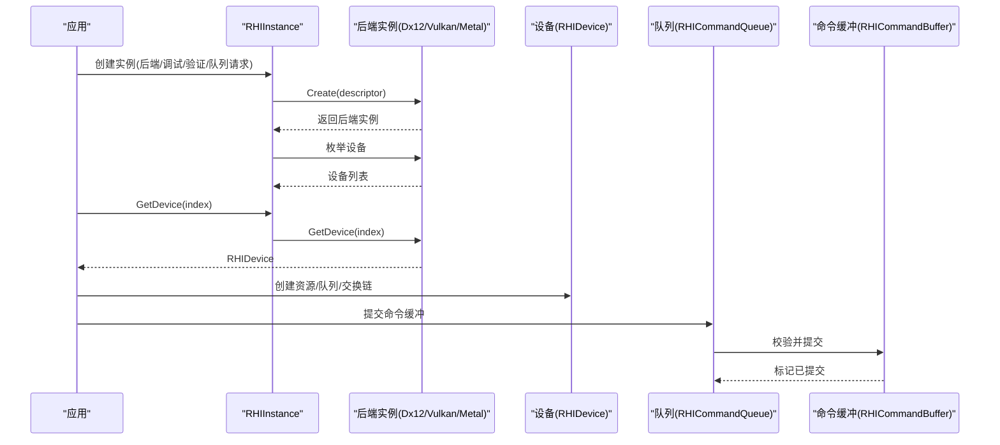

图表来源
- [RHIInstance.cs:122-156](file://src/SharpGPU/Abstract/RHIInstance.cs#L122-L156)
- [Dx12Instance.cs:20-131](file://src/SharpGPU/Dx12/Dx12Instance.cs#L20-L131)
- [VulkanInstance.cs:74-85](file://src/SharpGPU/Vulkan/VulkanInstance.cs#L74-L85)
- [MetalInstance.cs:16-54](file://src/SharpGPU/Metal/MetalInstance.cs#L16-L54)
- [RHICommandQueue.cs:118-242](file://src/SharpGPU/Abstract/RHICommandQueue.cs#L118-L242)
- [RHICommandBuffer.cs:143-164](file://src/SharpGPU/Abstract/RHICommandBuffer.cs#L143-L164)

## 详细组件分析

### 抽象层：RHIInstance 与后端选择
- 平台检测与后端支持性判断：根据操作系统限制支持的 backend（DX12 仅 Windows，Metal 仅 macOS/iOS，Linux/Android 使用 Vulkan）。
- 默认后端选择：非强制 Vulkan 时，Windows 选 DX12，macOS/iOS 选 Metal，Linux/Android 选 Vulkan。
- 实例创建：根据 descriptor.Backend 分发到对应后端实现类。

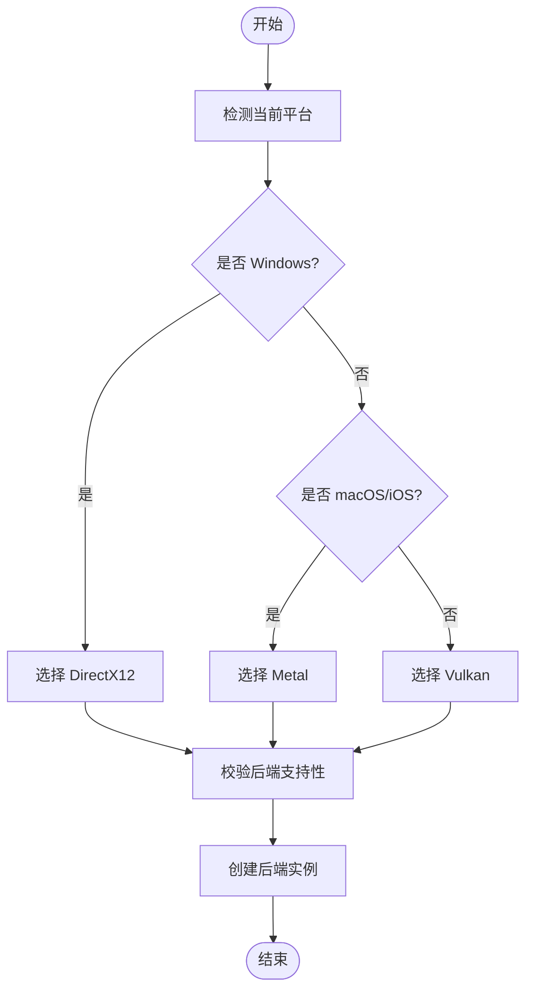

图表来源
- [RHIInstance.cs:59-120](file://src/SharpGPU/Abstract/RHIInstance.cs#L59-L120)
- [RHIInstance.cs:122-156](file://src/SharpGPU/Abstract/RHIInstance.cs#L122-L156)

章节来源
- [RHIInstance.cs:59-156](file://src/SharpGPU/Abstract/RHIInstance.cs#L59-L156)

### 抽象层：RHIDevice 能力与资源管理
- 设备能力与限制：提供格式支持查询、MSAA 解析支持查询、光栅附件支持查询、时钟校准、协作矩阵配置等。
- 资源创建：缓冲、纹理、堆、查询、交换链、存储队列、栅栏、信号量等。
- 设备生命周期：设备丢失诊断、不可用状态抛出、队列映射等。

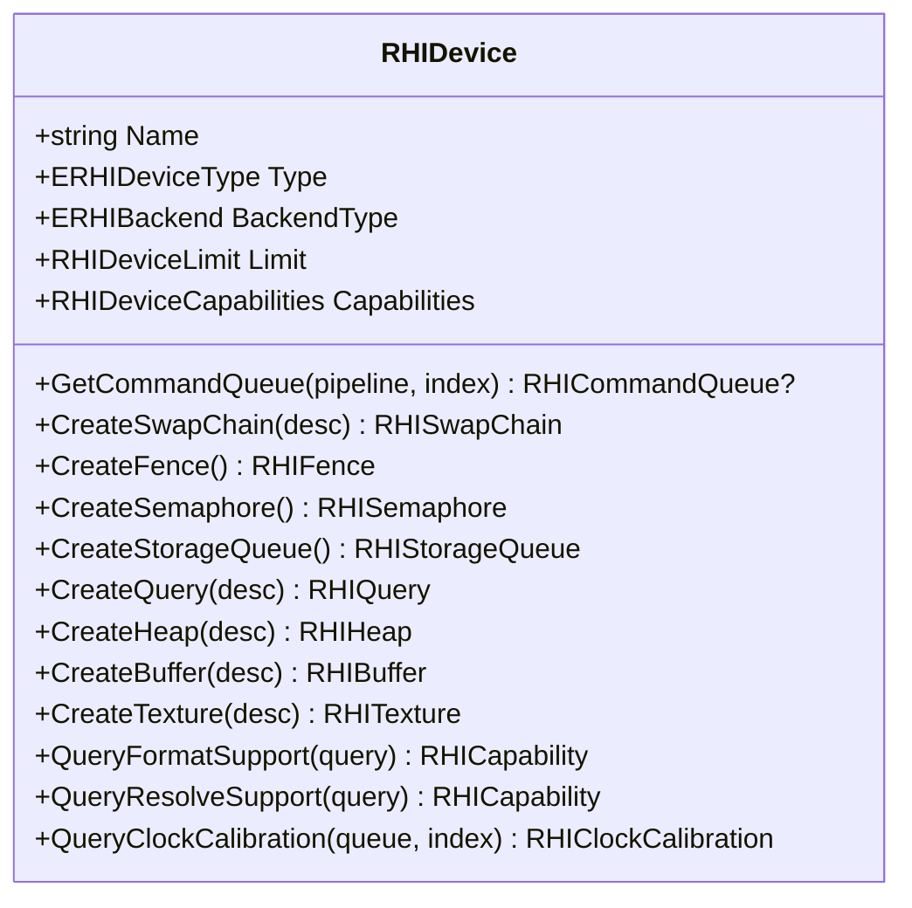

图表来源
- [RHIDevice.cs:422-800](file://src/SharpGPU/Abstract/RHIDevice.cs#L422-L800)

章节来源
- [RHIDevice.cs:422-800](file://src/SharpGPU/Abstract/RHIDevice.cs#L422-L800)

### 抽象层：命令系统与队列提交
- 命令缓冲状态机：Initial → Recording → Executable → Submitted，严格校验 Begin/End 与编码器切换。
- 队列提交校验：命令缓冲归属、重复提交、信号量/栅栏一致性、阶段掩码合法性。
- 提交流程：预留（Reserve）→ 提交（Commit）→ 回滚（Rollback）保障原子性与错误恢复。

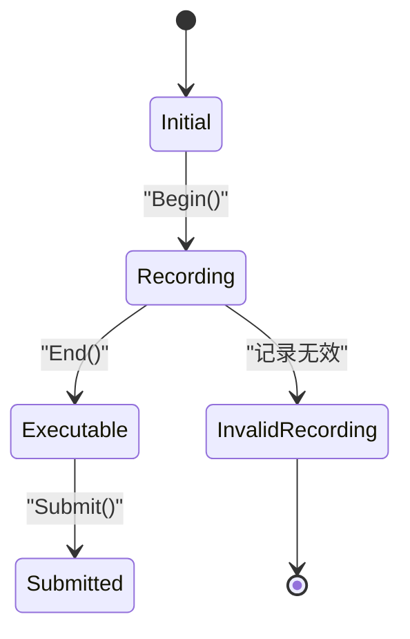

图表来源
- [RHICommandBuffer.cs:6-164](file://src/SharpGPU/Abstract/RHICommandBuffer.cs#L6-L164)
- [RHICommandQueue.cs:118-242](file://src/SharpGPU/Abstract/RHICommandQueue.cs#L118-L242)

章节来源
- [RHICommandBuffer.cs:26-190](file://src/SharpGPU/Abstract/RHICommandBuffer.cs#L26-L190)
- [RHICommandQueue.cs:60-242](file://src/SharpGPU/Abstract/RHICommandQueue.cs#L60-L242)

### 抽象层：资源模型（缓冲与纹理）
- 缓冲：描述符包含大小、格式、用途、存储模式；提供映射/解映射与视图创建。
- 纹理：描述符包含层级数、尺寸、格式、采样数、存储模式、用途、维度；支持采样器反馈图与配对纹理。

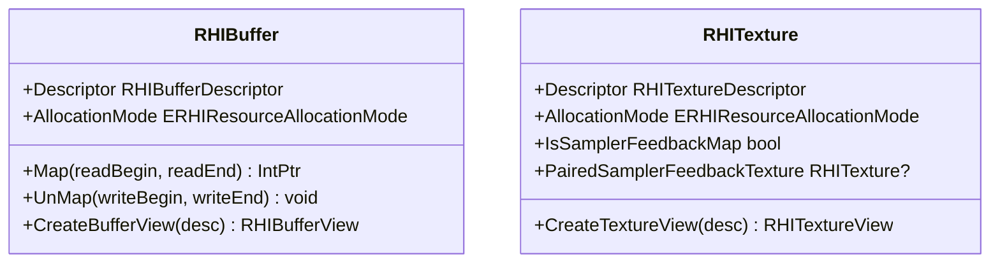

图表来源
- [RHIBuffer.cs:6-47](file://src/SharpGPU/Abstract/RHIBuffer.cs#L6-L47)
- [RHITexture.cs:39-141](file://src/SharpGPU/Abstract/RHITexture.cs#L39-L141)

章节来源
- [RHIBuffer.cs:6-47](file://src/SharpGPU/Abstract/RHIBuffer.cs#L6-L47)
- [RHITexture.cs:39-141](file://src/SharpGPU/Abstract/RHITexture.cs#L39-L141)

### 后端实现：DirectX 12
- 工厂初始化：通过 Agility SDK 获取设备工厂，支持调试层与 GPU 验证。
- 适配器枚举：遍历 DXGI 适配器，跳过软件适配器，构造 Dx12Device。
- 设备访问：按索引返回设备，释放时清理设备与工厂。

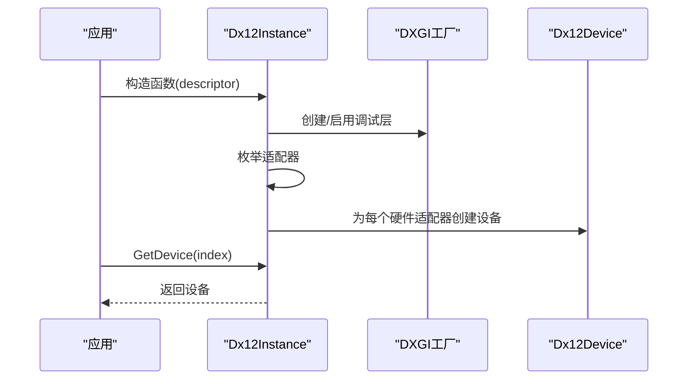

图表来源
- [Dx12Instance.cs:20-131](file://src/SharpGPU/Dx12/Dx12Instance.cs#L20-L131)

章节来源
- [Dx12Instance.cs:8-237](file://src/SharpGPU/Dx12/Dx12Instance.cs#L8-L237)

### 后端实现：Vulkan
- 扩展与层检查：根据表面类型与验证需求启用必要扩展与验证层。
- 实例创建：构建 ApplicationInfo/InstanceCreateInfo，可选 DebugUtils，创建 VkInstance。
- 物理设备枚举：过滤 Android 最低版本要求，构造 VulkanDevice。
- 动态函数加载：按需加载 vkGetInstanceProcAddr 及调试标签函数。

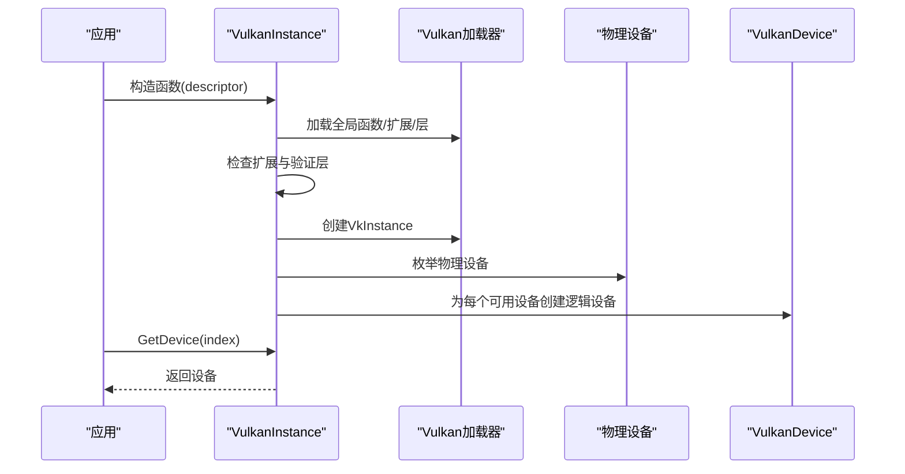

图表来源
- [VulkanInstance.cs:74-85](file://src/SharpGPU/Vulkan/VulkanInstance.cs#L74-L85)
- [VulkanInstance.cs:127-230](file://src/SharpGPU/Vulkan/VulkanInstance.cs#L127-L230)
- [VulkanInstance.cs:232-380](file://src/SharpGPU/Vulkan/VulkanInstance.cs#L232-L380)
- [VulkanInstance.cs:382-418](file://src/SharpGPU/Vulkan/VulkanInstance.cs#L382-L418)

章节来源
- [VulkanInstance.cs:9-856](file://src/SharpGPU/Vulkan/VulkanInstance.cs#L9-L856)

### 后端实现：Metal
- 设备发现：优先枚举所有 MTLDevice，若无则创建系统默认设备。
- 设备访问：按索引返回设备，释放时清理设备列表。

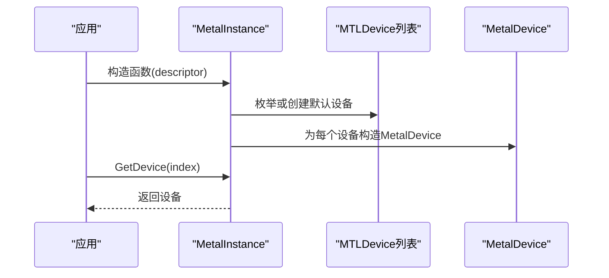

图表来源
- [MetalInstance.cs:16-54](file://src/SharpGPU/Metal/MetalInstance.cs#L16-L54)

章节来源
- [MetalInstance.cs:9-79](file://src/SharpGPU/Metal/MetalInstance.cs#L9-L79)

### 公共组件：原生库定位
- 配置原生目录：DirectML、DirectStorage、PIX 的绝对路径配置，首次运行时冻结。
- 解析策略：优先使用配置的目录，否则回退到 runtimes/win-<arch>/native 或应用基目录。

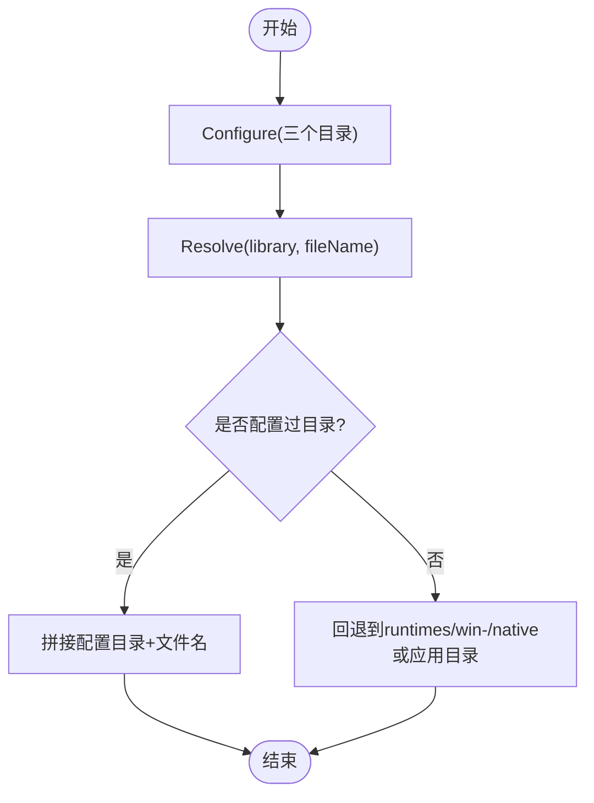

图表来源
- [SharpGpuNativeLibraries.cs:16-73](file://src/SharpGPU/Common/SharpGpuNativeLibraries.cs#L16-L73)

章节来源
- [SharpGpuNativeLibraries.cs:7-73](file://src/SharpGPU/Common/SharpGpuNativeLibraries.cs#L7-L73)

## 依赖关系分析
- 抽象层对后端无编译期依赖，通过 RHIInstance.Create 在运行时分发到具体后端。
- 后端实现依赖各自原生绑定（Vortice.Direct3D12、Vortice.Vulkan、SharpMetal）。
- 公共组件被后端共享用于原生库定位与加载。

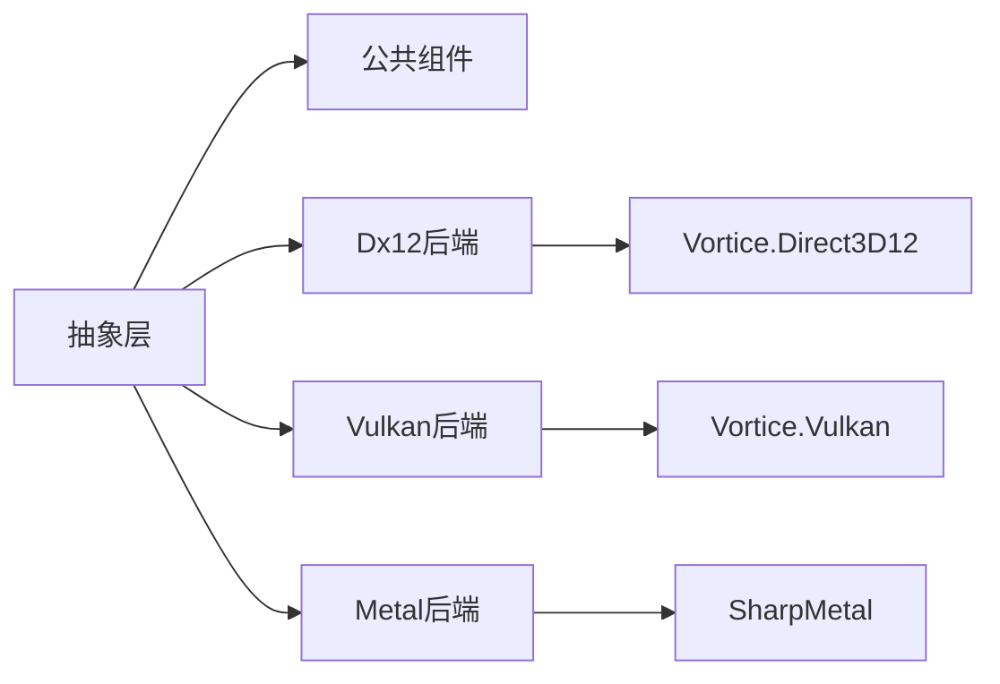

图表来源
- [RHIInstance.cs:122-156](file://src/SharpGPU/Abstract/RHIInstance.cs#L122-L156)
- [Dx12Instance.cs:1-237](file://src/SharpGPU/Dx12/Dx12Instance.cs#L1-L237)
- [VulkanInstance.cs:1-856](file://src/SharpGPU/Vulkan/VulkanInstance.cs#L1-L856)
- [MetalInstance.cs:1-79](file://src/SharpGPU/Metal/MetalInstance.cs#L1-L79)

章节来源
- [RHIInstance.cs:122-156](file://src/SharpGPU/Abstract/RHIInstance.cs#L122-L156)
- [Dx12Instance.cs:1-237](file://src/SharpGPU/Dx12/Dx12Instance.cs#L1-L237)
- [VulkanInstance.cs:1-856](file://src/SharpGPU/Vulkan/VulkanInstance.cs#L1-L856)
- [MetalInstance.cs:1-79](file://src/SharpGPU/Metal/MetalInstance.cs#L1-L79)

## 性能考量
- 命令缓冲状态机避免非法编码与重复提交，降低运行时错误开销。
- 队列提交前进行参数校验与资源所有权检查，减少无效提交带来的性能浪费。
- 能力查询（格式/解析/附件支持）在创建管线前进行，避免不必要的降级路径。
- 原生库定位与加载仅在必要时执行，且首次后冻结，避免重复 IO。

[本节为通用指导，不直接分析具体文件]

## 故障排查指南
- 设备丢失：RHIDevice 提供 MarkDeviceLost 与 ThrowIfDeviceUnavailable，确保在设备不可用时快速失败并携带诊断信息。
- 后端不支持：RHIInstance.IsBackendSupported 与 GetBackendByPlatform 提供明确原因，便于在启动时快速定位问题。
- 命令提交错误：RHICommandQueue.ValidateSubmit 对空提交、重复命令缓冲、非法阶段掩码、跨设备同步对象等进行严格校验。
- 原生库缺失：SharpGpuNativeLibraries.Resolve 在找不到配置目录时会回退到预期路径，若仍不存在将抛出异常，需检查部署布局。

章节来源
- [RHIDevice.cs:465-525](file://src/SharpGPU/Abstract/RHIDevice.cs#L465-L525)
- [RHIInstance.cs:59-120](file://src/SharpGPU/Abstract/RHIInstance.cs#L59-L120)
- [RHICommandQueue.cs:118-242](file://src/SharpGPU/Abstract/RHICommandQueue.cs#L118-L242)
- [SharpGpuNativeLibraries.cs:33-73](file://src/SharpGPU/Common/SharpGpuNativeLibraries.cs#L33-L73)

## 结论
SharpGPU 通过清晰的三层架构与严格的 RHI 契约，屏蔽了 DirectX 12、Vulkan、Metal 的差异，提供统一的设备、资源与命令系统。运行时能力探测与后端选择策略确保了跨平台与跨设备的可移植性；完善的校验与诊断机制提升了健壮性与可维护性。对于上层应用而言，只需关注抽象层接口即可高效利用多种后端能力。

[本节为总结，不直接分析具体文件]

## 附录
- 快速开始与示例：参考仓库根 README 与 samples/ComputeAndDraw。
- 设计与边界：参考 DESIGN.md 对产品边界、依赖模式与原生部署约束的定义。
- 功能矩阵与兼容性：参考 docs/SharpGPU/FeatureMatrix.md 了解各后端能力差异。

[本节为补充说明，不直接分析具体文件]