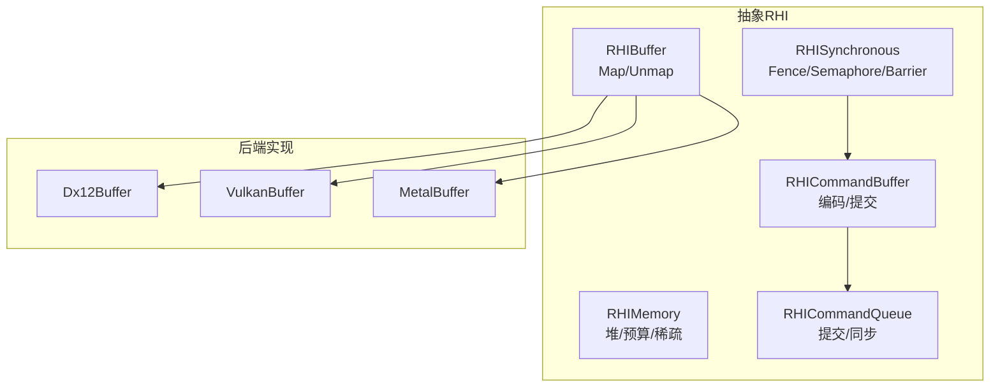
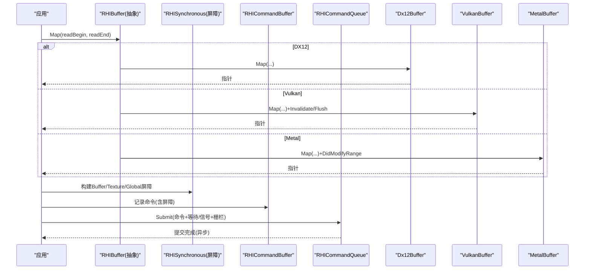
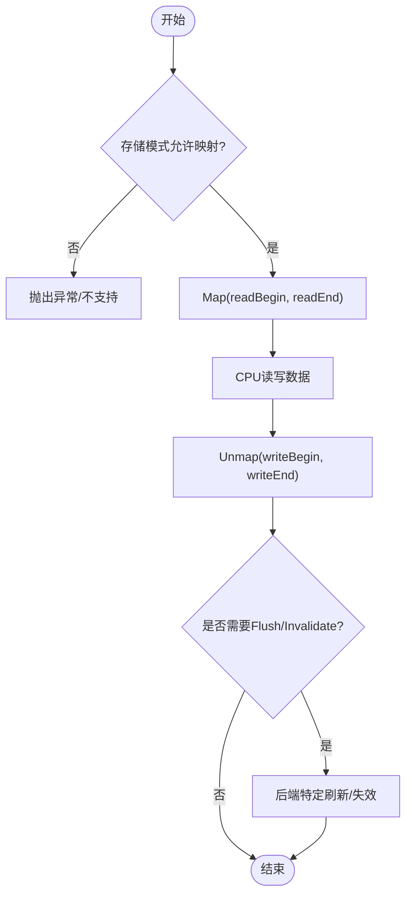
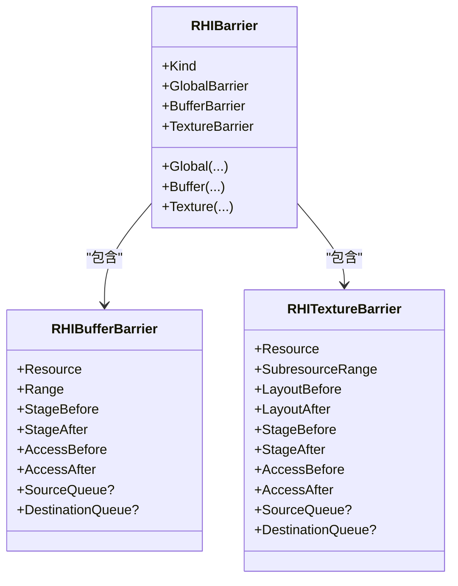
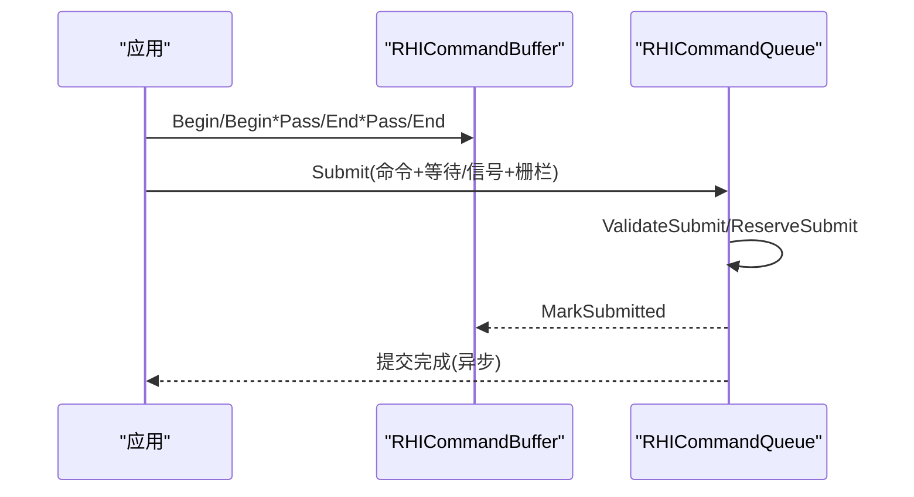
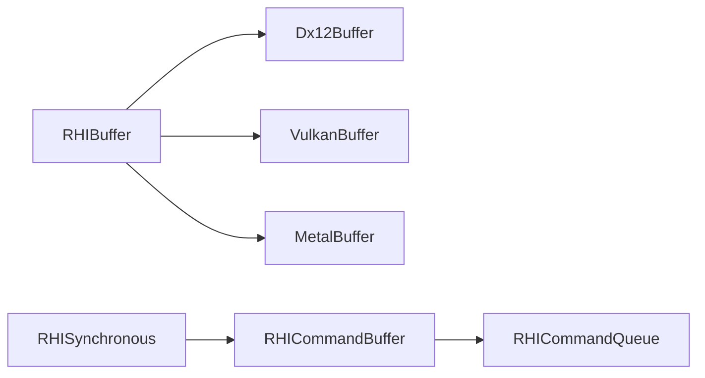

# CPU-GPU内存同步机制

<cite>
**本文引用的文件**
- [RHIBuffer.cs](file://src/SharpGPU/Abstract/RHIBuffer.cs)
- [RHIMemory.cs](file://src/SharpGPU/Abstract/RHIMemory.cs)
- [RHISynchronous.cs](file://src/SharpGPU/Abstract/RHISynchronous.cs)
- [RHICommandBuffer.cs](file://src/SharpGPU/Abstract/RHICommandBuffer.cs)
- [RHICommandQueue.cs](file://src/SharpGPU/Abstract/RHICommandQueue.cs)
- [Dx12Buffer.cs](file://src/SharpGPU/Dx12/Dx12Buffer.cs)
- [VulkanBuffer.cs](file://src/SharpGPU/Vulkan/VulkanBuffer.cs)
- [MetalBuffer.cs](file://src/SharpGPU/Metal/MetalBuffer.cs)
- [Dx12BarrierMappingTests.cs](file://tests/SharpGPU.Conformance.Tests/Dx12BarrierMappingTests.cs)
</cite>

## 目录
1. [简介](#简介)
2. [项目结构](#项目结构)
3. [核心组件](#核心组件)
4. [架构总览](#架构总览)
5. [详细组件分析](#详细组件分析)
6. [依赖关系分析](#依赖关系分析)
7. [性能考虑](#性能考虑)
8. [故障排查指南](#故障排查指南)
9. [结论](#结论)
10. [附录](#附录)

## 简介
本文件面向SharpGPU的CPU-GPU内存同步机制，系统性阐述：
- CPU与GPU之间的内存模型差异及显存、系统内存、共享内存的使用场景
- 内存屏障（Memory Barrier）的工作原理与使用方法
- 缓冲区映射（Mapping）与卸载（Unmapping）机制及数据可见性保证
- 不同后端（DX12、Vulkan、Metal）在内存同步方面的实现差异与优化策略
- 常见陷阱与性能优化建议

## 项目结构
SharpGPU采用抽象RHI层与多后端实现分离的架构。抽象层定义统一的缓冲、内存、同步与命令接口；各后端（DX12、Vulkan、Metal）提供具体实现，屏蔽平台差异。测试用例验证了屏障与映射行为的一致性。

图表来源
- [RHIBuffer.cs:14-47](file://src/SharpGPU/Abstract/RHIBuffer.cs#L14-L47)
- [RHIMemory.cs:173-457](file://src/SharpGPU/Abstract/RHIMemory.cs#L173-L457)
- [RHISynchronous.cs:282-661](file://src/SharpGPU/Abstract/RHISynchronous.cs#L282-L661)
- [RHICommandBuffer.cs:26-190](file://src/SharpGPU/Abstract/RHICommandBuffer.cs#L26-L190)
- [RHICommandQueue.cs:60-519](file://src/SharpGPU/Abstract/RHICommandQueue.cs#L60-L519)
- [Dx12Buffer.cs:8-147](file://src/SharpGPU/Dx12/Dx12Buffer.cs#L8-L147)
- [VulkanBuffer.cs:7-376](file://src/SharpGPU/Vulkan/VulkanBuffer.cs#L7-L376)
- [MetalBuffer.cs:8-142](file://src/SharpGPU/Metal/MetalBuffer.cs#L8-L142)

章节来源
- [RHIBuffer.cs:14-47](file://src/SharpGPU/Abstract/RHIBuffer.cs#L14-L47)
- [RHIMemory.cs:173-457](file://src/SharpGPU/Abstract/RHIMemory.cs#L173-L457)
- [RHISynchronous.cs:282-661](file://src/SharpGPU/Abstract/RHISynchronous.cs#L282-L661)
- [RHICommandBuffer.cs:26-190](file://src/SharpGPU/Abstract/RHICommandBuffer.cs#L26-L190)
- [RHICommandQueue.cs:60-519](file://src/SharpGPU/Abstract/RHICommandQueue.cs#L60-L519)
- [Dx12Buffer.cs:8-147](file://src/SharpGPU/Dx12/Dx12Buffer.cs#L8-L147)
- [VulkanBuffer.cs:7-376](file://src/SharpGPU/Vulkan/VulkanBuffer.cs#L7-L376)
- [MetalBuffer.cs:8-142](file://src/SharpGPU/Metal/MetalBuffer.cs#L8-L142)

## 核心组件
- 缓冲与映射
  - RHIBuffer定义了统一的Map/Unmap接口，用于CPU访问GPU可映射内存区域。
  - 各后端实现根据存储模式限制映射能力（如GPULocal不可映射）。
- 内存与堆管理
  - RHIMemory提供资源内存需求、堆描述、预算查询、驻留/驱逐请求以及堆放置注册表，确保对齐、重叠与生命周期安全。
- 同步原语
  - RHISynchronous定义Fence、Semaphore、Barrier（全局/缓冲/纹理），并包含队列所有权转移校验与阶段/访问掩码转换工具。
- 命令与队列
  - RHICommandBuffer负责记录命令与编码器状态机；RHICommandQueue负责提交、等待/信号语义量、完成栅栏，并提供一致性校验。

章节来源
- [RHIBuffer.cs:14-47](file://src/SharpGPU/Abstract/RHIBuffer.cs#L14-L47)
- [RHIMemory.cs:28-116](file://src/SharpGPU/Abstract/RHIMemory.cs#L28-L116)
- [RHIMemory.cs:173-457](file://src/SharpGPU/Abstract/RHIMemory.cs#L173-L457)
- [RHISynchronous.cs:14-176](file://src/SharpGPU/Abstract/RHISynchronous.cs#L14-L176)
- [RHISynchronous.cs:178-280](file://src/SharpGPU/Abstract/RHISynchronous.cs#L178-L280)
- [RHISynchronous.cs:282-661](file://src/SharpGPU/Abstract/RHISynchronous.cs#L282-L661)
- [RHICommandBuffer.cs:26-190](file://src/SharpGPU/Abstract/RHICommandBuffer.cs#L26-L190)
- [RHICommandQueue.cs:60-519](file://src/SharpGPU/Abstract/RHICommandQueue.cs#L60-L519)

## 架构总览
下图展示了从应用层到后端的内存同步路径：应用通过RHIBuffer进行映射/卸载，使用RHISynchronous插入屏障，并通过命令缓冲与队列提交工作负载，最终由后端实现完成底层同步。

图表来源
- [RHIBuffer.cs:44-46](file://src/SharpGPU/Abstract/RHIBuffer.cs#L44-L46)
- [Dx12Buffer.cs:99-133](file://src/SharpGPU/Dx12/Dx12Buffer.cs#L99-L133)
- [VulkanBuffer.cs:192-303](file://src/SharpGPU/Vulkan/VulkanBuffer.cs#L192-L303)
- [MetalBuffer.cs:85-120](file://src/SharpGPU/Metal/MetalBuffer.cs#L85-L120)
- [RHISynchronous.cs:396-510](file://src/SharpGPU/Abstract/RHISynchronous.cs#L396-L510)
- [RHICommandBuffer.cs:170-190](file://src/SharpGPU/Abstract/RHICommandBuffer.cs#L170-L190)
- [RHICommandQueue.cs:107-108](file://src/SharpGPU/Abstract/RHICommandQueue.cs#L107-L108)

## 详细组件分析

### 内存模型与使用场景
- 显存（GPU Local / Device Memory）
  - GPU独占或设备本地内存，通常不可被CPU直接映射读取。适用于高性能读写且无需CPU频繁访问的数据。
  - 后端对GPULocal/Memoryless的映射会拒绝或抛出异常，避免非法访问。
- 系统内存（Host Visible / Readback）
  - 可被CPU映射访问，适合上传/下载数据。Vulkan中Readback会在Map时执行invalidate，Upload类会在Unmap时flush。
- 共享内存（Shared / Managed）
  - 跨CPU/GPU可见的内存，Metal的Managed模式通过DidModifyRange通知驱动更新缓存一致性。

章节来源
- [Dx12Buffer.cs:99-133](file://src/SharpGPU/Dx12/Dx12Buffer.cs#L99-L133)
- [VulkanBuffer.cs:192-303](file://src/SharpGPU/Vulkan/VulkanBuffer.cs#L192-L303)
- [MetalBuffer.cs:85-120](file://src/SharpGPU/Metal/MetalBuffer.cs#L85-L120)

### 缓冲区映射与卸载（Mapping/Unmapping）
- 通用流程
  - 调用Map指定可读范围，返回CPU可访问指针；操作完成后调用Unmap指定写入范围以刷新可见性。
- 后端差异
  - DX12：直接调用底层Map/Unmap，GPULocal禁止映射。
  - Vulkan：首次Map时可能需Invalidate（读回）或Flush（上传），支持Placed Heap共享映射；Unmap前按存储模式决定是否Flush。
  - Metal：Managed模式下通过DidModifyRange标记修改范围，确保GPU可见。

图表来源
- [RHIBuffer.cs:44-46](file://src/SharpGPU/Abstract/RHIBuffer.cs#L44-L46)
- [Dx12Buffer.cs:99-133](file://src/SharpGPU/Dx12/Dx12Buffer.cs#L99-L133)
- [VulkanBuffer.cs:192-303](file://src/SharpGPU/Vulkan/VulkanBuffer.cs#L192-L303)
- [MetalBuffer.cs:85-120](file://src/SharpGPU/Metal/MetalBuffer.cs#L85-L120)

章节来源
- [RHIBuffer.cs:44-46](file://src/SharpGPU/Abstract/RHIBuffer.cs#L44-L46)
- [Dx12Buffer.cs:99-133](file://src/SharpGPU/Dx12/Dx12Buffer.cs#L99-L133)
- [VulkanBuffer.cs:192-303](file://src/SharpGPU/Vulkan/VulkanBuffer.cs#L192-L303)
- [MetalBuffer.cs:85-120](file://src/SharpGPU/Metal/MetalBuffer.cs#L85-L120)

### 内存屏障（Memory Barrier）
- 概念
  - 通过阶段掩码（StageMask）与访问掩码（AccessMask）声明资源在前后阶段的访问权限变化，确保数据一致性与正确布局。
- 类型
  - 全局屏障：影响所有资源
  - 缓冲屏障：针对缓冲区的范围与阶段/访问转换
  - 纹理屏障：针对子资源的布局转换与阶段/访问转换
- 队列所有权转移
  - 当SourceQueue与DestinationQueue不同时，需在记录队列上插入所有权转移屏障，并进行合法性校验。

图表来源
- [RHISynchronous.cs:396-510](file://src/SharpGPU/Abstract/RHISynchronous.cs#L396-L510)

章节来源
- [RHISynchronous.cs:282-661](file://src/SharpGPU/Abstract/RHISynchronous.cs#L282-L661)
- [Dx12BarrierMappingTests.cs:15-127](file://tests/SharpGPU.Conformance.Tests/Dx12BarrierMappingTests.cs#L15-L127)

### 命令缓冲与队列提交中的同步
- 命令缓冲状态机
  - 初始→录制→可执行→已提交，确保正确的生命周期与编码器嵌套。
- 队列提交
  - 支持等待/信号语义量与完成栅栏；提交前进行参数校验与预留状态，提交后标记命令缓冲为已提交。

图表来源
- [RHICommandBuffer.cs:26-190](file://src/SharpGPU/Abstract/RHICommandBuffer.cs#L26-L190)
- [RHICommandQueue.cs:118-330](file://src/SharpGPU/Abstract/RHICommandQueue.cs#L118-L330)

章节来源
- [RHICommandBuffer.cs:26-190](file://src/SharpGPU/Abstract/RHICommandBuffer.cs#L26-L190)
- [RHICommandQueue.cs:118-330](file://src/SharpGPU/Abstract/RHICommandQueue.cs#L118-L330)

### 后端实现差异与优化策略
- DX12
  - 通过ID3D12Resource的Map/Unmap实现映射；GPULocal禁止映射；屏障转换将阶段/访问映射到具体资源状态。
  - 优化：尽量批量化屏障与拷贝，减少状态切换；使用Committed/Placed资源按需选择。
- Vulkan
  - 使用vkMapMemory/vkUnmapMemory，结合vkInvalidateMappedMemoryRanges与vkFlushMappedMemoryRanges保证可见性；支持Placed Heap共享映射。
  - 优化：合理设置内存属性（HostVisible/DeviceLocal等），最小化Flush范围；利用队列家族与内存类型匹配。
- Metal
  - 使用MTLBuffer.Contents获取指针，Managed模式通过DidModifyRange通知驱动；GPULocal/Memoryless禁止映射。
  - 优化：优先使用Managed模式简化一致性；批量更新以减少调用次数。

章节来源
- [Dx12Buffer.cs:99-133](file://src/SharpGPU/Dx12/Dx12Buffer.cs#L99-L133)
- [VulkanBuffer.cs:192-303](file://src/SharpGPU/Vulkan/VulkanBuffer.cs#L192-L303)
- [MetalBuffer.cs:85-120](file://src/SharpGPU/Metal/MetalBuffer.cs#L85-L120)
- [Dx12BarrierMappingTests.cs:15-127](file://tests/SharpGPU.Conformance.Tests/Dx12BarrierMappingTests.cs#L15-L127)

## 依赖关系分析
- 耦合与内聚
  - RHIBuffer与各后端实现解耦，通过统一接口封装映射细节；RHISynchronous提供跨后端一致的屏障语义；RHICommandQueue集中处理同步原语的预留/提交/回滚。
- 外部依赖
  - 后端通过Vortice.Direct3D12、Vulkan原生API、Metal框架进行底层交互。
- 循环依赖
  - 抽象层不依赖具体后端，避免循环依赖；后端仅依赖抽象接口。

图表来源
- [RHIBuffer.cs:14-47](file://src/SharpGPU/Abstract/RHIBuffer.cs#L14-L47)
- [RHISynchronous.cs:282-661](file://src/SharpGPU/Abstract/RHISynchronous.cs#L282-L661)
- [RHICommandBuffer.cs:26-190](file://src/SharpGPU/Abstract/RHICommandBuffer.cs#L26-L190)
- [RHICommandQueue.cs:60-519](file://src/SharpGPU/Abstract/RHICommandQueue.cs#L60-L519)

章节来源
- [RHIBuffer.cs:14-47](file://src/SharpGPU/Abstract/RHIBuffer.cs#L14-L47)
- [RHISynchronous.cs:282-661](file://src/SharpGPU/Abstract/RHISynchronous.cs#L282-L661)
- [RHICommandBuffer.cs:26-190](file://src/SharpGPU/Abstract/RHICommandBuffer.cs#L26-L190)
- [RHICommandQueue.cs:60-519](file://src/SharpGPU/Abstract/RHICommandQueue.cs#L60-L519)

## 性能考虑
- 减少不必要的映射/卸载
  - 合并多次小范围写为一次大范围写，降低系统调用开销。
- 合理使用存储模式
  - 上传/下载使用HostVisible/Readback；高频GPU读写使用DeviceLocal；跨端共享使用Managed/Shared。
- 精确屏障粒度
  - 使用最小必要范围与阶段/访问掩码，避免过度同步。
- 批量化与延迟
  - 将屏障与拷贝命令批量化提交，利用队列并行性；必要时用栅栏协调CPU/GPU进度。
- 后端特定优化
  - Vulkan：最小化Flush范围，选择合适的内存类型；DX12：减少状态切换；Metal：利用Managed模式减少手动一致性管理。

[本节为通用指导，不直接分析具体文件]

## 故障排查指南
- 映射失败
  - 检查存储模式是否允许映射（GPULocal/Memoryless不可映射）；确认范围合法且不越界。
- 数据不一致
  - 确认在Map前已插入适当的屏障；Vulkan中Readback需Invalidate，Upload需Flush；Metal Managed需DidModifyRange。
- 提交错误
  - 检查命令缓冲状态是否为Executable；队列提交的等待/信号栅栏是否重复或来自不同设备。
- 堆与放置冲突
  - 检查堆大小与对齐；避免重叠放置；释放所有放置后再销毁堆。

章节来源
- [Dx12Buffer.cs:99-133](file://src/SharpGPU/Dx12/Dx12Buffer.cs#L99-L133)
- [VulkanBuffer.cs:192-303](file://src/SharpGPU/Vulkan/VulkanBuffer.cs#L192-L303)
- [MetalBuffer.cs:85-120](file://src/SharpGPU/Metal/MetalBuffer.cs#L85-L120)
- [RHICommandQueue.cs:118-330](file://src/SharpGPU/Abstract/RHICommandQueue.cs#L118-L330)
- [RHIMemory.cs:380-457](file://src/SharpGPU/Abstract/RHIMemory.cs#L380-L457)

## 结论
SharpGPU通过抽象RHI层统一了CPU-GPU内存同步语义，并在DX12、Vulkan、Metal后端实现了高效且安全的映射、屏障与提交机制。遵循本文的内存模型、屏障使用与后端差异说明，可有效避免常见陷阱并提升性能。

[本节为总结，不直接分析具体文件]

## 附录
- 典型用法参考（代码片段路径）
  - 缓冲映射与卸载：[Dx12Buffer.cs:99-133](file://src/SharpGPU/Dx12/Dx12Buffer.cs#L99-L133)、[VulkanBuffer.cs:192-303](file://src/SharpGPU/Vulkan/VulkanBuffer.cs#L192-L303)、[MetalBuffer.cs:85-120](file://src/SharpGPU/Metal/MetalBuffer.cs#L85-L120)
  - 屏障构建与队列所有权转移：[RHISynchronous.cs:396-661](file://src/SharpGPU/Abstract/RHISynchronous.cs#L396-L661)
  - 命令缓冲状态与提交：[RHICommandBuffer.cs:26-190](file://src/SharpGPU/Abstract/RHICommandBuffer.cs#L26-L190)、[RHICommandQueue.cs:118-330](file://src/SharpGPU/Abstract/RHICommandQueue.cs#L118-L330)
  - 堆放置与冲突检测：[RHIMemory.cs:380-457](file://src/SharpGPU/Abstract/RHIMemory.cs#L380-L457)
  - 屏障映射测试（DX12）：[Dx12BarrierMappingTests.cs:15-127](file://tests/SharpGPU.Conformance.Tests/Dx12BarrierMappingTests.cs#L15-L127)

[本节为附录，不直接分析具体文件]