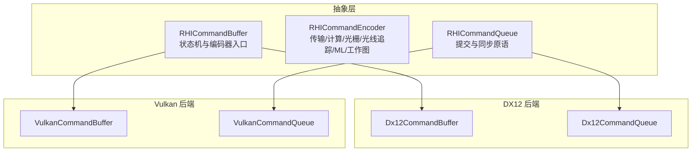
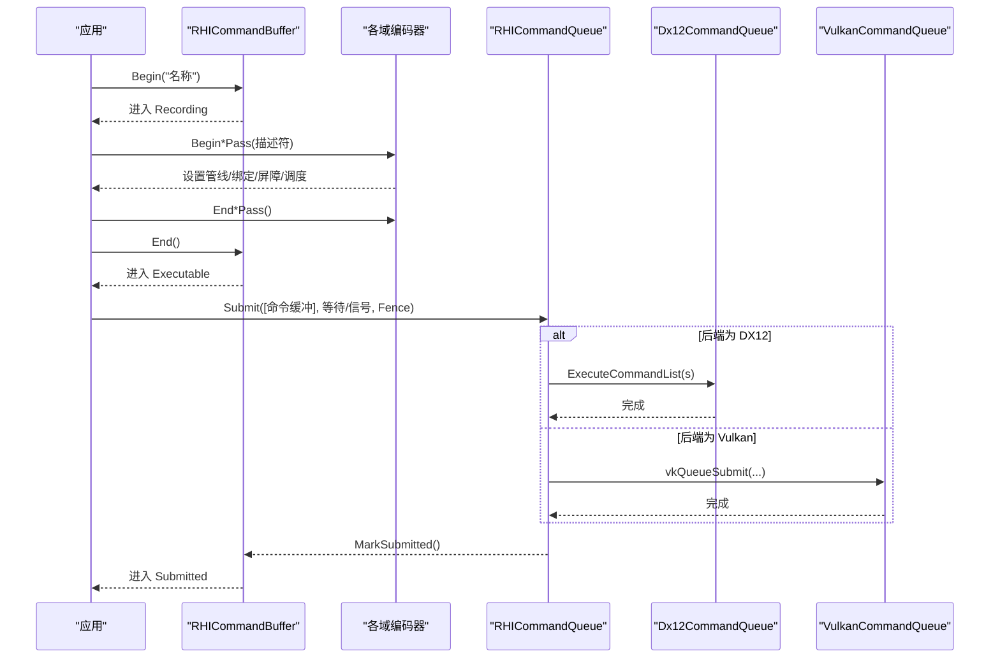
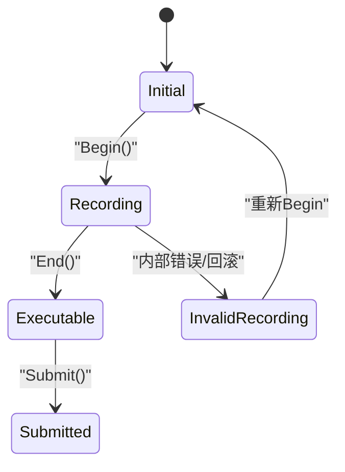
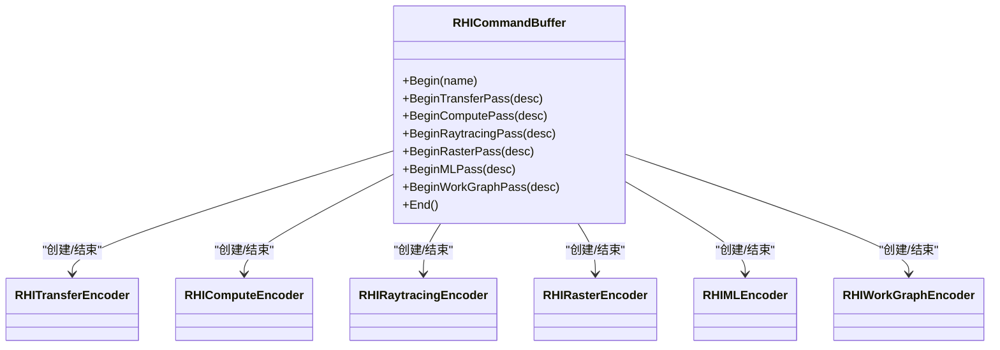
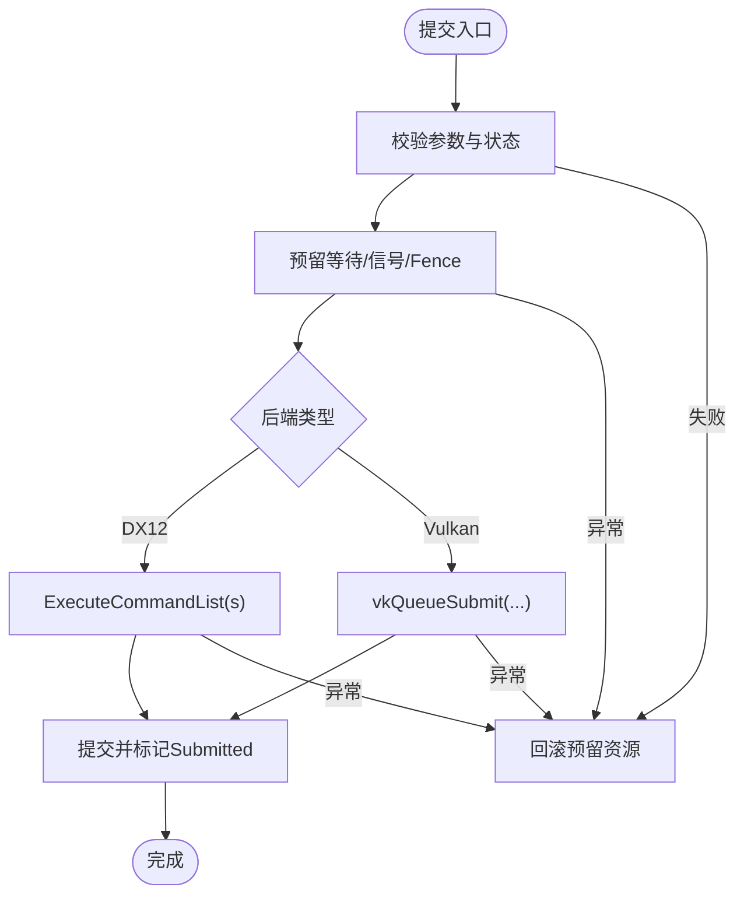
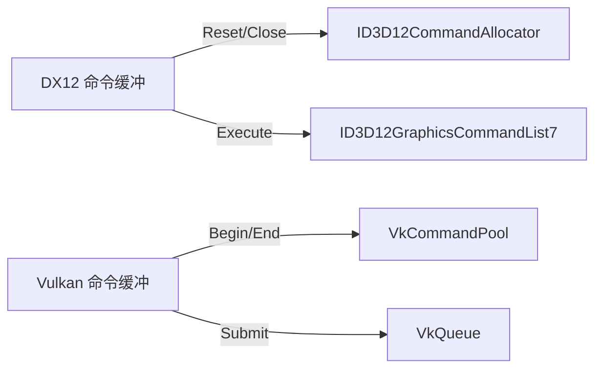
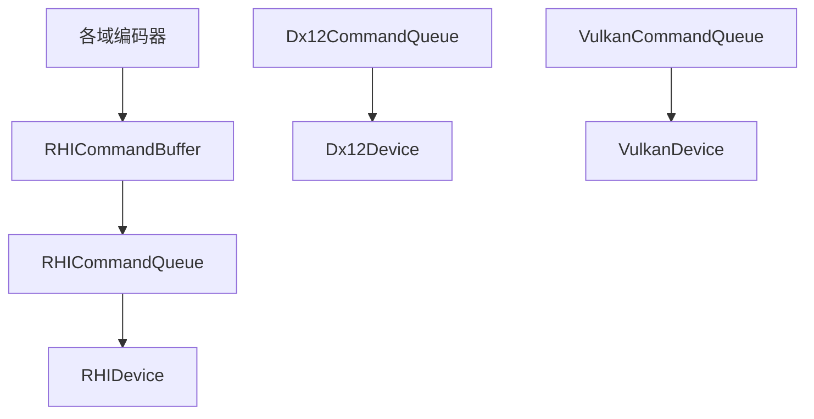

# 命令录制与执行流程

<cite>
**本文引用的文件**
- [RHICommandBuffer.cs](file://src/SharpGPU/Abstract/RHICommandBuffer.cs)
- [RHICommandEncoder.cs](file://src/SharpGPU/Abstract/RHICommandEncoder.cs)
- [RHICommandQueue.cs](file://src/SharpGPU/Abstract/RHICommandQueue.cs)
- [Dx12CommandBuffer.cs](file://src/SharpGPU/Dx12/Dx12CommandBuffer.cs)
- [Dx12CommandQueue.cs](file://src/SharpGPU/Dx12/Dx12CommandQueue.cs)
- [VulkanCommandBuffer.cs](file://src/SharpGPU/Vulkan/VulkanCommandBuffer.cs)
- [VulkanCommandQueue.cs](file://src/SharpGPU/Vulkan/VulkanCommandQueue.cs)
- [RHICommandBufferScopes.cs](file://src/SharpGPU/Common/Scopes/RHICommandBufferScopes.cs)
- [ComputeWorkload.cs](file://samples/ComputeAndDraw/ComputeWorkload.cs)
</cite>

## 目录
1. [简介](#简介)
2. [项目结构](#项目结构)
3. [核心组件](#核心组件)
4. [架构总览](#架构总览)
5. [详细组件分析](#详细组件分析)
6. [依赖关系分析](#依赖关系分析)
7. [性能考量](#性能考量)
8. [故障排查指南](#故障排查指南)
9. [结论](#结论)
10. [附录：端到端示例路径](#附录端到端示例路径)

## 简介
本文件聚焦 SharpGPU 的命令录制与执行流程，系统性说明命令缓冲的生命周期状态机、编码器类型与使用模式、命令提交到队列的机制与执行顺序保证、不同后端（DirectX12、Vulkan）的执行模型差异与性能特点，以及调试与性能分析工具的使用建议。文档以代码级为依据，提供可视化图表与最佳实践指导，帮助读者从“开始录制”到“提交执行”完整掌握命令流。

## 项目结构
SharpGPU 将命令系统抽象为三层：
- 抽象层（Abstract）：定义命令缓冲、编码器、队列的统一接口与生命周期管理。
- 后端实现层（Dx12、Vulkan、Metal）：针对具体 API 实现命令缓冲、编码器与队列。
- 公共工具与范围封装（Common/Scopes）：提供基于 using 的范围式 API，简化 Begin/End 配对与错误恢复。

**图示来源**
- [RHICommandBuffer.cs:6-24](file://src/SharpGPU/Abstract/RHICommandBuffer.cs#L6-L24)
- [RHICommandEncoder.cs:110-402](file://src/SharpGPU/Abstract/RHICommandEncoder.cs#L110-L402)
- [RHICommandQueue.cs:60-108](file://src/SharpGPU/Abstract/RHICommandQueue.cs#L60-L108)
- [Dx12CommandBuffer.cs:10-56](file://src/SharpGPU/Dx12/Dx12CommandBuffer.cs#L10-L56)
- [Dx12CommandQueue.cs:6-56](file://src/SharpGPU/Dx12/Dx12CommandQueue.cs#L6-L56)
- [VulkanCommandBuffer.cs:9-80](file://src/SharpGPU/Vulkan/VulkanCommandBuffer.cs#L9-L80)
- [VulkanCommandQueue.cs:6-61](file://src/SharpGPU/Vulkan/VulkanCommandQueue.cs#L6-L61)

**章节来源**
- [RHICommandBuffer.cs:6-24](file://src/SharpGPU/Abstract/RHICommandBuffer.cs#L6-L24)
- [RHICommandEncoder.cs:110-402](file://src/SharpGPU/Abstract/RHICommandEncoder.cs#L110-L402)
- [RHICommandQueue.cs:60-108](file://src/SharpGPU/Abstract/RHICommandQueue.cs#L60-L108)

## 核心组件
- 命令缓冲（RHICommandBuffer）：维护状态机（Initial → Recording → Executable → Submitted），控制 Begin/End 与各 Pass 的开启/结束，并持有当前活动编码器。
- 编码器（RHICommandEncoder 派生类）：按任务域划分，包括传输、计算、光线追踪、光栅化、机器学习、工作图；每个编码器负责该域内的资源绑定、屏障、统计与绘制/调度调用。
- 命令队列（RHICommandQueue）：负责提交命令缓冲、等待/信号同步原语（Semaphore/Fence）、以及稀疏绑定的队列有序操作。

关键职责与交互：
- 命令缓冲在 Begin 后进入 Recording，期间只能有一个活动编码器；End 后进入 Executable；提交后进入 Submitted。
- 队列在提交前校验命令缓冲状态、重复项、设备一致性等，并在成功提交后标记命令缓冲为已提交。

**章节来源**
- [RHICommandBuffer.cs:26-190](file://src/SharpGPU/Abstract/RHICommandBuffer.cs#L26-L190)
- [RHICommandEncoder.cs:110-402](file://src/SharpGPU/Abstract/RHICommandEncoder.cs#L110-L402)
- [RHICommandQueue.cs:118-310](file://src/SharpGPU/Abstract/RHICommandQueue.cs#L118-L310)

## 架构总览
下图展示从应用层到后端的命令录制与提交流程，涵盖状态转换、编码器创建与提交。

**图示来源**
- [RHICommandBuffer.cs:36-164](file://src/SharpGPU/Abstract/RHICommandBuffer.cs#L36-L164)
- [Dx12CommandQueue.cs:58-154](file://src/SharpGPU/Dx12/Dx12CommandQueue.cs#L58-L154)
- [VulkanCommandQueue.cs:63-158](file://src/SharpGPU/Vulkan/VulkanCommandQueue.cs#L63-L158)
- [RHICommandQueue.cs:118-310](file://src/SharpGPU/Abstract/RHICommandQueue.cs#L118-L310)

## 详细组件分析

### 命令缓冲生命周期与状态机
- 状态枚举：Initial、Recording、Executable、Submitted、InvalidRecording。
- 关键方法：
  - Begin：校验未处于 Recording、无活动编码器；重置底层命令对象；标记为 Recording。
  - Begin*Pass / End*Pass：严格校验活动编码器唯一性；记录活动编码器种类；结束时清空活动编码器。
  - End：校验所有 Pass 已结束；关闭底层命令列表/缓冲区；标记为 Executable。
  - ValidateCanSubmit / MarkSubmitted：仅允许 Executable 提交；提交成功后标记为 Submitted。

**图示来源**
- [RHICommandBuffer.cs:6-13](file://src/SharpGPU/Abstract/RHICommandBuffer.cs#L6-L13)
- [RHICommandBuffer.cs:36-164](file://src/SharpGPU/Abstract/RHICommandBuffer.cs#L36-L164)

**章节来源**
- [RHICommandBuffer.cs:36-164](file://src/SharpGPU/Abstract/RHICommandBuffer.cs#L36-L164)

### 编码器类型与使用模式
- 传输编码器（RHITransferEncoder）：用于内存拷贝、布局转换、屏障、时间戳写入、查询解析。
- 计算编码器（RHIComputeEncoder）：设置管线、绑定表、推送常量、Dispatch/Indirect、统计、采样器反馈相关操作。
- 光线追踪编码器（RHIRaytracingEncoder）：构建加速结构、不透明度微映射、Dispatch/Indirect 与函数表。
- 光栅化编码器（RHIRasterEncoder）：渲染通道、附件描述、子pass、视图/深度模板处理。
- 机器学习编码器（RHIMLEncoder）：设置 ML 管线与绑定表、Dispatch。
- 工作图编码器（RHIWorkGraphEncoder）：设置管线、绑定表、推送常量、后备内存、DispatchGraph。

每种编码器均遵循 BeginPass/EndPass 成对使用，并通过命令缓冲的活动编码器校验确保互斥。

**图示来源**
- [RHICommandBuffer.cs:170-190](file://src/SharpGPU/Abstract/RHICommandBuffer.cs#L170-L190)
- [RHICommandEncoder.cs:110-402](file://src/SharpGPU/Abstract/RHICommandEncoder.cs#L110-L402)

**章节来源**
- [RHICommandEncoder.cs:110-402](file://src/SharpGPU/Abstract/RHICommandEncoder.cs#L110-L402)

### 命令提交到队列与执行顺序保证
- 提交描述符（RHIQueueSubmitDescriptor）包含命令缓冲数组、等待/信号 Semaphore、完成 Fence。
- 队列提交前进行严格校验：
  - 命令缓冲必须来自同一队列且处于 Executable。
  - 禁止重复提交同一命令缓冲。
  - 等待/信号 Semaphore 必须属于同一设备且非空阶段掩码。
  - Fence 必须属于同一设备。
- 提交过程：
  - 预留（Reserve）：为等待/信号与 Fence 保留资源。
  - 执行：DX12 调用 ExecuteCommandList(s)，Vulkan 调用 vkQueueSubmit。
  - 提交（Commit）：标记命令缓冲为 Submitted，提交 Semaphore/Fence。
  - 回滚（Rollback）：异常时释放预留资源。

**图示来源**
- [RHICommandQueue.cs:118-310](file://src/SharpGPU/Abstract/RHICommandQueue.cs#L118-L310)
- [Dx12CommandQueue.cs:58-154](file://src/SharpGPU/Dx12/Dx12CommandQueue.cs#L58-L154)
- [VulkanCommandQueue.cs:63-158](file://src/SharpGPU/Vulkan/VulkanCommandQueue.cs#L63-L158)

**章节来源**
- [RHICommandQueue.cs:118-310](file://src/SharpGPU/Abstract/RHICommandQueue.cs#L118-L310)
- [Dx12CommandQueue.cs:58-154](file://src/SharpGPU/Dx12/Dx12CommandQueue.cs#L58-L154)
- [VulkanCommandQueue.cs:63-158](file://src/SharpGPU/Vulkan/VulkanCommandQueue.cs#L63-L158)

### 后端差异与性能特点
- DirectX12：
  - 命令缓冲使用 ID3D12CommandAllocator + ID3D12GraphicsCommandList7；Begin 时 Reset 分配器与命令列表，End 时 Close。
  - 提交支持单个或多个命令列表批量执行；通过 Wait/Signal 原生 Fence/Semaphore 同步。
  - 适合高吞吐批处理，命令列表复用可显著降低 CPU 开销。
- Vulkan：
  - 命令缓冲来自 VkCommandPool，Begin 使用 OneTimeSubmit 标志；End 调用 vkEndCommandBuffer。
  - 提交使用 vkQueueSubmit，支持等待阶段掩码与多个命令缓冲。
  - 图像布局覆盖（ImageLayoutOverlay）与临时资源检查点（Transient Resource Checkpoint）保障录制稳定性与回滚能力。

**图示来源**
- [Dx12CommandBuffer.cs:58-111](file://src/SharpGPU/Dx12/Dx12CommandBuffer.cs#L58-L111)
- [Dx12CommandBuffer.cs:189-210](file://src/SharpGPU/Dx12/Dx12CommandBuffer.cs#L189-L210)
- [VulkanCommandBuffer.cs:82-98](file://src/SharpGPU/Vulkan/VulkanCommandBuffer.cs#L82-L98)
- [VulkanCommandBuffer.cs:550-555](file://src/SharpGPU/Vulkan/VulkanCommandBuffer.cs#L550-L555)

**章节来源**
- [Dx12CommandBuffer.cs:58-210](file://src/SharpGPU/Dx12/Dx12CommandBuffer.cs#L58-L210)
- [VulkanCommandBuffer.cs:82-98](file://src/SharpGPU/Vulkan/VulkanCommandBuffer.cs#L82-L98)
- [VulkanCommandBuffer.cs:550-555](file://src/SharpGPU/Vulkan/VulkanCommandBuffer.cs#L550-L555)

### 命令录制的最佳实践
- 批处理优化：
  - 合并同域编码器的多次调用，减少状态切换。
  - 尽量使用批量命令（如 ExecuteIndirect、批量拷贝）以降低驱动开销。
  - 合理组织 Barrier，避免不必要的跨阶段屏障。
- 状态管理：
  - 严格遵循 Begin/End 配对，推荐使用范围封装（using）。
  - 避免在同一命令缓冲中混用多种活动编码器。
  - 利用统计与时间戳（WriteTimestamp、Statistics）定位瓶颈。
- 资源与内存：
  - 合理使用 Buffer/Texture 的使用标志与存储模式，减少隐式转换。
  - 注意采样器反馈、不透明度微映射等特性的能力检查。

**章节来源**
- [RHICommandEncoder.cs:110-402](file://src/SharpGPU/Abstract/RHICommandEncoder.cs#L110-L402)
- [RHICommandBufferScopes.cs:6-168](file://src/SharpGPU/Common/Scopes/RHICommandBufferScopes.cs#L6-L168)

## 依赖关系分析
- 命令缓冲依赖队列：命令缓冲持有 CommandQueue 引用，提交时需验证归属。
- 编码器依赖命令缓冲：各编码器通过 m_CommandBuffer 访问状态与生命周期。
- 队列依赖设备：提交时校验 Semaphore/Fence 所属设备一致。
- 后端依赖原生 API：DX12 依赖 Vortice.Direct3D12，Vulkan 依赖 Vortice.Vulkan。

**图示来源**
- [RHICommandBuffer.cs:31-34](file://src/SharpGPU/Abstract/RHICommandBuffer.cs#L31-L34)
- [RHICommandQueue.cs:95-108](file://src/SharpGPU/Abstract/RHICommandQueue.cs#L95-L108)
- [Dx12CommandQueue.cs:31-56](file://src/SharpGPU/Dx12/Dx12CommandQueue.cs#L31-L56)
- [VulkanCommandQueue.cs:40-61](file://src/SharpGPU/Vulkan/VulkanCommandQueue.cs#L40-L61)

**章节来源**
- [RHICommandBuffer.cs:31-34](file://src/SharpGPU/Abstract/RHICommandBuffer.cs#L31-L34)
- [RHICommandQueue.cs:95-108](file://src/SharpGPU/Abstract/RHICommandQueue.cs#L95-L108)

## 性能考量
- 命令缓冲复用：DX12 中命令分配器与命令列表可复用，减少 CPU 侧分配与重置成本。
- 批量提交：一次提交多个命令缓冲可降低驱动调用次数。
- 屏障最小化：仅在必要时插入屏障，避免过度同步。
- 统计与时间戳：使用 WriteTimestamp 与 Statistics 量化各 Pass 耗时。
- 后端特性：DX12 的 ExecuteCommandLists、Vulkan 的 vkQueueSubmit 均支持多命令缓冲；合理利用以提升吞吐。

[本节为通用性能建议，不直接分析具体文件]

## 故障排查指南
- 常见错误与定位：
  - “命令缓冲已在录制中”：重复 Begin 或上一个 Pass 未正确 End。
  - “活动编码器冲突”：同时存在多个活动编码器。
  - “命令缓冲未结束就提交”：缺少 End 或 End 失败。
  - “命令缓冲不属于该队列”：跨队列提交。
  - “Semaphore/Fence 不属于同一设备”：设备不一致。
- 后端特定问题：
  - DX12：Begin 失败可能因分配器仍在 GPU 飞行；检查提交/Fence 时序。
  - Vulkan：图像布局不一致会触发布局覆盖校验失败；检查 Barrier 与 SubresourceRange。
- 调试工具：
  - 使用 PushDebugGroup/PopDebugGroup 命名关键段落。
  - 启用平台调试层（如 PIX、Vulkan Validation Layers）捕获错误信息。
  - 使用 WriteTimestamp 与 Query 获取精确的时间测量。

**章节来源**
- [RHICommandBuffer.cs:36-164](file://src/SharpGPU/Abstract/RHICommandBuffer.cs#L36-L164)
- [Dx12CommandBuffer.cs:87-111](file://src/SharpGPU/Dx12/Dx12CommandBuffer.cs#L87-L111)
- [VulkanCommandBuffer.cs:100-189](file://src/SharpGPU/Vulkan/VulkanCommandBuffer.cs#L100-L189)

## 结论
SharpGPU 通过统一的抽象层定义了命令缓冲的状态机与编码器体系，结合后端特定的实现细节，提供了高效、可扩展的命令录制与执行框架。遵循严格的 Begin/End 配对、合理的屏障与批处理策略，可在不同后端上获得稳定且高性能的图形与计算任务执行。借助调试与性能分析工具，开发者可以精准定位瓶颈并持续优化。

[本节为总结性内容，不直接分析具体文件]

## 附录：端到端示例路径
以下示例展示了从命令录制到执行的完整流程，包括计算 Pass、传输 Pass、提交与同步：
- 示例入口与后端选择：[Program.cs](file://samples/ComputeAndDraw/Program.cs)
- 计算负载与命令录制：[ComputeWorkload.cs](file://samples/ComputeAndDraw/ComputeWorkload.cs)
- 命令缓冲与队列抽象：[RHICommandBuffer.cs](file://src/SharpGPU/Abstract/RHICommandBuffer.cs)、[RHICommandQueue.cs](file://src/SharpGPU/Abstract/RHICommandQueue.cs)
- DX12 后端实现：[Dx12CommandBuffer.cs](file://src/SharpGPU/Dx12/Dx12CommandBuffer.cs)、[Dx12CommandQueue.cs](file://src/SharpGPU/Dx12/Dx12CommandQueue.cs)
- Vulkan 后端实现：[VulkanCommandBuffer.cs](file://src/SharpGPU/Vulkan/VulkanCommandBuffer.cs)、[VulkanCommandQueue.cs](file://src/SharpGPU/Vulkan/VulkanCommandQueue.cs)

**章节来源**
- [ComputeWorkload.cs:117-147](file://samples/ComputeAndDraw/ComputeWorkload.cs#L117-L147)
- [RHICommandBuffer.cs:170-190](file://src/SharpGPU/Abstract/RHICommandBuffer.cs#L170-L190)
- [RHICommandQueue.cs:118-310](file://src/SharpGPU/Abstract/RHICommandQueue.cs#L118-L310)
- [Dx12CommandBuffer.cs:87-210](file://src/SharpGPU/Dx12/Dx12CommandBuffer.cs#L87-L210)
- [Dx12CommandQueue.cs:58-154](file://src/SharpGPU/Dx12/Dx12CommandQueue.cs#L58-L154)
- [VulkanCommandBuffer.cs:82-98](file://src/SharpGPU/Vulkan/VulkanCommandBuffer.cs#L82-L98)
- [VulkanCommandQueue.cs:63-158](file://src/SharpGPU/Vulkan/VulkanCommandQueue.cs#L63-L158)