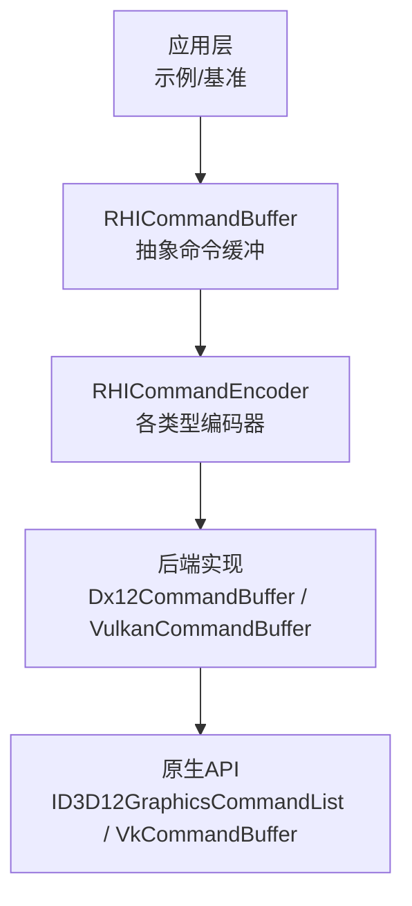
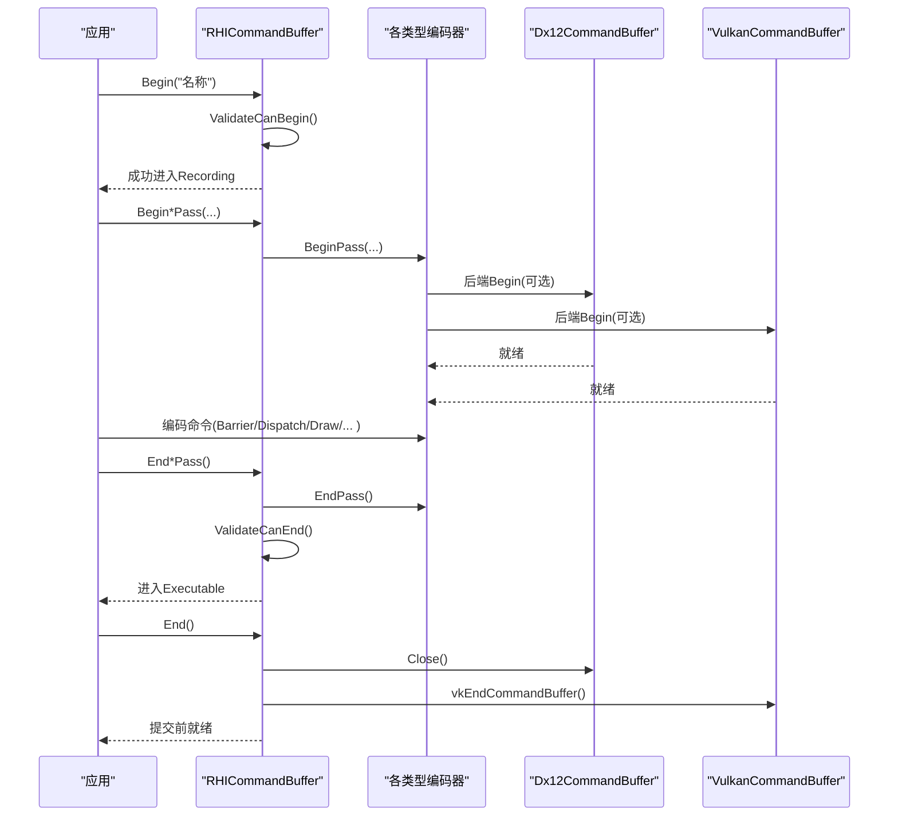
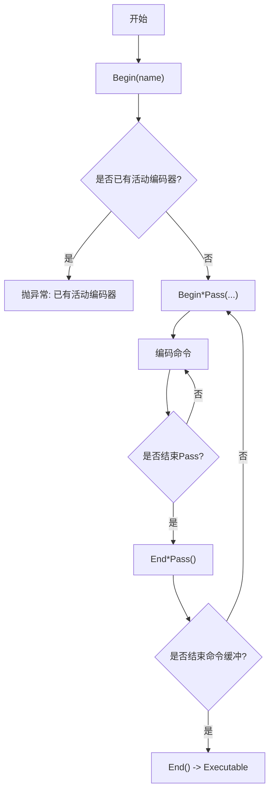
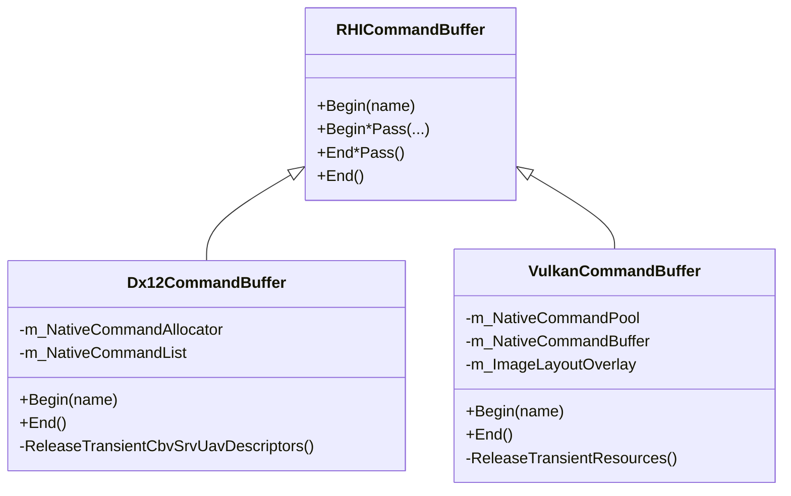
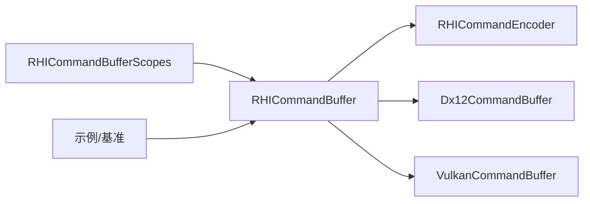

# 命令录制最佳实践

<cite>
**本文引用的文件**
- [RHICommandBuffer.cs](file://src/SharpGPU/Abstract/RHICommandBuffer.cs)
- [RHICommandEncoder.cs](file://src/SharpGPU/Abstract/RHICommandEncoder.cs)
- [RHICommandBufferScopes.cs](file://src/SharpGPU/Common/Scopes/RHICommandBufferScopes.cs)
- [Dx12CommandBuffer.cs](file://src/SharpGPU/Dx12/Dx12CommandBuffer.cs)
- [VulkanCommandBuffer.cs](file://src/SharpGPU/Vulkan/VulkanCommandBuffer.cs)
- [Program.cs（基准）](file://benchmarks/SharpGPU.Benchmarks/Program.cs)
- [RasterWorkload.cs](file://samples/ComputeAndDraw/RasterWorkload.cs)
- [ComputeWorkload.cs](file://samples/ComputeAndDraw/ComputeWorkload.cs)
</cite>

## 目录
1. [简介](#简介)
2. [项目结构](#项目结构)
3. [核心组件](#核心组件)
4. [架构总览](#架构总览)
5. [详细组件分析](#详细组件分析)
6. [依赖关系分析](#依赖关系分析)
7. [性能注意事项](#性能注意事项)
8. [故障排查指南](#故障排查指南)
9. [结论](#结论)
10. [附录](#附录)

## 简介
本文件面向使用 SharpGPU 进行命令录制的开发者，聚焦于高性能、可维护的命令录制实践。内容涵盖：批处理与状态缓存策略、资源重用、命令缓冲区设计与作用域管理、避免常见性能陷阱、多线程录制注意事项、内存管理与垃圾回收优化、性能分析与调试技巧，以及复杂场景下的录制模式与架构设计。所有建议均基于仓库中的抽象接口与后端实现（DirectX 12、Vulkan）及示例/基准代码提炼而成。

## 项目结构
SharpGPU 将命令录制抽象为统一的 RHICommandBuffer 与各类型编码器（传输、计算、栅格化、光线追踪、机器学习、工作图），并通过具体后端（Dx12、Vulkan）实现底层细节。作用域封装（using scope）确保 Begin/End 成对调用，降低错误率并提升可维护性。

图表来源
- [RHICommandBuffer.cs:26-190](file://src/SharpGPU/Abstract/RHICommandBuffer.cs#L26-L190)
- [RHICommandEncoder.cs:110-402](file://src/SharpGPU/Abstract/RHICommandEncoder.cs#L110-L402)
- [Dx12CommandBuffer.cs:10-301](file://src/SharpGPU/Dx12/Dx12CommandBuffer.cs#L10-L301)
- [VulkanCommandBuffer.cs:9-629](file://src/SharpGPU/Vulkan/VulkanCommandBuffer.cs#L9-L629)

章节来源
- [RHICommandBuffer.cs:26-190](file://src/SharpGPU/Abstract/RHICommandBuffer.cs#L26-L190)
- [RHICommandEncoder.cs:110-402](file://src/SharpGPU/Abstract/RHICommandEncoder.cs#L110-L402)
- [Dx12CommandBuffer.cs:10-301](file://src/SharpGPU/Dx12/Dx12CommandBuffer.cs#L10-L301)
- [VulkanCommandBuffer.cs:9-629](file://src/SharpGPU/Vulkan/VulkanCommandBuffer.cs#L9-L629)

## 核心组件
- 命令缓冲与状态机
  - 命令缓冲生命周期：Initial → Recording → Executable → Submitted；非法状态转换会抛出异常，防止误用。
  - 活动编码器跟踪：同一时刻仅允许一个活动编码器，避免混用不同阶段命令。
- 编码器族
  - 传输、计算、栅格化、光线追踪、机器学习、工作图等编码器统一提供 Barrier、统计/时间戳、Pass 边界等能力。
- 作用域封装
  - 通过 BeginScoped* 与 using 自动 End，保证 Pass 和命令缓冲的配对关闭，减少遗漏风险。

章节来源
- [RHICommandBuffer.cs:6-168](file://src/SharpGPU/Abstract/RHICommandBuffer.cs#L6-L168)
- [RHICommandEncoder.cs:110-402](file://src/SharpGPU/Abstract/RHICommandEncoder.cs#L110-L402)
- [RHICommandBufferScopes.cs:6-168](file://src/SharpGPU/Common/Scopes/RHICommandBufferScopes.cs#L6-L168)

## 架构总览
下图展示了从应用到后端的命令录制路径，以及关键的状态校验点。

图表来源
- [RHICommandBuffer.cs:36-168](file://src/SharpGPU/Abstract/RHICommandBuffer.cs#L36-L168)
- [Dx12CommandBuffer.cs:87-210](file://src/SharpGPU/Dx12/Dx12CommandBuffer.cs#L87-L210)
- [VulkanCommandBuffer.cs:82-555](file://src/SharpGPU/Vulkan/VulkanCommandBuffer.cs#L82-L555)

## 详细组件分析

### 命令缓冲状态机与作用域管理
- 状态机要点
  - Begin 前必须处于非 Recording 且无活动编码器。
  - 每个 Pass 有独立的 Begin/End，且必须在命令缓冲结束前完成。
  - End 之前需确保所有活动编码器已正确结束。
- 作用域模式
  - 使用 BeginScoped* 配合 using 自动调用 End*Pass，避免遗漏。
  - 在异常路径也能可靠释放，提高鲁棒性。

图表来源
- [RHICommandBuffer.cs:36-168](file://src/SharpGPU/Abstract/RHICommandBuffer.cs#L36-L168)
- [RHICommandBufferScopes.cs:117-168](file://src/SharpGPU/Common/Scopes/RHICommandBufferScopes.cs#L117-L168)

章节来源
- [RHICommandBuffer.cs:36-168](file://src/SharpGPU/Abstract/RHICommandBuffer.cs#L36-L168)
- [RHICommandBufferScopes.cs:6-168](file://src/SharpGPU/Common/Scopes/RHICommandBufferScopes.cs#L6-L168)

### 后端命令缓冲实现对比（DX12 vs Vulkan）
- DirectX 12
  - 每帧重置分配器与命令列表，设置描述符堆，关闭命令列表。
  - 临时 CBV/SRV/UAV 描述符在 Begin 时释放，避免泄漏。
- Vulkan
  - 重置命令缓冲、清理图像布局覆盖表与临时资源。
  - 栅格化 Pass 失败时回滚到检查点，保证命令缓冲一致性。

图表来源
- [RHICommandBuffer.cs:26-190](file://src/SharpGPU/Abstract/RHICommandBuffer.cs#L26-L190)
- [Dx12CommandBuffer.cs:10-301](file://src/SharpGPU/Dx12/Dx12CommandBuffer.cs#L10-L301)
- [VulkanCommandBuffer.cs:9-629](file://src/SharpGPU/Vulkan/VulkanCommandBuffer.cs#L9-L629)

章节来源
- [Dx12CommandBuffer.cs:58-111](file://src/SharpGPU/Dx12/Dx12CommandBuffer.cs#L58-L111)
- [Dx12CommandBuffer.cs:189-210](file://src/SharpGPU/Dx12/Dx12CommandBuffer.cs#L189-L210)
- [VulkanCommandBuffer.cs:82-98](file://src/SharpGPU/Vulkan/VulkanCommandBuffer.cs#L82-L98)
- [VulkanCommandBuffer.cs:163-194](file://src/SharpGPU/Vulkan/VulkanCommandBuffer.cs#L163-L194)

### 批处理与状态缓存
- 批处理策略
  - 在同一 Pass 内尽量合并相同状态的绘制/调度，减少状态切换。
  - 利用间接命令或批量拷贝（如基准中的大量 CopyBufferToBuffer）提升吞吐。
- 状态缓存
  - 编码器内部缓存管线/绑定表等昂贵对象，避免重复设置。
  - 示例中 Compute/RayTracing/ML/WorkGraph 编码器均包含 m_CachedPipeline 字段用于缓存。

章节来源
- [RHICommandEncoder.cs:135-181](file://src/SharpGPU/Abstract/RHICommandEncoder.cs#L135-L181)
- [RHICommandEncoder.cs:279-339](file://src/SharpGPU/Abstract/RHICommandEncoder.cs#L279-L339)
- [RHICommandEncoder.cs:347-402](file://src/SharpGPU/Abstract/RHICommandEncoder.cs#L347-L402)
- [Program.cs（基准）:688-733](file://benchmarks/SharpGPU.Benchmarks/Program.cs#L688-L733)

### 资源重用与临时资源管理
- 资源重用
  - 复用命令缓冲、队列、管线、绑定表，避免每帧创建销毁。
  - 示例中命令缓冲由队列创建并在用例结束后释放。
- 临时资源
  - DX12：临时描述符在 Begin 时释放，避免跨帧残留。
  - Vulkan：使用检查点机制记录临时分配、视图、Framebuffer、RenderPass、描述集租约、栅格管线，失败时回滚。

章节来源
- [Dx12CommandBuffer.cs:262-282](file://src/SharpGPU/Dx12/Dx12CommandBuffer.cs#L262-L282)
- [VulkanCommandBuffer.cs:196-330](file://src/SharpGPU/Vulkan/VulkanCommandBuffer.cs#L196-L330)
- [RasterWorkload.cs:104-152](file://samples/ComputeAndDraw/RasterWorkload.cs#L104-L152)
- [ComputeWorkload.cs:116-147](file://samples/ComputeAndDraw/ComputeWorkload.cs#L116-L147)

### 屏障与状态转换
- 显式声明资源访问与阶段转换，避免隐式同步带来的性能损失。
- 在计算/传输/栅格化之间插入合适的 Barrier，确保数据可见性与顺序。
- 示例中计算 Pass 写入 UAO 后，在传输 Pass 读取前做屏障。

章节来源
- [ComputeWorkload.cs:118-141](file://samples/ComputeAndDraw/ComputeWorkload.cs#L118-L141)
- [RasterWorkload.cs:162-179](file://samples/ComputeAndDraw/RasterWorkload.cs#L162-L179)

### 统计与时间戳
- 在 Pass 描述中配置统计查询或时间戳，便于性能剖析。
- 示例中栅格 Pass 启用统计查询，传输 Pass 中解析结果。

章节来源
- [RasterWorkload.cs:107-145](file://samples/ComputeAndDraw/RasterWorkload.cs#L107-L145)
- [Program.cs（基准）:542-580](file://benchmarks/SharpGPU.Benchmarks/Program.cs#L542-L580)

### 复杂场景模式
- 工作图（WorkGraph）
  - 设置管线、后备内存、输入记录，批量 DispatchGraph 以提升效率。
- 大规模绑定表更新
  - 通过循环更新绑定元素，模拟高负载录制场景。

章节来源
- [Program.cs（基准）:582-628](file://benchmarks/SharpGPU.Benchmarks/Program.cs#L582-L628)
- [Program.cs（基准）:630-686](file://benchmarks/SharpGPU.Benchmarks/Program.cs#L630-L686)

## 依赖关系分析
- 高层抽象（RHICommandBuffer/Encoder）与后端实现（Dx12/Vulkan）解耦，便于替换与测试。
- 作用域扩展依赖抽象命令缓冲，提供安全的 Begin/End 包装。
- 示例与基准依赖抽象 API，不直接耦合后端，利于跨平台验证。

图表来源
- [RHICommandBufferScopes.cs:117-168](file://src/SharpGPU/Common/Scopes/RHICommandBufferScopes.cs#L117-L168)
- [RHICommandBuffer.cs:26-190](file://src/SharpGPU/Abstract/RHICommandBuffer.cs#L26-L190)
- [Dx12CommandBuffer.cs:10-301](file://src/SharpGPU/Dx12/Dx12CommandBuffer.cs#L10-L301)
- [VulkanCommandBuffer.cs:9-629](file://src/SharpGPU/Vulkan/VulkanCommandBuffer.cs#L9-L629)

章节来源
- [RHICommandBufferScopes.cs:117-168](file://src/SharpGPU/Common/Scopes/RHICommandBufferScopes.cs#L117-L168)
- [RHICommandBuffer.cs:26-190](file://src/SharpGPU/Abstract/RHICommandBuffer.cs#L26-L190)

## 性能注意事项
- 批处理优先
  - 将同类型操作聚合到同一 Pass，减少状态切换与同步开销。
  - 使用批量拷贝/调度（如基准中的大量拷贝与工作图分发）。
- 状态缓存
  - 复用管线、绑定表、布局等昂贵对象；编码器内部已缓存管线。
- 资源重用
  - 复用命令缓冲、队列、Fence、查询对象；避免每帧新建。
- 最小化屏障
  - 仅在必要时插入屏障，合理划分 Pass，减少不必要的同步。
- 避免频繁分配
  - 使用临时资源检查点与回滚（Vulkan），或在 Begin 时释放临时描述符（DX12）。
- 线程安全
  - 命令缓冲通常按线程/队列隔离；不要在多个线程共享同一命令缓冲。
  - 若需多线程录制，应为每个线程准备独立的命令缓冲与资源，再统一提交。
- 内存与GC
  - 基准中在测量前执行 GC 收集，确保零分配要求；生产环境应避免在热路径分配托管对象。
  - 合理使用 using 与 Dispose，及时释放 GPU 资源。

章节来源
- [Program.cs（基准）:84-129](file://benchmarks/SharpGPU.Benchmarks/Program.cs#L84-L129)
- [Program.cs（基准）:688-733](file://benchmarks/SharpGPU.Benchmarks/Program.cs#L688-L733)
- [Dx12CommandBuffer.cs:262-282](file://src/SharpGPU/Dx12/Dx12CommandBuffer.cs#L262-L282)
- [VulkanCommandBuffer.cs:196-330](file://src/SharpGPU/Vulkan/VulkanCommandBuffer.cs#L196-L330)

## 故障排查指南
- 常见错误
  - 未 Begin 即开始 Pass：状态机校验会抛出异常。
  - 未结束活动编码器即结束命令缓冲：状态机校验会提示需先结束当前编码器。
  - 提交前未结束命令缓冲：提交前校验会阻止无效提交。
- 后端特定问题
  - DX12：Begin 重置失败可能因分配器仍在 GPU 使用中或提交序列错误；End 失败时打印设备消息辅助定位。
  - Vulkan：栅格 Pass 开始失败时回滚临时资源与图像布局，保持命令缓冲一致。
- 调试技巧
  - 使用 Pass 名称与调试组标记（PushDebugGroup/PopDebugGroup）以便工具可视化。
  - 启用时间戳与统计查询，结合基准输出定位瓶颈。
  - 在 DX12 下使用 PIX 事件标记（调试构建）观察命令流。

章节来源
- [RHICommandBuffer.cs:36-168](file://src/SharpGPU/Abstract/RHICommandBuffer.cs#L36-L168)
- [Dx12CommandBuffer.cs:87-111](file://src/SharpGPU/Dx12/Dx12CommandBuffer.cs#L87-L111)
- [Dx12CommandBuffer.cs:189-210](file://src/SharpGPU/Dx12/Dx12CommandBuffer.cs#L189-L210)
- [VulkanCommandBuffer.cs:163-194](file://src/SharpGPU/Vulkan/VulkanCommandBuffer.cs#L163-L194)
- [RHICommandEncoder.cs:110-133](file://src/SharpGPU/Abstract/RHICommandEncoder.cs#L110-L133)

## 结论
通过统一的状态机、作用域封装与后端特定的资源管理策略，SharpGPU 提供了高效且安全的命令录制体验。实践中应优先采用批处理、状态缓存与资源重用，严格遵循 Pass 边界与屏障语义，并结合时间戳/统计查询进行性能分析。在多线程环境下，务必隔离命令缓冲与资源，避免共享导致的竞争与死锁。借助示例与基准代码，可以快速验证和优化录制路径。

## 附录
- 快速参考
  - 使用 BeginScoped* 简化 Pass 生命周期管理。
  - 在计算/传输/栅格化之间插入合适的 Barrier。
  - 通过统计/时间戳量化性能。
- 推荐流程
  - 创建命令缓冲 → Begin → Begin*Pass → 编码命令 → End*Pass → End → 提交 → 等待完成。
  - 复用管线/绑定表/查询/Fence，减少每帧开销。
  - 在热路径避免分配，必要时在基准中强制零分配以验证。