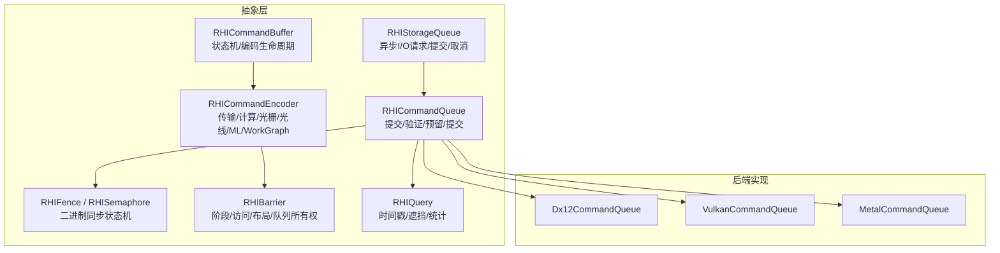
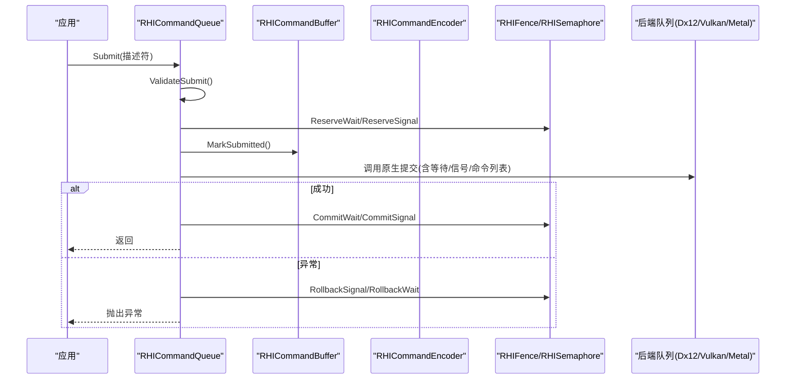
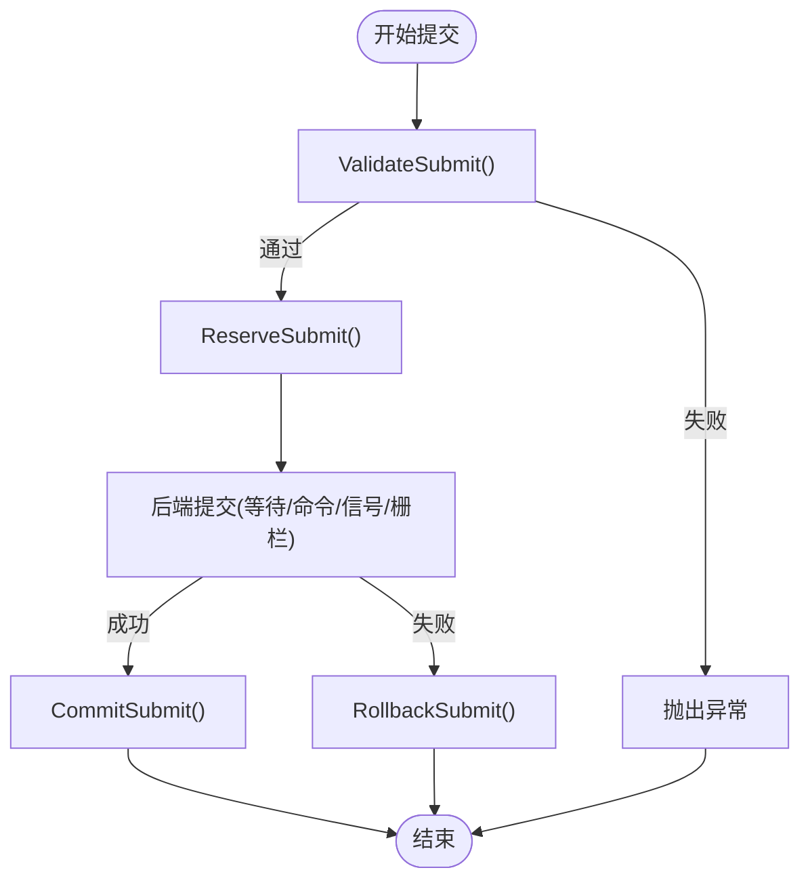
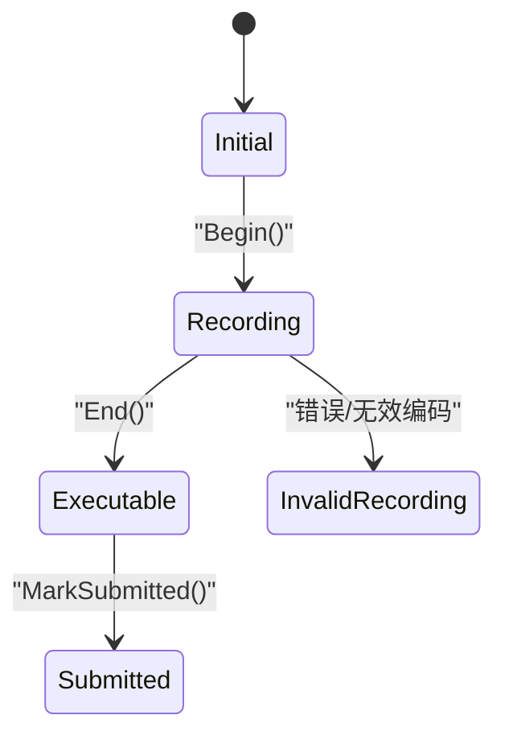
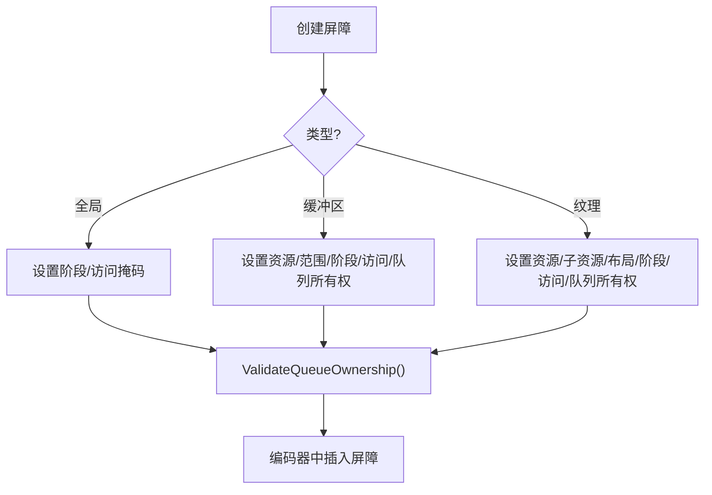
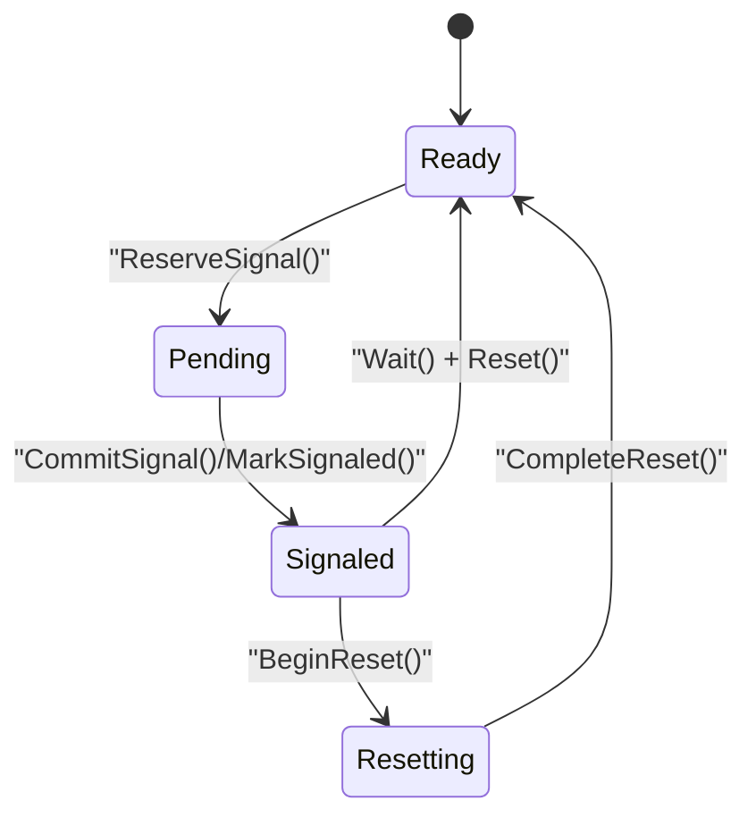
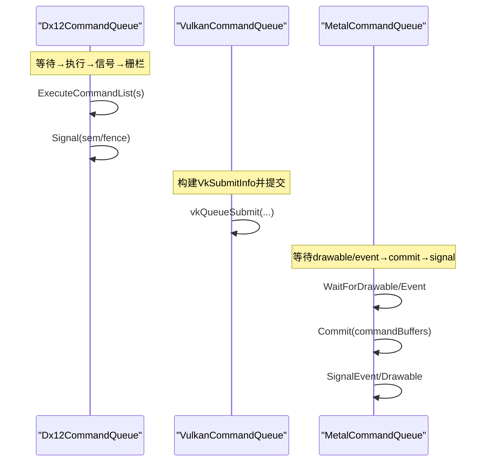
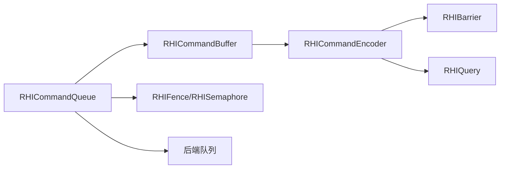

# 命令执行模型

<cite>
**本文引用的文件**
- [RHICommandQueue.cs](file://src/SharpGPU/Abstract/RHICommandQueue.cs)
- [RHIStorageQueue.cs](file://src/SharpGPU/Abstract/RHIStorageQueue.cs)
- [RHICommandBuffer.cs](file://src/SharpGPU/Abstract/RHICommandBuffer.cs)
- [RHICommandEncoder.cs](file://src/SharpGPU/Abstract/RHICommandEncoder.cs)
- [RHISynchronous.cs](file://src/SharpGPU/Abstract/RHISynchronous.cs)
- [Dx12CommandQueue.cs](file://src/SharpGPU/Dx12/Dx12CommandQueue.cs)
- [VulkanCommandQueue.cs](file://src/SharpGPU/Vulkan/VulkanCommandQueue.cs)
- [MetalCommandQueue.cs](file://src/SharpGPU/Metal/MetalCommandQueue.cs)
</cite>

## 目录
1. [简介](#简介)
2. [项目结构](#项目结构)
3. [核心组件](#核心组件)
4. [架构总览](#架构总览)
5. [详细组件分析](#详细组件分析)
6. [依赖关系分析](#依赖关系分析)
7. [性能考虑](#性能考虑)
8. [故障排查指南](#故障排查指南)
9. [结论](#结论)
10. [附录](#附录)

## 简介
本文件系统性阐述 SharpGPU 的命令执行模型，覆盖命令队列工作机制、提交与执行顺序保证、不同类型队列的职责与调度策略、异步执行与完成通知机制、同步原语（栅栏、事件、查询对象）的使用方式、命令依赖关系的处理与执行图构建、多队列协作与跨设备执行模式，以及不同后端（DirectX 12、Vulkan、Metal）的执行差异与平台优化建议。文档面向希望深入理解并高效使用 SharpGPU 的开发者，兼顾概念说明与代码级映射。

## 项目结构
SharpGPU 将命令执行抽象为 RHI 层接口，并在各后端提供具体实现：
- 抽象层定义命令队列、命令缓冲、编码器、同步原语等核心类型与行为契约
- 后端层（Dx12、Vulkan、Metal）实现具体的提交、等待、信号、稀疏绑定等操作
- 存储队列独立于渲染/计算/图形命令队列，负责异步 I/O 与数据加载

图表来源
- [RHICommandQueue.cs:60-108](file://src/SharpGPU/Abstract/RHICommandQueue.cs#L60-L108)
- [RHICommandBuffer.cs:26-189](file://src/SharpGPU/Abstract/RHICommandBuffer.cs#L26-L189)
- [RHICommandEncoder.cs:110-402](file://src/SharpGPU/Abstract/RHICommandEncoder.cs#L110-L402)
- [RHISynchronous.cs:14-280](file://src/SharpGPU/Abstract/RHISynchronous.cs#L14-L280)
- [RHISynchronous.cs:282-661](file://src/SharpGPU/Abstract/RHISynchronous.cs#L282-L661)
- [RHIStorageQueue.cs:44-55](file://src/SharpGPU/Abstract/RHIStorageQueue.cs#L44-L55)
- [Dx12CommandQueue.cs:58-154](file://src/SharpGPU/Dx12/Dx12CommandQueue.cs#L58-L154)
- [VulkanCommandQueue.cs:63-158](file://src/SharpGPU/Vulkan/VulkanCommandQueue.cs#L63-L158)
- [MetalCommandQueue.cs:71-181](file://src/SharpGPU/Metal/MetalCommandQueue.cs#L71-L181)

章节来源
- [RHICommandQueue.cs:60-108](file://src/SharpGPU/Abstract/RHICommandQueue.cs#L60-L108)
- [RHICommandBuffer.cs:26-189](file://src/SharpGPU/Abstract/RHICommandBuffer.cs#L26-L189)
- [RHICommandEncoder.cs:110-402](file://src/SharpGPU/Abstract/RHICommandEncoder.cs#L110-L402)
- [RHISynchronous.cs:14-280](file://src/SharpGPU/Abstract/RHISynchronous.cs#L14-L280)
- [RHISynchronous.cs:282-661](file://src/SharpGPU/Abstract/RHISynchronous.cs#L282-L661)
- [RHIStorageQueue.cs:44-55](file://src/SharpGPU/Abstract/RHIStorageQueue.cs#L44-L55)
- [Dx12CommandQueue.cs:58-154](file://src/SharpGPU/Dx12/Dx12CommandQueue.cs#L58-L154)
- [VulkanCommandQueue.cs:63-158](file://src/SharpGPU/Vulkan/VulkanCommandQueue.cs#L63-L158)
- [MetalCommandQueue.cs:71-181](file://src/SharpGPU/Metal/MetalCommandQueue.cs#L71-L181)

## 核心组件
- 命令队列（RHICommandQueue）：封装提交描述符、验证、预留/提交/回滚流程，统一三种后端的行为；支持常规提交与稀疏绑定提交。
- 命令缓冲（RHICommandBuffer）：维护录制状态机（初始/录制/可执行/已提交），管理编码器生命周期，确保结束顺序正确。
- 编码器（RHICommandEncoder）：按任务域划分传输、计算、光栅、光线追踪、机器学习、WorkGraph 编码器，提供屏障、时间戳、统计、管线设置、间接执行等能力。
- 同步原语（RHIFence、RHISemaphore）：基于原子状态机的二元同步，支持预留/提交/回滚，保障提交一致性。
- 屏障（RHIBarrier）：全局/缓冲区/纹理屏障，表达阶段、访问、布局转换及队列所有权转移。
- 查询对象（RHIQuery）：时间戳、遮挡、统计查询，用于性能测量与调试。
- 存储队列（RHIStorageQueue）：独立的异步 I/O 队列，支持文件打开/关闭、大小查询、缓冲/纹理请求、提交、失败检查、按标签取消与取消挂起。

章节来源
- [RHICommandQueue.cs:60-108](file://src/SharpGPU/Abstract/RHICommandQueue.cs#L60-L108)
- [RHICommandBuffer.cs:26-189](file://src/SharpGPU/Abstract/RHICommandBuffer.cs#L26-L189)
- [RHICommandEncoder.cs:110-402](file://src/SharpGPU/Abstract/RHICommandEncoder.cs#L110-L402)
- [RHISynchronous.cs:14-280](file://src/SharpGPU/Abstract/RHISynchronous.cs#L14-L280)
- [RHISynchronous.cs:282-661](file://src/SharpGPU/Abstract/RHISynchronous.cs#L282-L661)
- [RHIStorageQueue.cs:44-55](file://src/SharpGPU/Abstract/RHIStorageQueue.cs#L44-L55)

## 架构总览
SharpGPU 通过抽象层统一命令提交语义，后端实现各自平台的提交细节。提交过程遵循“验证→预留→执行→提交→回滚”的强一致流程，确保在异常情况下资源状态安全。

图表来源
- [RHICommandQueue.cs:118-330](file://src/SharpGPU/Abstract/RHICommandQueue.cs#L118-L330)
- [Dx12CommandQueue.cs:58-154](file://src/SharpGPU/Dx12/Dx12CommandQueue.cs#L58-L154)
- [VulkanCommandQueue.cs:63-158](file://src/SharpGPU/Vulkan/VulkanCommandQueue.cs#L63-L158)
- [MetalCommandQueue.cs:71-181](file://src/SharpGPU/Metal/MetalCommandQueue.cs#L71-L181)

章节来源
- [RHICommandQueue.cs:118-330](file://src/SharpGPU/Abstract/RHICommandQueue.cs#L118-L330)
- [Dx12CommandQueue.cs:58-154](file://src/SharpGPU/Dx12/Dx12CommandQueue.cs#L58-L154)
- [VulkanCommandQueue.cs:63-158](file://src/SharpGPU/Vulkan/VulkanCommandQueue.cs#L63-L158)
- [MetalCommandQueue.cs:71-181](file://src/SharpGPU/Metal/MetalCommandQueue.cs#L71-L181)

## 详细组件分析

### 命令队列与提交流程
- 提交描述符包含命令缓冲数组、等待信号量、信号信号量、完成栅栏。
- 验证阶段确保：
  - 至少包含工作项或同步操作
  - 命令缓冲来自同一队列且未重复
  - 等待/信号信号量非空、状态合法、不重复且不与对方列表冲突
  - 完成栅栏属于同一设备
- 预留阶段对等待/信号/栅栏进行原子预留，失败时回滚
- 执行阶段调用后端原生 API 提交命令与同步
- 提交阶段标记命令缓冲为已提交，并确认等待/信号状态
- 异常路径统一回滚，避免部分生效导致的状态不一致

图表来源
- [RHICommandQueue.cs:118-330](file://src/SharpGPU/Abstract/RHICommandQueue.cs#L118-L330)

章节来源
- [RHICommandQueue.cs:118-330](file://src/SharpGPU/Abstract/RHICommandQueue.cs#L118-L330)

### 命令缓冲与编码器生命周期
- 命令缓冲状态机：Initial → Recording → Executable → Submitted
- 编码器开启/结束校验：
  - 仅允许一个活动编码器
  - 结束必须匹配当前活动编码器
  - 结束命令缓冲前需结束所有编码器
- 提交前必须处于 Executable 状态

图表来源
- [RHICommandBuffer.cs:6-163](file://src/SharpGPU/Abstract/RHICommandBuffer.cs#L6-L163)

章节来源
- [RHICommandBuffer.cs:6-163](file://src/SharpGPU/Abstract/RHICommandBuffer.cs#L6-L163)

### 屏障与依赖关系
- 全局屏障：指定阶段与访问掩码转换
- 缓冲区/纹理屏障：指定资源范围、阶段、访问、布局转换，以及源/目标队列所有权转移
- 队列所有权转移要求源/目标队列不同，且记录必须在源或目标队列上进行
- 阶段掩码与访问掩码组合表达细粒度依赖

图表来源
- [RHISynchronous.cs:282-661](file://src/SharpGPU/Abstract/RHISynchronous.cs#L282-L661)

章节来源
- [RHISynchronous.cs:282-661](file://src/SharpGPU/Abstract/RHISynchronous.cs#L282-L661)

### 同步原语：栅栏与信号量
- 栅栏（RHIFence）：
  - 状态：Ready/Pending/Signaled/Resetting
  - 预留信号→提交→标记已信号→等待→重置
  - 重置需在 Pending 完成后进行，避免竞态
- 信号量（RHISemaphore）：
  - 状态：Ready/Pending/Signaled/Resetting
  - 预留信号/等待→提交→确认状态
  - 提交描述符中的等待/信号列表严格去重与互斥校验

图表来源
- [RHISynchronous.cs:14-176](file://src/SharpGPU/Abstract/RHISynchronous.cs#L14-L176)
- [RHISynchronous.cs:178-280](file://src/SharpGPU/Abstract/RHISynchronous.cs#L178-L280)

章节来源
- [RHISynchronous.cs:14-176](file://src/SharpGPU/Abstract/RHISynchronous.cs#L14-L176)
- [RHISynchronous.cs:178-280](file://src/SharpGPU/Abstract/RHISynchronous.cs#L178-L280)

### 查询对象与性能测量
- 时间戳查询：在编码器中写入起止索引，后续解析获取时间戳
- 遮挡查询：用于可见性判断
- 统计查询：采集管线统计信息
- 频率：队列提供 Frequency，用于时间戳换算

章节来源
- [RHICommandEncoder.cs:72-88](file://src/SharpGPU/Abstract/RHICommandEncoder.cs#L72-L88)
- [Dx12CommandQueue.cs:22-28](file://src/SharpGPU/Dx12/Dx12CommandQueue.cs#L22-L28)
- [VulkanCommandQueue.cs:29-37](file://src/SharpGPU/Vulkan/VulkanCommandQueue.cs#L29-L37)

### 多队列协作与跨设备执行
- 队列类型：Transfer、Compute、Graphics、MachineLearning、RayTracing、WorkGraph
- 屏障支持队列所有权转移，允许在不同逻辑队列间传递资源所有权
- 存储队列独立于渲染/计算队列，通过提交与取消机制协同工作
- 跨设备执行：提交描述符强制校验所有同步对象与命令缓冲归属同一设备，防止跨设备误用

章节来源
- [RHISynchronous.cs:512-625](file://src/SharpGPU/Abstract/RHISynchronous.cs#L512-L625)
- [RHIStorageQueue.cs:44-55](file://src/SharpGPU/Abstract/RHIStorageQueue.cs#L44-L55)
- [RHICommandQueue.cs:227-241](file://src/SharpGPU/Abstract/RHICommandQueue.cs#L227-L241)

### 后端差异与平台特定优化
- DirectX 12：
  - 提交顺序：等待信号量→执行命令列表→信号信号量→完成栅栏
  - 支持稀疏绑定（UpdateTileMappings）
  - 频率通过 GetTimestampFrequency 获取
- Vulkan：
  - 提交使用 VkSubmitInfo，包含等待阶段掩码、命令缓冲、信号信号量、栅栏
  - 支持 vkQueueBindSparse 进行稀疏内存绑定
  - 频率由物理设备属性 timestampPeriod 推导
- Metal：
  - 使用 MTL4CommandQueue，提交顺序：等待可显示对象/事件→提交（反馈）→信号事件/可显示对象
  - 支持稀疏纹理映射更新
  - 频率固定为 1GHz（示例值）

图表来源
- [Dx12CommandQueue.cs:58-154](file://src/SharpGPU/Dx12/Dx12CommandQueue.cs#L58-L154)
- [VulkanCommandQueue.cs:63-158](file://src/SharpGPU/Vulkan/VulkanCommandQueue.cs#L63-L158)
- [MetalCommandQueue.cs:71-181](file://src/SharpGPU/Metal/MetalCommandQueue.cs#L71-L181)

章节来源
- [Dx12CommandQueue.cs:58-154](file://src/SharpGPU/Dx12/Dx12CommandQueue.cs#L58-L154)
- [VulkanCommandQueue.cs:63-158](file://src/SharpGPU/Vulkan/VulkanCommandQueue.cs#L63-L158)
- [MetalCommandQueue.cs:71-181](file://src/SharpGPU/Metal/MetalCommandQueue.cs#L71-L181)

## 依赖关系分析
- 命令队列依赖命令缓冲与编码器，但通过抽象解耦后端实现
- 同步原语贯穿提交全流程，确保跨队列/跨设备的依赖关系明确
- 屏障在编码器中插入，影响资源状态与访问权限
- 查询对象嵌入编码器，提供运行时性能数据

图表来源
- [RHICommandQueue.cs:60-108](file://src/SharpGPU/Abstract/RHICommandQueue.cs#L60-L108)
- [RHICommandBuffer.cs:26-189](file://src/SharpGPU/Abstract/RHICommandBuffer.cs#L26-L189)
- [RHICommandEncoder.cs:110-402](file://src/SharpGPU/Abstract/RHICommandEncoder.cs#L110-L402)
- [RHISynchronous.cs:282-661](file://src/SharpGPU/Abstract/RHISynchronous.cs#L282-L661)

章节来源
- [RHICommandQueue.cs:60-108](file://src/SharpGPU/Abstract/RHICommandQueue.cs#L60-L108)
- [RHICommandBuffer.cs:26-189](file://src/SharpGPU/Abstract/RHICommandBuffer.cs#L26-L189)
- [RHICommandEncoder.cs:110-402](file://src/SharpGPU/Abstract/RHICommandEncoder.cs#L110-L402)
- [RHISynchronous.cs:282-661](file://src/SharpGPU/Abstract/RHISynchronous.cs#L282-L661)

## 性能考虑
- 批量提交：尽量合并命令缓冲以减少提交开销
- 减少屏障：仅在必要时插入屏障，利用队列所有权转移降低同步成本
- 间接执行：使用间接参数缓冲减少 CPU 端命令生成压力
- 查询对象：使用时间戳与统计查询定位瓶颈
- 后端特性：
  - Dx12：利用 ExecuteCommandLists 批量提交
  - Vulkan：合理设置等待阶段掩码，避免过度同步
  - Metal：注意 MTL4 提交顺序与可显示对象等待，避免回调陷阱

[本节为通用指导，无需特定文件引用]

## 故障排查指南
- 常见错误：
  - 命令缓冲未结束即提交：检查状态机是否进入 Executable
  - 重复命令缓冲或信号量：提交描述符会拒绝重复项
  - 跨设备对象混用：提交描述符校验所有者设备
  - 栅栏重置时机错误：需在 Pending 完成后才能 Reset
  - 屏障队列所有权非法：源/目标队列必须不同且记录在正确队列
- 诊断方法：
  - 捕获异常并检查堆栈，定位 Validate/Reserve/Commit 阶段
  - 使用查询对象测量关键路径延迟
  - 检查后端错误码与设备丢失标志

章节来源
- [RHICommandQueue.cs:118-330](file://src/SharpGPU/Abstract/RHICommandQueue.cs#L118-L330)
- [RHISynchronous.cs:63-176](file://src/SharpGPU/Abstract/RHISynchronous.cs#L63-L176)
- [RHISynchronous.cs:512-625](file://src/SharpGPU/Abstract/RHISynchronous.cs#L512-L625)

## 结论
SharpGPU 的命令执行模型以强一致的提交流程为核心，结合严格的验证与原子预留/提交/回滚机制，确保跨后端的一致性。通过命令缓冲状态机、编码器生命周期、屏障与同步原语，系统能够精确表达依赖关系与执行顺序。不同后端的实现充分利用平台特性，提供高效的提交与同步能力。合理使用批量提交、减少屏障、利用间接执行与查询对象，可显著提升性能与可观测性。

[本节为总结，无需特定文件引用]

## 附录
- 队列类型与职责：
  - Transfer：数据传输与复制
  - Compute：计算着色器执行
  - Graphics：光栅化与顶点/片段处理
  - RayTracing：光线追踪构建与派发
  - MachineLearning：机器学习内核执行
  - WorkGraph：工作图执行
- 存储队列：
  - 异步 I/O：文件打开/关闭、大小查询
  - 请求：缓冲/纹理读取，支持压缩格式与取消标签
  - 提交：提交到队列并检查失败
  - 取消：按标签或全部取消挂起请求

章节来源
- [RHICommandEncoder.cs:110-402](file://src/SharpGPU/Abstract/RHICommandEncoder.cs#L110-L402)
- [RHIStorageQueue.cs:44-55](file://src/SharpGPU/Abstract/RHIStorageQueue.cs#L44-L55)