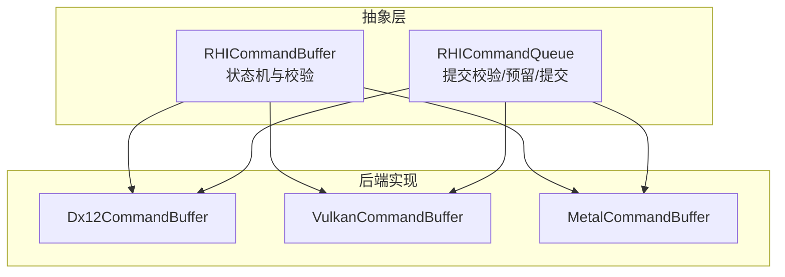
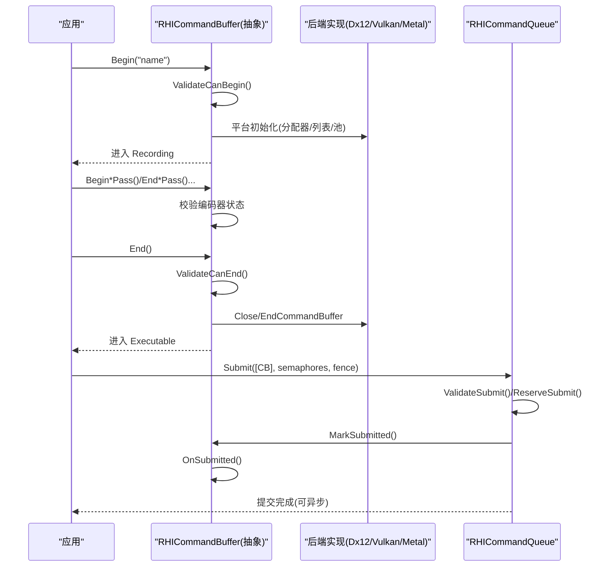
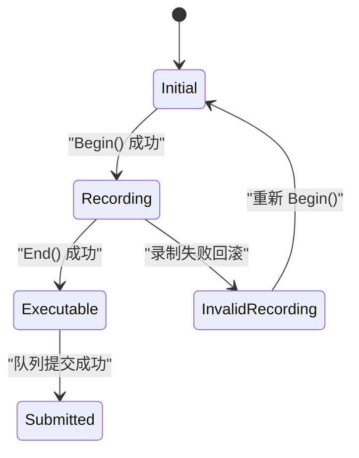
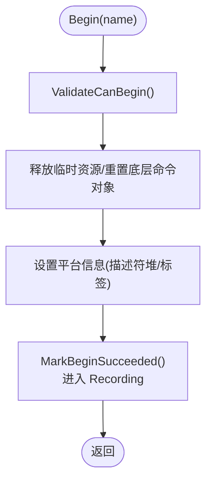
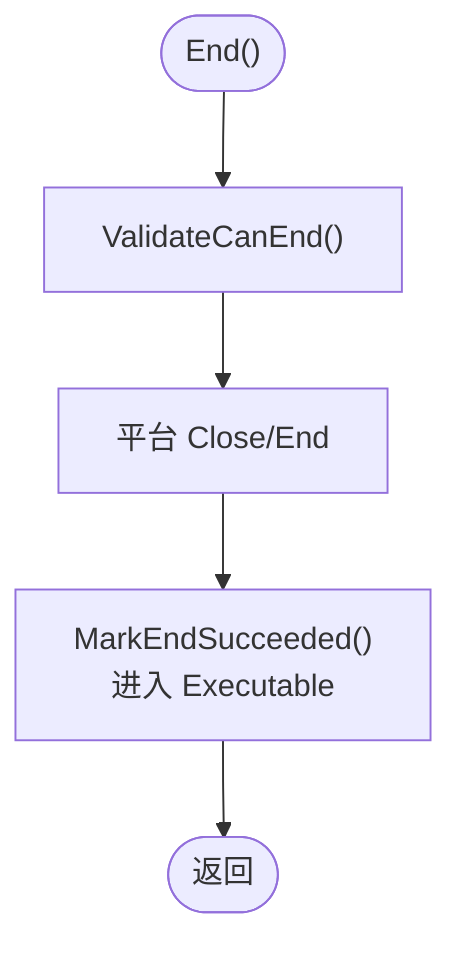
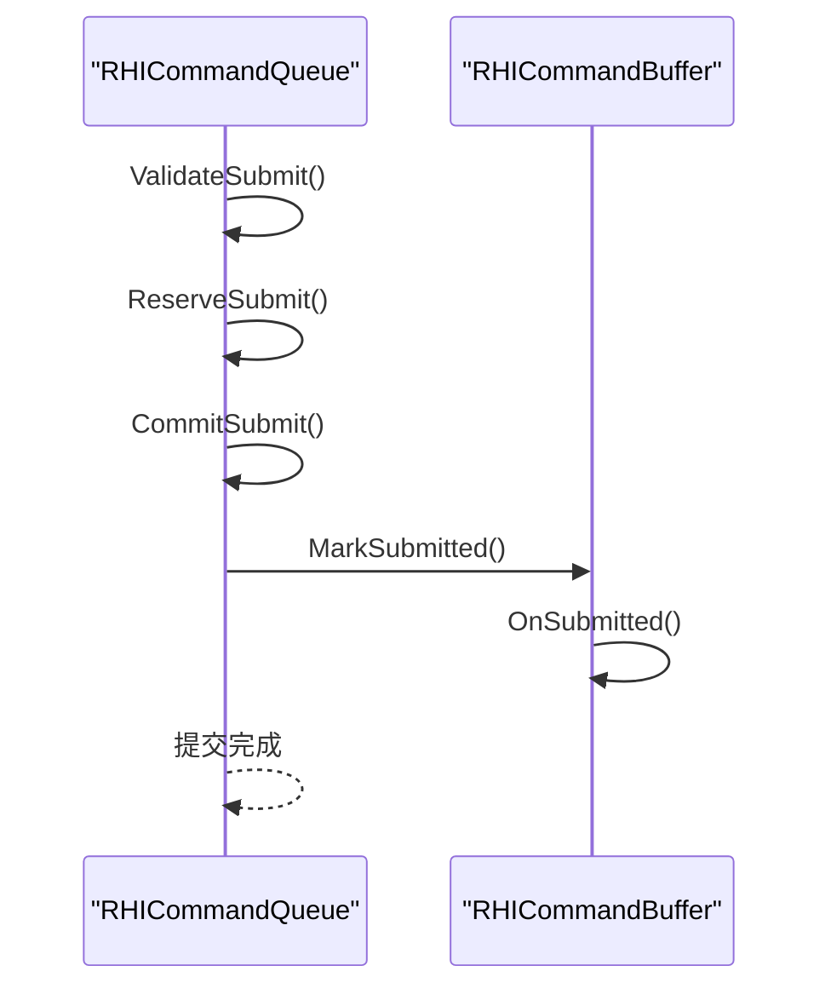
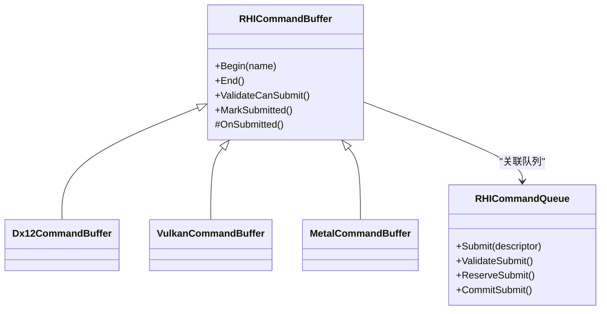

# 命令缓冲生命周期管理

<cite>
**本文引用的文件**
- [RHICommandBuffer.cs](file://src/SharpGPU/Abstract/RHICommandBuffer.cs)
- [Dx12CommandBuffer.cs](file://src/SharpGPU/Dx12/Dx12CommandBuffer.cs)
- [VulkanCommandBuffer.cs](file://src/SharpGPU/Vulkan/VulkanCommandBuffer.cs)
- [MetalCommandBuffer.cs](file://src/SharpGPU/Metal/MetalCommandBuffer.cs)
- [RHICommandQueue.cs](file://src/SharpGPU/Abstract/RHICommandQueue.cs)
- [QueueSubmissionContractTests.cs](file://tests/SharpGPU.Conformance.Tests/QueueSubmissionContractTests.cs)
</cite>

## 目录
1. [简介](#简介)
2. [项目结构](#项目结构)
3. [核心组件](#核心组件)
4. [架构总览](#架构总览)
5. [详细组件分析](#详细组件分析)
6. [依赖关系分析](#依赖关系分析)
7. [性能考量](#性能考量)
8. [故障排查指南](#故障排查指南)
9. [结论](#结论)
10. [附录：状态机与使用模式](#附录状态机与使用模式)

## 简介
本文件聚焦 SharpGPU 中命令缓冲的生命周期管理，围绕五个状态（Initial、Recording、Executable、Submitted、InvalidRecording）展开，系统说明 Begin() 的验证与资源清理、End() 的可执行态转换、提交到队列的机制与 OnSubmitted() 回调处理，并给出错误处理策略、异常场景与不同后端（DirectX12、Vulkan、Metal）在生命周期管理上的差异与优化点。文末提供完整状态机图与正确用法示例路径，便于读者快速掌握最佳实践。

## 项目结构
命令缓冲由抽象基类定义统一的状态机与校验逻辑，各后端实现具体资源创建、编码与收尾流程；队列负责提交前的参数校验、同步原语预留与提交后的状态推进。

**图表来源**
- [RHICommandBuffer.cs:6-168](file://src/SharpGPU/Abstract/RHICommandBuffer.cs#L6-L168)
- [RHICommandQueue.cs:118-310](file://src/SharpGPU/Abstract/RHICommandQueue.cs#L118-L310)
- [Dx12CommandBuffer.cs:87-210](file://src/SharpGPU/Dx12/Dx12CommandBuffer.cs#L87-L210)
- [VulkanCommandBuffer.cs:82-98](file://src/SharpGPU/Vulkan/VulkanCommandBuffer.cs#L82-L98)
- [MetalCommandBuffer.cs:50-59](file://src/SharpGPU/Metal/MetalCommandBuffer.cs#L50-L59)

**章节来源**
- [RHICommandBuffer.cs:6-168](file://src/SharpGPU/Abstract/RHICommandBuffer.cs#L6-L168)
- [RHICommandQueue.cs:118-310](file://src/SharpGPU/Abstract/RHICommandQueue.cs#L118-L310)

## 核心组件
- 命令缓冲状态枚举：Initial、Recording、Executable、Submitted、InvalidRecording
- 编码器种类枚举：None、Transfer、Compute、RayTracing、Raster、MachineLearning、WorkGraph
- 关键方法：Begin()、End()、Begin*Pass()/End*Pass()、Get*Encoder()、ValidateCanSubmit()、MarkSubmitted()、OnSubmitted()
- 队列提交：ValidateSubmit()、ReserveSubmit()、CommitSubmit()

这些组件共同保证命令缓冲从开始录制、结束录制、提交执行到回收的完整生命周期。

**章节来源**
- [RHICommandBuffer.cs:6-168](file://src/SharpGPU/Abstract/RHICommandBuffer.cs#L6-L168)
- [RHICommandQueue.cs:118-310](file://src/SharpGPU/Abstract/RHICommandQueue.cs#L118-L310)

## 架构总览
命令缓冲的生命周期由抽象基类严格约束，后端实现仅在 Begin()/End() 等钩子处进行平台相关操作。队列在提交阶段完成最终校验并将命令缓冲标记为已提交，随后触发各后端的 OnSubmitted() 回调以执行后端特定的清理或收尾工作。

**图表来源**
- [RHICommandBuffer.cs:36-168](file://src/SharpGPU/Abstract/RHICommandBuffer.cs#L36-L168)
- [Dx12CommandBuffer.cs:87-210](file://src/SharpGPU/Dx12/Dx12CommandBuffer.cs#L87-L210)
- [VulkanCommandBuffer.cs:82-98](file://src/SharpGPU/Vulkan/VulkanCommandBuffer.cs#L82-L98)
- [MetalCommandBuffer.cs:50-59](file://src/SharpGPU/Metal/MetalCommandBuffer.cs#L50-L59)
- [RHICommandQueue.cs:118-310](file://src/SharpGPU/Abstract/RHICommandQueue.cs#L118-L310)

## 详细组件分析

### 命令缓冲状态机与转换规则
- 初始状态：Initial
- 进入录制：Initial → Recording（调用 Begin() 成功）
- 录制期间：Recording（可开启多个 Pass，但同一时间仅一个 Active Encoder）
- 结束录制：Recording → Executable（调用 End() 成功）
- 提交执行：Executable → Submitted（队列提交成功后）
- 非法录制：Recording → InvalidRecording（某些后端在失败回滚时进入，需重新 Begin）

**图表来源**
- [RHICommandBuffer.cs:6-168](file://src/SharpGPU/Abstract/RHICommandBuffer.cs#L6-L168)

**章节来源**
- [RHICommandBuffer.cs:6-168](file://src/SharpGPU/Abstract/RHICommandBuffer.cs#L6-L168)

### Begin() 方法与验证逻辑
- 职责：
  - 资源清理检查：释放临时描述符/视图/帧缓冲等，重置底层命令对象（如命令分配器/命令列表/命令缓冲）。
  - 状态验证：确保未处于 Recording、无活跃编码器、对象未释放。
  - 设置平台信息：如描述符堆、名称标签等。
  - 状态更新：进入 Recording，清空 ActiveEncoder。
- 异常处理：
  - 若底层 Reset/Begin 失败，抛出 InvalidOperationException，提示 GPU 仍在飞行或提交时序无效。
  - 调试模式下记录事件标记以便诊断。

**图表来源**
- [RHICommandBuffer.cs:36-56](file://src/SharpGPU/Abstract/RHICommandBuffer.cs#L36-L56)
- [Dx12CommandBuffer.cs:87-111](file://src/SharpGPU/Dx12/Dx12CommandBuffer.cs#L87-L111)
- [VulkanCommandBuffer.cs:82-98](file://src/SharpGPU/Vulkan/VulkanCommandBuffer.cs#L82-L98)
- [MetalCommandBuffer.cs:50-59](file://src/SharpGPU/Metal/MetalCommandBuffer.cs#L50-L59)

**章节来源**
- [RHICommandBuffer.cs:36-56](file://src/SharpGPU/Abstract/RHICommandBuffer.cs#L36-L56)
- [Dx12CommandBuffer.cs:87-111](file://src/SharpGPU/Dx12/Dx12CommandBuffer.cs#L87-L111)
- [VulkanCommandBuffer.cs:82-98](file://src/SharpGPU/Vulkan/VulkanCommandBuffer.cs#L82-L98)
- [MetalCommandBuffer.cs:50-59](file://src/SharpGPU/Metal/MetalCommandBuffer.cs#L50-L59)

### End() 方法与可执行状态转换
- 职责：
  - 校验：确保当前处于 Recording 且无活跃编码器。
  - 平台收尾：关闭命令列表/结束命令缓冲。
  - 状态更新：进入 Executable。
- 异常处理：
  - 捕获底层 Close/End 异常，必要时输出设备消息辅助定位问题。

**图表来源**
- [RHICommandBuffer.cs:122-141](file://src/SharpGPU/Abstract/RHICommandBuffer.cs#L122-L141)
- [Dx12CommandBuffer.cs:189-210](file://src/SharpGPU/Dx12/Dx12CommandBuffer.cs#L189-L210)
- [VulkanCommandBuffer.cs:550-555](file://src/SharpGPU/Vulkan/VulkanCommandBuffer.cs#L550-L555)
- [MetalCommandBuffer.cs:157-167](file://src/SharpGPU/Metal/MetalCommandBuffer.cs#L157-L167)

**章节来源**
- [RHICommandBuffer.cs:122-141](file://src/SharpGPU/Abstract/RHICommandBuffer.cs#L122-L141)
- [Dx12CommandBuffer.cs:189-210](file://src/SharpGPU/Dx12/Dx12CommandBuffer.cs#L189-L210)
- [VulkanCommandBuffer.cs:550-555](file://src/SharpGPU/Vulkan/VulkanCommandBuffer.cs#L550-L555)
- [MetalCommandBuffer.cs:157-167](file://src/SharpGPU/Metal/MetalCommandBuffer.cs#L157-L167)

### 提交到队列与 OnSubmitted() 回调
- 队列提交流程：
  - ValidateSubmit：校验命令缓冲所属队列、非空工作/同步、唯一性、同步原语有效性。
  - ReserveSubmit：为等待/信号同步原语与完成栅栏预留资源。
  - CommitSubmit：提交成功后，逐个调用命令缓冲的 MarkSubmitted()，将状态置为 Submitted，并触发 OnSubmitted()。
- 后端 OnSubmitted() 作用：
  - Vulkan：清除图像布局覆盖表，避免跨帧污染。
  - Metal：可在扩展中用于清理内部屏障跟踪等（基类默认空实现）。
  - Dx12：基类默认空实现，可按需在子类扩展。

**图表来源**
- [RHICommandQueue.cs:118-310](file://src/SharpGPU/Abstract/RHICommandQueue.cs#L118-L310)
- [RHICommandBuffer.cs:143-168](file://src/SharpGPU/Abstract/RHICommandBuffer.cs#L143-L168)
- [VulkanCommandBuffer.cs:191-194](file://src/SharpGPU/Vulkan/VulkanCommandBuffer.cs#L191-L194)

**章节来源**
- [RHICommandQueue.cs:118-310](file://src/SharpGPU/Abstract/RHICommandQueue.cs#L118-L310)
- [RHICommandBuffer.cs:143-168](file://src/SharpGPU/Abstract/RHICommandBuffer.cs#L143-L168)
- [VulkanCommandBuffer.cs:191-194](file://src/SharpGPU/Vulkan/VulkanCommandBuffer.cs#L191-L194)

### 错误处理策略与异常情况
- 重复 Begin：抛出 InvalidOperationException（已在 Recording 或有活跃编码器）。
- 未结束编码器即 End：抛出 InvalidOperationException。
- 非 Executable 提交：抛出 InvalidOperationException。
- 重复提交：队列校验拒绝重复的命令缓冲引用。
- 无效同步原语：空/跨设备/重复/未知阶段掩码等抛出 ArgumentException 或 ArgumentOutOfRangeException。
- 后端特定失败：
  - Dx12：Reset/Close 失败时抛出带上下文的异常，并输出设备消息。
  - Vulkan：raster pass begin 失败时回滚临时资源并进入 InvalidRecording，再抛出聚合异常。
  - Metal：EnsureMtl4CommandBuffer 失败抛出 InvalidOperationException；FinalizeForSubmit 要求先 End 命令缓冲。

**章节来源**
- [RHICommandBuffer.cs:36-168](file://src/SharpGPU/Abstract/RHICommandBuffer.cs#L36-L168)
- [Dx12CommandBuffer.cs:87-111](file://src/SharpGPU/Dx12/Dx12CommandBuffer.cs#L87-L111)
- [Dx12CommandBuffer.cs:189-210](file://src/SharpGPU/Dx12/Dx12CommandBuffer.cs#L189-L210)
- [VulkanCommandBuffer.cs:163-194](file://src/SharpGPU/Vulkan/VulkanCommandBuffer.cs#L163-L194)
- [VulkanCommandBuffer.cs:486-519](file://src/SharpGPU/Vulkan/VulkanCommandBuffer.cs#L486-L519)
- [MetalCommandBuffer.cs:213-255](file://src/SharpGPU/Metal/MetalCommandBuffer.cs#L213-L255)
- [RHICommandQueue.cs:118-310](file://src/SharpGPU/Abstract/RHICommandQueue.cs#L118-L310)

### 不同后端在生命周期管理上的差异与优化
- DirectX12
  - 每帧重置命令分配器与命令列表，支持高效复用。
  - 临时 CBV/SRV/UAV 描述符在 Begin 时释放，避免泄漏。
  - 调试模式通过 PIX 事件标记提升可观测性。
  - 优化点：合理批量化描述符分配，减少 Reset 频率。
- Vulkan
  - 使用命令池与命令缓冲，OneTimeSubmit 标志优化单次提交。
  - 图像布局覆盖表与临时资源检查点机制，失败时回滚至安全状态并进入 InvalidRecording。
  - 优化点：利用检查点最小化回滚范围，减少重建开销。
- Metal
  - 延迟创建 MTL4CommandBuffer，按需启用 residency set。
  - 编码器内阶段追踪，区分 intra-encoder 与 cross-encoder barrier，降低冗余屏障。
  - 优化点：合并同编码器内的屏障，减少跨编码器屏障数量。

**章节来源**
- [Dx12CommandBuffer.cs:58-111](file://src/SharpGPU/Dx12/Dx12CommandBuffer.cs#L58-L111)
- [Dx12CommandBuffer.cs:262-296](file://src/SharpGPU/Dx12/Dx12CommandBuffer.cs#L262-L296)
- [VulkanCommandBuffer.cs:43-98](file://src/SharpGPU/Vulkan/VulkanCommandBuffer.cs#L43-L98)
- [VulkanCommandBuffer.cs:163-194](file://src/SharpGPU/Vulkan/VulkanCommandBuffer.cs#L163-L194)
- [MetalCommandBuffer.cs:213-255](file://src/SharpGPU/Metal/MetalCommandBuffer.cs#L213-L255)
- [MetalCommandBuffer.cs:257-290](file://src/SharpGPU/Metal/MetalCommandBuffer.cs#L257-L290)

## 依赖关系分析
- RHICommandBuffer 依赖 RHICommandQueue（获取关联队列）。
- 各后端 CommandBuffer 依赖各自队列与设备能力，封装平台原生对象。
- 队列依赖命令缓冲的 ValidateCanSubmit() 与 MarkSubmitted() 进行状态推进。
- 测试用例验证了状态机与提交契约的正确性。

**图表来源**
- [RHICommandBuffer.cs:26-168](file://src/SharpGPU/Abstract/RHICommandBuffer.cs#L26-L168)
- [RHICommandQueue.cs:60-310](file://src/SharpGPU/Abstract/RHICommandQueue.cs#L60-L310)
- [Dx12CommandBuffer.cs:10-56](file://src/SharpGPU/Dx12/Dx12CommandBuffer.cs#L10-L56)
- [VulkanCommandBuffer.cs:9-80](file://src/SharpGPU/Vulkan/VulkanCommandBuffer.cs#L9-L80)
- [MetalCommandBuffer.cs:8-48](file://src/SharpGPU/Metal/MetalCommandBuffer.cs#L8-L48)

**章节来源**
- [RHICommandBuffer.cs:26-168](file://src/SharpGPU/Abstract/RHICommandBuffer.cs#L26-L168)
- [RHICommandQueue.cs:60-310](file://src/SharpGPU/Abstract/RHICommandQueue.cs#L60-L310)

## 性能考量
- 命令缓冲复用：尽量复用命令缓冲与分配器，减少频繁创建销毁。
- 一次性提交：Vulkan 使用 OneTimeSubmit 标志，提高驱动优化空间。
- 屏障优化：Metal 通过编码器内阶段追踪减少冗余屏障；Dx12/Vulkan 应遵循资源访问顺序，避免不必要的内存屏障。
- 描述符管理：Dx12 临时描述符及时释放，避免堆积；Vulkan 使用检查点最小化回滚。
- 调试与可观测性：启用平台调试标记（如 PIX），便于定位瓶颈。

[本节为通用指导，不直接分析具体文件]

## 故障排查指南
- 常见问题与定位：
  - “命令缓冲已在录制”：检查是否重复 Begin 或未正确 End。
  - “必须结束命令缓冲后才能提交”：确认 End() 在所有 Pass 结束后调用。
  - “命令缓冲不属于该队列”：确保使用对应队列创建的命令缓冲。
  - “重复提交命令缓冲”：队列会拒绝重复引用，检查提交列表。
  - “同步原语无效”：检查等待/信号语义、阶段掩码、设备归属。
  - “后端特定失败”：查看异常上下文与设备消息（Dx12）、聚合异常（Vulkan）。
- 建议步骤：
  - 打印命令缓冲名称与阶段，确认调用顺序。
  - 逐步缩小问题范围，隔离 Pass 与资源。
  - 使用调试构建与平台工具（PIX、Vulkan Validation Layers）收集更多信息。

**章节来源**
- [RHICommandBuffer.cs:36-168](file://src/SharpGPU/Abstract/RHICommandBuffer.cs#L36-L168)
- [Dx12CommandBuffer.cs:87-111](file://src/SharpGPU/Dx12/Dx12CommandBuffer.cs#L87-L111)
- [Dx12CommandBuffer.cs:189-210](file://src/SharpGPU/Dx12/Dx12CommandBuffer.cs#L189-L210)
- [VulkanCommandBuffer.cs:163-194](file://src/SharpGPU/Vulkan/VulkanCommandBuffer.cs#L163-L194)
- [RHICommandQueue.cs:118-310](file://src/SharpGPU/Abstract/RHICommandQueue.cs#L118-L310)

## 结论
SharpGPU 通过抽象基类严格定义了命令缓冲的五态生命周期，并在各后端实现中结合平台特性进行优化与错误恢复。队列提交阶段完成最终校验与状态推进，OnSubmitted() 提供后端专属清理入口。遵循本文所述的状态机与最佳实践，可显著提升稳定性与性能。

[本节为总结，不直接分析具体文件]

## 附录：状态机与使用模式

### 正确使用模式（代码示例路径）
- 基本录制与提交：
  - 参考测试用例中的命令缓冲生命周期断言与提交流程。
  - 路径：[QueueSubmissionContractTests.cs:101-136](file://tests/SharpGPU.Conformance.Tests/QueueSubmissionContractTests.cs#L101-L136)
- 多 Pass 录制：
  - 参考各后端 Begin*Pass()/End*Pass() 的成对调用与状态标记。
  - 路径：
    - [Dx12CommandBuffer.cs:113-186](file://src/SharpGPU/Dx12/Dx12CommandBuffer.cs#L113-L186)
    - [VulkanCommandBuffer.cs:441-525](file://src/SharpGPU/Vulkan/VulkanCommandBuffer.cs#L441-L525)
    - [MetalCommandBuffer.cs:61-137](file://src/SharpGPU/Metal/MetalCommandBuffer.cs#L61-L137)
- 提交与回调：
  - 参考队列提交与 MarkSubmitted() 调用位置。
  - 路径：[RHICommandQueue.cs:291-310](file://src/SharpGPU/Abstract/RHICommandQueue.cs#L291-L310)
  - 路径：[RHICommandBuffer.cs:143-168](file://src/SharpGPU/Abstract/RHICommandBuffer.cs#L143-L168)

### 状态机图（再次强调）

**图表来源**
- [RHICommandBuffer.cs:6-168](file://src/SharpGPU/Abstract/RHICommandBuffer.cs#L6-L168)