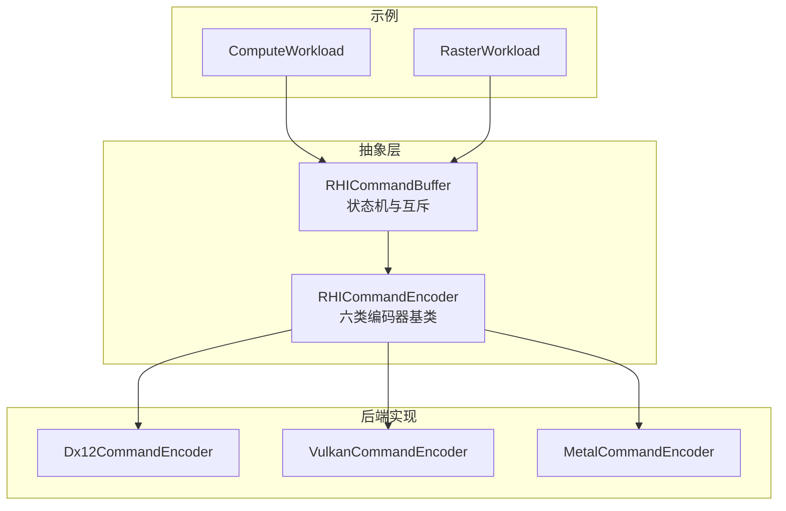
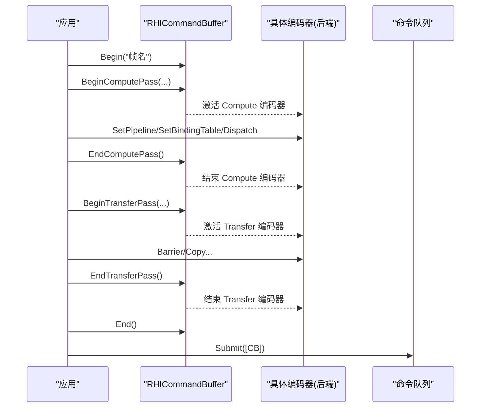
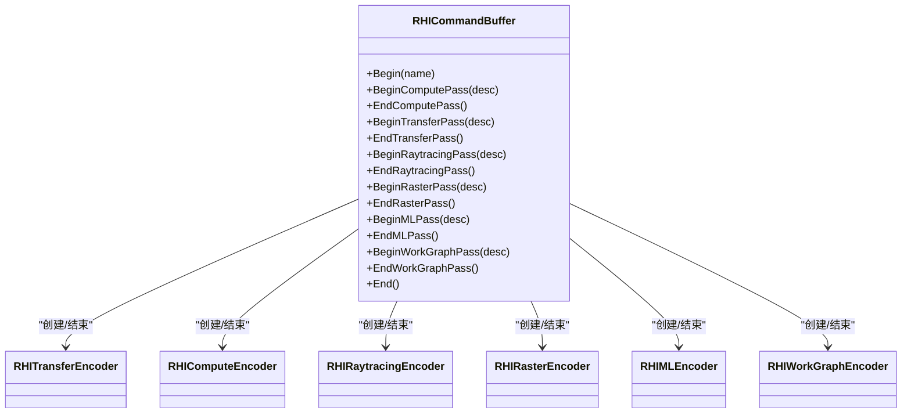

# 编码器类型与使用模式

<cite>
**本文引用的文件**
- [RHICommandEncoder.cs](file://src/SharpGPU/Abstract/RHICommandEncoder.cs)
- [RHICommandBuffer.cs](file://src/SharpGPU/Abstract/RHICommandBuffer.cs)
- [Dx12CommandEncoder.cs](file://src/SharpGPU/Dx12/Dx12CommandEncoder.cs)
- [VulkanCommandEncoder.cs](file://src/SharpGPU/Vulkan/VulkanCommandEncoder.cs)
- [MetalCommandEncoder.cs](file://src/SharpGPU/Metal/MetalCommandEncoder.cs)
- [ComputeWorkload.cs](file://samples/ComputeAndDraw/ComputeWorkload.cs)
- [RasterWorkload.cs](file://samples/ComputeAndDraw/RasterWorkload.cs)
</cite>

## 目录
1. [简介](#简介)
2. [项目结构](#项目结构)
3. [核心组件](#核心组件)
4. [架构总览](#架构总览)
5. [详细组件分析](#详细组件分析)
6. [依赖关系分析](#依赖关系分析)
7. [性能考量](#性能考量)
8. [故障排查指南](#故障排查指南)
9. [结论](#结论)
10. [附录](#附录)

## 简介
本文件面向 SharpGPU 的“编码器”抽象与实现，系统性说明六种编码器类型：传输、计算、光线追踪、光栅化、机器学习与工作图编码器的职责、创建流程、参数配置、生命周期管理、互斥关系与切换规则；并给出 BeginPass()/EndPass() 的使用模式与最佳实践、典型用法示例、不同后端（DirectX12、Vulkan、Metal）的技术差异与性能特点，以及编码器选择指南与常见使用模式。

## 项目结构
SharpGPU 将编码器抽象集中在 Abstract 层，各后端在 Dx12、Vulkan、Metal 子目录中提供具体实现；命令缓冲区负责状态机与编码器互斥校验；示例位于 samples 目录，演示计算与光栅化工作负载的典型用法。

图表来源
- [RHICommandBuffer.cs:15-24](file://src/SharpGPU/Abstract/RHICommandBuffer.cs#L15-L24)
- [RHICommandEncoder.cs:110-402](file://src/SharpGPU/Abstract/RHICommandEncoder.cs#L110-L402)

章节来源
- [RHICommandBuffer.cs:15-24](file://src/SharpGPU/Abstract/RHICommandBuffer.cs#L15-L24)
- [RHICommandEncoder.cs:110-402](file://src/SharpGPU/Abstract/RHICommandEncoder.cs#L110-L402)

## 核心组件
- 命令缓冲区（RHICommandBuffer）：维护录制状态与当前活动编码器，强制“同一时间仅一个活动编码器”，并在 End() 前要求所有编码器已结束。
- 编码器基类族：
  - RHITransferEncoder：数据搬运、布局转换、查询解析等。
  - RHIComputeEncoder：设置管线、绑定表、推送常量、Dispatch/Indirect 执行。
  - RHIRaytracingEncoder：构建加速结构、发射光线、函数表调度。
  - RHIRasterEncoder：渲染通道描述、多子通道、颜色/深度模板附件、统计与遮挡查询。
  - RHIMLEncoder：机器学习管线与绑定表、Dispatch。
  - RHIWorkGraphEncoder：工作图管线、绑定表、推送常量、后备内存、按入口点分发记录。

章节来源
- [RHICommandBuffer.cs:26-190](file://src/SharpGPU/Abstract/RHICommandBuffer.cs#L26-L190)
- [RHICommandEncoder.cs:110-402](file://src/SharpGPU/Abstract/RHICommandEncoder.cs#L110-L402)

## 架构总览
下图展示了从应用调用到后端实现的端到端流程，强调 BeginPass/EndPass 的生命周期与后端屏障/同步的差异。

图表来源
- [RHICommandBuffer.cs:170-183](file://src/SharpGPU/Abstract/RHICommandBuffer.cs#L170-L183)
- [RHICommandEncoder.cs:135-181](file://src/SharpGPU/Abstract/RHICommandEncoder.cs#L135-L181)
- [RHICommandEncoder.cs:110-133](file://src/SharpGPU/Abstract/RHICommandEncoder.cs#L110-L133)

## 详细组件分析

### 1) 传输编码器（RHITransferEncoder）
- 职责：资源拷贝（缓冲/纹理）、布局转换、查询结果解析、时间戳写入、调试分组。
- 创建与生命周期：通过命令缓冲区的 BeginTransferPass/EndTransferPass 开启与关闭；默认 EndPass 会校验编码器结束并抛出未实现异常（由后端实现覆盖）。
- 关键参数：RHITransferPassDescriptor（名称、可选时间戳）。
- 典型用法：在计算后做 CopyBufferToBuffer 读回；在渲染前将纹理转为 RenderTarget 布局。
- 后端差异：
  - DX12：基于 ResourceBarrier/Enhanced Barriers 进行状态转换与顺序控制。
  - Vulkan：根据 Sync1/Sync2 路径生成 Memory/Buffer/Image 屏障，支持队列家族转移。
  - Metal：通过 MTL4 Command Encoder 的阶段屏障或队列屏障组合。

章节来源
- [RHICommandEncoder.cs:110-133](file://src/SharpGPU/Abstract/RHICommandEncoder.cs#L110-L133)
- [Dx12CommandEncoder.cs:295-800](file://src/SharpGPU/Dx12/Dx12CommandEncoder.cs#L295-L800)
- [VulkanCommandEncoder.cs:129-800](file://src/SharpGPU/Vulkan/VulkanCommandEncoder.cs#L129-L800)
- [MetalCommandEncoder.cs:69-328](file://src/SharpGPU/Metal/MetalCommandEncoder.cs#L69-L328)

### 2) 计算编码器（RHIComputeEncoder）
- 职责：设置计算管线、绑定表、推送常量、Dispatch/Indirect 执行；可选统计与采样器反馈操作。
- 创建与生命周期：BeginComputePass/EndComputePass；EndPass 校验并交由后端实现收尾。
- 关键参数：RHIComputePassDescriptor（名称、时间戳、统计）。
- 典型用法：设置管线与绑定表后 Dispatch；必要时用 Barrier 确保写后读顺序。
- 后端差异：
  - DX12：绑定根签名/描述符堆，提交 Dispatch 命令。
  - Vulkan：绑定管线与描述集，vkCmdDispatch。
  - Metal：绑定 MTL4ComputeCommandEncoder 与参数表，dispatchThreads。

章节来源
- [RHICommandEncoder.cs:135-277](file://src/SharpGPU/Abstract/RHICommandEncoder.cs#L135-L277)
- [ComputeWorkload.cs:116-130](file://samples/ComputeAndDraw/ComputeWorkload.cs#L116-L130)

### 3) 光线追踪编码器（RHIRaytracingEncoder）
- 职责：构建 BLAS/TLAS、可选构建/压缩不透明度微映射、设置管线与函数表、Dispatch/DispatchIndirect 发射光线。
- 创建与生命周期：BeginRayTracingPass/EndRayTracingPass；EndPass 校验并交由后端实现收尾。
- 关键参数：RHIRayTracingPassDescriptor（名称、时间戳、统计）。
- 典型用法：先构建加速结构，再设置 RT 管线与函数表，最后 Dispatch 光线。
- 后端差异：
  - DX12：StateObject/DispatchRays 相关 API。
  - Vulkan：vkCmdBuildAccelerationStructuresKHR / vkCmdTraceRaysKHR。
  - Metal：MTL4ComputeCommandEncoder 上的 RT 专用调用（若可用）。

章节来源
- [RHICommandEncoder.cs:279-339](file://src/SharpGPU/Abstract/RHICommandEncoder.cs#L279-L339)

### 4) 光栅化编码器（RHIRasterEncoder）
- 职责：渲染通道描述（颜色/深度模板附件、子通道、统计、遮挡、着色率纹理）、设置管线、视口/裁剪、绘制/实例化绘制。
- 创建与生命周期：BeginRasterPass/EndRasterPass；EndPass 校验并交由后端实现收尾。
- 关键参数：RHIRasterPassDescriptor（名称、数组长度、采样数、时间戳、遮挡、统计、着色率纹理、颜色附件、深度模板附件、子通道）。
- 典型用法：准备渲染目标（Transfer 转态），开始 Raster Pass，设置管线与视口/裁剪，开始统计，Draw，结束统计，结束 Raster Pass。
- 后端差异：
  - DX12：RenderPass/ResourceBarrier/DrawIndexed。
  - Vulkan：VkRenderPass 或动态渲染，vkCmdDraw。
  - Metal：MTL4RenderCommandEncoder 绘制调用。

章节来源
- [RHICommandEncoder.cs:403-1191](file://src/SharpGPU/Abstract/RHICommandEncoder.cs#L403-L1191)
- [RasterWorkload.cs:104-145](file://samples/ComputeAndDraw/RasterWorkload.cs#L104-L145)

### 5) 机器学习编码器（RHIMLEncoder）
- 职责：设置 ML 管线与绑定表，Dispatch 执行 ML 内核。
- 创建与生命周期：BeginMLPass/EndMLPass；EndPass 校验并交由后端实现收尾。
- 关键参数：RHIMLPassDescriptor（名称、时间戳）。
- 典型用法：为 ML 任务创建管线与绑定表，进入 ML Pass 后 Dispatch。
- 后端差异：
  - Metal：存在 ML 阶段位，跨阶段同步需使用队列屏障。
  - DX12/Vulkan：对应 DirectML/Vulkan 扩展或自定义内核执行路径。

章节来源
- [RHICommandEncoder.cs:341-370](file://src/SharpGPU/Abstract/RHICommandEncoder.cs#L341-L370)
- [MetalCommandEncoder.cs:69-136](file://src/SharpGPU/Metal/MetalCommandEncoder.cs#L69-L136)

### 6) 工作图编码器（RHIWorkGraphEncoder）
- 职责：设置工作图管线、绑定表、推送常量、后备内存，按入口点分发记录。
- 创建与生命周期：BeginWorkGraphPass/EndWorkGraphPass；EndPass 校验并交由后端实现收尾。
- 关键参数：RHIWorkGraphPassDescriptor（名称、时间戳）。
- 典型用法：配置管线与绑定表，设置后备内存，调用 DispatchGraph(entrypoint, numRecords, stride, inputRecordBuffer?)。
- 后端差异：
  - DX12：WorkGraph 相关命令列表接口。
  - Vulkan/Metal：对应的工作图/图形工作单元能力与 API。

章节来源
- [RHICommandEncoder.cs:372-402](file://src/SharpGPU/Abstract/RHICommandEncoder.cs#L372-L402)

## 依赖关系分析
- 命令缓冲区对编码器类型的约束：ERHICommandEncoderKind 枚举定义了六种类型；命令缓冲区在同一录制期间只允许一个活动编码器，Begin/End 严格配对。
- 后端屏障/同步：DX12 使用 Enhanced Barriers 或传统 ResourceBarrier；Vulkan 使用 Sync1/Sync2 路径；Metal 区分编码器内屏障与队列屏障，且 ML 阶段需特殊处理。
- 示例依赖：ComputeWorkload 展示 Compute + Transfer 的组合；RasterWorkload 展示 Raster + Transfer + Query 的组合。

图表来源
- [RHICommandBuffer.cs:15-24](file://src/SharpGPU/Abstract/RHICommandBuffer.cs#L15-L24)
- [RHICommandBuffer.cs:170-183](file://src/SharpGPU/Abstract/RHICommandBuffer.cs#L170-L183)
- [RHICommandEncoder.cs:110-402](file://src/SharpGPU/Abstract/RHICommandEncoder.cs#L110-L402)

章节来源
- [RHICommandBuffer.cs:15-24](file://src/SharpGPU/Abstract/RHICommandBuffer.cs#L15-L24)
- [RHICommandBuffer.cs:65-115](file://src/SharpGPU/Abstract/RHICommandBuffer.cs#L65-L115)

## 性能考量
- 屏障合并与批处理：
  - DX12：优先使用 Enhanced Barriers，批量提交以减少调用开销。
  - Vulkan：Sync2 路径减少结构体数量；按源/目的阶段分桶合并。
  - Metal：计划编码器内屏障与队列屏障，避免不必要的队列级同步。
- 最小化状态切换：尽量在一个 Pass 内完成同类型操作，减少 Begin/End 次数。
- 合理使用统计与时间戳：仅在需要时启用，避免额外开销。
- 资源布局预规划：提前在 Transfer Pass 中将纹理切换到所需布局，降低运行时转换成本。
- 后端特性利用：如 DX12 的 WorkGraph、Vulkan 的动态渲染、Metal 的 MTL4 阶段屏障等。

[本节为通用指导，无需特定文件引用]

## 故障排查指南
- “无法在已有活动编码器时开始新编码器”：检查是否遗漏 EndPass 或嵌套了 BeginPass。
- “命令缓冲区未处于录制状态”：确认已调用 Begin 且未调用 End。
- “查询类型不匹配”：确保统计/时间戳/遮挡查询的类型与域与使用位置一致。
- “后端不支持的功能”：例如采样器反馈、不透明度微映射、变量率着色附件等，需检查设备能力。
- “跨设备/后端资源混用”：屏障与资源必须属于同一后端与设备。

章节来源
- [RHICommandBuffer.cs:65-115](file://src/SharpGPU/Abstract/RHICommandBuffer.cs#L65-L115)
- [RHICommandEncoder.cs:255-277](file://src/SharpGPU/Abstract/RHICommandEncoder.cs#L255-L277)
- [VulkanCommandEncoder.cs:499-528](file://src/SharpGPU/Vulkan/VulkanCommandEncoder.cs#L499-L528)
- [MetalCommandEncoder.cs:48-67](file://src/SharpGPU/Metal/MetalCommandEncoder.cs#L48-L67)

## 结论
SharpGPU 通过统一的编码器抽象与严格的命令缓冲区状态机，屏蔽了后端差异，同时暴露出丰富的能力（传输、计算、光线追踪、光栅化、机器学习、工作图）。正确使用 BeginPass/EndPass 与屏障，结合各后端优化策略，可获得稳定高效的 GPU 执行路径。建议遵循“单 Pass 内同构操作、最小化状态切换、按需启用统计/时间戳”的实践原则。

[本节为总结性内容，无需特定文件引用]

## 附录

### BeginPass()/EndPass() 使用模式与最佳实践
- 成对出现：每个 BeginXxxPass 必须有对应的 EndXxxPass。
- 互斥规则：同一命令缓冲区录制期间只能有一个活动编码器。
- 资源就绪：在进入渲染/计算前，使用 Transfer Pass 完成必要的布局转换与数据拷贝。
- 统计与时间戳：在需要的位置插入 BeginStatistics/WriteTimestamp，并在合适时机 ResolveQuery。
- 错误防护：确保所有资源属于同一后端与设备；避免跨设备混用。

章节来源
- [RHICommandBuffer.cs:65-115](file://src/SharpGPU/Abstract/RHICommandBuffer.cs#L65-L115)
- [RHICommandEncoder.cs:110-181](file://src/SharpGPU/Abstract/RHICommandEncoder.cs#L110-L181)

### 典型使用示例
- 计算+读回：ComputeWorkload 展示了创建计算管线、绑定表，进入 Compute Pass 执行 Dispatch，随后用 Transfer Pass 拷贝到可读缓冲。
- 光栅化+统计：RasterWorkload 展示了准备渲染目标、进入 Raster Pass、设置管线与视口/裁剪、开始统计、Draw、结束统计、ResolveQuery。

章节来源
- [ComputeWorkload.cs:116-145](file://samples/ComputeAndDraw/ComputeWorkload.cs#L116-L145)
- [RasterWorkload.cs:104-145](file://samples/ComputeAndDraw/RasterWorkload.cs#L104-L145)

### 后端技术差异与性能特点
- DirectX12：
  - 屏障：Enhanced Barriers 优先，否则回退到 ResourceBarrier。
  - 工作图：WorkGraph 能力用于复杂任务编排。
- Vulkan：
  - 同步：Sync2 路径更高效；支持队列家族转移；图像布局强校验。
- Metal：
  - 阶段：区分编码器内屏障与队列屏障；ML 阶段需特殊处理；变量率着色附件受限。

章节来源
- [Dx12CommandEncoder.cs:295-800](file://src/SharpGPU/Dx12/Dx12CommandEncoder.cs#L295-L800)
- [VulkanCommandEncoder.cs:129-800](file://src/SharpGPU/Vulkan/VulkanCommandEncoder.cs#L129-L800)
- [MetalCommandEncoder.cs:69-328](file://src/SharpGPU/Metal/MetalCommandEncoder.cs#L69-L328)

### 编码器选择指南与常见模式
- 数据传输/布局转换：使用传输编码器。
- 并行通用计算：使用计算编码器。
- 光线求交/阴影/反射：使用光线追踪编码器。
- 几何绘制/像素着色：使用光栅化编码器。
- 张量/矩阵运算：使用机器学习编码器。
- 复杂任务编排/细粒度并行：使用工作图编码器。
- 常见模式：
  - 计算→传输→呈现
  - 传输→光栅化→传输
  - 光线追踪→计算→呈现
  - 工作图→传输→呈现

[本节为概念性指导，无需特定文件引用]