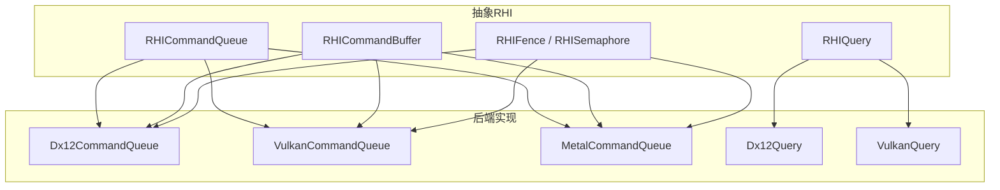
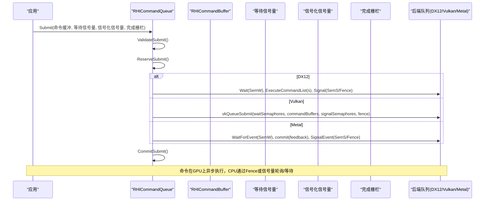
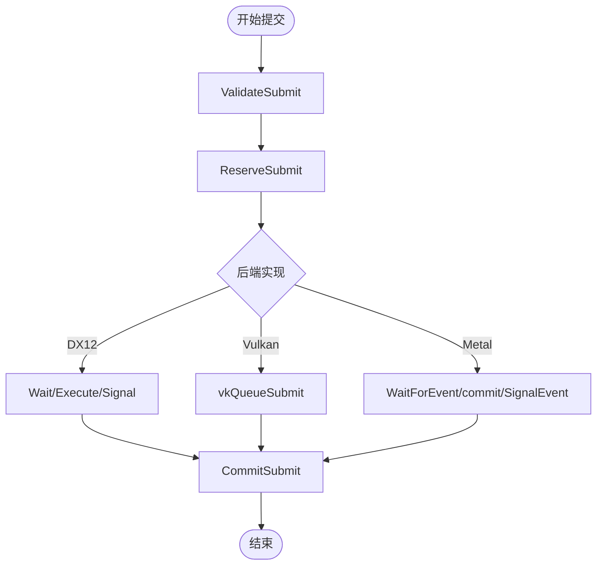
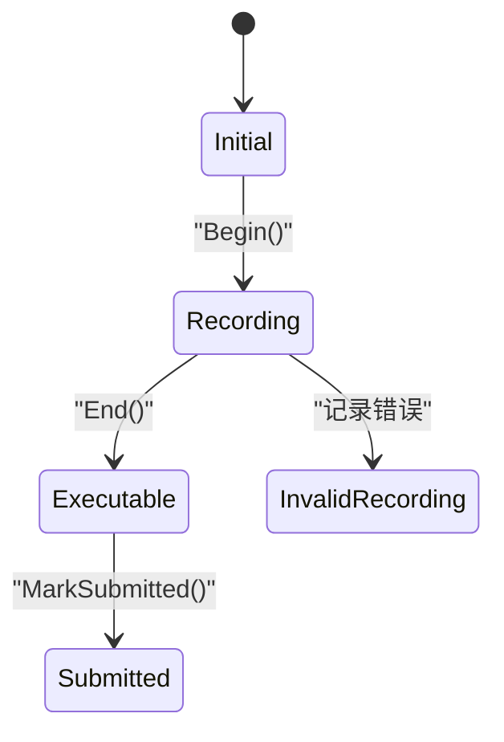
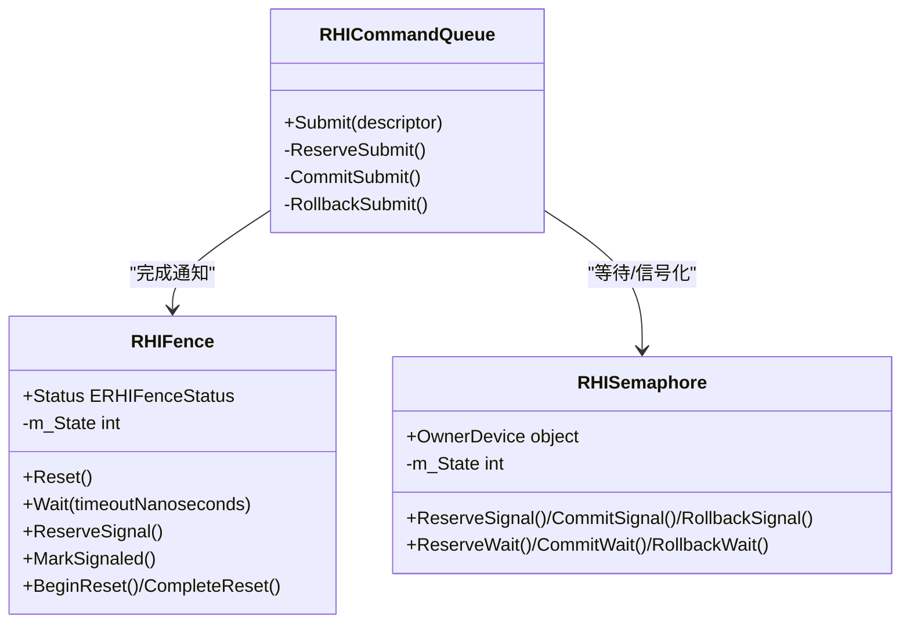
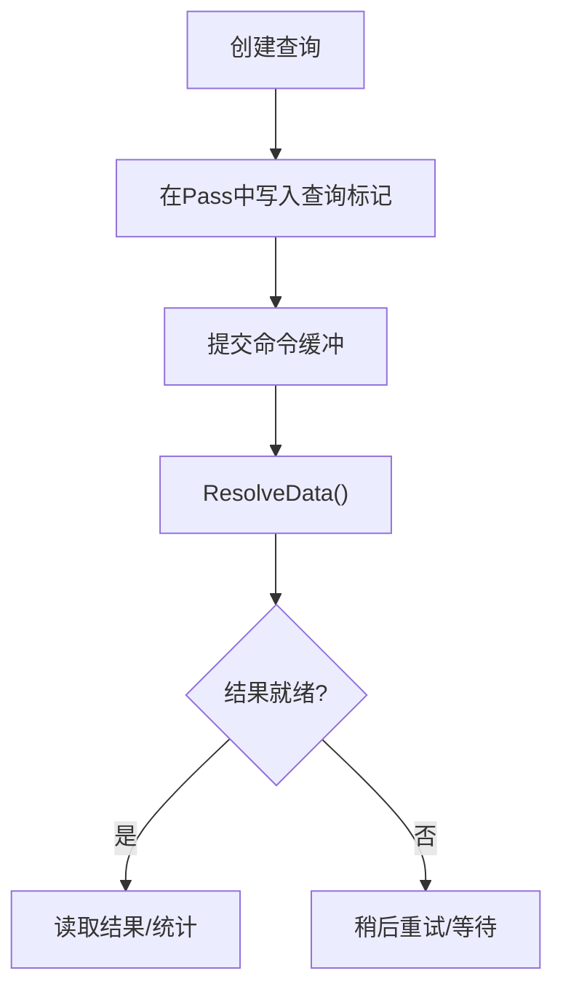
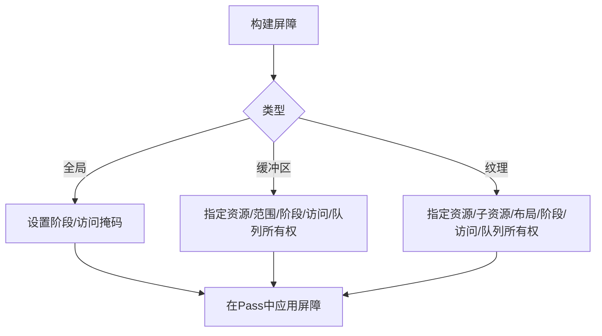
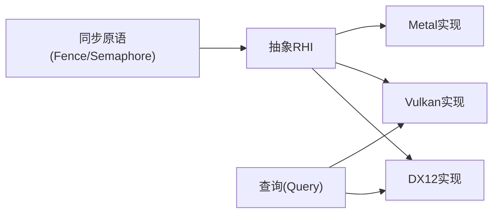

# 异步执行模型

<cite>
**本文引用的文件**
- [RHICommandQueue.cs](file://src/SharpGPU/Abstract/RHICommandQueue.cs)
- [RHICommandBuffer.cs](file://src/SharpGPU/Abstract/RHICommandBuffer.cs)
- [RHISynchronous.cs](file://src/SharpGPU/Abstract/RHISynchronous.cs)
- [RHIQuery.cs](file://src/SharpGPU/Abstract/RHIQuery.cs)
- [Dx12CommandQueue.cs](file://src/SharpGPU/Dx12/Dx12CommandQueue.cs)
- [VulkanCommandQueue.cs](file://src/SharpGPU/Vulkan/VulkanCommandQueue.cs)
- [MetalCommandQueue.cs](file://src/SharpGPU/Metal/MetalCommandQueue.cs)
- [Dx12Query.cs](file://src/SharpGPU/Dx12/Dx12Query.cs)
- [VulkanQuery.cs](file://src/SharpGPU/Vulkan/VulkanQuery.cs)
- [ComputeWorkload.cs](file://samples/ComputeAndDraw/ComputeWorkload.cs)
</cite>

## 目录
1. [简介](#简介)
2. [项目结构](#项目结构)
3. [核心组件](#核心组件)
4. [架构总览](#架构总览)
5. [详细组件分析](#详细组件分析)
6. [依赖关系分析](#依赖关系分析)
7. [性能考量](#性能考量)
8. [故障排查指南](#故障排查指南)
9. [结论](#结论)
10. [附录](#附录)

## 简介
本文件系统性阐述 SharpGPU 的异步执行模型，重点覆盖命令队列工作机制、栅栏（Fence）、信号量（Semaphore）、事件（Event）与查询（Query）等同步原语的使用方式；说明多线程环境下命令录制与提交的策略；给出高效异步流水线设计建议以避免 GPU 空闲；提供数据传输、计算与渲染协调的具体示例路径；对比不同后端（DirectX 12、Vulkan、Metal）在异步执行方面的特性与限制；并给出性能监控与调试异步问题的方法，以及错误处理与异常恢复机制。

## 项目结构
SharpGPU 将“抽象 RHI”与“具体后端实现”解耦：
- 抽象层定义命令队列、命令缓冲、同步原语、查询等统一接口与状态机。
- 各后端（DX12、Vulkan、Metal）实现具体的提交、稀疏绑定、事件/信号量语义和查询结果解析。
- 示例工程演示了如何在图形/计算管线中组合屏障、传输、计算与读取回读，并通过 Fence 进行 CPU 侧同步。

**图表来源**
- [RHICommandQueue.cs:60-108](file://src/SharpGPU/Abstract/RHICommandQueue.cs#L60-L108)
- [RHICommandBuffer.cs:26-189](file://src/SharpGPU/Abstract/RHICommandBuffer.cs#L26-L189)
- [RHISynchronous.cs:14-176](file://src/SharpGPU/Abstract/RHISynchronous.cs#L14-L176)
- [RHIQuery.cs:310-446](file://src/SharpGPU/Abstract/RHIQuery.cs#L310-L446)
- [Dx12CommandQueue.cs:58-154](file://src/SharpGPU/Dx12/Dx12CommandQueue.cs#L58-L154)
- [VulkanCommandQueue.cs:63-158](file://src/SharpGPU/Vulkan/VulkanCommandQueue.cs#L63-L158)
- [MetalCommandQueue.cs:71-181](file://src/SharpGPU/Metal/MetalCommandQueue.cs#L71-L181)
- [Dx12Query.cs:115-153](file://src/SharpGPU/Dx12/Dx12Query.cs#L115-L153)
- [VulkanQuery.cs:84-150](file://src/SharpGPU/Vulkan/VulkanQuery.cs#L84-L150)

**章节来源**
- [RHICommandQueue.cs:60-108](file://src/SharpGPU/Abstract/RHICommandQueue.cs#L60-L108)
- [RHICommandBuffer.cs:26-189](file://src/SharpGPU/Abstract/RHICommandBuffer.cs#L26-L189)
- [RHISynchronous.cs:14-176](file://src/SharpGPU/Abstract/RHISynchronous.cs#L14-L176)
- [RHIQuery.cs:310-446](file://src/SharpGPU/Abstract/RHIQuery.cs#L310-L446)

## 核心组件
- 命令队列（RHICommandQueue）：负责接收命令缓冲提交、等待/信号化同步原语、可选完成栅栏，并提供频率信息用于时间戳换算。
- 命令缓冲（RHICommandBuffer）：封装 Begin/End 生命周期与多种 Pass（传输、计算、光栅、光线追踪、机器学习、工作图），维护内部状态机确保正确顺序。
- 同步原语（RHIFence、RHISemaphore）：提供二进制同步的生命周期管理（Ready/Pending/Signaled/Resetting），支持 Reserve/Commit/Rollback 三段式提交。
- 查询（RHIQuery）：封装时间戳、遮挡、管线统计等查询类型，提供结果解析与域特定统计访问。

关键职责与交互：
- 提交前校验：队列对命令缓冲、等待/信号化信号量、完成栅栏进行所有权与合法性检查。
- 三段式提交：Reserve -> 实际提交 -> Commit；失败时 Rollback 保证一致性。
- 后端差异：DX12 使用 ID3D12CommandQueue::ExecuteCommandList(s)/Signal/Wait；Vulkan 使用 vkQueueSubmit/vkQueueBindSparse；Metal 使用 MTL4CommandQueue 的事件/可绘制对象等待与提交。

**章节来源**
- [RHICommandQueue.cs:118-242](file://src/SharpGPU/Abstract/RHICommandQueue.cs#L118-L242)
- [RHICommandQueue.cs:244-330](file://src/SharpGPU/Abstract/RHICommandQueue.cs#L244-L330)
- [RHICommandBuffer.cs:36-163](file://src/SharpGPU/Abstract/RHICommandBuffer.cs#L36-L163)
- [RHISynchronous.cs:14-176](file://src/SharpGPU/Abstract/RHISynchronous.cs#L14-L176)
- [RHIQuery.cs:310-446](file://src/SharpGPU/Abstract/RHIQuery.cs#L310-L446)

## 架构总览
下图展示了从应用到后端的异步提交流程，包括等待/信号化同步原语与完成栅栏的配合。

**图表来源**
- [RHICommandQueue.cs:118-242](file://src/SharpGPU/Abstract/RHICommandQueue.cs#L118-L242)
- [Dx12CommandQueue.cs:58-154](file://src/SharpGPU/Dx12/Dx12CommandQueue.cs#L58-L154)
- [VulkanCommandQueue.cs:63-158](file://src/SharpGPU/Vulkan/VulkanCommandQueue.cs#L63-L158)
- [MetalCommandQueue.cs:71-181](file://src/SharpGPU/Metal/MetalCommandQueue.cs#L71-L181)

## 详细组件分析

### 命令队列与提交流程
- 抽象队列提供统一的提交入口与严格的参数校验，确保命令缓冲来自同一队列且未重复提交，信号量属于同一设备且未被重复使用。
- 三段式提交保障原子性：Reserve 预占资源，Commit 确认提交，Rollback 在异常时回滚。
- 后端实现将抽象操作映射为原生 API：
  - DX12：ExecuteCommandList(s)、Signal、Wait，并使用 Dx12Semaphore/Dx12Fence。
  - Vulkan：vkQueueSubmit/vkQueueBindSparse，使用 VkSemaphore/VkFence。
  - Metal：MTL4CommandQueue 的 WaitForEvent/SignalEvent，结合 Presentable Drawable 的等待与信号。

**图表来源**
- [RHICommandQueue.cs:118-242](file://src/SharpGPU/Abstract/RHICommandQueue.cs#L118-L242)
- [RHICommandQueue.cs:244-330](file://src/SharpGPU/Abstract/RHICommandQueue.cs#L244-L330)
- [Dx12CommandQueue.cs:58-154](file://src/SharpGPU/Dx12/Dx12CommandQueue.cs#L58-L154)
- [VulkanCommandQueue.cs:63-158](file://src/SharpGPU/Vulkan/VulkanCommandQueue.cs#L63-L158)
- [MetalCommandQueue.cs:71-181](file://src/SharpGPU/Metal/MetalCommandQueue.cs#L71-L181)

**章节来源**
- [RHICommandQueue.cs:118-242](file://src/SharpGPU/Abstract/RHICommandQueue.cs#L118-L242)
- [RHICommandQueue.cs:244-330](file://src/SharpGPU/Abstract/RHICommandQueue.cs#L244-L330)
- [Dx12CommandQueue.cs:58-154](file://src/SharpGPU/Dx12/Dx12CommandQueue.cs#L58-L154)
- [VulkanCommandQueue.cs:63-158](file://src/SharpGPU/Vulkan/VulkanCommandQueue.cs#L63-L158)
- [MetalCommandQueue.cs:71-181](file://src/SharpGPU/Metal/MetalCommandQueue.cs#L71-L181)

### 命令缓冲状态机与编码器约束
- 命令缓冲维护 Internal State：Initial -> Recording -> Executable -> Submitted。
- 每个 Pass 对应一个编码器（传输、计算、光栅、光线追踪、机器学习、工作图），同一时刻只能有一个活跃编码器。
- 提交前必须处于 Executable 状态，提交后进入 Submitted。

**图表来源**
- [RHICommandBuffer.cs:6-13](file://src/SharpGPU/Abstract/RHICommandBuffer.cs#L6-L13)
- [RHICommandBuffer.cs:36-163](file://src/SharpGPU/Abstract/RHICommandBuffer.cs#L36-L163)

**章节来源**
- [RHICommandBuffer.cs:36-163](file://src/SharpGPU/Abstract/RHICommandBuffer.cs#L36-L163)

### 栅栏（Fence）与信号量（Semaphore）
- Fence：用于单队列内或跨队列的完成通知，支持 Reset/Wait/Status，内部状态机包含 Ready/Pending/Signaled/Resetting，提供 ReserveSignal/MarkSignaled/CompleteReset 等安全操作。
- Semaphore：用于跨队列/跨线程的二进制同步，支持 ReserveSignal/CommitSignal/RollbackSignal 与 ReserveWait/CommitWait/RollbackWait。
- 提交时队列会验证信号量/栅栏的设备归属与生命周期，避免混用与重复使用。

**图表来源**
- [RHISynchronous.cs:14-176](file://src/SharpGPU/Abstract/RHISynchronous.cs#L14-L176)
- [RHISynchronous.cs:178-280](file://src/SharpGPU/Abstract/RHISynchronous.cs#L178-L280)
- [RHICommandQueue.cs:118-242](file://src/SharpGPU/Abstract/RHICommandQueue.cs#L118-L242)

**章节来源**
- [RHISynchronous.cs:14-176](file://src/SharpGPU/Abstract/RHISynchronous.cs#L14-L176)
- [RHISynchronous.cs:178-280](file://src/SharpGPU/Abstract/RHISynchronous.cs#L178-L280)
- [RHICommandQueue.cs:118-242](file://src/SharpGPU/Abstract/RHICommandQueue.cs#L118-L242)

### 查询（Query）与时间戳/统计
- 查询类型包括时间戳、遮挡、管线统计等，支持按域（Raster/Compute/RayTracing）获取统计结果。
- 后端实现：
  - DX12：创建 QueryHeap 与 Readback Buffer，ResolveData 映射并复制结果。
  - Vulkan：创建 QueryPool，ResolveData 调用 vkGetQueryPoolResults，支持 NotReady 返回。
- 频率信息：队列提供 Frequency，用于将 GPU 时间戳转换为纳秒级时间。

**图表来源**
- [RHIQuery.cs:310-446](file://src/SharpGPU/Abstract/RHIQuery.cs#L310-L446)
- [Dx12Query.cs:115-153](file://src/SharpGPU/Dx12/Dx12Query.cs#L115-L153)
- [VulkanQuery.cs:84-150](file://src/SharpGPU/Vulkan/VulkanQuery.cs#L84-L150)
- [Dx12CommandQueue.cs:22-29](file://src/SharpGPU/Dx12/Dx12CommandQueue.cs#L22-L29)
- [VulkanCommandQueue.cs:29-38](file://src/SharpGPU/Vulkan/VulkanCommandQueue.cs#L29-L38)

**章节来源**
- [RHIQuery.cs:310-446](file://src/SharpGPU/Abstract/RHIQuery.cs#L310-L446)
- [Dx12Query.cs:115-153](file://src/SharpGPU/Dx12/Dx12Query.cs#L115-L153)
- [VulkanQuery.cs:84-150](file://src/SharpGPU/Vulkan/VulkanQuery.cs#L84-L150)
- [Dx12CommandQueue.cs:22-29](file://src/SharpGPU/Dx12/Dx12CommandQueue.cs#L22-L29)
- [VulkanCommandQueue.cs:29-38](file://src/SharpGPU/Vulkan/VulkanCommandQueue.cs#L29-L38)

### 屏障（Barrier）与阶段/访问掩码
- 屏障用于声明资源在不同阶段与访问模式之间的转换，支持全局、缓冲区、纹理三种类型。
- 阶段掩码（StageMask）与访问掩码（AccessMask）精确控制数据可见性与内存一致性。
- 队列所有权转移：跨队列屏障需指定源/目的逻辑队列类型，并在正确的录制队列上记录。

**图表来源**
- [RHISynchronous.cs:283-660](file://src/SharpGPU/Abstract/RHISynchronous.cs#L283-L660)

**章节来源**
- [RHISynchronous.cs:283-660](file://src/SharpGPU/Abstract/RHISynchronous.cs#L283-L660)

### 多线程下的命令录制与执行策略
- 命令缓冲可在独立线程录制，但提交必须在对应的命令队列上进行。
- 提交前严格校验命令缓冲归属与状态，避免跨队列误用与重复提交。
- 同步原语的 Reserve/Commit/Rollback 保证并发安全与异常回滚。
- 建议在多线程环境中：
  - 每帧分配独立的命令缓冲，避免共享可变状态。
  - 使用信号量协调多队列任务（如传输/计算/渲染）。
  - 使用 Fence 在 CPU 侧等待 GPU 完成，再进行下一步操作。

**章节来源**
- [RHICommandBuffer.cs:36-163](file://src/SharpGPU/Abstract/RHICommandBuffer.cs#L36-L163)
- [RHICommandQueue.cs:118-242](file://src/SharpGPU/Abstract/RHICommandQueue.cs#L118-L242)
- [RHISynchronous.cs:14-176](file://src/SharpGPU/Abstract/RHISynchronous.cs#L14-L176)

### 高效异步流水线设计
- 重叠执行：将数据传输、计算与渲染拆分到不同队列或不同命令缓冲，利用信号量/栅栏建立依赖。
- 减少同步点：仅在必要处插入屏障，尽量合并屏障以减少开销。
- 批量提交：一次提交多个命令缓冲，降低驱动开销。
- 使用查询进行性能剖析：时间戳测量阶段耗时，统计查询评估着色器/管线利用率。

**章节来源**
- [Dx12CommandQueue.cs:109-123](file://src/SharpGPU/Dx12/Dx12CommandQueue.cs#L109-L123)
- [VulkanCommandQueue.cs:112-138](file://src/SharpGPU/Vulkan/VulkanCommandQueue.cs#L112-L138)
- [RHIQuery.cs:87-112](file://src/SharpGPU/Abstract/RHIQuery.cs#L87-L112)

### 代码示例：异步数据传输、计算与渲染协调
- 示例路径：[ComputeWorkload.cs](file://samples/ComputeAndDraw/ComputeWorkload.cs)
- 流程要点：
  - 创建命令缓冲，开启 Compute Pass，设置屏障确保输出缓冲区写可见。
  - 开启 Transfer Pass，拷贝结果到可读回读缓冲。
  - 提交命令缓冲并设置完成栅栏，CPU 等待栅栏后读取结果。
- 该示例展示了典型的“计算 -> 传输 -> 读取”异步协作模式。

**章节来源**
- [ComputeWorkload.cs:115-161](file://samples/ComputeAndDraw/ComputeWorkload.cs#L115-L161)

### 后端特性与限制
- DirectX 12：
  - 使用 ID3D12CommandQueue 的 ExecuteCommandList(s)/Signal/Wait。
  - 支持队列有序稀疏纹理绑定（UpdateTileMappings）。
  - 频率通过 GetTimestampFrequency 获取。
- Vulkan：
  - 使用 vkQueueSubmit/vkQueueBindSparse，支持 NotReady 查询结果。
  - 频率基于物理设备属性 timestampPeriod 计算。
- Metal：
  - 使用 MTL4CommandQueue 的事件等待与信号，结合可绘制对象的等待与信号。
  - 需要 Metal 4 命令队列支持；当前提交不使用反馈回调以避免 PAC 故障。

**章节来源**
- [Dx12CommandQueue.cs:58-154](file://src/SharpGPU/Dx12/Dx12CommandQueue.cs#L58-L154)
- [VulkanCommandQueue.cs:63-158](file://src/SharpGPU/Vulkan/VulkanCommandQueue.cs#L63-L158)
- [MetalCommandQueue.cs:71-181](file://src/SharpGPU/Metal/MetalCommandQueue.cs#L71-L181)
- [Dx12CommandQueue.cs:22-29](file://src/SharpGPU/Dx12/Dx12CommandQueue.cs#L22-L29)
- [VulkanCommandQueue.cs:29-38](file://src/SharpGPU/Vulkan/VulkanCommandQueue.cs#L29-L38)

## 依赖关系分析
- 抽象层依赖：所有后端均继承自 RHICommandQueue，复用通用校验与三段式提交逻辑。
- 同步原语依赖：队列提交依赖信号量/栅栏的生命周期管理与设备归属校验。
- 查询依赖：查询结果解析依赖后端特定的原生 API（DX12 QueryHeap/Readback，Vulkan QueryPool）。

**图表来源**
- [RHICommandQueue.cs:60-108](file://src/SharpGPU/Abstract/RHICommandQueue.cs#L60-L108)
- [RHISynchronous.cs:14-176](file://src/SharpGPU/Abstract/RHISynchronous.cs#L14-L176)
- [RHIQuery.cs:310-446](file://src/SharpGPU/Abstract/RHIQuery.cs#L310-L446)

**章节来源**
- [RHICommandQueue.cs:60-108](file://src/SharpGPU/Abstract/RHICommandQueue.cs#L60-L108)
- [RHISynchronous.cs:14-176](file://src/SharpGPU/Abstract/RHISynchronous.cs#L14-L176)
- [RHIQuery.cs:310-446](file://src/SharpGPU/Abstract/RHIQuery.cs#L310-L446)

## 性能考量
- 最小化同步点：仅在数据依赖处插入屏障，避免不必要的阶段/访问切换。
- 批量化提交：一次提交多个命令缓冲，减少驱动调用次数。
- 使用查询进行性能剖析：时间戳测量阶段耗时，统计查询评估着色器/管线利用率。
- 后端优化：
  - DX12：合理使用 ExecuteCommandLists 批量提交。
  - Vulkan：注意 vkGetQueryPoolResults 的 NotReady 情况，避免频繁轮询。
  - Metal：避免使用反馈回调（当前实现未启用），关注可绘制对象的等待与信号。

**章节来源**
- [Dx12CommandQueue.cs:109-123](file://src/SharpGPU/Dx12/Dx12CommandQueue.cs#L109-L123)
- [VulkanQuery.cs:84-150](file://src/SharpGPU/Vulkan/VulkanQuery.cs#L84-L150)
- [MetalCommandQueue.cs:552-563](file://src/SharpGPU/Metal/MetalCommandQueue.cs#L552-L563)

## 故障排查指南
- 常见错误：
  - 命令缓冲未结束就提交：检查命令缓冲状态是否为 Executable。
  - 信号量/栅栏设备不匹配：确保同步原语由同一设备创建。
  - 重复提交命令缓冲：提交列表去重校验。
  - 查询结果未就绪：Vulkan 查询可能返回 NotReady，需延迟读取。
- 异常恢复：
  - 提交失败时执行 Rollback，释放已预占的资源。
  - 设备丢失时后端标记设备状态，上层可据此恢复。

**章节来源**
- [RHICommandBuffer.cs:122-163](file://src/SharpGPU/Abstract/RHICommandBuffer.cs#L122-L163)
- [RHICommandQueue.cs:118-242](file://src/SharpGPU/Abstract/RHICommandQueue.cs#L118-L242)
- [RHICommandQueue.cs:244-330](file://src/SharpGPU/Abstract/RHICommandQueue.cs#L244-L330)
- [VulkanQuery.cs:84-150](file://src/SharpGPU/Vulkan/VulkanQuery.cs#L84-L150)

## 结论
SharpGPU 通过抽象 RHI 与后端实现的解耦，提供了统一的异步执行模型。命令队列、命令缓冲、同步原语与查询共同构成了高效的异步流水线基础。合理设计屏障与同步点、批量化提交、使用查询进行性能剖析，可以显著减少 GPU 空闲时间。不同后端在异步执行方面各有特性与限制，开发者应依据目标平台选择合适的策略。

## 附录
- 参考示例：[ComputeWorkload.cs](file://samples/ComputeAndDraw/ComputeWorkload.cs)
- 关键接口路径：
  - 命令队列提交：[RHICommandQueue.Submit](file://src/SharpGPU/Abstract/RHICommandQueue.cs#L108)
  - 命令缓冲生命周期：[RHICommandBuffer.Begin/End:170-183](file://src/SharpGPU/Abstract/RHICommandBuffer.cs#L170-L183)
  - 栅栏/信号量：[RHIFence/RHISemaphore:14-280](file://src/SharpGPU/Abstract/RHISynchronous.cs#L14-L280)
  - 查询解析：[RHIQuery.ResolveData](file://src/SharpGPU/Abstract/RHIQuery.cs#L445)