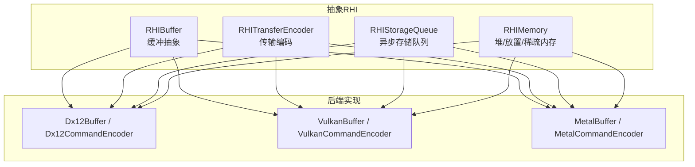
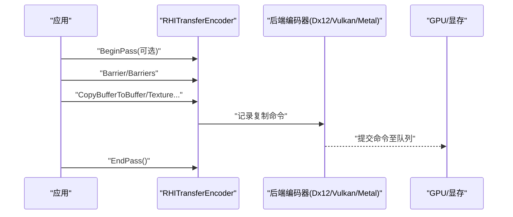
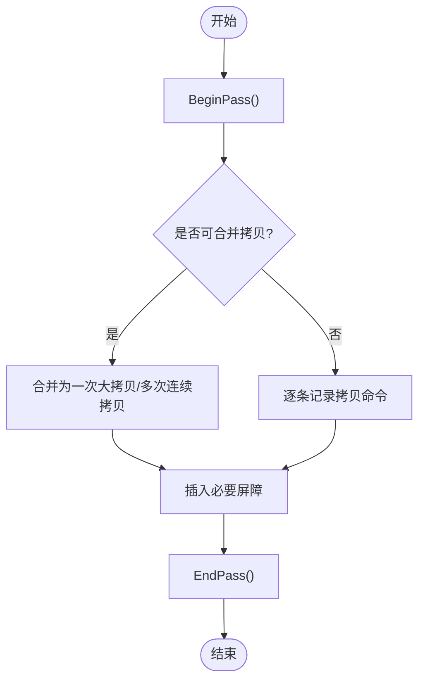
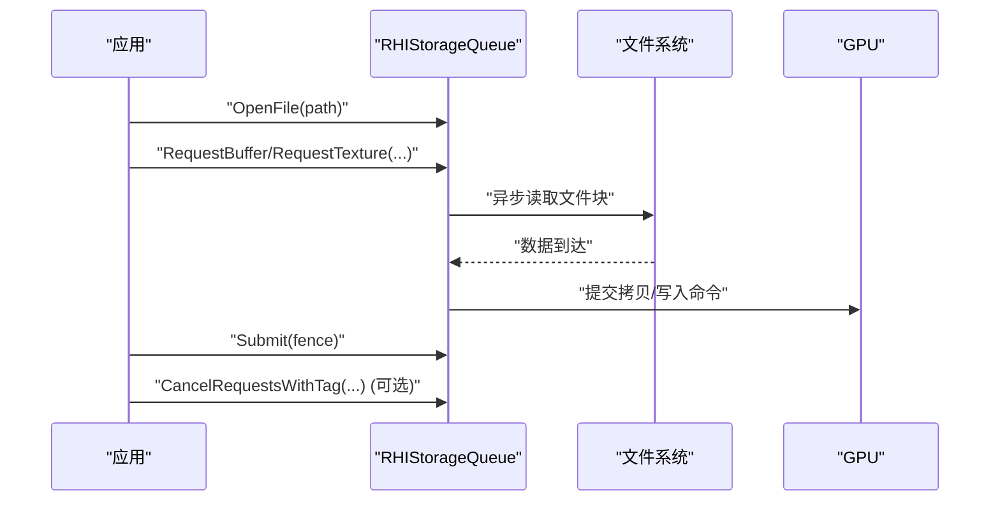
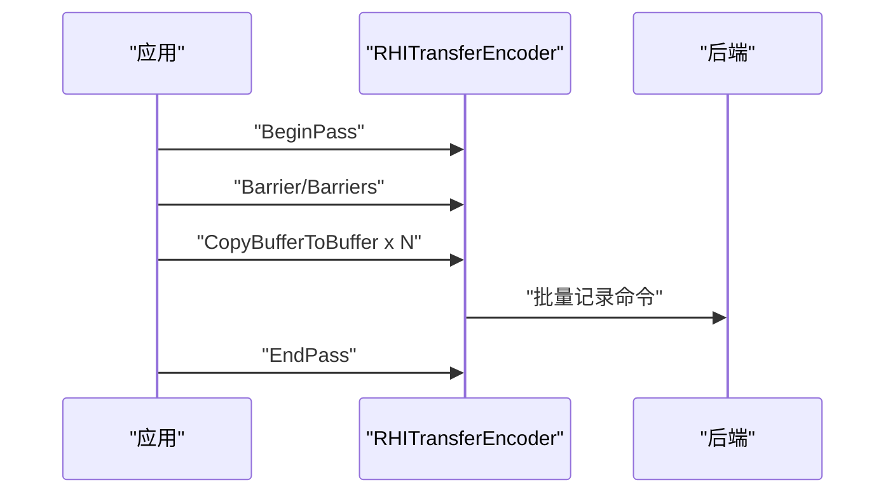
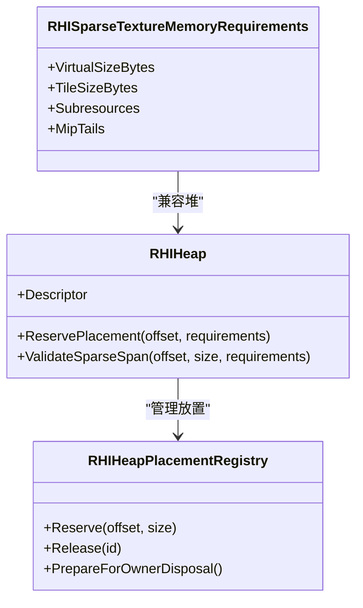
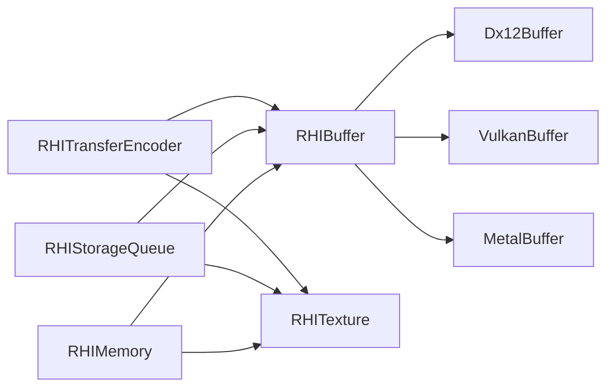

# 数据传输优化策略

<cite>
**本文引用的文件**
- [RHIBuffer.cs](file://src/SharpGPU/Abstract/RHIBuffer.cs)
- [RHICommandEncoder.cs](file://src/SharpGPU/Abstract/RHICommandEncoder.cs)
- [RHIMemory.cs](file://src/SharpGPU/Abstract/RHIMemory.cs)
- [RHIStorageQueue.cs](file://src/SharpGPU/Abstract/RHIStorageQueue.cs)
- [Dx12Buffer.cs](file://src/SharpGPU/Dx12/Dx12Buffer.cs)
- [Dx12CommandEncoder.cs](file://src/SharpGPU/Dx12/Dx12CommandEncoder.cs)
- [VulkanBuffer.cs](file://src/SharpGPU/Vulkan/VulkanBuffer.cs)
- [MetalBuffer.cs](file://src/SharpGPU/Metal/MetalBuffer.cs)
</cite>

## 目录
1. [简介](#简介)
2. [项目结构](#项目结构)
3. [核心组件](#核心组件)
4. [架构总览](#架构总览)
5. [详细组件分析](#详细组件分析)
6. [依赖关系分析](#依赖关系分析)
7. [性能考虑](#性能考虑)
8. [故障排查指南](#故障排查指南)
9. [结论](#结论)
10. [附录](#附录)

## 简介
本文件面向SharpGPU的数据传输优化，围绕不同数据规模与更新频率的传输场景，给出可操作的优化策略：小批量数据传输、大数据块传输、频繁更新数据的处理；说明传输编码器（RHITransferEncoder）的使用模式与批处理策略；解释异步I/O（RHIStorageQueue）的实现机制与性能优势；指导如何选择合适的传输方法与缓冲区布局以最大化带宽利用率；并提供内存池管理与重用策略以降低分配开销。文档同时给出针对不同后端（DirectX 12、Vulkan、Metal）的差异化建议与基准测试方法学。

## 项目结构
SharpGPU采用抽象RHI层与多后端实现分离的设计。数据传输相关能力集中在以下位置：
- 抽象接口与数据结构：位于 src/SharpGPU/Abstract，包括缓冲、命令编码器、存储队列、内存管理等。
- 后端实现：位于 src/SharpGPU/{Dx12,Vulkan,Metal}，提供具体平台的缓冲创建、映射、资源状态转换与底层调用。

图表来源
- [RHIBuffer.cs:14-46](file://src/SharpGPU/Abstract/RHIBuffer.cs#L14-L46)
- [RHICommandEncoder.cs:110-133](file://src/SharpGPU/Abstract/RHICommandEncoder.cs#L110-L133)
- [RHIStorageQueue.cs:44-55](file://src/SharpGPU/Abstract/RHIStorageQueue.cs#L44-L55)
- [RHIMemory.cs:173-457](file://src/SharpGPU/Abstract/RHIMemory.cs#L173-L457)
- [Dx12Buffer.cs:37-86](file://src/SharpGPU/Dx12/Dx12Buffer.cs#L37-L86)
- [VulkanBuffer.cs:65-181](file://src/SharpGPU/Vulkan/VulkanBuffer.cs#L65-L181)
- [MetalBuffer.cs:31-75](file://src/SharpGPU/Metal/MetalBuffer.cs#L31-L75)

章节来源
- [RHIBuffer.cs:14-46](file://src/SharpGPU/Abstract/RHIBuffer.cs#L14-L46)
- [RHICommandEncoder.cs:110-133](file://src/SharpGPU/Abstract/RHICommandEncoder.cs#L110-L133)
- [RHIStorageQueue.cs:44-55](file://src/SharpGPU/Abstract/RHIStorageQueue.cs#L44-L55)
- [RHIMemory.cs:173-457](file://src/SharpGPU/Abstract/RHIMemory.cs#L173-L457)

## 核心组件
- RHIBuffer：定义缓冲的创建描述符、分配模式、GPU虚拟地址访问以及CPU映射/解映射接口。用于承载所有类型的数据传输目标或源。
- RHITransferEncoder：封装复制类命令（缓冲到缓冲、缓冲到纹理、纹理到纹理），支持屏障、时间戳、调试分组等，是批量传输的核心入口。
- RHIStorageQueue：提供文件打开/关闭、文件大小查询、缓冲/纹理异步加载请求、提交与取消能力，适合大文件或流式数据加载。
- RHIMemory：管理堆、放置资源、稀疏纹理、预算与驻留控制，为高效复用与避免碎片化提供基础。

章节来源
- [RHIBuffer.cs:6-46](file://src/SharpGPU/Abstract/RHIBuffer.cs#L6-L46)
- [RHICommandEncoder.cs:55-133](file://src/SharpGPU/Abstract/RHICommandEncoder.cs#L55-L133)
- [RHIStorageQueue.cs:14-55](file://src/SharpGPU/Abstract/RHIStorageQueue.cs#L14-L55)
- [RHIMemory.cs:23-116](file://src/SharpGPU/Abstract/RHIMemory.cs#L23-L116)

## 架构总览
数据传输在SharpGPU中通过“抽象RHI + 后端实现”分层完成：
- 应用层使用RHITransferEncoder发起复制命令，或通过RHIStorageQueue发起异步I/O请求。
- 后端根据平台特性选择最优路径：如DX12的CopyBuffer/CopyTexture、Vulkan的vkCmdCopyBufferToBuffer/vkCmdCopyBufferToImage、Metal的MTLCommandEncoder copyFromBuffer/copyFromTexture。
- 对于频繁更新的小块数据，优先使用HostVisible/GPUUpload类型的缓冲并配合Map/Unmap或持久映射；对大数据块则尽量合并为单次大拷贝或使用异步I/O。

图表来源
- [RHICommandEncoder.cs:110-133](file://src/SharpGPU/Abstract/RHICommandEncoder.cs#L110-L133)
- [Dx12CommandEncoder.cs:12-200](file://src/SharpGPU/Dx12/Dx12CommandEncoder.cs#L12-L200)

章节来源
- [RHICommandEncoder.cs:110-133](file://src/SharpGPU/Abstract/RHICommandEncoder.cs#L110-L133)

## 详细组件分析

### 传输编码器与批处理策略
- 使用RHITransferEncoder进行批量复制：将多个小拷贝合并为一个Pass，减少屏障与上下文切换。
- 合理使用Barrier/Barriers确保数据就绪，避免不必要的同步。
- 利用Timestamp/Statistics进行关键路径的性能测量，定位瓶颈。

图表来源
- [RHICommandEncoder.cs:110-133](file://src/SharpGPU/Abstract/RHICommandEncoder.cs#L110-L133)

章节来源
- [RHICommandEncoder.cs:110-133](file://src/SharpGPU/Abstract/RHICommandEncoder.cs#L110-L133)

### 小批量数据传输优化
- 推荐策略：
  - 使用HostVisible/GPUUpload缓冲，结合Map/Unmap写入，避免频繁CPU-GPU同步。
  - 将多次小写操作合并为一次较大的写入窗口，减少Map/Unmap次数。
  - 在后端层面，DX12可使用WriteBufferImmediate或CopyBufferToBuffer；Vulkan可使用vkCmdCopyBufferToBuffer；Metal可使用copyFromBuffer。
- 注意事项：
  - 避免每帧大量小拷贝，尽量聚合。
  - 合理设置缓冲大小与对齐，减少浪费。

章节来源
- [RHIBuffer.cs:44-46](file://src/SharpGPU/Abstract/RHIBuffer.cs#L44-L46)
- [Dx12Buffer.cs:99-133](file://src/SharpGPU/Dx12/Dx12Buffer.cs#L99-L133)
- [VulkanBuffer.cs:192-303](file://src/SharpGPU/Vulkan/VulkanBuffer.cs#L192-L303)
- [MetalBuffer.cs:85-120](file://src/SharpGPU/Metal/MetalBuffer.cs#L85-L120)

### 大数据块传输优化
- 推荐策略：
  - 优先使用RHIStorageQueue进行异步I/O，避免阻塞主线程。
  - 将大文件按块读取并写入预分配的DestinationBuffer/Texture，减少中间拷贝。
  - 使用压缩格式（如GDeflate）降低网络/磁盘带宽占用，并在GPU侧解压（若后端支持）。
- 注意事项：
  - 合理设置FileOffset/FileSize与Destination偏移，避免越界。
  - 使用CancellationTag进行任务级取消，提高交互性。

图表来源
- [RHIStorageQueue.cs:14-55](file://src/SharpGPU/Abstract/RHIStorageQueue.cs#L14-L55)

章节来源
- [RHIStorageQueue.cs:14-55](file://src/SharpGPU/Abstract/RHIStorageQueue.cs#L14-L55)

### 频繁更新的数据
- 推荐策略：
  - 使用持久映射（Persistent Mapping）或环形缓冲，减少Map/Unmap开销。
  - 在后端层面：
    - DX12：使用Committed或Placed缓冲，必要时使用WriteBufferImmediate。
    - Vulkan：使用HostVisible内存并缓存映射指针，按需Invalidate/Flush。
    - Metal：Managed存储模式下使用DidModifyRange通知系统。
- 注意事项：
  - 避免跨线程同时读写同一缓冲，必要时加屏障。
  - 合理划分更新区域，仅刷新变化部分。

章节来源
- [VulkanBuffer.cs:192-303](file://src/SharpGPU/Vulkan/VulkanBuffer.cs#L192-L303)
- [MetalBuffer.cs:85-120](file://src/SharpGPU/Metal/MetalBuffer.cs#L85-L120)
- [Dx12Buffer.cs:99-133](file://src/SharpGPU/Dx12/Dx12Buffer.cs#L99-L133)

### 传输编码器使用模式与批处理
- 典型流程：
  - BeginPass -> 设置屏障 -> 记录复制命令 -> EndPass。
  - 将多个小拷贝合并为一次大拷贝或连续拷贝序列，减少屏障数量。
  - 使用Timestamp统计传输耗时，定位热点。

图表来源
- [RHICommandEncoder.cs:110-133](file://src/SharpGPU/Abstract/RHICommandEncoder.cs#L110-L133)

章节来源
- [RHICommandEncoder.cs:110-133](file://src/SharpGPU/Abstract/RHICommandEncoder.cs#L110-L133)

### 异步数据传输实现机制与性能优势
- 机制：
  - 通过RHIStorageQueue发起异步I/O请求，后台线程从文件读取数据并写入GPU缓冲/纹理。
  - 使用Fence进行完成同步，避免阻塞主循环。
  - 支持按Tag取消请求，提升交互性与资源回收效率。
- 优势：
  - 隐藏磁盘/网络延迟，提升吞吐。
  - 与渲染/计算并行执行，提高整体利用率。

章节来源
- [RHIStorageQueue.cs:44-55](file://src/SharpGPU/Abstract/RHIStorageQueue.cs#L44-L55)

### 选择合适的传输方法与缓冲区布局
- 选择依据：
  - 数据规模：小块用Map/Unmap+CopyBufferToBuffer；大块用异步I/O或直接GPU-side解压。
  - 更新频率：高频用小缓冲+持久映射；低频用一次性上传。
  - 格式与对齐：遵循平台对齐要求，避免额外拷贝。
- 布局建议：
  - 将同生命周期、同访问模式的资源放入同一堆（Heap），减少碎片。
  - 使用Placed资源共享堆空间，提高复用率。

章节来源
- [RHIMemory.cs:173-457](file://src/SharpGPU/Abstract/RHIMemory.cs#L173-L457)
- [Dx12Buffer.cs:37-86](file://src/SharpGPU/Dx12/Dx12Buffer.cs#L37-L86)
- [VulkanBuffer.cs:65-181](file://src/SharpGPU/Vulkan/VulkanBuffer.cs#L65-L181)
- [MetalBuffer.cs:31-75](file://src/SharpGPU/Metal/MetalBuffer.cs#L31-L75)

### 内存池管理与重用策略
- 堆与放置：
  - 使用RHIHeap统一管理物理内存，通过ReservePlacement分配子区域，避免重复分配。
  - 使用Placed资源复用堆空间，降低分配开销与碎片。
- 稀疏纹理：
  - 对超大纹理使用稀疏绑定，按需绑定Tile，节省显存。
- 预算与驻留：
  - 通过RHIMemoryBudget监控使用量，结合MakeResident/Evict控制驻留行为。

图表来源
- [RHIMemory.cs:173-457](file://src/SharpGPU/Abstract/RHIMemory.cs#L173-L457)
- [RHIMemory.cs:520-748](file://src/SharpGPU/Abstract/RHIMemory.cs#L520-L748)

章节来源
- [RHIMemory.cs:173-457](file://src/SharpGPU/Abstract/RHIMemory.cs#L173-L457)
- [RHIMemory.cs:520-748](file://src/SharpGPU/Abstract/RHIMemory.cs#L520-L748)

### 不同硬件平台的优化建议
- DirectX 12：
  - 使用Committed/Placed缓冲，优先批量CopyBufferToBuffer。
  - 对小更新使用WriteBufferImmediate减少同步。
  - 合理设置资源状态，减少Transition开销。
- Vulkan：
  - 使用HostVisible内存并缓存映射指针，按需Invalidate/Flush。
  - 合并vkCmdCopyBufferToBuffer/vkCmdCopyBufferToImage调用。
  - 利用Device Address获取GPU虚拟地址，减少间接访问。
- Metal：
  - Managed存储模式下使用DidModifyRange标记修改范围。
  - 使用MTLHeap进行堆管理，减少分配开销。

章节来源
- [Dx12Buffer.cs:99-133](file://src/SharpGPU/Dx12/Dx12Buffer.cs#L99-L133)
- [VulkanBuffer.cs:192-303](file://src/SharpGPU/Vulkan/VulkanBuffer.cs#L192-L303)
- [MetalBuffer.cs:85-120](file://src/SharpGPU/Metal/MetalBuffer.cs#L85-L120)

## 依赖关系分析
- 抽象层依赖：
  - RHITransferEncoder依赖RHIBuffer、RHITexture等资源抽象。
  - RHIStorageQueue依赖文件句柄与缓冲/纹理目标。
  - RHIMemory为所有后端提供统一的堆与放置语义。
- 后端实现：
  - Dx12Buffer/VulkanBuffer/MetalBuffer分别实现Map/Unmap与视图创建。
  - 各后端命令编码器负责将抽象命令转换为具体API调用。

图表来源
- [RHICommandEncoder.cs:110-133](file://src/SharpGPU/Abstract/RHICommandEncoder.cs#L110-L133)
- [RHIBuffer.cs:14-46](file://src/SharpGPU/Abstract/RHIBuffer.cs#L14-L46)
- [RHIStorageQueue.cs:44-55](file://src/SharpGPU/Abstract/RHIStorageQueue.cs#L44-L55)
- [RHIMemory.cs:173-457](file://src/SharpGPU/Abstract/RHIMemory.cs#L173-L457)
- [Dx12Buffer.cs:37-86](file://src/SharpGPU/Dx12/Dx12Buffer.cs#L37-L86)
- [VulkanBuffer.cs:65-181](file://src/SharpGPU/Vulkan/VulkanBuffer.cs#L65-L181)
- [MetalBuffer.cs:31-75](file://src/SharpGPU/Metal/MetalBuffer.cs#L31-L75)

章节来源
- [RHICommandEncoder.cs:110-133](file://src/SharpGPU/Abstract/RHICommandEncoder.cs#L110-L133)
- [RHIBuffer.cs:14-46](file://src/SharpGPU/Abstract/RHIBuffer.cs#L14-L46)
- [RHIStorageQueue.cs:44-55](file://src/SharpGPU/Abstract/RHIStorageQueue.cs#L44-L55)
- [RHIMemory.cs:173-457](file://src/SharpGPU/Abstract/RHIMemory.cs#L173-L457)

## 性能考虑
- 批处理：将多个小拷贝合并为一次大拷贝，减少屏障与命令提交次数。
- 内存复用：使用堆与放置资源，避免频繁分配与释放。
- 异步I/O：对大文件使用RHIStorageQueue，隐藏IO延迟。
- 平台差异：根据后端特性选择最优API与内存属性。
- 基准测试方法学：
  - 使用Timestamp统计传输耗时。
  - 对比不同批大小、不同内存类型、不同后端下的吞吐与时延。
  - 关注CPU-GPU同步点，尽量减少等待。

[本节为通用指导，不直接分析具体文件]

## 故障排查指南
- 常见错误：
  - 越界访问：Map/Unmap时检查readBegin/readEnd是否在缓冲范围内。
  - 非法状态：GPU-local缓冲不可映射；未映射就Unmap。
  - 堆冲突：放置资源重叠或未对齐。
- 排查步骤：
  - 检查缓冲描述符与存储模式。
  - 确认屏障顺序与资源状态。
  - 使用后端调试工具（如PIX、RenderDoc）捕获命令流。

章节来源
- [Dx12Buffer.cs:99-133](file://src/SharpGPU/Dx12/Dx12Buffer.cs#L99-L133)
- [VulkanBuffer.cs:192-303](file://src/SharpGPU/Vulkan/VulkanBuffer.cs#L192-L303)
- [MetalBuffer.cs:85-120](file://src/SharpGPU/Metal/MetalBuffer.cs#L85-L120)
- [RHIMemory.cs:380-457](file://src/SharpGPU/Abstract/RHIMemory.cs#L380-L457)

## 结论
SharpGPU通过抽象RHI与多后端实现，提供了灵活且高性能的数据传输能力。针对小批量、大数据块与频繁更新场景，应分别采用Map/Unmap批处理、异步I/O与持久映射等策略。结合堆与放置资源的内存管理，可显著降低分配开销并提升带宽利用率。在不同平台上，应根据后端特性选择最优API与内存属性，并通过Timestamp与基准测试持续优化。

## 附录
- 术语：
  - 传输编码器：用于记录复制命令的对象。
  - 堆：集中管理的物理内存块。
  - 放置资源：基于堆偏移创建的资源。
  - 稀疏纹理：按需绑定Tile的大纹理。
- 参考路径：
  - 传输编码器接口：[RHICommandEncoder.cs:110-133](file://src/SharpGPU/Abstract/RHICommandEncoder.cs#L110-L133)
  - 缓冲抽象：[RHIBuffer.cs:14-46](file://src/SharpGPU/Abstract/RHIBuffer.cs#L14-L46)
  - 异步存储队列：[RHIStorageQueue.cs:44-55](file://src/SharpGPU/Abstract/RHIStorageQueue.cs#L44-L55)
  - 内存管理：[RHIMemory.cs:173-457](file://src/SharpGPU/Abstract/RHIMemory.cs#L173-L457)