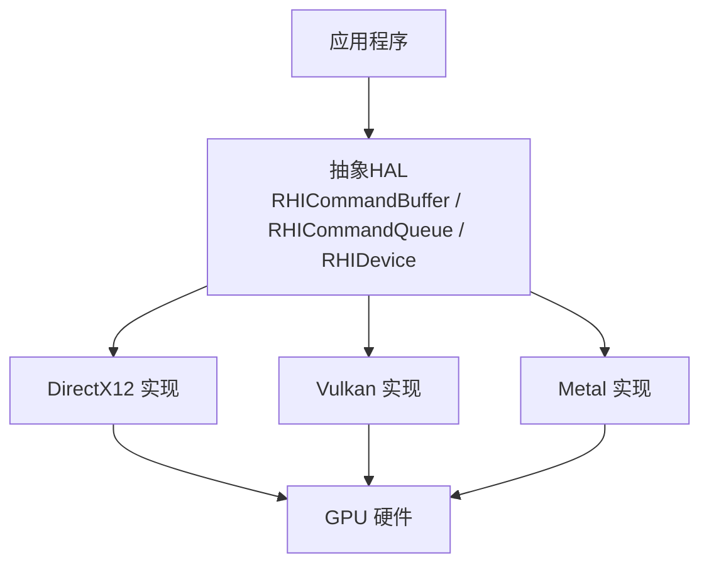
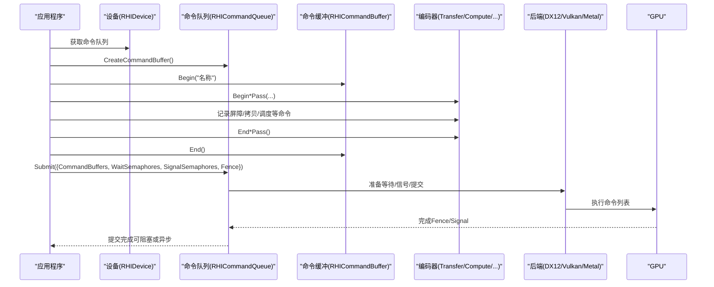
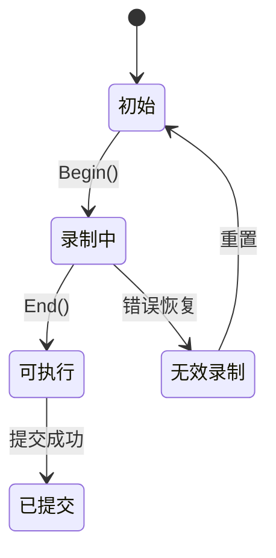
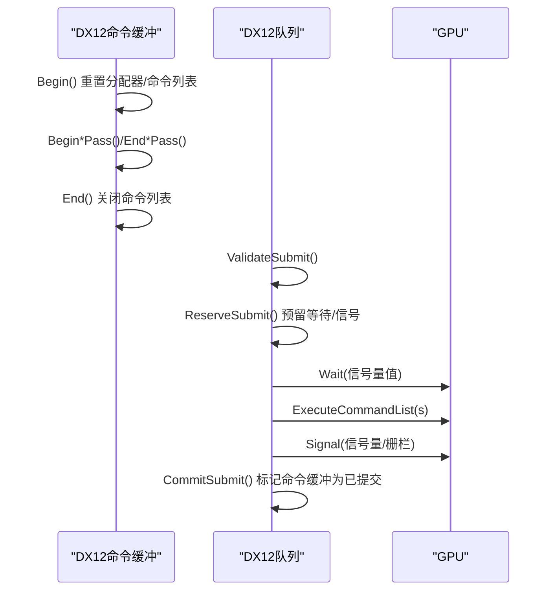
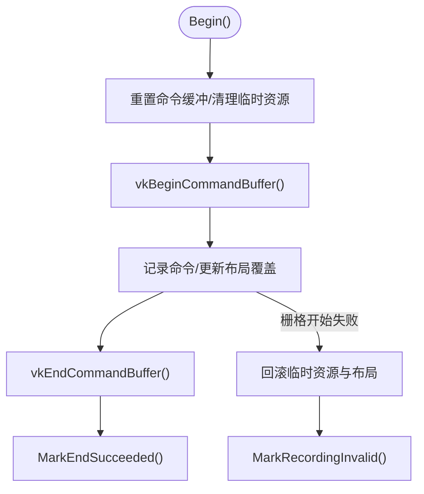
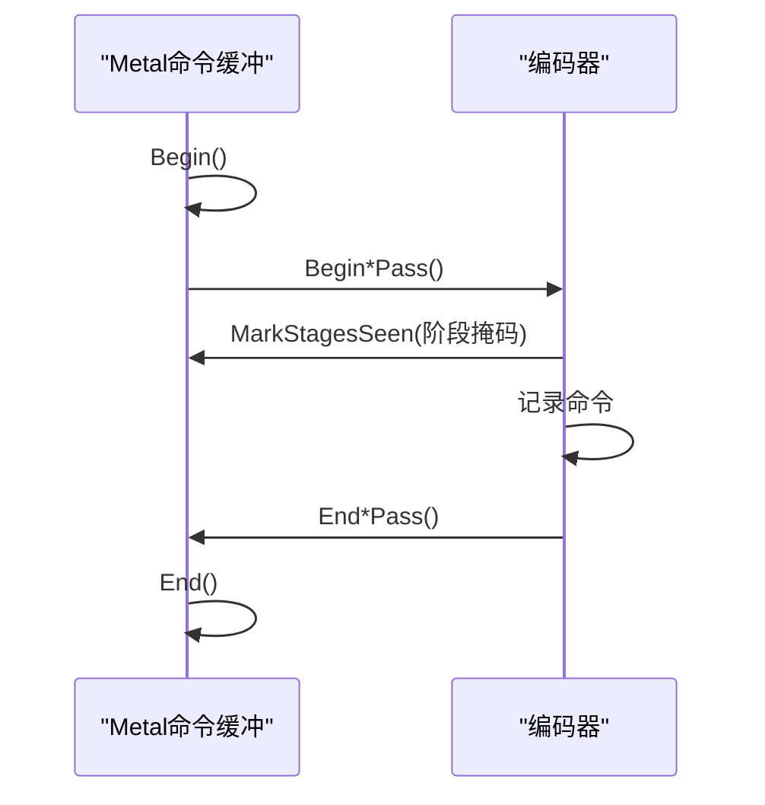
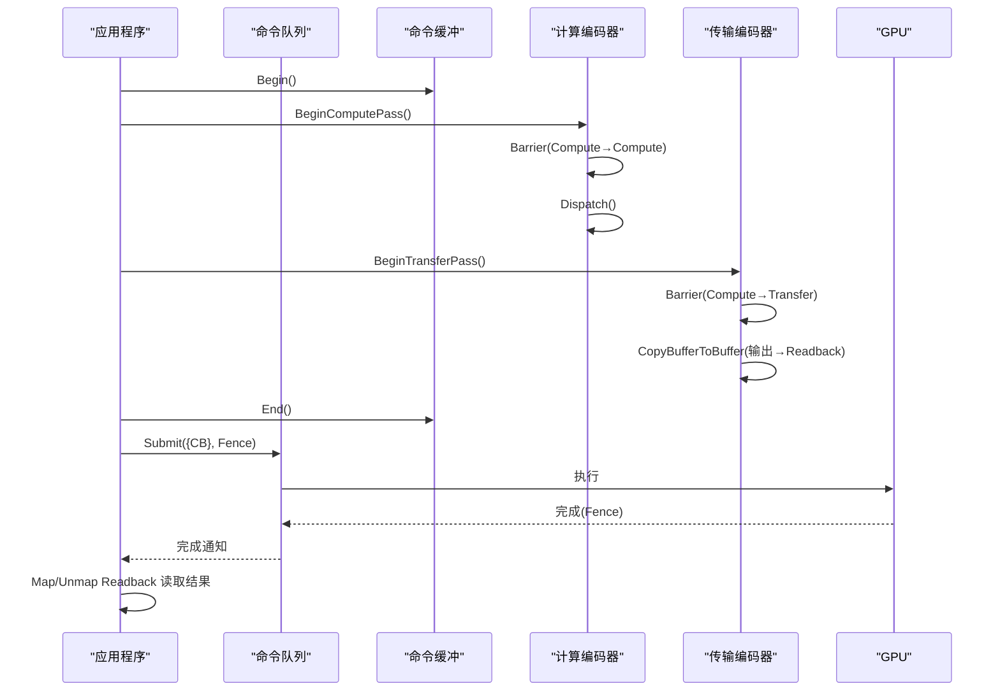
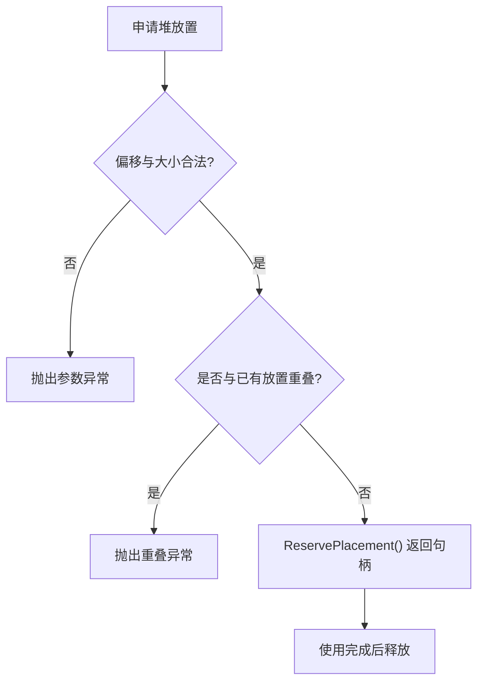
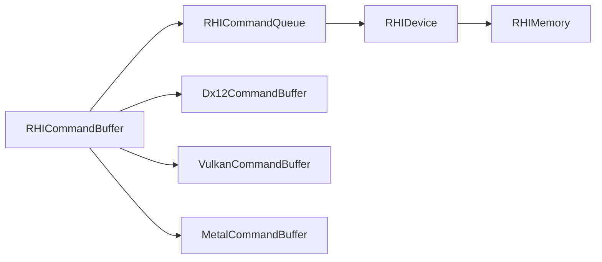

# 数据流设计

<cite>
**本文引用的文件**
- [RHICommandBuffer.cs](file://src/SharpGPU/Abstract/RHICommandBuffer.cs)
- [RHICommandQueue.cs](file://src/SharpGPU/Abstract/RHICommandQueue.cs)
- [RHIBuffer.cs](file://src/SharpGPU/Abstract/RHIBuffer.cs)
- [RHIMemory.cs](file://src/SharpGPU/Abstract/RHIMemory.cs)
- [RHIDevice.cs](file://src/SharpGPU/Abstract/RHIDevice.cs)
- [Dx12CommandBuffer.cs](file://src/SharpGPU/Dx12/Dx12CommandBuffer.cs)
- [Dx12CommandQueue.cs](file://src/SharpGPU/Dx12/Dx12CommandQueue.cs)
- [VulkanCommandBuffer.cs](file://src/SharpGPU/Vulkan/VulkanCommandBuffer.cs)
- [MetalCommandBuffer.cs](file://src/SharpGPU/Metal/MetalCommandBuffer.cs)
- [ComputeWorkload.cs](file://samples/ComputeAndDraw/ComputeWorkload.cs)
</cite>

## 目录
1. [简介](#简介)
2. [项目结构](#项目结构)
3. [核心组件](#核心组件)
4. [架构总览](#架构总览)
5. [详细组件分析](#详细组件分析)
6. [依赖关系分析](#依赖关系分析)
7. [性能考虑](#性能考虑)
8. [故障排查指南](#故障排查指南)
9. [结论](#结论)
10. [附录](#附录)

## 简介
本章节面向从应用程序到 GPU 的数据流与命令执行路径，围绕 SharpGPU 的抽象层与各后端实现（DirectX12、Vulkan、Metal）进行系统化说明。重点覆盖：
- CPU-GPU 数据传输路径与优化策略
- 命令录制与执行的完整流程
- 同步机制（栅栏、信号量、阶段屏障）
- 命令缓冲的工作方式、队列提交策略与结果获取
- 大数据量场景下的吞吐与时延优化建议

## 项目结构
SharpGPU 采用“抽象 HAL + 多后端实现”的分层组织：
- 抽象层（Abstract）：定义设备、命令缓冲、命令队列、内存、资源等统一接口与状态机
- 后端实现（Dx12 / Vulkan / Metal）：将抽象 API 映射到具体原生驱动能力
- 示例（samples）：展示典型计算与渲染工作负载的数据流用法

图表来源
- [RHICommandBuffer.cs:26-190](file://src/SharpGPU/Abstract/RHICommandBuffer.cs#L26-L190)
- [RHICommandQueue.cs:60-108](file://src/SharpGPU/Abstract/RHICommandQueue.cs#L60-L108)
- [RHIDevice.cs:422-533](file://src/SharpGPU/Abstract/RHIDevice.cs#L422-L533)

章节来源
- [RHICommandBuffer.cs:26-190](file://src/SharpGPU/Abstract/RHICommandBuffer.cs#L26-L190)
- [RHICommandQueue.cs:60-108](file://src/SharpGPU/Abstract/RHICommandQueue.cs#L60-L108)
- [RHIDevice.cs:422-533](file://src/SharpGPU/Abstract/RHIDevice.cs#L422-L533)

## 核心组件
- 命令缓冲（RHICommandBuffer）：维护录制状态机（初始/录制/可执行/已提交），管理多种编码器（传输、计算、光追、栅格、机器学习、WorkGraph）的互斥开启与结束
- 命令队列（RHICommandQueue）：负责提交描述符校验、等待/信号同步原语预留与提交、完成栅栏标记
- 设备（RHIDevice）：提供队列获取、资源创建、能力查询、时钟校准等
- 内存与堆（RHIMemory）：资源分配模式（Committed/Placed/Sparse/External）、堆放置注册、稀疏纹理绑定与预算
- 缓冲区（RHIBuffer）：CPU/GPU 访问入口（Map/Unmap）与视图创建

章节来源
- [RHICommandBuffer.cs:6-190](file://src/SharpGPU/Abstract/RHICommandBuffer.cs#L6-L190)
- [RHICommandQueue.cs:25-108](file://src/SharpGPU/Abstract/RHICommandQueue.cs#L25-L108)
- [RHIDevice.cs:422-533](file://src/SharpGPU/Abstract/RHIDevice.cs#L422-L533)
- [RHIMemory.cs:9-173](file://src/SharpGPU/Abstract/RHIMemory.cs#L9-L173)
- [RHIBuffer.cs:6-47](file://src/SharpGPU/Abstract/RHIBuffer.cs#L6-L47)

## 架构总览
下图展示了从应用层到后端的命令录制与提交路径，以及同步原语的预留/提交语义。

图表来源
- [RHICommandBuffer.cs:26-190](file://src/SharpGPU/Abstract/RHICommandBuffer.cs#L26-L190)
- [RHICommandQueue.cs:118-310](file://src/SharpGPU/Abstract/RHICommandQueue.cs#L118-L310)
- [Dx12CommandBuffer.cs:87-210](file://src/SharpGPU/Dx12/Dx12CommandBuffer.cs#L87-L210)
- [Dx12CommandQueue.cs:58-154](file://src/SharpGPU/Dx12/Dx12CommandQueue.cs#L58-L154)
- [VulkanCommandBuffer.cs:82-555](file://src/SharpGPU/Vulkan/VulkanCommandBuffer.cs#L82-L555)
- [MetalCommandBuffer.cs:50-167](file://src/SharpGPU/Metal/MetalCommandBuffer.cs#L50-L167)

## 详细组件分析

### 命令缓冲状态机与编码器生命周期
- 状态机：Initial → Recording → Executable → Submitted；非法转换会抛出异常并进入 InvalidRecording
- 编码器互斥：同一时间仅能有一个编码器处于活动状态（传输/计算/光追/栅格/机器学习/WorkGraph）
- 生命周期：Begin → Begin*Pass → ... → End*Pass → End；End 之后才可提交

图表来源
- [RHICommandBuffer.cs:6-163](file://src/SharpGPU/Abstract/RHICommandBuffer.cs#L6-L163)

章节来源
- [RHICommandBuffer.cs:36-163](file://src/SharpGPU/Abstract/RHICommandBuffer.cs#L36-L163)

### DirectX12 命令缓冲与队列
- 命令缓冲：封装 ID3D12CommandAllocator 与 ID3D12GraphicsCommandList7，Begin 时 Reset，End 时 Close；支持多种 Pass 编码器
- 队列提交：Wait → ExecuteCommandLists → Signal（Semaphore/Fence），并在异常时回滚预留的同步原语

图表来源
- [Dx12CommandBuffer.cs:87-210](file://src/SharpGPU/Dx12/Dx12CommandBuffer.cs#L87-L210)
- [Dx12CommandQueue.cs:58-154](file://src/SharpGPU/Dx12/Dx12CommandQueue.cs#L58-L154)

章节来源
- [Dx12CommandBuffer.cs:87-210](file://src/SharpGPU/Dx12/Dx12CommandBuffer.cs#L87-L210)
- [Dx12CommandQueue.cs:58-154](file://src/SharpGPU/Dx12/Dx12CommandQueue.cs#L58-L154)

### Vulkan 命令缓冲与图像布局覆盖
- 命令缓冲：使用 VkCommandPool 与 VkCommandBuffer，Begin/End 控制录制；内部维护图像布局覆盖以验证/记录子资源的布局变更
- 栅格 Pass 开始失败时，会回滚临时资源与布局状态，确保命令缓冲可安全重置

图表来源
- [VulkanCommandBuffer.cs:82-194](file://src/SharpGPU/Vulkan/VulkanCommandBuffer.cs#L82-L194)
- [VulkanCommandBuffer.cs:441-555](file://src/SharpGPU/Vulkan/VulkanCommandBuffer.cs#L441-L555)

章节来源
- [VulkanCommandBuffer.cs:82-194](file://src/SharpGPU/Vulkan/VulkanCommandBuffer.cs#L82-L194)
- [VulkanCommandBuffer.cs:441-555](file://src/SharpGPU/Vulkan/VulkanCommandBuffer.cs#L441-L555)

### Metal 命令缓冲与屏障跟踪
- 命令缓冲：封装 MTL4CommandBuffer，Begin/End 控制；内部跟踪当前编码器已见的阶段位，用于决定 intra-encoder vs cross-encoder 屏障
- ML/WorkGraph 在 Metal 后端通过能力门控暴露或拒绝

图表来源
- [MetalCommandBuffer.cs:50-167](file://src/SharpGPU/Metal/MetalCommandBuffer.cs#L50-L167)
- [MetalCommandBuffer.cs:257-301](file://src/SharpGPU/Metal/MetalCommandBuffer.cs#L257-L301)

章节来源
- [MetalCommandBuffer.cs:50-167](file://src/SharpGPU/Metal/MetalCommandBuffer.cs#L50-L167)
- [MetalCommandBuffer.cs:257-301](file://src/SharpGPU/Metal/MetalCommandBuffer.cs#L257-L301)

### 数据传输与读取回读（示例工作负载）
- 典型路径：计算着色器写入输出缓冲 → 传输 Pass 设置屏障并拷贝到 Readback 缓冲 → 队列提交并使用栅栏等待 → CPU Map 读取结果
- 该流程体现了 CPU-GPU 同步与数据回读的标准化做法

图表来源
- [ComputeWorkload.cs:116-160](file://samples/ComputeAndDraw/ComputeWorkload.cs#L116-L160)

章节来源
- [ComputeWorkload.cs:116-160](file://samples/ComputeAndDraw/ComputeWorkload.cs#L116-L160)

### 内存与堆：放置与稀疏绑定
- 放置资源：通过 RHIHeapPlacementRegistry 对堆内偏移进行冲突检测与保留，防止重叠
- 稀疏纹理：提供子资源瓦片与 mip-tail 的绑定/解绑，队列有序执行，需满足对齐与范围约束

图表来源
- [RHIMemory.cs:218-267](file://src/SharpGPU/Abstract/RHIMemory.cs#L218-L267)
- [RHIMemory.cs:353-457](file://src/SharpGPU/Abstract/RHIMemory.cs#L353-L457)

章节来源
- [RHIMemory.cs:218-267](file://src/SharpGPU/Abstract/RHIMemory.cs#L218-L267)
- [RHIMemory.cs:353-457](file://src/SharpGPU/Abstract/RHIMemory.cs#L353-L457)

## 依赖关系分析
- 命令缓冲依赖命令队列（关联与状态迁移）
- 命令队列依赖设备身份（用于校验同步原语归属）
- 各后端命令缓冲依赖各自原生对象（如 DX12 的命令列表、Vulkan 的命令池/缓冲、Metal 的 MTL4CommandBuffer）
- 内存子系统为所有资源提供统一的分配与对齐保障

图表来源
- [RHICommandBuffer.cs:26-190](file://src/SharpGPU/Abstract/RHICommandBuffer.cs#L26-L190)
- [RHICommandQueue.cs:60-108](file://src/SharpGPU/Abstract/RHICommandQueue.cs#L60-L108)
- [RHIDevice.cs:422-533](file://src/SharpGPU/Abstract/RHIDevice.cs#L422-L533)
- [RHIMemory.cs:9-173](file://src/SharpGPU/Abstract/RHIMemory.cs#L9-L173)

章节来源
- [RHICommandBuffer.cs:26-190](file://src/SharpGPU/Abstract/RHICommandBuffer.cs#L26-L190)
- [RHICommandQueue.cs:60-108](file://src/SharpGPU/Abstract/RHICommandQueue.cs#L60-L108)
- [RHIDevice.cs:422-533](file://src/SharpGPU/Abstract/RHIDevice.cs#L422-L533)
- [RHIMemory.cs:9-173](file://src/SharpGPU/Abstract/RHIMemory.cs#L9-L173)

## 性能考虑
- 批量提交与合并命令：尽量将多个命令缓冲合并提交，减少队列调用开销（参考 DX12 的 ExecuteCommandLists）
- 屏障最小化：仅在必要时插入阶段屏障，避免过度同步导致流水线停顿
- 数据局部性与缓存友好：优先使用 GPULocal 存储模式，减少跨域拷贝；合理分块大纹理/缓冲以降低带宽压力
- 异步执行模型：利用 Fence 与 Semaphore 实现 CPU/GPU 异步，避免阻塞主线程；结合多帧交错提交提升吞吐
- 传输优化：使用合适的拷贝路径（Buffer→Buffer、Texture→Texture），避免不必要的格式转换与重排
- 大数据量场景：
  - 分块处理：将大任务拆分为小块，逐批提交，降低峰值内存占用
  - 预取与重叠：在 GPU 执行当前批次时，CPU 预取下一批次数据
  - 稀疏纹理：按需激活瓦片，减少常驻显存
  - 堆放置：复用堆空间，减少碎片与分配开销

[本节为通用指导，不直接分析具体文件]

## 故障排查指南
- 命令缓冲状态错误：
  - 未 Begin 即开始编码器：检查 Begin/End 配对与编码器互斥
  - 重复提交同一命令缓冲：队列提交时会校验重复项
- 同步原语问题：
  - 等待信号量无值：后端实现会在提交前检查 LastSignaledValue
  - 信号量/栅栏归属设备不一致：队列提交时会校验 OwnerDevice
- 内存与堆：
  - 堆放置重叠：ReservePlacement 会抛出重叠异常
  - 稀疏绑定越界：ValidateSparseSpan 与 ValidateTileRange 会检查范围与对齐
- 后端特定错误：
  - DX12：命令列表关闭失败时，会尝试导出设备消息辅助定位
  - Vulkan：栅格 Pass 开始失败会回滚临时资源与布局，确保命令缓冲可重置

章节来源
- [RHICommandQueue.cs:118-242](file://src/SharpGPU/Abstract/RHICommandQueue.cs#L118-L242)
- [Dx12CommandBuffer.cs:189-210](file://src/SharpGPU/Dx12/Dx12CommandBuffer.cs#L189-L210)
- [Dx12CommandQueue.cs:58-154](file://src/SharpGPU/Dx12/Dx12CommandQueue.cs#L58-L154)
- [VulkanCommandBuffer.cs:163-194](file://src/SharpGPU/Vulkan/VulkanCommandBuffer.cs#L163-L194)
- [RHIMemory.cs:218-267](file://src/SharpGPU/Abstract/RHIMemory.cs#L218-L267)
- [RHIMemory.cs:353-457](file://src/SharpGPU/Abstract/RHIMemory.cs#L353-L457)

## 结论
SharpGPU 通过统一的抽象层与多后端实现，提供了稳定且可扩展的数据流与命令执行模型。命令缓冲的状态机与编码器互斥确保了录制的正确性；命令队列的提交流程包含严格的参数校验与同步原语预留/提交语义；内存子系统为资源分配与稀疏绑定提供了强约束与安全保障。在实际应用中，应遵循屏障最小化、批量提交、异步执行与数据局部性等原则，以获得最佳性能。

[本节为总结，不直接分析具体文件]

## 附录
- 关键术语
  - 命令缓冲：记录 GPU 命令的可执行单元
  - 命令队列：按序执行命令缓冲并协调同步原语
  - 栅栏/信号量：CPU/GPU 与 GPU/GPU 之间的同步机制
  - 阶段屏障：保证不同阶段对资源的访问顺序与可见性
  - 堆放置：在物理堆上精确分配资源地址空间
  - 稀疏纹理：按需激活瓦片，降低显存占用

[本节为概念说明，不直接分析具体文件]