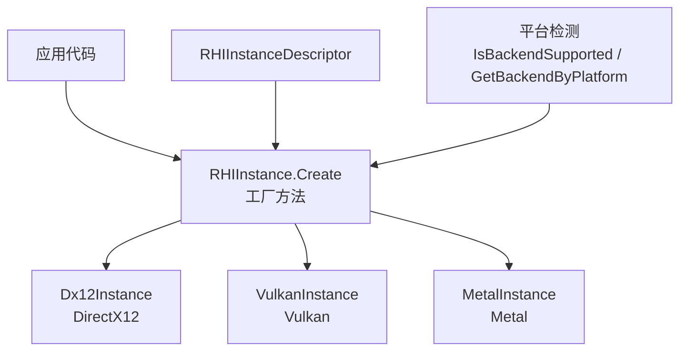
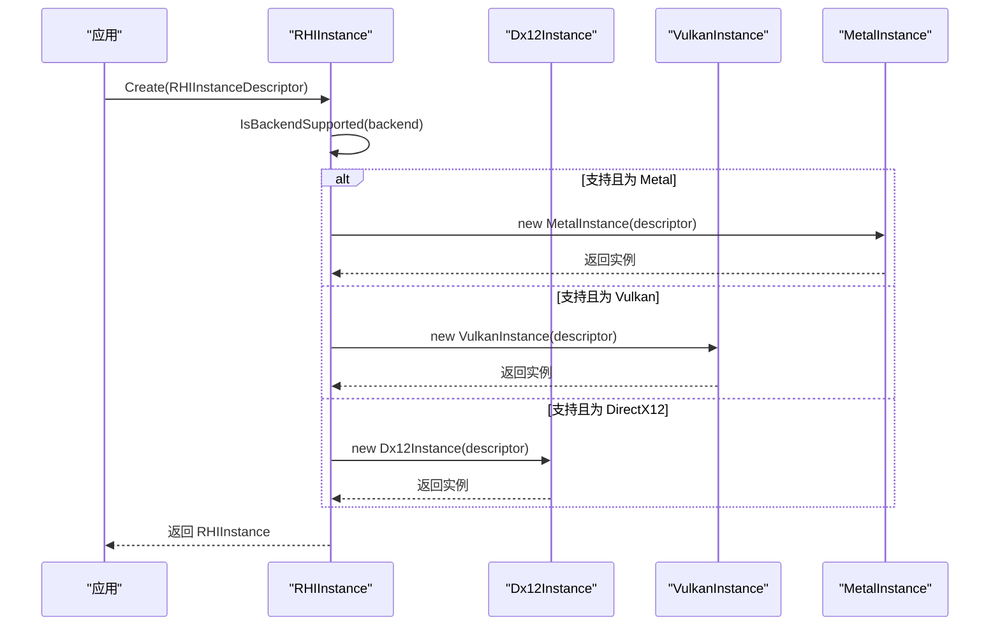
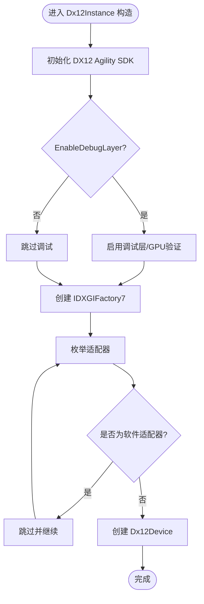
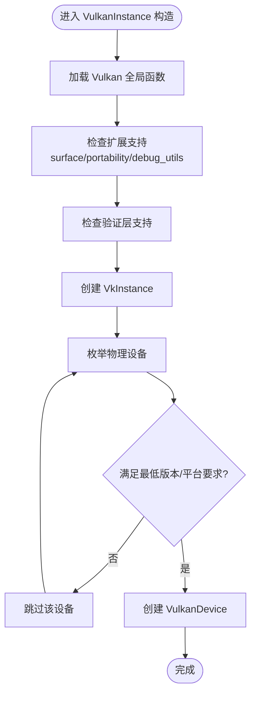
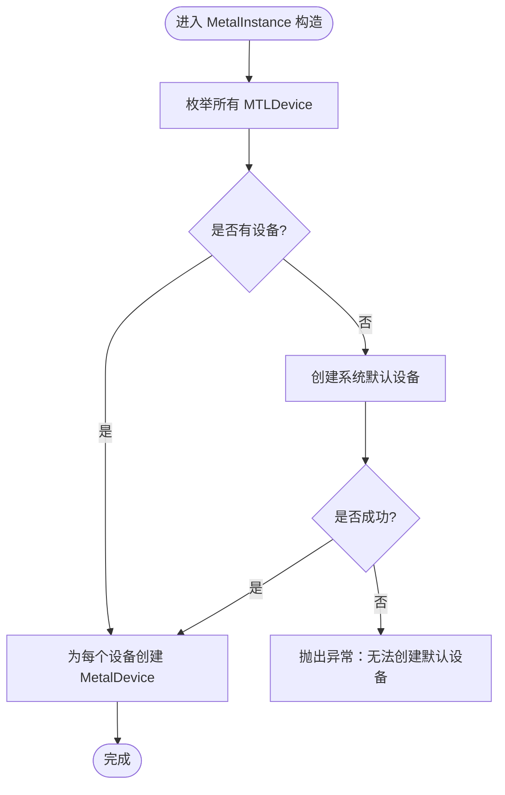
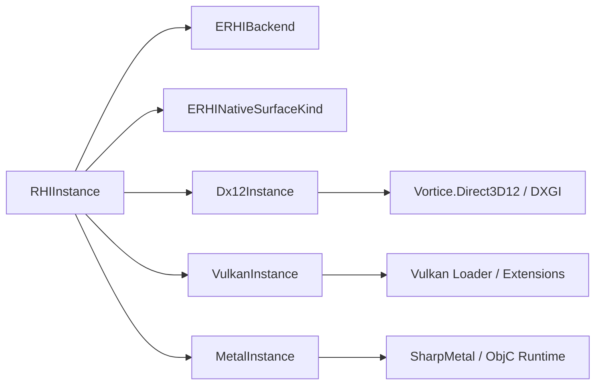

# 实例管理

<cite>
**本文引用的文件**
- [RHIInstance.cs](file://src/SharpGPU/Abstract/RHIInstance.cs)
- [Dx12Instance.cs](file://src/SharpGPU/Dx12/Dx12Instance.cs)
- [VulkanInstance.cs](file://src/SharpGPU/Vulkan/VulkanInstance.cs)
- [MetalInstance.cs](file://src/SharpGPU/Metal/MetalInstance.cs)
- [RHIUtility.cs](file://src/SharpGPU/Abstract/RHIUtility.cs)
- [RHISwapChain.cs](file://src/SharpGPU/Abstract/RHISwapChain.cs)
- [Program.cs](file://samples/ComputeAndDraw/Program.cs)
- [RasterWorkload.cs](file://samples/ComputeAndDraw/RasterWorkload.cs)
</cite>

## 目录
1. [简介](#简介)
2. [项目结构](#项目结构)
3. [核心组件](#核心组件)
4. [架构总览](#架构总览)
5. [详细组件分析](#详细组件分析)
6. [依赖关系分析](#依赖关系分析)
7. [性能考量](#性能考量)
8. [故障排查指南](#故障排查指南)
9. [结论](#结论)
10. [附录：示例与最佳实践](#附录示例与最佳实践)

## 简介
本章节聚焦 SharpGPU 的“实例管理”能力，围绕 RHIInstance 抽象类、工厂方法 Create、平台检测与后端选择机制 IsBackendSupported/GetBackendByPlatform、以及 DirectX12、Vulkan、Metal 三大后端的实例创建流程展开。文档同时说明 RHIInstanceDescriptor 配置项的作用与默认值策略、实例生命周期与资源清理策略，并给出基于示例的正确创建与配置方式。

## 项目结构
SharpGPU 将图形后端抽象为统一的 RHIInstance 接口，并通过具体实现适配不同平台 API：
- 抽象层：RHIInstance（定义统一入口、设备枚举、平台检测）
- 后端实现：
  - Dx12Instance：Windows 上的 DirectX 12 路径
  - VulkanInstance：跨平台 Vulkan 路径
  - MetalInstance：macOS/iOS 上的 Metal 路径
- 配置与枚举：
  - RHIInstanceDescriptor：实例化参数（后端、表面类型、调试/验证开关、队列请求数）
  - ERHIBackend、ERHINativeSurfaceKind：后端与原生表面类型枚举

图表来源
- [RHIInstance.cs:122-156](file://src/SharpGPU/Abstract/RHIInstance.cs#L122-L156)
- [Dx12Instance.cs:20-24](file://src/SharpGPU/Dx12/Dx12Instance.cs#L20-L24)
- [VulkanInstance.cs:74-85](file://src/SharpGPU/Vulkan/VulkanInstance.cs#L74-L85)
- [MetalInstance.cs:16-54](file://src/SharpGPU/Metal/MetalInstance.cs#L16-L54)

章节来源
- [RHIInstance.cs:6-15](file://src/SharpGPU/Abstract/RHIInstance.cs#L6-L15)
- [RHIInstance.cs:46-156](file://src/SharpGPU/Abstract/RHIInstance.cs#L46-L156)
- [RHIUtility.cs:24-30](file://src/SharpGPU/Abstract/RHIUtility.cs#L24-L30)
- [RHISwapChain.cs:20-30](file://src/SharpGPU/Abstract/RHISwapChain.cs#L20-L30)

## 核心组件
- RHIInstanceDescriptor：用于配置实例行为的关键数据结构，包含后端选择、原生表面类型、调试层与验证开关、各类队列的请求数量等。
- RHIInstance：抽象基类，提供：
  - DeviceCount：可用设备数量
  - BackendType：当前后端类型
  - GetDevice(index)：按索引获取设备
  - IsBackendSupported(backend, out reason)：平台与运行时能力检查
  - GetBackendByPlatform(forceVulkan)：根据平台自动选择后端
  - Create(descriptor)：工厂方法，根据 descriptor.Backend 创建具体后端实例
- 各后端 Instance 实现：
  - Dx12Instance：初始化 DX12 Agility SDK、创建 DXGI Factory、枚举适配器并构建设备列表
  - VulkanInstance：加载 Vulkan loader、查询扩展与层、创建 VkInstance、枚举物理设备并构建设备列表
  - MetalInstance：枚举系统 MTLDevice 或回退到默认设备，构建设备列表

章节来源
- [RHIInstance.cs:6-15](file://src/SharpGPU/Abstract/RHIInstance.cs#L6-L15)
- [RHIInstance.cs:46-156](file://src/SharpGPU/Abstract/RHIInstance.cs#L46-L156)
- [Dx12Instance.cs:20-24](file://src/SharpGPU/Dx12/Dx12Instance.cs#L20-L24)
- [VulkanInstance.cs:74-85](file://src/SharpGPU/Vulkan/VulkanInstance.cs#L74-L85)
- [MetalInstance.cs:16-54](file://src/SharpGPU/Metal/MetalInstance.cs#L16-L54)

## 架构总览
下图展示了从应用调用到具体后端实例创建的完整序列：

图表来源
- [RHIInstance.cs:122-156](file://src/SharpGPU/Abstract/RHIInstance.cs#L122-L156)
- [Dx12Instance.cs:20-24](file://src/SharpGPU/Dx12/Dx12Instance.cs#L20-L24)
- [VulkanInstance.cs:74-85](file://src/SharpGPU/Vulkan/VulkanInstance.cs#L74-L85)
- [MetalInstance.cs:16-54](file://src/SharpGPU/Metal/MetalInstance.cs#L16-L54)

## 详细组件分析

### RHIInstance 抽象类与工厂方法
- 设计模式：采用“抽象基类 + 工厂方法”模式，屏蔽后端差异，对外暴露统一接口。
- 关键方法：
  - IsBackendSupported：依据当前操作系统判断后端是否可用，并返回原因字符串。
  - GetBackendByPlatform：根据平台自动选择首选后端（Windows 默认 DirectX12；macOS/iOS 默认 Metal；Linux/Android 强制 Vulkan）。
  - Create：校验后端枚举合法性、平台支持性，然后分派到具体后端构造函数。

章节来源
- [RHIInstance.cs:59-120](file://src/SharpGPU/Abstract/RHIInstance.cs#L59-L120)
- [RHIInstance.cs:122-156](file://src/SharpGPU/Abstract/RHIInstance.cs#L122-L156)

### RHIInstanceDescriptor 配置选项与默认值
- Backend：目标后端（Metal、Vulkan、DirectX12）。未设置或非法时 Create 抛出异常。
- SurfaceKind：原生窗口/表面类型（Win32Hwnd、AppKitNsWindow、X11Window、WaylandSurface、UIKitUiWindow、AndroidNativeWindow、Headless）。影响 Vulkan 扩展启用与平台特定逻辑。
- EnableDebugLayer：是否启用调试层（DirectX12 通过 Agility SDK 开启；Vulkan 通过 debug_utils 扩展）。
- EnableValidation：是否启用验证层/验证（DirectX12 GPU 验证；Vulkan 启用 Khronos 验证层）。
- ComputeQueueRequestCount / TransferQueueRequestCount / GraphicsQueueRequestCount：向底层请求的队列数量，供后端设备创建时使用。

注意：上述字段均为结构体字段，无显式默认值，使用 C# 结构体默认零值/空值语义。实际行为由后端在构造时读取这些字段。

章节来源
- [RHIInstance.cs:6-15](file://src/SharpGPU/Abstract/RHIInstance.cs#L6-L15)
- [RHISwapChain.cs:20-30](file://src/SharpGPU/Abstract/RHISwapChain.cs#L20-L30)

### 平台检测与后端选择机制
- IsBackendSupported：
  - DirectX12：仅在 Windows 上支持。
  - Metal：仅在 macOS/iOS 上支持。
  - Vulkan：在非未知平台下可评估；若平台识别失败则不可用。
- GetBackendByPlatform：
  - Windows：默认 DirectX12（除非强制 Vulkan）。
  - macOS/iOS：默认 Metal（除非强制 Vulkan）。
  - Linux/Android：强制 Vulkan。

该机制确保在不同平台上以最优后端启动，并在不支持时给出明确错误信息。

章节来源
- [RHIInstance.cs:59-120](file://src/SharpGPU/Abstract/RHIInstance.cs#L59-L120)

### DirectX12 实例创建流程
- 初始化 DX12 Agility SDK：
  - 通过 ID3D12SDKConfiguration1 创建设备工厂，定位 D3D12Core.dll。
  - 若启用调试层，获取 Debug 接口并启用调试层；若启用验证，进一步启用 GPU 验证。
- 创建 DXGI Factory：
  - 根据调试标志创建 IDXGIFactory7。
- 枚举适配器：
  - 遍历所有适配器，跳过软件适配器，为每个硬件适配器创建 Dx12Device。
- 设备访问：
  - 通过 GetDevice(index) 安全访问已枚举的设备。

图表来源
- [Dx12Instance.cs:26-76](file://src/SharpGPU/Dx12/Dx12Instance.cs#L26-L76)
- [Dx12Instance.cs:78-106](file://src/SharpGPU/Dx12/Dx12Instance.cs#L78-L106)
- [Dx12Instance.cs:155-232](file://src/SharpGPU/Dx12/Dx12Instance.cs#L155-L232)

章节来源
- [Dx12Instance.cs:20-130](file://src/SharpGPU/Dx12/Dx12Instance.cs#L20-L130)

### Vulkan 实例创建流程
- 全局函数加载：
  - 动态加载 Vulkan loader 并缓存 vkGetInstanceProcAddr 等关键函数指针。
- 扩展与层检查：
  - 根据 SurfaceKind 决定必需扩展（如 VK_KHR_surface、平台特定 surface 扩展）。
  - 若启用验证，要求 VK_EXT_debug_utils 并尝试启用 Khronos 验证层。
- 创建 VkInstance：
  - 组装 VkApplicationInfo 与 VkInstanceCreateInfo，启用所需扩展与层。
  - 可选附加调试消息回调（debug utils）。
- 枚举物理设备：
  - 查询物理设备数量与属性，过滤不满足最低版本要求的设备（例如 Android 要求 Vulkan 1.1+）。
  - 为每个有效物理设备创建 VulkanDevice。

图表来源
- [VulkanInstance.cs:127-198](file://src/SharpGPU/Vulkan/VulkanInstance.cs#L127-L198)
- [VulkanInstance.cs:200-230](file://src/SharpGPU/Vulkan/VulkanInstance.cs#L200-L230)
- [VulkanInstance.cs:232-380](file://src/SharpGPU/Vulkan/VulkanInstance.cs#L232-L380)
- [VulkanInstance.cs:382-418](file://src/SharpGPU/Vulkan/VulkanInstance.cs#L382-L418)

章节来源
- [VulkanInstance.cs:74-418](file://src/SharpGPU/Vulkan/VulkanInstance.cs#L74-L418)

### Metal 实例创建流程
- 设备枚举：
  - 尝试枚举所有 MTLDevice；若无设备，则创建系统默认设备。
  - 对每个可用设备创建 MetalDevice。
- 回退策略：
  - 若枚举为空且无法创建默认设备，抛出异常。
- 设备访问：
  - 通过 GetDevice(index) 安全访问已枚举的设备。

图表来源
- [MetalInstance.cs:16-54](file://src/SharpGPU/Metal/MetalInstance.cs#L16-L54)

章节来源
- [MetalInstance.cs:16-77](file://src/SharpGPU/Metal/MetalInstance.cs#L16-L77)

### 实例生命周期管理与资源清理策略
- 基类 Disposal：
  - RHIInstance 继承自 Disposal，遵循 RAII 风格的生命周期管理。
- 释放顺序：
  - 先释放所有设备（Dispose），再释放后端特定的全局资源（如 DXGI Factory、VkInstance、验证诊断对象）。
- 异常安全：
  - 在各后端构造过程中，若中间步骤失败，会释放已分配的资源并抛出异常，避免泄漏。

章节来源
- [Dx12Instance.cs:122-130](file://src/SharpGPU/Dx12/Dx12Instance.cs#L122-L130)
- [VulkanInstance.cs:668-679](file://src/SharpGPU/Vulkan/VulkanInstance.cs#L668-L679)
- [MetalInstance.cs:70-76](file://src/SharpGPU/Metal/MetalInstance.cs#L70-L76)

## 依赖关系分析
- RHIInstance 依赖：
  - 枚举类型：ERHIBackend（后端）、ERHINativeSurfaceKind（表面类型）
  - 平台 API：OperatingSystem 检测、各后端 SDK/loader
- 后端实现依赖：
  - Dx12Instance：Vortice.Direct3D12、DXGI、Agility SDK
  - VulkanInstance：Vulkan loader、扩展与层枚举、平台特定 surface 扩展
  - MetalInstance：SharpMetal 绑定、Objective-C runtime

图表来源
- [RHIInstance.cs:46-156](file://src/SharpGPU/Abstract/RHIInstance.cs#L46-L156)
- [RHIUtility.cs:24-30](file://src/SharpGPU/Abstract/RHIUtility.cs#L24-L30)
- [RHISwapChain.cs:20-30](file://src/SharpGPU/Abstract/RHISwapChain.cs#L20-L30)
- [Dx12Instance.cs:1-24](file://src/SharpGPU/Dx12/Dx12Instance.cs#L1-L24)
- [VulkanInstance.cs:1-35](file://src/SharpGPU/Vulkan/VulkanInstance.cs#L1-L35)
- [MetalInstance.cs:1-15](file://src/SharpGPU/Metal/MetalInstance.cs#L1-L15)

章节来源
- [RHIInstance.cs:46-156](file://src/SharpGPU/Abstract/RHIInstance.cs#L46-L156)
- [RHIUtility.cs:24-30](file://src/SharpGPU/Abstract/RHIUtility.cs#L24-L30)
- [RHISwapChain.cs:20-30](file://src/SharpGPU/Abstract/RHISwapChain.cs#L20-L30)

## 性能考量
- 队列请求数：
  - ComputeQueueRequestCount、TransferQueueRequestCount、GraphicsQueueRequestCount 直接影响并发能力与资源占用。应根据工作负载合理设置，避免过多队列导致上下文切换开销。
- 调试与验证：
  - EnableDebugLayer 与 EnableValidation 会引入额外开销，建议仅在开发与诊断阶段启用。
- 设备枚举：
  - 跳过软件适配器（DX12）与不满足最低版本的设备（Vulkan on Android）可减少无效设备带来的初始化成本。

[本节为通用指导，不直接分析具体文件]

## 故障排查指南
- 平台不支持：
  - 若 IsBackendSupported 返回 false，请检查当前平台与所选后端是否匹配，并根据 reason 调整后端选择。
- 后端未编译：
  - DirectX12 在某些构建中可能未启用（条件编译 SHARPGPU_ENABLE_DX12），此时 Create 会抛出“未编译进此构建”的异常。
- 调试层不可用：
  - DX12 调试层需要 Agility SDK 正确配置；若失败，检查 D3D12Core.dll 是否存在于输出目录。
- Vulkan 验证层缺失：
  - 启用 EnableValidation 但缺少 VK_LAYER_KHRONOS_validation 时会抛出异常，需安装或外部注入验证层。
- 设备枚举失败：
  - 若没有可用设备（如 Metal 无法创建默认设备），将抛出相应异常，检查系统驱动与权限。

章节来源
- [RHIInstance.cs:122-156](file://src/SharpGPU/Abstract/RHIInstance.cs#L122-L156)
- [Dx12Instance.cs:26-76](file://src/SharpGPU/Dx12/Dx12Instance.cs#L26-L76)
- [VulkanInstance.cs:200-230](file://src/SharpGPU/Vulkan/VulkanInstance.cs#L200-L230)
- [MetalInstance.cs:16-54](file://src/SharpGPU/Metal/MetalInstance.cs#L16-L54)

## 结论
SharpGPU 通过 RHIInstance 抽象与工厂方法，实现了跨平台的图形后端统一管理。RHIInstanceDescriptor 提供了灵活的配置入口，平台检测与后端选择机制确保了在不同环境下的最佳实践。各后端实例在创建过程中严格进行能力检查与资源管理，保障稳定性与可维护性。结合示例代码，开发者可以便捷地创建和配置实例，并在不同后端间切换。

[本节为总结，不直接分析具体文件]

## 附录：示例与最佳实践
- 基本用法：
  - 使用 RHIInstance.Create 传入 RHIInstanceDescriptor，指定 Backend 与必要的 SurfaceKind。
  - 通过 instance.GetDevice(0) 获取首个设备，并继续创建命令队列、管线等资源。
- 示例参考：
  - 计算与栅格化示例程序演示了如何遍历后端并运行对应负载。
  - 栅格化负载中展示了 Headless 模式下创建实例与执行绘制的基本流程。

章节来源
- [Program.cs:7-15](file://samples/ComputeAndDraw/Program.cs#L7-L15)
- [RasterWorkload.cs:37-45](file://samples/ComputeAndDraw/RasterWorkload.cs#L37-L45)