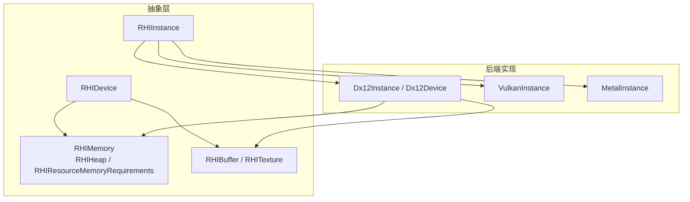
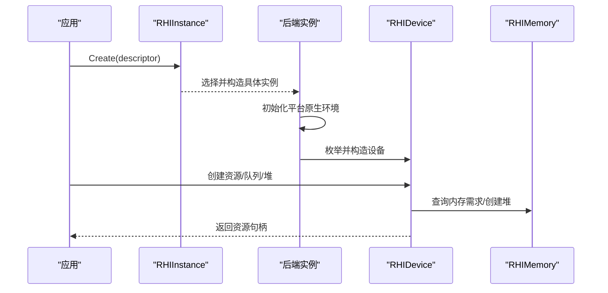
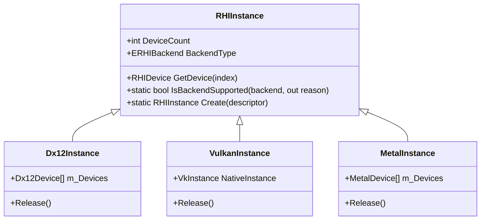
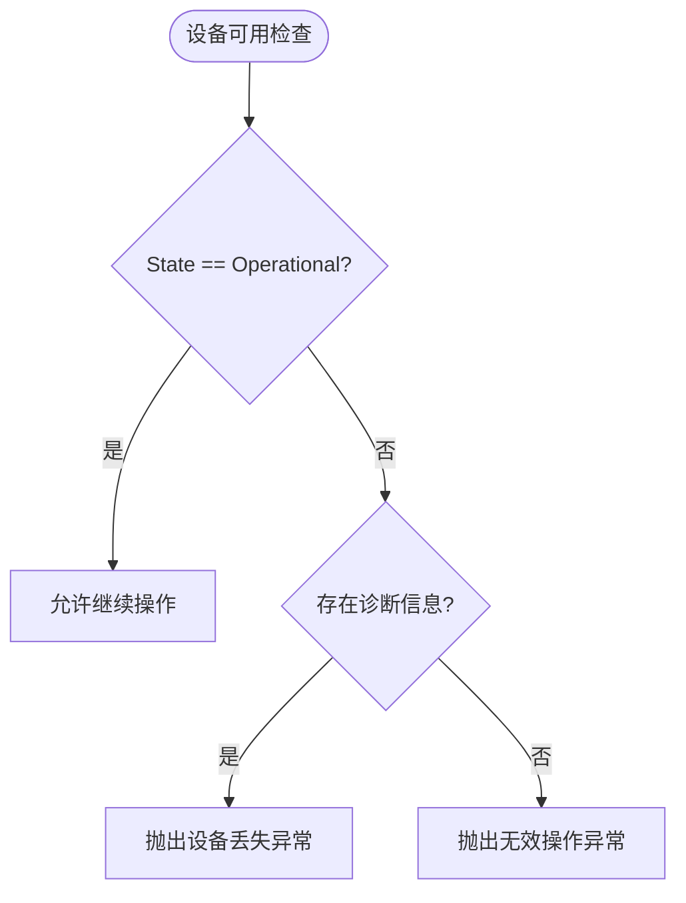
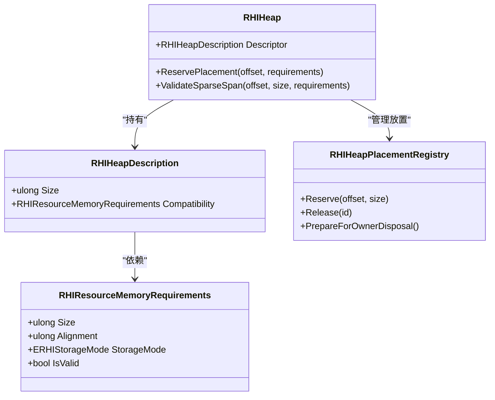
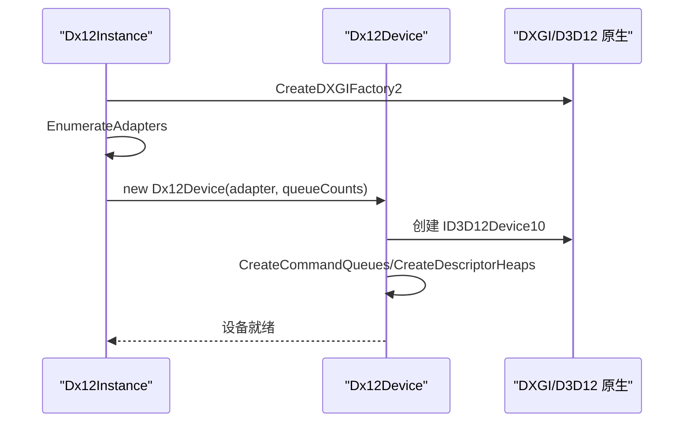
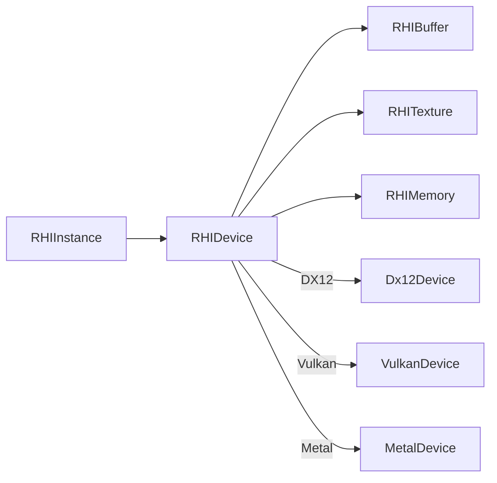

# 核心组件关系

<cite>
**本文引用的文件**
- [RHIInstance.cs](file://src/SharpGPU/Abstract/RHIInstance.cs)
- [RHIDevice.cs](file://src/SharpGPU/Abstract/RHIDevice.cs)
- [RHIMemory.cs](file://src/SharpGPU/Abstract/RHIMemory.cs)
- [Dx12Instance.cs](file://src/SharpGPU/Dx12/Dx12Instance.cs)
- [Dx12Device.cs](file://src/SharpGPU/Dx12/Dx12Device.cs)
- [VulkanInstance.cs](file://src/SharpGPU/Vulkan/VulkanInstance.cs)
- [MetalInstance.cs](file://src/SharpGPU/Metal/MetalInstance.cs)
- [RHIBuffer.cs](file://src/SharpGPU/Abstract/RHIBuffer.cs)
- [RHITexture.cs](file://src/SharpGPU/Abstract/RHITexture.cs)
</cite>

## 目录
1. [简介](#简介)
2. [项目结构](#项目结构)
3. [核心组件](#核心组件)
4. [架构总览](#架构总览)
5. [详细组件分析](#详细组件分析)
6. [依赖关系分析](#依赖关系分析)
7. [性能考量](#性能考量)
8. [故障排查指南](#故障排查指南)
9. [结论](#结论)

## 简介
本章节聚焦 SharpGPU 的 RHI（渲染硬件抽象）层核心组件关系，围绕 RHIInstance、RHIDevice、资源管理（内存堆与放置资源）等关键对象，说明其职责、生命周期、依赖注入与工厂模式的应用，并解释设备创建流程、资源管理策略与内存分配机制。文档同时给出组件关系图，展示对象间的关联与消息传递，并说明设计如何支持多线程访问与安全释放。

## 项目结构
SharpGPU 采用“抽象接口 + 多后端实现”的分层结构：
- Abstract 层定义跨后端的统一接口与数据结构（实例、设备、资源、内存等）。
- Dx12、Vulkan、Metal 三个后端分别实现具体平台能力与原生交互。
- 资源类型（Buffer、Texture）在抽象层定义语义，在各后端提供具体实现。

图表来源
- [RHIInstance.cs:46-156](file://src/SharpGPU/Abstract/RHIInstance.cs#L46-L156)
- [RHIDevice.cs:422-553](file://src/SharpGPU/Abstract/RHIDevice.cs#L422-L553)
- [RHIMemory.cs:173-333](file://src/SharpGPU/Abstract/RHIMemory.cs#L173-L333)
- [Dx12Instance.cs:9-130](file://src/SharpGPU/Dx12/Dx12Instance.cs#L9-L130)
- [Dx12Device.cs:48-158](file://src/SharpGPU/Dx12/Dx12Device.cs#L48-L158)
- [VulkanInstance.cs:9-85](file://src/SharpGPU/Vulkan/VulkanInstance.cs#L9-L85)
- [MetalInstance.cs:9-54](file://src/SharpGPU/Metal/MetalInstance.cs#L9-L54)

章节来源
- [RHIInstance.cs:46-156](file://src/SharpGPU/Abstract/RHIInstance.cs#L46-L156)
- [RHIDevice.cs:422-553](file://src/SharpGPU/Abstract/RHIDevice.cs#L422-L553)
- [RHIMemory.cs:173-333](file://src/SharpGPU/Abstract/RHIMemory.cs#L173-L333)
- [Dx12Instance.cs:9-130](file://src/SharpGPU/Dx12/Dx12Instance.cs#L9-L130)
- [Dx12Device.cs:48-158](file://src/SharpGPU/Dx12/Dx12Device.cs#L48-L158)
- [VulkanInstance.cs:9-85](file://src/SharpGPU/Vulkan/VulkanInstance.cs#L9-L85)
- [MetalInstance.cs:9-54](file://src/SharpGPU/Metal/MetalInstance.cs#L9-L54)

## 核心组件
- RHIInstance：后端入口，负责按平台选择并创建具体实例，枚举设备，暴露 GetDevice(index)。
- RHIDevice：设备抽象，负责创建命令队列、交换链、同步原语、查询、堆与资源（Buffer/Texture），并提供能力查询与状态管理。
- RHIMemory：内存抽象，定义资源内存需求、堆（Heap）、放置资源（Placed Resources）与稀疏纹理绑定等。
- RHIBuffer / RHITexture：资源抽象，描述资源属性、分配模式与视图创建；各后端实现具体映射与绑定。

章节来源
- [RHIInstance.cs:46-156](file://src/SharpGPU/Abstract/RHIInstance.cs#L46-L156)
- [RHIDevice.cs:422-601](file://src/SharpGPU/Abstract/RHIDevice.cs#L422-L601)
- [RHIMemory.cs:23-116](file://src/SharpGPU/Abstract/RHIMemory.cs#L23-L116)
- [RHIBuffer.cs:6-47](file://src/SharpGPU/Abstract/RHIBuffer.cs#L6-L47)
- [RHITexture.cs:39-127](file://src/SharpGPU/Abstract/RHITexture.cs#L39-L127)

## 架构总览
SharpGPU 通过工厂模式在运行时选择后端，并通过依赖注入将后端实例传递给设备构造器，形成清晰的层次化依赖：
- 应用调用 RHIInstance.Create(descriptor)，内部根据后端类型返回 Metal/Vulkan/Dx12 实例。
- 后端实例枚举物理设备并构造对应 Device。
- Device 负责资源与队列的生命周期，向上提供统一的 API。

图表来源
- [RHIInstance.cs:122-156](file://src/SharpGPU/Abstract/RHIInstance.cs#L122-L156)
- [Dx12Instance.cs:20-130](file://src/SharpGPU/Dx12/Dx12Instance.cs#L20-L130)
- [VulkanInstance.cs:74-85](file://src/SharpGPU/Vulkan/VulkanInstance.cs#L74-L85)
- [MetalInstance.cs:16-54](file://src/SharpGPU/Metal/MetalInstance.cs#L16-L54)
- [RHIDevice.cs:527-553](file://src/SharpGPU/Abstract/RHIDevice.cs#L527-L553)
- [RHIMemory.cs:173-333](file://src/SharpGPU/Abstract/RHIMemory.cs#L173-L333)

## 详细组件分析

### RHIInstance：后端工厂与设备枚举
- 职责：
  - 提供 Create(descriptor) 工厂方法，依据 ERHIBackend 选择具体后端实例。
  - 提供 IsBackendSupported 与 GetBackendByPlatform 进行平台能力判断与默认后端选择。
  - 暴露 DeviceCount 与 GetDevice(index) 获取设备列表中的设备。
- 生命周期：
  - 构造时完成后端初始化与设备枚举。
  - 释放时依次销毁所有设备与原生资源。
- 线程安全：
  - 设备枚举与获取在构造阶段完成，GetDevice 仅做索引校验与返回。

图表来源
- [RHIInstance.cs:46-156](file://src/SharpGPU/Abstract/RHIInstance.cs#L46-L156)
- [Dx12Instance.cs:9-130](file://src/SharpGPU/Dx12/Dx12Instance.cs#L9-L130)
- [VulkanInstance.cs:9-85](file://src/SharpGPU/Vulkan/VulkanInstance.cs#L9-L85)
- [MetalInstance.cs:9-54](file://src/SharpGPU/Metal/MetalInstance.cs#L9-L54)

章节来源
- [RHIInstance.cs:46-156](file://src/SharpGPU/Abstract/RHIInstance.cs#L46-L156)
- [Dx12Instance.cs:20-130](file://src/SharpGPU/Dx12/Dx12Instance.cs#L20-L130)
- [VulkanInstance.cs:74-85](file://src/SharpGPU/Vulkan/VulkanInstance.cs#L74-L85)
- [MetalInstance.cs:16-54](file://src/SharpGPU/Metal/MetalInstance.cs#L16-L54)

### RHIDevice：设备能力、资源与队列管理
- 职责：
  - 提供 GetCommandQueue、CreateSwapChain、CreateFence、CreateSemaphore、CreateStorageQueue、CreateQuery、CreateHeap、CreateBuffer、CreateTexture 等工厂方法。
  - 提供 QueryRasterAttachmentSupport、QueryFormatSupport、QueryResolveSupport 等能力查询。
  - 维护设备状态（Operational/Lost/Removed/Reset）与诊断信息。
- 生命周期：
  - 构造时完成原生设备创建、DirectML 对象、特性检查、命令队列与描述符堆创建。
  - 释放时由后端实现清理原生资源。
- 线程安全：
  - 设备状态使用 Volatile 读写，MarkDeviceLost 与 ThrowIfDeviceUnavailable 通过锁保护状态转换。

图表来源
- [RHIDevice.cs:465-525](file://src/SharpGPU/Abstract/RHIDevice.cs#L465-L525)

章节来源
- [RHIDevice.cs:422-601](file://src/SharpGPU/Abstract/RHIDevice.cs#L422-L601)
- [Dx12Device.cs:137-158](file://src/SharpGPU/Dx12/Dx12Device.cs#L137-L158)

### 资源管理：内存需求、堆与放置资源
- 资源内存需求（RHIResourceMemoryRequirements）：
  - 封装 Size、Alignment、StorageMode 及兼容性掩码，确保跨后端一致的资源大小与对齐。
  - 构造函数严格校验 size、alignment 为 2 的幂次且非零，以及兼容性掩码有效。
- 堆（RHIHeap）：
  - 持有 RHIHeapDescription，包含 Size 与 Compatibility。
  - 提供 ReservePlacement(offset, requirements) 以在堆内预留连续地址区间，防止重叠与越界。
  - 支持 ValidateSparseSpan 对稀疏纹理映射进行范围与对齐校验。
- 放置资源（Placed Resources）：
  - 通过设备 CreatePlacedBuffer(heap, heapOffset, descriptor) 在指定堆偏移处创建 Buffer。
  - 使用 RHIHeapPlacementRegistry 跟踪已预留区间，并在堆释放前检查是否仍有活动引用。

图表来源
- [RHIMemory.cs:23-116](file://src/SharpGPU/Abstract/RHIMemory.cs#L23-L116)
- [RHIMemory.cs:173-333](file://src/SharpGPU/Abstract/RHIMemory.cs#L173-L333)
- [RHIMemory.cs:353-457](file://src/SharpGPU/Abstract/RHIMemory.cs#L353-L457)

章节来源
- [RHIMemory.cs:23-116](file://src/SharpGPU/Abstract/RHIMemory.cs#L23-L116)
- [RHIMemory.cs:173-333](file://src/SharpGPU/Abstract/RHIMemory.cs#L173-L333)
- [RHIMemory.cs:353-457](file://src/SharpGPU/Abstract/RHIMemory.cs#L353-L457)

### 资源类型：Buffer 与 Texture
- RHIBuffer：
  - 描述 ByteSize、Format、UsageFlag、StorageMode。
  - 提供 Map/UnMap 与 CreateBufferView 抽象接口，供后端实现 CPU/GPU 映射与视图绑定。
- RHITexture：
  - 描述 MipCount、Extent、Format、SampleCount、StorageMode、UsageFlag、Dimension。
  - 支持采样反馈贴图（Sampler Feedback Map）的配对与模式配置。
  - 提供 CreateTextureView 抽象接口。

章节来源
- [RHIBuffer.cs:6-47](file://src/SharpGPU/Abstract/RHIBuffer.cs#L6-L47)
- [RHITexture.cs:39-127](file://src/SharpGPU/Abstract/RHITexture.cs#L39-L127)

### 后端设备创建流程（以 DX12 为例）
- 步骤：
  - 创建 DXGI Factory，配置 Debug/Validation。
  - 枚举适配器，跳过软件适配器，构造 Dx12Device。
  - 设备构造中创建原生设备、DirectML 对象、特性检查、命令队列、描述符堆与命令签名。
- 关键点：
  - 设备能力通过 CheckFeatureSupport 探测。
  - 资源创建前进行可用性检查（如 PlacedResources、SamplerFeedback）。

图表来源
- [Dx12Instance.cs:20-130](file://src/SharpGPU/Dx12/Dx12Instance.cs#L20-L130)
- [Dx12Device.cs:137-158](file://src/SharpGPU/Dx12/Dx12Device.cs#L137-L158)

章节来源
- [Dx12Instance.cs:20-130](file://src/SharpGPU/Dx12/Dx12Instance.cs#L20-L130)
- [Dx12Device.cs:137-158](file://src/SharpGPU/Dx12/Dx12Device.cs#L137-L158)

### 依赖注入与工厂模式
- 工厂模式：
  - RHIInstance.Create 根据后端类型返回具体实例，屏蔽平台差异。
- 依赖注入：
  - 后端实例在构造设备时注入（例如 Dx12Device 持有 Dx12Instance 引用），使设备能访问后端特定能力与原生对象。
- 优势：
  - 高层代码无需感知后端细节，便于扩展新后端与测试替换。

章节来源
- [RHIInstance.cs:122-156](file://src/SharpGPU/Abstract/RHIInstance.cs#L122-L156)
- [Dx12Device.cs:48-158](file://src/SharpGPU/Dx12/Dx12Device.cs#L48-L158)

## 依赖关系分析
- 耦合与内聚：
  - RHIInstance 与后端实例强耦合（通过继承），但对外保持统一接口。
  - RHIDevice 与资源类型（Buffer/Texture）解耦，通过抽象接口创建与使用。
  - RHIMemory 作为独立模块，被设备与资源共同依赖，提升复用性。
- 直接/间接依赖：
  - 设备依赖内存模块进行资源分配；资源依赖设备创建；实例依赖设备枚举。
- 外部依赖：
  - DX12 依赖 Vortice.Direct3D12 与 DXGI。
  - Vulkan 依赖 Vortice.Vulkan 与动态加载的 vkGetInstanceProcAddr。
  - Metal 依赖 SharpMetal 与 Objective-C 运行时。

图表来源
- [RHIDevice.cs:527-553](file://src/SharpGPU/Abstract/RHIDevice.cs#L527-L553)
- [RHIMemory.cs:173-333](file://src/SharpGPU/Abstract/RHIMemory.cs#L173-L333)
- [Dx12Device.cs:180-303](file://src/SharpGPU/Dx12/Dx12Device.cs#L180-L303)

章节来源
- [RHIDevice.cs:527-553](file://src/SharpGPU/Abstract/RHIDevice.cs#L527-L553)
- [RHIMemory.cs:173-333](file://src/SharpGPU/Abstract/RHIMemory.cs#L173-L333)
- [Dx12Device.cs:180-303](file://src/SharpGPU/Dx12/Dx12Device.cs#L180-L303)

## 性能考量
- 内存对齐与块分配：
  - 通过 RHIResourceMemoryRequirements 的 Alignment 保证 GPU 高效访问。
  - 堆内放置资源避免碎片，提高带宽利用率。
- 能力查询优化：
  - 设备在构造时缓存能力结果，减少重复查询开销。
- 命令队列与资源分离：
  - 不同管线类型的队列分离，降低同步复杂度。
- 调试与验证：
  - 可选启用 Debug Layer 与 Validation，便于定位性能瓶颈与错误。

[本节为通用指导，不直接分析具体文件]

## 故障排查指南
- 设备丢失处理：
  - MarkDeviceLost 要求诊断信息携带 Lost/Removed/Reset 状态，并更新设备状态。
  - ThrowIfDeviceUnavailable 在设备不可用时抛出诊断异常或无效操作异常。
- 堆释放保护：
  - PrepareForOwnerDisposal 在堆释放前检查是否有活动放置资源，防止悬空引用。
- 资源创建校验：
  - 资源内存需求与堆兼容性必须匹配，否则抛出参数异常。
  - 纹理用途与格式需满足后端能力，否则能力查询返回不可用。

章节来源
- [RHIDevice.cs:465-525](file://src/SharpGPU/Abstract/RHIDevice.cs#L465-L525)
- [RHIMemory.cs:329-333](file://src/SharpGPU/Abstract/RHIMemory.cs#L329-L333)
- [RHIMemory.cs:375-457](file://src/SharpGPU/Abstract/RHIMemory.cs#L375-L457)

## 结论
SharpGPU 通过 RHIInstance 工厂与后端实例枚举，结合 RHIDevice 的统一设备接口与 RHIMemory 的内存抽象，构建了清晰、可扩展且安全的图形抽象层。依赖注入与工厂模式降低了后端耦合，提升了可测试性与可移植性。资源管理策略通过严格的内存需求与堆放置控制，确保多线程环境下的资源安全释放与高效利用。整体设计兼顾了性能、可维护性与跨平台能力。