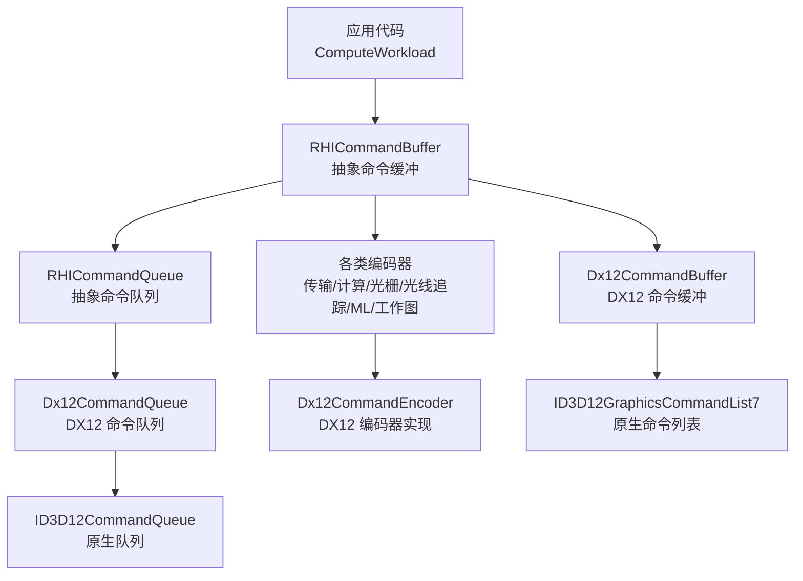
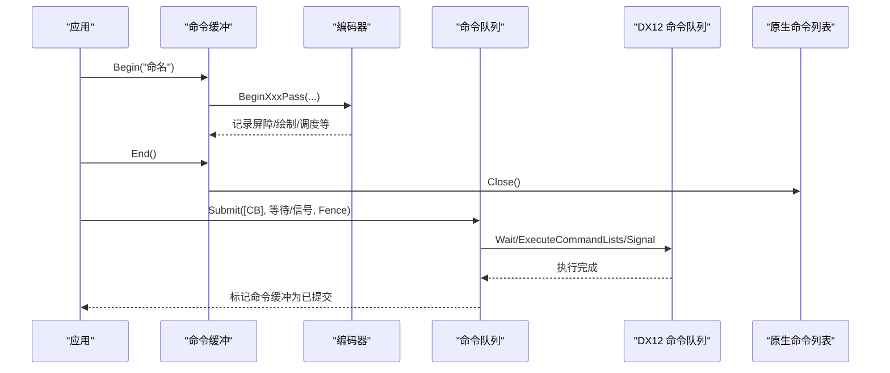
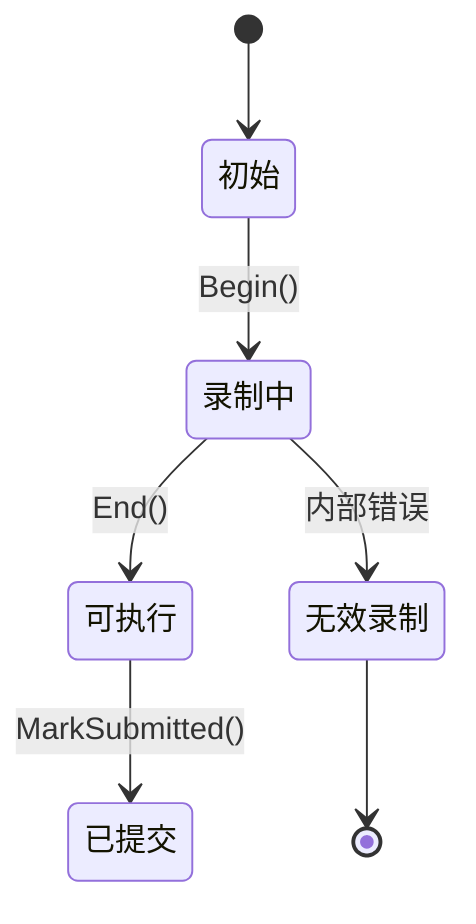
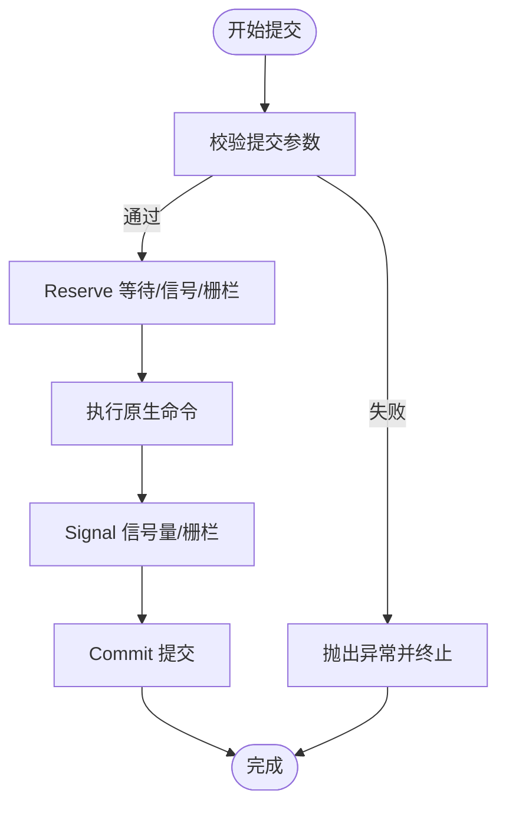
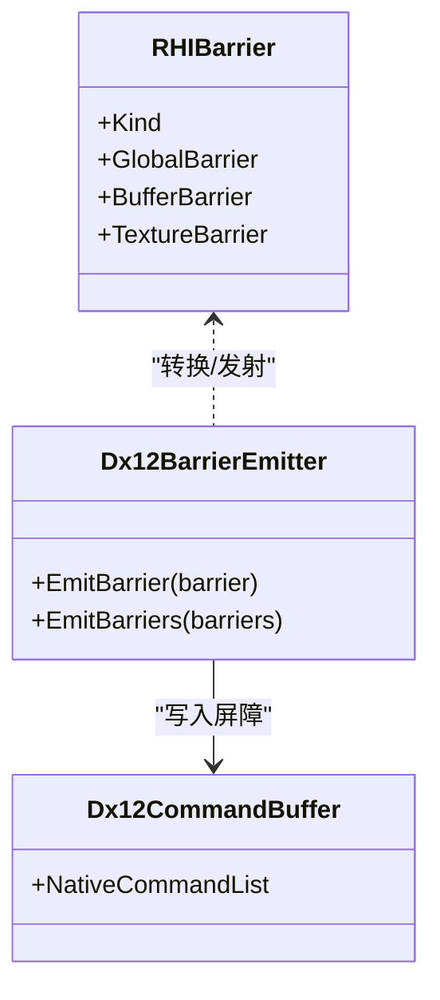
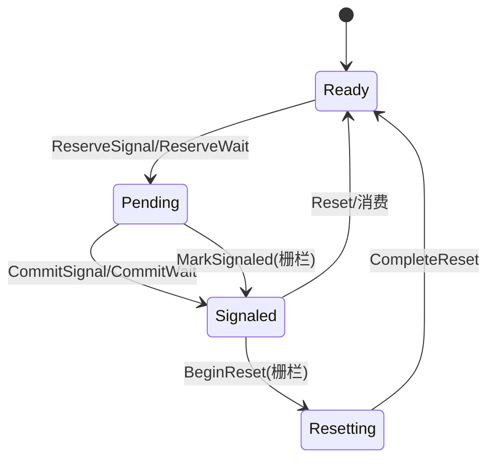
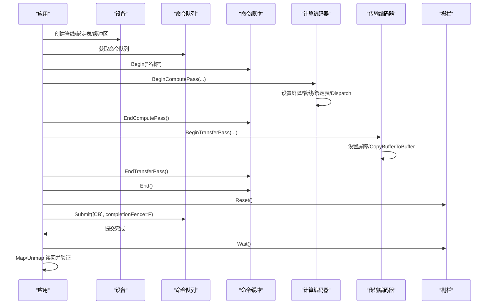
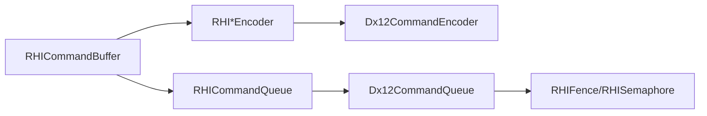

# 组件通信

<cite>
**本文引用的文件**
- [RHICommandBuffer.cs](file://src/SharpGPU/Abstract/RHICommandBuffer.cs)
- [RHICommandQueue.cs](file://src/SharpGPU/Abstract/RHICommandQueue.cs)
- [RHICommandEncoder.cs](file://src/SharpGPU/Abstract/RHICommandEncoder.cs)
- [RHISynchronous.cs](file://src/SharpGPU/Abstract/RHISynchronous.cs)
- [Dx12CommandBuffer.cs](file://src/SharpGPU/Dx12/Dx12CommandBuffer.cs)
- [Dx12CommandQueue.cs](file://src/SharpGPU/Dx12/Dx12CommandQueue.cs)
- [Dx12CommandEncoder.cs](file://src/SharpGPU/Dx12/Dx12CommandEncoder.cs)
- [RHICommandBufferScopes.cs](file://src/SharpGPU/Common/Scopes/RHICommandBufferScopes.cs)
- [ComputeWorkload.cs](file://samples/ComputeAndDraw/ComputeWorkload.cs)
</cite>

## 目录
1. [简介](#简介)
2. [项目结构](#项目结构)
3. [核心组件](#核心组件)
4. [架构总览](#架构总览)
5. [详细组件分析](#详细组件分析)
6. [依赖关系分析](#依赖关系分析)
7. [性能考虑](#性能考虑)
8. [故障排查指南](#故障排查指南)
9. [结论](#结论)
10. [附录](#附录)

## 简介
本章节聚焦 SharpGPU 中命令缓冲、命令队列与编码器之间的通信机制，系统阐述命令录制、提交与执行的生命周期；说明异步执行模型与同步原语（信号量、栅栏）的使用；描述组件间的消息传递模式与事件处理机制；解释多线程环境下的通信安全与数据一致性保证；并给出命令批处理优化、延迟提交策略以及调试命令流与分析性能瓶颈的方法。

## 项目结构
SharpGPU 采用抽象 RHI 层与后端实现分离的架构：
- 抽象层定义命令缓冲、命令队列、编码器、同步原语等接口与状态机。
- 后端实现（以 DirectX 12 为例）将抽象 API 映射到原生命令列表、命令队列、资源屏障与同步对象。
- 作用域辅助类型提供 RAII 风格的命令缓冲与 Pass 生命周期管理。
- 示例工程演示了从设备初始化、命令录制、提交到读取结果的完整流程。

图表来源
- [RHICommandBuffer.cs:26-190](file://src/SharpGPU/Abstract/RHICommandBuffer.cs#L26-L190)
- [RHICommandQueue.cs:60-108](file://src/SharpGPU/Abstract/RHICommandQueue.cs#L60-L108)
- [RHICommandEncoder.cs:110-402](file://src/SharpGPU/Abstract/RHICommandEncoder.cs#L110-L402)
- [Dx12CommandBuffer.cs:10-56](file://src/SharpGPU/Dx12/Dx12CommandBuffer.cs#L10-L56)
- [Dx12CommandQueue.cs:6-56](file://src/SharpGPU/Dx12/Dx12CommandQueue.cs#L6-L56)
- [Dx12CommandEncoder.cs:66-174](file://src/SharpGPU/Dx12/Dx12CommandEncoder.cs#L66-L174)

章节来源
- [RHICommandBuffer.cs:26-190](file://src/SharpGPU/Abstract/RHICommandBuffer.cs#L26-L190)
- [RHICommandQueue.cs:60-108](file://src/SharpGPU/Abstract/RHICommandQueue.cs#L60-L108)
- [RHICommandEncoder.cs:110-402](file://src/SharpGPU/Abstract/RHICommandEncoder.cs#L110-L402)
- [Dx12CommandBuffer.cs:10-56](file://src/SharpGPU/Dx12/Dx12CommandBuffer.cs#L10-L56)
- [Dx12CommandQueue.cs:6-56](file://src/SharpGPU/Dx12/Dx12CommandQueue.cs#L6-L56)
- [Dx12CommandEncoder.cs:66-174](file://src/SharpGPU/Dx12/Dx12CommandEncoder.cs#L66-L174)

## 核心组件
- 命令缓冲（RHICommandBuffer）：维护录制状态与活动编码器，提供 Begin/End 与各 Pass 的开始/结束方法，确保正确的状态转换与互斥使用。
- 命令队列（RHICommandQueue）：负责提交命令缓冲、等待/发出信号量、完成栅栏，并对提交参数进行严格校验与保留/提交/回滚语义。
- 编码器（RHI*Encoder）：封装具体类型的录制操作（传输、计算、光栅、光线追踪、机器学习、工作图），通过屏障、时间戳、统计查询等能力协调资源访问。
- 同步原语（RHIFence/RHISemaphore）：提供二进制同步生命周期管理，支持 Reserve/Commit/Rollback 三阶段提交，保障跨线程/跨队列的一致性。
- 作用域（RHICommandBufferScopes）：RAII 风格的作用域包装，自动调用 End/EndPass，降低忘记关闭导致的错误。

章节来源
- [RHICommandBuffer.cs:26-190](file://src/SharpGPU/Abstract/RHICommandBuffer.cs#L26-L190)
- [RHICommandQueue.cs:60-108](file://src/SharpGPU/Abstract/RHICommandQueue.cs#L60-L108)
- [RHICommandEncoder.cs:110-402](file://src/SharpGPU/Abstract/RHICommandEncoder.cs#L110-L402)
- [RHISynchronous.cs:14-280](file://src/SharpGPU/Abstract/RHISynchronous.cs#L14-L280)
- [RHICommandBufferScopes.cs:6-168](file://src/SharpGPU/Common/Scopes/RHICommandBufferScopes.cs#L6-L168)

## 架构总览
命令缓冲与编码器在录制阶段组织 GPU 工作，命令队列在提交阶段将命令缓冲转换为原生命令列表并执行。同步原语用于跨帧或跨队列的依赖解析。

图表来源
- [Dx12CommandBuffer.cs:87-210](file://src/SharpGPU/Dx12/Dx12CommandBuffer.cs#L87-L210)
- [Dx12CommandQueue.cs:58-154](file://src/SharpGPU/Dx12/Dx12CommandQueue.cs#L58-L154)
- [RHICommandBuffer.cs:170-190](file://src/SharpGPU/Abstract/RHICommandBuffer.cs#L170-L190)
- [RHICommandQueue.cs:118-310](file://src/SharpGPU/Abstract/RHICommandQueue.cs#L118-L310)

## 详细组件分析

### 命令缓冲的状态机与编码器协作
- 状态机：初始 → 录制中 → 可执行 → 已提交。任何非法状态转换都会抛出异常，防止重复录制或未结束编码器就结束缓冲。
- 活动编码器：同一时刻只能有一个活动编码器，Begin/End 会校验当前活动编码器类型，避免混用不同 Pass。
- 提交前校验：命令缓冲必须处于“可执行”状态才能提交。

图表来源
- [RHICommandBuffer.cs:6-168](file://src/SharpGPU/Abstract/RHICommandBuffer.cs#L6-L168)

章节来源
- [RHICommandBuffer.cs:26-190](file://src/SharpGPU/Abstract/RHICommandBuffer.cs#L26-L190)

### 命令队列的提交流程与同步
- 提交参数校验：检查命令缓冲归属、去重、已释放、状态；校验等待/信号信号量的设备归属与阶段掩码合法性；校验完成栅栏的设备归属。
- 保留/提交/回滚：对等待/信号与栅栏进行 Reserve→Commit 两阶段提交，失败时 Rollback，保证原子性。
- 原生执行：DX12 队列先 Wait 等待信号量，再 ExecuteCommandList(s)，随后 Signal 信号量与完成栅栏，最后 CommitSubmit 标记命令缓冲为已提交。

图表来源
- [RHICommandQueue.cs:118-310](file://src/SharpGPU/Abstract/RHICommandQueue.cs#L118-L310)
- [Dx12CommandQueue.cs:58-154](file://src/SharpGPU/Dx12/Dx12CommandQueue.cs#L58-L154)

章节来源
- [RHICommandQueue.cs:118-310](file://src/SharpGPU/Abstract/RHICommandQueue.cs#L118-L310)
- [Dx12CommandQueue.cs:58-154](file://src/SharpGPU/Dx12/Dx12CommandQueue.cs#L58-L154)

### 编码器与屏障：资源访问控制
- 屏障类型：全局、缓冲区、纹理；支持阶段与访问掩码转换，按后端能力选择增强屏障或传统资源屏障。
- 队列所有权转移：可在屏障中声明源/目的队列，验证录制队列与所有权转移的一致性。
- 后端适配：DX12 根据设备能力选择 BarrierGroup 或 ResourceBarrier，批量合并以减少调用开销。

图表来源
- [RHISynchronous.cs:396-510](file://src/SharpGPU/Abstract/RHISynchronous.cs#L396-L510)
- [Dx12CommandEncoder.cs:295-672](file://src/SharpGPU/Dx12/Dx12CommandEncoder.cs#L295-L672)

章节来源
- [RHISynchronous.cs:396-510](file://src/SharpGPU/Abstract/RHISynchronous.cs#L396-L510)
- [Dx12CommandEncoder.cs:295-672](file://src/SharpGPU/Dx12/Dx12CommandEncoder.cs#L295-L672)

### 同步原语：栅栏与信号量的生命周期
- 栅栏（RHIFence）：状态机 Ready→Pending→Signaled→Resetting→Ready，支持 ReserveSignal/MarkSignaled/Reset/Wait 等，确保不会在未提交时等待或在重置期间等待。
- 信号量（RHISemaphore）：支持 ReserveSignal/CommitSignal/RollbackSignal 与 ReserveWait/CommitWait/RollbackWait，保证提交前后状态一致。
- 设备可用性：所有同步操作会检查设备是否可用，避免在设备丢失后继续操作。

图表来源
- [RHISynchronous.cs:14-176](file://src/SharpGPU/Abstract/RHISynchronous.cs#L14-L176)
- [RHISynchronous.cs:178-280](file://src/SharpGPU/Abstract/RHISynchronous.cs#L178-L280)

章节来源
- [RHISynchronous.cs:14-280](file://src/SharpGPU/Abstract/RHISynchronous.cs#L14-L280)

### 命令录制、提交与执行的端到端流程（示例）
示例展示了计算着色器与读回的标准流程：创建管线与绑定表、录制计算 Pass 与传输 Pass、提交并等待栅栏、映射读回缓冲区验证结果。

图表来源
- [ComputeWorkload.cs:115-160](file://samples/ComputeAndDraw/ComputeWorkload.cs#L115-L160)
- [RHICommandBuffer.cs:170-190](file://src/SharpGPU/Abstract/RHICommandBuffer.cs#L170-L190)
- [RHICommandQueue.cs:118-310](file://src/SharpGPU/Abstract/RHICommandQueue.cs#L118-L310)

章节来源
- [ComputeWorkload.cs:115-160](file://samples/ComputeAndDraw/ComputeWorkload.cs#L115-L160)

### 作用域与 RAII：简化生命周期管理
- 提供 BeginScoped/BeginScopedXxxPass 扩展，返回 IDisposable 作用域，Dispose 时自动调用 End/EndPass，减少遗漏关闭的风险。
- 适用于命令缓冲与各 Pass 的成对开启/关闭场景。

章节来源
- [RHICommandBufferScopes.cs:6-168](file://src/SharpGPU/Common/Scopes/RHICommandBufferScopes.cs#L6-L168)

## 依赖关系分析
- 命令缓冲依赖命令队列以获取设备身份与频率信息，并在提交时由队列统一校验与执行。
- 编码器依赖命令缓冲以获取原生命令列表与设备上下文，并通过屏障发射器生成后端特定的屏障。
- 同步原语与命令队列紧密耦合：队列在提交过程中对信号量与栅栏进行 Reserve/Commit/Rollback 管理。

图表来源
- [RHICommandBuffer.cs:26-190](file://src/SharpGPU/Abstract/RHICommandBuffer.cs#L26-L190)
- [RHICommandQueue.cs:60-108](file://src/SharpGPU/Abstract/RHICommandQueue.cs#L60-L108)
- [Dx12CommandEncoder.cs:66-174](file://src/SharpGPU/Dx12/Dx12CommandEncoder.cs#L66-L174)
- [Dx12CommandQueue.cs:6-56](file://src/SharpGPU/Dx12/Dx12CommandQueue.cs#L6-L56)
- [RHISynchronous.cs:14-280](file://src/SharpGPU/Abstract/RHISynchronous.cs#L14-L280)

章节来源
- [RHICommandBuffer.cs:26-190](file://src/SharpGPU/Abstract/RHICommandBuffer.cs#L26-L190)
- [RHICommandQueue.cs:60-108](file://src/SharpGPU/Abstract/RHICommandQueue.cs#L60-L108)
- [Dx12CommandEncoder.cs:66-174](file://src/SharpGPU/Dx12/Dx12CommandEncoder.cs#L66-L174)
- [Dx12CommandQueue.cs:6-56](file://src/SharpGPU/Dx12/Dx12CommandQueue.cs#L6-L56)
- [RHISynchronous.cs:14-280](file://src/SharpGPU/Abstract/RHISynchronous.cs#L14-L280)

## 性能考虑
- 命令批处理优化
  - 批量提交：一次 Submit 包含多个命令缓冲，减少队列调用次数，提高吞吐。
  - 屏障合并：DX12 后端将多个屏障合并为 BarrierGroup，降低屏障调用开销。
  - 间接执行：编码器支持 ExecuteIndirect 等布局驱动间接执行，减少 CPU 侧命令生成成本。
- 延迟提交策略
  - 多帧交错：将命令缓冲录制与提交解耦，利用空闲帧提前录制下一帧命令，隐藏延迟。
  - 资源重用：复用命令缓冲与分配器，避免频繁创建销毁带来的开销。
- 时间戳与统计
  - 使用 WriteTimestamp 与 Statistics 查询测量各 Pass 耗时与资源占用，定位瓶颈。
- 队列与设备能力
  - 根据设备能力选择增强屏障路径，充分利用硬件特性。

[本节为通用指导，不直接分析具体文件]

## 故障排查指南
- 常见错误与原因
  - 命令缓冲未结束就提交：需确保 End() 成功且无活动编码器。
  - 重复提交同一命令缓冲：提交参数校验会拒绝重复项。
  - 信号量/栅栏设备不一致：提交时会校验设备归属，避免跨设备混用。
  - 屏障队列所有权冲突：源/目的队列必须不同且录制队列必须属于其中之一。
- 诊断步骤
  - 启用调试输出：DX12 后端在关闭命令列表失败时 Dump 设备消息，便于定位问题。
  - 使用时间戳：在各 Pass 边界插入时间戳，结合统计查询分析耗时分布。
  - 逐步缩小范围：最小化命令缓冲内容，确认是否为特定命令导致的问题。
- 恢复策略
  - 设备丢失检测：提交异常捕获设备丢失并标记，后续操作应重新初始化。
  - 回滚机制：提交失败时自动 Rollback 信号量与栅栏，保持状态一致。

章节来源
- [Dx12CommandBuffer.cs:189-210](file://src/SharpGPU/Dx12/Dx12CommandBuffer.cs#L189-L210)
- [RHICommandQueue.cs:118-310](file://src/SharpGPU/Abstract/RHICommandQueue.cs#L118-L310)
- [Dx12CommandQueue.cs:142-154](file://src/SharpGPU/Dx12/Dx12CommandQueue.cs#L142-L154)

## 结论
SharpGPU 通过清晰的命令缓冲状态机、严格的提交校验与三阶段同步原语管理，实现了高效且安全的命令录制与执行流程。编码器与屏障机制确保资源访问的正确性与性能优化，作用域辅助降低了生命周期管理的复杂度。借助时间戳与统计查询，开发者可以精准定位性能瓶颈并进行调优。

[本节为总结，不直接分析具体文件]

## 附录
- 最佳实践建议
  - 始终使用作用域 API 管理命令缓冲与 Pass 生命周期。
  - 合理分组命令缓冲，避免单帧内过多小提交。
  - 谨慎使用屏障，仅在必要时指定精确的阶段与访问掩码。
  - 利用间接执行与布局驱动减少 CPU 侧开销。
  - 在关键路径插入时间戳与统计查询，持续监控性能。

[本节为补充建议，不直接分析具体文件]