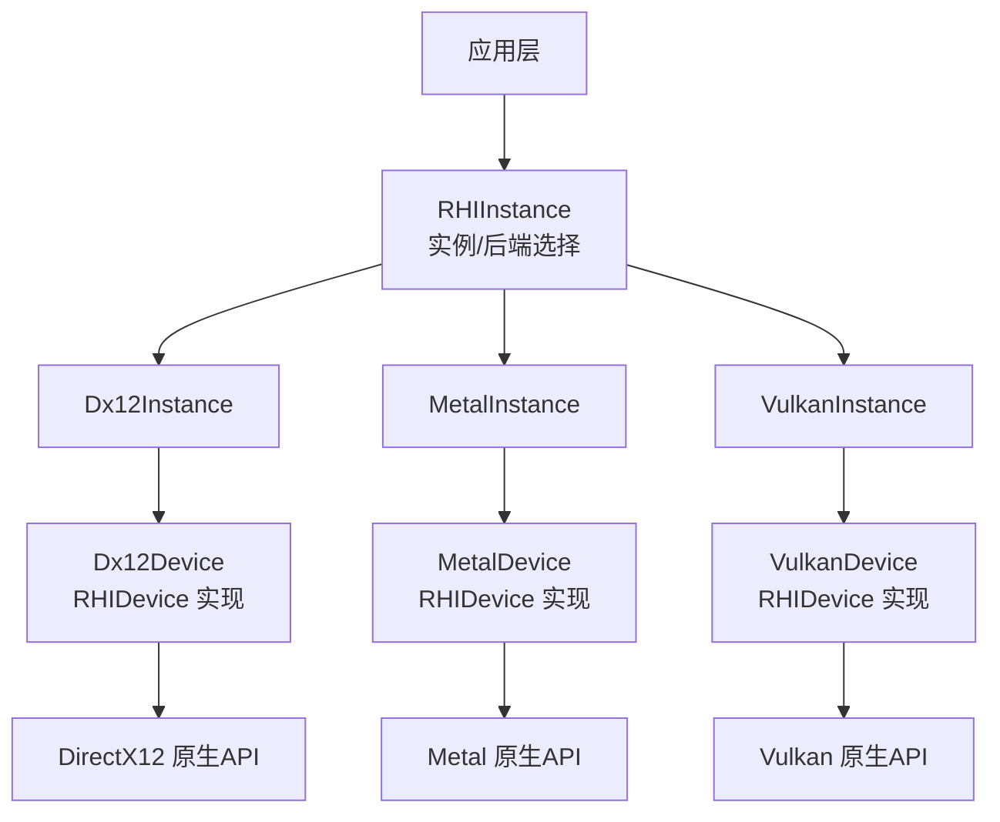
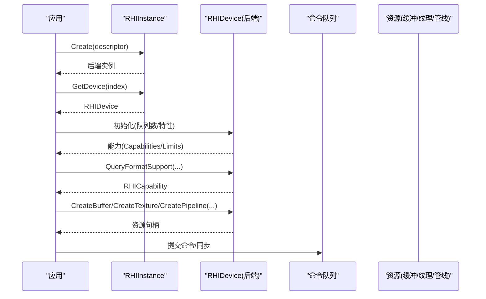
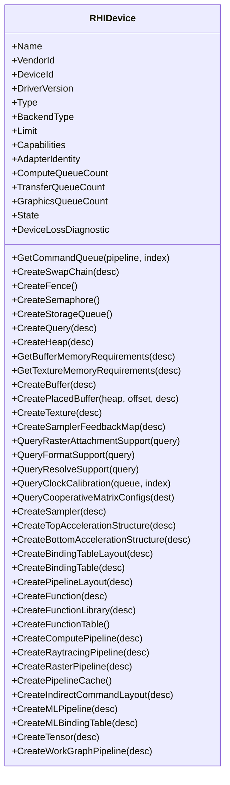
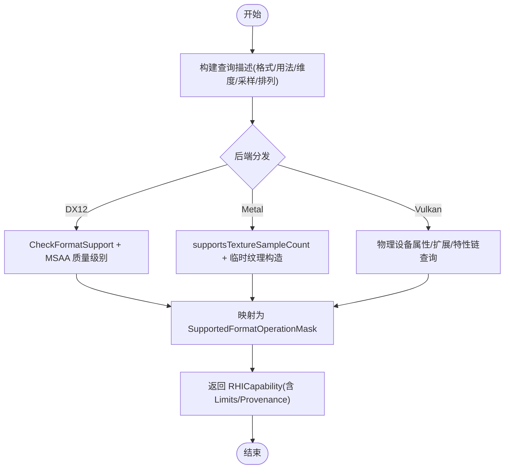
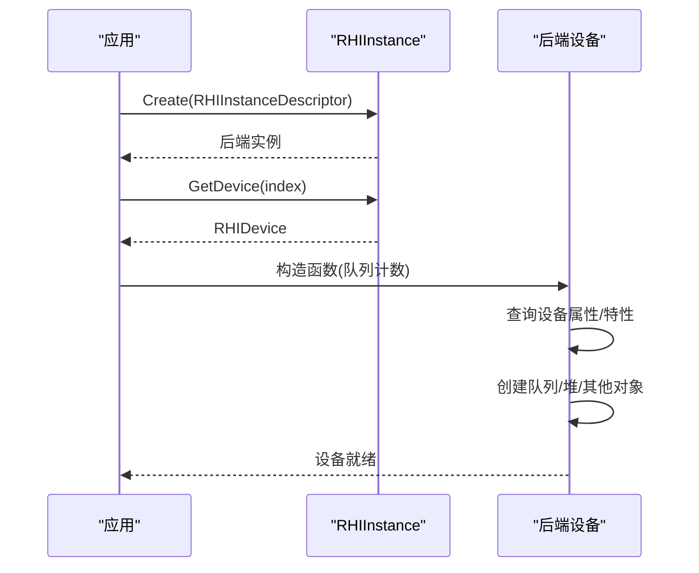
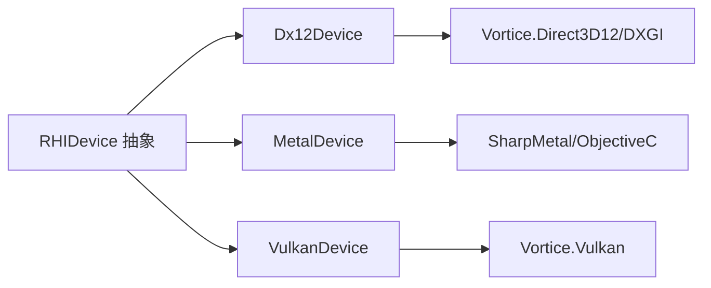

# 设备抽象

<cite>
**本文引用的文件**
- [RHIDevice.cs](file://src/SharpGPU/Abstract/RHIDevice.cs)
- [RHIInstance.cs](file://src/SharpGPU/Abstract/RHIInstance.cs)
- [Dx12Device.cs](file://src/SharpGPU/Dx12/Dx12Device.cs)
- [MetalDevice.cs](file://src/SharpGPU/Metal/MetalDevice.cs)
- [VulkanDevice.cs](file://src/SharpGPU/Vulkan/VulkanDevice.cs)
</cite>

## 目录
1. [简介](#简介)
2. [项目结构](#项目结构)
3. [核心组件](#核心组件)
4. [架构总览](#架构总览)
5. [详细组件分析](#详细组件分析)
6. [依赖关系分析](#依赖关系分析)
7. [性能考量](#性能考量)
8. [故障排查指南](#故障排查指南)
9. [结论](#结论)
10. [附录](#附录)

## 简介
本文件聚焦 SharpGPU 的设备抽象层，系统性说明 RHIDevice 抽象类的设计理念、接口定义、能力探测与资源管理接口；对比 DirectX12、Metal、Vulkan 三种后端实现的差异与共性；阐述设备初始化流程、能力查询机制、错误处理策略；解释设备与实例的关系，以及设备在渲染管线中的核心作用；并提供设备配置选项、性能调优参数与最佳实践指导。

## 项目结构
SharpGPU 采用“抽象 HAL + 多后端实现”的分层设计：
- 抽象层（Abstract）：定义跨后端的统一设备接口、能力模型、资源描述与查询类型。
- 后端实现（Dx12 / Metal / Vulkan）：将抽象接口映射到具体原生 API，完成设备创建、能力探测、资源分配与命令提交。
- 实例层（RHIInstance）：负责平台检测、后端选择与设备枚举/获取。

图表来源
- [RHIInstance.cs:122-155](file://src/SharpGPU/Abstract/RHIInstance.cs#L122-L155)
- [Dx12Device.cs:48-157](file://src/SharpGPU/Dx12/Dx12Device.cs#L48-L157)
- [MetalDevice.cs:12-95](file://src/SharpGPU/Metal/MetalDevice.cs#L12-L95)
- [VulkanDevice.cs:11-191](file://src/SharpGPU/Vulkan/VulkanDevice.cs#L11-L191)

章节来源
- [RHIInstance.cs:6-15](file://src/SharpGPU/Abstract/RHIInstance.cs#L6-L15)
- [RHIInstance.cs:46-155](file://src/SharpGPU/Abstract/RHIInstance.cs#L46-L155)

## 核心组件
- RHIDevice 抽象类：定义设备标识、能力、队列、资源创建与查询的统一接口；提供设备状态与丢失诊断、通用校验与能力门控。
- 能力模型：RHICapability、RHICapabilityLimits、各子能力集合（如 RHIRasterCapabilities、RHIMemoryCapabilities、RHISynchronizationCapabilities）。
- 资源与内存：Buffer/Texture/Sampler/Pipeline/Queue/Heap 等工厂方法；内存需求查询与放置资源支持。
- 查询接口：格式支持、MSAA 解析、光栅附件组合、时钟校准、协作矩阵配置等。
- 实例关系：RHIInstance 负责后端选择与设备获取；设备通过 GetDevice(index) 暴露给上层。

章节来源
- [RHIDevice.cs:422-990](file://src/SharpGPU/Abstract/RHIDevice.cs#L422-L990)
- [RHIDevice.cs:991-1600](file://src/SharpGPU/Abstract/RHIDevice.cs#L991-L1600)
- [RHIInstance.cs:46-155](file://src/SharpGPU/Abstract/RHIInstance.cs#L46-L155)

## 架构总览
设备抽象的核心职责是屏蔽后端差异，向上提供一致的设备能力与资源管理语义。下图展示设备生命周期与关键调用链：

图表来源
- [RHIInstance.cs:122-155](file://src/SharpGPU/Abstract/RHIInstance.cs#L122-L155)
- [RHIDevice.cs:527-601](file://src/SharpGPU/Abstract/RHIDevice.cs#L527-L601)
- [Dx12Device.cs:137-157](file://src/SharpGPU/Dx12/Dx12Device.cs#L137-L157)
- [MetalDevice.cs:55-95](file://src/SharpGPU/Metal/MetalDevice.cs#L55-L95)
- [VulkanDevice.cs:182-191](file://src/SharpGPU/Vulkan/VulkanDevice.cs#L182-L191)

## 详细组件分析

### RHIDevice 抽象设计与接口
- 设备信息：名称、厂商/设备 ID、驱动版本、设备类型、后端类型、适配器身份、队列数量、设备状态与丢失诊断。
- 资源管理：创建交换链、栅栏、信号量、存储队列、堆、缓冲、纹理、采样器、加速结构、绑定表、管线布局、函数/库/表、计算/光线追踪/光栅管线、工作图管线、ML 管线与张量等。
- 能力查询：格式支持、光栅附件支持、MSAA 解析支持、时钟校准、协作矩阵配置、光栅附件着色器 ABI 等。
- 内存与稀疏：缓冲/纹理内存需求、放置资源、稀疏纹理需求与创建、内存预算、驻留请求。
- 安全与校验：设备不可用抛出异常、查询描述符校验、使用位合法性检查、统计查询域与计数器限制校验。

图表来源
- [RHIDevice.cs:422-990](file://src/SharpGPU/Abstract/RHIDevice.cs#L422-L990)

章节来源
- [RHIDevice.cs:422-990](file://src/SharpGPU/Abstract/RHIDevice.cs#L422-L990)

### 能力探测与查询机制
- 查询入口：QueryFormatSupport、QueryRasterAttachmentSupport、QueryResolveSupport、QueryClockCalibration、QueryCooperativeMatrixConfigs。
- 返回模型：RHICapability（Tier/Strategy/Limits/Provenance），Unavailable 时携带原因与探针来源。
- 后端差异：
  - DX12：基于 CheckFormatSupport/CheckMultisampleQualityLevels/ROVsSupported 等原生查询，映射为操作掩码与可用性。
  - Metal：通过 supportsTextureSampleCount 与临时纹理构造进行运行时探测，结合内置像素格式表判定可混合/解析能力。
  - Vulkan：通过物理设备属性/扩展/特性链查询（动态渲染、局部读、深度/模板解析模式、时间戳等），并维护有效 API 版本与特性开关。

图表来源
- [Dx12Device.cs:546-673](file://src/SharpGPU/Dx12/Dx12Device.cs#L546-L673)
- [MetalDevice.cs:474-659](file://src/SharpGPU/Metal/MetalDevice.cs#L474-L659)
- [VulkanDevice.cs:193-800](file://src/SharpGPU/Vulkan/VulkanDevice.cs#L193-L800)
- [RHIDevice.cs:1272-1384](file://src/SharpGPU/Abstract/RHIDevice.cs#L1272-L1384)

章节来源
- [RHIDevice.cs:577-601](file://src/SharpGPU/Abstract/RHIDevice.cs#L577-L601)
- [RHIDevice.cs:1272-1384](file://src/SharpGPU/Abstract/RHIDevice.cs#L1272-L1384)

### 不同后端设备实现的差异与共同特性
- 共同特性
  - 统一的设备能力模型与查询接口。
  - 统一的资源创建与内存需求查询路径。
  - 统一的设备状态与丢失诊断机制。
- 差异点
  - DX12：强调 Descriptor Heap、命令签名、DirectML 集成；对线性纹理 tiling 不支持通用查询；解析/混合能力由 FormatSupport 位决定。
  - Metal：要求 Metal 4 与 MTL4 绑定表；通过运行时对象探测能力；对 resolve 颜色通道支持有限（平均/sample-0）。
  - Vulkan：通过特性链启用动态渲染、局部读、独立解析、时间戳等；队列族选择与回退策略更复杂；支持更多扩展能力。

章节来源
- [Dx12Device.cs:137-157](file://src/SharpGPU/Dx12/Dx12Device.cs#L137-L157)
- [MetalDevice.cs:55-95](file://src/SharpGPU/Metal/MetalDevice.cs#L55-L95)
- [VulkanDevice.cs:182-191](file://src/SharpGPU/Vulkan/VulkanDevice.cs#L182-L191)

### 设备初始化流程
- 实例创建：RHIInstance.Create 根据平台与描述选择后端实例。
- 设备构造：
  - DX12：从 DXGI 适配器获取信息，创建 D3D12 设备、DirectML 对象、特性检查、命令队列、描述符堆、命令签名。
  - Metal：验证原生设备指针、设置设备信息、探测 Metal 4/绑定表支持、构建限制与特性、创建队列与纹理视图池。
  - Vulkan：查询物理设备属性与内存属性、选择队列族、构建设备扩展与特性链、创建 VkDevice。

图表来源
- [RHIInstance.cs:122-155](file://src/SharpGPU/Abstract/RHIInstance.cs#L122-L155)
- [Dx12Device.cs:137-157](file://src/SharpGPU/Dx12/Dx12Device.cs#L137-L157)
- [MetalDevice.cs:55-95](file://src/SharpGPU/Metal/MetalDevice.cs#L55-L95)
- [VulkanDevice.cs:182-191](file://src/SharpGPU/Vulkan/VulkanDevice.cs#L182-L191)

章节来源
- [RHIInstance.cs:122-155](file://src/SharpGPU/Abstract/RHIInstance.cs#L122-L155)
- [Dx12Device.cs:137-157](file://src/SharpGPU/Dx12/Dx12Device.cs#L137-L157)
- [MetalDevice.cs:55-95](file://src/SharpGPU/Metal/MetalDevice.cs#L55-L95)
- [VulkanDevice.cs:182-191](file://src/SharpGPU/Vulkan/VulkanDevice.cs#L182-L191)

### 错误处理策略
- 设备不可用：ThrowIfDeviceUnavailable 在操作前检查设备状态，若处于非 Operational 则抛出携带诊断的异常。
- 设备丢失：MarkDeviceLost 强制转换到 Lost/Removed/Reset 状态，并记录诊断；后续访问直接抛出。
- 后端特定反馈：Metal 命令队列错误会映射为 ERHIErrorCode 与设备状态，必要时触发设备丢失。
- 查询失败：能力查询返回 Unavailable 并附带原因与探针来源，调用方需显式 Require 或降级。

章节来源
- [RHIDevice.cs:465-525](file://src/SharpGPU/Abstract/RHIDevice.cs#L465-L525)
- [MetalDevice.cs:97-168](file://src/SharpGPU/Metal/MetalDevice.cs#L97-L168)

### 设备与实例的关系
- RHIInstance 负责后端选择与设备枚举/获取；设备通过索引暴露。
- 设备持有后端原生句柄与能力缓存；不直接管理实例生命周期，但依赖实例提供的平台/表面信息。

章节来源
- [RHIInstance.cs:46-155](file://src/SharpGPU/Abstract/RHIInstance.cs#L46-L155)

### 设备在渲染管线中的核心作用
- 作为所有资源与管线的根：缓冲、纹理、采样器、管线、绑定表、函数库等均通过设备创建。
- 能力门控：在创建/查询前通过 Capabilities.Require 确保后端支持，避免运行时失败。
- 队列与同步：提供命令队列与同步原语，支撑渲染/计算/传输流水线。

章节来源
- [RHIDevice.cs:527-990](file://src/SharpGPU/Abstract/RHIDevice.cs#L527-L990)

## 依赖关系分析
- 抽象层依赖：无后端特定依赖，仅依赖基础类型与集合。
- 后端实现依赖：
  - DX12：Vortice.Direct3D12、Vortice.DXGI、DirectML。
  - Metal：SharpMetal 封装与 Objective-C 运行时。
  - Vulkan：Vortice.Vulkan 与扩展特性链。
- 耦合与内聚：设备与队列/资源强内聚；能力模型解耦后端细节，便于横向扩展。

图表来源
- [Dx12Device.cs:1-10](file://src/SharpGPU/Dx12/Dx12Device.cs#L1-L10)
- [MetalDevice.cs:1-10](file://src/SharpGPU/Metal/MetalDevice.cs#L1-L10)
- [VulkanDevice.cs:1-10](file://src/SharpGPU/Vulkan/VulkanDevice.cs#L1-L10)

章节来源
- [Dx12Device.cs:1-10](file://src/SharpGPU/Dx12/Dx12Device.cs#L1-L10)
- [MetalDevice.cs:1-10](file://src/SharpGPU/Metal/MetalDevice.cs#L1-L10)
- [VulkanDevice.cs:1-10](file://src/SharpGPU/Vulkan/VulkanDevice.cs#L1-L10)

## 性能考量
- 队列配置：合理设置 Compute/Transfer/Graphics 队列数量，避免过度创建导致上下文切换开销。
- 内存对齐与布局：遵循 Uniform/Upload Buffer 对齐限制，减少填充浪费；优先使用放置资源以复用堆。
- 能力利用：优先使用 Tier2+ 能力（如协作矩阵、变量率着色、增强屏障）以提升吞吐。
- 查询优化：批量查询格式支持，缓存结果；仅在必要时进行运行时对象探测（Metal）。
- 同步与时间戳：使用 Calibrated Timestamps 精确测量 GPU/CPU 时间，定位瓶颈。

[本节为通用指导，无需特定文件引用]

## 故障排查指南
- 设备丢失：检查 DeviceLossDiagnostic 与 State；确认是否收到 DeviceLost 诊断；必要时重建设备。
- 能力不可用：查看 RHICapability.UnavailableReason 与 Provenance；根据原因调整资源/管线或使用降级路径。
- 队列错误：Metal 中 ReportCommandQueueFeedback 会累积错误，需在合适时机 ThrowIfCommandQueueFailed 消费。
- 查询失败：确认输入描述符合法（格式/用法/维度/采样/排列）；检查后端是否支持该组合。

章节来源
- [RHIDevice.cs:465-525](file://src/SharpGPU/Abstract/RHIDevice.cs#L465-L525)
- [MetalDevice.cs:97-168](file://src/SharpGPU/Metal/MetalDevice.cs#L97-L168)
- [RHIDevice.cs:729-812](file://src/SharpGPU/Abstract/RHIDevice.cs#L729-L812)

## 结论
SharpGPU 的设备抽象通过 RHIDevice 提供了统一、可扩展且健壮的设备接口，配合精细的能力模型与查询机制，使上层代码能够以跨后端的方式管理资源与执行渲染/计算任务。DX12、Metal、Vulkan 三者在能力探测与资源管理上各有特色，但均遵循一致的抽象契约。实践中应充分利用能力门控、队列与内存优化，并结合时间戳与诊断信息进行性能调优与问题定位。

[本节为总结性内容，无需特定文件引用]

## 附录

### 设备配置选项与性能调优参数
- 实例描述（RHIInstanceDescriptor）
  - Backend：目标后端（DirectX12/Metal/Vulkan）。
  - SurfaceKind：表面类型（影响 Vulkan 扩展启用）。
  - EnableDebugLayer/EnableValidation：调试与验证开关。
  - ComputeQueueRequestCount/TransferQueueRequestCount/GraphicsQueueRequestCount：请求的队列数量。
- 设备限制（RHIDeviceLimit）
  - UniformBufferAlignment/UploadBufferAlignment/UploadBufferTextureAlignment/UploadBufferTextureRowAlignment：内存对齐约束。
  - MaxMSAACount/MaxBoundTexture/MinWavefrontSize/MaxWavefrontSize/MaxComputeThreads/MaxGroupShareMemorySize/MaxVertexInputBindings/MaxColorAttachments/MaxTexture2DSize/MaxTextureCubeSize：硬件上限。
- 能力与限制（RHICapabilityLimits）
  - SupportedFormatOperationMask、SupportedResolveModeMask、SupportedShadingRateMask、GpuTimestampFrequency、Sparse* 相关限制等。

章节来源
- [RHIInstance.cs:6-15](file://src/SharpGPU/Abstract/RHIInstance.cs#L6-L15)
- [RHIDevice.cs:9-55](file://src/SharpGPU/Abstract/RHIDevice.cs#L9-L55)
- [RHIDevice.cs:1020-1121](file://src/SharpGPU/Abstract/RHIDevice.cs#L1020-L1121)

### 设备选择与优化的最佳实践
- 平台适配：优先选择平台原生后端（Windows→DX12，macOS/iOS→Metal，Linux/Android→Vulkan）。
- 能力优先：在创建资源前查询并 Require 所需能力，避免运行时失败；对不可用能力准备降级方案。
- 队列与同步：按负载拆分队列（图形/计算/传输），合理使用栅栏与信号量；使用校准时间戳评估性能。
- 内存与布局：遵循对齐与堆分配策略，尽量使用放置资源；对大纹理考虑稀疏与分块。
- 调试与诊断：开启验证层与调试层；捕获并分析设备丢失与队列错误；记录能力探针来源以便复现问题。

章节来源
- [RHIInstance.cs:59-120](file://src/SharpGPU/Abstract/RHIInstance.cs#L59-L120)
- [RHIDevice.cs:1373-1384](file://src/SharpGPU/Abstract/RHIDevice.cs#L1373-L1384)
- [MetalDevice.cs:97-168](file://src/SharpGPU/Metal/MetalDevice.cs#L97-L168)