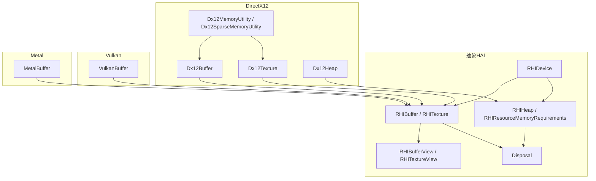
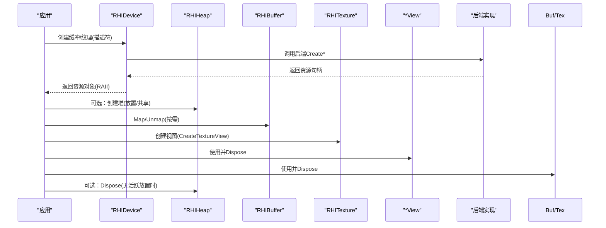
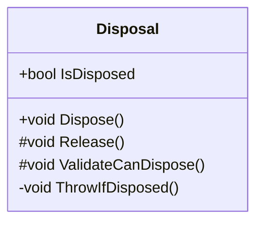
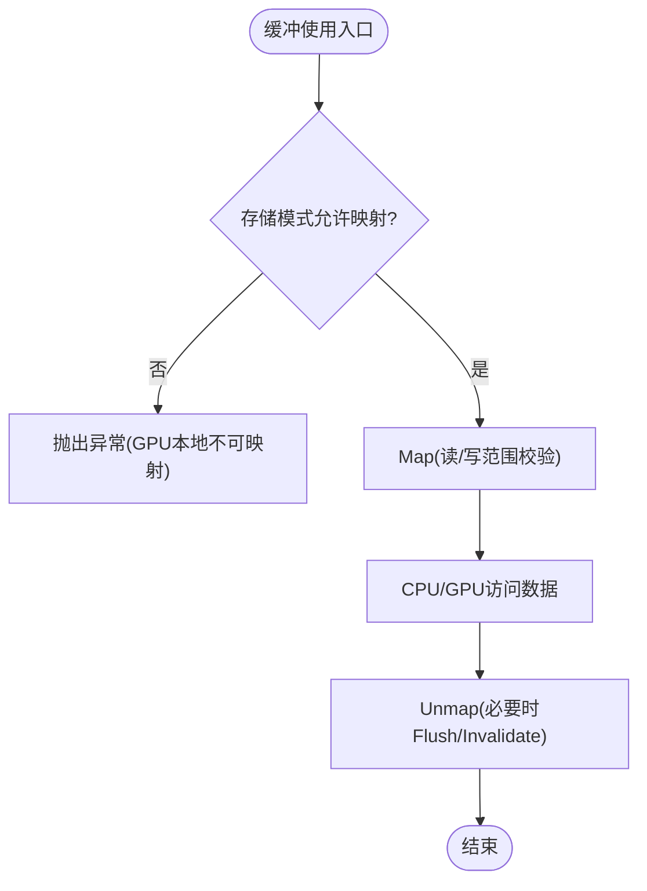
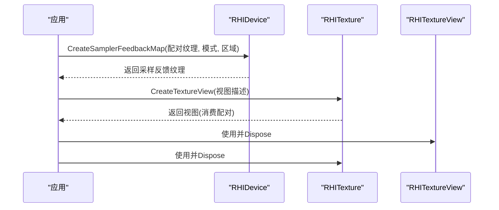
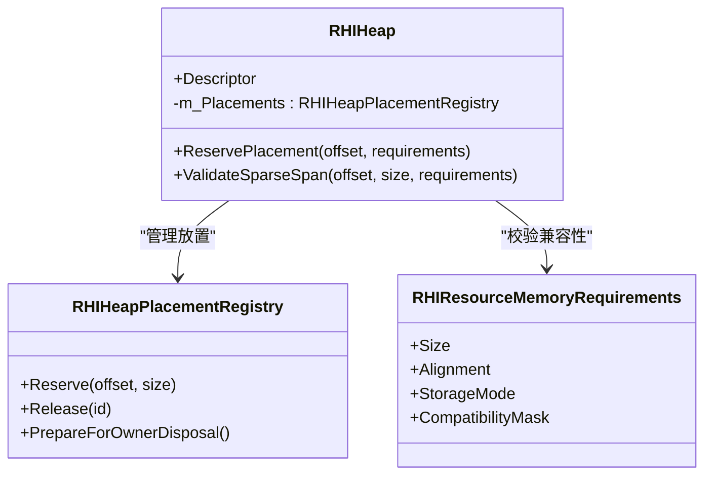
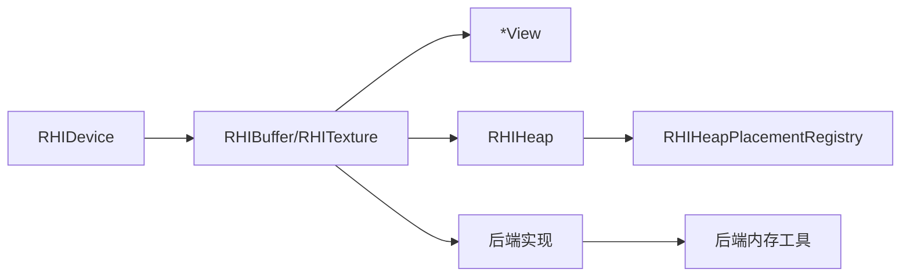

# 资源生命周期

<cite>
**本文引用的文件**
- [src/SharpGPU/Common/Core/Disposal.cs](file://src/SharpGPU/Common/Core/Disposal.cs)
- [src/SharpGPU/Abstract/RHIBuffer.cs](file://src/SharpGPU/Abstract/RHIBuffer.cs)
- [src/SharpGPU/Abstract/RHITexture.cs](file://src/SharpGPU/Abstract/RHITexture.cs)
- [src/SharpGPU/Abstract/RHIMemory.cs](file://src/SharpGPU/Abstract/RHIMemory.cs)
- [src/SharpGPU/Abstract/RHIDevice.cs](file://src/SharpGPU/Abstract/RHIDevice.cs)
- [src/SharpGPU/Dx12/Dx12Buffer.cs](file://src/SharpGPU/Dx12/Dx12Buffer.cs)
- [src/SharpGPU/Dx12/Dx12Texture.cs](file://src/SharpGPU/Dx12/Dx12Texture.cs)
- [src/SharpGPU/Dx12/Dx12Memory.cs](file://src/SharpGPU/Dx12/Dx12Memory.cs)
- [src/SharpGPU/Vulkan/VulkanBuffer.cs](file://src/SharpGPU/Vulkan/VulkanBuffer.cs)
- [src/SharpGPU/Metal/MetalBuffer.cs](file://src/SharpGPU/Metal/MetalBuffer.cs)
- [src/SharpGPU/Abstract/RHIBufferView.cs](file://src/SharpGPU/Abstract/RHIBufferView.cs)
- [src/SharpGPU/Abstract/RHITextureView.cs](file://src/SharpGPU/Abstract/RHITextureView.cs)
</cite>

## 目录
1. [简介](#简介)
2. [项目结构](#项目结构)
3. [核心组件](#核心组件)
4. [架构总览](#架构总览)
5. [详细组件分析](#详细组件分析)
6. [依赖关系分析](#依赖关系分析)
7. [性能考虑](#性能考虑)
8. [故障排查指南](#故障排查指南)
9. [结论](#结论)
10. [附录](#附录)

## 简介
本文件聚焦 SharpGPU 的资源生命周期管理，围绕缓冲区与纹理等核心资源的创建、使用与销毁模式展开，系统阐述 RAII 在资源管理中的应用、内存分配策略（提交式、放置式、稀疏、外部）、资源池化与垃圾回收优化、同步机制与线程安全保证、资源依赖与级联释放、泄漏检测与调试工具使用，以及最佳实践与性能优化建议。文档以抽象 HAL 接口与具体后端实现（DirectX12、Vulkan、Metal）为依据，提供可追溯的代码级说明与图示。

## 项目结构
SharpGPU 采用“抽象 HAL + 多后端”分层设计：
- 抽象层：定义设备、缓冲、纹理、内存堆、视图等核心类型与生命周期契约。
- 后端实现：针对 DirectX12、Vulkan、Metal 的具体实现，封装原生对象与平台差异。
- 通用基础：统一的资源基类 Disposal 提供 RAII 语义；内存子系统提供堆、放置与稀疏纹理能力。

图表来源
- [src/SharpGPU/Abstract/RHIDevice.cs:422-553](file://src/SharpGPU/Abstract/RHIDevice.cs#L422-L553)
- [src/SharpGPU/Abstract/RHIBuffer.cs:14-47](file://src/SharpGPU/Abstract/RHIBuffer.cs#L14-L47)
- [src/SharpGPU/Abstract/RHITexture.cs:50-139](file://src/SharpGPU/Abstract/RHITexture.cs#L50-L139)
- [src/SharpGPU/Abstract/RHIMemory.cs:173-457](file://src/SharpGPU/Abstract/RHIMemory.cs#L173-L457)
- [src/SharpGPU/Dx12/Dx12Buffer.cs:8-146](file://src/SharpGPU/Dx12/Dx12Buffer.cs#L8-L146)
- [src/SharpGPU/Dx12/Dx12Texture.cs:7-195](file://src/SharpGPU/Dx12/Dx12Texture.cs#L7-L195)
- [src/SharpGPU/Dx12/Dx12Memory.cs:7-124](file://src/SharpGPU/Dx12/Dx12Memory.cs#L7-L124)
- [src/SharpGPU/Dx12/Dx12Memory.cs:318-355](file://src/SharpGPU/Dx12/Dx12Memory.cs#L318-L355)
- [src/SharpGPU/Vulkan/VulkanBuffer.cs:7-339](file://src/SharpGPU/Vulkan/VulkanBuffer.cs#L7-L339)
- [src/SharpGPU/Metal/MetalBuffer.cs:8-139](file://src/SharpGPU/Metal/MetalBuffer.cs#L8-L139)

章节来源
- [src/SharpGPU/Abstract/RHIDevice.cs:422-553](file://src/SharpGPU/Abstract/RHIDevice.cs#L422-L553)
- [src/SharpGPU/Abstract/RHIBuffer.cs:14-47](file://src/SharpGPU/Abstract/RHIBuffer.cs#L14-L47)
- [src/SharpGPU/Abstract/RHITexture.cs:50-139](file://src/SharpGPU/Abstract/RHITexture.cs#L50-L139)
- [src/SharpGPU/Abstract/RHIMemory.cs:173-457](file://src/SharpGPU/Abstract/RHIMemory.cs#L173-L457)

## 核心组件
- 资源基类与RAII：所有资源继承自 Disposal，统一实现 Dispose、ThrowIfDisposed、析构期未释放告警，确保“构造即初始化，作用域结束即释放”。
- 设备与资源工厂：RHIDevice 暴露 CreateBuffer/CreateTexture/CreateHeap 等方法，负责创建与能力查询。
- 内存与堆：RHIHeap 与 RHIResourceMemoryRequirements 描述物理内存与兼容性；支持 Committed/Placed/Sparse/External 四种分配模式。
- 缓冲与纹理：RHIBuffer/RHITexture 提供 Map/Unmap、Create*View 等生命周期操作；后端实现封装原生对象与平台细节。
- 视图：RHIBufferView/RHITextureView 轻量引用资源，遵循相同 RAII 生命周期。

章节来源
- [src/SharpGPU/Common/Core/Disposal.cs:7-63](file://src/SharpGPU/Common/Core/Disposal.cs#L7-L63)
- [src/SharpGPU/Abstract/RHIDevice.cs:527-553](file://src/SharpGPU/Abstract/RHIDevice.cs#L527-L553)
- [src/SharpGPU/Abstract/RHIMemory.cs:9-16](file://src/SharpGPU/Abstract/RHIMemory.cs#L9-L16)
- [src/SharpGPU/Abstract/RHIBuffer.cs:14-47](file://src/SharpGPU/Abstract/RHIBuffer.cs#L14-L47)
- [src/SharpGPU/Abstract/RHITexture.cs:50-139](file://src/SharpGPU/Abstract/RHITexture.cs#L50-L139)
- [src/SharpGPU/Abstract/RHIBufferView.cs:5-16](file://src/SharpGPU/Abstract/RHIBufferView.cs#L5-L16)
- [src/SharpGPU/Abstract/RHITextureView.cs:5-21](file://src/SharpGPU/Abstract/RHITextureView.cs#L5-L21)

## 架构总览
下图展示资源从创建到销毁的端到端流程，涵盖设备、堆、缓冲/纹理、视图及后端映射。

图表来源
- [src/SharpGPU/Abstract/RHIDevice.cs:527-553](file://src/SharpGPU/Abstract/RHIDevice.cs#L527-L553)
- [src/SharpGPU/Abstract/RHIMemory.cs:173-457](file://src/SharpGPU/Abstract/RHIMemory.cs#L173-L457)
- [src/SharpGPU/Dx12/Dx12Buffer.cs:37-86](file://src/SharpGPU/Dx12/Dx12Buffer.cs#L37-L86)
- [src/SharpGPU/Dx12/Dx12Texture.cs:30-83](file://src/SharpGPU/Dx12/Dx12Texture.cs#L30-L83)
- [src/SharpGPU/Vulkan/VulkanBuffer.cs:65-181](file://src/SharpGPU/Vulkan/VulkanBuffer.cs#L65-L181)
- [src/SharpGPU/Metal/MetalBuffer.cs:31-75](file://src/SharpGPU/Metal/MetalBuffer.cs#L31-L75)

## 详细组件分析

### 资源基类与RAII（Disposal）
- 职责：统一实现 IDisposable，提供 IsDisposed、ThrowIfDisposed、Dispose、Release 钩子；DEBUG 模式下析构器检测未释放资源并输出诊断。
- 线程安全：通过原子状态切换避免重复释放；Dispose 中先 ValidateCanDispose 再执行 Release，最后抑制终结器。
- 扩展点：子类重写 Release 释放原生资源；可重写 ValidateCanDispose 增加前置校验。

图表来源
- [src/SharpGPU/Common/Core/Disposal.cs:7-63](file://src/SharpGPU/Common/Core/Disposal.cs#L7-L63)

章节来源
- [src/SharpGPU/Common/Core/Disposal.cs:7-63](file://src/SharpGPU/Common/Core/Disposal.cs#L7-L63)

### 缓冲资源生命周期（RHIBuffer 与后端）
- 抽象接口：RHIBuffer 暴露 Descriptor、AllocationMode、Map/Unmap、CreateBufferView。
- 后端实现要点：
  - DirectX12：支持 Committed/Placed/External；Map/Unmap 对 GPU-local 禁止；释放时释放原生资源与 Placement。
  - Vulkan：支持 Committed/Placed/External；Map/Unmap 处理非一致性缓存刷新；释放时解绑内存、销毁缓冲、释放 Placement。
  - Metal：支持 Committed/Placed/External；Managed 存储模式需 DidModifyRange；释放时移除驻留并释放对象。

图表来源
- [src/SharpGPU/Dx12/Dx12Buffer.cs:99-133](file://src/SharpGPU/Dx12/Dx12Buffer.cs#L99-L133)
- [src/SharpGPU/Vulkan/VulkanBuffer.cs:192-303](file://src/SharpGPU/Vulkan/VulkanBuffer.cs#L192-L303)
- [src/SharpGPU/Metal/MetalBuffer.cs:85-120](file://src/SharpGPU/Metal/MetalBuffer.cs#L85-L120)

章节来源
- [src/SharpGPU/Abstract/RHIBuffer.cs:14-47](file://src/SharpGPU/Abstract/RHIBuffer.cs#L14-L47)
- [src/SharpGPU/Dx12/Dx12Buffer.cs:8-146](file://src/SharpGPU/Dx12/Dx12Buffer.cs#L8-L146)
- [src/SharpGPU/Vulkan/VulkanBuffer.cs:7-339](file://src/SharpGPU/Vulkan/VulkanBuffer.cs#L7-L339)
- [src/SharpGPU/Metal/MetalBuffer.cs:8-139](file://src/SharpGPU/Metal/MetalBuffer.cs#L8-L139)

### 纹理资源生命周期（RHITexture 与采样反馈）
- 抽象接口：RHITexture 暴露 Descriptor、AllocationMode、IsSamplerFeedbackMap、PairedSamplerFeedbackTexture、CreateTextureView。
- 采样反馈图：CreateSamplerFeedbackMap 在创建时绑定采样纹理与模式/区域；视图创建时消费该配对信息。
- 后端实现要点：
  - DirectX12：支持 Committed/Placed/Sparse/External；采样反馈图通过专用 API 创建；释放时释放原生资源与 Placement。

图表来源
- [src/SharpGPU/Abstract/RHIDevice.cs:554-572](file://src/SharpGPU/Abstract/RHIDevice.cs#L554-L572)
- [src/SharpGPU/Abstract/RHITexture.cs:25-139](file://src/SharpGPU/Abstract/RHITexture.cs#L25-L139)
- [src/SharpGPU/Dx12/Dx12Texture.cs:134-180](file://src/SharpGPU/Dx12/Dx12Texture.cs#L134-L180)

章节来源
- [src/SharpGPU/Abstract/RHITexture.cs:50-139](file://src/SharpGPU/Abstract/RHITexture.cs#L50-L139)
- [src/SharpGPU/Dx12/Dx12Texture.cs:7-195](file://src/SharpGPU/Dx12/Dx12Texture.cs#L7-L195)

### 内存分配策略与堆（RHIHeap、RHIResourceMemoryRequirements）
- 分配模式：
  - Committed：资源自带内存（默认）。
  - Placed：将资源放置在用户创建的堆上，便于池化与复用。
  - Sparse：稀疏纹理，按瓦片粒度绑定物理内存。
  - External：外部资源包装。
- 堆与放置：
  - RHIHeap 持有原生堆并维护放置注册表，防止重叠与非法释放。
  - ReservePlacement 校验对齐、尺寸、兼容性与所有权；PrepareForOwnerDisposal 确保无活跃放置后再释放。
- 兼容性：RHIResourceMemoryRequirements 提供 Size/Alignment/StorageMode/CompatibilityMask 等，屏蔽后端私有内存类。

图表来源
- [src/SharpGPU/Abstract/RHIMemory.cs:173-457](file://src/SharpGPU/Abstract/RHIMemory.cs#L173-L457)
- [src/SharpGPU/Abstract/RHIMemory.cs:28-77](file://src/SharpGPU/Abstract/RHIMemory.cs#L28-L77)

章节来源
- [src/SharpGPU/Abstract/RHIMemory.cs:9-16](file://src/SharpGPU/Abstract/RHIMemory.cs#L9-L16)
- [src/SharpGPU/Abstract/RHIMemory.cs:173-457](file://src/SharpGPU/Abstract/RHIMemory.cs#L173-L457)

### 视图资源生命周期（BufferView/TextureView）
- 视图为轻量资源，仅持有对底层资源的引用与视图描述；遵循 RAII，应在不再使用时尽早释放。
- 纹理视图创建时可能消费采样反馈图的配对信息（由后端实现决定）。

章节来源
- [src/SharpGPU/Abstract/RHIBufferView.cs:5-16](file://src/SharpGPU/Abstract/RHIBufferView.cs#L5-L16)
- [src/SharpGPU/Abstract/RHITextureView.cs:5-21](file://src/SharpGPU/Abstract/RHITextureView.cs#L5-L21)

### 资源依赖与级联释放
- 视图依赖资源：应先释放视图，再释放资源。
- 放置依赖堆：堆在存在活跃放置时不可释放；释放顺序为资源→放置→堆。
- 采样反馈图与被采样纹理：图不拥有被采样纹理；应优先释放视图与图，被采样纹理可延后释放。

章节来源
- [src/SharpGPU/Abstract/RHITexture.cs:25-31](file://src/SharpGPU/Abstract/RHITexture.cs#L25-L31)
- [src/SharpGPU/Abstract/RHIMemory.cs:167-171](file://src/SharpGPU/Abstract/RHIMemory.cs#L167-L171)
- [src/SharpGPU/Dx12/Dx12Buffer.cs:141-146](file://src/SharpGPU/Dx12/Dx12Buffer.cs#L141-L146)
- [src/SharpGPU/Dx12/Dx12Texture.cs:188-195](file://src/SharpGPU/Dx12/Dx12Texture.cs#L188-L195)

## 依赖关系分析
- 耦合关系：
  - 资源对象强依赖设备（用于能力检查与后端调用）。
  - 放置资源强依赖堆与放置注册表。
  - 视图弱依赖资源（仅引用）。
- 间接依赖：
  - 后端实现依赖各自内存工具（如 Dx12MemoryUtility）。
- 循环依赖：未发现显式循环；通过抽象层与工具类解耦。

图表来源
- [src/SharpGPU/Abstract/RHIDevice.cs:422-553](file://src/SharpGPU/Abstract/RHIDevice.cs#L422-L553)
- [src/SharpGPU/Abstract/RHIMemory.cs:173-457](file://src/SharpGPU/Abstract/RHIMemory.cs#L173-L457)
- [src/SharpGPU/Dx12/Dx12Memory.cs:7-124](file://src/SharpGPU/Dx12/Dx12Memory.cs#L7-L124)

章节来源
- [src/SharpGPU/Abstract/RHIDevice.cs:422-553](file://src/SharpGPU/Abstract/RHIDevice.cs#L422-L553)
- [src/SharpGPU/Abstract/RHIMemory.cs:173-457](file://src/SharpGPU/Abstract/RHIMemory.cs#L173-L457)
- [src/SharpGPU/Dx12/Dx12Memory.cs:7-124](file://src/SharpGPU/Dx12/Dx12Memory.cs#L7-L124)

## 性能考虑
- 优先使用放置式分配进行池化：通过 RHIHeap 复用物理内存，减少分配开销与碎片。
- 合理选择存储模式：上传/回读使用 HostUpload/Readback，渲染路径使用 GPULocal 以获得最佳带宽。
- 最小化 Map/Unmap：批量写入，避免频繁同步；Vulkan 下注意非一致性缓存的 Flush/Invalidate。
- 稀疏纹理按需绑定瓦片：仅在需要时 MakeResident，降低峰值内存占用。
- 视图与资源分离释放：尽早释放视图以减少驱动侧状态压力。

[本节为通用指导，无需特定文件来源]

## 故障排查指南
- 常见错误与定位：
  - 已释放对象访问：ThrowIfDisposed 会抛出 ObjectDisposedException；检查是否提前 Dispose。
  - 设备丢失：通过 MarkDeviceLost/ThrowIfDeviceUnavailable 捕获并处理；记录诊断信息。
  - 堆释放失败：当存在活跃放置时，PrepareForOwnerDisposal 会阻止释放；确认所有资源已释放。
  - 映射越界：Map/Unmap 对范围进行严格校验；检查 readBegin/readEnd 与 ByteSize。
  - 采样反馈配对错误：CreateSamplerFeedbackMap 要求配对纹理为 2D/2DArray 且带 ShaderResource 使用标志。
- 调试建议：
  - 启用 DEBUG 构建以获取未释放对象告警。
  - 在后端创建失败处查看 DeviceRemovedReason 或 HRESULT，结合日志定位。
  - 对放置资源使用 ReservePlacement/Release 的成对调用，确保无悬挂放置。

章节来源
- [src/SharpGPU/Common/Core/Disposal.cs:13-23](file://src/SharpGPU/Common/Core/Disposal.cs#L13-L23)
- [src/SharpGPU/Abstract/RHIDevice.cs:465-525](file://src/SharpGPU/Abstract/RHIDevice.cs#L465-L525)
- [src/SharpGPU/Abstract/RHIMemory.cs:441-455](file://src/SharpGPU/Abstract/RHIMemory.cs#L441-L455)
- [src/SharpGPU/Dx12/Dx12Buffer.cs:99-133](file://src/SharpGPU/Dx12/Dx12Buffer.cs#L99-L133)
- [src/SharpGPU/Vulkan/VulkanBuffer.cs:192-303](file://src/SharpGPU/Vulkan/VulkanBuffer.cs#L192-L303)
- [src/SharpGPU/Abstract/RHIDevice.cs:646-703](file://src/SharpGPU/Abstract/RHIDevice.cs#L646-L703)

## 结论
SharpGPU 通过抽象 HAL 与多后端实现，提供了统一且健壮的资源生命周期管理。基于 Disposal 的 RAII 模式确保资源及时释放；内存子系统支持多种分配模式与堆池化；视图与资源分离、采样反馈配对与稀疏纹理机制增强了灵活性。配合严格的参数校验、设备丢失处理与调试告警，开发者可在高性能与安全性之间取得平衡。推荐在生产环境中广泛采用放置式分配、合理的存储模式选择与批量化访问，以获得更佳的性能表现。

[本节为总结性内容，无需特定文件来源]

## 附录
- 关键术语
  - 提交式分配（Committed）：资源自带内存，适合简单场景。
  - 放置式分配（Placed）：资源置于用户堆，适合池化与复用。
  - 稀疏纹理（Sparse）：按瓦片粒度绑定物理内存，按需驻留。
  - 外部资源（External）：包装已有原生资源。
- 最佳实践清单
  - 始终使用 using/try-finally 确保资源释放。
  - 先释放视图，再释放资源；先释放资源，再释放堆。
  - 对 Map/Unmap 进行范围校验，避免越界访问。
  - 合理使用存储模式与队列，减少同步与拷贝。
  - 利用能力查询与兼容性掩码，避免不可用特性。

[本节为补充信息，无需特定文件来源]