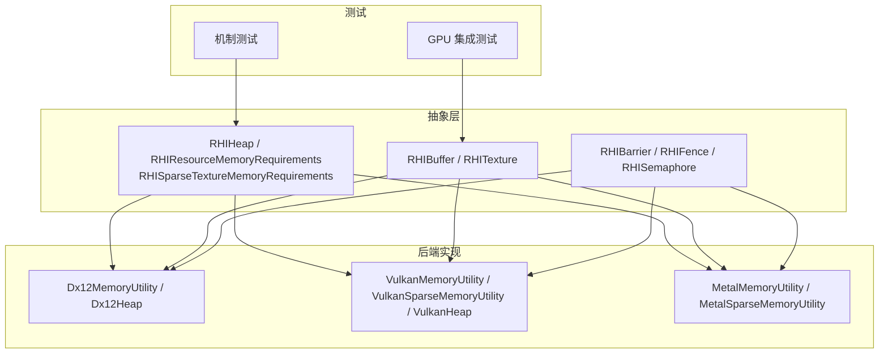
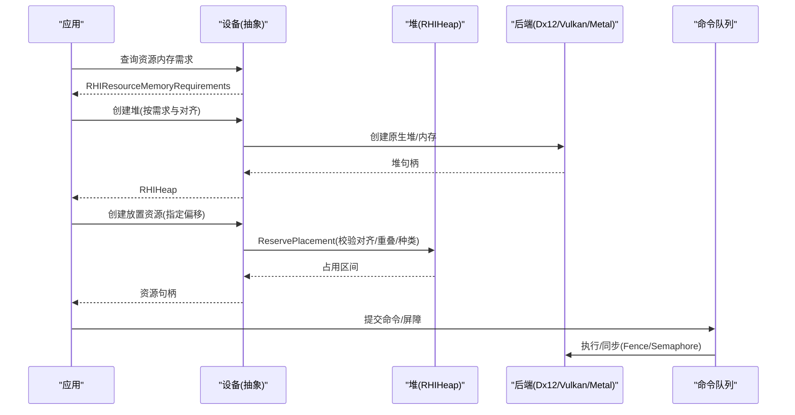
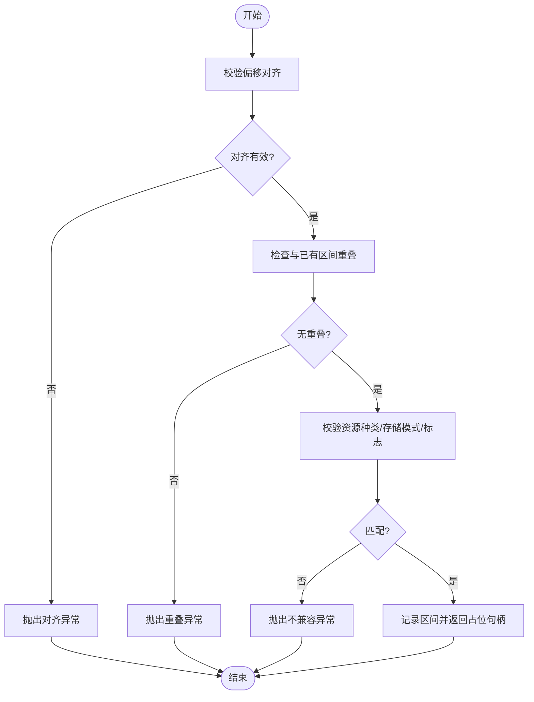
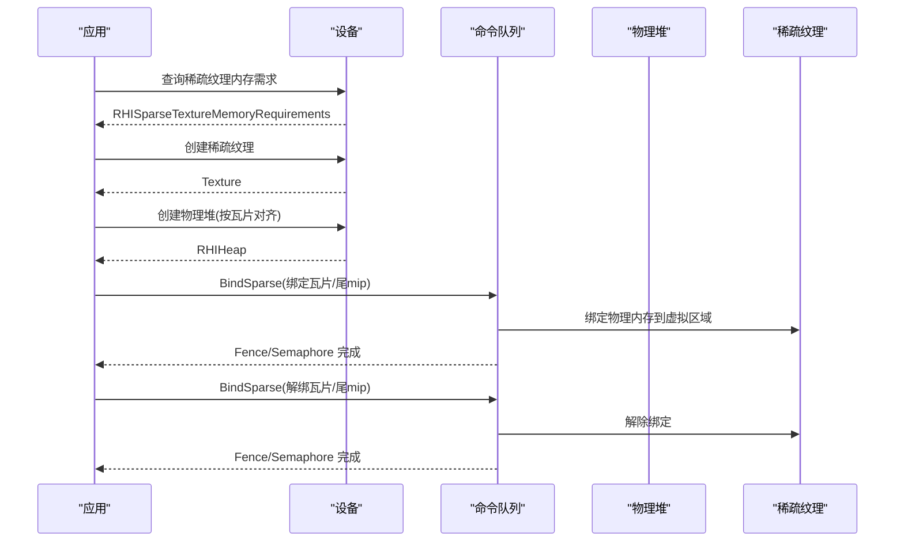
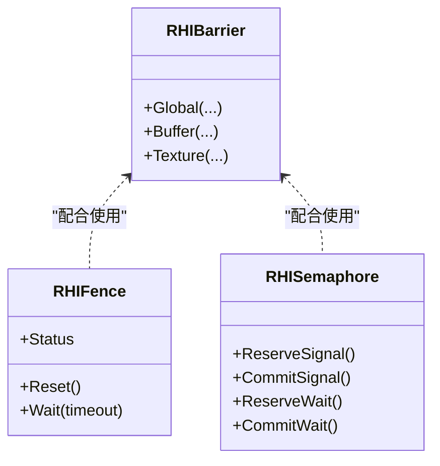
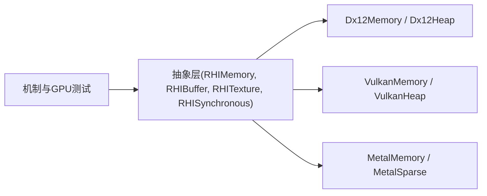

# 内存管理策略

<cite>
**本文引用的文件**
- [RHIMemory.cs](file://src/SharpGPU/Abstract/RHIMemory.cs)
- [Dx12Memory.cs](file://src/SharpGPU/Dx12/Dx12Memory.cs)
- [VulkanMemory.cs](file://src/SharpGPU/Vulkan/VulkanMemory.cs)
- [MetalMemory.cs](file://src/SharpGPU/Metal/MetalMemory.cs)
- [RHIBuffer.cs](file://src/SharpGPU/Abstract/RHIBuffer.cs)
- [RHITexture.cs](file://src/SharpGPU/Abstract/RHITexture.cs)
- [RHISynchronous.cs](file://src/SharpGPU/Abstract/RHISynchronous.cs)
- [SharpGpuMemoryMechanismTests.cs](file://tests/SharpGPU.Conformance.Tests/SharpGpuMemoryMechanismTests.cs)
- [SharpGpuMemoryGpuTests.cs](file://tests/SharpGPU.Conformance.Tests/SharpGpuMemoryGpuTests.cs)
</cite>

## 目录
1. [简介](#简介)
2. [项目结构](#项目结构)
3. [核心组件](#核心组件)
4. [架构总览](#架构总览)
5. [详细组件分析](#详细组件分析)
6. [依赖关系分析](#依赖关系分析)
7. [性能考量](#性能考量)
8. [故障排查指南](#故障排查指南)
9. [结论](#结论)
10. [附录](#附录)

## 简介
本文件系统性阐述 SharpGPU 的内存管理策略，覆盖显存、系统内存与共享内存的区别；智能分配策略（内存池化、对齐要求、生命周期管理）；缓冲区与纹理的内存布局优化；稀疏内存支持（绑定/解绑）；CPU/GPU 数据一致性同步机制；以及内存泄漏防护、性能监控与调试工具使用。文档以抽象 RHI 层为核心，结合 DirectX 12、Vulkan、Metal 后端实现，提供跨平台一致的内存模型与语义。

## 项目结构
SharpGPU 将内存管理分为三层：
- 抽象接口层（Abstract）：定义统一的资源描述符、堆、内存需求、稀疏纹理元数据、屏障与同步原语等。
- 后端实现层（Dx12/Vulkan/Metal）：将抽象语义映射到具体 API 的堆、内存类型、稀疏粒度与预算查询。
- 测试验证层（Conformance Tests）：通过机制与 GPU 级用例验证对齐、重叠、生命周期、稀疏绑定/解绑、预算与驻留能力。

图表来源
- [RHIMemory.cs:23-116](file://src/SharpGPU/Abstract/RHIMemory.cs#L23-L116)
- [Dx12Memory.cs:7-124](file://src/SharpGPU/Dx12/Dx12Memory.cs#L7-L124)
- [VulkanMemory.cs:7-127](file://src/SharpGPU/Vulkan/VulkanMemory.cs#L7-L127)
- [MetalMemory.cs:8-87](file://src/SharpGPU/Metal/MetalMemory.cs#L8-L87)

章节来源
- [RHIMemory.cs:23-116](file://src/SharpGPU/Abstract/RHIMemory.cs#L23-L116)
- [Dx12Memory.cs:7-124](file://src/SharpGPU/Dx12/Dx12Memory.cs#L7-L124)
- [VulkanMemory.cs:7-127](file://src/SharpGPU/Vulkan/VulkanMemory.cs#L7-L127)
- [MetalMemory.cs:8-87](file://src/SharpGPU/Metal/MetalMemory.cs#L8-L87)

## 核心组件
- 资源内存需求与堆
  - RHIResourceMemoryRequirements：封装大小、对齐、存储模式、兼容性掩码与资源种类，确保调用方无需感知后端私有内存类。
  - RHIHeapDescription：基于需求创建堆，强制大小与对齐约束。
  - RHIHeap：持有原生堆并管理放置资源的占用区间，防止重叠与越界，保证析构时无活跃引用。
- 缓冲区与纹理
  - RHIBufferDescriptor/RHITextureDescriptor：统一描述资源尺寸、格式、用途与存储模式。
  - 各后端 Utility：将描述转换为原生对象（Buffer/Image），校验存储模式与维度限制。
- 稀疏纹理
  - RHISparseTextureMemoryRequirements：虚拟大小、瓦片大小/范围、子资源瓦片网格与尾 mip 信息。
  - 绑定/解绑：RHISparseTextureTileBinding 与队列操作 BindSparse，严格参数校验与同步。
- 同步与屏障
  - RHIBarrier：全局/缓冲/纹理屏障，阶段与访问掩码控制数据可见性。
  - RHIFence/RHISemaphore：二进制同步原语，状态机保障信号/等待顺序与回滚。

章节来源
- [RHIMemory.cs:23-116](file://src/SharpGPU/Abstract/RHIMemory.cs#L23-L116)
- [RHIMemory.cs:167-333](file://src/SharpGPU/Abstract/RHIMemory.cs#L167-L333)
- [RHIMemory.cs:459-800](file://src/SharpGPU/Abstract/RHIMemory.cs#L459-L800)
- [RHIBuffer.cs:6-47](file://src/SharpGPU/Abstract/RHIBuffer.cs#L6-L47)
- [RHITexture.cs:39-141](file://src/SharpGPU/Abstract/RHITexture.cs#L39-L141)
- [RHISynchronous.cs:283-510](file://src/SharpGPU/Abstract/RHISynchronous.cs#L283-L510)
- [RHISynchronous.cs:14-176](file://src/SharpGPU/Abstract/RHISynchronous.cs#L14-L176)

## 架构总览
SharpGPU 在抽象层定义统一的内存模型，后端分别实现堆创建、内存类型选择、稀疏瓦片查询与预算/驻留能力暴露。

图表来源
- [RHIMemory.cs:218-333](file://src/SharpGPU/Abstract/RHIMemory.cs#L218-L333)
- [Dx12Memory.cs:318-357](file://src/SharpGPU/Dx12/Dx12Memory.cs#L318-L357)
- [VulkanMemory.cs:539-728](file://src/SharpGPU/Vulkan/VulkanMemory.cs#L539-L728)
- [RHISynchronous.cs:14-176](file://src/SharpGPU/Abstract/RHISynchronous.cs#L14-L176)

## 详细组件分析

### 内存模型与存储模式
- 存储模式
  - GPULocal：GPU 本地显存，适合高频读写与渲染目标。
  - HostUpload/HostRead：系统内存或可映射内存，用于 CPU 上传/读取。
  - Memoryless：仅图像可用（如部分后端），减少显存占用但需频繁重缓冲。
- 后端差异
  - DX12：纹理必须为 GPU Local；堆类型由兼容性位决定（缓冲/非 RT 纹理/RT 纹理）。
  - Vulkan：根据内存属性过滤兼容类型；不支持缓冲器的 Memoryless。
  - Metal：纹理允许 Memoryless；缓存模式根据存储模式设置。

章节来源
- [Dx12Memory.cs:29-71](file://src/SharpGPU/Dx12/Dx12Memory.cs#L29-L71)
- [Dx12Memory.cs:73-124](file://src/SharpGPU/Dx12/Dx12Memory.cs#L73-L124)
- [VulkanMemory.cs:9-31](file://src/SharpGPU/Vulkan/VulkanMemory.cs#L9-L31)
- [VulkanMemory.cs:92-127](file://src/SharpGPU/Vulkan/VulkanMemory.cs#L92-L127)
- [MetalMemory.cs:22-87](file://src/SharpGPU/Metal/MetalMemory.cs#L22-L87)

### 智能内存分配策略
- 内存池化（堆内放置）
  - 通过 RHIHeap 维护已分配区间列表，ReservePlacement 检查对齐、重叠、溢出与资源种类匹配。
  - 释放采用 RAII 风格的 RHIHeapPlacement，避免重复释放与悬挂引用。
- 对齐要求
  - 所有资源与堆偏移必须满足幂次对齐；堆大小也需对齐。
- 生命周期管理
  - 堆析构前检测是否仍有活跃放置资源；若存在则拒绝析构，防止悬垂指针。
  - 测试覆盖并发场景下的析构与预留竞争。

图表来源
- [RHIMemory.cs:218-333](file://src/SharpGPU/Abstract/RHIMemory.cs#L218-L333)
- [RHIMemory.cs:353-457](file://src/SharpGPU/Abstract/RHIMemory.cs#L353-L457)

章节来源
- [RHIMemory.cs:218-333](file://src/SharpGPU/Abstract/RHIMemory.cs#L218-L333)
- [RHIMemory.cs:353-457](file://src/SharpGPU/Abstract/RHIMemory.cs#L353-L457)
- [SharpGpuMemoryMechanismTests.cs:16-81](file://tests/SharpGPU.Conformance.Tests/SharpGpuMemoryMechanismTests.cs#L16-L81)

### 缓冲区与纹理的内存布局优化
- 缓冲区
  - 后端构建 Buffer 描述时校验大小与用途，DX12 与 Vulkan 均对存储模式进行限制。
  - 放置缓冲可在同一堆中复用，降低碎片与分配开销。
- 纹理
  - 纹理维度、Mip 数量、采样数、格式均需后端校验；DX12 要求 GPU Local。
  - 纹理布局转换通过屏障完成，避免不必要的拷贝与状态切换。

章节来源
- [Dx12Memory.cs:13-71](file://src/SharpGPU/Dx12/Dx12Memory.cs#L13-L71)
- [VulkanMemory.cs:33-90](file://src/SharpGPU/Vulkan/VulkanMemory.cs#L33-L90)
- [MetalMemory.cs:22-87](file://src/SharpGPU/Metal/MetalMemory.cs#L22-L87)
- [RHISynchronous.cs:330-510](file://src/SharpGPU/Abstract/RHISynchronous.cs#L330-L510)

### 稀疏内存（Sparse Memory）支持
- 能力与限制
  - DX12：仅支持颜色面、单采样、特定维度；瓦片大小固定。
  - Vulkan：需启用 SparseBinding/SparseResidency；粒度与尾 mip 由设备报告。
  - Metal：Placement Sparse，需设备支持 Placement Sparse 与对应瓦片几何。
- 查询与绑定
  - 查询 RHISparseTextureMemoryRequirements，获取虚拟大小、瓦片大小/范围、子资源瓦片网格与尾 mip。
  - 通过队列 BindSparse 提交绑定/解绑指令，配合 Fence/Semaphore 同步。

图表来源
- [Dx12Memory.cs:130-312](file://src/SharpGPU/Dx12/Dx12Memory.cs#L130-L312)
- [VulkanMemory.cs:133-370](file://src/SharpGPU/Vulkan/VulkanMemory.cs#L133-L370)
- [MetalMemory.cs:92-354](file://src/SharpGPU/Metal/MetalMemory.cs#L92-L354)
- [RHIMemory.cs:459-800](file://src/SharpGPU/Abstract/RHIMemory.cs#L459-L800)

章节来源
- [Dx12Memory.cs:130-312](file://src/SharpGPU/Dx12/Dx12Memory.cs#L130-L312)
- [VulkanMemory.cs:133-370](file://src/SharpGPU/Vulkan/VulkanMemory.cs#L133-L370)
- [MetalMemory.cs:92-354](file://src/SharpGPU/Metal/MetalMemory.cs#L92-L354)
- [RHIMemory.cs:459-800](file://src/SharpGPU/Abstract/RHIMemory.cs#L459-L800)
- [SharpGpuMemoryGpuTests.cs:263-388](file://tests/SharpGPU.Conformance.Tests/SharpGpuMemoryGpuTests.cs#L263-L388)

### 内存同步机制与数据一致性
- 屏障
  - 全局/缓冲/纹理屏障，指定阶段与访问掩码，确保读写顺序与可见性。
  - 队列所有权转移需成对指定源/目的队列，并在正确队列上记录。
- Fence/Semaphore
  - 二进制同步原语，状态机保证信号/等待顺序，支持回滚与重置。
  - 稀疏绑定/解绑可通过 Fence 确认完成。

图表来源
- [RHISynchronous.cs:283-510](file://src/SharpGPU/Abstract/RHISynchronous.cs#L283-L510)
- [RHISynchronous.cs:14-176](file://src/SharpGPU/Abstract/RHISynchronous.cs#L14-L176)

章节来源
- [RHISynchronous.cs:283-510](file://src/SharpGPU/Abstract/RHISynchronous.cs#L283-L510)
- [RHISynchronous.cs:14-176](file://src/SharpGPU/Abstract/RHISynchronous.cs#L14-L176)

### 内存预算与驻留
- 预算查询
  - Vulkan 通过扩展查询内存预算与使用量；不可用时报错。
  - 抽象层暴露 RHIMemoryBudget，包含预算、使用与剩余空间。
- 驻留控制
  - DX12 支持驻留/驱逐请求，通过 Fence 同步；其他后端可能不可用。

章节来源
- [VulkanMemory.cs:376-533](file://src/SharpGPU/Vulkan/VulkanMemory.cs#L376-L533)
- [RHIMemory.cs:118-165](file://src/SharpGPU/Abstract/RHIMemory.cs#L118-L165)
- [SharpGpuMemoryGpuTests.cs:153-260](file://tests/SharpGPU.Conformance.Tests/SharpGpuMemoryGpuTests.cs#L153-L260)

## 依赖关系分析
- 耦合与内聚
  - 抽象层高内聚：内存需求、堆、屏障与同步原语集中定义，便于跨后端复用。
  - 后端低耦合：每个后端独立实现 Utility 与 Heap，屏蔽细节差异。
- 外部依赖
  - Vortice.Direct3D12、Vortice.Vulkan、Metal 原生库。
- 循环依赖
  - 抽象层不依赖后端；后端依赖抽象层接口，无环。

图表来源
- [RHIMemory.cs:23-116](file://src/SharpGPU/Abstract/RHIMemory.cs#L23-L116)
- [Dx12Memory.cs:7-124](file://src/SharpGPU/Dx12/Dx12Memory.cs#L7-L124)
- [VulkanMemory.cs:7-127](file://src/SharpGPU/Vulkan/VulkanMemory.cs#L7-L127)
- [MetalMemory.cs:8-87](file://src/SharpGPU/Metal/MetalMemory.cs#L8-L87)

章节来源
- [RHIMemory.cs:23-116](file://src/SharpGPU/Abstract/RHIMemory.cs#L23-L116)
- [Dx12Memory.cs:7-124](file://src/SharpGPU/Dx12/Dx12Memory.cs#L7-L124)
- [VulkanMemory.cs:7-127](file://src/SharpGPU/Vulkan/VulkanMemory.cs#L7-L127)
- [MetalMemory.cs:8-87](file://src/SharpGPU/Metal/MetalMemory.cs#L8-L87)

## 性能考量
- 堆内放置减少分配次数与碎片，提升批量资源创建效率。
- 纹理布局转换通过屏障最小化状态切换成本。
- 稀疏纹理按需绑定瓦片，降低峰值显存占用。
- 预算查询辅助应用侧做内存压力感知与降级策略。
- 合理选择存储模式：GPU Local 用于渲染路径，HostUpload/HostRead 用于 CPU 交互。

[本节为通用指导，不直接分析具体文件]

## 故障排查指南
- 常见错误与定位
  - 对齐失败：检查偏移与堆大小是否为要求的幂次对齐。
  - 重叠冲突：确认放置区间未与已有区间重叠。
  - 资源种类不匹配：缓冲与纹理不可混用同一堆。
  - 稀疏绑定参数错误：确保 Aspect、Mip、ArrayLayer、TileExtent 合法。
  - 同步状态错误：Fence/Semaphore 需在正确状态下使用，避免重复提交。
- 调试建议
  - 使用 Fence 等待稀疏绑定/解绑完成，定位异步问题。
  - 利用预算查询判断显存压力，必要时降低分辨率或 Mip 层级。
  - 通过屏障明确阶段与访问掩码，避免数据竞争导致的渲染异常。

章节来源
- [RHIMemory.cs:218-333](file://src/SharpGPU/Abstract/RHIMemory.cs#L218-L333)
- [RHIMemory.cs:459-800](file://src/SharpGPU/Abstract/RHIMemory.cs#L459-L800)
- [RHISynchronous.cs:283-510](file://src/SharpGPU/Abstract/RHISynchronous.cs#L283-L510)
- [SharpGpuMemoryMechanismTests.cs:16-81](file://tests/SharpGPU.Conformance.Tests/SharpGpuMemoryMechanismTests.cs#L16-L81)
- [SharpGpuMemoryGpuTests.cs:263-388](file://tests/SharpGPU.Conformance.Tests/SharpGpuMemoryGpuTests.cs#L263-L388)

## 结论
SharpGPU 通过抽象 RHI 层统一了内存模型与同步语义，后端各自实现堆、内存类型、稀疏瓦片与预算能力。其智能分配策略（堆内放置、严格对齐、RAII 生命周期）与稀疏内存支持，兼顾了性能与灵活性。屏障与同步原语确保 CPU/GPU 数据一致性。借助预算查询与驻留控制，应用可实现更稳健的内存管理与自适应渲染。

[本节为总结，不直接分析具体文件]

## 附录
- 关键数据结构速查
  - RHIResourceMemoryRequirements：Size、Alignment、StorageMode、CompatibilityMask、ResourceKind。
  - RHIHeapDescription：Size、Compatibility。
  - RHISparseTextureMemoryRequirements：VirtualSizeBytes、TileSizeBytes、TileExtent、Subresources、MipTails。
  - RHIBufferDescriptor/RHITextureDescriptor：ByteSize/Extent、Format、UsageFlag、StorageMode、Dimension。
  - RHIBarrier：Global/Buffer/Texture，StageBefore/After、AccessBefore/After。
  - RHIFence/RHISemaphore：状态机方法（Reserve/Commit/Rollback/Wait/Reset）。

章节来源
- [RHIMemory.cs:23-116](file://src/SharpGPU/Abstract/RHIMemory.cs#L23-L116)
- [RHIMemory.cs:459-800](file://src/SharpGPU/Abstract/RHIMemory.cs#L459-L800)
- [RHIBuffer.cs:6-47](file://src/SharpGPU/Abstract/RHIBuffer.cs#L6-L47)
- [RHITexture.cs:39-141](file://src/SharpGPU/Abstract/RHITexture.cs#L39-L141)
- [RHISynchronous.cs:283-510](file://src/SharpGPU/Abstract/RHISynchronous.cs#L283-L510)
- [RHISynchronous.cs:14-176](file://src/SharpGPU/Abstract/RHISynchronous.cs#L14-L176)