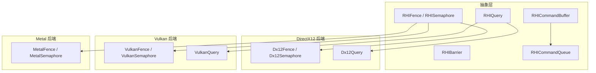
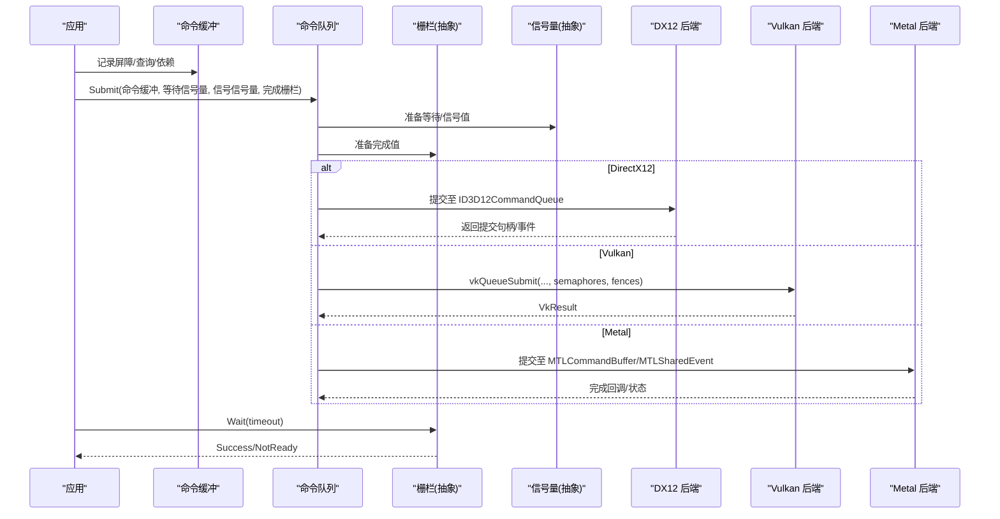
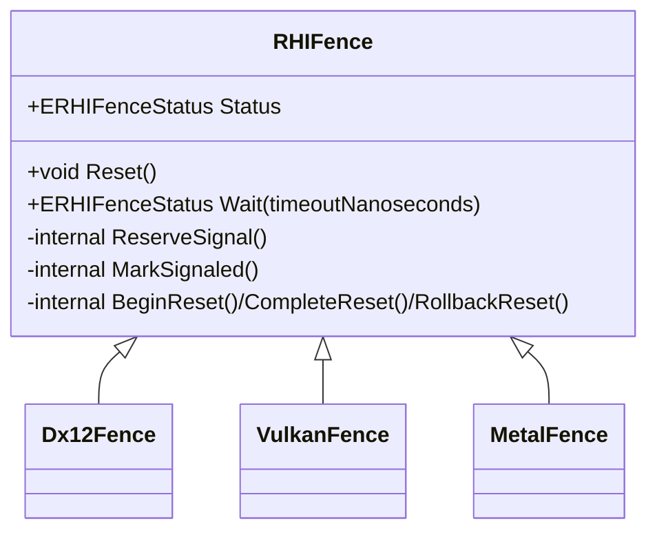
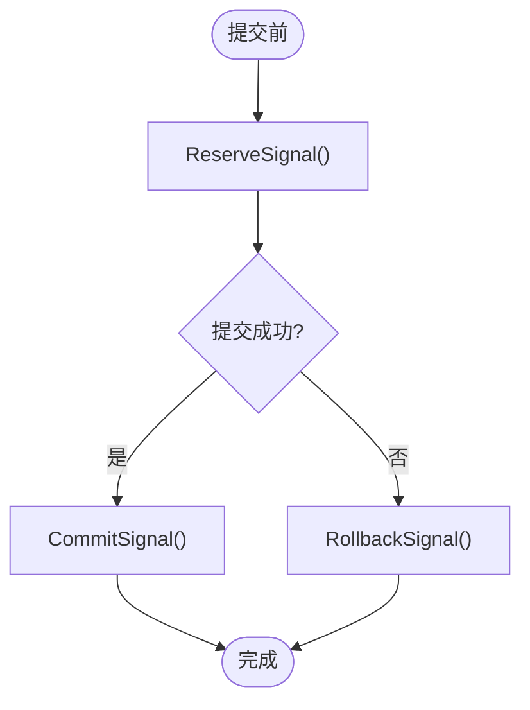
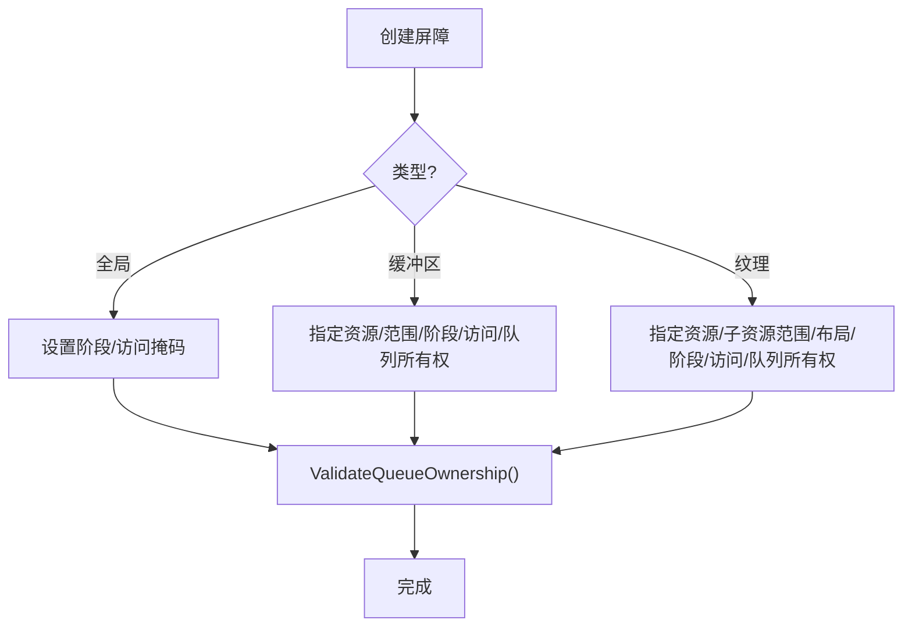
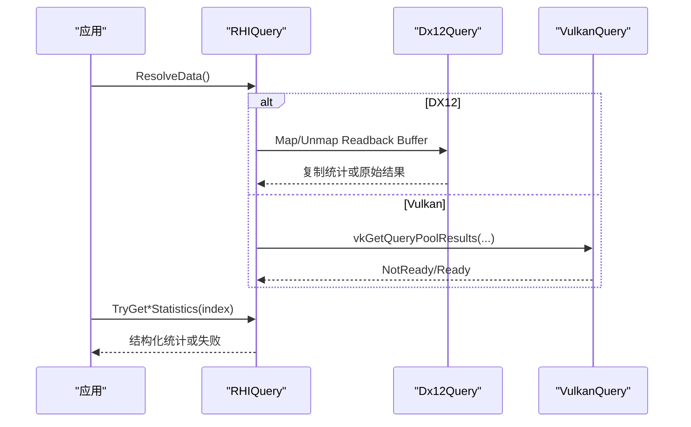
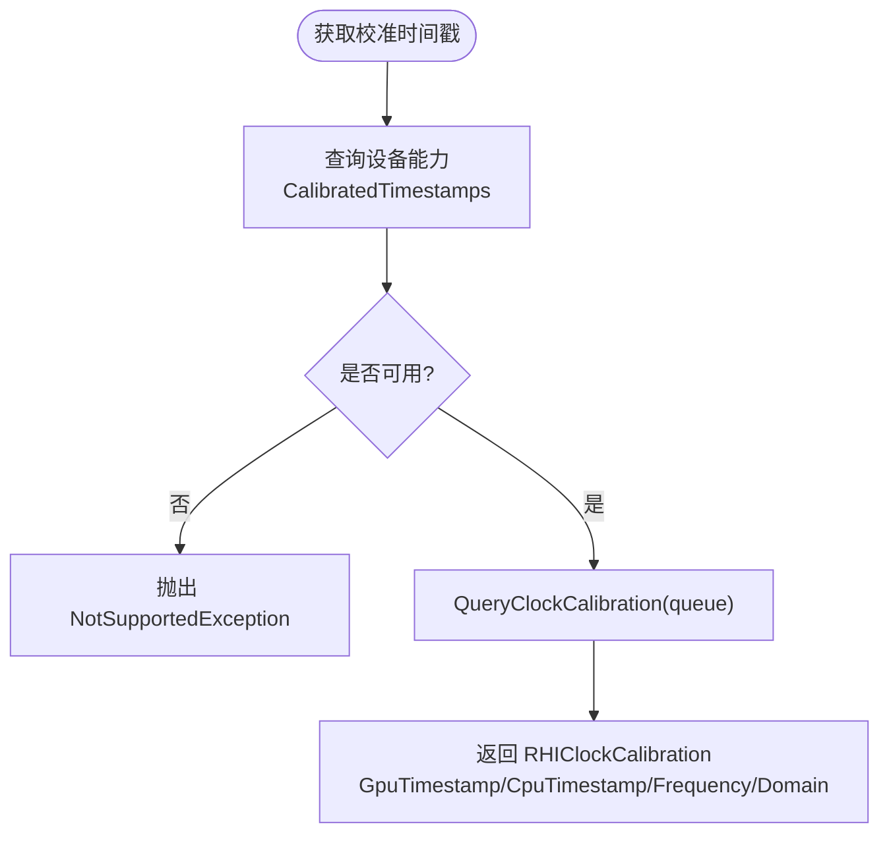
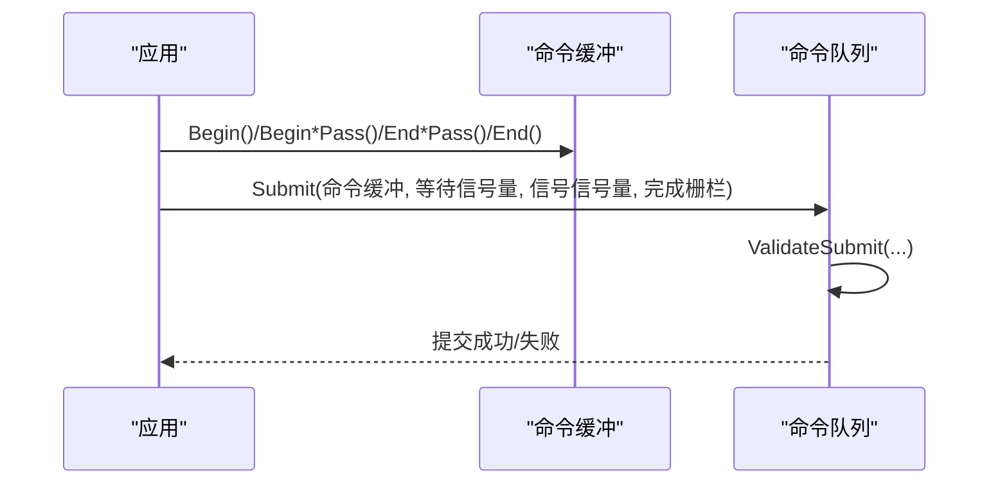
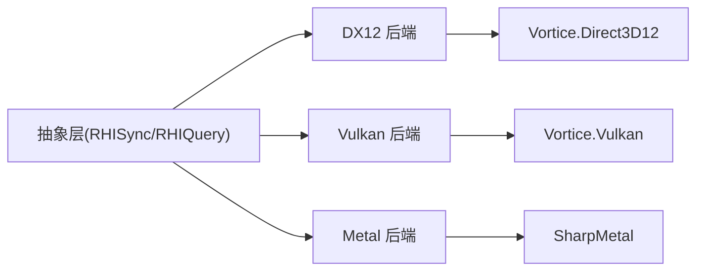

# 同步机制

<cite>
**本文引用的文件**
- [RHISynchronous.cs](file://src/SharpGPU/Abstract/RHISynchronous.cs)
- [RHIQuery.cs](file://src/SharpGPU/Abstract/RHIQuery.cs)
- [Dx12Synchronous.cs](file://src/SharpGPU/Dx12/Dx12Synchronous.cs)
- [VulkanSynchronous.cs](file://src/SharpGPU/Vulkan/VulkanSynchronous.cs)
- [MetalSynchronous.cs](file://src/SharpGPU/Metal/MetalSynchronous.cs)
- [Dx12Query.cs](file://src/SharpGPU/Dx12/Dx12Query.cs)
- [VulkanQuery.cs](file://src/SharpGPU/Vulkan/VulkanQuery.cs)
- [RHICommandBuffer.cs](file://src/SharpGPU/Abstract/RHICommandBuffer.cs)
- [RHICommandQueue.cs](file://src/SharpGPU/Abstract/RHICommandQueue.cs)
- [CalibratedTimestampPortableContractTests.cs](file://tests/SharpGPU.Conformance.Tests/CalibratedTimestampPortableContractTests.cs)
</cite>

## 目录
1. [简介](#简介)
2. [项目结构](#项目结构)
3. [核心组件](#核心组件)
4. [架构总览](#架构总览)
5. [详细组件分析](#详细组件分析)
6. [依赖关系分析](#依赖关系分析)
7. [性能考虑](#性能考虑)
8. [故障排查指南](#故障排查指南)
9. [结论](#结论)
10. [附录](#附录)

## 简介
本文件系统性阐述 SharpGPU 的 GPU 同步机制，覆盖栅栏（Fence）、信号量（Semaphore）与屏障（Barrier）等基础概念；介绍查询系统（Query System）的时间戳、遮挡与管线统计查询；说明校准时间戳（Calibrated Timestamps）的实现与使用；解释资源依赖关系管理与执行顺序保证；给出多线程环境下的同步策略与避免竞态/死锁的实践；并提供同步性能优化与调试技巧。

## 项目结构
SharpGPU 将同步相关能力抽象在 Abstract 层，并在各后端（DirectX12、Vulkan、Metal）提供具体实现：
- 抽象层：定义统一的 Fence/Semaphore/Barrier/Query 接口与状态机，确保跨后端一致的行为与错误语义。
- 后端层：分别对接原生 API（ID3D12Fence、VkFence/VkSemaphore、MTLSharedEvent），封装等待、提交、结果解析等细节。
- 命令缓冲与队列：通过命令缓冲状态机与队列提交描述符，组织等待/信号/完成栅栏的提交顺序。

图表来源
- [RHISynchronous.cs:14-280](file://src/SharpGPU/Abstract/RHISynchronous.cs#L14-L280)
- [RHIQuery.cs:178-446](file://src/SharpGPU/Abstract/RHIQuery.cs#L178-L446)
- [Dx12Synchronous.cs:8-199](file://src/SharpGPU/Dx12/Dx12Synchronous.cs#L8-L199)
- [VulkanSynchronous.cs:7-155](file://src/SharpGPU/Vulkan/VulkanSynchronous.cs#L7-L155)
- [MetalSynchronous.cs:11-168](file://src/SharpGPU/Metal/MetalSynchronous.cs#L11-L168)
- [Dx12Query.cs:7-316](file://src/SharpGPU/Dx12/Dx12Query.cs#L7-L316)
- [VulkanQuery.cs:6-385](file://src/SharpGPU/Vulkan/VulkanQuery.cs#L6-L385)
- [RHICommandBuffer.cs:26-193](file://src/SharpGPU/Abstract/RHICommandBuffer.cs#L26-L193)
- [RHICommandQueue.cs:60-200](file://src/SharpGPU/Abstract/RHICommandQueue.cs#L60-L200)

章节来源
- [RHISynchronous.cs:14-280](file://src/SharpGPU/Abstract/RHISynchronous.cs#L14-L280)
- [RHICommandBuffer.cs:26-193](file://src/SharpGPU/Abstract/RHICommandBuffer.cs#L26-L193)
- [RHICommandQueue.cs:60-200](file://src/SharpGPU/Abstract/RHICommandQueue.cs#L60-L200)

## 核心组件
- 栅栏（RHIFence）：用于“一次性”完成通知，支持状态检查、重置、带超时等待；内部以原子状态机管理 Ready/Pending/Signaled/Resetting 生命周期，防止重复提交或非法等待。
- 信号量（RHISemaphore）：二进制信号量，支持 Reserve/Commit/Rollback 的成对操作，用于跨队列/跨命令缓冲的有序依赖。
- 屏障（RHIBarrier）：描述资源在阶段与访问模式之间的转换，包括全局、缓冲区与纹理三种类型，并校验队列所有权转移。
- 查询（RHIQuery）：统一抽象时间戳、遮挡、管线统计三类查询，提供结果解析与域特定的统计读取方法。
- 命令缓冲与队列：命令缓冲维护录制/可执行/已提交状态；队列提交描述符组合命令缓冲、等待/信号信号量与完成栅栏，形成完整的提交语义。

章节来源
- [RHISynchronous.cs:14-280](file://src/SharpGPU/Abstract/RHISynchronous.cs#L14-L280)
- [RHISynchronous.cs:283-661](file://src/SharpGPU/Abstract/RHISynchronous.cs#L283-L661)
- [RHIQuery.cs:178-446](file://src/SharpGPU/Abstract/RHIQuery.cs#L178-L446)
- [RHICommandBuffer.cs:26-193](file://src/SharpGPU/Abstract/RHICommandBuffer.cs#L26-L193)
- [RHICommandQueue.cs:6-200](file://src/SharpGPU/Abstract/RHICommandQueue.cs#L6-L200)

## 架构总览
下图展示从应用到后端的同步调用链：上层通过命令缓冲记录屏障、查询与资源依赖；队列提交时绑定等待/信号信号量与完成栅栏；后端将请求映射为原生同步原语。

图表来源
- [RHICommandQueue.cs:25-200](file://src/SharpGPU/Abstract/RHICommandQueue.cs#L25-L200)
- [Dx12Synchronous.cs:8-199](file://src/SharpGPU/Dx12/Dx12Synchronous.cs#L8-L199)
- [VulkanSynchronous.cs:7-155](file://src/SharpGPU/Vulkan/VulkanSynchronous.cs#L7-L155)
- [MetalSynchronous.cs:11-168](file://src/SharpGPU/Metal/MetalSynchronous.cs#L11-L168)

## 详细组件分析

### 栅栏（Fence）
- 抽象行为：状态机驱动，禁止在未就绪时等待或重复提交；支持 Reset 的原子化开始/完成/回滚；Wait 支持超时。
- 后端实现：
  - DirectX12：基于 ID3D12Fence + AutoResetEvent，轮询 CompletedValue 或通过 SetEventOnCompletion 等待。
  - Vulkan：vkGetFenceStatus/vkWaitForFences，处理 Timeout/Success/其他错误。
  - Metal：基于 MTLSharedEvent，按目标值等待并标记完成。

图表来源
- [RHISynchronous.cs:14-176](file://src/SharpGPU/Abstract/RHISynchronous.cs#L14-L176)
- [Dx12Synchronous.cs:8-149](file://src/SharpGPU/Dx12/Dx12Synchronous.cs#L8-L149)
- [VulkanSynchronous.cs:7-122](file://src/SharpGPU/Vulkan/VulkanSynchronous.cs#L7-L122)
- [MetalSynchronous.cs:11-130](file://src/SharpGPU/Metal/MetalSynchronous.cs#L11-L130)

章节来源
- [RHISynchronous.cs:14-176](file://src/SharpGPU/Abstract/RHISynchronous.cs#L14-L176)
- [Dx12Synchronous.cs:8-149](file://src/SharpGPU/Dx12/Dx12Synchronous.cs#L8-L149)
- [VulkanSynchronous.cs:7-122](file://src/SharpGPU/Vulkan/VulkanSynchronous.cs#L7-L122)
- [MetalSynchronous.cs:11-130](file://src/SharpGPU/Metal/MetalSynchronous.cs#L11-L130)

### 信号量（Semaphore）
- 抽象行为：二进制信号量，Reserve/Commit/Rollback 成对使用，确保一次提交只消费一次信号；Wait 同样具备 Reserve/Commit/Rollback 流程。
- 后端实现：
  - DirectX12：复用 ID3D12Fence 作为二进制信号量载体。
  - Vulkan：VkSemaphore，配合 vkQueueSubmit 的 wait/signal 数组。
  - Metal：MTLSharedEvent，按值比较等待。

图表来源
- [RHISynchronous.cs:178-280](file://src/SharpGPU/Abstract/RHISynchronous.cs#L178-L280)
- [Dx12Synchronous.cs:151-199](file://src/SharpGPU/Dx12/Dx12Synchronous.cs#L151-L199)
- [VulkanSynchronous.cs:125-155](file://src/SharpGPU/Vulkan/VulkanSynchronous.cs#L125-L155)
- [MetalSynchronous.cs:132-168](file://src/SharpGPU/Metal/MetalSynchronous.cs#L132-L168)

章节来源
- [RHISynchronous.cs:178-280](file://src/SharpGPU/Abstract/RHISynchronous.cs#L178-L280)
- [Dx12Synchronous.cs:151-199](file://src/SharpGPU/Dx12/Dx12Synchronous.cs#L151-L199)
- [VulkanSynchronous.cs:125-155](file://src/SharpGPU/Vulkan/VulkanSynchronous.cs#L125-L155)
- [MetalSynchronous.cs:132-168](file://src/SharpGPU/Metal/MetalSynchronous.cs#L132-L168)

### 屏障（Barriers）与资源依赖
- 阶段与访问掩码：ERHIStageMask 与 ERHIAccessMask 精确描述读写阶段与访问模式。
- 屏障类型：全局、缓冲区、纹理；纹理支持子资源范围与布局转换。
- 队列所有权转移：校验源/目的队列必须不同且合法，录制队列必须属于源或目的之一。
- 工具函数：自动推断纹理 aspect、生成全尺寸子资源范围、逻辑队列类型转阶段掩码。

图表来源
- [RHISynchronous.cs:283-661](file://src/SharpGPU/Abstract/RHISynchronous.cs#L283-L661)

章节来源
- [RHISynchronous.cs:283-661](file://src/SharpGPU/Abstract/RHISynchronous.cs#L283-L661)

### 查询系统（Query System）
- 抽象接口：统一 RHIQuery，支持时间戳、遮挡、管线统计三类查询；提供 TryGetRasterStatistics/TryGetComputeStatistics/TryGetRayTracingStatistics 安全读取。
- 结果解析：ResolveData 将后端结果拷贝到统一结构；统计查询按域分配专用数组。
- 后端差异：
  - DirectX12：QueryHeap + Readback Buffer，区分 PipelineStatistics 与 PipelineStatistics1（含 Mesh/Task）。
  - Vulkan：QueryPool + vkGetQueryPoolResults，按启用计数器打包/解包。

图表来源
- [RHIQuery.cs:178-446](file://src/SharpGPU/Abstract/RHIQuery.cs#L178-L446)
- [Dx12Query.cs:7-316](file://src/SharpGPU/Dx12/Dx12Query.cs#L7-L316)
- [VulkanQuery.cs:6-385](file://src/SharpGPU/Vulkan/VulkanQuery.cs#L6-L385)

章节来源
- [RHIQuery.cs:178-446](file://src/SharpGPU/Abstract/RHIQuery.cs#L178-L446)
- [Dx12Query.cs:7-316](file://src/SharpGPU/Dx12/Dx12Query.cs#L7-L316)
- [VulkanQuery.cs:6-385](file://src/SharpGPU/Vulkan/VulkanQuery.cs#L6-L385)

### 校准时间戳（Calibrated Timestamps）
- 能力探测：设备能力暴露 CalibratedTimestamps，包含时间域、频率与最大偏差限制。
- 查询接口：device.QueryClockCalibration(queueType) 返回 RHIClockCalibration，包含 GPU/CPU 时间戳、频率、时间域、队列信息。
- 后端差异：
  - DirectX12：基于 GetClockCalibration，时间域为 QueryPerformanceCounter，无最大偏差输出。
  - Vulkan：基于 VK_EXT_calibrated_timestamps 或 VK_KHR_calibrated_timestamps，报告最大偏差。
- 测试验证：端口化测试断言能力存在、构造参数校验、不可用抛异常、可用时返回有效频率与时间域。

图表来源
- [RHIQuery.cs:21-85](file://src/SharpGPU/Abstract/RHIQuery.cs#L21-L85)
- [CalibratedTimestampPortableContractTests.cs:69-191](file://tests/SharpGPU.Conformance.Tests/CalibratedTimestampPortableContractTests.cs#L69-L191)

章节来源
- [RHIQuery.cs:21-85](file://src/SharpGPU/Abstract/RHIQuery.cs#L21-L85)
- [CalibratedTimestampPortableContractTests.cs:69-191](file://tests/SharpGPU.Conformance.Tests/CalibratedTimestampPortableContractTests.cs#L69-L191)

### 命令缓冲与队列提交中的同步
- 命令缓冲状态机：Initial → Recording → Executable → Submitted，严格约束 Begin/End/Submit 顺序。
- 队列提交描述符：组合命令缓冲、等待/信号信号量与完成栅栏；提交前校验非空工作/同步、唯一性与所属队列。
- 阶段掩码校验：等待信号量的 StageMask 必须为已知集合的子集，防止未知位导致未定义行为。

图表来源
- [RHICommandBuffer.cs:26-193](file://src/SharpGPU/Abstract/RHICommandBuffer.cs#L26-L193)
- [RHICommandQueue.cs:6-200](file://src/SharpGPU/Abstract/RHICommandQueue.cs#L6-L200)

章节来源
- [RHICommandBuffer.cs:26-193](file://src/SharpGPU/Abstract/RHICommandBuffer.cs#L26-L193)
- [RHICommandQueue.cs:6-200](file://src/SharpGPU/Abstract/RHICommandQueue.cs#L6-L200)

## 依赖关系分析
- 耦合与内聚：抽象层高内聚地封装同步语义；后端低耦合地实现具体 API 调用；命令缓冲/队列负责编排。
- 直接/间接依赖：
  - 抽象层依赖 Disposal 基类与通用枚举/结构。
  - 后端依赖各自原生库（Vortice.Direct3D12、Vortice.Vulkan、SharpMetal）。
  - 查询系统依赖设备能力与后端特性（如 Statistics1）。
- 循环依赖：无循环引用，分层清晰。
- 外部集成点：原生同步原语（Fence/Semaphore/Event/QueryPool）。

图表来源
- [RHISynchronous.cs:14-280](file://src/SharpGPU/Abstract/RHISynchronous.cs#L14-L280)
- [RHIQuery.cs:178-446](file://src/SharpGPU/Abstract/RHIQuery.cs#L178-L446)
- [Dx12Synchronous.cs:8-199](file://src/SharpGPU/Dx12/Dx12Synchronous.cs#L8-L199)
- [VulkanSynchronous.cs:7-155](file://src/SharpGPU/Vulkan/VulkanSynchronous.cs#L7-L155)
- [MetalSynchronous.cs:11-168](file://src/SharpGPU/Metal/MetalSynchronous.cs#L11-L168)

章节来源
- [RHISynchronous.cs:14-280](file://src/SharpGPU/Abstract/RHISynchronous.cs#L14-L280)
- [RHIQuery.cs:178-446](file://src/SharpGPU/Abstract/RHIQuery.cs#L178-L446)
- [Dx12Synchronous.cs:8-199](file://src/SharpGPU/Dx12/Dx12Synchronous.cs#L8-L199)
- [VulkanSynchronous.cs:7-155](file://src/SharpGPU/Vulkan/VulkanSynchronous.cs#L7-L155)
- [MetalSynchronous.cs:11-168](file://src/SharpGPU/Metal/MetalSynchronous.cs#L11-L168)

## 性能考虑
- 减少不必要的屏障粒度：尽量合并相邻屏障，避免过度细分导致流水线停顿。
- 合理使用查询：统计查询仅在需要时启用对应计数器，降低开销；时间戳查询注意分辨率与代价。
- 批量提交与延迟解析：将多个命令缓冲与同步原语合并提交；查询结果按需延迟解析，避免频繁 CPU-GPU 同步。
- 选择合适的时间域：校准时间戳优先使用后端提供的稳定时间域（如 QueryPerformanceCounter 或扩展），避免平台差异带来的抖动。
- 避免忙等：Wait 使用阻塞式等待（事件/内核对象），合理设置超时，避免 CPU 空转。

[本节为通用指导，不直接分析具体文件]

## 故障排查指南
- 栅栏状态异常：
  - 未就绪即等待：检查是否在提交前调用 Wait；确认已完成 ReserveSignal 并正确提交。
  - 重复提交：确保每次提交前栅栏处于 Ready；若失败，检查 Reserve/Commit 配对。
- 信号量重复消费：
  - 同一信号量在同一提交中多次等待/信号会被拒绝；确保每个信号量仅出现一次。
- 屏障队列所有权错误：
  - 源/目的队列必须不同且录制队列必须是其中之一；否则抛出参数异常。
- 查询结果未就绪：
  - ResolveData 可能返回 NotReady；需重试或在后续帧再取；统计查询需确保域匹配。
- 校准时间戳不可用：
  - 能力不可用时调用会抛异常；先检查设备能力，再决定是否使用该功能。

章节来源
- [RHISynchronous.cs:14-176](file://src/SharpGPU/Abstract/RHISynchronous.cs#L14-L176)
- [RHISynchronous.cs:178-280](file://src/SharpGPU/Abstract/RHISynchronous.cs#L178-L280)
- [RHISynchronous.cs:512-661](file://src/SharpGPU/Abstract/RHISynchronous.cs#L512-L661)
- [RHIQuery.cs:208-309](file://src/SharpGPU/Abstract/RHIQuery.cs#L208-L309)
- [CalibratedTimestampPortableContractTests.cs:69-191](file://tests/SharpGPU.Conformance.Tests/CalibratedTimestampPortableContractTests.cs#L69-L191)

## 结论
SharpGPU 通过抽象层统一了 GPU 同步语义，并以稳健的状态机与严格的参数校验保障跨后端一致性。栅栏与信号量提供完成通知与有序依赖；屏障确保资源访问的正确时序；查询系统支持性能分析与测量；校准时间戳为精确计时提供可靠基础。结合命令缓冲与队列提交的编排，开发者可在多线程环境下安全高效地构建复杂渲染与计算管线。

[本节为总结性内容，不直接分析具体文件]

## 附录
- 关键枚举与结构参考：
  - 阶段与访问掩码：ERHIStageMask、ERHIAccessMask
  - 屏障类型：RHIGlobalBarrier、RHIBufferBarrier、RHITextureBarrier、RHIBarrier
  - 查询描述与统计：RHIQueryDescriptor、RHIRasterPipelineStatistics、RHIComputePipelineStatistics、RHIRayTracingPipelineStatistics
  - 校准时间戳：RHIClockCalibration、ERHITimeDomain
  - 队列提交：RHIQueueSubmitDescriptor、RHIQueueSemaphoreWait

[本节为参考性内容，不直接分析具体文件]