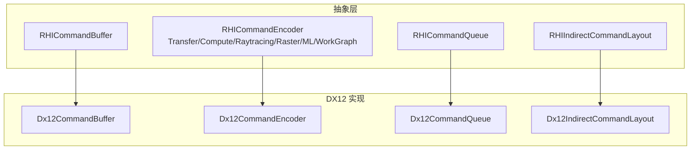
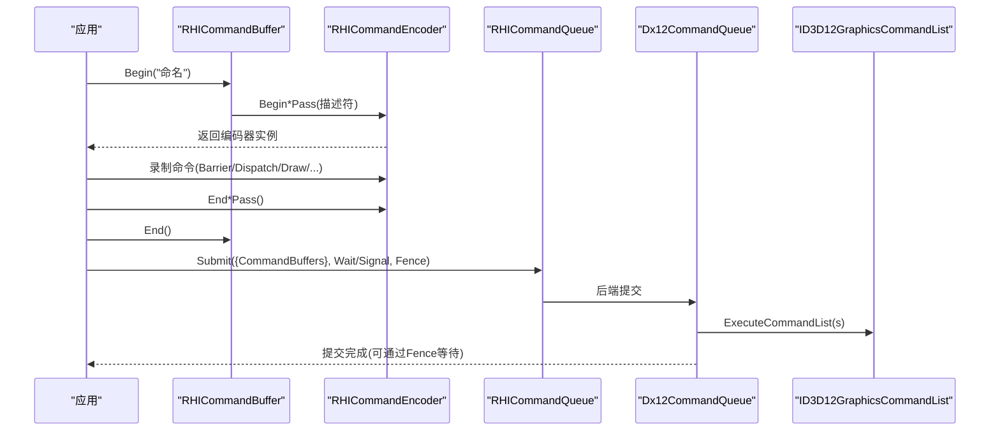
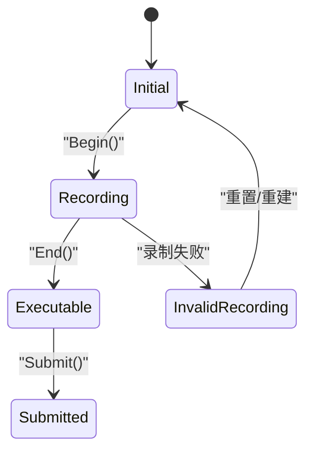
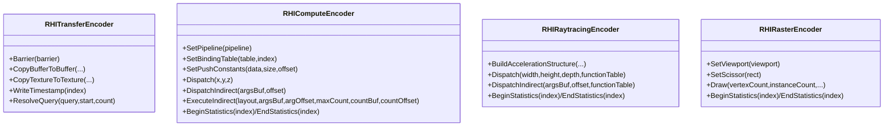
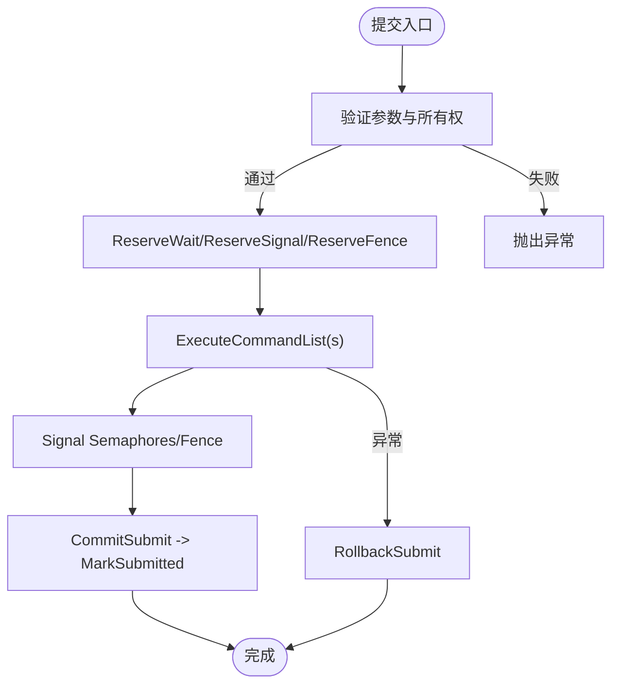
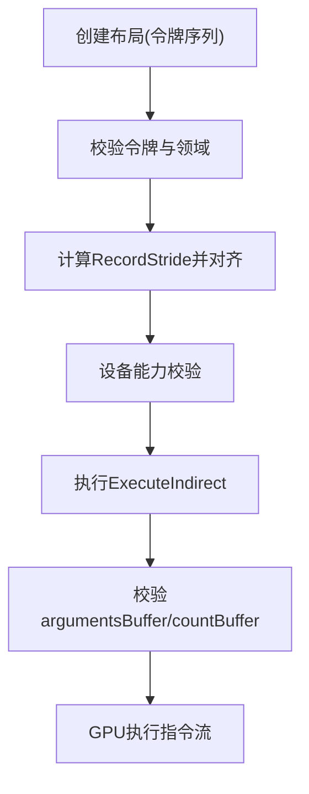
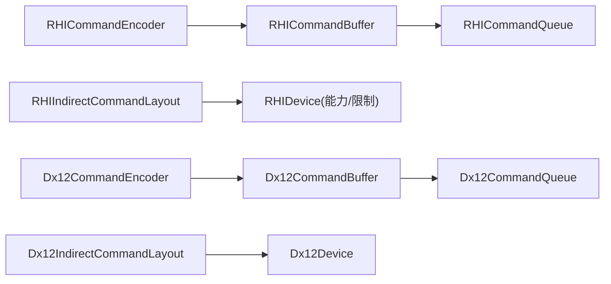
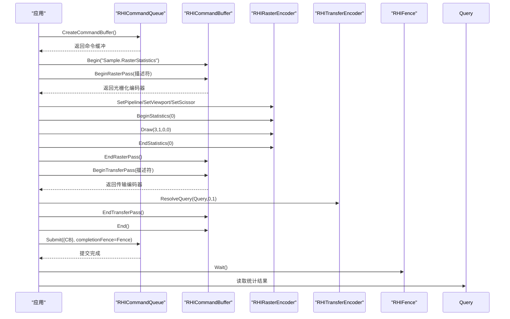

# 命令缓冲系统

<cite>
**本文引用的文件**
- [RHICommandBuffer.cs](file://src/SharpGPU/Abstract/RHICommandBuffer.cs)
- [RHICommandEncoder.cs](file://src/SharpGPU/Abstract/RHICommandEncoder.cs)
- [RHICommandQueue.cs](file://src/SharpGPU/Abstract/RHICommandQueue.cs)
- [RHIIndirectCommandLayout.cs](file://src/SharpGPU/Abstract/RHIIndirectCommandLayout.cs)
- [Dx12CommandBuffer.cs](file://src/SharpGPU/Dx12/Dx12CommandBuffer.cs)
- [Dx12CommandEncoder.cs](file://src/SharpGPU/Dx12/Dx12CommandEncoder.cs)
- [Dx12CommandQueue.cs](file://src/SharpGPU/Dx12/Dx12CommandQueue.cs)
- [Dx12IndirectCommandLayout.cs](file://src/SharpGPU/Dx12/Dx12IndirectCommandLayout.cs)
- [RasterWorkload.cs](file://samples/ComputeAndDraw/RasterWorkload.cs)
</cite>

## 目录
1. [简介](#简介)
2. [项目结构](#项目结构)
3. [核心组件](#核心组件)
4. [架构总览](#架构总览)
5. [详细组件分析](#详细组件分析)
6. [依赖关系分析](#依赖关系分析)
7. [性能与批处理优化](#性能与批处理优化)
8. [故障排查与调试](#故障排查与调试)
9. [结论](#结论)
10. [附录：端到端流程示例](#附录端到端流程示例)

## 简介
本文件系统性说明 SharpGPU 的命令缓冲系统，覆盖命令录制、状态管理、执行流程；命令编码器（计算、光栅化、光线追踪）的录制方式；命令队列的异步提交与顺序控制；间接命令缓冲以减少 CPU 开销；以及命令批处理与优化策略。同时提供错误处理、调试技巧与性能分析工具的使用建议。

## 项目结构
SharpGPU 将命令缓冲抽象为后端无关接口，并在各后端（如 DirectX 12、Vulkan、Metal）中实现具体细节。关键目录与职责：
- src/SharpGPU/Abstract：跨后端的命令缓冲、编码器、队列、间接布局等抽象定义
- src/SharpGPU/Dx12：DirectX 12 后端的具体实现（命令缓冲、编码器、队列、间接布局）
- samples/ComputeAndDraw：演示如何创建命令缓冲、录制渲染/计算/传输命令并提交到队列

图表来源
- [RHICommandBuffer.cs:26-190](file://src/SharpGPU/Abstract/RHICommandBuffer.cs#L26-L190)
- [RHICommandEncoder.cs:110-403](file://src/SharpGPU/Abstract/RHICommandEncoder.cs#L110-L403)
- [RHICommandQueue.cs:60-108](file://src/SharpGPU/Abstract/RHICommandQueue.cs#L60-L108)
- [RHIIndirectCommandLayout.cs:162-255](file://src/SharpGPU/Abstract/RHIIndirectCommandLayout.cs#L162-L255)
- [Dx12CommandBuffer.cs:10-56](file://src/SharpGPU/Dx12/Dx12CommandBuffer.cs#L10-L56)
- [Dx12CommandEncoder.cs:12-174](file://src/SharpGPU/Dx12/Dx12CommandEncoder.cs#L12-L174)
- [Dx12CommandQueue.cs:6-56](file://src/SharpGPU/Dx12/Dx12CommandQueue.cs#L6-L56)
- [Dx12IndirectCommandLayout.cs:6-34](file://src/SharpGPU/Dx12/Dx12IndirectCommandLayout.cs#L6-L34)

章节来源
- [RHICommandBuffer.cs:26-190](file://src/SharpGPU/Abstract/RHICommandBuffer.cs#L26-L190)
- [RHICommandEncoder.cs:110-403](file://src/SharpGPU/Abstract/RHICommandEncoder.cs#L110-L403)
- [RHICommandQueue.cs:60-108](file://src/SharpGPU/Abstract/RHICommandQueue.cs#L60-L108)
- [RHIIndirectCommandLayout.cs:162-255](file://src/SharpGPU/Abstract/RHIIndirectCommandLayout.cs#L162-L255)
- [Dx12CommandBuffer.cs:10-56](file://src/SharpGPU/Dx12/Dx12CommandBuffer.cs#L10-L56)
- [Dx12CommandEncoder.cs:12-174](file://src/SharpGPU/Dx12/Dx12CommandEncoder.cs#L12-L174)
- [Dx12CommandQueue.cs:6-56](file://src/SharpGPU/Dx12/Dx12CommandQueue.cs#L6-L56)
- [Dx12IndirectCommandLayout.cs:6-34](file://src/SharpGPU/Dx12/Dx12IndirectCommandLayout.cs#L6-L34)

## 核心组件
- 命令缓冲（RHICommandBuffer）：生命周期状态机（初始→录制→可执行→已提交），管理活动编码器类型，确保 Begin/End 配对与状态一致性。
- 命令编码器（RHICommandEncoder）：按任务域划分（传输、计算、光线追踪、光栅化、机器学习、工作图），封装各自 Pass 的开始/结束与命令录制 API。
- 命令队列（RHICommandQueue）：负责提交一组命令缓冲，支持等待/信号同步原语与完成栅栏，保证提交顺序与资源所有权校验。
- 间接命令布局（RHIIndirectCommandLayout）：描述 GPU 侧可执行的“指令序列模板”，用于批量减少 CPU 调用开销。

章节来源
- [RHICommandBuffer.cs:6-168](file://src/SharpGPU/Abstract/RHICommandBuffer.cs#L6-L168)
- [RHICommandEncoder.cs:110-403](file://src/SharpGPU/Abstract/RHICommandEncoder.cs#L110-L403)
- [RHICommandQueue.cs:60-108](file://src/SharpGPU/Abstract/RHICommandQueue.cs#L60-L108)
- [RHIIndirectCommandLayout.cs:7-72](file://src/SharpGPU/Abstract/RHIIndirectCommandLayout.cs#L7-L72)

## 架构总览
命令缓冲系统采用“抽象 + 后端实现”的分层设计：
- 上层通过 RHICommandBuffer 开始录制，获取对应类型的 RHICommandEncoder 进行命令录制，最后 End 并 Submit 到 RHICommandQueue。
- 后端（以 DX12 为例）在 Dx12CommandBuffer 中维护原生命令分配器与命令列表，Dx12CommandEncoder 将高层命令映射到具体 API 调用，Dx12CommandQueue 负责 ExecuteCommandList(s) 与同步原语。

图表来源
- [Dx12CommandBuffer.cs:87-111](file://src/SharpGPU/Dx12/Dx12CommandBuffer.cs#L87-L111)
- [Dx12CommandBuffer.cs:113-186](file://src/SharpGPU/Dx12/Dx12CommandBuffer.cs#L113-L186)
- [Dx12CommandBuffer.cs:188-200](file://src/SharpGPU/Dx12/Dx12CommandBuffer.cs#L188-L200)
- [Dx12CommandQueue.cs:58-154](file://src/SharpGPU/Dx12/Dx12CommandQueue.cs#L58-L154)
- [RHICommandBuffer.cs:170-189](file://src/SharpGPU/Abstract/RHICommandBuffer.cs#L170-L189)
- [RHICommandQueue.cs:118-242](file://src/SharpGPU/Abstract/RHICommandQueue.cs#L118-L242)

## 详细组件分析

### 命令缓冲（RHICommandBuffer）状态机与录制约束
- 状态枚举：Initial → Recording → Executable → Submitted（非法录制 InvalidRecording）。
- 活动编码器：同一时间只能有一个活动编码器（Transfer/Compute/RayTracing/Raster/ML/WorkGraph）。
- 关键校验：
  - Begin：必须未处于录制且无活动编码器。
  - Begin*Pass：必须在 Recording 状态且无其他活动编码器。
  - End*Pass：必须匹配当前活动编码器。
  - End：必须已结束所有活动编码器。
  - Submit：必须处于 Executable 状态。
- 后端实现（DX12）：Begin 时重置命令分配器与命令列表，设置描述符堆；End 时 Close 命令列表；提交前标记为已提交。

图表来源
- [RHICommandBuffer.cs:6-168](file://src/SharpGPU/Abstract/RHICommandBuffer.cs#L6-L168)
- [Dx12CommandBuffer.cs:87-111](file://src/SharpGPU/Dx12/Dx12CommandBuffer.cs#L87-L111)
- [Dx12CommandBuffer.cs:188-200](file://src/SharpGPU/Dx12/Dx12CommandBuffer.cs#L188-L200)

章节来源
- [RHICommandBuffer.cs:6-168](file://src/SharpGPU/Abstract/RHICommandBuffer.cs#L6-L168)
- [Dx12CommandBuffer.cs:87-111](file://src/SharpGPU/Dx12/Dx12CommandBuffer.cs#L87-L111)
- [Dx12CommandBuffer.cs:188-200](file://src/SharpGPU/Dx12/Dx12CommandBuffer.cs#L188-L200)

### 命令编码器（RHICommandEncoder）
- 传输编码器（RHITransferEncoder）：屏障、时间戳、查询解析、拷贝（Buffer↔Texture）。
- 计算编码器（RHIComputeEncoder）：设置管线、绑定表、推送常量、Dispatch/DispatchIndirect、统计区间、采样器反馈操作（若支持）。
- 光线追踪编码器（RHIRaytracingEncoder）：构建加速结构、发射射线（含函数表）、统计区间、可选透明度微图构建/压缩。
- 光栅化编码器（RHIRasterEncoder）：颜色/深度模板附件、视口/裁剪、绘制调用、统计区间。
- 机器学习与工作图编码器：分别封装 ML 与工作图的管线设置与调度。

图表来源
- [RHICommandEncoder.cs:110-403](file://src/SharpGPU/Abstract/RHICommandEncoder.cs#L110-L403)

章节来源
- [RHICommandEncoder.cs:110-403](file://src/SharpGPU/Abstract/RHICommandEncoder.cs#L110-L403)

### 命令队列（RHICommandQueue）提交与同步
- 提交描述符（RHIQueueSubmitDescriptor）：包含命令缓冲数组、等待/信号同步原语、完成栅栏。
- 提交验证：
  - 至少包含一项工作或同步操作。
  - 每个命令缓冲必须属于该队列且未被重复提交。
  - 同步原语必须来自同一设备且无重复。
  - 完成栅栏必须来自同一设备。
- 提交流程：
  - Reserve：预保留等待/信号与栅栏资源。
  - 执行：后端执行命令列表，写入信号值。
  - Commit：提交成功后标记命令缓冲为已提交。
  - Rollback：异常时回滚已保留的资源。

图表来源
- [RHICommandQueue.cs:118-330](file://src/SharpGPU/Abstract/RHICommandQueue.cs#L118-L330)
- [Dx12CommandQueue.cs:58-154](file://src/SharpGPU/Dx12/Dx12CommandQueue.cs#L58-L154)

章节来源
- [RHICommandQueue.cs:118-330](file://src/SharpGPU/Abstract/RHICommandQueue.cs#L118-L330)
- [Dx12CommandQueue.cs:58-154](file://src/SharpGPU/Dx12/Dx12CommandQueue.cs#L58-L154)

### 间接命令缓冲（Indirect Command Buffer）
- 目的：通过 GPU 读取的“指令流”批量执行 Draw/Dispatch 等，显著降低 CPU 调用开销。
- 布局（RHIIndirectCommandLayout）：
  - 指定领域（Compute/Raster）与令牌序列（顶点缓冲、索引缓冲、Draw/DrawIndexed/Dispatch/DispatchMesh）。
  - 校验：仅允许一个终端动作令牌；Compute 领域仅允许 Dispatch；Raster 领域允许 Draw/DrawIndexed/DispatchMesh；记录步长四字节对齐；索引缓冲仅在 DrawIndexed 时需要。
  - 设备能力检查：支持的令牌类型、最大顶点绑定数等。
- 执行验证（ValidateExecution）：
  - argumentsBuffer 必须标记 IndirectBuffer 使用标志，偏移四字节对齐。
  - maximumCommandCount * RecordStride 不能超过缓冲区大小。
  - countBuffer（可选）需满足 uint 范围。
- DX12 实现：将令牌序列转换为 ID3D12CommandSignature，供 ExecuteIndirect 使用。

图表来源
- [RHIIndirectCommandLayout.cs:162-334](file://src/SharpGPU/Abstract/RHIIndirectCommandLayout.cs#L162-L334)
- [Dx12IndirectCommandLayout.cs:6-34](file://src/SharpGPU/Dx12/Dx12IndirectCommandLayout.cs#L6-L34)

章节来源
- [RHIIndirectCommandLayout.cs:162-334](file://src/SharpGPU/Abstract/RHIIndirectCommandLayout.cs#L162-L334)
- [Dx12IndirectCommandLayout.cs:6-34](file://src/SharpGPU/Dx12/Dx12IndirectCommandLayout.cs#L6-L34)

## 依赖关系分析
- 命令缓冲依赖命令队列以获取设备上下文与原生对象（命令分配器、命令列表）。
- 命令编码器依赖命令缓冲以访问设备能力、查询、统计与屏障。
- 间接布局依赖设备能力以确认令牌支持与限制。
- 后端实现强耦合于原生 API（如 DX12 的 ID3D12GraphicsCommandList7、ID3D12CommandSignature）。

图表来源
- [RHICommandBuffer.cs:26-190](file://src/SharpGPU/Abstract/RHICommandBuffer.cs#L26-L190)
- [RHICommandEncoder.cs:110-403](file://src/SharpGPU/Abstract/RHICommandEncoder.cs#L110-L403)
- [RHIIndirectCommandLayout.cs:162-255](file://src/SharpGPU/Abstract/RHIIndirectCommandLayout.cs#L162-L255)
- [Dx12CommandBuffer.cs:10-56](file://src/SharpGPU/Dx12/Dx12CommandBuffer.cs#L10-L56)
- [Dx12CommandEncoder.cs:12-174](file://src/SharpGPU/Dx12/Dx12CommandEncoder.cs#L12-L174)
- [Dx12IndirectCommandLayout.cs:6-34](file://src/SharpGPU/Dx12/Dx12IndirectCommandLayout.cs#L6-L34)

章节来源
- [RHICommandBuffer.cs:26-190](file://src/SharpGPU/Abstract/RHICommandBuffer.cs#L26-L190)
- [RHICommandEncoder.cs:110-403](file://src/SharpGPU/Abstract/RHICommandEncoder.cs#L110-L403)
- [RHIIndirectCommandLayout.cs:162-255](file://src/SharpGPU/Abstract/RHIIndirectCommandLayout.cs#L162-L255)
- [Dx12CommandBuffer.cs:10-56](file://src/SharpGPU/Dx12/Dx12CommandBuffer.cs#L10-L56)
- [Dx12CommandEncoder.cs:12-174](file://src/SharpGPU/Dx12/Dx12CommandEncoder.cs#L12-L174)
- [Dx12IndirectCommandLayout.cs:6-34](file://src/SharpGPU/Dx12/Dx12IndirectCommandLayout.cs#L6-L34)

## 性能与批处理优化
- 命令批处理：
  - 合并多次绘制/计算调用，减少状态切换与屏障次数。
  - 使用间接命令缓冲批量执行 Draw/Dispatch，降低 CPU 调用开销。
- 资源与状态：
  - 合理设置资源状态转换（Barrier），避免不必要的过渡。
  - 复用命令缓冲与管线，减少创建销毁成本。
- 统计与时间戳：
  - 使用 WriteTimestamp/BeginStatistics/EndStatistics 测量热点阶段。
  - 结合 Query 结果评估管线效率。
- 提交策略：
  - 多命令缓冲并行录制，单队列有序提交，提高吞吐。
  - 合理使用 Fence/Semaphore 控制依赖，避免阻塞。

[本节为通用指导，不直接分析具体文件]

## 故障排查与调试
- 常见错误与定位：
  - 命令缓冲状态错误：未在 Recording 状态调用 Begin*Pass，或未结束活动编码器就 End。
  - 提交错误：命令缓冲不属于该队列、重复提交、同步原语不属于同一设备。
  - 间接命令缓冲：argumentsBuffer 未标记 IndirectBuffer、偏移未对齐、超出缓冲区边界。
- 调试技巧：
  - 使用 PushDebugGroup/PopDebugGroup 标注命令块，便于图形调试器定位。
  - 在 DX12 中使用 PIX 事件标记（BeginEvent/EndEvent）辅助性能分析。
  - 利用 Query 统计（像素着色器调用、图元数量）验证渲染路径。
- 性能分析工具：
  - 使用时间戳与统计查询量化瓶颈。
  - 借助后端工具链（如 PIX、RenderDoc）观察命令流与资源状态。

章节来源
- [RHICommandBuffer.cs:36-168](file://src/SharpGPU/Abstract/RHICommandBuffer.cs#L36-L168)
- [RHICommandQueue.cs:118-242](file://src/SharpGPU/Abstract/RHICommandQueue.cs#L118-L242)
- [RHIIndirectCommandLayout.cs:296-334](file://src/SharpGPU/Abstract/RHIIndirectCommandLayout.cs#L296-L334)
- [Dx12CommandBuffer.cs:87-111](file://src/SharpGPU/Dx12/Dx12CommandBuffer.cs#L87-L111)
- [Dx12CommandEncoder.cs:176-200](file://src/SharpGPU/Dx12/Dx12CommandEncoder.cs#L176-L200)

## 结论
SharpGPU 的命令缓冲系统通过清晰的抽象与严格的狀態机，确保了跨后端的一致性与安全性。命令编码器按任务域组织，简化了复杂管线录制；命令队列提供强大的同步与顺序控制；间接命令缓冲有效降低 CPU 开销。配合统计与调试工具，开发者可以高效地定位瓶颈并优化 GPU 利用率。

[本节为总结性内容，不直接分析具体文件]

## 附录：端到端流程示例
以下示例展示了从创建命令缓冲、录制光栅化 Pass、提交到队列并等待完成的完整流程（基于样本工程）：

图表来源
- [RasterWorkload.cs:104-152](file://samples/ComputeAndDraw/RasterWorkload.cs#L104-L152)

章节来源
- [RasterWorkload.cs:104-152](file://samples/ComputeAndDraw/RasterWorkload.cs#L104-L152)