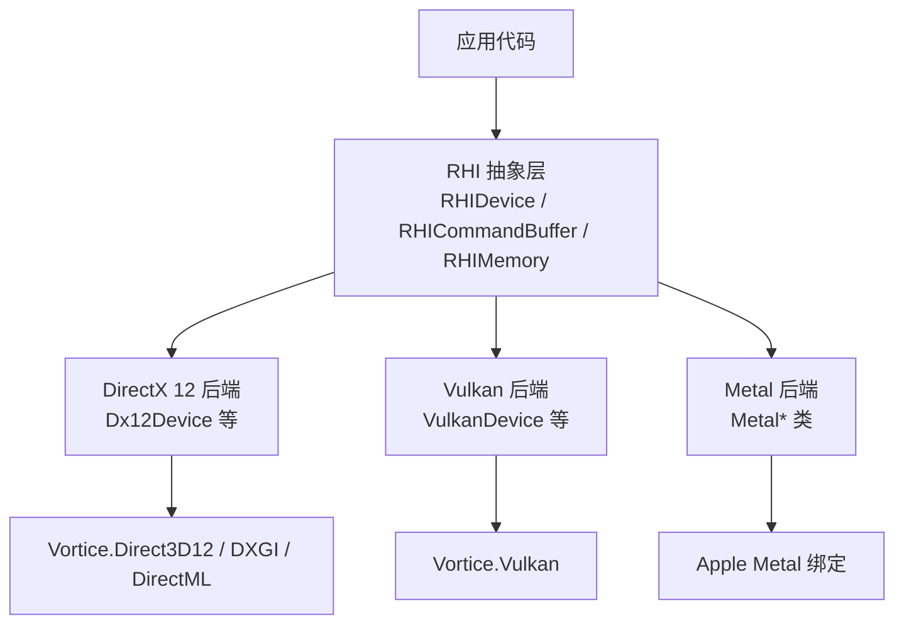
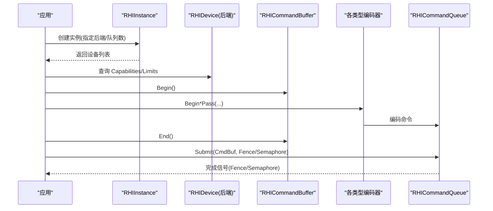
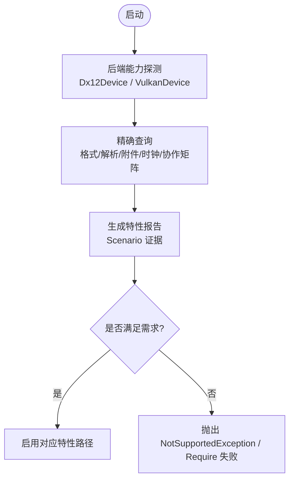
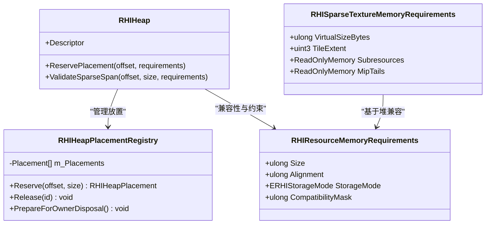
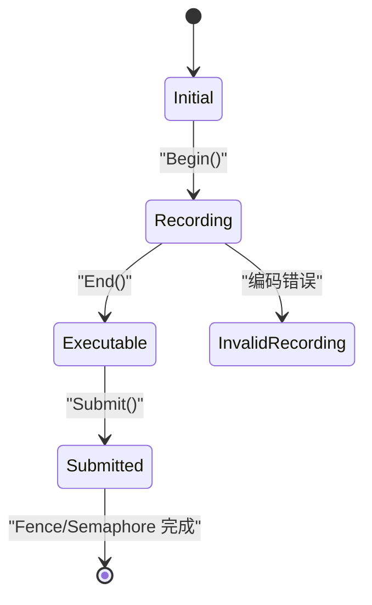
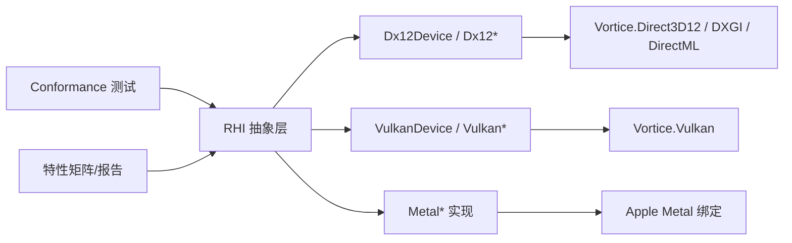

# 核心特性说明

<cite>
**本文引用的文件**
- [README.md](file://README.md)
- [FeatureMatrix.md](file://docs/SharpGPU/FeatureMatrix.md)
- [PackageReadme.md](file://docs/SharpGPU/PackageReadme.md)
- [RHIDevice.cs](file://src/SharpGPU\Abstract/RHIDevice.cs)
- [RHICommandBuffer.cs](file://src/SharpGPU\Abstract/RHICommandBuffer.cs)
- [RHIMemory.cs](file://src/SharpGPU\Abstract/RHIMemory.cs)
- [Dx12Device.cs](file://src/SharpGPU/Dx12/Dx12Device.cs)
- [VulkanDevice.cs](file://src/SharpGPU/Vulkan/VulkanDevice.cs)
- [SharpGPUFeatureReportTests.cs](file://tests/SharpGPU.Conformance.Tests/SharpGPUFeatureReportTests.cs)
</cite>

## 目录
1. [简介](#简介)
2. [项目结构](#项目结构)
3. [核心组件](#核心组件)
4. [架构总览](#架构总览)
5. [详细组件分析](#详细组件分析)
6. [依赖关系分析](#依赖关系分析)
7. [性能考量](#性能考量)
8. [故障排查指南](#故障排查指南)
9. [结论](#结论)
10. [附录：功能矩阵与选择建议](#附录功能矩阵与选择建议)

## 简介
SharpGPU 是一个面向 DirectX 12、Vulkan 和 Metal 的低层 .NET GPU 硬件抽象层（HAL）。它提供统一的 RHI 接口，并在运行时探测设备能力，以决定可用特性与执行路径。项目维护后端实现、绑定的 Vortice 绑定以及 MLCook 工具链，强调“未支持即失败”的显式策略，避免静默降级或无操作。

## 项目结构
- src/SharpGPU：运行时 HAL 抽象与各后端实现（Dx12、Vulkan、Metal）
- docs/SharpGPU：特性矩阵、快速开始、验证说明等文档
- tests/SharpGPU.Conformance.Tests：跨平台一致性测试与特性报告生成
- samples/ComputeAndDraw：可运行的计算与绘制示例
- native：原生资源清单与许可证信息

图表来源
- [RHIDevice.cs:422-440](file://src/SharpGPU\Abstract/RHIDevice.cs#L422-L440)
- [Dx12Device.cs:48-158](file://src/SharpGPU/Dx12/Dx12Device.cs#L48-L158)
- [VulkanDevice.cs:11-191](file://src/SharpGPU/Vulkan/VulkanDevice.cs#L11-L191)

章节来源
- [README.md:1-23](file://README.md#L1-L23)

## 核心组件
- 设备与能力探测：RHIDevice 暴露 Capabilities、Limits、AdapterIdentity 等，用于查询设备能力与限制；各后端在构造时进行能力探测与特性启用。
- 命令缓冲与编码器：RHICommandBuffer 管理 Begin/End 生命周期与多类型编码器（传输、计算、光线追踪、栅格化、机器学习、WorkGraph），保证状态机正确性。
- 内存管理：RHIMemory 提供堆、放置分配、稀疏纹理、预算与驻留控制；通过兼容性掩码屏蔽后端私有内存类细节。
- 查询与校准：QueryFormatSupport、QueryResolveSupport、QueryClockCalibration、CooperativeMatrix 配置枚举等精确查询能力。
- 呈现与交换链：SwapChain 获取/呈现/调整大小与同步原语（fence/semaphore）统一暴露。

章节来源
- [RHIDevice.cs:422-601](file://src/SharpGPU\Abstract/RHIDevice.cs#L422-L601)
- [RHICommandBuffer.cs:6-190](file://src/SharpGPU\Abstract/RHICommandBuffer.cs#L6-L190)
- [RHIMemory.cs:23-142](file://src/SharpGPU\Abstract/RHIMemory.cs#L23-L142)

## 架构总览
SharpGPU 采用“抽象 + 后端”的分层设计：上层使用统一 RHI 接口，底层根据目标平台选择具体后端。能力探测贯穿初始化流程，确保 API 调用在不可用时明确失败，而非静默降级。

图表来源
- [RHIDevice.cs:527-601](file://src/SharpGPU\Abstract/RHIDevice.cs#L527-L601)
- [RHICommandBuffer.cs:170-190](file://src/SharpGPU\Abstract/RHICommandBuffer.cs#L170-L190)

## 详细组件分析

### 运行时能力探测机制
- 设备级能力：RHIDevice.Capabilities 提供按域划分的特性位（如 Synchronization、RayTracing、Mesh、DescriptorIndexing、StorageQueue、PipelineCache、WorkGraph、Raster、Compute、Memory 等）。
- 精确查询：QueryFormatSupport、QueryResolveSupport、QueryRasterAttachmentSupport、QueryClockCalibration、QueryCooperativeMatrixConfigs 等提供“精确组合”的能力判定，避免模糊推断。
- 后端探测：Dx12Device 在构造中检查驱动版本、DirectML 可用性、命令签名等；VulkanDevice 在构造中查询物理设备属性、扩展、动态渲染、稀疏、时间戳等，并缓存能力标志。
- 报告与验证：测试框架遍历后端与设备，生成 JSON 特性报告，记录每个场景的通过/失败/不适用结果，确保“能力探测 ≠ 场景通过”。

图表来源
- [Dx12Device.cs:137-158](file://src/SharpGPU/Dx12/Dx12Device.cs#L137-L158)
- [VulkanDevice.cs:182-191](file://src/SharpGPU/Vulkan/VulkanDevice.cs#L182-L191)
- [SharpGPUFeatureReportTests.cs:27-100](file://tests/SharpGPU.Conformance.Tests/SharpGPUFeatureReportTests.cs#L27-L100)

章节来源
- [RHIDevice.cs:577-636](file://src/SharpGPU\Abstract/RHIDevice.cs#L577-L636)
- [Dx12Device.cs:137-158](file://src/SharpGPU/Dx12/Dx12Device.cs#L137-L158)
- [VulkanDevice.cs:182-191](file://src/SharpGPU/Vulkan/VulkanDevice.cs#L182-L191)
- [SharpGPUFeatureReportTests.cs:27-100](file://tests/SharpGPU.Conformance.Tests/SharpGPUFeatureReportTests.cs#L27-L100)

### 内存管理策略
- 分配模式：支持 Committed、Placed、Sparse、External；通过 RHIResourceMemoryRequirements 描述尺寸、对齐、存储模式与兼容性掩码，屏蔽后端私有内存类。
- 堆与放置：RHIHeap 负责物理堆管理，RHIHeapPlacementRegistry 跟踪放置范围，防止重叠与越界，并在销毁前校验无活跃放置。
- 稀疏纹理：RHISparseTextureMemoryRequirements 描述虚拟大小、瓦片大小/粒度、子资源瓦片网格与 mip tail；绑定/解绑通过 RHISparseTextureTileBinding 表达。
- 预算与驻留：RHIMemoryBudget 提供预算/用量/预留；驻留请求通过 RHIResidencyRequestDescriptor 指定操作、堆集合与完成 fence。

图表来源
- [RHIMemory.cs:23-142](file://src/SharpGPU\Abstract/RHIMemory.cs#L23-L142)
- [RHIMemory.cs:173-333](file://src/SharpGPU\Abstract/RHIMemory.cs#L173-L333)
- [RHIMemory.cs:353-457](file://src/SharpGPU\Abstract/RHIMemory.cs#L353-L457)
- [RHIMemory.cs:515-748](file://src/SharpGPU\Abstract/RHIMemory.cs#L515-L748)

章节来源
- [RHIMemory.cs:23-142](file://src/SharpGPU\Abstract/RHIMemory.cs#L23-L142)
- [RHIMemory.cs:173-333](file://src/SharpGPU\Abstract/RHIMemory.cs#L173-L333)
- [RHIMemory.cs:353-457](file://src/SharpGPU\Abstract/RHIMemory.cs#L353-L457)
- [RHIMemory.cs:515-748](file://src/SharpGPU\Abstract/RHIMemory.cs#L515-L748)

### 同步机制与命令缓冲系统
- 命令缓冲状态机：Initial → Recording → Executable → Submitted，严格禁止重复 begin/end、嵌套编码器、非法提交。
- 编码器种类：Transfer、Compute、Raytracing、Raster、MachineLearning、WorkGraph，同一缓冲内仅允许一个活动编码器。
- 提交与完成：提交后进入 Submitted 状态，由队列与 fence/semaphore 协调完成；设备丢失通过 MarkDeviceLost 与 ThrowIfDeviceUnavailable 显式传播。

图表来源
- [RHICommandBuffer.cs:6-164](file://src/SharpGPU\Abstract/RHICommandBuffer.cs#L6-L164)
- [RHIDevice.cs:465-525](file://src/SharpGPU\Abstract/RHIDevice.cs#L465-L525)

章节来源
- [RHICommandBuffer.cs:6-190](file://src/SharpGPU\Abstract/RHICommandBuffer.cs#L6-L190)
- [RHIDevice.cs:465-525](file://src/SharpGPU\Abstract/RHIDevice.cs#L465-L525)

### 现代 GPU 特性支持
- 光线追踪：加速结构构建/追踪管线、射线函数表、透明度微图（Opacity Micromap）、运动模糊（Motion）等，能力由 Capabilities.RayTracing 及后端探测决定。
- Mesh Shading：任务/网格着色器管线与调度，需 Capabilities.Mesh 支持。
- 协作矩阵：Compute.CooperativeMatrix 配置枚举，当前主要依赖 Vulkan 扩展。
- 其他：Descriptor Indexing、StorageQueue（DirectStorage/GPU 解压/取消）、PipelineCache、WorkGraph、Framebuffer ReadWrite、Variable Rate Shading、Sparse Memory、Sampler Feedback、Function Library 等。

章节来源
- [FeatureMatrix.md:44-73](file://docs/SharpGPU/FeatureMatrix.md#L44-L73)
- [VulkanDevice.cs:105-180](file://src/SharpGPU/Vulkan/VulkanDevice.cs#L105-L180)
- [Dx12Device.cs:77-109](file://src/SharpGPU/Dx12/Dx12Device.cs#L77-L109)

## 依赖关系分析
- 抽象层对后端无编译期耦合，通过 ERHIBackend 与工厂方法选择实现。
- 后端依赖 Vortice 绑定库：DX12 使用 Vortice.Direct3D12/DXGI/DirectML；Vulkan 使用 Vortice.Vulkan；Metal 使用 Apple Metal 绑定。
- 测试与文档作为契约保障：特性矩阵与报告测试确保公开行名与行为一致。

图表来源
- [Dx12Device.cs:48-158](file://src/SharpGPU/Dx12/Dx12Device.cs#L48-L158)
- [VulkanDevice.cs:11-191](file://src/SharpGPU/Vulkan/VulkanDevice.cs#L11-L191)
- [SharpGPUFeatureReportTests.cs:27-100](file://tests/SharpGPU.Conformance.Tests/SharpGPUFeatureReportTests.cs#L27-L100)

章节来源
- [Dx12Device.cs:48-158](file://src/SharpGPU/Dx12/Dx12Device.cs#L48-L158)
- [VulkanDevice.cs:11-191](file://src/SharpGPU/Vulkan/VulkanDevice.cs#L11-L191)
- [SharpGPUFeatureReportTests.cs:27-100](file://tests/SharpGPU.Conformance.Tests/SharpGPUFeatureReportTests.cs#L27-L100)

## 性能考量
- 能力优先：仅在 Capabilities 指示可用时才启用相应路径，避免无效分支与回退。
- 精确查询：使用 QueryFormatSupport/QueryResolveSupport 等减少运行时猜测，降低错误路径开销。
- 内存布局：利用 Placed 与 Sparse 优化大纹理与流式资源；合理设置对齐与堆尺寸，避免碎片与重映射。
- 命令编码：尽量合并同类型编码器批次，减少切换成本；使用 Indirect Command Buffer（若可用）降低 CPU 负载。
- 同步最小化：合理使用 fence/semaphore，避免不必要的等待；利用 Enhanced Barriers（若可用）提升屏障效率。

[本节为通用指导，不直接分析具体文件]

## 故障排查指南
- 设备丢失：通过 MarkDeviceLost 与 ThrowIfDeviceUnavailable 捕获并处理；检查诊断信息与后端状态。
- 特性不可用：Create/Build/Encode 阶段若缺少能力将抛出 NotSupportedException；依据 FeatureMatrix 确认所需 Capability。
- 内存冲突：堆放置重叠或越界会抛异常；检查 ReservePlacement 与 ValidateSparseSpan 的参数与对齐。
- 命令缓冲错误：重复 Begin/End、嵌套编码器、非法提交均会触发异常；遵循状态机顺序。
- 报告不一致：运行特性报告测试，核对 JSON 输出中的 Capabilities 与 Scenarios，定位具体失败场景。

章节来源
- [RHIDevice.cs:465-525](file://src/SharpGPU\Abstract/RHIDevice.cs#L465-L525)
- [RHICommandBuffer.cs:36-164](file://src/SharpGPU\Abstract/RHICommandBuffer.cs#L36-L164)
- [RHIMemory.cs:218-333](file://src/SharpGPU\Abstract/RHIMemory.cs#L218-L333)
- [SharpGPUFeatureReportTests.cs:27-100](file://tests/SharpGPU.Conformance.Tests/SharpGPUFeatureReportTests.cs#L27-L100)

## 结论
SharpGPU 通过严格的 RHI 抽象、后端能力探测与精确查询，提供了跨平台的高性能 GPU 编程基础。其“未支持即失败”的策略确保了可预测的行为与清晰的错误边界。开发者应依据 Capabilities 与 FeatureMatrix 选择合适特性，结合内存与命令缓冲的最佳实践，获得稳定且高效的图形/计算体验。

[本节为总结，不直接分析具体文件]

## 附录：功能矩阵与选择建议

### 功能矩阵（节选）
- 时间戳查询：TimestampQueries（Synchronization）
- 遮挡查询：OcclusionQueries（Synchronization）
- 管线统计：PipelineStatisticsQueries（Synchronization）
- 机器学习：MachineLearning（Execution/Tier1 推理）
- 间接命令缓冲：IndirectCommandBuffer（Execution）
- 光线追踪：Raytracing（AccelStruct/Pipeline/Trace）
- 透明度微图：OpacityMicromap（AS/BLAS/序列化）
- 运动模糊：Motion（Motion AS/顶点/实例）
- Mesh Shading：Mesh/Task Shader（Raster Pipeline）
- 描述符索引：DescriptorIndexing（Layout/Table）
- 存储队列：StorageQueue（DirectStorage/解压/取消）
- 管线缓存：PipelineCache（Native Cache）
- WorkGraph：WorkGraph（Execution）
- 帧缓冲读写：FramebufferReadWrite（Attachment ABI）
- 子通道：RasterSubPass（Immutable Planner）
- 呈现：Presentation（SwapChain/Hdr/Fence/Semaphore）
- 可变率着色：VariableRateShading（PerDraw/PerPrimitive/Attachment/Combiners）
- 格式支持：FormatSupport（Exact Query）
- 解析支持：QueryResolveSupport（MSAA→单采样）
- 校准时间戳：CalibratedTimestamps（Clock Calibration）
- 稀疏内存：SparseMemory（Texture/Buffer/MipTail/Tiling）
- 采样反馈：SamplerFeedback（DX12）
- 协作矩阵：CooperativeMatrix（Vulkan）
- 函数库：FunctionLibrary（Reusable Pipeline Views）
- 适配器标识：AdapterIdentity（LUID/UUID）

章节来源
- [FeatureMatrix.md:44-73](file://docs/SharpGPU/FeatureMatrix.md#L44-L73)

### 特性选择指导原则
- 先查 Capabilities：所有特性使用前必须检查对应域的能力位；不可用则走替代路径或直接失败。
- 精确查询优先：对格式、解析、附件组合使用 Query*Support 进行精确判定，避免隐式降级。
- 后端差异：DX12/Vulkan/Metal 能力不同；例如协作矩阵目前主要在 Vulkan 可用，采样反馈为 DX12 专属。
- 场景验证：能力探测不等于场景通过；运行 Conformance 测试与特性报告，确保端到端可行。
- 资源与同步：合理规划内存（堆/放置/稀疏）与命令缓冲（编码器/提交/同步），减少瓶颈与错误。

章节来源
- [PackageReadme.md:1-13](file://docs/SharpGPU/PackageReadme.md#L1-L13)
- [FeatureMatrix.md:74-88](file://docs/SharpGPU/FeatureMatrix.md#L74-L88)