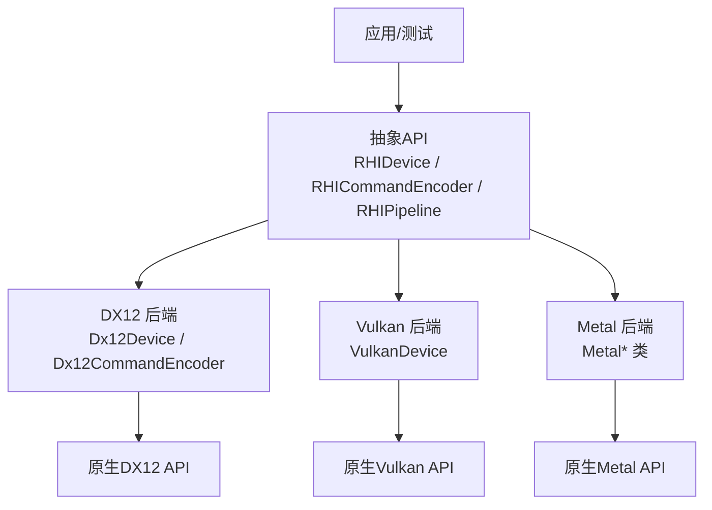
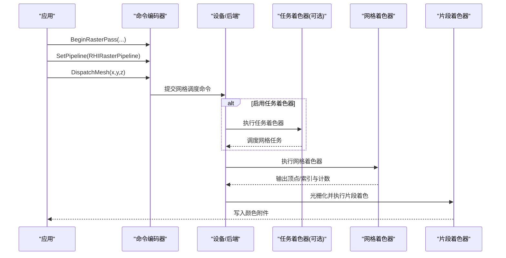
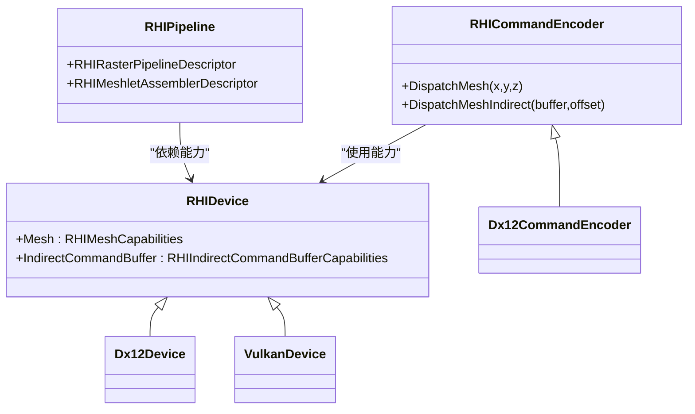

# Mesh Shading支持

<cite>
**本文引用的文件**
- [RHIDevice.cs](file://src/SharpGPU/Abstract/RHIDevice.cs)
- [RHICommandEncoder.cs](file://src/SharpGPU/Abstract/RHICommandEncoder.cs)
- [RHIPipeline.cs](file://src/SharpGPU/Abstract/RHIPipeline.cs)
- [Dx12Device.cs](file://src/SharpGPU/Dx12/Dx12Device.cs)
- [Dx12CommandEncoder.cs](file://src/SharpGPU/Dx12/Dx12CommandEncoder.cs)
- [VulkanDevice.cs](file://src/SharpGPU/Vulkan/VulkanDevice.cs)
- [MeshShadingWindowsQualifiedTests.cs](file://tests/SharpGPU.Conformance.Tests/MeshShadingWindowsQualifiedTests.cs)
- [MeshShadingVulkanQualifiedTests.cs](file://tests/SharpGPU.Conformance.Tests/MeshShadingVulkanQualifiedTests.cs)
- [MeshShadingMslCompileTests.cs](file://tests/SharpGPU.Conformance.Tests/MeshShadingMslCompileTests.cs)
- [MeshShadingPortableContractTests.cs](file://tests/SharpGPU.Conformance.Tests/MeshShadingPortableContractTests.cs)
</cite>

## 目录
1. [简介](#简介)
2. [项目结构](#项目结构)
3. [核心组件](#核心组件)
4. [架构总览](#架构总览)
5. [详细组件分析](#详细组件分析)
6. [依赖关系分析](#依赖关系分析)
7. [性能考虑](#性能考虑)
8. [故障排查指南](#故障排查指南)
9. [结论](#结论)
10. [附录](#附录)

## 简介
本文件为 SharpGPU 的 Mesh Shading（网格着色）能力提供综合文档，覆盖任务着色器（Task Shader）与网格着色器（Mesh Shader）的概念、工作流程、跨后端实现要点（DX12、Vulkan、Metal），以及管线配置、资源绑定、输入输出格式、示例流程、性能调优与常见问题。内容基于仓库中的抽象接口与各后端实现、测试用例进行归纳，确保与实际代码一致。

## 项目结构
- 抽象层：定义设备能力、命令编码、管线描述等统一接口，包括 Mesh Shading 的能力查询、绘制调用入口与管线装配描述。
- 后端实现：各平台（DX12、Vulkan、Metal）在设备能力探测、命令编码与管线创建中对接原生 API。
- 测试用例：覆盖 DX12 与 Vulkan 的端到端 Mesh Dispatch 验证，以及 Metal 编译路径的可用性校验。

图表来源
- [RHIDevice.cs:1815-1825](file://src/SharpGPU/Abstract/RHIDevice.cs#L1815-L1825)
- [RHICommandEncoder.cs:2008-2020](file://src/SharpGPU/Abstract/RHICommandEncoder.cs#L2008-L2020)
- [Dx12Device.cs:1351-1354](file://src/SharpGPU/Dx12/Dx12Device.cs#L1351-L1354)
- [VulkanDevice.cs:1745-1760](file://src/SharpGPU/Vulkan/VulkanDevice.cs#L1745-L1760)

章节来源
- [RHIDevice.cs:1815-1825](file://src/SharpGPU/Abstract/RHIDevice.cs#L1815-L1825)
- [RHICommandEncoder.cs:2008-2020](file://src/SharpGPU/Abstract/RHICommandEncoder.cs#L2008-L2020)
- [RHIPipeline.cs:186-222](file://src/SharpGPU/Abstract/RHIPipeline.cs#L186-L222)

## 核心组件
- 设备能力
  - Mesh Shading 能力通过 RHIMeshCapabilities 暴露 MeshShader 与 TaskShader 两个能力项，用于运行时判断是否可用及等级。
  - 间接命令令牌能力包含 DispatchMesh，表示是否支持间接网格调度。
- 命令编码
  - RHIRasterEncoder 提供 DispatchMesh(groupCountX, groupCountY, groupCountZ) 与 DispatchMeshIndirect(argsBuffer, argsOffset)。
  - 基类默认抛出“不支持”，由各后端具体实现。
- 管线装配
  - RHIPrimitiveAssemblerDescriptor 支持两种模式：传统顶点装配与 Meshlet 装配（Task + Mesh）。
  - RHIMeshletAssemblerDescriptor 包含可选的 TaskFunction 与必需的 MeshFunction。
  - 创建栅格管线时，若启用 Meshlet 装配且未提供 MeshFunction，将触发参数校验失败。

章节来源
- [RHIDevice.cs:1815-1825](file://src/SharpGPU/Abstract/RHIDevice.cs#L1815-L1825)
- [RHIDevice.cs:1888-1911](file://src/SharpGPU/Abstract/RHIDevice.cs#L1888-L1911)
- [RHICommandEncoder.cs:2008-2020](file://src/SharpGPU/Abstract/RHICommandEncoder.cs#L2008-L2020)
- [RHIPipeline.cs:186-222](file://src/SharpGPU/Abstract/RHIPipeline.cs#L186-L222)
- [RHIPipeline.cs:324-350](file://src/SharpGPU/Abstract/RHIPipeline.cs#L324-L350)

## 架构总览
Mesh Shading 渲染流程由任务着色器与网格着色器协同完成：
- 任务着色器（可选）：负责生成或选择网格任务，并通过调度接口下发到网格着色器阶段。
- 网格着色器：生成顶点与索引数据，设置输出计数，交由光栅化阶段处理。
- 片段着色器：对生成的图元进行像素级着色。

图表来源
- [MeshShadingWindowsQualifiedTests.cs:129-160](file://tests/SharpGPU.Conformance.Tests/MeshShadingWindowsQualifiedTests.cs#L129-L160)
- [MeshShadingVulkanQualifiedTests.cs:217-242](file://tests/SharpGPU.Conformance.Tests/MeshShadingVulkanQualifiedTests.cs#L217-L242)
- [RHIPipeline.cs:186-222](file://src/SharpGPU/Abstract/RHIPipeline.cs#L186-L222)

## 详细组件分析

### 任务着色器与网格着色器概念与职责
- 任务着色器（Task Shader）
  - 可选阶段，用于组织网格任务、计算负载分发、读取外部资源（如索引缓冲、变换矩阵等）。
  - 在 DX12/Vulkan 测试中，任务着色器通过调度接口将工作分派给网格着色器。
- 网格着色器（Mesh Shader）
  - 必须阶段，负责生成顶点与索引，并调用设置输出计数的接口以告知后续阶段的数据规模。
  - 输出数据直接参与光栅化与片段着色。

章节来源
- [MeshShadingWindowsQualifiedTests.cs:20-78](file://tests/SharpGPU.Conformance.Tests/MeshShadingWindowsQualifiedTests.cs#L20-L78)
- [MeshShadingVulkanQualifiedTests.cs:20-78](file://tests/SharpGPU.Conformance.Tests/MeshShadingVulkanQualifiedTests.cs#L20-L78)

### 管线状态配置与创建
- 管线描述
  - 使用 RHIRasterPipelineDescriptor 配置颜色/深度格式、渲染状态、片段着色器与原始装配器。
  - 原始装配器采用 RHIPrimitiveAssemblerDescriptor，其中 MeshletAssembler 指定 TaskFunction 与 MeshFunction。
- 校验规则
  - 若启用 Meshlet 装配但未提供 MeshFunction，创建管线时将抛出异常。
  - 顶点装配与网格装配互斥，不可同时设置。
- 示例参考
  - Windows(DX12) 与 Vulkan 测试均展示了完整管线创建过程，包括布局、着色器函数、渲染状态与附件格式。

章节来源
- [RHIPipeline.cs:186-222](file://src/SharpGPU/Abstract/RHIPipeline.cs#L186-L222)
- [RHIPipeline.cs:324-350](file://src/SharpGPU/Abstract/RHIPipeline.cs#L324-L350)
- [MeshShadingWindowsQualifiedTests.cs:198-218](file://tests/SharpGPU.Conformance.Tests/MeshShadingWindowsQualifiedTests.cs#L198-L218)
- [MeshShadingVulkanQualifiedTests.cs:259-279](file://tests/SharpGPU.Conformance.Tests/MeshShadingVulkanQualifiedTests.cs#L259-L279)

### 不同后端的实现要点

#### DX12
- 能力探测
  - 设备能力中包含 Mesh 与 Task 能力项；当不可用时，创建 Mesh 管线会失败。
  - 间接命令支持通过 ExecuteIndirect 的 DispatchMesh 令牌实现间接网格调度。
- 命令编码
  - 命令编码器封装了 DispatchMesh 与 DispatchMeshIndirect 的具体调用。
- 着色器目标
  - 测试中使用 DXIL 作为着色器字节码目标。

章节来源
- [Dx12Device.cs:1351-1354](file://src/SharpGPU/Dx12/Dx12Device.cs#L1351-L1354)
- [Dx12Device.cs:2010-2010](file://src/SharpGPU/Dx12/Dx12Device.cs#L2010-L2010)
- [Dx12Device.cs:2591-2601](file://src/SharpGPU/Dx12/Dx12Device.cs#L2591-L2601)
- [Dx12CommandEncoder.cs:3848-3866](file://src/SharpGPU/Dx12/Dx12CommandEncoder.cs#L3848-L3866)
- [MeshShadingWindowsQualifiedTests.cs:106-128](file://tests/SharpGPU.Conformance.Tests/MeshShadingWindowsQualifiedTests.cs#L106-L128)

#### Vulkan
- 能力探测
  - 设备能力包含 Mesh 与 Task 能力项；当不可用时，创建 Mesh 管线与执行网格调度都会失败。
  - 能力限制项包括最大输出顶点数、最大输出图元数、最大载荷大小与工作组尺寸等。
- 着色器目标
  - 测试中将 HLSL 交叉编译为 SPIR-V，并指定 Vulkan 目标环境。
- 命令编码
  - 命令编码器提供 DispatchMesh 与 DispatchMeshIndirect 的抽象入口，后端需实现具体逻辑。

章节来源
- [VulkanDevice.cs:1745-1760](file://src/SharpGPU/Vulkan/VulkanDevice.cs#L1745-L1760)
- [MeshShadingVulkanQualifiedTests.cs:190-211](file://tests/SharpGPU.Conformance.Tests/MeshShadingVulkanQualifiedTests.cs#L190-L211)
- [MeshShadingVulkanQualifiedTests.cs:390-441](file://tests/SharpGPU.Conformance.Tests/MeshShadingVulkanQualifiedTests.cs#L390-L441)

#### Metal
- 编译路径
  - 测试验证了 Mesh Shader 可被交叉编译为 MSL（Metal Shading Language），表明 Metal 后端具备相应的编译链路。
- 运行时
  - 当前仓库未提供 Metal 后端的 Mesh Shading 运行期实现细节；如需启用，应遵循抽象接口并在 Metal 后端补齐命令编码与管线创建逻辑。

章节来源
- [MeshShadingMslCompileTests.cs:10-48](file://tests/SharpGPU.Conformance.Tests/MeshShadingMslCompileTests.cs#L10-L48)

### 网格着色器的输入输出格式
- 输入
  - 任务着色器可通过共享内存或资源向网格着色器传递载荷（payload）。
  - 网格着色器可直接访问资源视图（缓冲区、纹理等），具体取决于后端绑定策略。
- 输出
  - 网格着色器输出顶点数组与索引数组，并通过设置输出计数接口声明有效数据规模。
  - 顶点属性通常包含位置等语义字段，片段着色器消费这些数据进行像素着色。
- 处理流程
  - 网格着色器生成数据后，进入光栅化阶段，最终由片段着色器写入颜色附件。

章节来源
- [MeshShadingWindowsQualifiedTests.cs:36-78](file://tests/SharpGPU.Conformance.Tests/MeshShadingWindowsQualifiedTests.cs#L36-L78)
- [MeshShadingVulkanQualifiedTests.cs:36-78](file://tests/SharpGPU.Conformance.Tests/MeshShadingVulkanQualifiedTests.cs#L36-L78)

### 完整示例流程（创建管线、设置资源、执行绘制）
- 步骤概览
  - 创建设备与命令队列。
  - 编译着色器：任务着色器（可选）、网格着色器、片段着色器。
  - 创建管线布局与栅格管线，配置颜色/深度格式与渲染状态。
  - 开始渲染通道，设置视口与裁剪区域。
  - 调用网格调度命令执行绘制。
  - 结束通道并提交命令缓冲。
- 参考实现
  - Windows(DX12) 与 Vulkan 测试提供了完整的端到端流程，包括资源准备、通道管理、调度与回读验证。

章节来源
- [MeshShadingWindowsQualifiedTests.cs:87-175](file://tests/SharpGPU.Conformance.Tests/MeshShadingWindowsQualifiedTests.cs#L87-L175)
- [MeshShadingVulkanQualifiedTests.cs:87-257](file://tests/SharpGPU.Conformance.Tests/MeshShadingVulkanQualifiedTests.cs#L87-L257)

## 依赖关系分析
- 抽象接口与后端实现
  - 抽象层定义了 Mesh Shading 的统一能力与命令接口。
  - 各后端在设备能力探测、命令编码与管线创建上分别对接原生 API。
- 关键依赖链
  - 设备能力 → 管线创建 → 命令编码 → 原生 API 调用。
  - 测试用例驱动端到端验证，确保抽象与后端的一致性。

图表来源
- [RHIDevice.cs:1815-1825](file://src/SharpGPU/Abstract/RHIDevice.cs#L1815-L1825)
- [RHIDevice.cs:1888-1911](file://src/SharpGPU/Abstract/RHIDevice.cs#L1888-L1911)
- [RHICommandEncoder.cs:2008-2020](file://src/SharpGPU/Abstract/RHICommandEncoder.cs#L2008-L2020)
- [RHIPipeline.cs:186-222](file://src/SharpGPU/Abstract/RHIPipeline.cs#L186-L222)

章节来源
- [RHIDevice.cs:1815-1825](file://src/SharpGPU/Abstract/RHIDevice.cs#L1815-L1825)
- [RHICommandEncoder.cs:2008-2020](file://src/SharpGPU/Abstract/RHICommandEncoder.cs#L2008-L2020)
- [RHIPipeline.cs:186-222](file://src/SharpGPU/Abstract/RHIPipeline.cs#L186-L222)

## 性能考虑
- 工作组尺寸与载荷大小
  - 合理设置网格着色器的工作组尺寸与载荷大小，避免超出设备限制。
  - 关注能力限制项：最大输出顶点数、最大输出图元数、最大载荷大小、最大工作组尺寸。
- 资源绑定与缓存
  - 复用管线布局与着色器函数对象，减少创建开销。
  - 合理使用常量缓冲与资源视图，降低带宽压力。
- 调度粒度
  - 根据场景复杂度调整网格任务数量，避免过度细分导致调度开销上升。
- 回读与同步
  - 尽量减少 CPU-GPU 同步点，批量回读结果以降低延迟。

章节来源
- [VulkanDevice.cs:1745-1760](file://src/SharpGPU/Vulkan/VulkanDevice.cs#L1745-L1760)
- [MeshShadingWindowsQualifiedTests.cs:220-243](file://tests/SharpGPU.Conformance.Tests/MeshShadingWindowsQualifiedTests.cs#L220-L243)
- [MeshShadingVulkanQualifiedTests.cs:281-304](file://tests/SharpGPU.Conformance.Tests/MeshShadingVulkanQualifiedTests.cs#L281-L304)

## 故障排查指南
- 能力不可用
  - 当设备 Mesh 或 Task 能力不可用时，创建 Mesh 管线或执行网格调度将抛出异常。
  - 建议在创建管线前检查设备能力，并根据结果选择降级路径。
- 缺少必需着色器
  - 启用 Meshlet 装配时必须提供 MeshFunction；否则创建管线将失败。
  - 在 Windows(DX12) 与 Vulkan 测试中，缺失 MeshFunction 会导致闭包失败。
- 着色器编译失败
  - Vulkan 路径使用 SPIR-V 目标，编译失败时会返回诊断信息，需检查源与选项。
  - Metal 路径需确保 MSL 编译选项正确。
- 命令编码未实现
  - 若后端未实现 DispatchMesh 或 DispatchMeshIndirect，调用将抛出“不支持”异常。

章节来源
- [MeshShadingPortableContractTests.cs:34-80](file://tests/SharpGPU.Conformance.Tests/MeshShadingPortableContractTests.cs#L34-L80)
- [MeshShadingWindowsQualifiedTests.cs:186-196](file://tests/SharpGPU.Conformance.Tests/MeshShadingWindowsQualifiedTests.cs#L186-L196)
- [MeshShadingVulkanQualifiedTests.cs:136-176](file://tests/SharpGPU.Conformance.Tests/MeshShadingVulkanQualifiedTests.cs#L136-L176)
- [MeshShadingVulkanQualifiedTests.cs:390-441](file://tests/SharpGPU.Conformance.Tests/MeshShadingVulkanQualifiedTests.cs#L390-L441)
- [RHICommandEncoder.cs:2008-2020](file://src/SharpGPU/Abstract/RHICommandEncoder.cs#L2008-L2020)

## 结论
SharpGPU 通过抽象接口统一了 Mesh Shading 的能力与命令，并在 DX12 与 Vulkan 后端实现了端到端的网格调度与渲染流程。Metal 后端已具备编译路径，但需补齐运行期实现。开发者可依据设备能力与测试用例快速搭建 Mesh Shading 管线，结合性能建议与故障排查指南，获得稳定高效的渲染体验。

## 附录
- 术语
  - 任务着色器（Task Shader）：可选阶段，负责网格任务的组织与调度。
  - 网格着色器（Mesh Shader）：必须阶段，生成顶点与索引数据并设置输出计数。
  - 片段着色器（Fragment Shader）：像素级着色阶段。
- 相关枚举与结构
  - RHIMeshCapabilities：MeshShader、TaskShader 能力。
  - RHIMeshletAssemblerDescriptor：TaskFunction、MeshFunction。
  - ERHICapabilityLimitKind：Mesh 相关能力限制项。