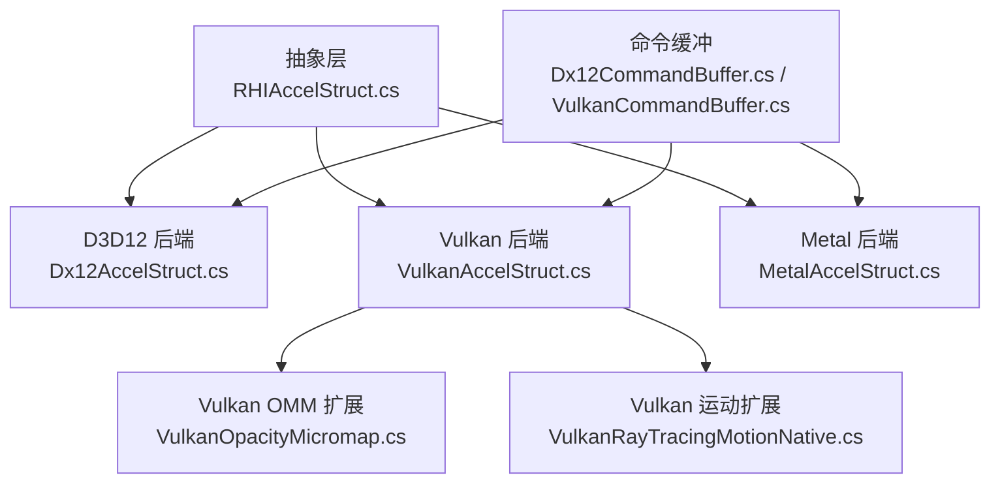
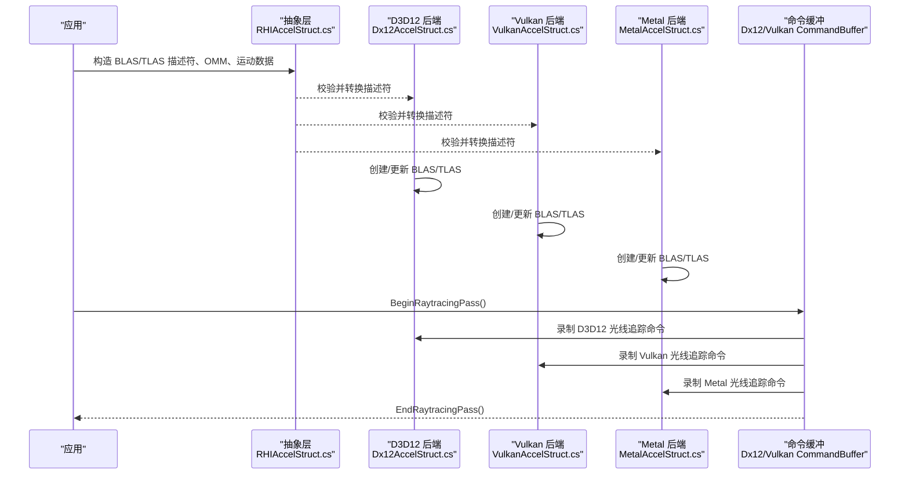
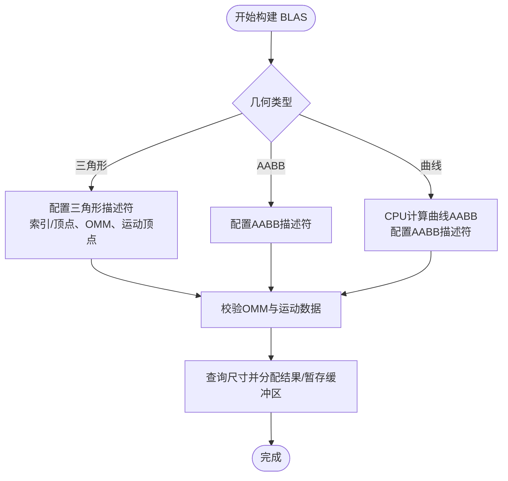
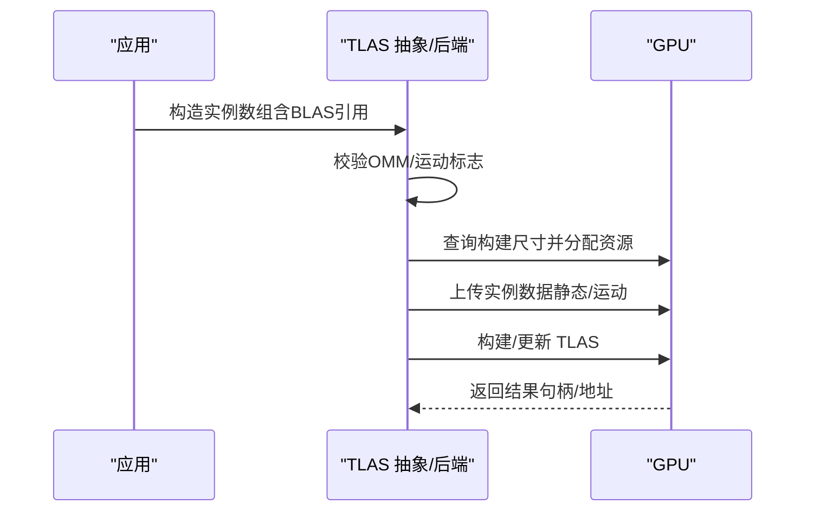
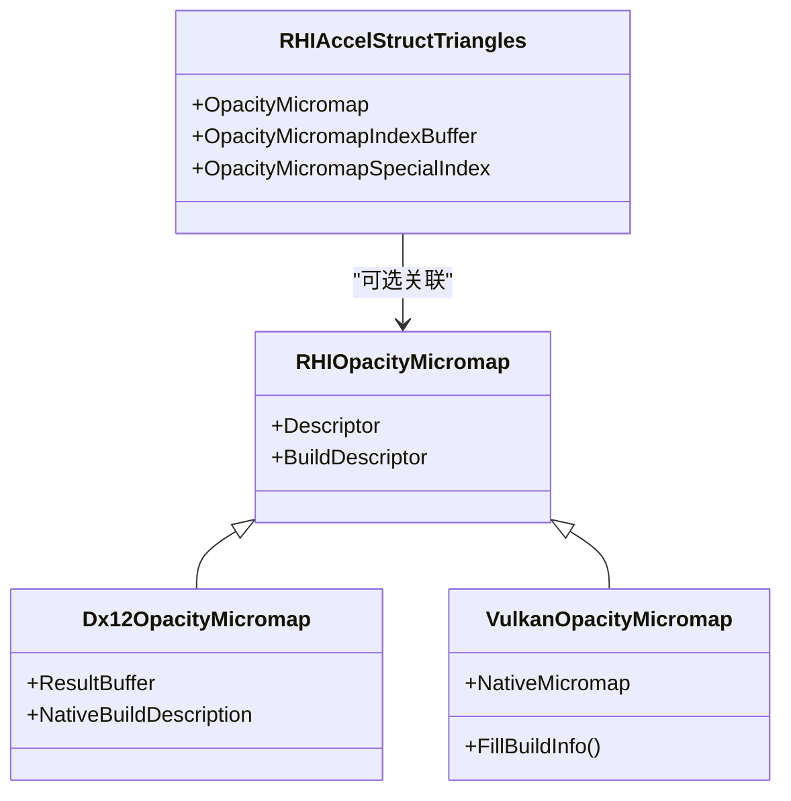
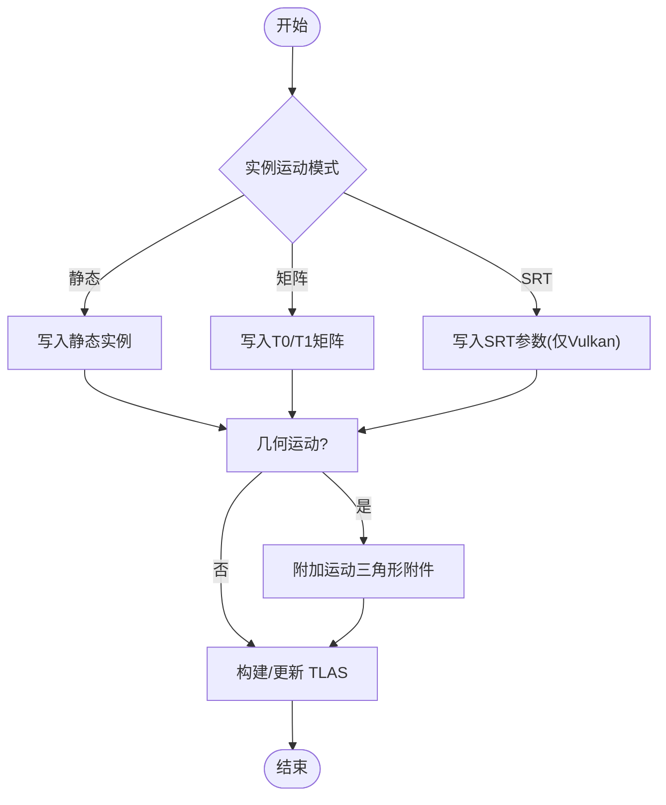
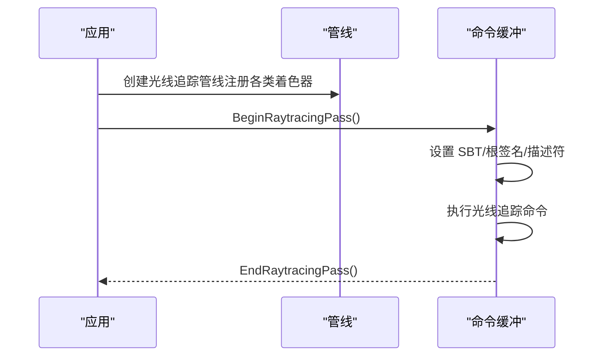
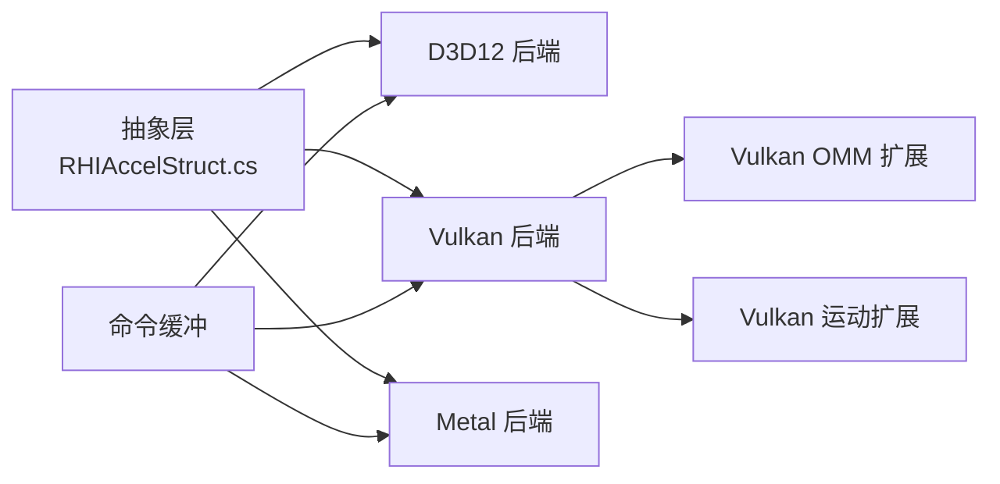

# 光线追踪支持

<cite>
**本文引用的文件**
- [RHIAccelStruct.cs](file://src/SharpGPU/Abstract/RHIAccelStruct.cs)
- [Dx12AccelStruct.cs](file://src/SharpGPU/Dx12/Dx12AccelStruct.cs)
- [VulkanAccelStruct.cs](file://src/SharpGPU/Vulkan/VulkanAccelStruct.cs)
- [MetalAccelStruct.cs](file://src/SharpGPU/Metal/MetalAccelStruct.cs)
- [VulkanOpacityMicromap.cs](file://src/SharpGPU/Vulkan/VulkanOpacityMicromap.cs)
- [VulkanRayTracingMotionNative.cs](file://src/SharpGPU/Vulkan/VulkanRayTracingMotionNative.cs)
- [Dx12CommandBuffer.cs](file://src/SharpGPU/Dx12/Dx12CommandBuffer.cs)
- [VulkanCommandBuffer.cs](file://src/SharpGPU/Vulkan/VulkanCommandBuffer.cs)
</cite>

## 目录
1. [简介](#简介)
2. [项目结构](#项目结构)
3. [核心组件](#核心组件)
4. [架构总览](#架构总览)
5. [详细组件分析](#详细组件分析)
6. [依赖关系分析](#依赖关系分析)
7. [性能考虑](#性能考虑)
8. [故障排除指南](#故障排除指南)
9. [结论](#结论)
10. [附录：完整示例流程](#附录完整示例流程)

## 简介
本文件系统性说明 SharpGPU 的光线追踪能力，重点覆盖加速结构的构建与管理（BLAS/TLAS）、透明度微图（Opacity Micromap）优化、运动光线追踪（顶点与实例），以及光线追踪着色器的绑定机制。文档同时提供跨后端（Direct3D 12、Vulkan、Metal）的实现要点、数据流与调用序列，并给出性能优化建议与常见问题排查方法。

## 项目结构
SharpGPU 将光线追踪相关能力抽象为平台无关的接口与数据结构，并在各后端中实现具体细节：
- 抽象层：定义加速结构描述符、几何体类型、实例、透明度微图、运动标志等通用模型与校验逻辑。
- 后端实现：
  - Direct3D 12：BLAS/TLAS 构建、OMM 链接、曲线 AABB 计算、实例上传与更新。
  - Vulkan：BLAS/TLAS 构建、OMM 扩展、运动实例（矩阵/SRT）、运动三角形附件。
  - Metal：BLAS/TLAS 构建、运动实例（矩阵关键帧）、几何描述符组装。
- 命令缓冲：提供 BeginRaytracingPass/EndRaytracingPass 等入口以录制光线追踪命令。

**图表来源**
- [RHIAccelStruct.cs:10-881](file://src/SharpGPU/Abstract/RHIAccelStruct.cs#L10-L881)
- [Dx12AccelStruct.cs:53-794](file://src/SharpGPU/Dx12/Dx12AccelStruct.cs#L53-L794)
- [VulkanAccelStruct.cs:7-800](file://src/SharpGPU/Vulkan/VulkanAccelStruct.cs#L7-L800)
- [MetalAccelStruct.cs:31-800](file://src/SharpGPU/Metal/MetalAccelStruct.cs#L31-L800)
- [VulkanOpacityMicromap.cs:7-414](file://src/SharpGPU/Vulkan/VulkanOpacityMicromap.cs#L7-L414)
- [VulkanRayTracingMotionNative.cs:7-157](file://src/SharpGPU/Vulkan/VulkanRayTracingMotionNative.cs#L7-L157)
- [Dx12CommandBuffer.cs:144-156](file://src/SharpGPU/Dx12/Dx12CommandBuffer.cs#L144-L156)
- [VulkanCommandBuffer.cs:43-80](file://src/SharpGPU/Vulkan/VulkanCommandBuffer.cs#L43-L80)

**章节来源**
- [RHIAccelStruct.cs:10-881](file://src/SharpGPU/Abstract/RHIAccelStruct.cs#L10-L881)
- [Dx12AccelStruct.cs:53-794](file://src/SharpGPU/Dx12/Dx12AccelStruct.cs#L53-L794)
- [VulkanAccelStruct.cs:7-800](file://src/SharpGPU/Vulkan/VulkanAccelStruct.cs#L7-L800)
- [MetalAccelStruct.cs:31-800](file://src/SharpGPU/Metal/MetalAccelStruct.cs#L31-L800)
- [VulkanOpacityMicromap.cs:7-414](file://src/SharpGPU/Vulkan/VulkanOpacityMicromap.cs#L7-L414)
- [VulkanRayTracingMotionNative.cs:7-157](file://src/SharpGPU/Vulkan/VulkanRayTracingMotionNative.cs#L7-L157)
- [Dx12CommandBuffer.cs:144-156](file://src/SharpGPU/Dx12/Dx12CommandBuffer.cs#L144-L156)
- [VulkanCommandBuffer.cs:43-80](file://src/SharpGPU/Vulkan/VulkanCommandBuffer.cs#L43-L80)

## 核心组件
- 加速结构描述符与几何体
  - BLAS：三角形、AABB、曲线；支持透明度微图与运动顶点。
  - TLAS：实例数组，支持运动实例（矩阵或 SRT）。
- 透明度微图（OMM）
  - 用于透明几何体的快速剔除与着色优化；支持每三角索引或特殊索引常量。
- 运动光线追踪
  - 实例级：静态、矩阵、SRT 三种模式。
  - 几何级：运动三角形顶点缓冲区（需与静态顶点共享步长）。
- 命令缓冲与光线追踪通道
  - 通过 BeginRaytracingPass/EndRaytracingPass 录制光线追踪命令。

**章节来源**
- [RHIAccelStruct.cs:90-150](file://src/SharpGPU/Abstract/RHIAccelStruct.cs#L90-L150)
- [RHIAccelStruct.cs:707-751](file://src/SharpGPU/Abstract/RHIAccelStruct.cs#L707-L751)
- [VulkanAccelStruct.cs:143-209](file://src/SharpGPU/Vulkan/VulkanAccelStruct.cs#L143-L209)
- [Dx12AccelStruct.cs:221-422](file://src/SharpGPU/Dx12/Dx12AccelStruct.cs#L221-L422)
- [MetalAccelStruct.cs:44-75](file://src/SharpGPU/Metal/MetalAccelStruct.cs#L44-L75)
- [Dx12CommandBuffer.cs:144-156](file://src/SharpGPU/Dx12/Dx12CommandBuffer.cs#L144-L156)
- [VulkanCommandBuffer.cs:43-80](file://src/SharpGPU/Vulkan/VulkanCommandBuffer.cs#L43-L80)

## 架构总览
下图展示从应用层到后端的整体数据流：应用准备描述符与缓冲区，抽象层进行一致性校验，后端创建/更新加速结构，并通过命令缓冲提交光线追踪命令。

**图表来源**
- [RHIAccelStruct.cs:10-881](file://src/SharpGPU/Abstract/RHIAccelStruct.cs#L10-L881)
- [Dx12AccelStruct.cs:53-794](file://src/SharpGPU/Dx12/Dx12AccelStruct.cs#L53-L794)
- [VulkanAccelStruct.cs:7-800](file://src/SharpGPU/Vulkan/VulkanAccelStruct.cs#L7-L800)
- [MetalAccelStruct.cs:31-800](file://src/SharpGPU/Metal/MetalAccelStruct.cs#L31-L800)
- [Dx12CommandBuffer.cs:144-156](file://src/SharpGPU/Dx12/Dx12CommandBuffer.cs#L144-L156)
- [VulkanCommandBuffer.cs:43-80](file://src/SharpGPU/Vulkan/VulkanCommandBuffer.cs#L43-L80)

## 详细组件分析

### 底部级加速结构（BLAS）
- 几何体支持
  - 三角形：可附加 OMM 与运动顶点；索引/非索引两种模式。
  - AABB：直接读取 AABB 缓冲区。
  - 曲线：在 CPU 侧根据控制点与半径计算保守 AABB，再作为 AABB 几何参与构建。
- 透明度微图（OMM）
  - 三角形几何可附加 OMM；若未提供每三角索引，可使用“特殊索引”常量填充。
  - 需要输入缓冲区与三角形数组缓冲区，且必须标记为构建输入只读。
- 运动三角形
  - 需提供运动顶点缓冲区；步长需与静态顶点一致（后端限制）。
- 后端差异
  - D3D12：使用 RaytracingGeometryTrianglesDescription/OmmTriangles；曲线 AABB 在 CPU 计算。
  - Vulkan：通过 pNext 链附加 OMM 与运动三角形附件；曲线 AABB 同样在 CPU 计算。
  - Metal：三角形几何描述符区分静态与运动模式；不支持曲线几何的直接描述，通常以 AABB 替代。

**图表来源**
- [Dx12AccelStruct.cs:221-422](file://src/SharpGPU/Dx12/Dx12AccelStruct.cs#L221-L422)
- [VulkanAccelStruct.cs:445-715](file://src/SharpGPU/Vulkan/VulkanAccelStruct.cs#L445-L715)
- [MetalAccelStruct.cs:77-266](file://src/SharpGPU/Metal/MetalAccelStruct.cs#L77-L266)
- [RHIAccelStruct.cs:90-150](file://src/SharpGPU/Abstract/RHIAccelStruct.cs#L90-L150)

**章节来源**
- [Dx12AccelStruct.cs:221-422](file://src/SharpGPU/Dx12/Dx12AccelStruct.cs#L221-L422)
- [VulkanAccelStruct.cs:445-715](file://src/SharpGPU/Vulkan/VulkanAccelStruct.cs#L445-L715)
- [MetalAccelStruct.cs:77-266](file://src/SharpGPU/Metal/MetalAccelStruct.cs#L77-L266)
- [RHIAccelStruct.cs:90-150](file://src/SharpGPU/Abstract/RHIAccelStruct.cs#L90-L150)

### 顶部级加速结构（TLAS）
- 实例描述
  - 包含变换矩阵、实例ID、掩码、命中组索引、引用 BLAS。
  - 支持运动实例：静态、矩阵（T0/T1）、SRT（仅 Vulkan）。
- 构建与更新
  - 首次构建：查询尺寸、分配结果与暂存缓冲区、上传实例数据。
  - 更新：仅替换实例数据（保持运动模式不变）。
- 后端差异
  - D3D12：RaytracingInstanceDescription 数组上传至上传堆，构建时设置 PerformUpdate。
  - Vulkan：按是否启用运动选择不同实例结构；必要时使用设备地址。
  - Metal：静态与运动实例分别处理；SRT 模式在 Metal 上失败关闭。

**图表来源**
- [Dx12AccelStruct.cs:70-190](file://src/SharpGPU/Dx12/Dx12AccelStruct.cs#L70-L190)
- [VulkanAccelStruct.cs:36-141](file://src/SharpGPU/Vulkan/VulkanAccelStruct.cs#L36-L141)
- [MetalAccelStruct.cs:332-492](file://src/SharpGPU/Metal/MetalAccelStruct.cs#L332-L492)
- [RHIAccelStruct.cs:707-751](file://src/SharpGPU/Abstract/RHIAccelStruct.cs#L707-L751)

**章节来源**
- [Dx12AccelStruct.cs:70-190](file://src/SharpGPU/Dx12/Dx12AccelStruct.cs#L70-L190)
- [VulkanAccelStruct.cs:36-141](file://src/SharpGPU/Vulkan/VulkanAccelStruct.cs#L36-L141)
- [MetalAccelStruct.cs:332-492](file://src/SharpGPU/Metal/MetalAccelStruct.cs#L332-L492)
- [RHIAccelStruct.cs:707-751](file://src/SharpGPU/Abstract/RHIAccelStruct.cs#L707-L751)

### 透明度微图（Opacity Micromap）
- 作用
  - 对透明几何体进行细粒度遮挡剔除，提升光线追踪性能。
- 构建要求
  - 需要输入缓冲区与三角形数组缓冲区；UsageCounts 直方图不可为空。
  - 所有输入缓冲区需具备构建输入只读标志。
- 三角形关联
  - 可为每个三角形提供索引，或使用特殊索引常量（全透明/全不透明/未知）。
- 后端实现
  - D3D12：通过 OmmTriangles 描述符链接 OMM 数组与索引缓冲区。
  - Vulkan：通过 VkAccelerationStructureTrianglesOpacityMicromapEXT 附加；使用扩展 API 构建 Micromap。
  - Metal：在三角形几何描述符中启用 OMM 能力（需能力检查）。

**图表来源**
- [RHIAccelStruct.cs:174-206](file://src/SharpGPU/Abstract/RHIAccelStruct.cs#L174-L206)
- [Dx12AccelStruct.cs:641-773](file://src/SharpGPU/Dx12/Dx12AccelStruct.cs#L641-L773)
- [VulkanOpacityMicromap.cs:202-414](file://src/SharpGPU/Vulkan/VulkanOpacityMicromap.cs#L202-L414)
- [RHIAccelStruct.cs:129-150](file://src/SharpGPU/Abstract/RHIAccelStruct.cs#L129-L150)

**章节来源**
- [RHIAccelStruct.cs:174-206](file://src/SharpGPU/Abstract/RHIAccelStruct.cs#L174-L206)
- [Dx12AccelStruct.cs:641-773](file://src/SharpGPU/Dx12/Dx12AccelStruct.cs#L641-L773)
- [VulkanOpacityMicromap.cs:202-414](file://src/SharpGPU/Vulkan/VulkanOpacityMicromap.cs#L202-L414)
- [RHIAccelStruct.cs:129-150](file://src/SharpGPU/Abstract/RHIAccelStruct.cs#L129-L150)

### 运动光线追踪
- 实例运动
  - 静态：无运动数据。
  - 矩阵：提供 T0/T1 两个变换矩阵。
  - SRT：仅 Vulkan 支持；提供缩放、旋转、平移参数。
- 几何运动
  - 三角形几何可附带运动顶点缓冲区；步长需与静态顶点一致。
- 后端差异
  - Vulkan：通过 NV 运动模糊扩展；实例与几何均支持运动附件。
  - D3D12：实例支持矩阵运动；几何运动通过顶点缓冲区与标志位。
  - Metal：实例支持矩阵关键帧；SRT 模式失败关闭。

**图表来源**
- [VulkanAccelStruct.cs:143-209](file://src/SharpGPU/Vulkan/VulkanAccelStruct.cs#L143-L209)
- [VulkanAccelStruct.cs:241-284](file://src/SharpGPU/Vulkan/VulkanAccelStruct.cs#L241-L284)
- [VulkanRayTracingMotionNative.cs:7-157](file://src/SharpGPU/Vulkan/VulkanRayTracingMotionNative.cs#L7-L157)
- [Dx12AccelStruct.cs:70-190](file://src/SharpGPU/Dx12/Dx12AccelStruct.cs#L70-L190)
- [MetalAccelStruct.cs:332-492](file://src/SharpGPU/Metal/MetalAccelStruct.cs#L332-L492)

**章节来源**
- [VulkanAccelStruct.cs:143-209](file://src/SharpGPU/Vulkan/VulkanAccelStruct.cs#L143-L209)
- [VulkanAccelStruct.cs:241-284](file://src/SharpGPU/Vulkan/VulkanAccelStruct.cs#L241-L284)
- [VulkanRayTracingMotionNative.cs:7-157](file://src/SharpGPU/Vulkan/VulkanRayTracingMotionNative.cs#L7-L157)
- [Dx12AccelStruct.cs:70-190](file://src/SharpGPU/Dx12/Dx12AccelStruct.cs#L70-L190)
- [MetalAccelStruct.cs:332-492](file://src/SharpGPU/Metal/MetalAccelStruct.cs#L332-L492)

### 光线追踪着色器绑定机制
- 命中组与函数表偏移
  - 实例中的 HitGroupIndex 映射到着色器记录表（SBT）中的命中组。
  - 几何体中的 FunctionTableOffset 指定相交函数的表偏移。
- 绑定流程
  - 构建管线时注册光线生成、命中、缺失、任意命中着色器。
  - 在命令缓冲中设置 SBT 指针并执行 DispatchRays/等效命令。
- 后端注意
  - D3D12：通过状态对象与根签名绑定着色器；SBT 由驱动管理。
  - Vulkan：通过着色器组与 SBT 描述符集绑定。
  - Metal：通过函数表偏移与着色器程序绑定。

**图表来源**
- [Dx12CommandBuffer.cs:144-156](file://src/SharpGPU/Dx12/Dx12CommandBuffer.cs#L144-L156)
- [VulkanCommandBuffer.cs:43-80](file://src/SharpGPU/Vulkan/VulkanCommandBuffer.cs#L43-L80)
- [RHIAccelStruct.cs:90-150](file://src/SharpGPU/Abstract/RHIAccelStruct.cs#L90-L150)

**章节来源**
- [Dx12CommandBuffer.cs:144-156](file://src/SharpGPU/Dx12/Dx12CommandBuffer.cs#L144-L156)
- [VulkanCommandBuffer.cs:43-80](file://src/SharpGPU/Vulkan/VulkanCommandBuffer.cs#L43-L80)
- [RHIAccelStruct.cs:90-150](file://src/SharpGPU/Abstract/RHIAccelStruct.cs#L90-L150)

## 依赖关系分析
- 抽象层依赖
  - 几何体与实例描述符、OMM 描述符、运动标志等。
- 后端依赖
  - D3D12：Vortice.Direct3D12 类型与 API。
  - Vulkan：Vulkan 扩展（OMM、运动模糊）与设备地址。
  - Metal：Metal 加速结构与运动实例 API。
- 命令缓冲依赖
  - 各后端命令缓冲提供光线追踪通道入口。

**图表来源**
- [RHIAccelStruct.cs:10-881](file://src/SharpGPU/Abstract/RHIAccelStruct.cs#L10-L881)
- [VulkanOpacityMicromap.cs:7-414](file://src/SharpGPU/Vulkan/VulkanOpacityMicromap.cs#L7-L414)
- [VulkanRayTracingMotionNative.cs:7-157](file://src/SharpGPU/Vulkan/VulkanRayTracingMotionNative.cs#L7-L157)
- [Dx12CommandBuffer.cs:144-156](file://src/SharpGPU/Dx12/Dx12CommandBuffer.cs#L144-L156)
- [VulkanCommandBuffer.cs:43-80](file://src/SharpGPU/Vulkan/VulkanCommandBuffer.cs#L43-L80)

**章节来源**
- [RHIAccelStruct.cs:10-881](file://src/SharpGPU/Abstract/RHIAccelStruct.cs#L10-L881)
- [VulkanOpacityMicromap.cs:7-414](file://src/SharpGPU/Vulkan/VulkanOpacityMicromap.cs#L7-L414)
- [VulkanRayTracingMotionNative.cs:7-157](file://src/SharpGPU/Vulkan/VulkanRayTracingMotionNative.cs#L7-L157)
- [Dx12CommandBuffer.cs:144-156](file://src/SharpGPU/Dx12/Dx12CommandBuffer.cs#L144-L156)
- [VulkanCommandBuffer.cs:43-80](file://src/SharpGPU/Vulkan/VulkanCommandBuffer.cs#L43-L80)

## 性能考虑
- 优先使用 OMM 优化透明几何体，减少不必要的着色器调用。
- 合理划分 BLAS/TLAS：频繁更新的场景尽量复用 BLAS，仅更新 TLAS 实例。
- 曲线几何建议在 CPU 预计算 AABB，避免运行时开销。
- 运动光线追踪中，尽量复用实例缓冲区，减少内存分配。
- 使用 PreferFastTrace/AllowCompaction 等标志权衡构建与追踪性能。

[本节为通用指导，无需特定文件来源]

## 故障排除指南
- 常见错误与定位
  - OMM 构建失败：检查 UsageCounts 是否为空、输入缓冲区是否具备构建输入只读标志。
  - 三角形关联 OMM 失败：确认提供了每三角索引或特殊索引常量。
  - 运动模式不一致：TLAS 更新时不能切换运动模式；需重建加速结构。
  - 曲线几何缺少段数或控制点数：确保 SegmentCount 与 SegmentControlPointCount 有效。
  - 后端能力不足：如 Metal 不支持 SRT 运动实例，会失败关闭。
- 调试建议
  - 打印/记录描述符哈希值，便于比对构建前后的一致性。
  - 分阶段验证：先构建 BLAS，再构建 TLAS；逐步引入 OMM 与运动特性。
  - 使用后端诊断工具（如 PIX、Vulkan Validation Layers）捕获错误信息。

**章节来源**
- [RHIAccelStruct.cs:222-261](file://src/SharpGPU/Abstract/RHIAccelStruct.cs#L222-L261)
- [RHIAccelStruct.cs:271-298](file://src/SharpGPU/Abstract/RHIAccelStruct.cs#L271-L298)
- [RHIAccelStruct.cs:488-553](file://src/SharpGPU/Abstract/RHIAccelStruct.cs#L488-L553)
- [Dx12AccelStruct.cs:319-340](file://src/SharpGPU/Dx12/Dx12AccelStruct.cs#L319-L340)
- [VulkanAccelStruct.cs:577-597](file://src/SharpGPU/Vulkan/VulkanAccelStruct.cs#L577-L597)
- [MetalAccelStruct.cs:379-383](file://src/SharpGPU/Metal/MetalAccelStruct.cs#L379-L383)

## 结论
SharpGPU 通过统一的抽象层与多后端实现，提供了完整的 BLAS/TLAS 构建与管理、OMM 透明度优化、运动光线追踪支持，以及标准化的光线追踪命令录制入口。开发者可按场景选择合适的几何与运动模式，结合性能优化建议获得稳定高效的渲染效果。

[本节为总结性内容，无需特定文件来源]

## 附录：完整示例流程
以下流程展示如何设置光线追踪管线、构建加速结构并执行光线追踪命令（以 D3D12 为例，其他后端类似）：
- 准备数据
  - 创建 BLAS：三角形/AABB/曲线几何，可选 OMM 与运动顶点。
  - 创建 TLAS：实例数组，引用 BLAS，设置变换与运动数据。
- 构建与更新
  - 首次构建 BLAS/TLAS，分配结果与暂存缓冲区。
  - 后续更新 TLAS 实例数据（保持运动模式不变）。
- 执行光线追踪
  - BeginRaytracingPass() 进入光线追踪通道。
  - 设置着色器绑定与 SBT。
  - 执行光线追踪命令。
  - EndRaytracingPass() 结束通道并提交。

参考路径
- 构建 BLAS/TLAS：[Dx12AccelStruct.cs:221-422](file://src/SharpGPU/Dx12/Dx12AccelStruct.cs#L221-L422)、[Dx12AccelStruct.cs:70-190](file://src/SharpGPU/Dx12/Dx12AccelStruct.cs#L70-L190)
- 执行光线追踪通道：[Dx12CommandBuffer.cs:144-156](file://src/SharpGPU/Dx12/Dx12CommandBuffer.cs#L144-L156)

**章节来源**
- [Dx12AccelStruct.cs:70-190](file://src/SharpGPU/Dx12/Dx12AccelStruct.cs#L70-L190)
- [Dx12AccelStruct.cs:221-422](file://src/SharpGPU/Dx12/Dx12AccelStruct.cs#L221-L422)
- [Dx12CommandBuffer.cs:144-156](file://src/SharpGPU/Dx12/Dx12CommandBuffer.cs#L144-L156)