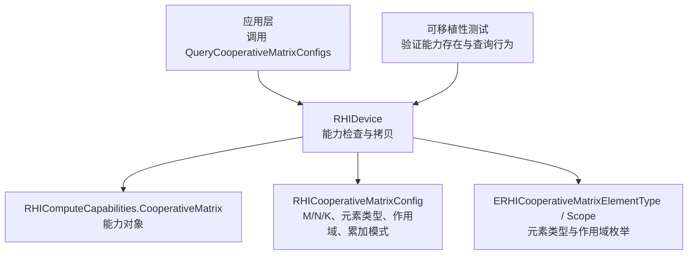
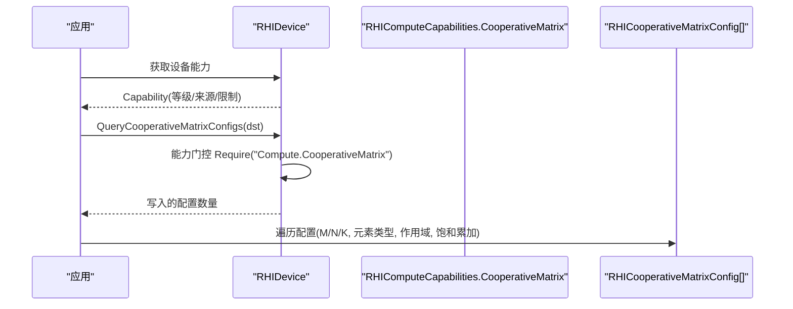
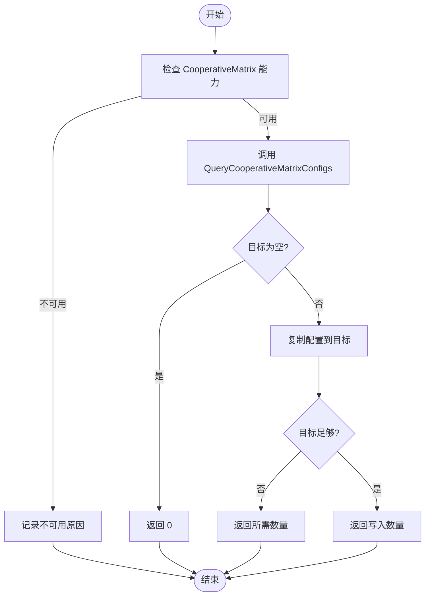
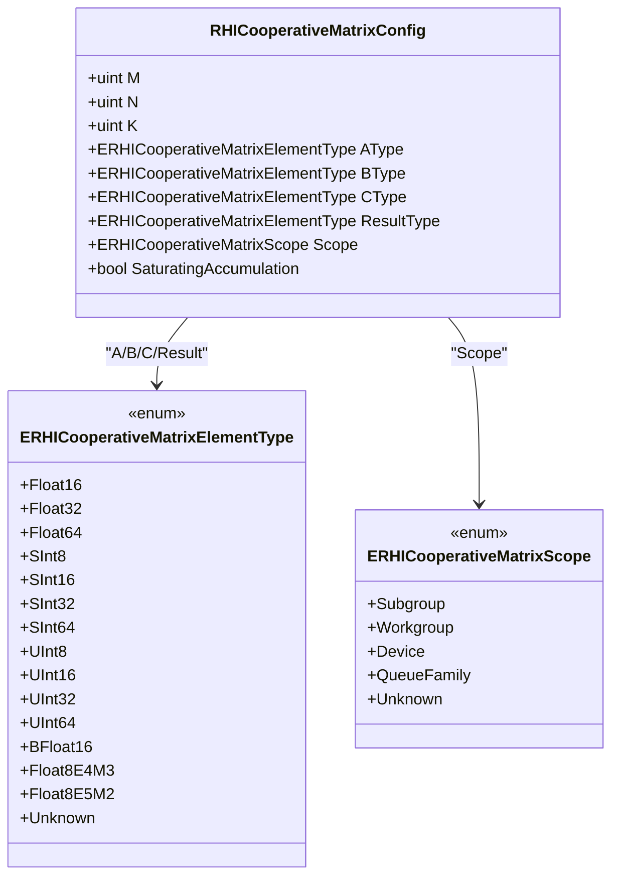
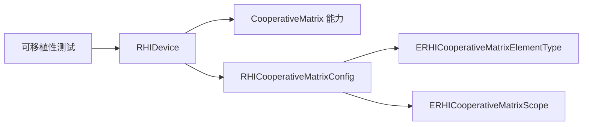

# 协作矩阵计算

<cite>
**本文引用的文件**
- [RHIDevice.cs](file://src/SharpGPU/Abstract/RHIDevice.cs)
- [RHIUtility.cs](file://src/SharpGPU/Abstract/RHIUtility.cs)
- [WaveAndCooperativeMatrixPortableContractTests.cs](file://tests/SharpGPU.Conformance.Tests/WaveAndCooperativeMatrixPortableContractTests.cs)
</cite>

## 目录
1. [简介](#简介)
2. [项目结构](#项目结构)
3. [核心组件](#核心组件)
4. [架构总览](#架构总览)
5. [详细组件分析](#详细组件分析)
6. [依赖关系分析](#依赖关系分析)
7. [性能考虑](#性能考虑)
8. [故障排查指南](#故障排查指南)
9. [结论](#结论)
10. [附录](#附录)

## 简介
本文件聚焦 SharpGPU 的“协作矩阵（Cooperative Matrix）”计算能力，面向高性能计算与深度学习推理加速场景。内容涵盖：
- 协作矩阵的概念与应用场景
- 在不同后端（DirectX12、Vulkan、Metal）上检测与启用协作矩阵能力的方法
- 协作矩阵的计算指令与数据格式（数据类型、维度限制、内存对齐）
- 实际计算示例（矩阵乘法、推理加速）
- 性能基准测试方法与优化建议
- 与 Wave/Subgroup Intrinsics 的配合使用方式

## 项目结构
SharpGPU 将协作矩阵能力抽象在设备能力与查询接口中，并通过跨后端的统一类型表达元素类型与作用域。关键位置如下：
- 设备能力与查询：RHIDevice.cs
- 协作矩阵枚举定义：RHIUtility.cs
- 可移植性契约测试：WaveAndCooperativeMatrixPortableContractTests.cs

图表来源
- [RHIDevice.cs:603-636](file://src/SharpGPU/Abstract/RHIDevice.cs#L603-L636)
- [RHIDevice.cs:1124-1181](file://src/SharpGPU/Abstract/RHIDevice.cs#L1124-L1181)
- [RHIUtility.cs:70-103](file://src/SharpGPU/Abstract/RHIUtility.cs#L70-L103)
- [WaveAndCooperativeMatrixPortableContractTests.cs:135-167](file://tests/SharpGPU.Conformance.Tests/WaveAndCooperativeMatrixPortableContractTests.cs#L135-L167)

章节来源
- [RHIDevice.cs:603-636](file://src/SharpGPU/Abstract/RHIDevice.cs#L603-L636)
- [RHIDevice.cs:1124-1181](file://src/SharpGPU/Abstract/RHIDevice.cs#L1124-L1181)
- [RHIUtility.cs:70-103](file://src/SharpGPU/Abstract/RHIUtility.cs#L70-L103)
- [WaveAndCooperativeMatrixPortableContractTests.cs:135-167](file://tests/SharpGPU.Conformance.Tests/WaveAndCooperativeMatrixPortableContractTests.cs#L135-L167)

## 核心组件
- RHIComputeCapabilities.CooperativeMatrix：表示当前设备的协作矩阵能力等级与来源信息，用于运行时能力门控。
- RHIDevice.QueryCooperativeMatrixConfigs：查询并复制原生协作矩阵配置到托管数组；空目标返回 0，容量不足时返回所需数量。
- RHICooperativeMatrixConfig：描述一组原生的协作矩阵配置，包含 M/N/K 维度、A/B/C/Result 元素类型、作用域与是否饱和累加。
- ERHICooperativeMatrixElementType：协作矩阵支持的原生元素类型集合（如 Float16/Float32/Float64、SInt8/16/32/64、UInt8/16/32/64、BFloat16、Float8E4M3/E5M2）。
- ERHICooperativeMatrixScope：协作矩阵的作用域（Subgroup、Workgroup、Device、QueueFamily）。

章节来源
- [RHIDevice.cs:603-636](file://src/SharpGPU/Abstract/RHIDevice.cs#L603-L636)
- [RHIDevice.cs:1124-1181](file://src/SharpGPU/Abstract/RHIDevice.cs#L1124-L1181)
- [RHIUtility.cs:70-103](file://src/SharpGPU/Abstract/RHIUtility.cs#L70-L103)

## 架构总览
协作矩阵能力的探测与使用流程：
- 应用通过 RHIInstance 获取 RHIDevice
- 读取 device.Capabilities.Compute.CooperativeMatrix 判断能力等级与不可用原因
- 若可用，调用 QueryCooperativeMatrixConfigs 获取一组原生配置（M/N/K、元素类型、作用域等）
- 根据配置选择合适的数据布局与线程组织策略，编写或选择对应的内核（例如 compute shader）执行矩阵乘或推理算子
- 与 Wave/Subgroup 协同，利用组内并行与寄存器级累积提升吞吐

图表来源
- [RHIDevice.cs:603-636](file://src/SharpGPU/Abstract/RHIDevice.cs#L603-L636)
- [WaveAndCooperativeMatrixPortableContractTests.cs:135-167](file://tests/SharpGPU.Conformance.Tests/WaveAndCooperativeMatrixPortableContractTests.cs#L135-L167)

## 详细组件分析

### 能力检测与启用
- 能力入口：device.Capabilities.Compute.CooperativeMatrix
- 不可用时：Capability.UnavailableReason 提供原因；调用 QueryCooperativeMatrixConfigs 会抛出异常（被测试覆盖）
- 可用时：QueryCooperativeMatrixConfigs 至少返回一个有效配置；空目标返回 0；目标过小返回所需数量

图表来源
- [RHIDevice.cs:603-636](file://src/SharpGPU/Abstract/RHIDevice.cs#L603-L636)
- [WaveAndCooperativeMatrixPortableContractTests.cs:135-167](file://tests/SharpGPU.Conformance.Tests/WaveAndCooperativeMatrixPortableContractTests.cs#L135-L167)

章节来源
- [RHIDevice.cs:603-636](file://src/SharpGPU/Abstract/RHIDevice.cs#L603-L636)
- [WaveAndCooperativeMatrixPortableContractTests.cs:135-167](file://tests/SharpGPU.Conformance.Tests/WaveAndCooperativeMatrixPortableContractTests.cs#L135-L167)

### 数据结构与约束
- RHICooperativeMatrixConfig
  - M/N/K：矩阵块维度，均非零（由测试断言保证）
  - AType/BType/CType/ResultType：来自原生枚举，禁止未知值（构造时校验）
  - Scope：协作范围（Subgroup/Workgroup/Device/QueueFamily）
  - SaturatingAccumulation：是否饱和累加
- ERHICooperativeMatrixElementType：宽于 ML 数据类型，避免 Vulkan 分量类型被静收窄
- ERHICooperativeMatrixScope：非着色阶段掩码，而是协作范围

图表来源
- [RHIDevice.cs:1124-1181](file://src/SharpGPU/Abstract/RHIDevice.cs#L1124-L1181)
- [RHIUtility.cs:70-103](file://src/SharpGPU/Abstract/RHIUtility.cs#L70-L103)

章节来源
- [RHIDevice.cs:1124-1181](file://src/SharpGPU/Abstract/RHIDevice.cs#L1124-L1181)
- [RHIUtility.cs:70-103](file://src/SharpGPU/Abstract/RHIUtility.cs#L70-L103)

### 不同后端的检测与启用
- DirectX12：能力来源包含 WaveLaneCountMin/Max 等信息；可通过设备特性查询确认 Wave 能力，从而推断协作矩阵可用性
- Vulkan：能力来源提及 SubgroupProperties/Vulkan11Properties 等，表明基于 Subgroup/协作原语的能力探测
- Metal：能力来源为后端契约，固定最小/最大 Wavefront 尺寸（32/64），作为能力边界参考

注意：SharpGPU 不直接暴露“启用开关”，而是通过能力门控与配置查询让上层按设备能力选择最优路径。

章节来源
- [WaveAndCooperativeMatrixPortableContractTests.cs:66-133](file://tests/SharpGPU.Conformance.Tests/WaveAndCooperativeMatrixPortableContractTests.cs#L66-L133)

### 计算指令与数据格式
- 指令层面：SharpGPU 抽象层不直接暴露底层汇编/指令；具体指令由后端驱动与着色器编译器生成
- 数据格式：通过 ERHICooperativeMatrixElementType 表达 A/B/C/Result 的元素类型；M/N/K 由原生配置给出
- 维度限制：M/N/K 必须为非零整数，且受设备能力限制；具体上限由后端实现决定
- 内存对齐：对齐要求取决于后端与着色器模型；通常需满足共享内存/寄存器块的对齐约定，建议以设备限制为准并在内核中显式对齐

提示：在实际内核中，应优先使用设备提供的协作矩阵原语（如 HLSL cooperative matrix 或 SPIR-V subgroup 扩展），并按配置中的 Scope 组织线程。

章节来源
- [RHIDevice.cs:1124-1181](file://src/SharpGPU/Abstract/RHIDevice.cs#L1124-L1181)
- [RHIUtility.cs:70-103](file://src/SharpGPU/Abstract/RHIUtility.cs#L70-L103)

### 实际计算示例
- 矩阵乘法（GEMM 分块）
  - 步骤：
    1) 查询 CooperativeMatrix 能力与配置
    2) 选择一组合适的 M/N/K 与元素类型组合
    3) 将输入矩阵分块为 (M,K) 与 (K,N)，结果累加到 (M,N) 的 C 块
    4) 在子组/工作组范围内并行化，结合寄存器级累积
  - 参考路径：[QueryCooperativeMatrixConfigs:603-636](file://src/SharpGPU/Abstract/RHIDevice.cs#L603-L636)、[RHICooperativeMatrixConfig:1124-1181](file://src/SharpGPU/Abstract/RHIDevice.cs#L1124-L1181)
- 深度学习推理加速
  - 步骤：
    1) 根据模型张量形状与精度需求，挑选匹配的 A/B/C/Result 类型
    2) 将卷积/全连接层分解为多块 GEMM，按 M/N/K 调度
    3) 利用协作矩阵的高吞吐乘加单元，减少访存与中间缓存
  - 参考路径：同上

章节来源
- [RHIDevice.cs:603-636](file://src/SharpGPU/Abstract/RHIDevice.cs#L603-L636)
- [RHIDevice.cs:1124-1181](file://src/SharpGPU/Abstract/RHIDevice.cs#L1124-L1181)

### 与 Wave Intrinsics 的配合
- 协作矩阵通常以子组（Subgroup/Wave）为单位进行并行；因此应与 Wave/Subgroup Intrinsics 配合使用
- 典型模式：
  - 使用 Wave 广播/归约/洗牌操作完成跨线程的中间结果聚合
  - 在子组内共享寄存器/共享内存，降低带宽压力
  - 依据 Scope（Subgroup/Workgroup/Device）选择合适的同步粒度
- 能力探测：通过 WaveOperations 能力与 Min/Max Wavefront Size 确定并行粒度

章节来源
- [WaveAndCooperativeMatrixPortableContractTests.cs:66-133](file://tests/SharpGPU.Conformance.Tests/WaveAndCooperativeMatrixPortableContractTests.cs#L66-L133)

## 依赖关系分析
- RHIDevice 依赖 RHIComputeCapabilities.CooperativeMatrix 进行能力门控
- RHICooperativeMatrixConfig 依赖 ERHICooperativeMatrixElementType 与 ERHICooperativeMatrixScope
- 可移植性测试验证了能力存在性与查询行为的正确性

图表来源
- [WaveAndCooperativeMatrixPortableContractTests.cs:135-167](file://tests/SharpGPU.Conformance.Tests/WaveAndCooperativeMatrixPortableContractTests.cs#L135-L167)
- [RHIDevice.cs:603-636](file://src/SharpGPU/Abstract/RHIDevice.cs#L603-L636)
- [RHIDevice.cs:1124-1181](file://src/SharpGPU/Abstract/RHIDevice.cs#L1124-L1181)
- [RHIUtility.cs:70-103](file://src/SharpGPU/Abstract/RHIUtility.cs#L70-L103)

章节来源
- [WaveAndCooperativeMatrixPortableContractTests.cs:135-167](file://tests/SharpGPU.Conformance.Tests/WaveAndCooperativeMatrixPortableContractTests.cs#L135-L167)
- [RHIDevice.cs:603-636](file://src/SharpGPU/Abstract/RHIDevice.cs#L603-L636)
- [RHIDevice.cs:1124-1181](file://src/SharpGPU/Abstract/RHIDevice.cs#L1124-L1181)
- [RHIUtility.cs:70-103](file://src/SharpGPU/Abstract/RHIUtility.cs#L70-L103)

## 性能考虑
- 选择合适 M/N/K：尽量匹配硬件原生支持的块大小，减少填充与循环展开开销
- 数据类型选择：低比特类型（如 Int8/Float8）可降低带宽，但需评估精度与后端支持
- 内存访问：按 Scope 组织数据布局，最大化局部性与寄存器复用
- 同步粒度：仅在必要时进行跨线程同步，避免阻塞
- 流水线并行：将大矩阵分解为多块，重叠访存与计算
- 基准方法：
  - 对同一问题规模，对比不同 M/N/K 与数据类型的吞吐与时延
  - 使用 GPU 时间戳统计内核执行时间
  - 关注 L2/L3 命中率与带宽占用

## 故障排查指南
- 能力不可用：
  - 现象：QueryCooperativeMatrixConfigs 抛出异常
  - 处理：检查 Capability.UnavailableReason，确认设备/驱动是否支持
- 配置为空：
  - 现象：QueryCooperativeMatrixConfigs 返回 0
  - 处理：可能为目标 Span 为空；确保传入非空目标以获取配置
- 配置不足：
  - 现象：返回所需数量大于目标长度
  - 处理：扩容目标数组后重试
- 元素类型无效：
  - 现象：构造 RHICooperativeMatrixConfig 抛出参数异常
  - 处理：仅使用从设备查询得到的合法类型

章节来源
- [RHIDevice.cs:603-636](file://src/SharpGPU/Abstract/RHIDevice.cs#L603-L636)
- [RHIDevice.cs:1124-1181](file://src/SharpGPU/Abstract/RHIDevice.cs#L1124-L1181)
- [WaveAndCooperativeMatrixPortableContractTests.cs:135-167](file://tests/SharpGPU.Conformance.Tests/WaveAndCooperativeMatrixPortableContractTests.cs#L135-L167)

## 结论
SharpGPU 通过统一的设备能力与配置查询机制，屏蔽了不同后端在协作矩阵实现上的差异。开发者只需：
- 检查 CooperativeMatrix 能力
- 查询并选择原生配置
- 按配置组织线程与数据布局
即可在多后端上获得一致的协作矩阵加速效果。结合 Wave/Subgroup 原语与合理的内核设计，可在矩阵乘法与深度学习推理中获得显著的性能收益。

## 附录
- 快速实践清单
  - 获取设备能力：device.Capabilities.Compute.CooperativeMatrix
  - 查询配置：device.QueryCooperativeMatrixConfigs(new RHICooperativeMatrixConfig[capacity])
  - 选择配置：依据 M/N/K、元素类型、Scope 与 SaturatingAccumulation
  - 编写内核：按 Scope 组织线程，使用协作矩阵原语与 Wave 操作
  - 基准测试：对比不同配置的吞吐与时延，定位瓶颈