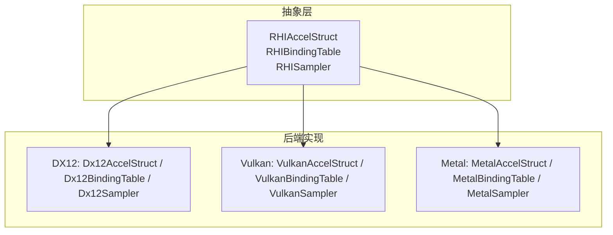
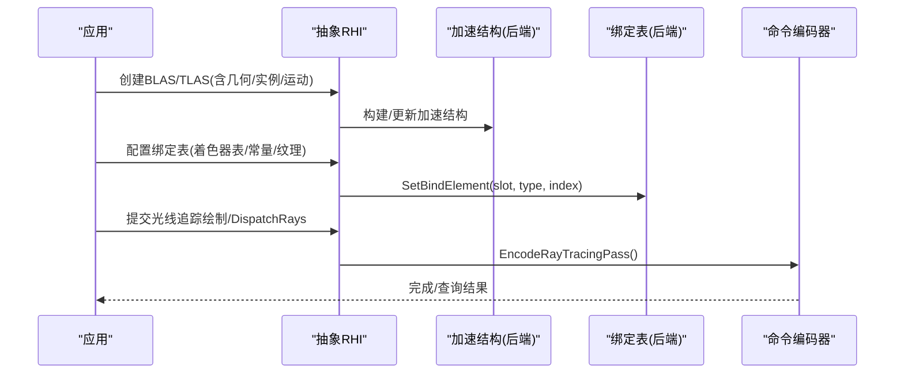
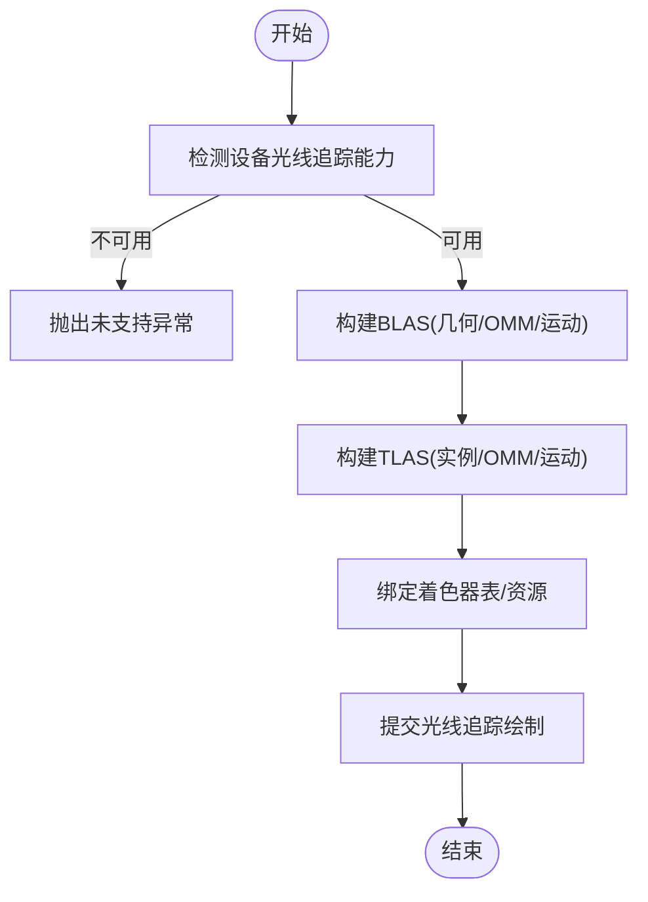
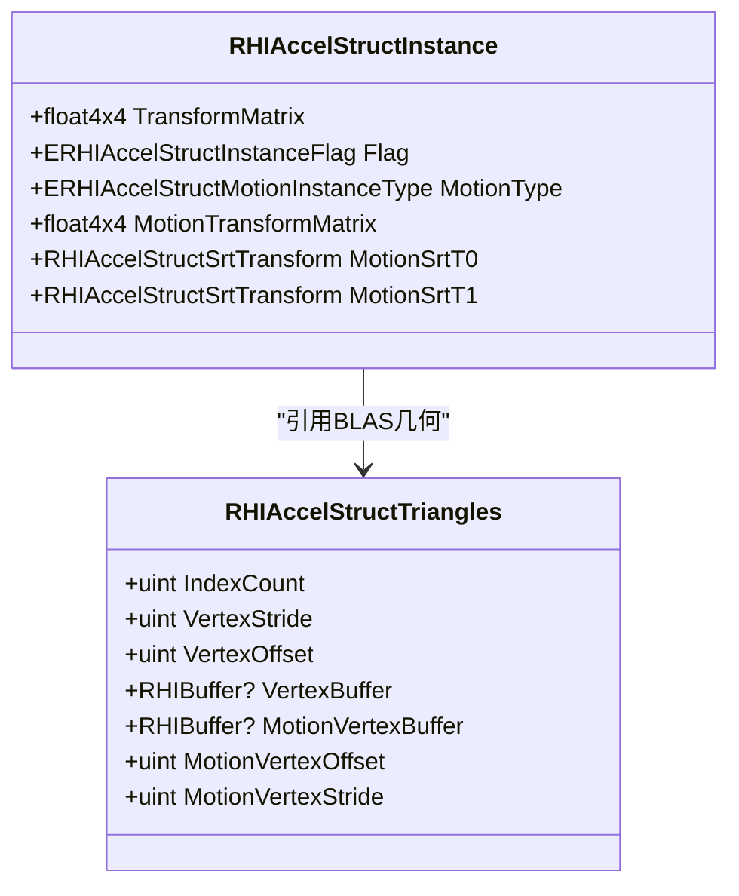
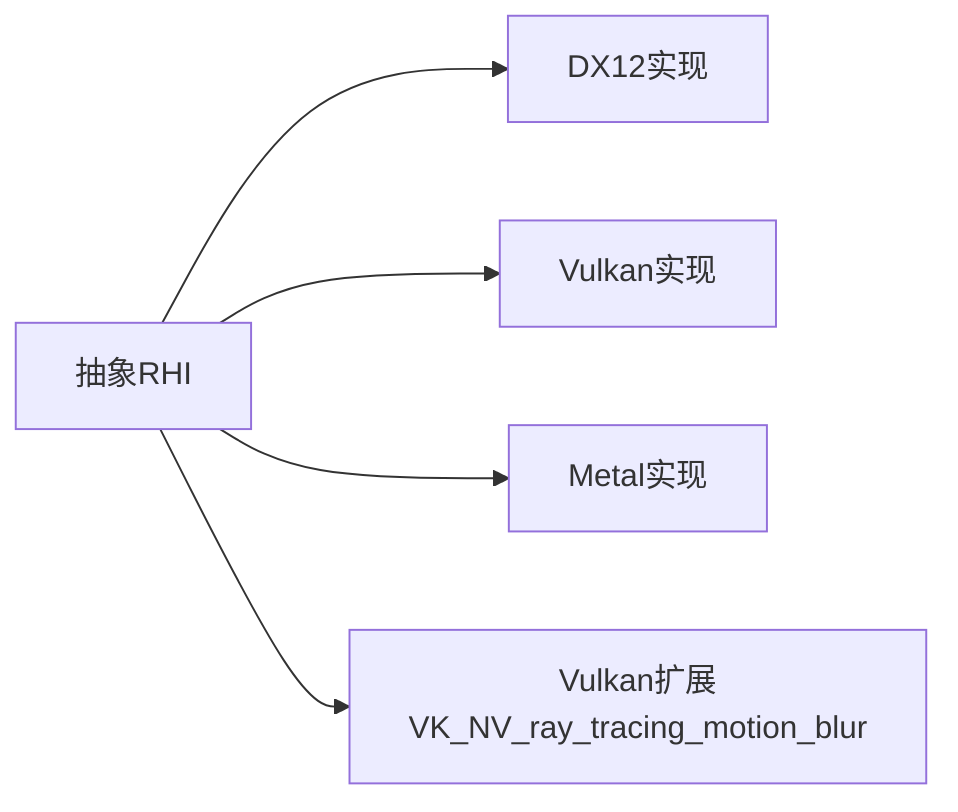

# 现代GPU特性支持

<cite>
**本文引用的文件**
- [FeatureMatrix.md](file://docs/SharpGPU/FeatureMatrix.md)
- [RHIAccelStruct.cs](file://src/SharpGPU/Abstract/RHIAccelStruct.cs)
- [VulkanRayTracingMotionNative.cs](file://src/SharpGPU/Vulkan/VulkanRayTracingMotionNative.cs)
- [RHIBindingTable.cs](file://src/SharpGPU/Abstract/RHIBindingTable.cs)
- [RHISampler.cs](file://src/SharpGPU/Abstract/RHISampler.cs)
- [Dx12AccelStruct.cs](file://src/SharpGPU/Dx12/Dx12AccelStruct.cs)
- [MetalAccelStruct.cs](file://src/SharpGPU/Metal/MetalAccelStruct.cs)
- [VulkanAccelStruct.cs](file://src/SharpGPU/Vulkan/VulkanAccelStruct.cs)
- [Dx12BindingTable.cs](file://src/SharpGPU/Dx12/Dx12BindingTable.cs)
- [MetalBindingTable.cs](file://src/SharpGPU/Metal/MetalBindingTable.cs)
- [VulkanBindingTable.cs](file://src/SharpGPU/Vulkan/VulkanBindingTable.cs)
- [Dx12Sampler.cs](file://src/SharpGPU/Dx12/Dx12Sampler.cs)
- [MetalSampler.cs](file://src/SharpGPU/Metal/MetalSampler.cs)
- [VulkanSampler.cs](file://src/SharpGPU/Vulkan/VulkanSampler.cs)
- [MeshShadingPortableContractTests.cs](file://tests/SharpGPU.Conformance.Tests/MeshShadingPortableContractTests.cs)
- [MeshShadingWindowsQualifiedTests.cs](file://tests/SharpGPU.Conformance.Tests/MeshShadingWindowsQualifiedTests.cs)
- [MeshShadingVulkanQualifiedTests.cs](file://tests/SharpGPU.Conformance.Tests/MeshShadingVulkanQualifiedTests.cs)
- [WaveAndCooperativeMatrixPortableContractTests.cs](file://tests/SharpGPU.Conformance.Tests/WaveAndCooperativeMatrixPortableContractTests.cs)
- [SamplerFeedbackPortableContractTests.cs](file://tests/SharpGPU.Conformance.Tests/SamplerFeedbackPortableContractTests.cs)
- [SamplerFeedbackWindowsQualifiedTests.cs](file://tests/SharpGPU.Conformance.Tests/SamplerFeedbackWindowsQualifiedTests.cs)
</cite>

## 目录
1. [简介](#简介)
2. [项目结构](#项目结构)
3. [核心组件](#核心组件)
4. [架构总览](#架构总览)
5. [详细组件分析](#详细组件分析)
6. [依赖关系分析](#依赖关系分析)
7. [性能考虑](#性能考虑)
8. [故障排查指南](#故障排查指南)
9. [结论](#结论)
10. [附录](#附录)

## 简介
本文件面向希望在 SharpGPU 中启用并高效使用现代 GPU 特性的开发者，系统性说明以下能力：光线追踪（加速结构构建、光线生成与着色器绑定）、Mesh Shading（任务与网格着色器）、协作矩阵（Cooperative Matrix）计算能力、运动模糊（运动顶点与实例）、采样器反馈（优化纹理访问）。每个特性均包含能力检测、API 使用要点与性能注意事项，并提供跨后端（DX12/Vulkan/Metal）的兼容性说明。

## 项目结构
SharpGPU 采用“抽象接口 + 多后端实现”的分层设计：
- 抽象层定义统一 API 与数据结构（如加速结构、绑定表、采样器）。
- 后端实现针对 DX12、Vulkan、Metal 提供具体路径。
- 测试覆盖能力矩阵与平台限定场景，确保公开契约稳定。

图表来源
- [RHIAccelStruct.cs:10-21](file://src/SharpGPU/Abstract/RHIAccelStruct.cs#L10-L21)
- [RHIBindingTable.cs:12-62](file://src/SharpGPU/Abstract/RHIBindingTable.cs#L12-L62)
- [RHISampler.cs:6-36](file://src/SharpGPU/Abstract/RHISampler.cs#L6-L36)

章节来源
- [FeatureMatrix.md:44-72](file://docs/SharpGPU/FeatureMatrix.md#L44-L72)

## 核心组件
- 加速结构与光线追踪：通过 RHIAccelStruct 系列类型描述 BLAS/TLAS、几何体、实例、透明度微图（Opacity Micromap）以及运动数据；RHIRayRecordBuilder 用于编码射线记录。
- 绑定表：RHIBindingTableLayout/Descriptor 描述槽位、类型、阶段与需求；SetBindElement 将资源绑定到管线。
- 采样器：RHISamplerDescriptor 描述过滤、寻址、各向异性等；静态采样器元素可嵌入管线。
- 后端差异：DX12/Vulkan/Metal 各自实现加速结构构建、绑定表布局与采样器创建。

章节来源
- [RHIAccelStruct.cs:90-150](file://src/SharpGPU/Abstract/RHIAccelStruct.cs#L90-L150)
- [RHIAccelStruct.cs:707-751](file://src/SharpGPU/Abstract/RHIAccelStruct.cs#L707-L751)
- [RHIBindingTable.cs:12-62](file://src/SharpGPU/Abstract/RHIBindingTable.cs#L12-L62)
- [RHISampler.cs:6-36](file://src/SharpGPU/Abstract/RHISampler.cs#L6-L36)

## 架构总览
下图展示光线追踪从应用侧到后端的调用链：应用构造加速结构、设置绑定表、提交命令执行光线追踪。

图表来源
- [RHIAccelStruct.cs:707-751](file://src/SharpGPU/Abstract/RHIAccelStruct.cs#L707-L751)
- [RHIBindingTable.cs:44-62](file://src/SharpGPU/Abstract/RHIBindingTable.cs#L44-L62)

## 详细组件分析

### 光线追踪（Ray Tracing）
- 能力检测
  - 通过设备能力报告中的 RayTracing 域判断可用性；不可用时工厂方法抛出未支持异常。
  - 透明度微图（Opacity Micromap）与运动模糊（Motion）为可选子域，需分别检查。
- 加速结构构建
  - BLAS：三角形/AABB/曲线几何，支持透明度微图索引与特殊索引。
  - TLAS：实例数组，支持 OMM 状态强制与禁用标志。
  - 运动：支持运动顶点缓冲与实例矩阵/SRT；要求顶点步长一致且开启 Motion 标志。
- 光线生成与着色器绑定
  - 通过绑定表将着色器记录、常量、纹理、加速结构绑定至槽位。
  - 命令编码器提交光线追踪绘制或 DispatchRays。
- 性能建议
  - 合理选择构建标志（优先快速构建/追踪、最小内存、允许压缩）。
  - 复用 BLAS/TLAS 减少重建；增量更新时避免切换运动模式。
  - 使用透明度微图降低无关表面着色成本。
- 后端注意
  - DX12：标准 D3D12 路径；无标准 motion AS 路径。
  - Vulkan：需要启用 VK_NV_ray_tracing_motion_blur 扩展并加载对应函数指针。
  - Metal：编译期可用性与描述符绑定限制。

图表来源
- [RHIAccelStruct.cs:10-21](file://src/SharpGPU/Abstract/RHIAccelStruct.cs#L10-L21)
- [RHIAccelStruct.cs:90-150](file://src/SharpGPU/Abstract/RHIAccelStruct.cs#L90-L150)
- [RHIAccelStruct.cs:707-751](file://src/SharpGPU/Abstract/RHIAccelStruct.cs#L707-L751)
- [VulkanRayTracingMotionNative.cs:122-153](file://src/SharpGPU/Vulkan/VulkanRayTracingMotionNative.cs#L122-L153)

章节来源
- [FeatureMatrix.md:53-55](file://docs/SharpGPU/FeatureMatrix.md#L53-L55)
- [RHIAccelStruct.cs:398-599](file://src/SharpGPU/Abstract/RHIAccelStruct.cs#L398-L599)
- [VulkanRayTracingMotionNative.cs:1-157](file://src/SharpGPU/Vulkan/VulkanRayTracingMotionNative.cs#L1-L157)

### Mesh Shading（任务与网格着色器）
- 能力检测
  - 通过 Mesh.MeshShader/TaskShader 能力域判断；不可用时工厂/编码抛未支持异常。
- API 使用
  - 创建网格渲染管线，调度任务与网格着色器，输出图元供光栅化。
- 性能建议
  - 利用任务着色器进行细粒度剔除与批处理；网格着色器按需生成顶点。
  - 控制每绘制调度的网格规模，避免过度细分。
- 后端注意
  - Windows 与 Vulkan 具备相应限定测试；Metal 在 MSL 编译期有可用性约束。

章节来源
- [FeatureMatrix.md:56](file://docs/SharpGPU/FeatureMatrix.md#L56)
- [MeshShadingPortableContractTests.cs](file://tests/SharpGPU.Conformance.Tests/MeshShadingPortableContractTests.cs)
- [MeshShadingWindowsQualifiedTests.cs](file://tests/SharpGPU.Conformance.Tests/MeshShadingWindowsQualifiedTests.cs)
- [MeshShadingVulkanQualifiedTests.cs](file://tests/SharpGPU.Conformance.Tests/MeshShadingVulkanQualifiedTests.cs)

### 协作矩阵（Cooperative Matrix）
- 能力检测
  - 通过 Compute.CooperativeMatrix 能力域枚举；当前 DX12 不可用（ vendored SDK 无 WaveMMA 查询）。
- API 使用
  - 查询支持的协作矩阵配置，并在计算着色器中使用相应指令。
- 性能建议
  - 针对目标硬件选择合适的矩阵尺寸与数据类型；避免频繁切换配置。
  - 结合共享内存与寄存器重排提升吞吐。
- 后端注意
  - Vulkan 通过 KHR_cooperative_matrix 枚举；DX12 与 Metal 当前不可用或未暴露。

章节来源
- [FeatureMatrix.md:70](file://docs/SharpGPU/FeatureMatrix.md#L70)
- [WaveAndCooperativeMatrixPortableContractTests.cs](file://tests/SharpGPU.Conformance.Tests/WaveAndCooperativeMatrixPortableContractTests.cs)

### 运动模糊（Motion Blur）
- 能力检测
  - 通过 RayTracing.Motion 能力域判断；Vulkan 需启用 NV 扩展并加载函数指针。
- API 使用
  - 在三角形几何中提供运动顶点缓冲（MotionVertexBuffer），设置 MotionVertexOffset/Stride。
  - 实例支持矩阵或 SRT 两种运动表示；必须与 Flag.Motion 匹配。
- 性能建议
  - 保持运动顶点步长与静态顶点步长一致；避免运行时切换运动模式。
  - 合理组织实例数组以利于缓存命中。
- 后端注意
  - DX12：无标准 motion AS 路径。
  - Vulkan：需要 VK_NV_ray_tracing_motion_blur 及对应函数导出。
  - Metal：编译期可用性取决于 supportsPrimitiveMotionBlur 与描述符绑定。

图表来源
- [RHIAccelStruct.cs:129-150](file://src/SharpGPU/Abstract/RHIAccelStruct.cs#L129-L150)
- [RHIAccelStruct.cs:707-720](file://src/SharpGPU/Abstract/RHIAccelStruct.cs#L707-L720)

章节来源
- [FeatureMatrix.md:55](file://docs/SharpGPU/FeatureMatrix.md#L55)
- [RHIAccelStruct.cs:426-599](file://src/SharpGPU/Abstract/RHIAccelStruct.cs#L426-L599)
- [VulkanRayTracingMotionNative.cs:1-157](file://src/SharpGPU/Vulkan/VulkanRayTracingMotionNative.cs#L1-L157)

### 采样器反馈（Sampler Feedback）
- 能力检测
  - 通过 Raster.SamplerFeedback 能力域判断；当前为 DX12 专用。
- API 使用
  - 创建反馈贴图，在编码阶段进行清除、解析、解码与拷贝操作。
- 性能建议
  - 仅在需要自适应采样或 LOD 优化的场景启用；避免每帧全量反馈。
  - 合理分区反馈区域，减少带宽压力。
- 后端注意
  - Vulkan/Metal 不可用；不在编码器层面配对，需在创建时建立关联。

章节来源
- [FeatureMatrix.md:69](file://docs/SharpGPU/FeatureMatrix.md#L69)
- [SamplerFeedbackPortableContractTests.cs](file://tests/SharpGPU.Conformance.Tests/SamplerFeedbackPortableContractTests.cs)
- [SamplerFeedbackWindowsQualifiedTests.cs](file://tests/SharpGPU.Conformance.Tests/SamplerFeedbackWindowsQualifiedTests.cs)

## 依赖关系分析
- 抽象层依赖
  - RHIAccelStruct 依赖 RHIBuffer/RHITextureView/RHIBufferView 等资源类型。
  - RHIBindingTable 依赖 RHISampler/RHIBufferView/RHITextureView/RHITopLevelAccelStruct。
- 后端实现
  - DX12/Vulkan/Metal 各自实现加速结构构建、绑定表布局与采样器创建。
- 外部依赖
  - Vulkan 运动模糊依赖 VK_NV_ray_tracing_motion_blur 扩展与函数指针。

图表来源
- [VulkanRayTracingMotionNative.cs:122-153](file://src/SharpGPU/Vulkan/VulkanRayTracingMotionNative.cs#L122-L153)

章节来源
- [RHIAccelStruct.cs:90-150](file://src/SharpGPU/Abstract/RHIAccelStruct.cs#L90-L150)
- [RHIBindingTable.cs:44-62](file://src/SharpGPU/Abstract/RHIBindingTable.cs#L44-L62)

## 性能考虑
- 光线追踪
  - 构建阶段：优先 FastBuild/MinimizeMemory；避免不必要的压缩。
  - 运行阶段：复用加速结构；减少更新频率；合理使用 OMM。
  - 绑定表：批量绑定，减少 SetBindElement 调用次数。
- Mesh Shading
  - 任务着色器做粗粒度剔除；网格着色器精细控制顶点生成。
  - 控制每绘制网格数量与复杂度，避免过细分。
- 协作矩阵
  - 选择与硬件匹配的矩阵尺寸；尽量在寄存器内完成中间计算。
  - 避免频繁切换配置；合并多次矩阵运算。
- 运动模糊
  - 保持运动顶点步长一致；避免运行时切换运动模式。
  - 实例数组按空间局部性排序，提高缓存命中率。
- 采样器反馈
  - 仅对关键区域启用；分块反馈以降低带宽。
  - 避免每帧全量解析与解码。

[本节为通用指导，不直接分析具体文件]

## 故障排查指南
- 常见错误与定位
  - 能力缺失：当设备能力未报告某特性时，相关工厂或编码会抛出未支持异常。请检查设备能力报告与平台限定测试结果。
  - 参数非法：如透明度微图格式未知、运动类型未知、步长不一致等，会在验证阶段失败并给出明确原因。
  - 后端不可用：例如 DX12 无标准 motion AS 路径；Vulkan 需启用扩展并加载函数指针；Metal 编译期可用性受限。
- 调试步骤
  - 确认能力检测结果与 FeatureMatrix 行项一致。
  - 检查加速结构构建描述符与实例数组是否满足约束（如 OMM 索引、运动标志）。
  - 对于 Vulkan 运动模糊，确认扩展已启用且关键函数指针可获取。
  - 对于采样器反馈，确认创建时配对正确，并在编码器中执行必要的清除/解析/解码/拷贝。

章节来源
- [FeatureMatrix.md:44-72](file://docs/SharpGPU/FeatureMatrix.md#L44-L72)
- [RHIAccelStruct.cs:208-396](file://src/SharpGPU/Abstract/RHIAccelStruct.cs#L208-L396)
- [VulkanRayTracingMotionNative.cs:122-153](file://src/SharpGPU/Vulkan/VulkanRayTracingMotionNative.cs#L122-L153)

## 结论
SharpGPU 通过统一的抽象层与多后端实现，为现代 GPU 特性提供了稳定的公共契约。光线追踪、Mesh Shading、协作矩阵、运动模糊与采样器反馈均在能力检测、API 使用与性能方面具备清晰的指导与约束。开发者应依据设备能力与平台限定进行测试与优化，充分利用后端特性以获得最佳性能。

[本节为总结，不直接分析具体文件]

## 附录
- 参考文件
  - 能力矩阵与平台限定：[FeatureMatrix.md](file://docs/SharpGPU/FeatureMatrix.md)
  - 加速结构与运动模糊：[RHIAccelStruct.cs](file://src/SharpGPU/Abstract/RHIAccelStruct.cs)、[VulkanRayTracingMotionNative.cs](file://src/SharpGPU/Vulkan/VulkanRayTracingMotionNative.cs)
  - 绑定表与采样器：[RHIBindingTable.cs](file://src/SharpGPU/Abstract/RHIBindingTable.cs)、[RHISampler.cs](file://src/SharpGPU/Abstract/RHISampler.cs)
  - 后端实现：DX12/Vulkan/Metal 对应 AccelStruct、BindingTable、Sampler 文件
  - 测试用例：Mesh Shading、协作矩阵、采样器反馈相关测试文件

[本节为附录，不直接分析具体文件]