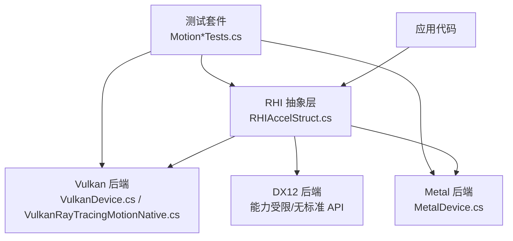
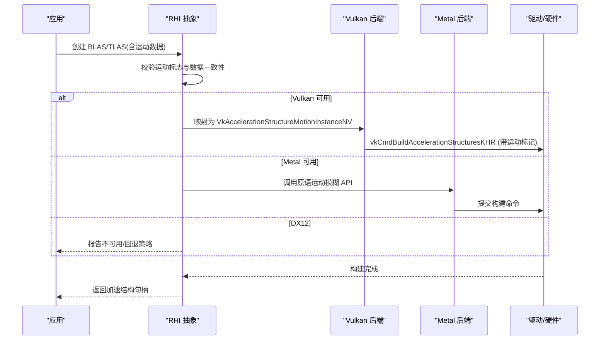
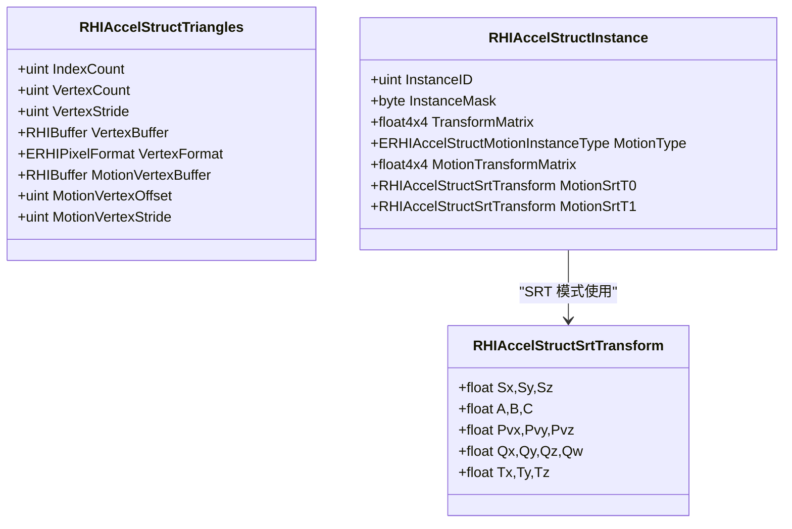
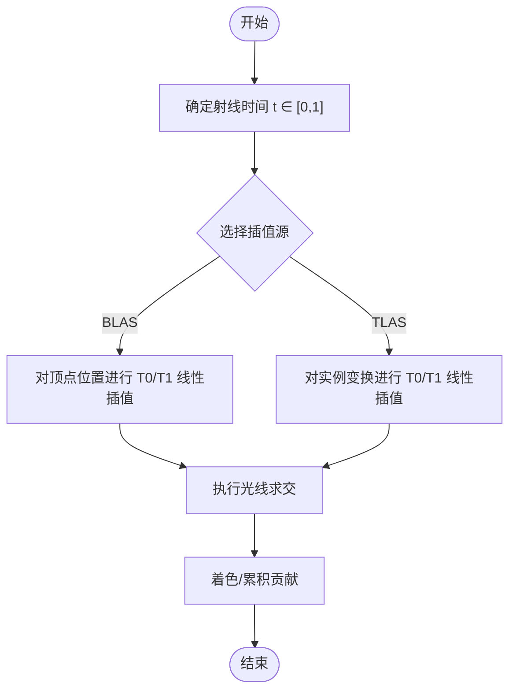
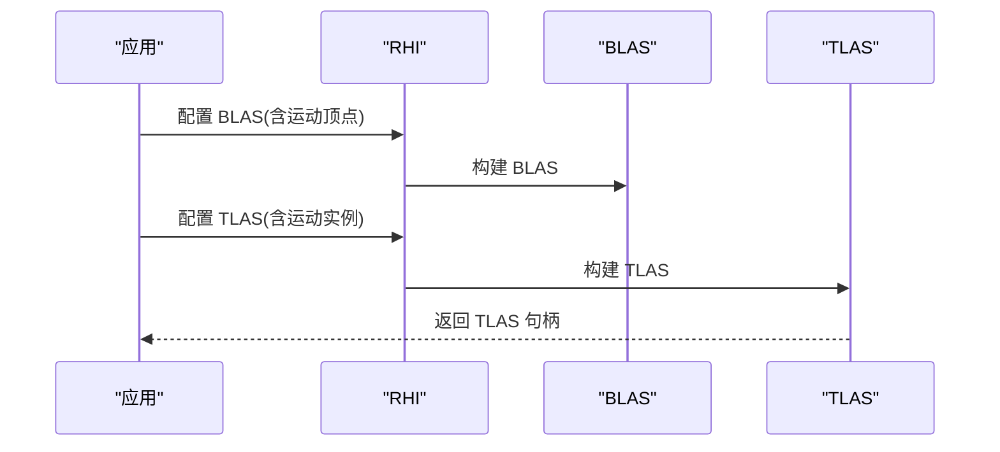
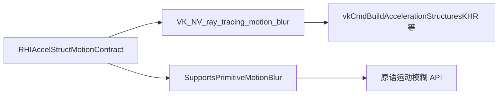

# 运动模糊支持

<cite>
**本文引用的文件**
- [src/SharpGPU/Abstract/RHIAccelStruct.cs](file://src/SharpGPU/Abstract/RHIAccelStruct.cs)
- [src/SharpGPU/Vulkan/VulkanRayTracingMotionNative.cs](file://src/SharpGPU/Vulkan/VulkanRayTracingMotionNative.cs)
- [src/SharpGPU/Vulkan/VulkanDevice.cs](file://src/SharpGPU/Vulkan/VulkanDevice.cs)
- [src/SharpGPU/Metal/MetalDevice.cs](file://src/SharpGPU/Metal/MetalDevice.cs)
- [tests/SharpGPU.Conformance.Tests/MotionPortableContractTests.cs](file://tests/SharpGPU.Conformance.Tests/MotionPortableContractTests.cs)
- [tests/SharpGPU.Conformance.Tests/MotionQualificationHelper.cs](file://tests/SharpGPU.Conformance.Tests/MotionQualificationHelper.cs)
- [tests/SharpGPU.Conformance.Tests/MotionVulkanQualifiedTests.cs](file://tests/SharpGPU.Conformance.Tests/MotionVulkanQualifiedTests.cs)
</cite>

## 目录
1. [简介](#简介)
2. [项目结构](#项目结构)
3. [核心组件](#核心组件)
4. [架构总览](#架构总览)
5. [详细组件分析](#详细组件分析)
6. [依赖关系分析](#依赖关系分析)
7. [性能考虑](#性能考虑)
8. [故障排查指南](#故障排查指南)
9. [结论](#结论)
10. [附录](#附录)

## 简介
本文件为 SharpGPU 的运动模糊（Motion Blur）能力提供综合技术文档。内容涵盖：
- 光线追踪中运动几何体与运动实例的表示方法（数据格式、布局与约束）
- 时间插值在运动模糊渲染中的应用（两帧之间的线性插值与扩展说明）
- 运动加速结构的构建流程与优化策略
- 完整的渲染示例与最佳实践
- 性能考量（内存、计算开销、质量调节参数）
- 与光线追踪及其他图形效果的集成方式

## 项目结构
SharpGPU 将运动模糊能力抽象到 RHI 层，并通过各后端（Vulkan、Metal、DX12）进行具体实现或能力探测。关键位置如下：
- 抽象模型与契约：定义运动实例类型、三角形运动顶点、描述符校验等
- Vulkan 后端：启用并桥接 VK_NV_ray_tracing_motion_blur 扩展，映射原生结构体
- Metal 后端：通过设备能力探测是否支持原语级运动模糊
- 测试套件：覆盖跨平台契约、能力探测、失败关闭行为与最小可复现用例

图表来源
- [src/SharpGPU/Abstract/RHIAccelStruct.cs:10-21](file://src/SharpGPU/Abstract/RHIAccelStruct.cs#L10-L21)
- [src/SharpGPU/Vulkan/VulkanRayTracingMotionNative.cs:9-24](file://src/SharpGPU/Vulkan/VulkanRayTracingMotionNative.cs#L9-L24)
- [src/SharpGPU/Metal/MetalDevice.cs:1240-1243](file://src/SharpGPU/Metal/MetalDevice.cs#L1240-L1243)

章节来源
- [src/SharpGPU/Abstract/RHIAccelStruct.cs:10-21](file://src/SharpGPU/Abstract/RHIAccelStruct.cs#L10-L21)
- [src/SharpGPU/Vulkan/VulkanRayTracingMotionNative.cs:9-24](file://src/SharpGPU/Vulkan/VulkanRayTracingMotionNative.cs#L9-L24)
- [src/SharpGPU/Metal/MetalDevice.cs:1240-1243](file://src/SharpGPU/Metal/MetalDevice.cs#L1240-L1243)

## 核心组件
- 加速结构标志与运动模式
  - ERHIAccelStructFlag.Motion 用于标识 BLAS/TLAS 使用运动模式
- 运动实例类型
  - ERHIAccelStructMotionInstanceType.None/Matrix/Srt
- 三角形运动顶点
  - RHIAccelStructTriangles 中的 MotionVertexBuffer、MotionVertexOffset、MotionVertexStride
- SRT 变换
  - RHIAccelStructSrtTransform 包含缩放、剪切、旋转四元数与平移
- 描述符与契约校验
  - RHIAccelStructMotionContract 负责一致性检查、哈希、步长解析与更新限制

章节来源
- [src/SharpGPU/Abstract/RHIAccelStruct.cs:10-21](file://src/SharpGPU/Abstract/RHIAccelStruct.cs#L10-L21)
- [src/SharpGPU/Abstract/RHIAccelStruct.cs:55-60](file://src/SharpGPU/Abstract/RHIAccelStruct.cs#L55-L60)
- [src/SharpGPU/Abstract/RHIAccelStruct.cs:129-150](file://src/SharpGPU/Abstract/RHIAccelStruct.cs#L129-L150)
- [src/SharpGPU/Abstract/RHIAccelStruct.cs:152-171](file://src/SharpGPU/Abstract/RHIAccelStruct.cs#L152-L171)
- [src/SharpGPU/Abstract/RHIAccelStruct.cs:426-705](file://src/SharpGPU/Abstract/RHIAccelStruct.cs#L426-L705)

## 架构总览
SharpGPU 的运动模糊能力由“抽象契约 + 后端实现”组成：
- 抽象层统一描述运动几何体与实例的数据布局，并提供强一致的校验逻辑
- Vulkan 后端通过 VK_NV_ray_tracing_motion_blur 扩展启用运动模糊，并将抽象数据映射到 VkAccelerationStructureMotionInstanceNV 等原生结构
- Metal 后端基于设备能力 SupportsPrimitiveMotionBlur 判定可用性
- DX12 路径在当前实现中未暴露标准运动模糊加速结构 API

图表来源
- [src/SharpGPU/Vulkan/VulkanRayTracingMotionNative.cs:122-154](file://src/SharpGPU/Vulkan/VulkanRayTracingMotionNative.cs#L122-L154)
- [src/SharpGPU/Vulkan/VulkanDevice.cs:560-660](file://src/SharpGPU/Vulkan/VulkanDevice.cs#L560-L660)
- [src/SharpGPU/Metal/MetalDevice.cs:1240-1243](file://src/SharpGPU/Metal/MetalDevice.cs#L1240-L1243)

## 详细组件分析

### 运动几何体与实例的数据格式
- 三角形运动顶点
  - 静态顶点缓冲与运动顶点缓冲需保持一致的顶点步长；若未显式设置 MotionVertexStride，则复用 VertexStride
  - 当存在索引时，必须满足 IndexCount > 0 且能被 3 整除
- 运动实例
  - 支持 None、Matrix、Srt 三种类型
  - Matrix 模式使用两个 4x4 矩阵（T0/T1），Srt 模式使用两组 SRT 参数
  - Vulkan 端要求每个实例数组元素大小为 160 字节，确保对齐与跨平台一致
- 描述符一致性
  - 若设置了 ERHIAccelStructFlag.Motion，则必须存在对应的运动数据；反之亦然
  - 未知 MotionType 会触发失败关闭（抛出异常）

图表来源
- [src/SharpGPU/Abstract/RHIAccelStruct.cs:129-171](file://src/SharpGPU/Abstract/RHIAccelStruct.cs#L129-L171)
- [src/SharpGPU/Abstract/RHIAccelStruct.cs:707-720](file://src/SharpGPU/Abstract/RHIAccelStruct.cs#L707-L720)

章节来源
- [src/SharpGPU/Abstract/RHIAccelStruct.cs:129-171](file://src/SharpGPU/Abstract/RHIAccelStruct.cs#L129-L171)
- [src/SharpGPU/Abstract/RHIAccelStruct.cs:426-544](file://src/SharpGPU/Abstract/RHIAccelStruct.cs#L426-L544)
- [src/SharpGPU/Vulkan/VulkanRayTracingMotionNative.cs:23-24](file://src/SharpGPU/Vulkan/VulkanRayTracingMotionNative.cs#L23-L24)
- [tests/SharpGPU.Conformance.Tests/MotionPortableContractTests.cs:34-41](file://tests/SharpGPU.Conformance.Tests/MotionPortableContractTests.cs#L34-L41)

### 时间插值与渲染管线
- 两帧线性插值
  - 运动模糊的核心是在 T0 与 T1 之间对顶点或实例变换进行线性插值，以模拟快门期间的连续位移
  - 在 BLAS 中，三角形顶点按帧采样；在 TLAS 中，实例变换按帧采样
- 高级插值算法
  - 当前抽象层与后端主要提供两帧线性插值能力；更复杂的曲线插值需在应用层准备多帧数据并按后端能力扩展
- 渲染集成
  - 在光线追踪着色器中，根据射线时间与场景状态对运动数据进行采样与插值，得到最终像素颜色

[此图为概念性流程图，不直接映射具体源码，故无图表来源]

### 运动加速结构的构建与优化
- 构建流程
  - 先构建 BLAS（三角形几何体，可选运动顶点缓冲）
  - 再构建 TLAS（实例列表，可选运动实例数据）
  - 在 Vulkan 后端，启用 VK_NV_ray_tracing_motion_blur 扩展，并在构建时使用相应标志位
- 优化策略
  - 保持顶点步长一致，避免额外拷贝与重排
  - 合理组织实例数组，减少内存碎片
  - 利用 PreferFastBuild/PreferFastTrace 等标志平衡构建与查询性能
  - 在频繁更新的场景中，优先使用 UpdateAccelerationStructure 而非重建

图表来源
- [tests/SharpGPU.Conformance.Tests/MotionQualificationHelper.cs:95-170](file://tests/SharpGPU.Conformance.Tests/MotionQualificationHelper.cs#L95-L170)
- [tests/SharpGPU.Conformance.Tests/MotionQualificationHelper.cs:10-93](file://tests/SharpGPU.Conformance.Tests/MotionQualificationHelper.cs#L10-L93)
- [src/SharpGPU/Vulkan/VulkanRayTracingMotionNative.cs:122-154](file://src/SharpGPU/Vulkan/VulkanRayTracingMotionNative.cs#L122-L154)

章节来源
- [tests/SharpGPU.Conformance.Tests/MotionQualificationHelper.cs:95-170](file://tests/SharpGPU.Conformance.Tests/MotionQualificationHelper.cs#L95-L170)
- [tests/SharpGPU.Conformance.Tests/MotionQualificationHelper.cs:10-93](file://tests/SharpGPU.Conformance.Tests/MotionQualificationHelper.cs#L10-L93)
- [src/SharpGPU/Vulkan/VulkanRayTracingMotionNative.cs:122-154](file://src/SharpGPU/Vulkan/VulkanRayTracingMotionNative.cs#L122-L154)

### 完整渲染示例（最小可运行路径）
- 构建三角形 BLAS（含运动顶点缓冲）
- 构建实例 TLAS（含运动实例矩阵或 SRT）
- 在光线追踪通道中提交构建命令并提交队列
- 在着色器中使用时间 t 对运动数据进行插值并求交

参考路径
- 三角形 BLAS 构建示例：[MotionQualificationHelper.BuildTinyMotionTriangleBlas:95-170](file://tests/SharpGPU.Conformance.Tests/MotionQualificationHelper.cs#L95-L170)
- 实例 TLAS 构建示例：[MotionQualificationHelper.BuildTinyMotionInstanceTlas:10-93](file://tests/SharpGPU.Conformance.Tests/MotionQualificationHelper.cs#L10-L93)
- Vulkan 能力探测与端到端验证：[MotionVulkanQualifiedTests:1-119](file://tests/SharpGPU.Conformance.Tests/MotionVulkanQualifiedTests.cs#L1-L119)

章节来源
- [tests/SharpGPU.Conformance.Tests/MotionQualificationHelper.cs:10-93](file://tests/SharpGPU.Conformance.Tests/MotionQualificationHelper.cs#L10-L93)
- [tests/SharpGPU.Conformance.Tests/MotionQualificationHelper.cs:95-170](file://tests/SharpGPU.Conformance.Tests/MotionQualificationHelper.cs#L95-L170)
- [tests/SharpGPU.Conformance.Tests/MotionVulkanQualifiedTests.cs:1-119](file://tests/SharpGPU.Conformance.Tests/MotionVulkanQualifiedTests.cs#L1-L119)

## 依赖关系分析
- 抽象层依赖
  - RHIAccelStructMotionContract 负责运动相关的一致性校验、哈希与步长解析
- Vulkan 后端依赖
  - 启用 VK_NV_ray_tracing_motion_blur 扩展，并加载必要的函数指针（vkGetAccelerationStructureBuildSizesKHR、vkCmdBuildAccelerationStructuresKHR、vkCreateAccelerationStructureKHR、vkCreateRayTracingPipelinesKHR）
  - 物理设备特性链中包含 VkPhysicalDeviceRayTracingMotionBlurFeaturesNV
- Metal 后端依赖
  - 通过 m_NativeDevice.SupportsPrimitiveMotionBlur 判断是否支持原语级运动模糊
- 测试依赖
  - 跨平台契约测试验证公开符号、错误处理与失败关闭行为
  - 能力限定测试在不同后端上验证最小构建路径

图表来源
- [src/SharpGPU/Vulkan/VulkanRayTracingMotionNative.cs:9-24](file://src/SharpGPU/Vulkan/VulkanRayTracingMotionNative.cs#L9-L24)
- [src/SharpGPU/Vulkan/VulkanDevice.cs:560-660](file://src/SharpGPU/Vulkan/VulkanDevice.cs#L560-L660)
- [src/SharpGPU/Metal/MetalDevice.cs:1240-1243](file://src/SharpGPU/Metal/MetalDevice.cs#L1240-L1243)

章节来源
- [src/SharpGPU/Vulkan/VulkanRayTracingMotionNative.cs:9-24](file://src/SharpGPU/Vulkan/VulkanRayTracingMotionNative.cs#L9-L24)
- [src/SharpGPU/Vulkan/VulkanDevice.cs:560-660](file://src/SharpGPU/Vulkan/VulkanDevice.cs#L560-L660)
- [src/SharpGPU/Metal/MetalDevice.cs:1240-1243](file://src/SharpGPU/Metal/MetalDevice.cs#L1240-L1243)
- [tests/SharpGPU.Conformance.Tests/MotionPortableContractTests.cs:13-32](file://tests/SharpGPU.Conformance.Tests/MotionPortableContractTests.cs#L13-L32)

## 性能考虑
- 内存使用
  - 运动实例数组元素固定大小（Vulkan 端 160 字节），需确保对齐与填充正确
  - 运动顶点缓冲与静态顶点缓冲共享步长可减少重排与拷贝
- 计算开销
  - 构建阶段：启用 PreferFastBuild 可缩短构建时间；查询阶段 PreferFastTrace 提升求交速度
  - 更新阶段：优先使用 UpdateAccelerationStructure 避免重建
- 质量调节
  - 通过控制采样数量与时间采样分布（在应用层）调节运动模糊强度与质量
  - 选择合适的运动实例类型（Matrix 通常更通用，SRT 在某些场景更高效）
- 后端差异
  - Vulkan：需要启用扩展与特性链；确保所有必需函数指针可用
  - Metal：依赖设备能力 SupportsPrimitiveMotionBlur
  - DX12：当前未提供标准运动模糊加速结构 API，需评估回退策略

章节来源
- [src/SharpGPU/Vulkan/VulkanRayTracingMotionNative.cs:23-24](file://src/SharpGPU/Vulkan/VulkanRayTracingMotionNative.cs#L23-L24)
- [src/SharpGPU/Abstract/RHIAccelStruct.cs:10-21](file://src/SharpGPU/Abstract/RHIAccelStruct.cs#L10-L21)
- [src/SharpGPU/Metal/MetalDevice.cs:1240-1243](file://src/SharpGPU/Metal/MetalDevice.cs#L1240-L1243)
- [src/SharpGPU/Vulkan/VulkanRayTracingMotionNative.cs:122-154](file://src/SharpGPU/Vulkan/VulkanRayTracingMotionNative.cs#L122-L154)

## 故障排查指南
- 常见错误与失败关闭
  - 未知 MotionType：抛出 ArgumentOutOfRangeException
  - 索引三角形意图无效：IndexCount 不为 0 且不被 3 整除，或 IndexBuffer 缺失
  - 运动顶点步长不一致：MotionVertexStride 与 VertexStride 不同时报 NotSupportedException
  - 运动标志与数据不匹配：设置 Motion 但未提供运动数据，或反之
  - 更新时切换运动模式：不允许在 UpdateAccelerationStructure 中改变运动模式
- 能力不可用
  - 未探测或未启用后端运动能力时，创建运动 BLAS/TLAS 将抛出 NotSupportedException
- 调试建议
  - 使用最小可复现实例（如 TinyTriangleBlas/TinyInstanceTlas）定位问题
  - 在 Vulkan 后端确认扩展与函数指针已加载
  - 在 Metal 后端确认 SupportsPrimitiveMotionBlur 为真

章节来源
- [src/SharpGPU/Abstract/RHIAccelStruct.cs:426-553](file://src/SharpGPU/Abstract/RHIAccelStruct.cs#L426-L553)
- [tests/SharpGPU.Conformance.Tests/MotionPortableContractTests.cs:148-281](file://tests/SharpGPU.Conformance.Tests/MotionPortableContractTests.cs#L148-L281)
- [tests/SharpGPU.Conformance.Tests/MotionQualificationHelper.cs:172-224](file://tests/SharpGPU.Conformance.Tests/MotionQualificationHelper.cs#L172-L224)
- [tests/SharpGPU.Conformance.Tests/MotionQualificationHelper.cs:310-357](file://tests/SharpGPU.Conformance.Tests/MotionQualificationHelper.cs#L310-L357)
- [tests/SharpGPU.Conformance.Tests/MotionVulkanQualifiedTests.cs:1-119](file://tests/SharpGPU.Conformance.Tests/MotionVulkanQualifiedTests.cs#L1-L119)

## 结论
SharpGPU 通过统一的抽象层与后端适配，提供了跨平台的运动模糊能力。其核心在于：
- 明确的数据格式与严格的契约校验，确保运动几何体与实例的正确表示
- 在两帧之间进行线性插值的渲染流程，满足大多数运动模糊需求
- 针对 Vulkan 与 Metal 的后端实现，结合能力探测与失败关闭策略，保证健壮性
- 提供最小可复现实例与完善的测试覆盖，便于集成与调试

## 附录
- 关键枚举与结构
  - ERHIAccelStructFlag.Motion：启用运动模式
  - ERHIAccelStructMotionInstanceType：None/Matrix/Srt
  - RHIAccelStructSrtTransform：SRT 参数集合
  - Vulkan 运动实例结构：VkAccelerationStructureMotionInstanceNV（160 字节）
- 参考路径
  - 抽象契约与数据结构：[RHIAccelStruct.cs](file://src/SharpGPU/Abstract/RHIAccelStruct.cs)
  - Vulkan 运动模糊原生接口：[VulkanRayTracingMotionNative.cs](file://src/SharpGPU/Vulkan/VulkanRayTracingMotionNative.cs)
  - 能力探测与启用：[VulkanDevice.cs](file://src/SharpGPU/Vulkan/VulkanDevice.cs), [MetalDevice.cs](file://src/SharpGPU/Metal/MetalDevice.cs)
  - 测试与示例：[MotionPortableContractTests.cs](file://tests/SharpGPU.Conformance.Tests/MotionPortableContractTests.cs), [MotionQualificationHelper.cs](file://tests/SharpGPU.Conformance.Tests/MotionQualificationHelper.cs), [MotionVulkanQualifiedTests.cs](file://tests/SharpGPU.Conformance.Tests/MotionVulkanQualifiedTests.cs)