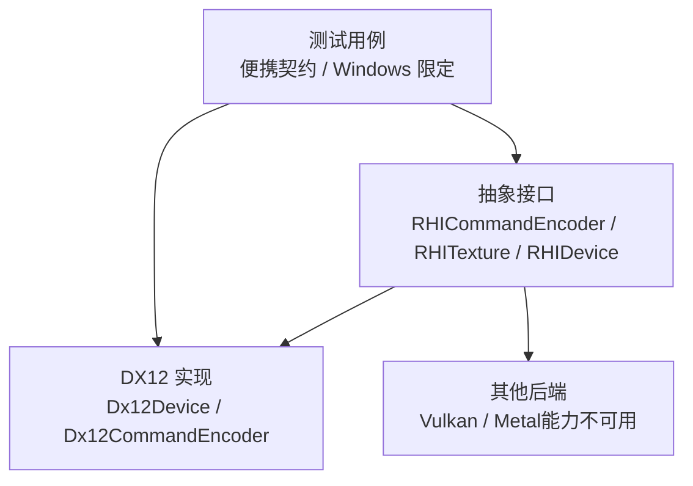
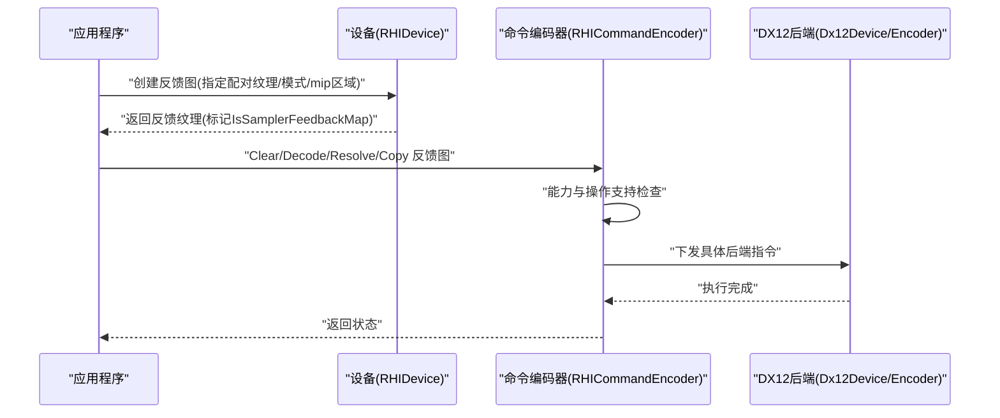
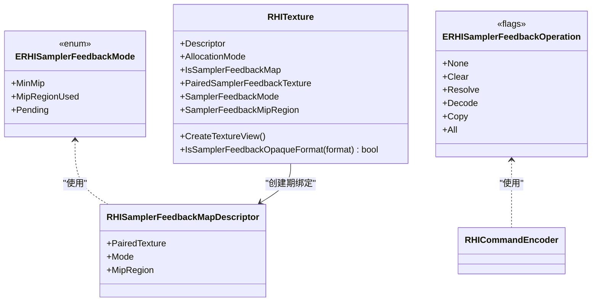
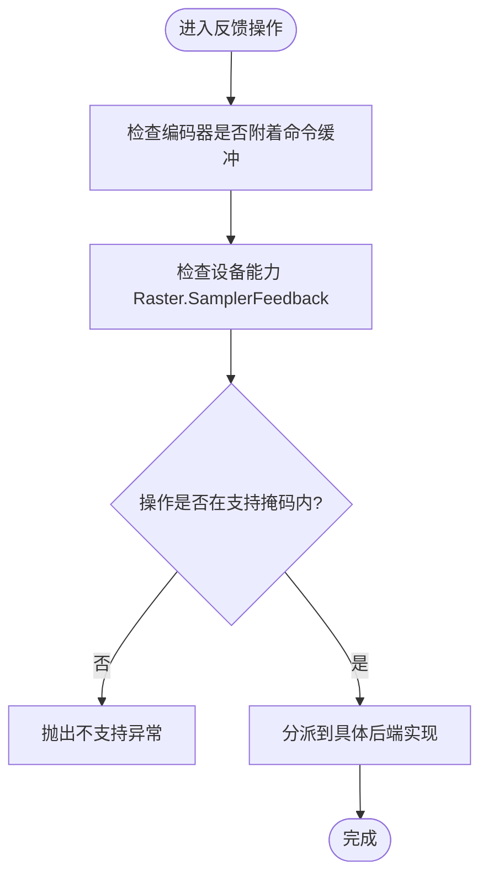
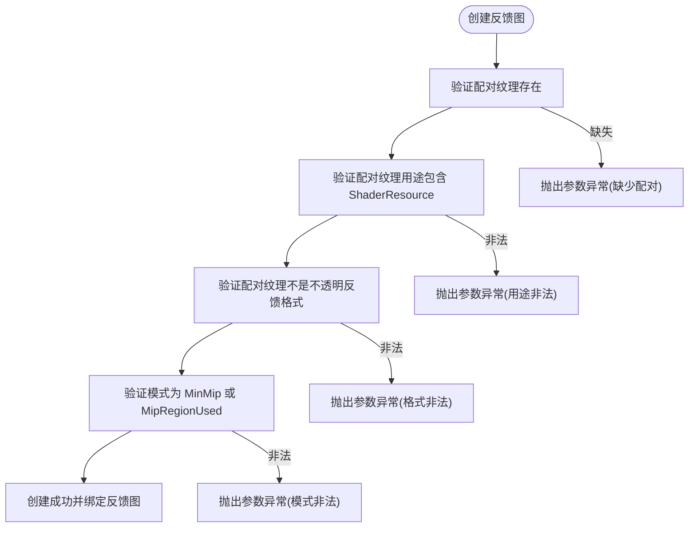
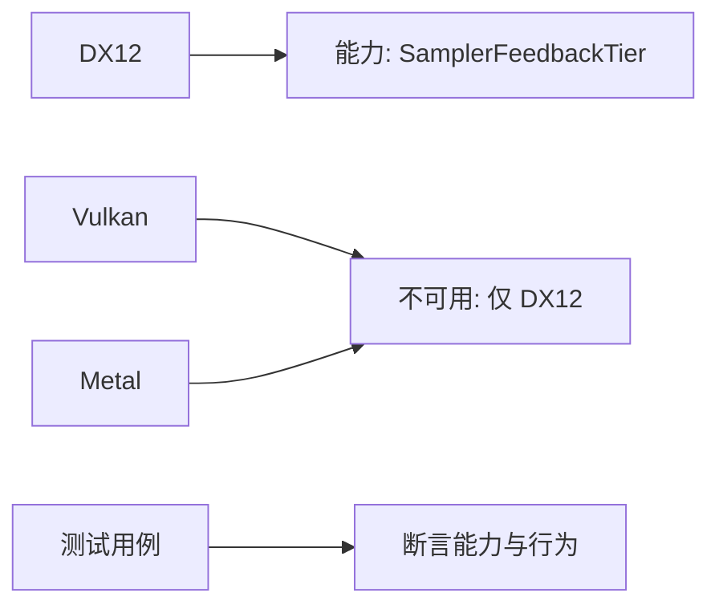
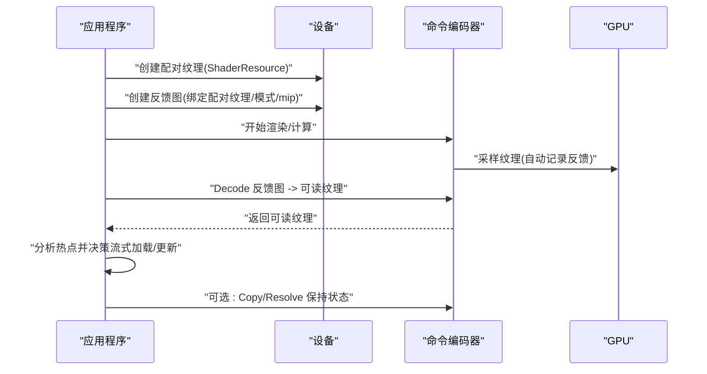
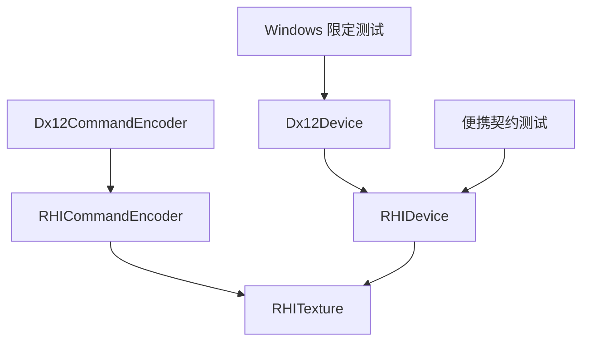

# 采样器反馈

<cite>
**本文引用的文件**
- [RHICommandEncoder.cs](file://src/SharpGPU/Abstract/RHICommandEncoder.cs)
- [RHITexture.cs](file://src/SharpGPU/Abstract/RHITexture.cs)
- [RHIDevice.cs](file://src/SharpGPU/Abstract/RHIDevice.cs)
- [Dx12Device.cs](file://src/SharpGPU/Dx12/Dx12Device.cs)
- [Dx12CommandEncoder.cs](file://src/SharpGPU/Dx12/Dx12CommandEncoder.cs)
- [SamplerFeedbackPortableContractTests.cs](file://tests/SharpGPU.Conformance.Tests/SamplerFeedbackPortableContractTests.cs)
- [SamplerFeedbackWindowsQualifiedTests.cs](file://tests/SharpGPU.Conformance.Tests/SamplerFeedbackWindowsQualifiedTests.cs)
</cite>

## 目录
1. [简介](#简介)
2. [项目结构](#项目结构)
3. [核心组件](#核心组件)
4. [架构总览](#架构总览)
5. [详细组件分析](#详细组件分析)
6. [依赖关系分析](#依赖关系分析)
7. [性能考量](#性能考量)
8. [故障排查指南](#故障排查指南)
9. [结论](#结论)
10. [附录](#附录)

## 简介
本文件面向使用 SharpGPU 的开发者，系统性说明“采样器反馈（Sampler Feedback）”技术的原理、在纹理访问优化中的作用，以及在 SharpGPU 中的配置与使用方法。内容涵盖：
- 采样器反馈的基本概念与价值：通过 GPU 记录实际被采样的纹理区域信息，辅助驱动或引擎进行纹理流式加载、按需加载、缓存策略优化等。
- 资源创建与配对：如何创建并绑定反馈纹理与其对应的采样纹理，以及反馈纹理的格式、尺寸和布局约束。
- 查询操作：如何在命令编码阶段执行清除、解码、解析、复制等反馈图操作；解释显式与隐式查询的使用方式。
- 后端兼容性与最佳实践：针对 DirectX12、Vulkan、Metal 的支持差异与限制。
- 性能分析与热点识别：结合能力查询与测试用例，帮助定位纹理访问热点与瓶颈。

## 项目结构
围绕采样器反馈的关键代码分布在抽象接口层与各后端实现中：
- 抽象层定义反馈模式、操作枚举、反馈图描述符、纹理属性与命令编码器接口。
- 设备层负责创建反馈图并进行参数校验。
- 各后端（如 DX12）提供具体能力探测与实现细节。
- 测试用例覆盖跨平台契约与 Windows/DX12 限定场景。

图表来源
- [RHICommandEncoder.cs:180-276](file://src/SharpGPU/Abstract/RHICommandEncoder.cs#L180-L276)
- [RHITexture.cs:7-127](file://src/SharpGPU/Abstract/RHITexture.cs#L7-L127)
- [RHIDevice.cs:680-714](file://src/SharpGPU/Abstract/RHIDevice.cs#L680-L714)
- [Dx12Device.cs:322-393](file://src/SharpGPU/Dx12/Dx12Device.cs#L322-L393)
- [SamplerFeedbackPortableContractTests.cs:12-115](file://tests/SharpGPU.Conformance.Tests/SamplerFeedbackPortableContractTests.cs#L12-L115)
- [SamplerFeedbackWindowsQualifiedTests.cs:14-117](file://tests/SharpGPU.Conformance.Tests/SamplerFeedbackWindowsQualifiedTests.cs#L14-L117)

章节来源
- [RHICommandEncoder.cs:180-276](file://src/SharpGPU/Abstract/RHICommandEncoder.cs#L180-L276)
- [RHITexture.cs:7-127](file://src/SharpGPU/Abstract/RHITexture.cs#L7-L127)
- [RHIDevice.cs:680-714](file://src/SharpGPU/Abstract/RHIDevice.cs#L680-L714)
- [Dx12Device.cs:322-393](file://src/SharpGPU/Dx12/Dx12Device.cs#L322-L393)
- [SamplerFeedbackPortableContractTests.cs:12-115](file://tests/SharpGPU.Conformance.Tests/SamplerFeedbackPortableContractTests.cs#L12-L115)
- [SamplerFeedbackWindowsQualifiedTests.cs:14-117](file://tests/SharpGPU.Conformance.Tests/SamplerFeedbackWindowsQualifiedTests.cs#L14-L117)

## 核心组件
- 反馈模式与操作
  - 反馈模式：最小mip、mip区域已使用、待定（Pending）。
  - 反馈操作：清除、解析、解码、复制，支持位掩码组合。
- 反馈图描述符
  - 包含配对纹理、模式、mip区域等创建期绑定信息。
- 纹理对象扩展
  - 标记是否为反馈图、返回配对纹理、反馈模式与 mip 区域。
  - 提供判断是否属于不透明反馈格式的静态方法。
- 命令编码器接口
  - 提供对反馈图的清除、解析、解码、复制操作，并在调用前进行能力与操作支持检查。
- 设备层校验
  - 强制要求配对纹理为着色器资源视图且非反馈格式，拒绝未配对的反馈格式纹理创建。
  - 暴露能力限制位掩码以查询支持的反馈模式与操作。

章节来源
- [RHITexture.cs:7-127](file://src/SharpGPU/Abstract/RHITexture.cs#L7-L127)
- [RHICommandEncoder.cs:180-276](file://src/SharpGPU/Abstract/RHICommandEncoder.cs#L180-L276)
- [RHIDevice.cs:680-714](file://src/SharpGPU/Abstract/RHIDevice.cs#L680-L714)

## 架构总览
下图展示从应用到后端的采样器反馈关键流程：设备创建反馈图、命令编码器执行反馈操作、后端能力检测与限制。

图表来源
- [RHIDevice.cs:680-714](file://src/SharpGPU/Abstract/RHIDevice.cs#L680-L714)
- [RHICommandEncoder.cs:180-276](file://src/SharpGPU/Abstract/RHICommandEncoder.cs#L180-L276)
- [Dx12Device.cs:322-393](file://src/SharpGPU/Dx12/Dx12Device.cs#L322-L393)

## 详细组件分析

### 数据模型与类型
- 反馈模式枚举：MinMip、MipRegionUsed、Pending。
- 反馈操作标志：Clear、Resolve、Decode、Copy。
- 反馈图描述符：包含 PairedTexture、Mode、MipRegion。
- 纹理对象扩展：IsSamplerFeedbackMap、PairedSamplerFeedbackTexture、SamplerFeedbackMode、SamplerFeedbackMipRegion。
- 不透明格式判定：IsSamplerFeedbackOpaqueFormat。

图表来源
- [RHITexture.cs:7-127](file://src/SharpGPU/Abstract/RHITexture.cs#L7-L127)

章节来源
- [RHITexture.cs:7-127](file://src/SharpGPU/Abstract/RHITexture.cs#L7-L127)

### 命令编码器与反馈操作
- 清除反馈图：将不透明反馈图重置。
- 解析反馈图：将解码后的 R8_UINT 映射回不透明反馈图。
- 解码反馈图：将不透明反馈图解码为可读的 R8_UINT 纹理。
- 复制反馈图：在同一格式与尺寸的反馈图之间复制。
- 统一前置检查：确保编码器已附加命令缓冲、设备具备 Raster.SamplerFeedback 能力、操作在支持掩码内。

图表来源
- [RHICommandEncoder.cs:180-276](file://src/SharpGPU/Abstract/RHICommandEncoder.cs#L180-L276)

章节来源
- [RHICommandEncoder.cs:180-276](file://src/SharpGPU/Abstract/RHICommandEncoder.cs#L180-L276)

### 设备层创建与校验
- 创建反馈图时要求：
  - 必须提供配对纹理，且该纹理需具备着色器资源用途。
  - 配对纹理不能是不透明反馈格式。
  - 模式必须为 MinMip 或 MipRegionUsed，禁止 Pending。
- 拒绝直接以普通纹理描述创建不透明反馈格式，强制通过 CreateSamplerFeedbackMap 建立配对。

图表来源
- [RHIDevice.cs:680-714](file://src/SharpGPU/Abstract/RHIDevice.cs#L680-L714)

章节来源
- [RHIDevice.cs:680-714](file://src/SharpGPU/Abstract/RHIDevice.cs#L680-L714)

### 后端能力与兼容性
- DX12：
  - 通过设备能力探测 SamplerFeedbackTier，映射到内部 Tier 级别。
  - 支持的最小 mipmap 反馈模式，能力掩码用于限制可用模式与操作。
- Vulkan/Metal：
  - 当前实现中标注为不可用，并给出“仅 DX12”的原因。
- 测试覆盖：
  - 便携契约测试断言能力属性、API 存在性、不可用原因。
  - Windows 限定测试验证 DX12 下创建反馈图的成功路径与错误路径。

图表来源
- [SamplerFeedbackPortableContractTests.cs:44-115](file://tests/SharpGPU.Conformance.Tests/SamplerFeedbackPortableContractTests.cs#L44-L115)
- [SamplerFeedbackWindowsQualifiedTests.cs:14-117](file://tests/SharpGPU.Conformance.Tests/SamplerFeedbackWindowsQualifiedTests.cs#L14-L117)
- [Dx12Device.cs:322-393](file://src/SharpGPU/Dx12/Dx12Device.cs#L322-L393)

章节来源
- [SamplerFeedbackPortableContractTests.cs:44-115](file://tests/SharpGPU.Conformance.Tests/SamplerFeedbackPortableContractTests.cs#L44-L115)
- [SamplerFeedbackWindowsQualifiedTests.cs:14-117](file://tests/SharpGPU.Conformance.Tests/SamplerFeedbackWindowsQualifiedTests.cs#L14-L117)
- [Dx12Device.cs:322-393](file://src/SharpGPU/Dx12/Dx12Device.cs#L322-L393)

### 纹理流式加载与动态更新示例（基于 API 的工作流）
以下工作流展示了如何使用采样器反馈配合纹理流式加载与动态更新：
- 创建配对纹理（着色器资源用途，非反馈格式）。
- 创建反馈图（绑定配对纹理、选择模式与 mip 区域）。
- 渲染/计算过程中采样纹理，驱动自动记录访问信息到反馈图。
- 解码反馈图为可读纹理，分析热点区域。
- 根据热点结果调整流式加载策略或触发动态更新。
- 必要时复制/解析反馈图以维持状态一致性。

图表来源
- [RHITexture.cs:7-127](file://src/SharpGPU/Abstract/RHITexture.cs#L7-L127)
- [RHICommandEncoder.cs:180-276](file://src/SharpGPU/Abstract/RHICommandEncoder.cs#L180-L276)
- [RHIDevice.cs:680-714](file://src/SharpGPU/Abstract/RHIDevice.cs#L680-L714)

章节来源
- [RHITexture.cs:7-127](file://src/SharpGPU/Abstract/RHITexture.cs#L7-L127)
- [RHICommandEncoder.cs:180-276](file://src/SharpGPU/Abstract/RHICommandEncoder.cs#L180-L276)
- [RHIDevice.cs:680-714](file://src/SharpGPU/Abstract/RHIDevice.cs#L680-L714)

### 显式查询与隐式查询
- 隐式查询：采样器在采样纹理时由硬件/驱动自动记录访问信息到反馈图，无需额外指令。
- 显式查询：通过命令编码器提供的 Decode/Resolve/Copy/Clear 等操作显式处理反馈图数据，便于读取与分析。
- 在 SharpGPU 中，隐式记录发生在采样阶段；显式处理通过命令编码器接口完成。

章节来源
- [RHICommandEncoder.cs:180-276](file://src/SharpGPU/Abstract/RHICommandEncoder.cs#L180-L276)
- [RHITexture.cs:7-127](file://src/SharpGPU/Abstract/RHITexture.cs#L7-L127)

## 依赖关系分析
- 抽象接口依赖：
  - RHICommandEncoder 依赖 RHITexture 的类型信息与能力检查。
  - RHIDevice 负责创建反馈图并执行严格参数校验。
- 后端实现依赖：
  - Dx12Device 提供能力探测与模式掩码设置。
  - Dx12CommandEncoder 在需要时转发具体后端指令。
- 测试依赖：
  - 便携契约与 Windows 限定测试验证 API 存在性、能力与行为。

图表来源
- [RHICommandEncoder.cs:180-276](file://src/SharpGPU/Abstract/RHICommandEncoder.cs#L180-L276)
- [RHITexture.cs:7-127](file://src/SharpGPU/Abstract/RHITexture.cs#L7-L127)
- [RHIDevice.cs:680-714](file://src/SharpGPU/Abstract/RHIDevice.cs#L680-L714)
- [Dx12Device.cs:322-393](file://src/SharpGPU/Dx12/Dx12Device.cs#L322-L393)
- [SamplerFeedbackPortableContractTests.cs:12-115](file://tests/SharpGPU.Conformance.Tests/SamplerFeedbackPortableContractTests.cs#L12-L115)
- [SamplerFeedbackWindowsQualifiedTests.cs:14-117](file://tests/SharpGPU.Conformance.Tests/SamplerFeedbackWindowsQualifiedTests.cs#L14-L117)

章节来源
- [RHICommandEncoder.cs:180-276](file://src/SharpGPU/Abstract/RHICommandEncoder.cs#L180-L276)
- [RHITexture.cs:7-127](file://src/SharpGPU/Abstract/RHITexture.cs#L7-L127)
- [RHIDevice.cs:680-714](file://src/SharpGPU/Abstract/RHIDevice.cs#L680-L714)
- [Dx12Device.cs:322-393](file://src/SharpGPU/Dx12/Dx12Device.cs#L322-L393)
- [SamplerFeedbackPortableContractTests.cs:12-115](file://tests/SharpGPU.Conformance.Tests/SamplerFeedbackPortableContractTests.cs#L12-L115)
- [SamplerFeedbackWindowsQualifiedTests.cs:14-117](file://tests/SharpGPU.Conformance.Tests/SamplerFeedbackWindowsQualifiedTests.cs#L14-L117)

## 性能考量
- 使用反馈图识别热点：
  - 通过解码反馈图并分析像素分布，定位频繁访问的纹理区域。
  - 结合 mip 区域限制，减少不必要的反馈数据量。
- 避免过度解码：
  - 仅在需要时执行 Decode/Resolve，降低带宽与内存压力。
- 选择合适的反馈模式：
  - MinMip 适合关注最低分辨率访问；MipRegionUsed 适合细粒度区域统计。
- 后端差异：
  - 当前 Vulkan/Metal 不可用，开发时需做条件分支或降级策略。
- 能力检查：
  - 在运行期查询 SupportedSamplerFeedbackModeMask 与 SupportedSamplerFeedbackOperationMask，确保操作合法。

[本节为通用指导，不直接分析具体文件]

## 故障排查指南
- 常见异常与原因：
  - 缺少配对纹理：创建反馈图时必须提供配对纹理，否则抛出参数异常。
  - 配对纹理用途非法：必须包含着色器资源用途。
  - 配对纹理格式非法：不能是不透明反馈格式。
  - 模式非法：必须为 MinMip 或 MipRegionUsed，禁止 Pending。
  - 操作不受支持：命令编码器会检查设备能力与操作掩码，不在支持范围内将抛出异常。
- 诊断步骤：
  - 检查设备能力：确认 Raster.SamplerFeedback 可用及支持的操作掩码。
  - 检查反馈图属性：IsSamplerFeedbackMap、PairedSamplerFeedbackTexture、SamplerFeedbackMode。
  - 检查命令编码器状态：确保已附着命令缓冲。
  - 查看测试用例断言：参考便携契约与 Windows 限定测试的错误路径。

章节来源
- [RHIDevice.cs:680-714](file://src/SharpGPU/Abstract/RHIDevice.cs#L680-L714)
- [RHICommandEncoder.cs:180-276](file://src/SharpGPU/Abstract/RHICommandEncoder.cs#L180-L276)
- [SamplerFeedbackPortableContractTests.cs:44-115](file://tests/SharpGPU.Conformance.Tests/SamplerFeedbackPortableContractTests.cs#L44-L115)
- [SamplerFeedbackWindowsQualifiedTests.cs:14-117](file://tests/SharpGPU.Conformance.Tests/SamplerFeedbackWindowsQualifiedTests.cs#L14-L117)

## 结论
SharpGPU 的采样器反馈功能通过明确的抽象接口与严格的参数校验，提供了在 DX12 上可用的纹理访问反馈能力。开发者可借助反馈图识别热点区域，优化纹理流式加载与动态更新策略。当前 Vulkan/Metal 后端暂不可用，需在应用中做能力检测与降级处理。建议在生产环境中结合能力查询与测试用例，确保反馈操作的合法性与稳定性。

[本节为总结，不直接分析具体文件]

## 附录
- 相关 API 路径参考：
  - 反馈模式与操作：[RHITexture.cs:7-23](file://src/SharpGPU/Abstract/RHITexture.cs#L7-L23)
  - 反馈图描述符与纹理属性：[RHITexture.cs:25-127](file://src/SharpGPU/Abstract/RHITexture.cs#L25-L127)
  - 命令编码器反馈操作：[RHICommandEncoder.cs:180-276](file://src/SharpGPU/Abstract/RHICommandEncoder.cs#L180-L276)
  - 设备层创建与校验：[RHIDevice.cs:680-714](file://src/SharpGPU/Abstract/RHIDevice.cs#L680-L714)
  - DX12 能力与模式掩码：[Dx12Device.cs:322-393](file://src/SharpGPU/Dx12/Dx12Device.cs#L322-L393)
  - 便携契约测试：[SamplerFeedbackPortableContractTests.cs:12-115](file://tests/SharpGPU.Conformance.Tests/SamplerFeedbackPortableContractTests.cs#L12-L115)
  - Windows 限定测试：[SamplerFeedbackWindowsQualifiedTests.cs:14-117](file://tests/SharpGPU.Conformance.Tests/SamplerFeedbackWindowsQualifiedTests.cs#L14-L117)

[本节为索引，不直接分析具体文件]