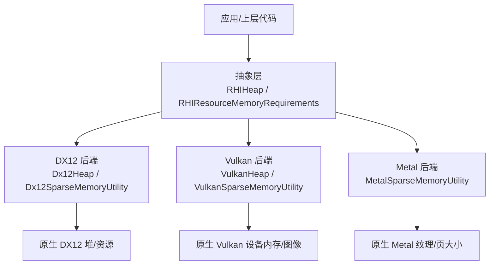
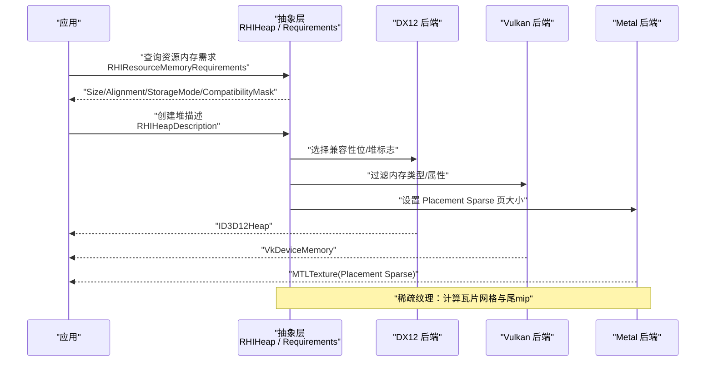
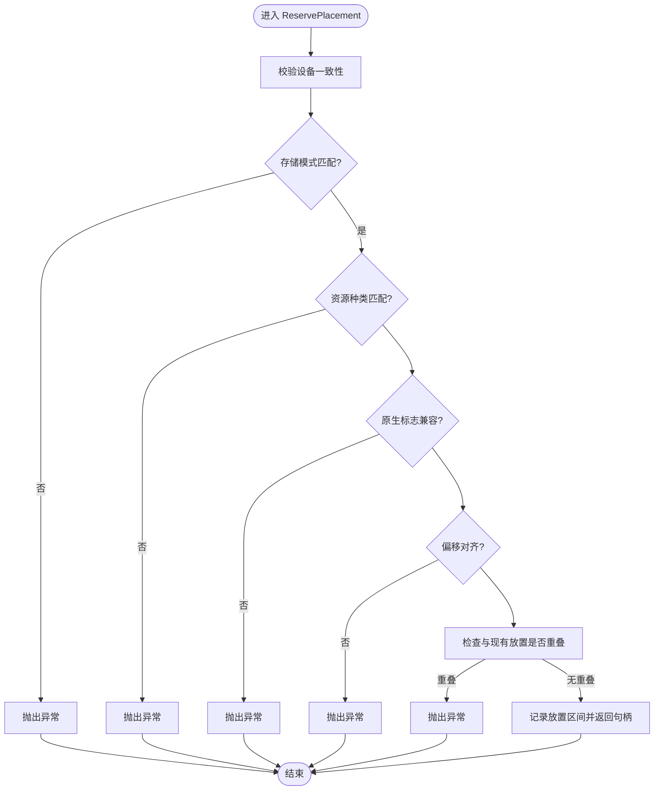
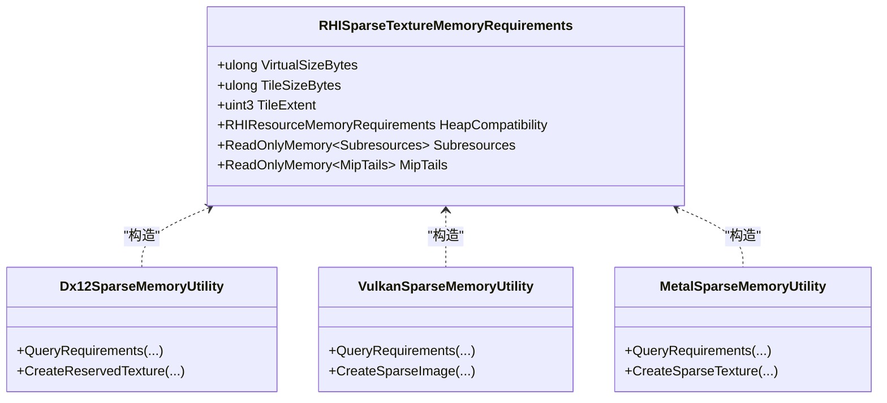
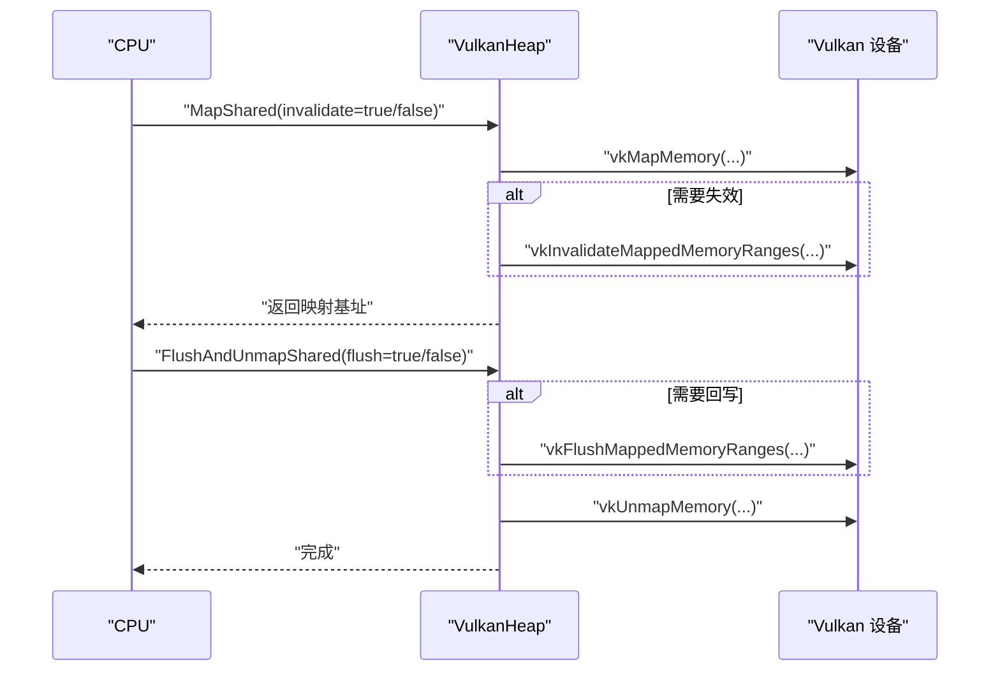
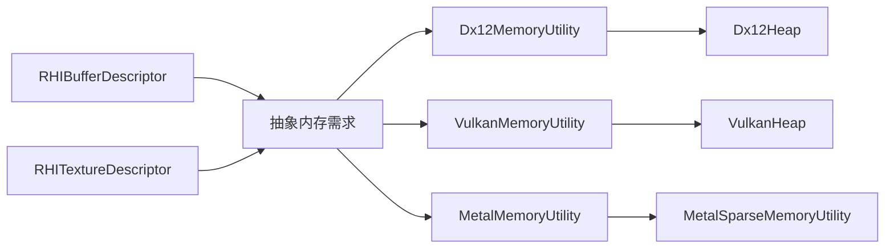

# 内存分配

<cite>
**本文引用的文件**
- [RHIMemory.cs](file://src/SharpGPU/Abstract/RHIMemory.cs)
- [Dx12Memory.cs](file://src/SharpGPU/Dx12/Dx12Memory.cs)
- [VulkanMemory.cs](file://src/SharpGPU/Vulkan/VulkanMemory.cs)
- [MetalMemory.cs](file://src/SharpGPU/Metal/MetalMemory.cs)
- [RHIBuffer.cs](file://src/SharpGPU/Abstract/RHIBuffer.cs)
- [RHITexture.cs](file://src/SharpGPU/Abstract/RHITexture.cs)
- [Dx12BarrierMappingTests.cs](file://tests/SharpGPU.Conformance.Tests/Dx12BarrierMappingTests.cs)
- [VulkanBarrierMappingTests.cs](file://tests/SharpGPU.Conformance.Tests/VulkanBarrierMappingTests.cs)
- [SharpGpuMemoryMechanismTests.cs](file://tests/SharpGPU.Conformance.Tests/SharpGpuMemoryMechanismTests.cs)
</cite>

## 目录
1. [简介](#简介)
2. [项目结构](#项目结构)
3. [核心组件](#核心组件)
4. [架构总览](#架构总览)
5. [详细组件分析](#详细组件分析)
6. [依赖关系分析](#依赖关系分析)
7. [性能考虑](#性能考虑)
8. [故障排查指南](#故障排查指南)
9. [结论](#结论)
10. [附录](#附录)

## 简介
本文件系统性阐述 SharpGPU 的内存分配系统，围绕 RHIMemory 抽象层与后端实现（DirectX 12、Vulkan、Metal）展开。内容涵盖：
- RHIMemory 抽象类的设计目标与内存分配策略（提交式、放置式、稀疏、外部）。
- 内存池管理机制：堆（Heap）、放置（Placement）注册、冲突检测与生命周期。
- CPU-GPU 内存同步机制：映射、解映射、数据回写/失效。
- 内存对齐要求与优化技巧。
- 不同后端的差异与优化策略。
- 内存泄漏检测与调试方法。
- 最佳实践与示例流程。

## 项目结构
SharpGPU 将内存管理分为“抽象接口 + 后端实现”两层：
- 抽象层位于 src/SharpGPU/Abstract，定义通用资源描述、内存需求、堆与放置模型、稀疏纹理元数据等。
- 后端实现位于各平台目录（Dx12、Vulkan、Metal），负责将抽象语义映射到具体 API 的堆、内存类型、稀疏粒度、预算查询等。

图表来源
- [RHIMemory.cs:173-333](file://src/SharpGPU/Abstract/RHIMemory.cs#L173-L333)
- [Dx12Memory.cs:318-355](file://src/SharpGPU/Dx12/Dx12Memory.cs#L318-L355)
- [VulkanMemory.cs:539-728](file://src/SharpGPU/Vulkan/VulkanMemory.cs#L539-L728)
- [MetalMemory.cs:92-354](file://src/SharpGPU/Metal/MetalMemory.cs#L92-L354)

章节来源
- [RHIMemory.cs:1-800](file://src/SharpGPU/Abstract/RHIMemory.cs#L1-L800)
- [Dx12Memory.cs:1-357](file://src/SharpGPU/Dx12/Dx12Memory.cs#L1-L357)
- [VulkanMemory.cs:1-731](file://src/SharpGPU/Vulkan/VulkanMemory.cs#L1-L731)
- [MetalMemory.cs:1-354](file://src/SharpGPU/Metal/MetalMemory.cs#L1-L354)

## 核心组件
- RHIResourceMemoryRequirements：描述单个资源的尺寸、对齐、存储模式、兼容性掩码、资源种类及原生分配标志；用于跨后端统一表达“需要什么样的物理内存”。
- RHIHeapDescription：基于资源需求构造堆描述，强制堆大小与对齐满足需求。
- RHIHeap：抽象堆，封装放置（Placement）注册表，提供 ReservePlacement 与 ValidateSparseSpan 等校验，保证偏移对齐、范围不重叠、资源种类一致、原生标志兼容。
- RHIHeapPlacementRegistry：线程安全的放置区间管理，支持冲突检测、关闭保护、释放回收。
- RHISparseTextureMemoryRequirements：稀疏纹理的精确元数据（虚拟大小、瓦片大小/extent、子资源瓦片网格、尾 mip 信息），并约束堆兼容性。
- 后端 Heap 实现：
  - Dx12Heap：创建 ID3D12Heap，按兼容性位选择堆标志。
  - VulkanHeap：vkAllocateMemory，维护共享映射引用计数与刷新/失效。
  - Metal：通过 Placement Sparse 纹理与页大小进行细粒度内存控制。

章节来源
- [RHIMemory.cs:23-116](file://src/SharpGPU/Abstract/RHIMemory.cs#L23-L116)
- [RHIMemory.cs:173-457](file://src/SharpGPU/Abstract/RHIMemory.cs#L173-L457)
- [RHIMemory.cs:515-748](file://src/SharpGPU/Abstract/RHIMemory.cs#L515-L748)
- [Dx12Memory.cs:318-355](file://src/SharpGPU/Dx12/Dx12Memory.cs#L318-L355)
- [VulkanMemory.cs:539-728](file://src/SharpGPU/Vulkan/VulkanMemory.cs#L539-L728)
- [MetalMemory.cs:92-354](file://src/SharpGPU/Metal/MetalMemory.cs#L92-L354)

## 架构总览
下图展示从抽象内存需求到后端分配的完整路径，以及稀疏纹理的瓦片化与尾 mip 处理。

图表来源
- [RHIMemory.cs:23-116](file://src/SharpGPU/Abstract/RHIMemory.cs#L23-L116)
- [Dx12Memory.cs:73-123](file://src/SharpGPU/Dx12/Dx12Memory.cs#L73-L123)
- [VulkanMemory.cs:92-127](file://src/SharpGPU/Vulkan/VulkanMemory.cs#L92-L127)
- [MetalMemory.cs:92-169](file://src/SharpGPU/Metal/MetalMemory.cs#L92-L169)

## 详细组件分析

### 抽象内存需求与堆模型
- 内存需求对象强制校验：
  - Size 非零、Alignment 为 2 的幂、CompatibilityMask 非零。
  - 堆描述必须不小于需求 Size，且 Size 对齐到 Alignment。
- 堆放置（Placement）：
  - 在 ReservePlacement 中检查：设备一致性、存储模式一致、资源种类一致、原生标志包含关系、偏移对齐、范围不溢出、不与已有放置重叠。
  - 使用 RHIHeapPlacementRegistry 以锁保护并发访问，防止在销毁过程中继续分配。
- 稀疏纹理跨度校验：
  - ValidateSparseSpan 确保偏移/大小合法、对齐、不超过堆大小，且仅允许纹理类型的稀疏绑定。

图表来源
- [RHIMemory.cs:218-267](file://src/SharpGPU/Abstract/RHIMemory.cs#L218-L267)
- [RHIMemory.cs:353-457](file://src/SharpGPU/Abstract/RHIMemory.cs#L353-L457)

章节来源
- [RHIMemory.cs:23-116](file://src/SharpGPU/Abstract/RHIMemory.cs#L23-L116)
- [RHIMemory.cs:218-333](file://src/SharpGPU/Abstract/RHIMemory.cs#L218-L333)
- [RHIMemory.cs:353-457](file://src/SharpGPU/Abstract/RHIMemory.cs#L353-L457)

### 后端内存分配与选择
- DirectX 12：
  - 通过兼容性位区分 Buffer、非渲染目标纹理、渲染目标纹理三类堆。
  - 根据 StorageMode 转换为堆类型，创建 ID3D12Heap。
- Vulkan：
  - 依据资源需求的内存类型位与所需属性（如 DeviceLocal/LazilyAllocated）筛选可用内存类型。
  - vkAllocateMemory 分配 VkDeviceMemory，并在 Release 时正确释放。
- Metal：
  - 使用 Placement Sparse 纹理与固定页大小（例如 16KB）进行细粒度内存管理。
  - 查询瓦片几何与尾 mip 信息，构建 RHISparseTextureMemoryRequirements。

章节来源
- [Dx12Memory.cs:73-123](file://src/SharpGPU/Dx12/Dx12Memory.cs#L73-L123)
- [Dx12Memory.cs:318-355](file://src/SharpGPU/Dx12/Dx12Memory.cs#L318-L355)
- [VulkanMemory.cs:92-127](file://src/SharpGPU/Vulkan/VulkanMemory.cs#L92-L127)
- [VulkanMemory.cs:539-728](file://src/SharpGPU/Vulkan/VulkanMemory.cs#L539-L728)
- [MetalMemory.cs:92-169](file://src/SharpGPU/Metal/MetalMemory.cs#L92-L169)
- [MetalMemory.cs:219-341](file://src/SharpGPU/Metal/MetalMemory.cs#L219-L341)

### 稀疏纹理与瓦片化
- 抽象层提供 RHISparseTextureMemoryRequirements，包含：
  - 虚拟大小、瓦片大小与瓦片 extent。
  - 标准子资源的瓦片网格（每个 aspect/mip/arrayLayer 的 tile 数量）。
  - 尾 mip 列表（可能单条或多条，按层或整体）。
- 后端查询：
  - DX12：CreateReservedResource + GetResourceTiling，提取标准瓦片与 packed mips。
  - Vulkan：vkGetImageSparseMemoryRequirements，计算粒度与标准/尾 mip。
  - Metal：NewTexture(Placement Sparse) + SparseTileSize/TailSizeInBytes，计算瓦片网格与尾区域。

图表来源
- [RHIMemory.cs:515-748](file://src/SharpGPU/Abstract/RHIMemory.cs#L515-L748)
- [Dx12Memory.cs:130-312](file://src/SharpGPU/Dx12/Dx12Memory.cs#L130-L312)
- [VulkanMemory.cs:133-370](file://src/SharpGPU/Vulkan/VulkanMemory.cs#L133-L370)
- [MetalMemory.cs:92-354](file://src/SharpGPU/Metal/MetalMemory.cs#L92-L354)

章节来源
- [RHIMemory.cs:515-748](file://src/SharpGPU/Abstract/RHIMemory.cs#L515-L748)
- [Dx12Memory.cs:130-312](file://src/SharpGPU/Dx12/Dx12Memory.cs#L130-L312)
- [VulkanMemory.cs:133-370](file://src/SharpGPU/Vulkan/VulkanMemory.cs#L133-L370)
- [MetalMemory.cs:92-354](file://src/SharpGPU/Metal/MetalMemory.cs#L92-L354)

### CPU-GPU 内存同步（映射/解映射/数据传输）
- Vulkan 共享映射：
  - MapShared：vkMapMemory，可选 invalidate；引用计数管理，避免重复映射。
  - FlushAndUnmapShared：可选 flush，递减引用计数，归零时 vkUnmapMemory。
  - ReleaseSharedMappingAfterResourceDispose：在资源销毁时安全释放映射。
- DX12/Metal：
  - 通过资源状态屏障与布局转换间接完成同步（见测试用例对阶段/访问/布局的映射）。
  - 纹理通常不可直接映射，需通过拷贝或专用 API 访问。

图表来源
- [VulkanMemory.cs:591-694](file://src/SharpGPU/Vulkan/VulkanMemory.cs#L591-L694)

章节来源
- [VulkanMemory.cs:591-694](file://src/SharpGPU/Vulkan/VulkanMemory.cs#L591-L694)
- [Dx12BarrierMappingTests.cs:15-127](file://tests/SharpGPU.Conformance.Tests/Dx12BarrierMappingTests.cs#L15-L127)
- [VulkanBarrierMappingTests.cs:13-130](file://tests/SharpGPU.Conformance.Tests/VulkanBarrierMappingTests.cs#L13-L130)

### 内存对齐与性能优化
- 对齐要求：
  - RHIResourceMemoryRequirements 强制 Alignment 为 2 的幂。
  - 堆描述 Size 必须对齐到 Alignment。
  - 稀疏瓦片大小与偏移均需对齐到瓦片大小。
- 优化建议：
  - 尽量批量分配同构资源以减少碎片。
  - 使用放置式分配复用堆空间，减少堆创建开销。
  - 利用稀疏纹理按需驻留瓦片，降低显存占用。
  - 合理设置 StorageMode（如 GPULocal 用于 GPU 独占，HostUpload 用于上传）。
  - 在 Vulkan 中使用 LazilyAllocated 或 Memoryless（图像）以降低峰值占用。

章节来源
- [RHIMemory.cs:23-116](file://src/SharpGPU/Abstract/RHIMemory.cs#L23-L116)
- [RHIMemory.cs:515-748](file://src/SharpGPU/Abstract/RHIMemory.cs#L515-L748)
- [VulkanMemory.cs:92-127](file://src/SharpGPU/Vulkan/VulkanMemory.cs#L92-L127)

### 不同后端差异与优化策略
- DX12：
  - 严格区分 Buffer/RT 纹理/非 RT 纹理堆标志，避免混用导致失败。
  - 纹理要求 GPU-local 存储（当前契约限制）。
- Vulkan：
  - 通过内存类型位与属性筛选，灵活适配不同设备能力。
  - 支持 Memoryless 图像与延迟分配，适合帧内临时资源。
- Metal：
  - Placement Sparse 纹理以固定页大小组织，便于细粒度驻留控制。
  - 仅支持特定维度与格式的组合，需在创建前验证。

章节来源
- [Dx12Memory.cs:29-71](file://src/SharpGPU/Dx12/Dx12Memory.cs#L29-L71)
- [Dx12Memory.cs:73-123](file://src/SharpGPU/Dx12/Dx12Memory.cs#L73-L123)
- [VulkanMemory.cs:92-127](file://src/SharpGPU/Vulkan/VulkanMemory.cs#L92-L127)
- [MetalMemory.cs:92-169](file://src/SharpGPU/Metal/MetalMemory.cs#L92-L169)

## 依赖关系分析
- 抽象层依赖：
  - RHIBuffer/RHITexture 描述资源创建参数（尺寸、格式、用途、存储模式）。
  - RHIResourceMemoryRequirements 作为跨后端统一的内存需求载体。
- 后端依赖：
  - DX12 依赖 Vortice.Direct3D12 的资源/堆 API。
  - Vulkan 依赖 Vortice.Vulkan 的内存/图像 API。
  - Metal 依赖 SharpMetal 的纹理/设备能力查询。

图表来源
- [RHIBuffer.cs:6-47](file://src/SharpGPU/Abstract/RHIBuffer.cs#L6-L47)
- [RHITexture.cs:39-141](file://src/SharpGPU/Abstract/RHITexture.cs#L39-L141)
- [Dx12Memory.cs:7-123](file://src/SharpGPU/Dx12/Dx12Memory.cs#L7-L123)
- [VulkanMemory.cs:7-127](file://src/SharpGPU/Vulkan/VulkanMemory.cs#L7-L127)
- [MetalMemory.cs:8-87](file://src/SharpGPU/Metal/MetalMemory.cs#L8-L87)

章节来源
- [RHIBuffer.cs:6-47](file://src/SharpGPU/Abstract/RHIBuffer.cs#L6-L47)
- [RHITexture.cs:39-141](file://src/SharpGPU/Abstract/RHITexture.cs#L39-L141)
- [Dx12Memory.cs:7-123](file://src/SharpGPU/Dx12/Dx12Memory.cs#L7-L123)
- [VulkanMemory.cs:7-127](file://src/SharpGPU/Vulkan/VulkanMemory.cs#L7-L127)
- [MetalMemory.cs:8-87](file://src/SharpGPU/Metal/MetalMemory.cs#L8-L87)

## 性能考虑
- 优先使用放置式分配复用堆，减少堆创建/销毁成本。
- 对频繁更新的小块数据采用 HostUpload/GPULocal 组合，减少带宽浪费。
- 使用稀疏纹理按需驻留，结合命令队列顺序的绑定/解绑，降低峰值显存。
- 在 Vulkan 中利用 Memoryless 图像与延迟分配，配合屏障最小化同步开销。
- 对齐与瓦片边界访问可提升缓存命中与带宽利用率。

## 故障排查指南
- 常见错误与定位：
  - 对齐错误：检查 Alignment 是否为 2 的幂，偏移是否对齐。
  - 范围重叠：确认放置区间未与其他活动区间重叠。
  - 设备不一致：确保需求与堆来自同一设备实例。
  - 资源种类不匹配：Buffer 与 Texture 不能混用。
  - 原生标志不足：堆创建时需包含资源所需的 NativeAllocationFlags。
- 工具与测试：
  - 使用 SharpGpuMemoryMechanismTests 中的断言覆盖对齐、重叠、销毁竞态、稀疏绑定合法性等场景。
  - 使用 Dx12BarrierMappingTests 与 VulkanBarrierMappingTests 验证屏障/布局/阶段映射是否符合预期。

章节来源
- [SharpGpuMemoryMechanismTests.cs:16-145](file://tests/SharpGPU.Conformance.Tests/SharpGpuMemoryMechanismTests.cs#L16-L145)
- [SharpGpuMemoryMechanismTests.cs:147-327](file://tests/SharpGPU.Conformance.Tests/SharpGpuMemoryMechanismTests.cs#L147-L327)
- [Dx12BarrierMappingTests.cs:15-127](file://tests/SharpGPU.Conformance.Tests/Dx12BarrierMappingTests.cs#L15-L127)
- [VulkanBarrierMappingTests.cs:13-130](file://tests/SharpGPU.Conformance.Tests/VulkanBarrierMappingTests.cs#L13-L130)

## 结论
SharpGPU 的内存分配系统通过抽象层统一了跨后端的内存需求表达，并以堆与放置模型实现了高效、安全的内存管理。后端针对各自特性提供了精细化的控制（DX12 堆标志、Vulkan 内存类型与预算、Metal 稀疏页大小）。结合严格的对齐与范围校验、完善的映射同步与屏障映射，可在多平台上获得稳定且高性能的内存访问体验。

## 附录
- 内存规划建议：
  - 预分配大堆并按需放置，减少碎片。
  - 对只读数据使用 HostUpload，对高频读写使用 GPULocal。
  - 大图使用稀疏纹理，按帧/场景动态驻留。
- 访问模式建议：
  - 批量写入后再切换至 ShaderRead，减少状态切换。
  - 遵循屏障最小化原则，合并相邻的同步操作。
- 性能调优建议：
  - 监控后端预算（Vulkan 扩展），在接近阈值时触发降级或异步卸载。
  - 使用对齐友好的数据结构与缓冲区布局，提升缓存效率。
- 示例流程（文字说明）：
  - 查询资源内存需求 → 创建堆描述 → 后端创建堆 → 在堆上放置资源 → 如需映射则调用 MapShared/FlushAndUnmapShared → 提交命令并使用屏障同步 → 释放放置句柄 → 最终销毁堆。