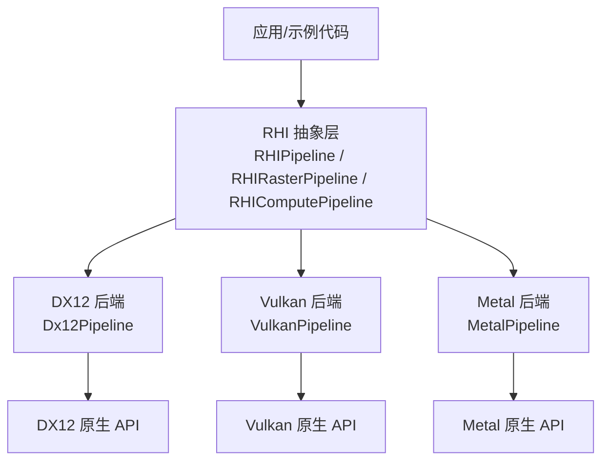
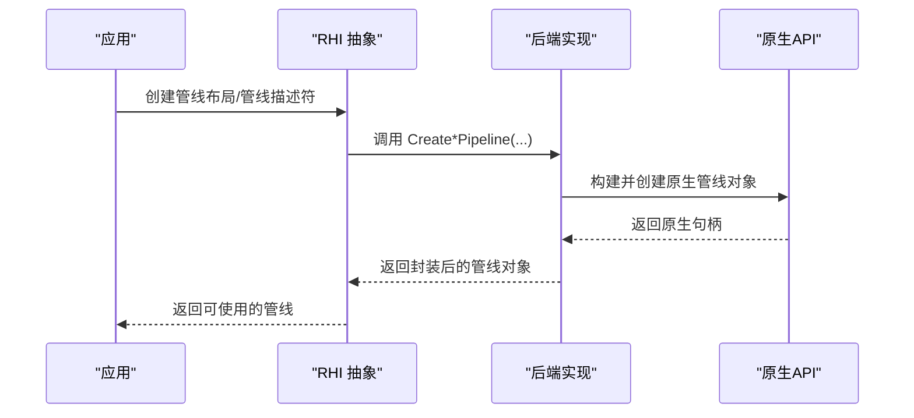
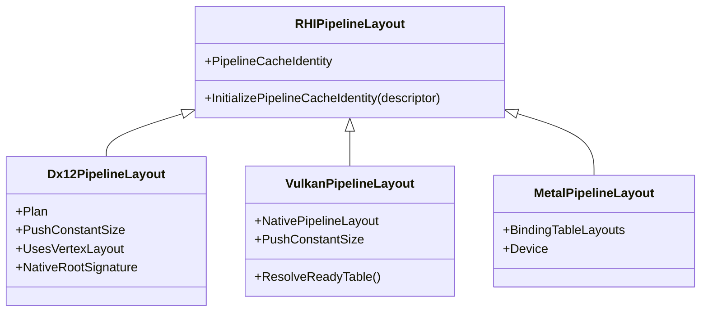
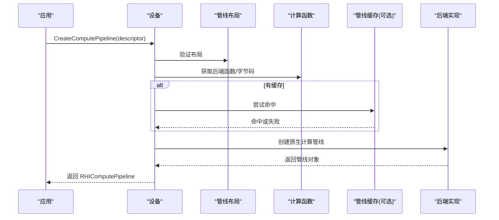
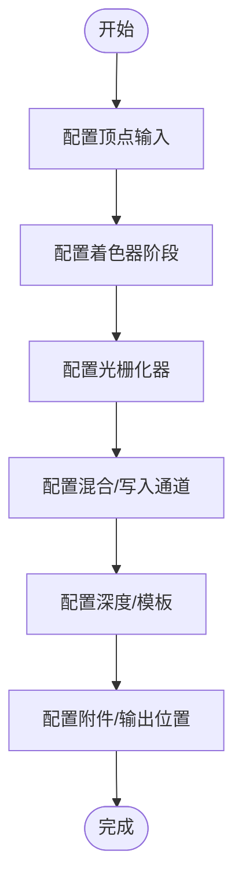
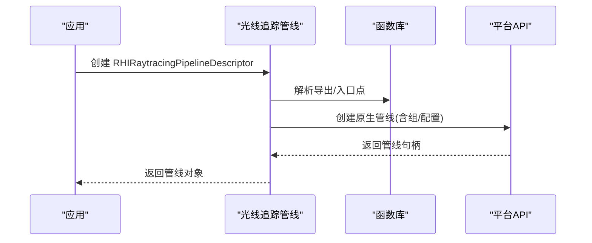
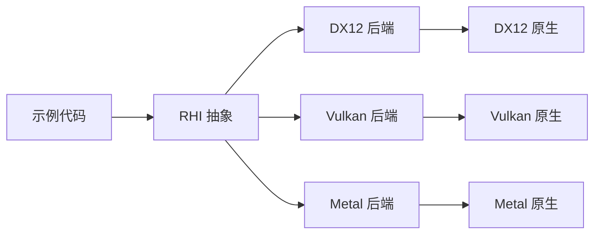

# 管线管理

<cite>
**本文引用的文件**
- [RHIPipeline.cs](file://src/SharpGPU/Abstract/RHIPipeline.cs)
- [Dx12Pipeline.cs](file://src/SharpGPU/Dx12/Dx12Pipeline.cs)
- [VulkanPipeline.cs](file://src/SharpGPU/Vulkan/VulkanPipeline.cs)
- [MetalPipeline.cs](file://src/SharpGPU/Metal/MetalPipeline.cs)
- [RasterWorkload.cs](file://samples/ComputeAndDraw/RasterWorkload.cs)
- [ComputeWorkload.cs](file://samples/ComputeAndDraw/ComputeWorkload.cs)
- [Dx12PipelineCacheGpuTests.cs](file://tests/SharpGPU.Conformance.Tests/Dx12PipelineCacheGpuTests.cs)
</cite>

## 目录
1. [简介](#简介)
2. [项目结构](#项目结构)
3. [核心组件](#核心组件)
4. [架构总览](#架构总览)
5. [详细组件分析](#详细组件分析)
6. [依赖关系分析](#依赖关系分析)
7. [性能考量](#性能考量)
8. [故障排查指南](#故障排查指南)
9. [结论](#结论)
10. [附录](#附录)

## 简介
本文件面向 SharpGPU 的管线管理系统，系统性说明 RHIPipeline 抽象层的设计、图形与计算管线的创建流程、管线状态对象（顶点输入、着色器阶段、光栅化器、输出合并等）的配置方法、多语言着色器的编译与链接机制、管线缓存与预编译技术、不同后端（DX12、Vulkan、Metal）的实现差异与优化策略、管线状态切换的性能影响，以及最佳实践与完整示例。

## 项目结构
SharpGPU 将管线相关能力按“抽象接口 + 后端实现”组织：
- 抽象层位于 src/SharpGPU/Abstract，定义统一的管线描述符、布局与管线基类。
- 后端实现位于 src/SharpGPU/{Dx12|Vulkan|Metal}，分别对应 DX12、Vulkan、Metal 的具体管线创建与绑定逻辑。
- 示例位于 samples/ComputeAndDraw，演示了完整的渲染与计算管线创建与执行流程。
- 测试位于 tests/SharpGPU.Conformance.Tests，覆盖管线缓存等关键特性。

图表来源
- [RHIPipeline.cs:224-264](file://src/SharpGPU/Abstract/RHIPipeline.cs#L224-L264)
- [Dx12Pipeline.cs:465-527](file://src/SharpGPU/Dx12/Dx12Pipeline.cs#L465-L527)
- [VulkanPipeline.cs:238-310](file://src/SharpGPU/Vulkan/VulkanPipeline.cs#L238-L310)
- [MetalPipeline.cs:100-142](file://src/SharpGPU/Metal/MetalPipeline.cs#L100-L142)

章节来源
- [RHIPipeline.cs:224-264](file://src/SharpGPU/Abstract/RHIPipeline.cs#L224-L264)

## 核心组件
- 管线布局（RHIPipelineLayout）：描述绑定表布局、推常量大小、是否使用本地根签名与顶点布局等，用于跨阶段共享资源访问约定。
- 管线描述符：
  - 计算管线：RHIComputePipelineDescriptor（线程组尺寸、计算函数、管线布局）。
  - 光栅管线：RHIRasterPipelineDescriptor（采样数、颜色/深度格式、附件接口、渲染状态、片段函数、原语装配器）。
  - 光线追踪管线：RHIRaytracingPipelineDescriptor（线程尺寸、最大负载/属性大小、递归深度、函数库、各类射线组）。
  - WorkGraph 管线：RHIWorkGraphPipelineDescriptor（名称、函数库、管线布局）。
- 管线基类：RHIComputePipeline、RHIRasterPipeline、RHIRaytracingPipeline、RHIWorkGraphPipeline，提供统一生命周期与描述符访问。

章节来源
- [RHIPipeline.cs:11-36](file://src/SharpGPU/Abstract/RHIPipeline.cs#L11-L36)
- [RHIPipeline.cs:137-172](file://src/SharpGPU/Abstract/RHIPipeline.cs#L137-L172)
- [RHIPipeline.cs:207-222](file://src/SharpGPU/Abstract/RHIPipeline.cs#L207-L222)
- [RHIPipeline.cs:224-264](file://src/SharpGPU/Abstract/RHIPipeline.cs#L224-L264)
- [RHIPipeline.cs:727-762](file://src/SharpGPU/Abstract/RHIPipeline.cs#L727-L762)

## 架构总览
SharpGPU 通过统一的抽象层屏蔽后端差异，各后端在创建管线时将抽象描述转换为各自的原生对象：
- DX12：Root Signature + Pipeline State Object（PSO），支持 Mesh Shader、Ray Tracing State Object、Work Graph。
- Vulkan：Descriptor Set Layout + Pipeline Layout + Graphics/Compute/Ray Tracing Pipeline，支持动态渲染与私有绑定扩展。
- Metal：MTLRenderPipelineState/MTLComputePipelineState，使用 MTL4 编译器构建管线，支持 Link Functions 与 Intersection Function。

图表来源
- [Dx12Pipeline.cs:465-527](file://src/SharpGPU/Dx12/Dx12Pipeline.cs#L465-L527)
- [VulkanPipeline.cs:238-310](file://src/SharpGPU/Vulkan/VulkanPipeline.cs#L238-L310)
- [MetalPipeline.cs:100-142](file://src/SharpGPU/Metal/MetalPipeline.cs#L100-L142)

## 详细组件分析

### 管线布局与绑定表计划
- 布局职责：声明绑定表空间/索引、推常量范围、是否使用本地根签名与顶点布局；生成后端特定的布局计划。
- DX12：将绑定表映射到 Root Descriptor Table，校验 Root Signature DWORD 成本限制，必要时启用 Local Root Signature。
- Vulkan：为每个绑定表创建 VkDescriptorSetLayout，组合成 VkPipelineLayout，并校验设备最大绑定集合数。
- Metal：记录绑定表布局，当前不支持 Push Constants（除非编译后显式提供缓冲索引）。

图表来源
- [RHIPipeline.cs:21-36](file://src/SharpGPU/Abstract/RHIPipeline.cs#L21-L36)
- [Dx12Pipeline.cs:240-372](file://src/SharpGPU/Dx12/Dx12Pipeline.cs#L240-L372)
- [VulkanPipeline.cs:10-237](file://src/SharpGPU/Vulkan/VulkanPipeline.cs#L10-L237)
- [MetalPipeline.cs:16-98](file://src/SharpGPU/Metal/MetalPipeline.cs#L16-L98)

章节来源
- [Dx12Pipeline.cs:31-126](file://src/SharpGPU/Dx12/Dx12Pipeline.cs#L31-L126)
- [VulkanPipeline.cs:32-177](file://src/SharpGPU/Vulkan/VulkanPipeline.cs#L32-L177)
- [MetalPipeline.cs:26-98](file://src/SharpGPU/Metal/MetalPipeline.cs#L26-L98)

### 计算管线创建
- 抽象描述：包含线程组尺寸、计算函数、管线布局。
- DX12：构造 ComputePipelineStateDescription，选择 DXIL 字节码，支持管线缓存命中/未命中路径。
- Vulkan：构造 VkComputePipelineCreateInfo，传入 SpirV 模块，支持管线缓存。
- Metal：构造 MTLComputePipelineDescriptor，设置 SupportIndirectCommandBuffers，创建 MTLComputePipelineState。

图表来源
- [Dx12Pipeline.cs:465-527](file://src/SharpGPU/Dx12/Dx12Pipeline.cs#L465-L527)
- [VulkanPipeline.cs:238-310](file://src/SharpGPU/Vulkan/VulkanPipeline.cs#L238-L310)
- [MetalPipeline.cs:100-142](file://src/SharpGPU/Metal/MetalPipeline.cs#L100-L142)

章节来源
- [Dx12Pipeline.cs:465-527](file://src/SharpGPU/Dx12/Dx12Pipeline.cs#L465-L527)
- [VulkanPipeline.cs:238-310](file://src/SharpGPU/Vulkan/VulkanPipeline.cs#L238-L310)
- [MetalPipeline.cs:100-142](file://src/SharpGPU/Metal/MetalPipeline.cs#L100-L142)

### 光栅管线创建与状态配置
- 顶点输入：
  - DX12：根据 RHIVertexLayoutDescriptor 生成 InputElementDescription，支持 Meshlet/Task 路径。
  - Vulkan：构建 VkVertexInputBindingDescription/AttributeDescription，支持动态视口/裁剪。
  - Metal：通过 MTLVertexDescriptor 配置缓冲区步长、元素偏移与属性格式。
- 着色器阶段：
  - DX12：设置 VertexShader/PixelShader/MeshShader 字节码。
  - Vulkan：VkPipelineShaderStageCreateInfo 数组，支持动态渲染附加信息。
  - Metal：MTL4RenderPipelineDescriptor 指定顶点/片段函数描述符。
- 光栅化器与混合：
  - DX12：CreateDx12RasterizerState/CreateDx12BlendState。
  - Vulkan：VkPipelineRasterizationStateCreateInfo/VkPipelineColorBlendStateCreateInfo。
  - Metal：MTL4AlphaToCoverageState、颜色附件混合与写掩码。
- 深度模板：
  - 三者均支持比较模式、前后脸操作、读写掩码与多重采样。

图表来源
- [Dx12Pipeline.cs:807-962](file://src/SharpGPU/Dx12/Dx12Pipeline.cs#L807-L962)
- [VulkanPipeline.cs:347-742](file://src/SharpGPU/Vulkan/VulkanPipeline.cs#L347-L742)
- [MetalPipeline.cs:475-585](file://src/SharpGPU/Metal/MetalPipeline.cs#L475-L585)

章节来源
- [Dx12Pipeline.cs:807-962](file://src/SharpGPU/Dx12/Dx12Pipeline.cs#L807-L962)
- [VulkanPipeline.cs:347-742](file://src/SharpGPU/Vulkan/VulkanPipeline.cs#L347-L742)
- [MetalPipeline.cs:475-585](file://src/SharpGPU/Metal/MetalPipeline.cs#L475-L585)

### 光线追踪与工作图管线
- 光线追踪：
  - DX12：基于 StateObject 组合 DXIL Library、Hit Group、全局根签名与 Raytracing Shader Config。
  - Vulkan：构建 VkRayTracingPipelineCreateInfoKHR，收集 Stage/Group，支持 Opacity Micromap 与 Motion Blur。
  - Metal：使用 LinkedFunctions 链接 Miss/Callable/Intersection 函数，创建 Compute Pipeline State。
- WorkGraph（DX12）：
  - 通过 StateObject 描述 Executable，查询 ProgramIdentifier 与内存需求。

图表来源
- [Dx12Pipeline.cs:529-774](file://src/SharpGPU/Dx12/Dx12Pipeline.cs#L529-L774)
- [VulkanPipeline.cs:822-1066](file://src/SharpGPU/Vulkan/VulkanPipeline.cs#L822-L1066)
- [MetalPipeline.cs:144-455](file://src/SharpGPU/Metal/MetalPipeline.cs#L144-L455)
- [Dx12Pipeline.cs:1128-1200](file://src/SharpGPU/Dx12/Dx12Pipeline.cs#L1128-L1200)

章节来源
- [Dx12Pipeline.cs:529-774](file://src/SharpGPU/Dx12/Dx12Pipeline.cs#L529-L774)
- [VulkanPipeline.cs:822-1066](file://src/SharpGPU/Vulkan/VulkanPipeline.cs#L822-L1066)
- [MetalPipeline.cs:144-455](file://src/SharpGPU/Metal/MetalPipeline.cs#L144-L455)
- [Dx12Pipeline.cs:1128-1200](file://src/SharpGPU/Dx12/Dx12Pipeline.cs#L1128-L1200)

### 着色器编译与多语言支持
- 示例中展示了 HLSL 交叉编译为 DXIL（DX12）或 SpirV（Vulkan），并通过 RHIFunction 包装字节码与入口点。
- 后端在管线创建时读取函数对象的字节码/模块，并填入相应原生结构。
- Metal 使用 MTL4 编译器与函数库，支持 Intersection Function 与 Linked Functions。

章节来源
- [RasterWorkload.cs:180-217](file://samples/ComputeAndDraw/RasterWorkload.cs#L180-L217)
- [ComputeWorkload.cs:164-199](file://samples/ComputeAndDraw/ComputeWorkload.cs#L164-L199)
- [Dx12Pipeline.cs:465-527](file://src/SharpGPU/Dx12/Dx12Pipeline.cs#L465-L527)
- [VulkanPipeline.cs:238-310](file://src/SharpGPU/Vulkan/VulkanPipeline.cs#L238-L310)
- [MetalPipeline.cs:144-455](file://src/SharpGPU/Metal/MetalPipeline.cs#L144-L455)

### 管线缓存与预编译
- DX12 管线缓存：
  - 冷启动首次创建会存储到缓存；重启导入后可直接命中，显著减少启动时间。
  - 支持导入损坏数据时的错误状态检测。
- Vulkan：
  - vkCreateComputePipelines/vkCreateGraphicsPipelines 支持传入 VkPipelineCache，提升重复创建效率。
- 建议：
  - 在应用启动阶段预热常用管线，导出缓存并在后续进程复用。

章节来源
- [Dx12PipelineCacheGpuTests.cs:22-82](file://tests/SharpGPU.Conformance.Tests/Dx12PipelineCacheGpuTests.cs#L22-L82)
- [Dx12Pipeline.cs:495-500](file://src/SharpGPU/Dx12/Dx12Pipeline.cs#L495-L500)
- [VulkanPipeline.cs:278-303](file://src/SharpGPU/Vulkan/VulkanPipeline.cs#L278-L303)

### 后端差异与优化策略
- DX12：
  - Root Signature 成本限制（DWORD 预算），合理使用本地根签名与静态采样器。
  - 支持 Mesh Shader/Work Graph，利用子对象流创建高效 PSO。
- Vulkan：
  - 动态渲染与动态状态（视口/裁剪/混合常量/分片率）降低状态切换开销。
  - 私有绑定计划与有效管线布局适配 RenderPass/Subpass 兼容性。
- Metal：
  - 使用 MTL4 编译器与 Link Functions，避免运行时函数查找开销。
  - 不支持 Push Constants（除非编译期显式缓冲索引）。

章节来源
- [Dx12Pipeline.cs:31-126](file://src/SharpGPU/Dx12/Dx12Pipeline.cs#L31-L126)
- [VulkanPipeline.cs:347-742](file://src/SharpGPU/Vulkan/VulkanPipeline.cs#L347-L742)
- [MetalPipeline.cs:16-98](file://src/SharpGPU/Metal/MetalPipeline.cs#L16-L98)

## 依赖关系分析
- 抽象层依赖后端类型进行具体创建；后端依赖原生 API。
- 管线布局与绑定表在各后端内形成强耦合，确保运行时绑定安全与兼容。
- 示例代码依赖设备能力与队列，展示端到端流程。

图表来源
- [RHIPipeline.cs:224-264](file://src/SharpGPU/Abstract/RHIPipeline.cs#L224-L264)
- [Dx12Pipeline.cs:465-527](file://src/SharpGPU/Dx12/Dx12Pipeline.cs#L465-L527)
- [VulkanPipeline.cs:238-310](file://src/SharpGPU/Vulkan/VulkanPipeline.cs#L238-L310)
- [MetalPipeline.cs:100-142](file://src/SharpGPU/Metal/MetalPipeline.cs#L100-L142)

章节来源
- [RHIPipeline.cs:224-264](file://src/SharpGPU/Abstract/RHIPipeline.cs#L224-L264)

## 性能考量
- 管线状态切换：
  - 尽量批量绘制/调度，减少频繁切换管线与绑定表。
  - 使用动态状态（如视口/裁剪/混合常量）降低 PSO 粒度。
- 绑定表与 Root Signature：
  - 控制 Root Signature 成本，避免超限；合理分组绑定表以减少 SetRootDescriptorTable/SetGraphicsRootDescriptorTable 调用次数。
- 缓存与预热：
  - 使用管线缓存减少启动与重建开销；对热点管线进行预热。
- 后端特定优化：
  - DX12：优先使用 Mesh/Work Graph 路径以降低 CPU 负担。
  - Vulkan：利用动态渲染与私有绑定减少 RenderPass 依赖。
  - Metal：使用 Link Functions 与 Intersection Function 缓存，减少运行时查找。

[本节为通用指导，不直接分析具体文件]

## 故障排查指南
- 管线创建失败：
  - DX12：检查 Root Signature 序列化与 DWORD 成本；查看设备消息以定位问题。
  - Vulkan：检查 VkResult 与动态渲染参数；确认 RenderPass/Subpass 兼容性。
  - Metal：检查 MTL4 编译器错误与函数解析结果。
- 绑定表不兼容：
  - 确保绑定表布局与管线布局一致，且来自同一设备。
- 着色器字节码无效：
  - 确认入口点名称、目标后端字节码格式（DXIL/SpirV）与长度非空。

章节来源
- [Dx12Pipeline.cs:934-957](file://src/SharpGPU/Dx12/Dx12Pipeline.cs#L934-L957)
- [VulkanPipeline.cs:710-735](file://src/SharpGPU/Vulkan/VulkanPipeline.cs#L710-L735)
- [MetalPipeline.cs:543-578](file://src/SharpGPU/Metal/MetalPipeline.cs#L543-L578)

## 结论
SharpGPU 通过统一的抽象层与后端实现，提供了跨平台的管线管理能力。其设计强调：
- 清晰的描述符模型与严格的校验，确保跨后端一致性。
- 丰富的后端优化（Mesh/Work Graph、动态渲染、Link Functions）。
- 管线缓存与预热机制，显著提升启动与重建性能。
结合最佳实践（状态分组、批处理、缓存）与示例流程，可在不同平台上获得稳定高效的渲染与计算体验。

[本节为总结性内容，不直接分析具体文件]

## 附录

### 完整示例：渲染与计算流程
- 渲染示例：
  - 创建实例与设备、命令队列、查询对象。
  - 编译顶点/片段着色器，创建管线布局与光栅管线。
  - 录制命令：BeginRasterPass、SetPipeline、SetViewport/Scissor、Draw、EndRasterPass。
- 计算示例：
  - 使用 C# 着色器编译为多后端产物，创建管线布局与计算管线。
  - 录制命令：BeginComputePass、SetPipeline、SetBindingTable、Dispatch、TransferReadback。

章节来源
- [RasterWorkload.cs:37-161](file://samples/ComputeAndDraw/RasterWorkload.cs#L37-L161)
- [ComputeWorkload.cs:45-161](file://samples/ComputeAndDraw/ComputeWorkload.cs#L45-L161)