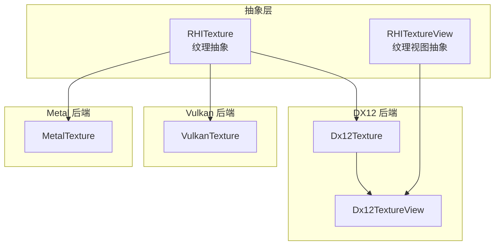
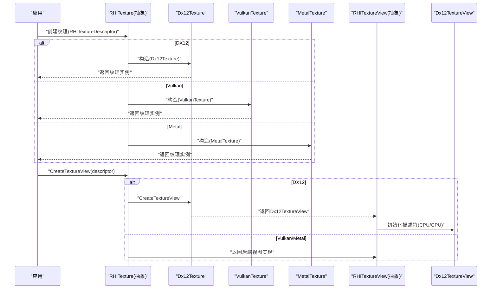
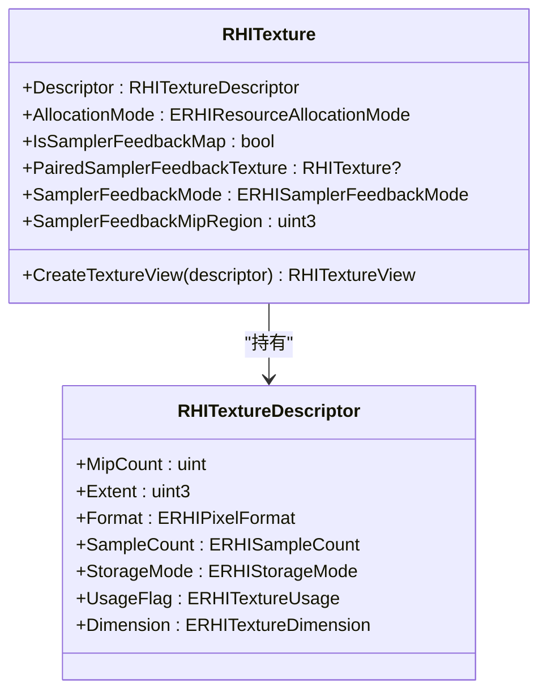
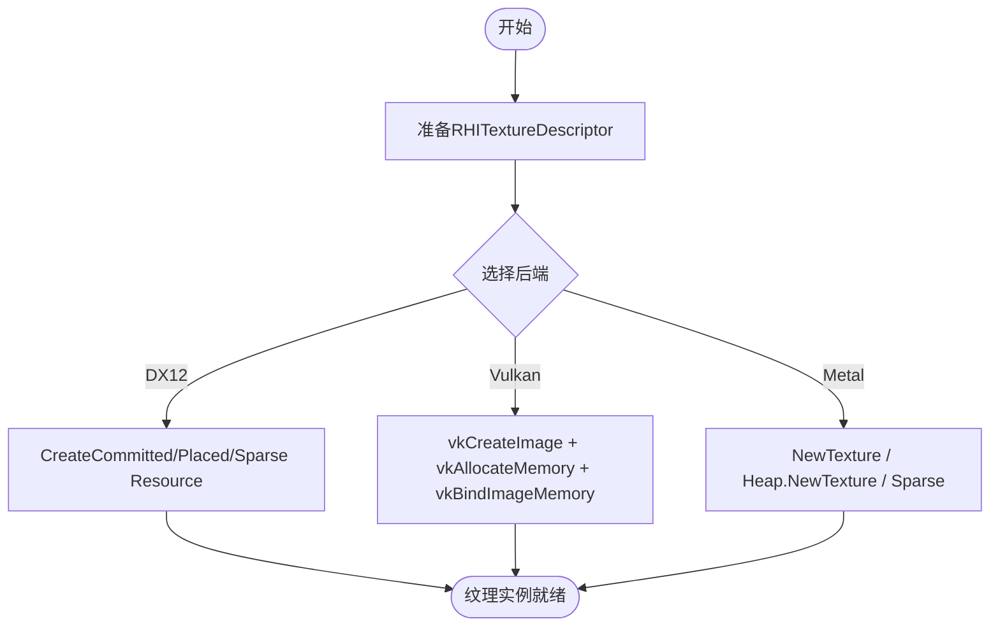
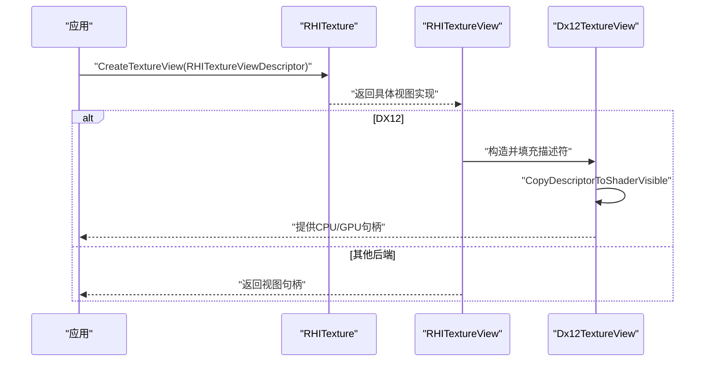
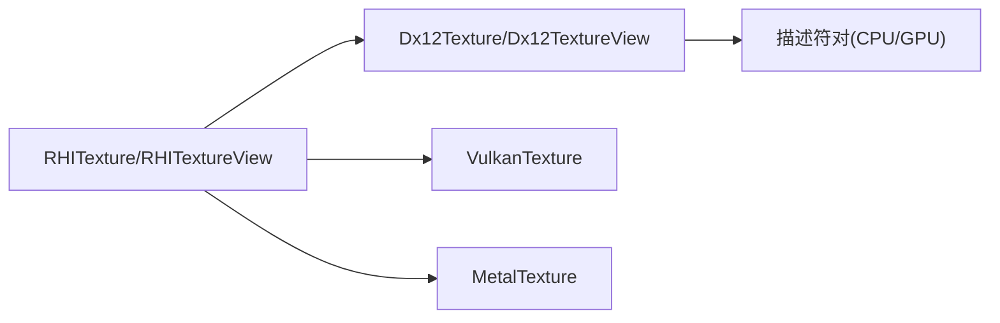

# 纹理管理

<cite>
**本文引用的文件**
- [RHITexture.cs](file://src/SharpGPU/Abstract/RHITexture.cs)
- [RHITextureView.cs](file://src/SharpGPU/Abstract/RHITextureView.cs)
- [Dx12Texture.cs](file://src/SharpGPU/Dx12/Dx12Texture.cs)
- [Dx12TextureView.cs](file://src/SharpGPU/Dx12/Dx12TextureView.cs)
- [VulkanTexture.cs](file://src/SharpGPU/Vulkan/VulkanTexture.cs)
- [MetalTexture.cs](file://src/SharpGPU/Metal/MetalTexture.cs)
</cite>

## 目录
1. [简介](#简介)
2. [项目结构](#项目结构)
3. [核心组件](#核心组件)
4. [架构总览](#架构总览)
5. [详细组件分析](#详细组件分析)
6. [依赖关系分析](#依赖关系分析)
7. [性能考虑](#性能考虑)
8. [故障排查指南](#故障排查指南)
9. [结论](#结论)
10. [附录](#附录)

## 简介
本文件为 SharpGPU 的纹理管理系统提供系统化文档，围绕 RHITexture 抽象类与后端实现（DX12、Vulkan、Metal）展开，覆盖以下主题：
- 纹理对象创建流程：格式、尺寸、层级（mip）、采样数、存储模式与用途标志。
- 纹理内存布局与多级渐远纹理（Mipmaps）管理机制。
- 纹理数据上传与更新方法：初始数据加载与运行时更新的实践建议。
- 纹理采样与过滤配置：不同格式的性能特点与注意事项。
- 纹理与渲染管线的绑定方式：在着色器中的访问方法与视图类型。
- 纹理视图的概念与用途：如何创建不同类型的纹理视图。
- 性能优化建议与常见问题解决方案。

## 项目结构
SharpGPU 采用“抽象接口 + 多后端实现”的分层设计：
- 抽象层：定义跨后端的纹理与纹理视图接口及描述符。
- 后端层：针对 DX12、Vulkan、Metal 的具体实现，封装原生资源创建、内存分配与视图生成。

图表来源
- [RHITexture.cs:50-120](file://src/SharpGPU/Abstract/RHITexture.cs#L50-L120)
- [RHITextureView.cs:5-21](file://src/SharpGPU/Abstract/RHITextureView.cs#L5-L21)
- [Dx12Texture.cs:30-186](file://src/SharpGPU/Dx12/Dx12Texture.cs#L30-L186)
- [Dx12TextureView.cs:39-113](file://src/SharpGPU/Dx12/Dx12TextureView.cs#L39-L113)
- [VulkanTexture.cs:43-210](file://src/SharpGPU/Vulkan/VulkanTexture.cs#L43-L210)
- [MetalTexture.cs:23-182](file://src/SharpGPU/Metal/MetalTexture.cs#L23-L182)

章节来源
- [RHITexture.cs:39-120](file://src/SharpGPU/Abstract/RHITexture.cs#L39-L120)
- [RHITextureView.cs:5-21](file://src/SharpGPU/Abstract/RHITextureView.cs#L5-L21)
- [Dx12Texture.cs:30-186](file://src/SharpGPU/Dx12/Dx12Texture.cs#L30-L186)
- [VulkanTexture.cs:43-210](file://src/SharpGPU/Vulkan/VulkanTexture.cs#L43-L210)
- [MetalTexture.cs:23-182](file://src/SharpGPU/Metal/MetalTexture.cs#L23-L182)

## 核心组件
- RHITexture：纹理抽象基类，持有纹理描述符、分配模式、采样反馈映射等状态，并提供创建纹理视图的统一入口。
- RHITextureView：纹理视图抽象基类，用于以不同视角（如着色器资源视图、无序访问视图）访问同一纹理资源。
- 后端纹理实现：Dx12Texture、VulkanTexture、MetalTexture，分别负责对应平台的原生纹理创建、内存绑定与生命周期管理。
- 后端纹理视图实现：Dx12TextureView 负责创建并缓存 CPU/GPU 描述符句柄，支持 SRV/UAV 与采样反馈 UAV。

章节来源
- [RHITexture.cs:50-120](file://src/SharpGPU/Abstract/RHITexture.cs#L50-L120)
- [RHITextureView.cs:18-21](file://src/SharpGPU/Abstract/RHITextureView.cs#L18-L21)
- [Dx12Texture.cs:30-186](file://src/SharpGPU/Dx12/Dx12Texture.cs#L30-L186)
- [VulkanTexture.cs:43-210](file://src/SharpGPU/Vulkan/VulkanTexture.cs#L43-L210)
- [MetalTexture.cs:23-182](file://src/SharpGPU/Metal/MetalTexture.cs#L23-L182)

## 架构总览
下图展示了纹理从创建到视图生成的整体流程，以及各后端对原生资源的封装方式。

图表来源
- [Dx12Texture.cs:30-186](file://src/SharpGPU/Dx12/Dx12Texture.cs#L30-L186)
- [VulkanTexture.cs:43-210](file://src/SharpGPU/Vulkan/VulkanTexture.cs#L43-L210)
- [MetalTexture.cs:23-182](file://src/SharpGPU/Metal/MetalTexture.cs#L23-L182)
- [Dx12TextureView.cs:39-113](file://src/SharpGPU/Dx12/Dx12TextureView.cs#L39-L113)

## 详细组件分析

### RHITexture 抽象类设计与纹理描述符
- 纹理描述符 RHITextureDescriptor：包含 MipCount、Extent（宽高深）、Format、SampleCount、StorageMode、UsageFlag、Dimension。这些字段共同决定纹理的内存布局、可访问性与平台能力要求。
- 分配模式 AllocationMode：支持 Committed（提交式）、Placed（放置式）、Sparse（稀疏）、External（外部资源）。
- 采样反馈映射：支持将纹理与采样反馈图进行配对，记录反馈模式与 mip 区域，便于后续解码或统计。

图表来源
- [RHITexture.cs:39-120](file://src/SharpGPU/Abstract/RHITexture.cs#L39-L120)

章节来源
- [RHITexture.cs:39-120](file://src/SharpGPU/Abstract/RHITexture.cs#L39-L120)

### 纹理对象创建过程（按后端）
- DX12：通过 CreateCommittedResource 或 CreatePlacedResource 创建 ID3D12Resource；支持稀疏纹理预留与需求查询；支持创建采样反馈图并与采样纹理配对。
- Vulkan：构建 VkImageCreateInfo，分配并绑定 VkDeviceMemory；支持堆内放置与稀疏图像；释放时区分是否拥有内存。
- Metal：使用 MTLTextureDescriptor 创建 MTLTexture；支持堆内放置与稀疏纹理；可从现有 MTLTexture 包装并指定用途。

图表来源
- [Dx12Texture.cs:30-186](file://src/SharpGPU/Dx12/Dx12Texture.cs#L30-L186)
- [VulkanTexture.cs:43-210](file://src/SharpGPU/Vulkan/VulkanTexture.cs#L43-L210)
- [MetalTexture.cs:23-182](file://src/SharpGPU/Metal/MetalTexture.cs#L23-L182)

章节来源
- [Dx12Texture.cs:30-186](file://src/SharpGPU/Dx12/Dx12Texture.cs#L30-L186)
- [VulkanTexture.cs:43-210](file://src/SharpGPU/Vulkan/VulkanTexture.cs#L43-L210)
- [MetalTexture.cs:23-182](file://src/SharpGPU/Metal/MetalTexture.cs#L23-L182)

### 纹理视图与管线绑定
- 视图描述符 RHITextureViewDescriptor：控制 BaseMipLevel、MipCount、BaseArraySlice、ArrayCount、ViewType（如 ShaderResource、UnorderedAccess）。
- DX12 视图：根据 UsageFlag 创建 SRV 或 UAV，并将描述符复制到 GPU 可见堆；对采样反馈图的特殊处理（UAV 需保持配对纹理存活）。
- 其他后端：遵循相同抽象，由各自实现完成视图创建与描述符管理。

图表来源
- [Dx12TextureView.cs:39-113](file://src/SharpGPU/Dx12/Dx12TextureView.cs#L39-L113)

章节来源
- [RHITextureView.cs:5-21](file://src/SharpGPU/Abstract/RHITextureView.cs#L5-L21)
- [Dx12TextureView.cs:39-113](file://src/SharpGPU/Dx12/Dx12TextureView.cs#L39-L113)

### 纹理内存布局与多级渐远纹理（Mipmaps）
- 维度与层级：Dimension 决定纹理类型（2D/Cube/3D/MSAA），MipCount 控制 mipmap 层级数量，Extent.z 表示数组层或深度。
- 采样数：SampleCount 用于多重采样目标（如 MSAA 渲染目标）。
- 存储模式：StorageMode 影响内存位置与访问语义（如设备本地、共享、只读等）。
- 用途标志：UsageFlag 决定可创建的视图类型与访问权限（SRV/UAV/RT/DS 等）。

章节来源
- [RHITexture.cs:39-48](file://src/SharpGPU/Abstract/RHITexture.cs#L39-L48)
- [Dx12Texture.cs:30-186](file://src/SharpGPU/Dx12/Dx12Texture.cs#L30-L186)
- [VulkanTexture.cs:43-210](file://src/SharpGPU/Vulkan/VulkanTexture.cs#L43-L210)
- [MetalTexture.cs:23-182](file://src/SharpGPU/Metal/MetalTexture.cs#L23-L182)

### 纹理数据上传与更新（最佳实践）
- 初始数据加载：建议在纹理创建后，使用命令缓冲进行子资源拷贝或写入，避免直接映射大纹理导致卡顿。
- 运行时更新：优先使用增量更新（仅更新需要的 mip/层/区域），结合屏障确保读写顺序正确。
- 稀疏纹理：对于超大纹理，可使用稀疏分配按需驻留页面，减少显存占用。
- 注意：不同后端对数据对齐、行步长、像素块大小有特定要求，应依据格式与维度选择合适的上传路径。

章节来源
- [Dx12Texture.cs:30-186](file://src/SharpGPU/Dx12/Dx12Texture.cs#L30-L186)
- [VulkanTexture.cs:43-210](file://src/SharpGPU/Vulkan/VulkanTexture.cs#L43-L210)
- [MetalTexture.cs:23-182](file://src/SharpGPU/Metal/MetalTexture.cs#L23-L182)

### 纹理采样与过滤模式配置
- 采样器配置：通常通过采样器对象或静态采样器描述，设置环绕模式、过滤模式（最近邻、线性、各向异性）、比较函数等。
- 格式与性能：压缩格式（如 BC/ASTC）适合纹理存储与带宽受限场景；浮点格式（如 RGBA32F）适合高精度计算但带宽消耗高。
- 注意：不同后端对格式支持与采样行为存在差异，应在创建前检查能力矩阵。

章节来源
- [RHITexture.cs:39-48](file://src/SharpGPU/Abstract/RHITexture.cs#L39-L48)
- [Dx12TextureView.cs:39-113](file://src/SharpGPU/Dx12/Dx12TextureView.cs#L39-L113)

### 纹理与渲染管线的绑定与着色器访问
- 绑定方式：通过纹理视图（SRV/UAV）绑定到管线阶段；DX12 中描述符需复制到 GPU 可见堆。
- 着色器访问：在 HLSL/GLSL/Metal Shading Language 中使用相应纹理类型与采样函数；注意坐标与层级偏移。
- 采样反馈：对采样反馈图，需先解码为可读格式再在着色器中读取。

章节来源
- [Dx12TextureView.cs:39-113](file://src/SharpGPU/Dx12/Dx12TextureView.cs#L39-L113)
- [RHITexture.cs:122-138](file://src/SharpGPU/Abstract/RHITexture.cs#L122-L138)

### 纹理视图概念与类型
- 视图作用：以不同视角访问同一底层纹理资源，屏蔽格式与维度细节。
- 常见类型：
  - 着色器资源视图（SRV）：供着色器只读访问。
  - 无序访问视图（UAV）：供计算着色器或图形阶段写访问。
  - 采样反馈 UAV：用于记录采样使用情况，需与采样纹理配对。
- 创建约束：必须满足 UsageFlag 与格式能力；DX12 中对采样反馈图有特殊限制。

章节来源
- [RHITextureView.cs:5-21](file://src/SharpGPU/Abstract/RHITextureView.cs#L5-L21)
- [Dx12TextureView.cs:39-113](file://src/SharpGPU/Dx12/Dx12TextureView.cs#L39-L113)

## 依赖关系分析
- 抽象与实现解耦：RHITexture/RHITextureView 定义稳定接口，后端实现独立演进。
- 描述符与句柄：DX12 视图维护 CPU/GPU 描述符对，并在销毁时释放。
- 采样反馈耦合：采样反馈图与采样纹理在创建时配对，UAV 创建时需保证配对纹理存活。

图表来源
- [Dx12TextureView.cs:39-113](file://src/SharpGPU/Dx12/Dx12TextureView.cs#L39-L113)
- [RHITexture.cs:50-120](file://src/SharpGPU/Abstract/RHITexture.cs#L50-L120)

章节来源
- [Dx12TextureView.cs:39-113](file://src/SharpGPU/Dx12/Dx12TextureView.cs#L39-L113)
- [RHITexture.cs:50-120](file://src/SharpGPU/Abstract/RHITexture.cs#L50-L120)

## 性能考虑
- 合理设置 MipCount：过大增加内存占用与初始化时间；过小影响远距离采样质量。
- 选择合适格式：压缩格式降低带宽与显存；浮点格式提升精度但代价更高。
- 批量创建视图：复用描述符池，减少频繁分配与复制开销。
- 稀疏纹理：对超大纹理按需驻留，降低峰值显存。
- 避免不必要的状态切换：尽量在同一帧内复用视图与采样器，减少绑定成本。

[本节为通用指导，不直接分析具体文件]

## 故障排查指南
- 无法创建 SRV/UAV：检查 UsageFlag 是否允许对应视图类型；确认格式与维度组合受支持。
- 采样反馈图不可读：采样反馈图为不透明格式，需先解码为可读纹理（如 R8_UINT）后再在着色器中读取。
- 采样反馈 UAV 失败：确保创建时的配对采样纹理仍然存活且未被释放。
- 资源创建失败：关注后端返回的错误码与设备移除原因，定位是内存不足还是能力不支持。
- 视图描述符无效：核对 BaseMipLevel、MipCount、BaseArraySlice、ArrayCount 是否在纹理范围内。

章节来源
- [Dx12TextureView.cs:46-112](file://src/SharpGPU/Dx12/Dx12TextureView.cs#L46-L112)
- [Dx12Texture.cs:134-180](file://src/SharpGPU/Dx12/Dx12Texture.cs#L134-L180)
- [VulkanTexture.cs:43-210](file://src/SharpGPU/Vulkan/VulkanTexture.cs#L43-L210)
- [MetalTexture.cs:23-182](file://src/SharpGPU/Metal/MetalTexture.cs#L23-L182)

## 结论
SharpGPU 的纹理管理通过抽象接口统一了多后端差异，提供了灵活的纹理创建、视图绑定与采样反馈能力。在实际工程中，应结合应用场景选择合适的格式、维度与用途标志，合理利用 mipmap 与稀疏纹理，并通过批量化与复用策略优化性能。遇到问题时，优先检查用途标志、视图范围与后端能力匹配性。

[本节为总结性内容，不直接分析具体文件]

## 附录
- 术语说明：
  - Mipmaps：多级渐远纹理，用于在不同距离下采样不同分辨率的纹理。
  - SRV/UAV：着色器资源视图/无序访问视图，分别用于只读与写访问。
  - 采样反馈：记录采样器访问情况，用于优化与调试。
- 参考路径：
  - 纹理抽象与描述符：[RHITexture.cs:39-120](file://src/SharpGPU/Abstract/RHITexture.cs#L39-L120)
  - 视图抽象与描述符：[RHITextureView.cs:5-21](file://src/SharpGPU/Abstract/RHITextureView.cs#L5-L21)
  - DX12 纹理与视图：[Dx12Texture.cs:30-186](file://src/SharpGPU/Dx12/Dx12Texture.cs#L30-L186)、[Dx12TextureView.cs:39-113](file://src/SharpGPU/Dx12/Dx12TextureView.cs#L39-L113)
  - Vulkan 纹理：[VulkanTexture.cs:43-210](file://src/SharpGPU/Vulkan/VulkanTexture.cs#L43-L210)
  - Metal 纹理：[MetalTexture.cs:23-182](file://src/SharpGPU/Metal/MetalTexture.cs#L23-L182)