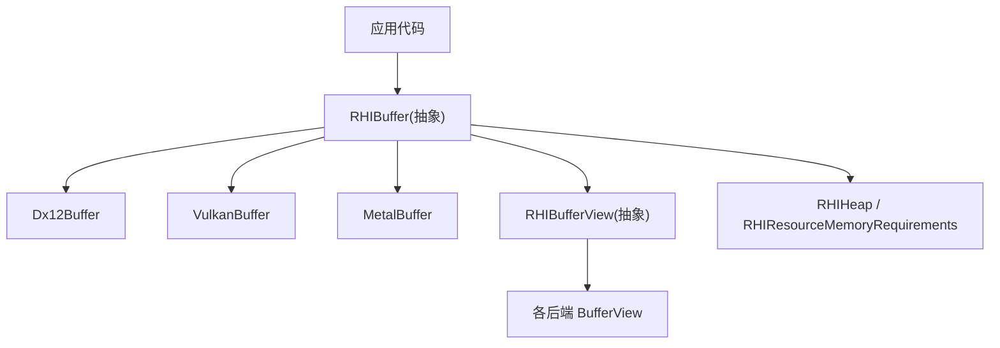
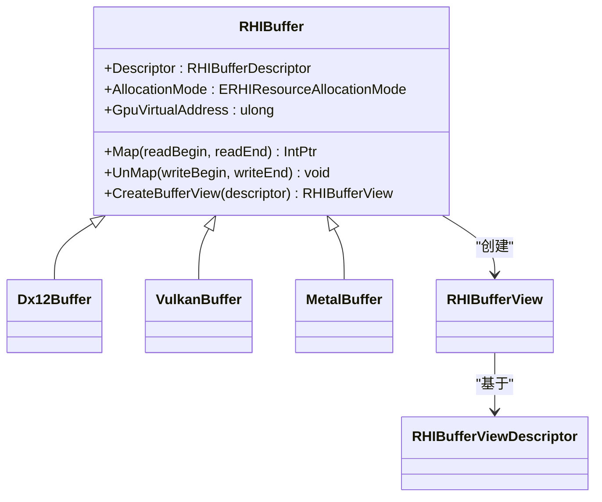
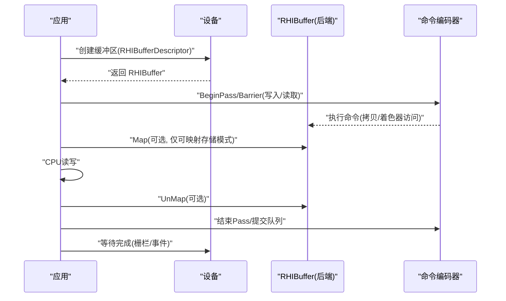
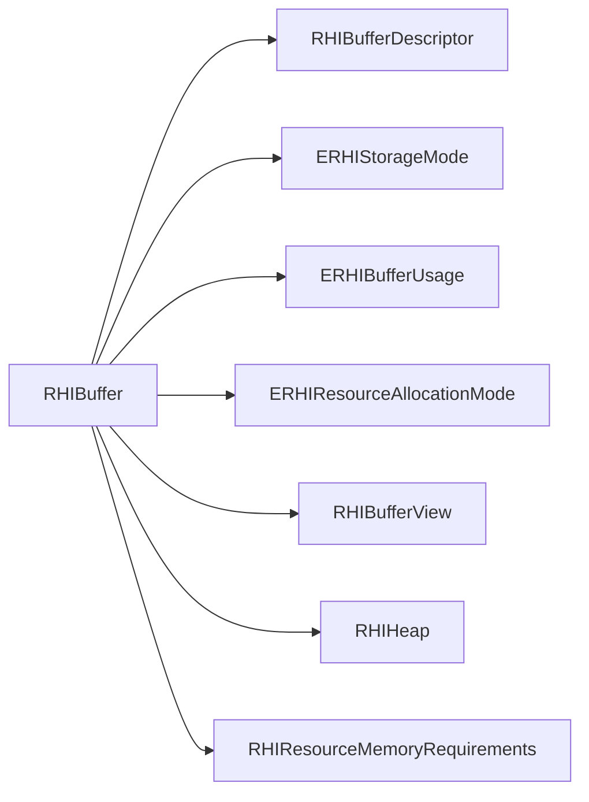

# 缓冲区管理

<cite>
**本文引用的文件**
- [RHIBuffer.cs](file://src/SharpGPU/Abstract/RHIBuffer.cs)
- [RHIUtility.cs](file://src/SharpGPU/Abstract/RHIUtility.cs)
- [RHIMemory.cs](file://src/SharpGPU/Abstract/RHIMemory.cs)
- [RHIBufferView.cs](file://src/SharpGPU/Abstract/RHIBufferView.cs)
- [Dx12Buffer.cs](file://src/SharpGPU/Dx12/Dx12Buffer.cs)
- [VulkanBuffer.cs](file://src/SharpGPU/Vulkan/VulkanBuffer.cs)
- [MetalBuffer.cs](file://src/SharpGPU/Metal/MetalBuffer.cs)
- [ComputeWorkload.cs](file://samples/ComputeAndDraw/ComputeWorkload.cs)
</cite>

## 目录
1. [简介](#简介)
2. [项目结构](#项目结构)
3. [核心组件](#核心组件)
4. [架构总览](#架构总览)
5. [详细组件分析](#详细组件分析)
6. [依赖关系分析](#依赖关系分析)
7. [性能考量](#性能考量)
8. [故障排查指南](#故障排查指南)
9. [结论](#结论)
10. [附录：使用示例与最佳实践](#附录使用示例与最佳实践)

## 简介
本文件聚焦 SharpGPU 的缓冲区管理系统，围绕 RHIBuffer 抽象类及其后端实现（DX12、Vulkan、Metal）展开，系统阐述缓冲区描述符配置、内存分配模式、存储模式、生命周期管理、CPU-GPU 同步机制（Map/Unmap）、不同后端的差异与优化策略，并给出实际使用示例与最佳实践。目标是帮助读者在不深入底层 API 的情况下，正确、高效地使用缓冲区资源。

## 项目结构
SharpGPU 将缓冲区的抽象接口与具体后端实现分离：
- 抽象层：定义统一的缓冲区接口、描述符、视图、枚举等
- 后端层：针对 DX12、Vulkan、Metal 的具体实现
- 工具与内存管理层：提供堆、放置、预算、对齐等通用能力
- 示例层：演示如何创建、使用、读取缓冲区

图表来源
- [RHIBuffer.cs:14-47](file://src/SharpGPU/Abstract/RHIBuffer.cs#L14-L47)
- [Dx12Buffer.cs:8-147](file://src/SharpGPU/Dx12/Dx12Buffer.cs#L8-L147)
- [VulkanBuffer.cs:7-376](file://src/SharpGPU/Vulkan/VulkanBuffer.cs#L7-L376)
- [MetalBuffer.cs:8-142](file://src/SharpGPU/Metal/MetalBuffer.cs#L8-L142)
- [RHIBufferView.cs:5-16](file://src/SharpGPU/Abstract/RHIBufferView.cs#L5-L16)
- [RHIMemory.cs:9-15](file://src/SharpGPU/Abstract/RHIMemory.cs#L9-L15)

章节来源
- [RHIBuffer.cs:14-47](file://src/SharpGPU/Abstract/RHIBuffer.cs#L14-L47)
- [RHIBufferView.cs:5-16](file://src/SharpGPU/Abstract/RHIBufferView.cs#L5-L16)
- [RHIMemory.cs:9-15](file://src/SharpGPU/Abstract/RHIMemory.cs#L9-L15)

## 核心组件
- RHIBufferDescriptor：描述缓冲区大小、格式、用途标志和存储模式
- ERHIStorageMode：存储模式，决定数据驻留位置与访问语义（如 GPU 本地、上传、回读、主机上传、无内存等）
- ERHIBufferUsage：用途标志，指示缓冲区在管线中的角色（拷贝源/目标、顶点/索引/常量/间接参数、着色器资源/无序访问等）
- ERHIResourceAllocationMode：分配模式，区分提交式、放置式、稀疏、外部资源
- RHIBufferViewDescriptor：描述缓冲区的视图范围、步长、类型等
- Map/UnMap：用于 CPU 侧访问映射到可映射内存的区域，配合屏障与同步保证一致性

章节来源
- [RHIBuffer.cs:6-47](file://src/SharpGPU/Abstract/RHIBuffer.cs#L6-L47)
- [RHIUtility.cs:569-632](file://src/SharpGPU/Abstract/RHIUtility.cs#L569-L632)
- [RHIMemory.cs:9-15](file://src/SharpGPU/Abstract/RHIMemory.cs#L9-L15)
- [RHIBufferView.cs:5-16](file://src/SharpGPU/Abstract/RHIBufferView.cs#L5-L16)

## 架构总览
RHIBuffer 作为统一抽象，屏蔽了后端差异；每个后端实现负责：
- 根据描述符创建原生资源（ID3D12Resource、VkBuffer、MTLBuffer）
- 选择合适内存类型/堆（考虑存储模式、对齐、预算）
- 实现 Map/UnMap 以暴露 CPU 可访问区域（若支持）
- 提供 CreateBufferView 以生成绑定所需的视图对象

图表来源
- [RHIBuffer.cs:14-47](file://src/SharpGPU/Abstract/RHIBuffer.cs#L14-L47)
- [Dx12Buffer.cs:8-147](file://src/SharpGPU/Dx12/Dx12Buffer.cs#L8-L147)
- [VulkanBuffer.cs:7-376](file://src/SharpGPU/Vulkan/VulkanBuffer.cs#L7-L376)
- [MetalBuffer.cs:8-142](file://src/SharpGPU/Metal/MetalBuffer.cs#L8-L142)
- [RHIBufferView.cs:5-16](file://src/SharpGPU/Abstract/RHIBufferView.cs#L5-L16)

## 详细组件分析

### RHIBuffer 抽象设计与职责
- 描述符只读暴露，内部维护 Descriptor 与 AllocationMode
- GpuVirtualAddress 默认抛出“不支持”，由后端按需实现（例如 DX12/Vulkan/Metal 可能暴露）
- Map/UnMap 为抽象方法，要求子类实现各自后端的映射/解映射逻辑
- CreateBufferView 返回对应后端的视图对象

章节来源
- [RHIBuffer.cs:14-47](file://src/SharpGPU/Abstract/RHIBuffer.cs#L14-L47)

### 缓冲区描述符与枚举
- RHIBufferDescriptor：ByteSize、Format、UsageFlag、StorageMode
- ERHIStorageMode：GPULocal、Readback、GPUUpload、HostUpload、Memoryless、Pending
- ERHIBufferUsage：CopySrc/CopyDst/IndexBuffer/VertexBuffer/UniformBuffer/IndirectBuffer/ShaderResource/UnorderedAccess/AccelStruct 等
- ERHIResourceAllocationMode：Committed、Placed、Sparse、External

这些枚举共同决定了缓冲区的内存布局、可见性、访问方式以及后端如何构建资源。

章节来源
- [RHIUtility.cs:569-632](file://src/SharpGPU/Abstract/RHIUtility.cs#L569-L632)
- [RHIMemory.cs:9-15](file://src/SharpGPU/Abstract/RHIMemory.cs#L9-L15)

### 视图与范围
- RHIBufferViewDescriptor：Count、Offset、Stride、ViewType
- 视图用于将原始缓冲区切片或解释为特定格式（如结构化缓冲区、UBO、UAV 等），供着色器或命令阶段绑定

章节来源
- [RHIBufferView.cs:5-16](file://src/SharpGPU/Abstract/RHIBufferView.cs#L5-L16)

### 后端实现对比

#### DX12 缓冲区
- 构造：根据 StorageMode 选择 HeapProperties，并使用 CommittedResource 或 PlacedResource 创建 ID3D12Resource
- 分配模式：Committed（默认）、Placed（从堆中放置）、External（外部资源包装）
- Map/UnMap：仅对非 GPULocal 的缓冲区允许映射；通过 Range 指定映射区间；错误时抛出异常
- GpuVirtualAddress：直接返回原生资源的 GPU 虚拟地址
- 释放：释放原生资源与 Placement

章节来源
- [Dx12Buffer.cs:37-97](file://src/SharpGPU/Dx12/Dx12Buffer.cs#L37-L97)
- [Dx12Buffer.cs:99-147](file://src/SharpGPU/Dx12/Dx12Buffer.cs#L99-L147)

#### Vulkan 缓冲区
- 构造：创建 VkBuffer，查询内存需求，按 StorageMode 选择内存属性与类型，必要时启用 Device Address 标志；可选择从堆中放置
- 分配模式：Committed（独立内存）、Placed（共享堆）、External（已有资源包装）
- Map/UnMap：仅对非 GPULocal 的缓冲区允许映射；首次 Map 时缓存基址；Readback 模式会调用 Invalidate；Upload 模式在 UnMap 时 Flush；支持共享堆映射
- GpuVirtualAddress：需要设备特性支持，通过 vkGetBufferDeviceAddress 获取
- 释放：销毁缓冲与内存，处理残留映射

章节来源
- [VulkanBuffer.cs:65-181](file://src/SharpGPU/Vulkan/VulkanBuffer.cs#L65-L181)
- [VulkanBuffer.cs:192-309](file://src/SharpGPU/Vulkan/VulkanBuffer.cs#L192-L309)
- [VulkanBuffer.cs:311-376](file://src/SharpGPU/Vulkan/VulkanBuffer.cs#L311-L376)

#### Metal 缓冲区
- 构造：通过 MTLDevice.NewBuffer 或 MTLHeap.NewBuffer 创建；支持托管存储模式
- 分配模式：Committed、Placed、External
- Map/UnMap：仅对非 GPULocal/Memoryless 的缓冲区允许映射；Managed 模式下 UnMap 需调用 DidModifyRange 通知 GPU
- GpuVirtualAddress：若未暴露则抛出“不支持”
- 释放：移除驻留并释放原生对象

章节来源
- [MetalBuffer.cs:31-83](file://src/SharpGPU/Metal/MetalBuffer.cs#L31-L83)
- [MetalBuffer.cs:85-126](file://src/SharpGPU/Metal/MetalBuffer.cs#L85-L126)
- [MetalBuffer.cs:128-142](file://src/SharpGPU/Metal/MetalBuffer.cs#L128-L142)

### 生命周期管理
- 创建：通过设备工厂创建 RHIBuffer，传入 RHIBufferDescriptor；后端根据 StorageMode 与 UsageFlag 选择合适内存与初始状态
- 使用：通过命令编码器设置屏障、拷贝、绘制/计算等；必要时创建视图进行绑定
- 同步：CPU 侧访问前调用 Map，访问后调用 UnMap；GPU 侧读写前后使用 Barrier 确保可见性与顺序
- 销毁：析构时释放原生资源与可能的 Placement；Vulkan 还会清理残留映射

图表来源
- [ComputeWorkload.cs:87-157](file://samples/ComputeAndDraw/ComputeWorkload.cs#L87-L157)
- [Dx12Buffer.cs:99-133](file://src/SharpGPU/Dx12/Dx12Buffer.cs#L99-L133)
- [VulkanBuffer.cs:192-309](file://src/SharpGPU/Vulkan/VulkanBuffer.cs#L192-L309)
- [MetalBuffer.cs:85-120](file://src/SharpGPU/Metal/MetalBuffer.cs#L85-L120)

### CPU-GPU 内存同步机制
- 何时可映射：StorageMode 非 GPULocal（某些后端还排除 Memoryless）
- 范围校验：readBegin/readEnd 必须在缓冲区范围内，否则抛出参数异常
- 后端差异：
  - DX12：直接 Map/Unmap 指定 Range
  - Vulkan：首次 Map 时缓存基址；Readback 模式 Invalidate；Upload 模式 Flush；支持共享堆映射
  - Metal：Managed 模式 UnMap 时需 DidModifyRange
- 性能建议：
  - 尽量批量写入/读取，减少 Map/UnMap 次数
  - 使用合适的 StorageMode（上传用 GPUUpload/HostUpload，回读用 Readback，常驻用 GPULocal）
  - 避免频繁切换状态，结合 Barrier 最小化同步开销

章节来源
- [Dx12Buffer.cs:99-133](file://src/SharpGPU/Dx12/Dx12Buffer.cs#L99-L133)
- [VulkanBuffer.cs:192-309](file://src/SharpGPU/Vulkan/VulkanBuffer.cs#L192-L309)
- [MetalBuffer.cs:85-120](file://src/SharpGPU/Metal/MetalBuffer.cs#L85-L120)

### 不同后端的优化策略
- DX12：
  - 优先使用 Committed 资源简化生命周期；大批量小资源可用 Placed 提升复用
  - 合理设置初始状态以减少过渡屏障
- Vulkan：
  - 利用共享堆与内存类型选择优化带宽与延迟
  - 注意非一致内存的 Flush/Invalidate 时机
- Metal：
  - Managed 存储模式自动同步，但需注意 DidModifyRange 的调用范围
  - 对频繁更新的数据，考虑分块更新与合并

[本节为概念性总结，不直接分析具体文件]

## 依赖关系分析
- RHIBuffer 依赖：
  - RHIBufferDescriptor、ERHIStorageMode、ERHIBufferUsage、ERHIResourceAllocationMode
  - RHIBufferViewDescriptor、RHIBufferView
  - 各后端原生 API（DX12/Vulkan/Metal）
- 内存管理：
  - RHIHeap、RHIResourceMemoryRequirements 提供堆与兼容性约束
  - RHIHeapPlacementRegistry 防止重叠放置与非法释放

图表来源
- [RHIBuffer.cs:14-47](file://src/SharpGPU/Abstract/RHIBuffer.cs#L14-L47)
- [RHIMemory.cs:23-77](file://src/SharpGPU/Abstract/RHIMemory.cs#L23-L77)
- [RHIMemory.cs:173-333](file://src/SharpGPU/Abstract/RHIMemory.cs#L173-L333)

章节来源
- [RHIBuffer.cs:14-47](file://src/SharpGPU/Abstract/RHIBuffer.cs#L14-L47)
- [RHIMemory.cs:23-77](file://src/SharpGPU/Abstract/RHIMemory.cs#L23-L77)
- [RHIMemory.cs:173-333](file://src/SharpGPU/Abstract/RHIMemory.cs#L173-L333)

## 性能考量
- 存储模式选择：
  - GPULocal：适合 GPU 高频读写且无需 CPU 访问
  - GPUUpload/HostUpload：适合一次性上传数据
  - Readback：适合从 GPU 回读结果
  - Memoryless：通常用于帧缓冲等不可映射场景
- 对齐与布局：
  - 遵循后端要求的对齐（如 Vulkan 非一致内存对齐、DX12 资源对齐）
  - 使用 RHIResourceMemoryRequirements 的 Alignment 指导布局
- 同步成本：
  - 减少 Map/UnMap 次数，合并写入
  - 合理使用 Barrier，避免不必要的状态转换
- 资源复用：
  - 使用 Placed 资源与堆复用降低分配开销
  - 避免频繁创建/销毁大缓冲区

[本节为通用性能建议，不直接分析具体文件]

## 故障排查指南
- 常见异常与原因：
  - “无法映射 GPU 本地缓冲区”：StorageMode 为 GPULocal（或 Metal 的 Memoryless）不允许映射
  - “范围越界”：readBegin/readEnd 超出缓冲区大小或顺序错误
  - “未先 Map 就 UnMap”：Vulkan 要求先 Map 再 UnMap
  - “不支持 GPU 虚拟地址”：后端未暴露或特性未启用
- 定位步骤：
  - 检查 StorageMode 与 UsageFlag 是否匹配使用场景
  - 确认 Map/UnMap 成对调用且范围合法
  - 查看 Barrier 是否正确设置读写阶段与访问掩码
  - 对于 Vulkan，确认是否启用了 Device Address 特性

章节来源
- [Dx12Buffer.cs:99-133](file://src/SharpGPU/Dx12/Dx12Buffer.cs#L99-L133)
- [VulkanBuffer.cs:192-309](file://src/SharpGPU/Vulkan/VulkanBuffer.cs#L192-L309)
- [MetalBuffer.cs:85-120](file://src/SharpGPU/Metal/MetalBuffer.cs#L85-L120)

## 结论
SharpGPU 的缓冲区管理通过 RHIBuffer 抽象统一了跨后端的资源创建、视图绑定与同步操作。理解描述符配置、存储模式与分配模式是正确使用缓冲区的关键。不同后端在 Map/UnMap、GPU 地址、内存管理上存在差异，但都遵循一致的语义与约束。遵循最佳实践（对齐、批处理、合理同步）可获得稳定且高效的性能表现。

[本节为总结性内容，不直接分析具体文件]

## 附录：使用示例与最佳实践

### 示例：创建与使用缓冲区（计算着色器输出与回读）
- 创建 GPU 本地输出缓冲区与 Readback 缓冲区
- 创建 UAO 视图并绑定到着色器
- 提交计算与拷贝命令，等待完成后 Map 回读缓冲区并读取结果

参考路径
- [ComputeWorkload.cs:87-157](file://samples/ComputeAndDraw/ComputeWorkload.cs#L87-L157)

### 最佳实践清单
- 内存对齐
  - 依据 RHIResourceMemoryRequirements.Alignment 对齐布局
  - 使用工具函数 AlignTo 进行对齐计算
- 访问模式
  - 上传：GPUUpload/HostUpload，写完后 UnMap 触发 Flush（Vulkan）
  - 回读：Readback，Map 前 Invalidate（Vulkan）
  - 常驻：GPULocal，避免 CPU 访问
- 性能优化技巧
  - 批量写入，减少 Map/UnMap
  - 使用 Placed 资源与堆复用
  - 合理设置初始状态，减少状态转换
  - 使用视图（StructuredBuffer/UBO/UAV）精确绑定所需范围

章节来源
- [RHIUtility.cs:716-738](file://src/SharpGPU/Abstract/RHIUtility.cs#L716-L738)
- [ComputeWorkload.cs:87-157](file://samples/ComputeAndDraw/ComputeWorkload.cs#L87-L157)