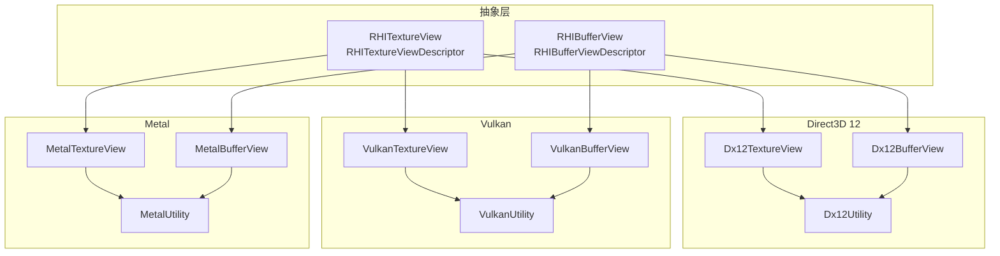
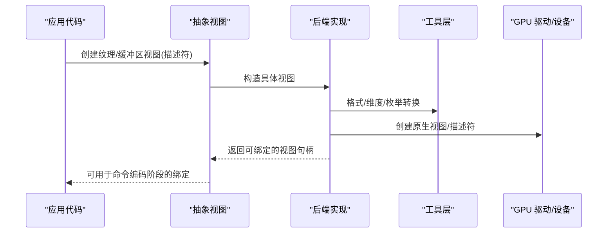
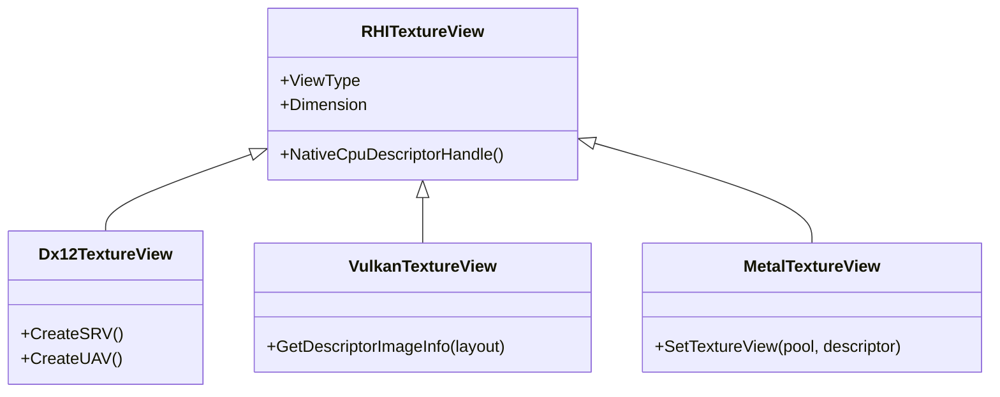
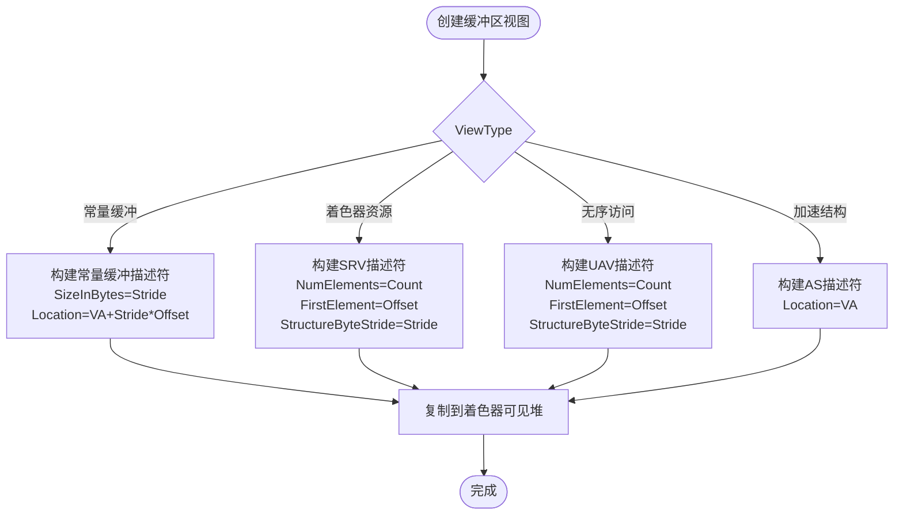
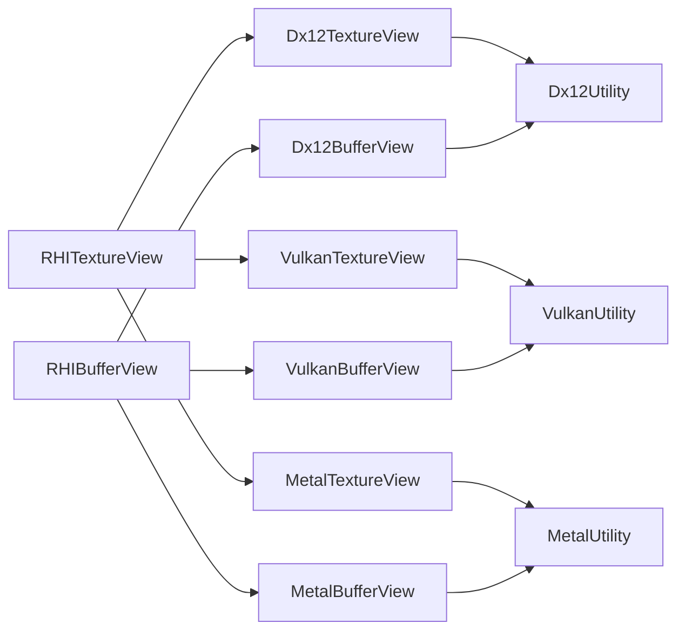

# 视图管理

<cite>
**本文引用的文件**
- [RHITextureView.cs](file://src/SharpGPU/Abstract/RHITextureView.cs)
- [RHIBufferView.cs](file://src/SharpGPU/Abstract/RHIBufferView.cs)
- [Dx12TextureView.cs](file://src/SharpGPU/Dx12/Dx12TextureView.cs)
- [Dx12BufferView.cs](file://src/SharpGPU/Dx12/Dx12BufferView.cs)
- [VulkanTextureView.cs](file://src/SharpGPU/Vulkan/VulkanTextureView.cs)
- [VulkanBufferView.cs](file://src/SharpGPU/Vulkan/VulkanBufferView.cs)
- [MetalTextureView.cs](file://src/SharpGPU/Metal/MetalTextureView.cs)
- [MetalBufferView.cs](file://src/SharpGPU/Metal/MetalBufferView.cs)
- [RHIUtility.cs](file://src/SharpGPU/Abstract/RHIUtility.cs)
- [Dx12Utility.cs](file://src/SharpGPU/Dx12/Dx12Utility.cs)
- [VulkanUtility.cs](file://src/SharpGPU/Vulkan/VulkanUtility.cs)
- [MetalUtility.cs](file://src/SharpGPU/Metal/MetalUtility.cs)
</cite>

## 目录
1. [简介](#简介)
2. [项目结构](#项目结构)
3. [核心组件](#核心组件)
4. [架构总览](#架构总览)
5. [详细组件分析](#详细组件分析)
6. [依赖关系分析](#依赖关系分析)
7. [性能考虑](#性能考虑)
8. [故障排查指南](#故障排查指南)
9. [结论](#结论)
10. [附录：使用示例与最佳实践](#附录使用示例与最佳实践)

## 简介
本文件面向 SharpGPU 的“视图”子系统，系统性阐述纹理视图(RHITextureView)与缓冲区视图(RHIBufferView)的概念、用途与差异；详细说明视图描述符(RHITextureViewDescriptor、RHIBufferViewDescriptor)的配置项（如范围指定、访问权限）；解释视图生命周期管理与资源绑定机制；对比不同后端(Direct3D 12、Vulkan、Metal)的实现差异与优化策略；并给出视图重用与缓存机制、性能注意事项与常见陷阱，以及创建和使用各类视图的实践建议。

## 项目结构
SharpGPU 将“视图”抽象为平台无关接口，并在各后端提供具体实现：
- 抽象层：定义纹理视图与缓冲区视图及其描述符
- 后端实现：分别针对 D3D12、Vulkan、Metal 提供具体视图类型与原生对象封装
- 工具层：提供格式转换、维度映射、描述符分配等通用能力

图表来源
- [RHITextureView.cs:5-21](file://src/SharpGPU/Abstract/RHITextureView.cs#L5-L21)
- [RHIBufferView.cs:5-16](file://src/SharpGPU/Abstract/RHIBufferView.cs#L5-L16)
- [Dx12TextureView.cs:6-123](file://src/SharpGPU/Dx12/Dx12TextureView.cs#L6-L123)
- [Dx12BufferView.cs:5-123](file://src/SharpGPU/Dx12/Dx12BufferView.cs#L5-L123)
- [VulkanTextureView.cs:5-67](file://src/SharpGPU/Vulkan/VulkanTextureView.cs#L5-L67)
- [VulkanBufferView.cs:5-35](file://src/SharpGPU/Vulkan/VulkanBufferView.cs#L5-L35)
- [MetalTextureView.cs:106-165](file://src/SharpGPU/Metal/MetalTextureView.cs#L106-L165)
- [MetalBufferView.cs:3-20](file://src/SharpGPU/Metal/MetalBufferView.cs#L3-L20)

章节来源
- [RHITextureView.cs:5-21](file://src/SharpGPU/Abstract/RHITextureView.cs#L5-L21)
- [RHIBufferView.cs:5-16](file://src/SharpGPU/Abstract/RHIBufferView.cs#L5-L16)

## 核心组件
- RHITextureViewDescriptor：用于配置纹理视图的范围与类型
  - MipCount：包含的 mip 级别数量
  - BaseMipLevel：起始 mip 级别
  - ArrayCount：数组切片数量
  - BaseArraySlice：起始数组切片索引
  - ViewType：视图类型（如着色器资源或无序访问）
- RHITextureView：纹理视图抽象基类，承载平台相关句柄与元数据
- RHIBufferViewDescriptor：用于配置缓冲区视图的范围与类型
  - Count：元素个数
  - Offset：偏移（以元素为单位）
  - Stride：步长（字节）
  - ViewType：视图类型（着色器资源、常量缓冲、无序访问、加速结构等）
- RHIBufferView：缓冲区视图抽象基类，承载平台相关句柄与元数据

章节来源
- [RHITextureView.cs:5-21](file://src/SharpGPU/Abstract/RHITextureView.cs#L5-L21)
- [RHIBufferView.cs:5-16](file://src/SharpGPU/Abstract/RHIBufferView.cs#L5-L16)

## 架构总览
视图在 SharpGPU 中扮演“对底层资源的逻辑切片与访问语义”的角色：
- 同一底层资源可通过多个视图暴露不同的子区域、mip/数组范围与访问权限
- 各后端将抽象视图转换为原生描述符/句柄，供渲染或计算阶段绑定
- 工具层负责格式、维度、枚举等的跨后端映射

图表来源
- [Dx12TextureView.cs:39-113](file://src/SharpGPU/Dx12/Dx12TextureView.cs#L39-L113)
- [Dx12BufferView.cs:38-113](file://src/SharpGPU/Dx12/Dx12BufferView.cs#L38-L113)
- [VulkanTextureView.cs:17-52](file://src/SharpGPU/Vulkan/VulkanTextureView.cs#L17-L52)
- [VulkanBufferView.cs:14-31](file://src/SharpGPU/Vulkan/VulkanBufferView.cs#L14-L31)
- [MetalTextureView.cs:118-159](file://src/SharpGPU/Metal/MetalTextureView.cs#L118-L159)
- [MetalBufferView.cs:11-15](file://src/SharpGPU/Metal/MetalBufferView.cs#L11-L15)

## 详细组件分析

### 纹理视图(RHITextureView)
- 作用：将纹理资源按 mip/数组/维度进行切片，并以特定访问语义（如只读采样、写入）暴露给着色器
- 关键配置：BaseMipLevel、MipCount、BaseArraySlice、ArrayCount、ViewType
- 后端差异：
  - D3D12：创建 SRV/UAV 到 CPU staging；BindingTable 在 SetBindingTable 时再 flush 到自有 GPU 段；支持采样反馈特殊路径
  - Vulkan：创建 VkImageView，设置 subresourceRange；通过 GetDescriptorImageInfo 获取绑定信息
  - Metal：创建期锁定 ViewPool 容量，dispose 清 native 槽后再还软件 index；支持全视图快速路径

图表来源
- [RHITextureView.cs:18-21](file://src/SharpGPU/Abstract/RHITextureView.cs#L18-L21)
- [Dx12TextureView.cs:6-123](file://src/SharpGPU/Dx12/Dx12TextureView.cs#L6-L123)
- [VulkanTextureView.cs:5-67](file://src/SharpGPU/Vulkan/VulkanTextureView.cs#L5-L67)
- [MetalTextureView.cs:106-165](file://src/SharpGPU/Metal/MetalTextureView.cs#L106-L165)

章节来源
- [RHITextureView.cs:5-21](file://src/SharpGPU/Abstract/RHITextureView.cs#L5-L21)
- [Dx12TextureView.cs:39-113](file://src/SharpGPU/Dx12/Dx12TextureView.cs#L39-L113)
- [VulkanTextureView.cs:17-52](file://src/SharpGPU/Vulkan/VulkanTextureView.cs#L17-L52)
- [MetalTextureView.cs:118-159](file://src/SharpGPU/Metal/MetalTextureView.cs#L118-L159)

### 缓冲区视图(RHIBufferView)
- 作用：将缓冲区按元素范围与步长进行切片，并提供常量缓冲、着色器资源、无序访问或加速结构等访问语义
- 关键配置：Offset、Count、Stride、ViewType
- 后端差异：
  - D3D12：创建 CBV/SRV/UAV/AS 描述符，并复制到可见堆；根据 UsageFlag 校验是否允许创建
  - Vulkan：生成 VkDescriptorBufferInfo，UniformBuffer 使用 stride 作为 range，其他使用 count*stride
  - Metal：轻量包装，保留描述符以便后续绑定

图表来源
- [Dx12BufferView.cs:38-113](file://src/SharpGPU/Dx12/Dx12BufferView.cs#L38-L113)

章节来源
- [RHIBufferView.cs:5-16](file://src/SharpGPU/Abstract/RHIBufferView.cs#L5-L16)
- [Dx12BufferView.cs:38-113](file://src/SharpGPU/Dx12/Dx12BufferView.cs#L38-L113)
- [VulkanBufferView.cs:14-31](file://src/SharpGPU/Vulkan/VulkanBufferView.cs#L14-L31)
- [MetalBufferView.cs:11-15](file://src/SharpGPU/Metal/MetalBufferView.cs#L11-L15)

### 视图描述符与访问权限
- 纹理视图描述符：
  - 范围：BaseMipLevel、MipCount、BaseArraySlice、ArrayCount
  - 类型：ViewType（如 ShaderResource、UnorderedAccess）
  - 格式转换：由后端工具将内部像素格式映射到后端格式
- 缓冲区视图描述符：
  - 范围：Offset、Count、Stride
  - 类型：ViewType（ShaderResource、UniformBuffer、UnorderedAccess、AccelStruct）
  - 访问权限：由 UsageFlag 与 ViewType 共同决定是否允许创建

章节来源
- [RHITextureView.cs:5-16](file://src/SharpGPU/Abstract/RHITextureView.cs#L5-L16)
- [RHIBufferView.cs:5-11](file://src/SharpGPU/Abstract/RHIBufferView.cs#L5-L11)
- [Dx12TextureView.cs:46-107](file://src/SharpGPU/Dx12/Dx12TextureView.cs#L46-L107)
- [Dx12BufferView.cs:44-108](file://src/SharpGPU/Dx12/Dx12BufferView.cs#L44-L108)
- [VulkanTextureView.cs:23-46](file://src/SharpGPU/Vulkan/VulkanTextureView.cs#L23-L46)
- [VulkanBufferView.cs:20-31](file://src/SharpGPU/Vulkan/VulkanBufferView.cs#L20-L31)

### 生命周期管理与资源绑定
- 生命周期：
  - 视图继承自 Disposal，析构时释放原生描述符/句柄
  - D3D12：释放描述符对（Staging + ShaderVisible）
  - Vulkan：销毁 VkImageView
  - Metal：归还池化索引
- 绑定机制：
  - D3D12：通过 CPU/GPU 描述符句柄绑定到根签名/描述符表
  - Vulkan：通过 VkDescriptorImageInfo / VkDescriptorBufferInfo 绑定到描述集
  - Metal：通过池化纹理视图索引绑定到绘制/计算命令

章节来源
- [Dx12TextureView.cs:115-122](file://src/SharpGPU/Dx12/Dx12TextureView.cs#L115-L122)
- [Dx12BufferView.cs:116-123](file://src/SharpGPU/Dx12/Dx12BufferView.cs#L116-L123)
- [VulkanTextureView.cs:64-67](file://src/SharpGPU/Vulkan/VulkanTextureView.cs#L64-L67)
- [MetalTextureView.cs:161-165](file://src/SharpGPU/Metal/MetalTextureView.cs#L161-L165)

### 后端实现差异与优化策略
- Direct3D 12：
  - 使用描述符对（Staging + ShaderVisible），批量复制提升效率
  - 严格校验 UsageFlag 与 ViewType 匹配，避免非法创建
  - 采样反馈 UAV 需要配对纹理仍存活
- Vulkan：
  - 视图即 VkImageView，subresourceRange 精确控制范围
  - 缓冲区视图通过 VkDescriptorBufferInfo 表达范围与步长
- Metal：
  - 纹理视图池化索引，减少频繁创建成本
  - 全视图快速路径（覆盖全部 mip/数组）直接复用池条目

章节来源
- [Dx12TextureView.cs:46-113](file://src/SharpGPU/Dx12/Dx12TextureView.cs#L46-L113)
- [Dx12BufferView.cs:44-113](file://src/SharpGPU/Dx12/Dx12BufferView.cs#L44-L113)
- [VulkanTextureView.cs:17-52](file://src/SharpGPU/Vulkan/VulkanTextureView.cs#L17-L52)
- [VulkanBufferView.cs:14-31](file://src/SharpGPU/Vulkan/VulkanBufferView.cs#L14-L31)
- [MetalTextureView.cs:118-159](file://src/SharpGPU/Metal/MetalTextureView.cs#L118-L159)

## 依赖关系分析
- 抽象视图依赖后端工具进行格式/维度/枚举转换
- D3D12 视图依赖 Dx12Utility 进行描述符填充与可见性复制
- Vulkan 视图依赖 VulkanUtility 进行格式转换与错误检查
- Metal 视图依赖 MetalUtility 进行像素格式转换与纹理类型映射

图表来源
- [Dx12TextureView.cs:6-123](file://src/SharpGPU/Dx12/Dx12TextureView.cs#L6-L123)
- [Dx12BufferView.cs:5-123](file://src/SharpGPU/Dx12/Dx12BufferView.cs#L5-L123)
- [VulkanTextureView.cs:5-67](file://src/SharpGPU/Vulkan/VulkanTextureView.cs#L5-L67)
- [VulkanBufferView.cs:5-35](file://src/SharpGPU/Vulkan/VulkanBufferView.cs#L5-L35)
- [MetalTextureView.cs:106-165](file://src/SharpGPU/Metal/MetalTextureView.cs#L106-L165)
- [MetalBufferView.cs:3-20](file://src/SharpGPU/Metal/MetalBufferView.cs#L3-L20)

章节来源
- [Dx12Utility.cs:1-200](file://src/SharpGPU/Dx12/Dx12Utility.cs#L1-L200)
- [VulkanUtility.cs:1-200](file://src/SharpGPU/Vulkan/VulkanUtility.cs#L1-L200)
- [MetalUtility.cs:1-200](file://src/SharpGPU/Metal/MetalUtility.cs#L1-L200)

## 性能考虑
- 视图创建成本：
  - D3D12：描述符分配与复制到可见堆有开销，尽量复用视图
  - Vulkan：VkImageView 创建较轻量，但仍应避免每帧重建
  - Metal：池化纹理视图索引显著降低创建频率
- 范围选择：
  - 尽量使用最小必要范围（mip/数组/元素），减少带宽与缓存压力
- 访问语义：
  - 仅声明必要的 ViewType（如只读采样 vs 写入），避免不必要的状态切换
- 格式与维度：
  - 使用合适的像素格式与维度，确保硬件最优路径

[本节为通用指导，不直接分析具体文件]

## 故障排查指南
- 无法创建视图：
  - 检查 UsageFlag 与 ViewType 是否匹配（D3D12 会抛出异常）
  - 确认纹理/缓冲区已正确创建且处于可用状态
- 采样反馈相关：
  - 采样反馈 UAV 要求配对的采样纹理仍然存活
  - 不透明采样反馈图不可作为着色器可读资源，需先解码
- 范围越界：
  - BaseMipLevel/MipCount/BaseArraySlice/ArrayCount 需在资源范围内
  - Buffer 视图的 Offset/Count/Stride 需合理，避免越界访问
- 资源泄漏：
  - 确保视图被正确释放（Disposal），特别是在 D3D12 下释放描述符对

章节来源
- [Dx12TextureView.cs:46-113](file://src/SharpGPU/Dx12/Dx12TextureView.cs#L46-L113)
- [Dx12BufferView.cs:44-113](file://src/SharpGPU/Dx12/Dx12BufferView.cs#L44-L113)
- [VulkanTextureView.cs:17-52](file://src/SharpGPU/Vulkan/VulkanTextureView.cs#L17-L52)
- [VulkanBufferView.cs:14-31](file://src/SharpGPU/Vulkan/VulkanBufferView.cs#L14-L31)
- [MetalTextureView.cs:118-159](file://src/SharpGPU/Metal/MetalTextureView.cs#L118-L159)

## 结论
SharpGPU 的视图系统通过统一的抽象层屏蔽了多后端的差异，提供了灵活的纹理与缓冲区切片能力。借助描述符配置与后端工具，开发者可以高效地创建、绑定和管理视图。遵循最佳实践（最小范围、合适访问语义、复用与池化）可显著提升性能并避免常见陷阱。

[本节为总结，不直接分析具体文件]

## 附录：使用示例与最佳实践
- 创建纹理视图（示例路径）
  - D3D12：参考 [Dx12TextureView.cs:39-113](file://src/SharpGPU/Dx12/Dx12TextureView.cs#L39-L113)
  - Vulkan：参考 [VulkanTextureView.cs:17-52](file://src/SharpGPU/Vulkan/VulkanTextureView.cs#L17-L52)
  - Metal：参考 [MetalTextureView.cs:118-159](file://src/SharpGPU/Metal/MetalTextureView.cs#L118-L159)
- 创建缓冲区视图（示例路径）
  - D3D12：参考 [Dx12BufferView.cs:38-113](file://src/SharpGPU/Dx12/Dx12BufferView.cs#L38-L113)
  - Vulkan：参考 [VulkanBufferView.cs:14-31](file://src/SharpGPU/Vulkan/VulkanBufferView.cs#L14-L31)
  - Metal：参考 [MetalBufferView.cs:11-15](file://src/SharpGPU/Metal/MetalBufferView.cs#L11-L15)
- 最佳实践
  - 明确范围：仅包含需要的 mip/数组/元素，减少带宽与缓存压力
  - 正确权限：按需选择 ViewType，避免不必要的写访问
  - 复用与池化：尽可能复用视图，利用 Metal 的池化机制
  - 格式对齐：使用工具进行格式/维度转换，确保后端兼容性
  - 错误处理：捕获并诊断 UsageFlag 不匹配、范围越界等问题

[本节为实践指导，不直接分析具体文件]