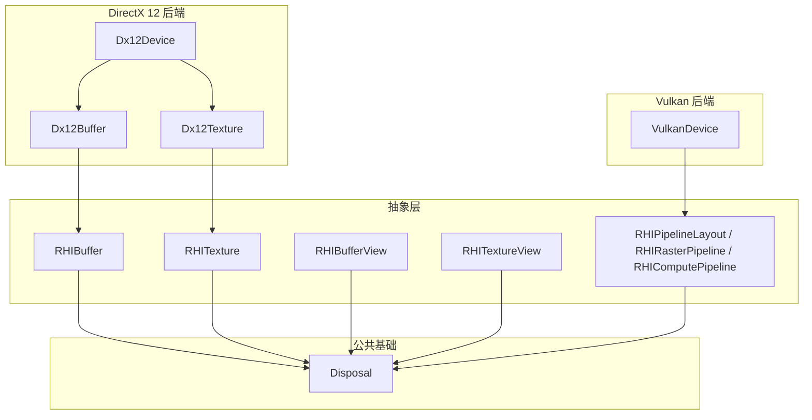
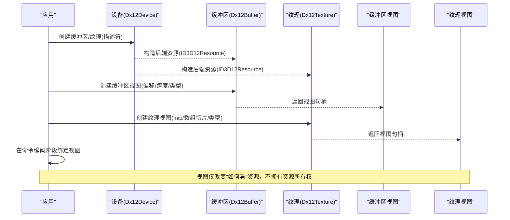
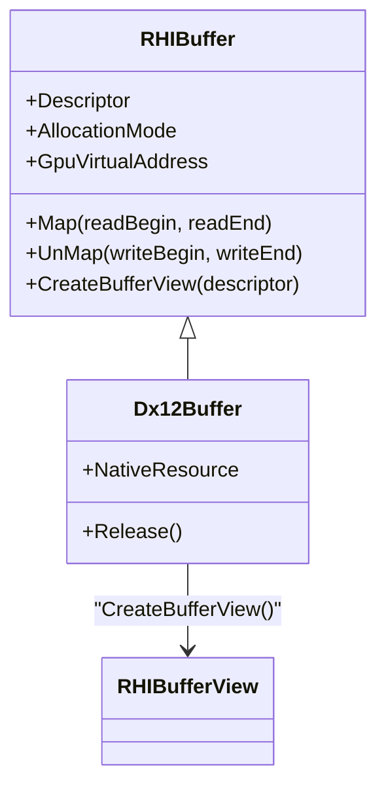
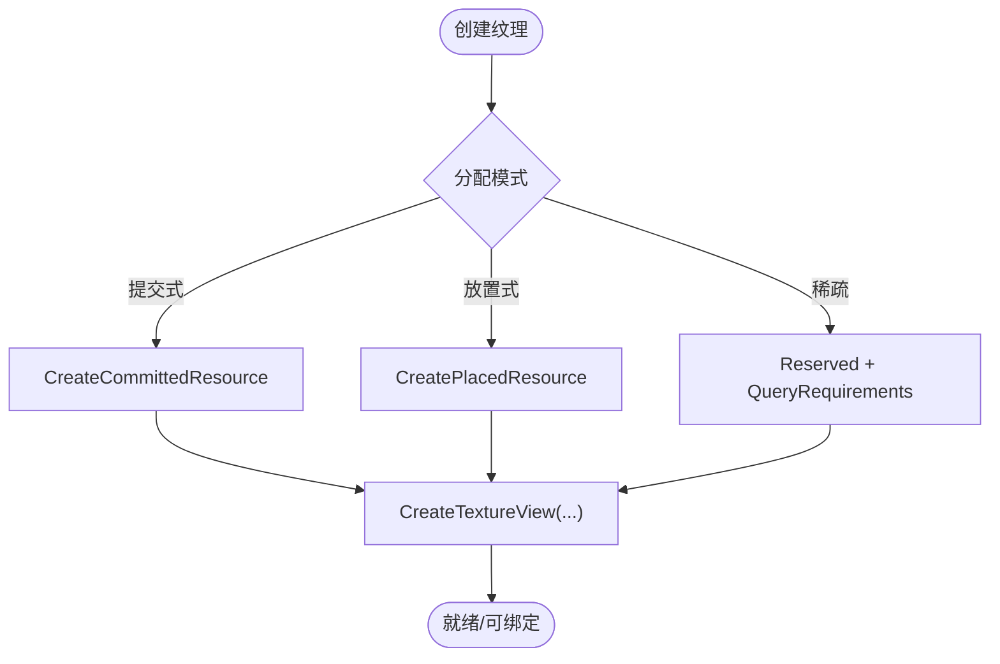
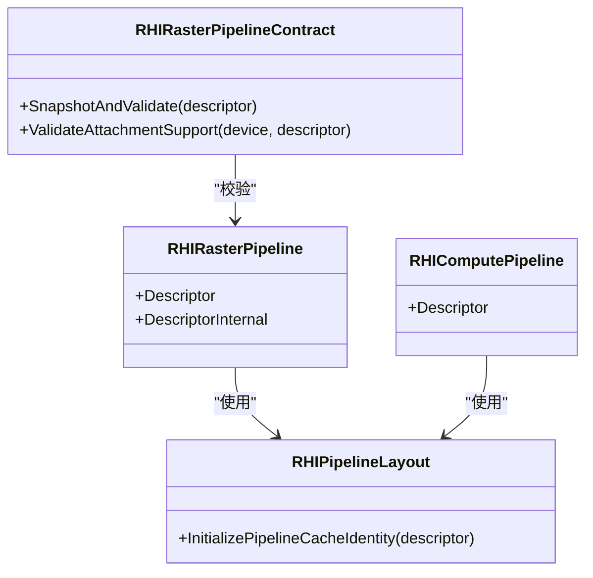
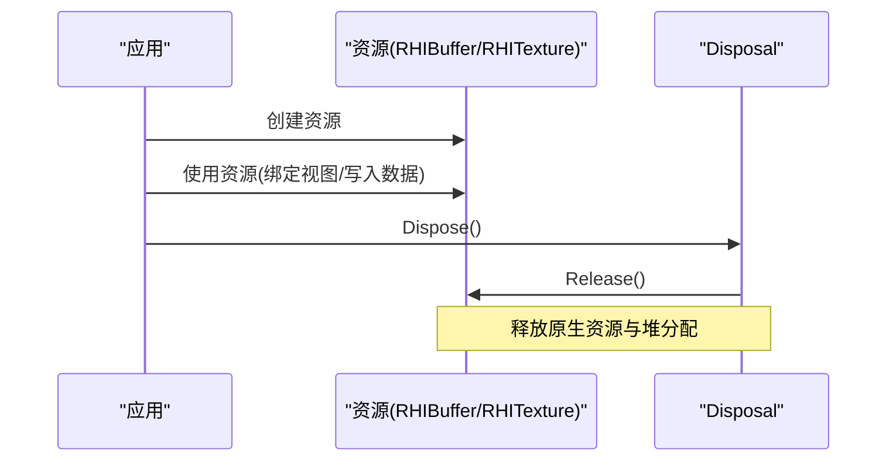
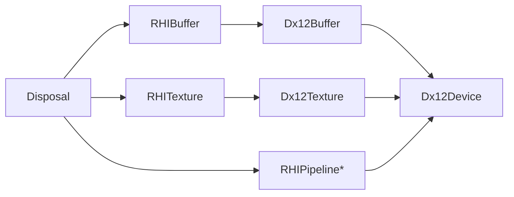

# 资源管理

<cite>
**本文引用的文件**
- [RHIBuffer.cs](file://src/SharpGPU/Abstract/RHIBuffer.cs)
- [RHITexture.cs](file://src/SharpGPU/Abstract/RHITexture.cs)
- [RHIBufferView.cs](file://src/SharpGPU/Abstract/RHIBufferView.cs)
- [RHITextureView.cs](file://src/SharpGPU/Abstract/RHITextureView.cs)
- [RHIPipeline.cs](file://src/SharpGPU/Abstract/RHIPipeline.cs)
- [Disposal.cs](file://src/SharpGPU/Common/Core/Disposal.cs)
- [Dx12Buffer.cs](file://src/SharpGPU/Dx12/Dx12Buffer.cs)
- [Dx12Texture.cs](file://src/SharpGPU/Dx12/Dx12Texture.cs)
- [Dx12Device.cs](file://src/SharpGPU/Dx12/Dx12Device.cs)
- [VulkanDevice.cs](file://src/SharpGPU/Vulkan/VulkanDevice.cs)
</cite>

## 目录
1. [简介](#简介)
2. [项目结构](#项目结构)
3. [核心组件](#核心组件)
4. [架构总览](#架构总览)
5. [详细组件分析](#详细组件分析)
6. [依赖关系分析](#依赖关系分析)
7. [性能考量](#性能考量)
8. [故障排查指南](#故障排查指南)
9. [结论](#结论)
10. [附录](#附录)

## 简介
本文件为 SharpGPU 资源管理系统的综合文档，聚焦于缓冲区、纹理、视图与管线对象等资源的创建、使用、更新与销毁生命周期；阐述资源绑定机制（如何将资源关联到渲染或计算阶段）；解释资源视图的概念与类型；介绍资源缓存与复用策略；说明资源验证与错误检查机制；并提供资源监控与调试工具的使用建议。内容基于抽象接口与各后端实现（以 DirectX 12 为主，并参考 Vulkan 设备能力）进行归纳。

## 项目结构
SharpGPU 采用“抽象接口 + 多后端实现”的分层设计：
- 抽象层（Abstract）：定义统一的资源与管线接口与描述符，如 RHIBuffer、RHITexture、RHIBufferView、RHITextureView、RHIPipelineLayout 等。
- 公共基础（Common/Core）：提供通用基类 Disposal，统一资源生命周期管理与释放钩子。
- 后端实现（Dx12、Vulkan、Metal）：将抽象接口映射到具体平台 API，例如 Dx12Buffer、Dx12Texture、Dx12Device 等。
- 设备与队列（各后端 Device/Queue）：负责命令队列、描述符堆、内存分配策略与特性查询。

图表来源
- [RHIBuffer.cs:14-47](file://src/SharpGPU/Abstract/RHIBuffer.cs#L14-L47)
- [RHITexture.cs:50-139](file://src/SharpGPU/Abstract/RHITexture.cs#L50-L139)
- [RHIBufferView.cs:13-16](file://src/SharpGPU/Abstract/RHIBufferView.cs#L13-L16)
- [RHITextureView.cs:18-21](file://src/SharpGPU/Abstract/RHITextureView.cs#L18-L21)
- [RHIPipeline.cs:21-36](file://src/SharpGPU/Abstract/RHIPipeline.cs#L21-L36)
- [Disposal.cs:7-63](file://src/SharpGPU/Common/Core/Disposal.cs#L7-L63)
- [Dx12Buffer.cs:8-147](file://src/SharpGPU/Dx12/Dx12Buffer.cs#L8-L147)
- [Dx12Texture.cs:7-195](file://src/SharpGPU/Dx12/Dx12Texture.cs#L7-L195)
- [Dx12Device.cs:48-158](file://src/SharpGPU/Dx12/Dx12Device.cs#L48-L158)
- [VulkanDevice.cs:11-191](file://src/SharpGPU/Vulkan/VulkanDevice.cs#L11-L191)

章节来源
- [RHIBuffer.cs:14-47](file://src/SharpGPU/Abstract/RHIBuffer.cs#L14-L47)
- [RHITexture.cs:50-139](file://src/SharpGPU/Abstract/RHITexture.cs#L50-L139)
- [Disposal.cs:7-63](file://src/SharpGPU/Common/Core/Disposal.cs#L7-L63)
- [Dx12Buffer.cs:8-147](file://src/SharpGPU/Dx12/Dx12Buffer.cs#L8-L147)
- [Dx12Texture.cs:7-195](file://src/SharpGPU/Dx12/Dx12Texture.cs#L7-L195)
- [Dx12Device.cs:48-158](file://src/SharpGPU/Dx12/Dx12Device.cs#L48-L158)
- [VulkanDevice.cs:11-191](file://src/SharpGPU/Vulkan/VulkanDevice.cs#L11-L191)

## 核心组件
- 缓冲区（RHIBuffer）：定义缓冲区的描述符（大小、格式、用途、存储模式）、分配模式、GPU 虚拟地址访问（若支持）、CPU 映射/解映射以及创建视图的能力。
- 纹理（RHITexture）：定义纹理描述符（维度、尺寸、像素格式、采样数、存储模式、用途），支持采样反馈贴图（创建时配对采样纹理、反馈模式与 mip 区域），并提供创建纹理视图的接口。
- 视图（RHIBufferView、RHITextureView）：对底层资源的不同视角（偏移、跨度、切片、mip 范围、视图类型）进行封装，用于绑定到着色器或管线阶段。
- 管线（RHIPipelineLayout、RHIRasterPipeline、RHIComputePipeline 等）：定义绑定表布局、推送常量、静态采样器、光栅化/计算/光线追踪管线描述符，并在创建时执行严格的参数校验。

章节来源
- [RHIBuffer.cs:6-47](file://src/SharpGPU/Abstract/RHIBuffer.cs#L6-L47)
- [RHITexture.cs:39-139](file://src/SharpGPU/Abstract/RHITexture.cs#L39-L139)
- [RHIBufferView.cs:5-16](file://src/SharpGPU/Abstract/RHIBufferView.cs#L5-L16)
- [RHITextureView.cs:5-21](file://src/SharpGPU/Abstract/RHITextureView.cs#L5-L21)
- [RHIPipeline.cs:11-36](file://src/SharpGPU/Abstract/RHIPipeline.cs#L11-L36)
- [RHIPipeline.cs:137-264](file://src/SharpGPU/Abstract/RHIPipeline.cs#L137-L264)

## 架构总览
SharpGPU 的资源管理通过抽象接口统一建模，后端实现负责具体资源创建与绑定。设备（如 Dx12Device、VulkanDevice）集中管理命令队列、描述符堆与内存池，提供创建各类资源的入口。视图作为资源的“局部视图”，在绑定阶段由编码器/命令记录器解析为后端特定的描述符或索引。

图表来源
- [Dx12Device.cs:192-196](file://src/SharpGPU/Dx12/Dx12Device.cs#L192-L196)
- [Dx12Buffer.cs:37-86](file://src/SharpGPU/Dx12/Dx12Buffer.cs#L37-L86)
- [Dx12Texture.cs:30-83](file://src/SharpGPU/Dx12/Dx12Texture.cs#L30-L83)
- [RHIBufferView.cs:5-16](file://src/SharpGPU/Abstract/RHIBufferView.cs#L5-L16)
- [RHITextureView.cs:5-21](file://src/SharpGPU/Abstract/RHITextureView.cs#L5-L21)

## 详细组件分析

### 缓冲区（RHIBuffer 与 Dx12Buffer）
- 创建与分配
  - 提交式分配（Committed）：直接创建独立资源对象。
  - 放置式分配（Placed）：从堆中分配偏移位置，提升内存复用率。
  - 外部资源（External）：包装已有原生资源。
- CPU 映射/解映射
  - 对非 GPU Local 存储模式的缓冲区支持 Map/Unmap，传入读写范围并进行边界校验。
- 视图创建
  - 通过 CreateBufferView 生成不同偏移、跨度、类型的视图，供着色器或管线阶段绑定。

图表来源
- [RHIBuffer.cs:14-47](file://src/SharpGPU/Abstract/RHIBuffer.cs#L14-L47)
- [Dx12Buffer.cs:8-147](file://src/SharpGPU/Dx12/Dx12Buffer.cs#L8-L147)
- [RHIBufferView.cs:5-16](file://src/SharpGPU/Abstract/RHIBufferView.cs#L5-L16)

章节来源
- [RHIBuffer.cs:6-47](file://src/SharpGPU/Abstract/RHIBuffer.cs#L6-L47)
- [Dx12Buffer.cs:37-147](file://src/SharpGPU/Dx12/Dx12Buffer.cs#L37-L147)

### 纹理（RHITexture 与 Dx12Texture）
- 创建与分配
  - 提交式、放置式与稀疏纹理（Sparse）三种分配模式。
  - 支持采样反馈贴图：创建时绑定采样纹理、反馈模式与 mip 区域。
- 视图创建
  - 通过 CreateTextureView 指定 mip 数量、起始级别、数组切片数量与起始切片、视图类型等。
- 格式与用途
  - 纹理描述符包含维度、尺寸、像素格式、采样数、存储模式与用途标志。
  - 提供判断采样反馈不透明格式的静态方法。

图表来源
- [Dx12Texture.cs:30-116](file://src/SharpGPU/Dx12/Dx12Texture.cs#L30-L116)
- [RHITexture.cs:39-139](file://src/SharpGPU/Abstract/RHITexture.cs#L39-L139)

章节来源
- [RHITexture.cs:39-139](file://src/SharpGPU/Abstract/RHITexture.cs#L39-L139)
- [Dx12Texture.cs:30-195](file://src/SharpGPU/Dx12/Dx12Texture.cs#L30-L195)

### 视图（RHIBufferView、RHITextureView）
- 缓冲区视图
  - 描述符包含计数、偏移、步长与视图类型，用于将缓冲区片段暴露给着色器或管线。
- 纹理视图
  - 描述符包含 mip 数量、起始级别、数组切片数量与起始切片、视图类型等，用于限定可见的子资源范围。
- 绑定语义
  - 视图本身不拥有资源，仅改变“如何读取/写入”资源的方式；在命令编码阶段绑定到相应阶段（如 CBV/SRV/UAV/RTV/DSV）。

章节来源
- [RHIBufferView.cs:5-16](file://src/SharpGPU/Abstract/RHIBufferView.cs#L5-L16)
- [RHITextureView.cs:5-21](file://src/SharpGPU/Abstract/RHITextureView.cs#L5-L21)

### 管线对象（RHIPipelineLayout、RHIRasterPipeline、RHIComputePipeline）
- 管线布局
  - 定义本地签名、顶点布局启用、推送常量大小、绑定表布局与静态采样器。
  - 为管线缓存生成唯一标识（基于布局描述）。
- 光栅化管线
  - 描述输出状态、混合、光栅化、深度模板状态、原语装配器（顶点/网格着色）等。
  - 创建前进行严格校验：颜色格式、深度/模板格式、双源混合、附件 ABI 兼容性等。
- 计算管线
  - 线程组大小、计算函数、管线布局。

图表来源
- [RHIPipeline.cs:11-36](file://src/SharpGPU/Abstract/RHIPipeline.cs#L11-L36)
- [RHIPipeline.cs:240-264](file://src/SharpGPU/Abstract/RHIPipeline.cs#L240-L264)
- [RHIPipeline.cs:266-725](file://src/SharpGPU/Abstract/RHIPipeline.cs#L266-L725)

章节来源
- [RHIPipeline.cs:11-36](file://src/SharpGPU/Abstract/RHIPipeline.cs#L11-L36)
- [RHIPipeline.cs:137-264](file://src/SharpGPU/Abstract/RHIPipeline.cs#L137-L264)
- [RHIPipeline.cs:266-725](file://src/SharpGPU/Abstract/RHIPipeline.cs#L266-L725)

### 生命周期管理（创建、使用、更新、销毁）
- 创建
  - 通过设备接口创建资源对象（缓冲区/纹理/管线），后端根据描述符构建原生资源。
- 使用
  - 在命令编码阶段将视图绑定到相应阶段（渲染/计算/光线追踪）。
- 更新
  - 缓冲区可通过 Map/Unmap 进行 CPU 侧数据更新；纹理通常通过命令拷贝或着色器写入更新。
- 销毁
  - 所有资源继承自 Disposal，调用 Dispose 触发 Release 钩子释放原生资源与堆分配。

图表来源
- [Disposal.cs:7-63](file://src/SharpGPU/Common/Core/Disposal.cs#L7-L63)
- [Dx12Buffer.cs:141-147](file://src/SharpGPU/Dx12/Dx12Buffer.cs#L141-L147)
- [Dx12Texture.cs:188-195](file://src/SharpGPU/Dx12/Dx12Texture.cs#L188-L195)

章节来源
- [Disposal.cs:7-63](file://src/SharpGPU/Common/Core/Disposal.cs#L7-L63)
- [Dx12Buffer.cs:141-147](file://src/SharpGPU/Dx12/Dx12Buffer.cs#L141-L147)
- [Dx12Texture.cs:188-195](file://src/SharpGPU/Dx12/Dx12Texture.cs#L188-L195)

### 资源绑定机制
- 视图绑定
  - 缓冲区视图与纹理视图在命令编码阶段被解析为后端描述符（如 DX12 的 CBV/SRV/UAV/RTV/DSV）并绑定到对应阶段。
- 管线绑定
  - 管线布局定义绑定表布局与静态采样器；光栅化/计算管线在启动前需绑定相应的资源视图。
- 设备级描述符管理
  - 设备维护描述符堆与暂存池，优化批量分配与复用。

章节来源
- [Dx12Device.cs:48-158](file://src/SharpGPU/Dx12/Dx12Device.cs#L48-L158)
- [RHIPipeline.cs:11-36](file://src/SharpGPU/Abstract/RHIPipeline.cs#L11-L36)

### 资源视图概念与类型
- 缓冲区视图
  - 通过偏移、跨度、步长与视图类型定义缓冲区的不同片段。
- 纹理视图
  - 通过 mip 范围、数组切片与视图类型定义纹理的不同子资源。
- 用途
  - 同一资源可创建多个视图，分别用于只读、写入、渲染目标等不同用途。

章节来源
- [RHIBufferView.cs:5-16](file://src/SharpGPU/Abstract/RHIBufferView.cs#L5-L16)
- [RHITextureView.cs:5-21](file://src/SharpGPU/Abstract/RHITextureView.cs#L5-L21)

### 资源缓存与复用策略
- 管线布局缓存标识
  - 基于布局描述生成唯一标识，便于管线缓存命中与复用。
- 内存分配模式
  - 优先使用放置式分配复用堆内存；外部资源包装避免重复分配。
- 描述符池与堆
  - 设备维护描述符池与堆，减少频繁分配开销。

章节来源
- [RHIPipeline.cs:21-36](file://src/SharpGPU/Abstract/RHIPipeline.cs#L21-L36)
- [Dx12Buffer.cs:60-86](file://src/SharpGPU/Dx12/Dx12Buffer.cs#L60-L86)
- [Dx12Texture.cs:57-83](file://src/SharpGPU/Dx12/Dx12Texture.cs#L57-L83)
- [Dx12Device.cs:48-158](file://src/SharpGPU/Dx12/Dx12Device.cs#L48-L158)

### 资源验证与错误检查
- 管线参数校验
  - 颜色/深度/模板格式合法性、采样数限制、混合模式兼容性、附件 ABI 一致性等。
- 运行时检查
  - 资源已释放访问抛出对象已释放异常；无效范围映射抛出参数异常；不支持功能抛出未支持异常。
- 设备能力查询
  - 通过设备能力决定可用特性（如增强屏障、原生渲染通道等）。

章节来源
- [RHIPipeline.cs:266-725](file://src/SharpGPU/Abstract/RHIPipeline.cs#L266-L725)
- [Disposal.cs:33-39](file://src/SharpGPU/Common/Core/Disposal.cs#L33-L39)
- [Dx12Buffer.cs:99-133](file://src/SharpGPU/Dx12/Dx12Buffer.cs#L99-L133)
- [Dx12Device.cs:109-110](file://src/SharpGPU/Dx12/Dx12Device.cs#L109-L110)

### 资源监控与调试工具
- 调试信息
  - 设备名称、驱动版本、适配器身份等信息可用于日志与诊断。
- 异常与原因
  - 资源创建失败时携带设备移除原因与 HRESULT，便于定位问题。
- 建议
  - 结合平台调试器（如 PIX、RenderDoc）与日志输出，观察资源生命周期与绑定状态。

章节来源
- [Dx12Device.cs:160-178](file://src/SharpGPU/Dx12/Dx12Device.cs#L160-L178)
- [Dx12Texture.cs:47-52](file://src/SharpGPU/Dx12/Dx12Texture.cs#L47-L52)
- [Dx12Texture.cs:168-173](file://src/SharpGPU/Dx12/Dx12Texture.cs#L168-L173)

## 依赖关系分析
- 抽象层依赖公共基础 Disposal，确保所有资源具备一致的生命周期管理。
- 后端实现依赖各自设备（Dx12Device/VulkanDevice）获取原生 API 与能力。
- 管线对象依赖管线布局与函数库，形成稳定的绑定契约。

图表来源
- [Disposal.cs:7-63](file://src/SharpGPU/Common/Core/Disposal.cs#L7-L63)
- [RHIBuffer.cs:14-47](file://src/SharpGPU/Abstract/RHIBuffer.cs#L14-L47)
- [RHITexture.cs:50-139](file://src/SharpGPU/Abstract/RHITexture.cs#L50-L139)
- [RHIPipeline.cs:21-36](file://src/SharpGPU/Abstract/RHIPipeline.cs#L21-L36)
- [Dx12Buffer.cs:8-147](file://src/SharpGPU/Dx12/Dx12Buffer.cs#L8-L147)
- [Dx12Texture.cs:7-195](file://src/SharpGPU/Dx12/Dx12Texture.cs#L7-L195)
- [Dx12Device.cs:48-158](file://src/SharpGPU/Dx12/Dx12Device.cs#L48-L158)

章节来源
- [Disposal.cs:7-63](file://src/SharpGPU/Common/Core/Disposal.cs#L7-L63)
- [RHIBuffer.cs:14-47](file://src/SharpGPU/Abstract/RHIBuffer.cs#L14-L47)
- [RHITexture.cs:50-139](file://src/SharpGPU/Abstract/RHITexture.cs#L50-L139)
- [RHIPipeline.cs:21-36](file://src/SharpGPU/Abstract/RHIPipeline.cs#L21-L36)
- [Dx12Buffer.cs:8-147](file://src/SharpGPU/Dx12/Dx12Buffer.cs#L8-L147)
- [Dx12Texture.cs:7-195](file://src/SharpGPU/Dx12/Dx12Texture.cs#L7-L195)
- [Dx12Device.cs:48-158](file://src/SharpGPU/Dx12/Dx12Device.cs#L48-L158)

## 性能考量
- 优先使用放置式分配与堆复用，减少频繁分配与碎片化。
- 合理使用视图，避免为相同资源创建过多冗余视图。
- 利用管线布局缓存标识提高管线编译命中率。
- 在命令编码阶段批量绑定视图，降低切换成本。
- 对于高频更新的缓冲区，考虑使用上传缓冲区或映射范围更新以减少同步开销。

[本节为通用指导，无需特定文件引用]

## 故障排查指南
- 资源已释放访问
  - 现象：访问已释放资源抛出对象已释放异常。
  - 处理：确保在资源生命周期内使用，或在释放后不再引用。
- 缓冲区映射范围非法
  - 现象：Map/Unmap 传入范围越界抛出参数异常。
  - 处理：校验读写范围不超过缓冲区大小，并确保顺序正确。
- 纹理创建失败
  - 现象：创建纹理失败并附带设备移除原因与 HRESULT。
  - 处理：检查设备状态、格式与用途是否受支持，必要时降级配置。
- 管线参数不合法
  - 现象：创建光栅化管线时抛出参数异常或未支持异常。
  - 处理：依据校验规则修正颜色/深度/模板格式、混合模式与附件 ABI。

章节来源
- [Disposal.cs:33-39](file://src/SharpGPU/Common/Core/Disposal.cs#L33-L39)
- [Dx12Buffer.cs:99-133](file://src/SharpGPU/Dx12/Dx12Buffer.cs#L99-L133)
- [Dx12Texture.cs:47-52](file://src/SharpGPU/Dx12/Dx12Texture.cs#L47-L52)
- [RHIPipeline.cs:266-725](file://src/SharpGPU/Abstract/RHIPipeline.cs#L266-L725)

## 结论
SharpGPU 的资源管理系统通过抽象接口统一建模，结合后端实现提供高效的资源创建、视图绑定与生命周期管理。通过严格的参数校验、合理的分配策略与描述符管理，系统在跨后端环境下保持了良好的可移植性与性能。建议在应用中遵循视图最小化、批量绑定与缓存复用的最佳实践，以获得更优的资源使用效率。

[本节为总结性内容，无需特定文件引用]

## 附录
- 术语
  - 视图：对资源的局部视角，不拥有资源所有权。
  - 管线布局：定义资源绑定方式与常量布局。
  - 分配模式：提交式、放置式、稀疏、外部。
- 参考路径
  - 缓冲区与纹理抽象：见 Abstract 目录下的 RHIBuffer.cs、RHITexture.cs。
  - 视图抽象：见 RHIBufferView.cs、RHITextureView.cs。
  - 管线抽象：见 RHIPipeline.cs。
  - 生命周期基类：见 Common/Core/Disposal.cs。
  - 后端实现：见 Dx12 与 Vulkan 目录下的对应 Device 与资源实现。

[本节为补充信息，无需特定文件引用]