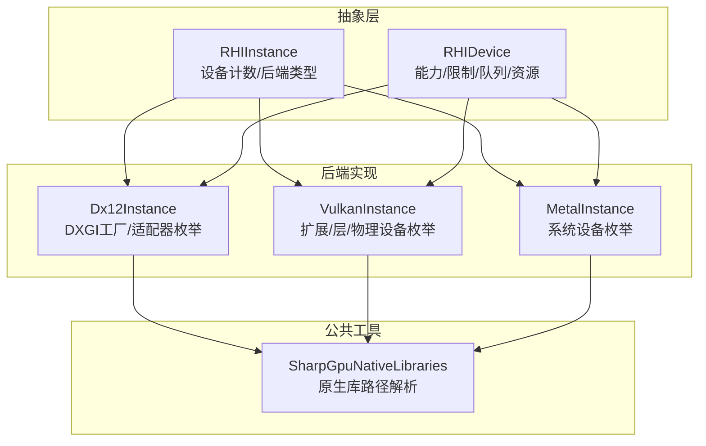
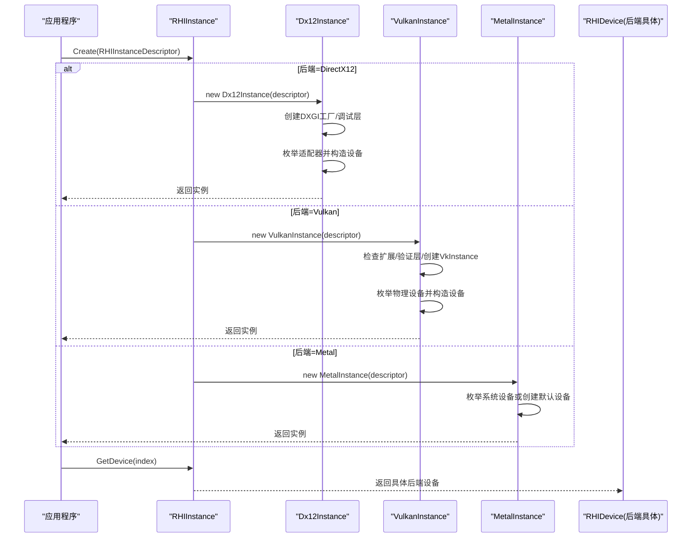
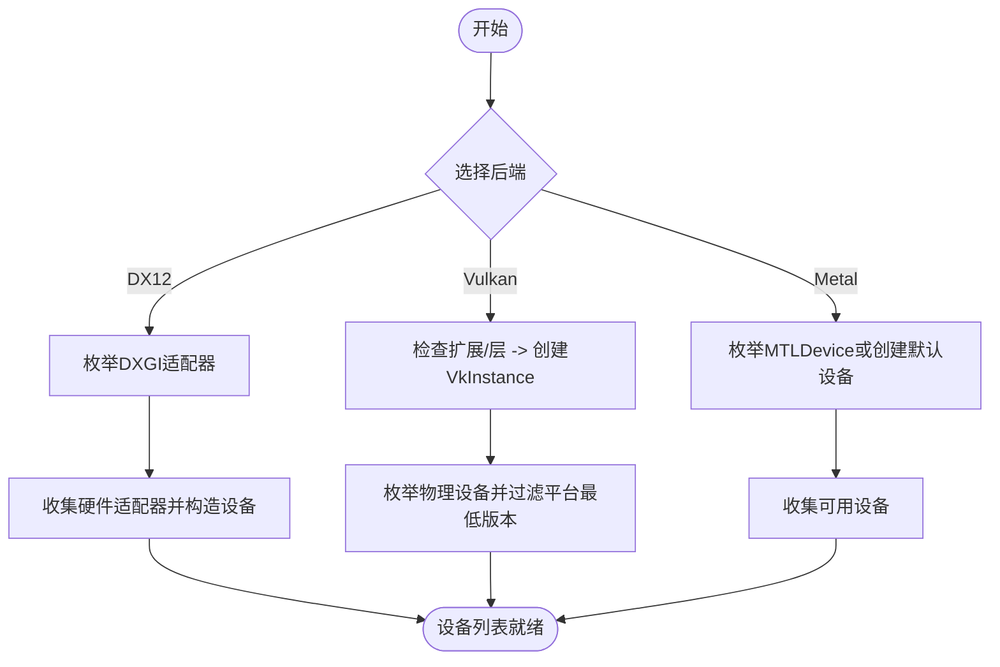
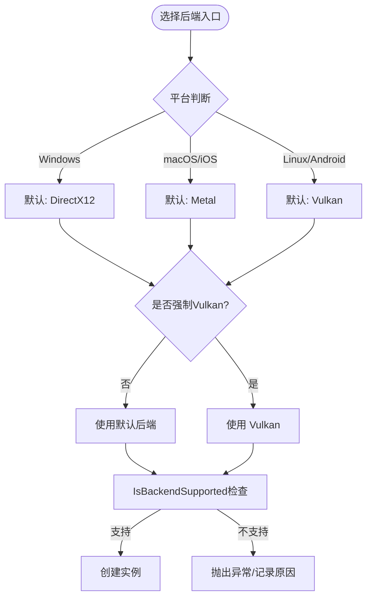
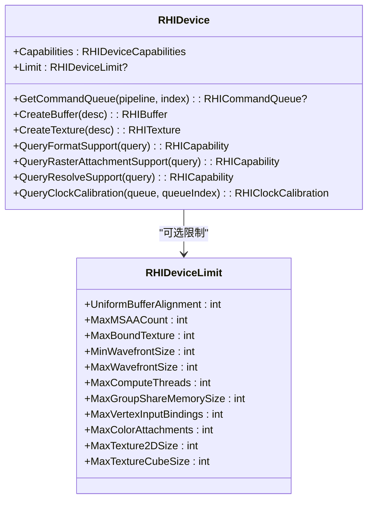
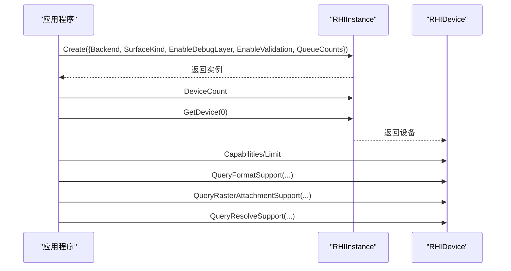
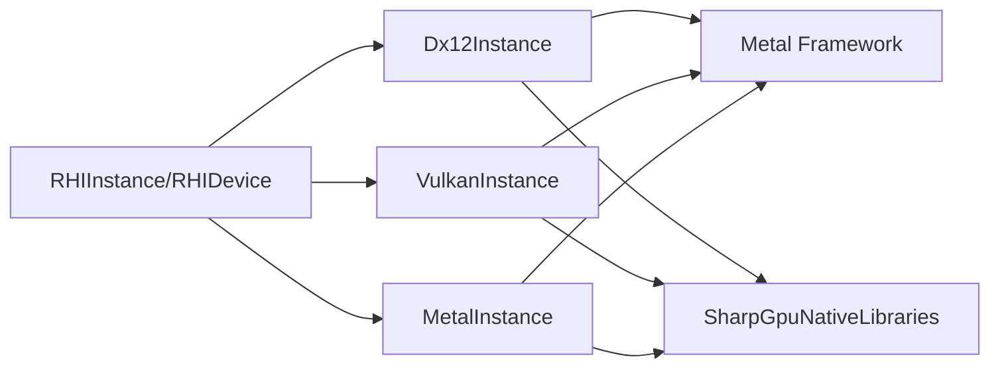

# 跨平台GPU抽象

<cite>
**本文引用的文件**
- [RHIInstance.cs](file://src/SharpGPU/Abstract/RHIInstance.cs)
- [RHIDevice.cs](file://src/SharpGPU/Abstract/RHIDevice.cs)
- [Dx12Instance.cs](file://src/SharpGPU/Dx12/Dx12Instance.cs)
- [VulkanInstance.cs](file://src/SharpGPU/Vulkan/VulkanInstance.cs)
- [MetalInstance.cs](file://src/SharpGPU/Metal/MetalInstance.cs)
- [SharpGpuNativeLibraries.cs](file://src/SharpGPU/Common/SharpGpuNativeLibraries.cs)
- [Program.cs](file://samples/ComputeAndDraw/Program.cs)
- [ComputeWorkload.cs](file://samples/ComputeAndDraw/ComputeWorkload.cs)
- [RasterWorkload.cs](file://samples/ComputeAndDraw/RasterWorkload.cs)
</cite>

## 目录
1. [简介](#简介)
2. [项目结构](#项目结构)
3. [核心组件](#核心组件)
4. [架构总览](#架构总览)
5. [详细组件分析](#详细组件分析)
6. [依赖关系分析](#依赖关系分析)
7. [性能考量](#性能考量)
8. [故障排查指南](#故障排查指南)
9. [结论](#结论)
10. [附录](#附录)

## 简介
本章节概述 SharpGPU 的跨平台 GPU 抽象目标与能力：通过统一的 RHI（渲染硬件接口）抽象层屏蔽 DirectX 12、Vulkan、Metal 等后端 API 的差异，提供一致的编程接口；在运行时检测可用设备与能力，按平台与兼容性策略选择并创建后端实例；并提供示例展示如何创建实例、枚举设备与查询能力。

## 项目结构
SharpGPU 采用“抽象 + 多后端实现”的分层组织方式：
- 抽象层（Abstract）：定义统一的 RHI 类型与生命周期管理，如实例、设备、命令队列、资源、管线等。
- 后端实现（Dx12 / Vulkan / Metal）：分别封装各平台的原生 API，完成设备枚举、能力探测、资源创建与命令编码。
- 公共工具（Common）：提供原生库定位、内存与集合工具等。
- 示例（samples）：演示跨后端计算与光栅化流程。

图表来源
- [RHIInstance.cs:46-156](file://src/SharpGPU/Abstract/RHIInstance.cs#L46-L156)
- [Dx12Instance.cs:8-131](file://src/SharpGPU/Dx12/Dx12Instance.cs#L8-L131)
- [VulkanInstance.cs:9-680](file://src/SharpGPU/Vulkan/VulkanInstance.cs#L9-L680)
- [MetalInstance.cs:9-77](file://src/SharpGPU/Metal/MetalInstance.cs#L9-L77)
- [SharpGpuNativeLibraries.cs:7-73](file://src/SharpGPU/Common/SharpGpuNativeLibraries.cs#L7-L73)

章节来源
- [RHIInstance.cs:46-156](file://src/SharpGPU/Abstract/RHIInstance.cs#L46-L156)
- [RHIDevice.cs:422-601](file://src/SharpGPU/Abstract/RHIDevice.cs#L422-L601)

## 核心组件
- RHIInstance：抽象实例，负责后端选择、平台支持检查、设备枚举与访问。
- RHIDevice：抽象设备，暴露统一的能力、限制、队列与资源创建接口，并处理设备丢失诊断。
- 后端实例：Dx12Instance、VulkanInstance、MetalInstance，分别实现具体后端的初始化与设备发现。
- 原生库定位：SharpGpuNativeLibraries，用于配置和解析 DirectML、DirectStorage、PIX 等原生运行时路径。

章节来源
- [RHIInstance.cs:6-156](file://src/SharpGPU/Abstract/RHIInstance.cs#L6-L156)
- [RHIDevice.cs:9-800](file://src/SharpGPU/Abstract/RHIDevice.cs#L9-L800)
- [Dx12Instance.cs:8-131](file://src/SharpGPU/Dx12/Dx12Instance.cs#L8-L131)
- [VulkanInstance.cs:9-680](file://src/SharpGPU/Vulkan/VulkanInstance.cs#L9-L680)
- [MetalInstance.cs:9-77](file://src/SharpGPU/Metal/MetalInstance.cs#L9-L77)
- [SharpGpuNativeLibraries.cs:7-73](file://src/SharpGPU/Common/SharpGpuNativeLibraries.cs#L7-L73)

## 架构总览
SharpGPU 通过 RHIInstance.Create 根据描述符创建具体后端实例，并在每个后端内部完成设备枚举与能力探测。设备对象提供统一的队列、资源与查询接口，上层应用无需感知后端差异。

图表来源
- [RHIInstance.cs:122-156](file://src/SharpGPU/Abstract/RHIInstance.cs#L122-L156)
- [Dx12Instance.cs:20-131](file://src/SharpGPU/Dx12/Dx12Instance.cs#L20-L131)
- [VulkanInstance.cs:74-418](file://src/SharpGPU/Vulkan/VulkanInstance.cs#L74-L418)
- [MetalInstance.cs:16-54](file://src/SharpGPU/Metal/MetalInstance.cs#L16-L54)

## 详细组件分析

### 运行时设备检测机制
- DirectX 12：通过 DXGI 工厂枚举适配器，跳过软件适配器，为每个硬件适配器创建设备对象。
- Vulkan：先加载全局函数指针，检查实例级扩展与验证层，创建 VkInstance，再枚举物理设备并按平台最低版本过滤（如 Android 要求 Vulkan 1.1+）。
- Metal：枚举系统所有 MTLDevice，若无则尝试创建默认设备；确保至少有一个可用设备。

图表来源
- [Dx12Instance.cs:78-106](file://src/SharpGPU/Dx12/Dx12Instance.cs#L78-L106)
- [VulkanInstance.cs:127-418](file://src/SharpGPU/Vulkan/VulkanInstance.cs#L127-L418)
- [MetalInstance.cs:16-54](file://src/SharpGPU/Metal/MetalInstance.cs#L16-L54)

章节来源
- [Dx12Instance.cs:78-131](file://src/SharpGPU/Dx12/Dx12Instance.cs#L78-L131)
- [VulkanInstance.cs:127-418](file://src/SharpGPU/Vulkan/VulkanInstance.cs#L127-L418)
- [MetalInstance.cs:16-54](file://src/SharpGPU/Metal/MetalInstance.cs#L16-L54)

### 后端选择策略（优先级、兼容性检查与回退）
- 平台优先：Windows 默认 DirectX 12；macOS/iOS 默认 Metal；Linux/Android 默认 Vulkan。可通过参数强制使用 Vulkan。
- 平台支持检查：IsBackendSupported 会基于当前操作系统判断后端是否可用，并给出原因。
- 构建期开关：DirectX12 后端可能因编译宏未启用而被禁用，此时创建将抛出异常。
- 回退机制：示例代码遍历多个后端并仅运行可用的后端；若某后端不可用，可尝试其他后端。

图表来源
- [RHIInstance.cs:59-120](file://src/SharpGPU/Abstract/RHIInstance.cs#L59-L120)
- [RHIInstance.cs:122-156](file://src/SharpGPU/Abstract/RHIInstance.cs#L122-L156)

章节来源
- [RHIInstance.cs:59-120](file://src/SharpGPU/Abstract/RHIInstance.cs#L59-L120)
- [RHIInstance.cs:122-156](file://src/SharpGPU/Abstract/RHIInstance.cs#L122-L156)

### 设备能力查询与限制
- 设备能力与限制：RHIDevice 暴露 Capabilities 与 Limit，涵盖波前大小、最大线程数、纹理尺寸、MSAA 数量、绑定纹理数量等。
- 格式支持查询：QueryFormatSupport 针对精确的像素格式、用途、维度、采样数与排列组合返回正交操作掩码。
- 光栅附件支持：QueryRasterAttachmentSupport 用于查询特定颜色附件、采样数与混合状态组合是否可直接表达。
- 解析支持：QueryResolveSupport 用于查询 MSAA 源到单样本目标的解析组合是否受支持。
- 时钟校准：QueryClockCalibration 提供原生 GPU/CPU 时钟校准，需同步能力支持。

图表来源
- [RHIDevice.cs:9-56](file://src/SharpGPU/Abstract/RHIDevice.cs#L9-L56)
- [RHIDevice.cs:422-601](file://src/SharpGPU/Abstract/RHIDevice.cs#L422-L601)

章节来源
- [RHIDevice.cs:9-800](file://src/SharpGPU/Abstract/RHIDevice.cs#L9-L800)

### 示例：创建实例、枚举设备与查询能力
- 创建实例：使用 RHIInstance.Create 传入 RHIInstanceDescriptor，指定后端、表面类型、调试与验证选项以及队列请求数。
- 枚举设备：通过 instance.DeviceCount 与 instance.GetDevice(index) 获取设备。
- 查询能力：使用 device.Capabilities 与 Limit 进行能力与限制检查；使用 Query* 系列方法做更细粒度的支持查询。
- 示例参考：ComputeWorkload 与 RasterWorkload 展示了跨后端执行计算与光栅化流程。

图表来源
- [ComputeWorkload.cs:45-59](file://samples/ComputeAndDraw/ComputeWorkload.cs#L45-L59)
- [RasterWorkload.cs:37-48](file://samples/ComputeAndDraw/RasterWorkload.cs#L37-L48)
- [RHIDevice.cs:527-601](file://src/SharpGPU/Abstract/RHIDevice.cs#L527-L601)

章节来源
- [ComputeWorkload.cs:45-59](file://samples/ComputeAndDraw/ComputeWorkload.cs#L45-L59)
- [RasterWorkload.cs:37-48](file://samples/ComputeAndDraw/RasterWorkload.cs#L37-L48)
- [Program.cs:7-15](file://samples/ComputeAndDraw/Program.cs#L7-L15)

### 平台特性与限制
- Windows：首选 DirectX 12；需要 D3D12 Agility SDK 运行时存在；调试层与验证层可按需启用。
- macOS/iOS：首选 Metal；无头模式或窗口系统集成由后端处理。
- Linux/Android：首选 Vulkan；Android 要求 Vulkan 1.1+；需安装验证层以启用验证。
- 通用：后端支持检查失败时，应记录原因并尝试其他后端或提示用户环境缺失。

章节来源
- [Dx12Instance.cs:26-76](file://src/SharpGPU/Dx12/Dx12Instance.cs#L26-L76)
- [Dx12Instance.cs:165-232](file://src/SharpGPU/Dx12/Dx12Instance.cs#L165-L232)
- [VulkanInstance.cs:127-230](file://src/SharpGPU/Vulkan/VulkanInstance.cs#L127-L230)
- [VulkanInstance.cs:382-418](file://src/SharpGPU/Vulkan/VulkanInstance.cs#L382-L418)
- [MetalInstance.cs:16-54](file://src/SharpGPU/Metal/MetalInstance.cs#L16-L54)

## 依赖关系分析
- 抽象层对后端实现解耦：通过 RHIInstance 静态工厂与虚接口隔离平台差异。
- 后端对原生库的依赖：
  - DirectX 12：依赖 DXGI/D3D12 Agility SDK。
  - Vulkan：动态加载 vulkan-1 或平台变体，按需加载扩展与验证层。
  - Metal：依赖系统 Metal 框架。
- 原生库路径解析：SharpGpuNativeLibraries 提供 DirectML、DirectStorage、PIX 的路径配置与冻结机制。

图表来源
- [RHIInstance.cs:122-156](file://src/SharpGPU/Abstract/RHIInstance.cs#L122-L156)
- [Dx12Instance.cs:134-232](file://src/SharpGPU/Dx12/Dx12Instance.cs#L134-L232)
- [VulkanInstance.cs:519-576](file://src/SharpGPU/Vulkan/VulkanInstance.cs#L519-L576)
- [SharpGpuNativeLibraries.cs:16-57](file://src/SharpGPU/Common/SharpGpuNativeLibraries.cs#L16-L57)

章节来源
- [SharpGpuNativeLibraries.cs:16-57](file://src/SharpGPU/Common/SharpGpuNativeLibraries.cs#L16-L57)

## 性能考量
- 队列请求数：在实例描述中合理设置 Compute/Transfer/Graphics 队列请求数，避免过度分配或不足。
- 能力前置检查：在创建资源前使用 Query* 系列方法进行能力检查，减少运行时回退与错误路径。
- 验证层与调试层：仅在开发阶段启用，生产环境关闭以降低开销。
- 原生库加载：Vulkan 动态加载与 DX12 Agility SDK 初始化应在应用启动早期完成，避免重复开销。

[本节为通用指导，不直接分析具体文件]

## 故障排查指南
- 后端不可用：检查 IsBackendSupported 返回的原因；确认平台与驱动满足要求。
- DirectX 12 调试层不可用：确认 D3D12 Agility SDK 已正确部署且路径包含 D3D12Core.dll。
- Vulkan 验证层缺失：安装并注入 VK_LAYER_KHRONOS_validation；确保实例扩展 VK_EXT_debug_utils 可用。
- 设备丢失：通过 RHIDevice 的设备丢失诊断捕获并处理，必要时重建设备与资源。
- 原生库路径：使用 SharpGpuNativeLibraries.Configure 配置 DirectML/DirectStorage/PIX 目录，首次运行时将被冻结。

章节来源
- [RHIInstance.cs:59-93](file://src/SharpGPU/Abstract/RHIInstance.cs#L59-L93)
- [Dx12Instance.cs:26-76](file://src/SharpGPU/Dx12/Dx12Instance.cs#L26-L76)
- [VulkanInstance.cs:183-230](file://src/SharpGPU/Vulkan/VulkanInstance.cs#L183-L230)
- [RHIDevice.cs:465-525](file://src/SharpGPU/Abstract/RHIDevice.cs#L465-L525)
- [SharpGpuNativeLibraries.cs:16-57](file://src/SharpGPU/Common/SharpGpuNativeLibraries.cs#L16-L57)

## 结论
SharpGPU 通过统一的 RHI 抽象层屏蔽了 DirectX 12、Vulkan 与 Metal 的差异，提供了稳定的跨平台 GPU 编程接口。其运行时设备检测与能力查询机制确保了在不同平台与驱动上的健壮性；后端选择策略结合平台优先与兼容性检查，使应用能够自动适配最优后端并在不可用时回退。开发者只需关注抽象接口，即可在多平台上获得一致的性能与功能体验。

## 附录
- 快速开始建议：
  - 在应用启动时调用 IsBackendSupported 检查可用后端。
  - 使用 RHIInstance.Create 创建实例，并通过 DeviceCount 与 GetDevice 枚举设备。
  - 使用 RHIDevice.Capabilities 与 Limit 进行能力与限制检查。
  - 使用 Query* 系列方法进行细粒度支持查询后再创建资源。
  - 在开发阶段启用验证层与调试层，在生产环境关闭以提升性能。

[本节为补充说明，不直接分析具体文件]