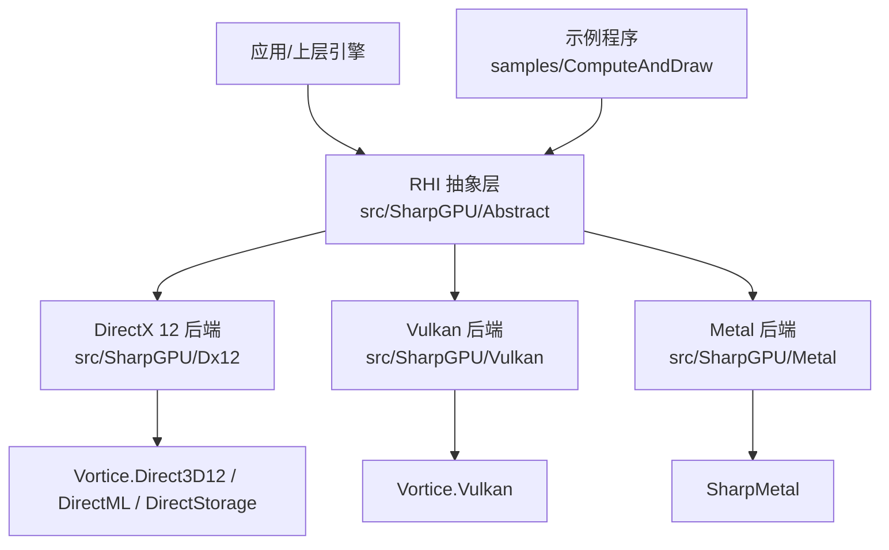
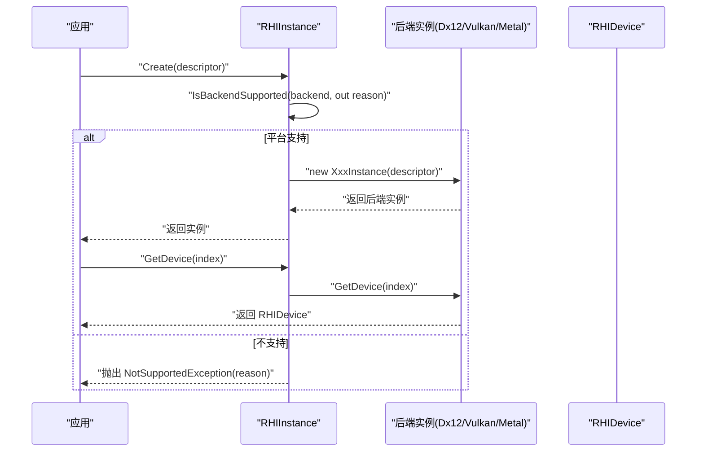
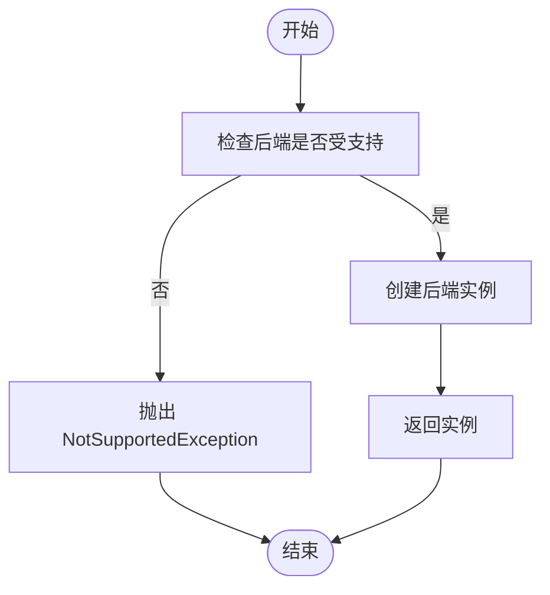
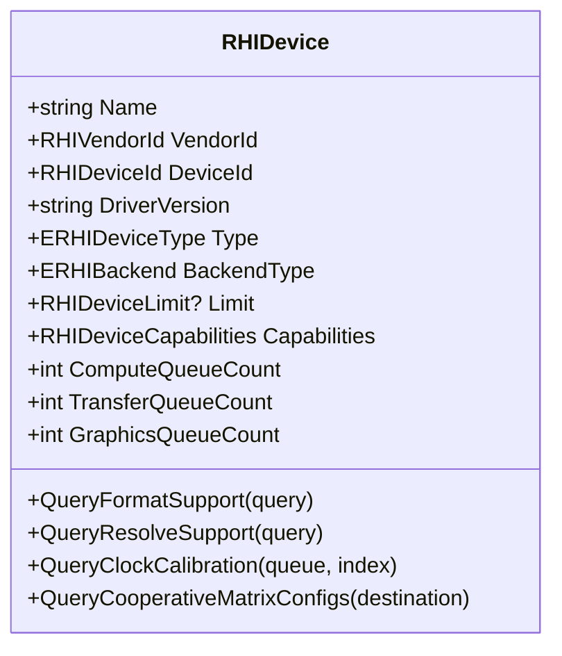
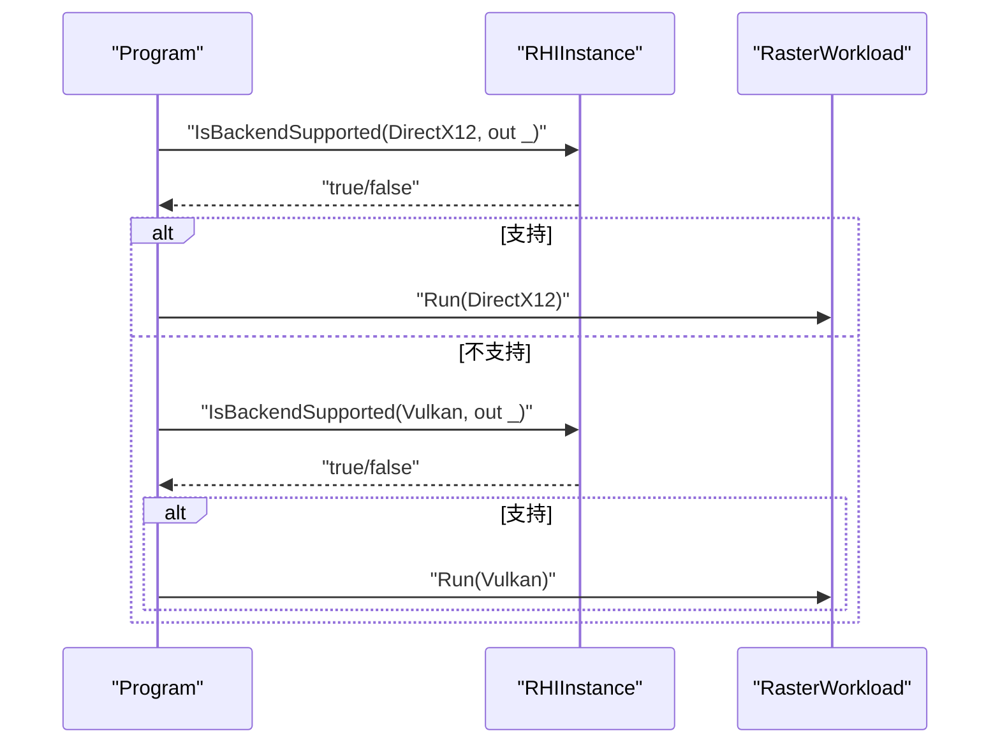
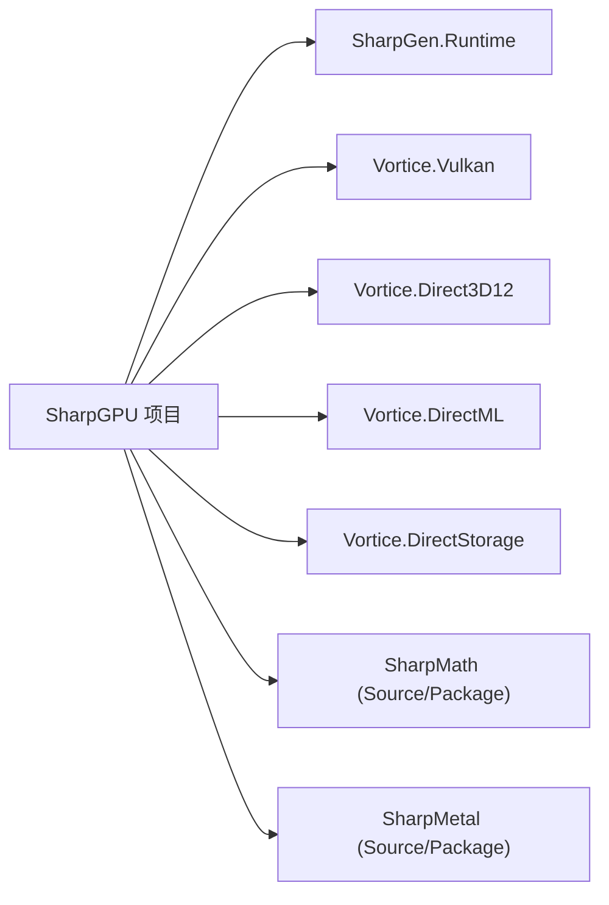

# 项目介绍与目标

<cite>
**本文引用的文件**
- [README.md](file://README.md)
- [README.en.md](file://README.en.md)
- [src/SharpGPU/SharpGPU.csproj](file://src/SharpGPU/SharpGPU.csproj)
- [docs/SharpGPU/PackageReadme.md](file://docs/SharpGPU/PackageReadme.md)
- [docs/SharpGPU/QuickStart.md](file://docs/SharpGPU/QuickStart.md)
- [src/SharpGPU/Abstract/RHIInstance.cs](file://src/SharpGPU/Abstract/RHIInstance.cs)
- [src/SharpGPU/Abstract/RHIDevice.cs](file://src/SharpGPU/Abstract/RHIDevice.cs)
- [samples/ComputeAndDraw/Program.cs](file://samples/ComputeAndDraw/Program.cs)
- [AGENTS.md](file://AGENTS.md)
</cite>

## 更新摘要
**所做更改**
- 更新了简介部分以反映README.md的显著扩展内容
- 新增了后端选择、资源管理、着色器编译、管线创建、命令录制、同步机制、呈现处理和能力查询等14个技术领域的详细说明
- 增强了架构总览部分以包含更详细的技术流程
- 更新了依赖关系分析以反映最新的项目配置
- 完善了故障排查指南以涵盖新的错误处理机制

## 目录
1. [简介](#简介)
2. [项目结构](#项目结构)
3. [核心组件](#核心组件)
4. [架构总览](#架构总览)
5. [详细组件分析](#详细组件分析)
6. [依赖关系分析](#依赖关系分析)
7. [性能考量](#性能考量)
8. [故障排查指南](#故障排查指南)
9. [结论](#结论)
10. [附录](#附录)

## 简介
SharpGPU 是一个面向 .NET 10 的低级 GPU 硬件抽象层（HAL），为 DirectX 12、Vulkan 和 Metal 提供统一的图形与计算编程接口。其核心目标是：
- 提供显式的硬件抽象，将现代图形 API 收敛为一套明确的机制：设备、资源、不可变管线、绑定表、命令编码器、队列和呈现。
- 实现跨平台 GPU 访问：在 Windows 上优先使用 DirectX 12，在 macOS/iOS 上优先使用 Metal，在 Linux/Android 等平台上使用 Vulkan。
- 支持现代 GPU 特性：通过运行时能力探测精确判断设备能力，显式失败而非静默降级，确保行为可预期。
- 保持清晰的边界与所有权：产品拥有 RHI 与后端实现，维护 Vortice 绑定与 MLCook 工具链，并以严格的构建、测试与打包流程保障质量。

该项目的定位是"基础设施型"的底层库，适合需要高性能、可控资源管理与跨平台 GPU 能力的 .NET 应用或引擎集成。

**章节来源**
- [README.md:1-16](file://README.md#L1-L16)
- [docs/SharpGPU/PackageReadme.md:1-13](file://docs/SharpGPU/PackageReadme.md#L1-L13)

## 项目结构
仓库采用分层组织方式：
- src/SharpGPU：运行时核心代码，包含抽象 RHI 接口与 DirectX 12、Vulkan、Metal 后端实现。
- samples/ComputeAndDraw：最小可运行示例，演示创建缓冲区、传输通道与绘制/计算任务。
- docs/SharpGPU：快速开始、功能矩阵、包说明与验证文档。
- native/licenses：第三方原生组件许可证与声明。
- tests/SharpGPU.Conformance.Tests：一致性测试与后端合格性验证。
- eng/：CI 与验证脚本。
- third_party/Vortice.Windows：维护的 Vortice 绑定源码与补丁，用于对接 DirectX、DirectML、DirectStorage 等。

**图表来源**
- [src/SharpGPU/Abstract/RHIInstance.cs:122-156](file://src/SharpGPU/Abstract/RHIInstance.cs#L122-L156)
- [src/SharpGPU/SharpGPU.csproj:15-29](file://src/SharpGPU/SharpGPU.csproj#L15-L29)

**章节来源**
- [README.md:12-16](file://README.md#L12-L16)

## 核心组件
- RHIInstance：实例入口，负责选择并创建后端实例，提供平台检测与后端可用性判断。
- RHIDevice：设备抽象，封装设备信息、队列、内存、查询、交换链等能力，并提供能力查询与限制检查。
- 后端实现：Dx12、Vulkan、Metal 各自实现 RHI 抽象，将高层调用映射到具体 API。
- 构建与打包：项目配置定义目标框架、启用 DX12 编译常量、嵌入功能矩阵与原生资产清单。

这些组件共同构成"统一接口 + 多后端实现"的 HAL 模式，使上层代码无需关心具体平台细节。

**章节来源**
- [src/SharpGPU/Abstract/RHIInstance.cs:6-15](file://src/SharpGPU/Abstract/RHIInstance.cs#L6-L15)
- [src/SharpGPU/Abstract/RHIInstance.cs:59-120](file://src/SharpGPU/Abstract/RHIInstance.cs#L59-L120)
- [src/SharpGPU/Abstract/RHIDevice.cs:422-544](file://src/SharpGPU/Abstract/RHIDevice.cs#L422-L544)
- [src/SharpGPU/SharpGPU.csproj:2-14](file://src/SharpGPU/SharpGPU.csproj#L2-L14)

## 架构总览
SharpGPU 采用"抽象 RHI + 多后端"的分层架构：
- 抽象层定义稳定的公共接口（设备、命令缓冲、纹理、缓冲、管线、同步等）。
- 后端层针对 DirectX 12、Vulkan、Metal 分别实现这些接口。
- 运行时根据平台自动选择默认后端，同时允许显式指定。
- 所有能力通过运行时探测决定，未实现或不支持的特性会抛出明确异常，避免静默降级。

**图表来源**
- [src/SharpGPU/Abstract/RHIInstance.cs:59-120](file://src/SharpGPU/Abstract/RHIInstance.cs#L59-L120)
- [src/SharpGPU/Abstract/RHIInstance.cs:122-156](file://src/SharpGPU/Abstract/RHIInstance.cs#L122-L156)

**章节来源**
- [src/SharpGPU/Abstract/RHIInstance.cs:59-156](file://src/SharpGPU/Abstract/RHIInstance.cs#L59-L156)

## 详细组件分析

### RHIInstance：后端选择与平台检测
- 提供 IsBackendSupported 方法，按平台判断是否支持 DirectX 12（Windows）、Metal（macOS/iOS）、Vulkan（Linux/Android/未知平台）。
- Create 方法根据 descriptor.Backend 创建对应后端实例；若未启用 DX12 编译则抛出"未编译进此构建"的错误。
- GetBackendByPlatform 提供默认后端选择策略：Windows 默认 DirectX 12，macOS/iOS 默认 Metal，Linux/Android 默认 Vulkan。

**图表来源**
- [src/SharpGPU/Abstract/RHIInstance.cs:59-120](file://src/SharpGPU/Abstract/RHIInstance.cs#L59-L120)
- [src/SharpGPU/Abstract/RHIInstance.cs:122-156](file://src/SharpGPU/Abstract/RHIInstance.cs#L122-L156)

**章节来源**
- [src/SharpGPU/Abstract/RHIInstance.cs:59-156](file://src/SharpGPU/Abstract/RHIInstance.cs#L59-L156)

### RHIDevice：设备能力与限制
- 暴露设备名称、厂商 ID、驱动版本、设备类型、后端类型、队列数量、状态等信息。
- 提供格式支持、MSAA 解析支持、采样器反馈、时钟校准、协作矩阵配置等能力查询。
- 对不满足能力或限制的操作进行严格校验，必要时抛出 NotSupportedException，保证行为可预期。

**图表来源**
- [src/SharpGPU/Abstract/RHIDevice.cs:422-601](file://src/SharpGPU/Abstract/RHIDevice.cs#L422-L601)

**章节来源**
- [src/SharpGPU/Abstract/RHIDevice.cs:422-800](file://src/SharpGPU/Abstract/RHIDevice.cs#L422-L800)

### 示例程序：最小可用工作负载
- 示例程序演示了如何枚举后端并运行栅格化渲染工作负载。
- 通过 RHIInstance.IsBackendSupported 判断后端可用性后执行相应任务，体现"先探测再使用"的设计原则。

**图表来源**
- [samples/ComputeAndDraw/Program.cs:7-15](file://samples/ComputeAndDraw/Program.cs#L7-L15)
- [src/SharpGPU/Abstract/RHIInstance.cs:59-120](file://src/SharpGPU/Abstract/RHIInstance.cs#L59-L120)

**章节来源**
- [samples/ComputeAndDraw/Program.cs:7-15](file://samples/ComputeAndDraw/Program.cs#L7-L15)

### 快速入门：传输通道与缓冲区拷贝
- QuickStart 展示了最简用法：创建上传缓冲与 GPU 缓冲，打开传输通道，拷贝数据，并在作用域结束时释放编码器。
- 强调使用 using 语句管理生命周期，避免资源泄漏。

**章节来源**
- [docs/SharpGPU/QuickStart.md:1-31](file://docs/SharpGPU/QuickStart.md#L1-L31)

### 后端选择机制
- ERHIBackend 为 Metal、Vulkan、DirectX12 或 Pending。没有 Auto。
- RHIInstance.GetBackendByPlatform 只给建议：Windows 上默认 DirectX 12，bForceVulkan 为真时改用 Vulkan；macOS 与 iOS 为 Metal；Linux 与 Android 为 Vulkan。
- RHIInstance.IsBackendSupported 只检查操作系统，不探测驱动或原生库。

**章节来源**
- [README.md:19-25](file://README.md#L19-L25)

### 资源管理机制
- GPU 内存是 Buffer 或 Texture。RHIBufferDescriptor 包含字节大小、元素格式、用途和 ERHIStorageMode。
- RHITextureDescriptor 另有 mip 数量、uint3 范围、像素格式、采样数和维度。
- ERHIStorageMode 为 GPULocal、HostUpload、GPUUpload、Readback 或 Memoryless。

**章节来源**
- [README.md:31-39](file://README.md#L31-L39)

### 着色器与管线创建
- RHIFunctionDescriptor 指向字节码（Dxil、SpirV、MslSource 或 MetalLibrary）、入口名和 ERHIFunctionType。
- 管线创建后不可变。
- 光线追踪、工作图和机器学习各有自己的管线类型。

**章节来源**
- [README.md:41-51](file://README.md#L41-L51)

### 命令录制流程
- RHICommandQueue.CreateCommandBuffer 得到命令缓冲。Begin(string name) 开始录制，名字是调试标签。End 结束录制，之后可以提交。
- 一个命令缓冲同时只有一个活动编码器。对应的 Begin 选定它，匹配的 End*Pass 结束它。
- 六种编码器：传输、计算、光线追踪、光栅、机器学习、工作图。

**章节来源**
- [README.md:59-76](file://README.md#L59-L76)

### 同步机制
- RHICommandQueue.Submit 接收 RHIQueueSubmitDescriptor：命令缓冲、带阶段掩码的信号量等待、要发出的信号量，以及可选的完成栅栏。
- RHIFence 是 CPU 与 GPU 之间的信号。Wait 返回 ERHIFenceStatus（Success、NotReady 或 Undefined），不返回布尔值。
- RHISemaphore 是 GPU 与 GPU 之间的信号，放在提交描述符里。

**章节来源**
- [README.md:78-84](file://README.md#L78-L84)

### 呈现处理
- RHISwapChainDescriptor 给出窗口句柄、ERHINativeSurfaceKind、范围、缓冲数量、格式、呈现模式、帧率、FrameBufferOnly、表面代际和呈现队列。
- 获取和呈现使用各自的描述符，并返回 ERHISwapChainStatus：Success、NotReady、Timeout、Occluded、Suboptimal、OutOfDate、SurfaceLost 或 DeviceLost。

**章节来源**
- [README.md:86-90](file://README.md#L86-L90)

### 能力查询系统
- RHIDevice.Capabilities 有 14 个域。每个域是一个小对象，带有等级、策略、来源和不可用原因。
- ERHICapabilityTier 从 Unavailable 到 Tier4。某一级表示什么，由能力矩阵按域定义。
- 域等级回答不了的精确问题另有查询：QueryFormatSupport、QueryResolveSupport、QueryRasterAttachmentSupport。

**章节来源**
- [README.md:92-102](file://README.md#L92-L102)

## 依赖关系分析
- 目标框架：net10.0，启用不安全块与可空引用类型。
- 关键依赖：
  - SharpGen.Runtime：用于生成/运行时的绑定支持。
  - Vortice.Vulkan：Vulkan 后端绑定。
  - Vortice.Direct3D12、Vortice.DirectML、Vortice.DirectStorage：DirectX 生态绑定（本地维护源码与补丁）。
  - SharpMath、SharpMetal：数学库与 Metal 支持（Source/Package 模式切换）。
- 构建产物：嵌入 FeatureMatrix.md 与 native/assets.json，便于运行时报告与原生资产管理。

**图表来源**
- [src/SharpGPU/SharpGPU.csproj:15-29](file://src/SharpGPU/SharpGPU.csproj#L15-L29)

**章节来源**
- [src/SharpGPU/SharpGPU.csproj:2-46](file://src/SharpGPU/SharpGPU.csproj#L2-L46)

## 性能考量
- 运行时能力探测：通过 QueryFormatSupport、QueryResolveSupport、QueryClockCalibration 等方法精确评估设备能力，避免不必要的回退路径。
- 明确的错误语义：不支持的功能直接抛出异常，有助于早期发现问题，减少隐式降级带来的性能不确定性。
- 队列与流水线分离：Compute、Transfer、Graphics 队列分工明确，有利于并行与调度优化。
- 资源生命周期管理：通过 using 与作用域（如传输通道）确保资源及时释放，降低内存压力。
- 不可变管线设计：管线创建后不可变，避免了运行时状态变更的性能开销。

## 故障排查指南
- 后端不可用：当 IsBackendSupported 返回 false 时，应检查当前平台与所选后端是否匹配；例如在非 Windows 平台尝试 DirectX 12。
- 设备丢失：RHIDevice 提供 MarkDeviceLost 与 ThrowIfDeviceUnavailable 机制，出现设备丢失时应捕获诊断信息并恢复。
- 功能不支持：对格式、MSAA、采样器反馈等能力查询失败时，需调整资源描述或降级算法，而不是假设功能存在。
- 构建问题：确认 SHARPGPU_ENABLE_DX12 编译常量是否正确设置；若未启用，DX12 后端将无法使用。
- 呈现失败：当呈现返回 OutOfDate、SurfaceLost 或 DeviceLost 时，需要重建交换链或设备。

**章节来源**
- [src/SharpGPU/Abstract/RHIInstance.cs:59-120](file://src/SharpGPU/Abstract/RHIInstance.cs#L59-L120)
- [src/SharpGPU/Abstract/RHIDevice.cs:465-525](file://src/SharpGPU/Abstract/RHIDevice.cs#L465-L525)
- [src/SharpGPU/SharpGPU.csproj:12-13](file://src/SharpGPU/SharpGPU.csproj#L12-L13)
- [README.md:86-90](file://README.md#L86-L90)

## 结论
SharpGPU 通过统一的 RHI 抽象与多后端实现，为 .NET 10 提供了高性能、跨平台的 GPU 访问能力。其设计强调：
- 明确的平台与后端选择策略。
- 严格的运行时能力探测与错误处理。
- 清晰的边界与所有权，便于维护与扩展。
- 完整的双语文档支持，便于全球开发者理解和使用。

对于需要在多个平台上高效利用 GPU 的现代 .NET 应用，SharpGPU 提供了坚实的基础设施。

## 附录

### 许可证与社区贡献
- 许可证：项目采用 Mozilla Public License 2.0（MPL-2.0），保留现有版权声明与第三方通知。
- 贡献方式：遵循 AGENTS.md 中的工程规范与边界要求，保持 RHI 与后端边界清晰，维护 Vortice 绑定与补丁，使用当前构建/测试证据验证行为变化，并确保许可证与通知完整。

**章节来源**
- [README.md:123-125](file://README.md#L123-L125)
- [AGENTS.md:1-45](file://AGENTS.md#L1-L45)

### 双语文档支持
项目现已提供完整的中文和英文文档支持：
- README.md：中文版本，包含详细的技术文档
- README.en.md：英文版本，保持与中文版同步更新
- PackageReadme.md：包说明文档，提供简洁的API概述

这种双语系统使得不同语言背景的开发者都能更好地理解和使用SharpGPU项目。

**章节来源**
- [README.md:7](file://README.md#L7)
- [README.en.md:7](file://README.en.md#L7)
- [docs/SharpGPU/PackageReadme.md:3](file://docs/SharpGPU/PackageReadme.md#L3)