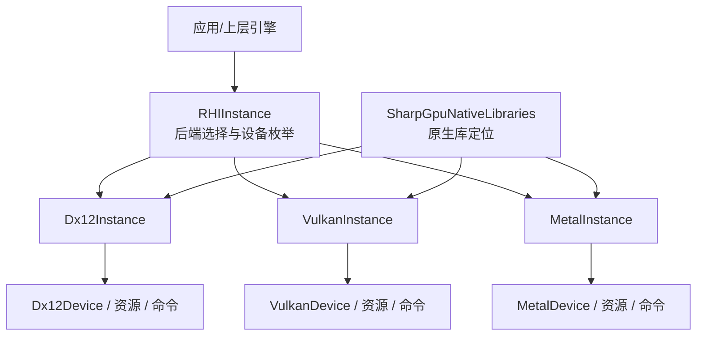
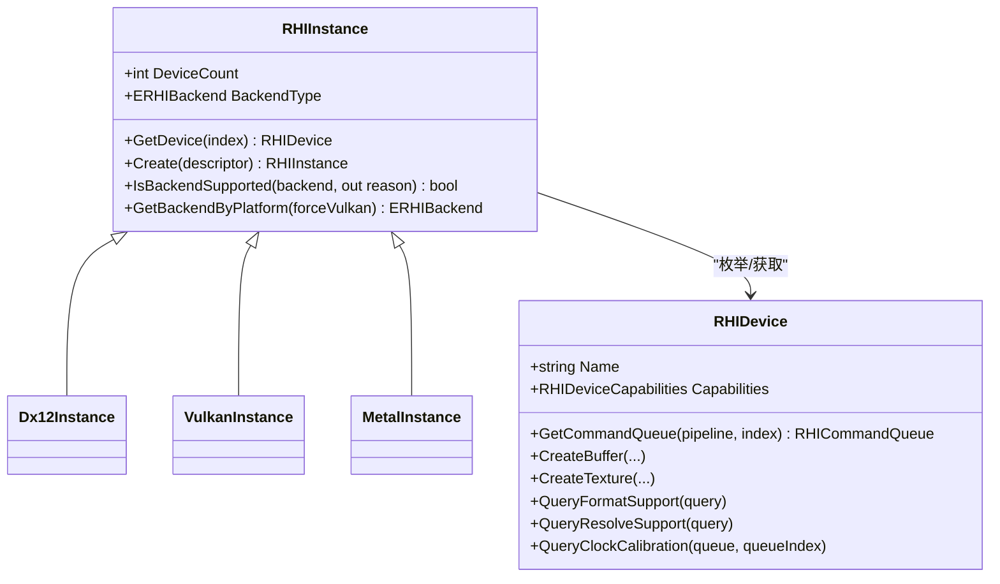
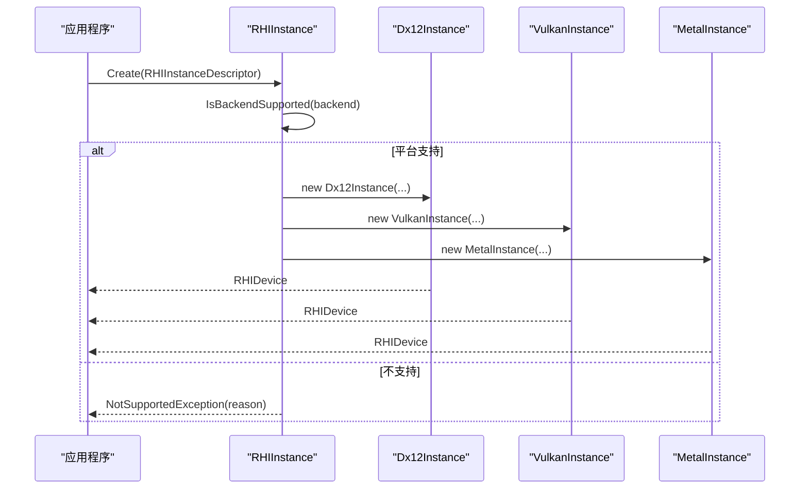
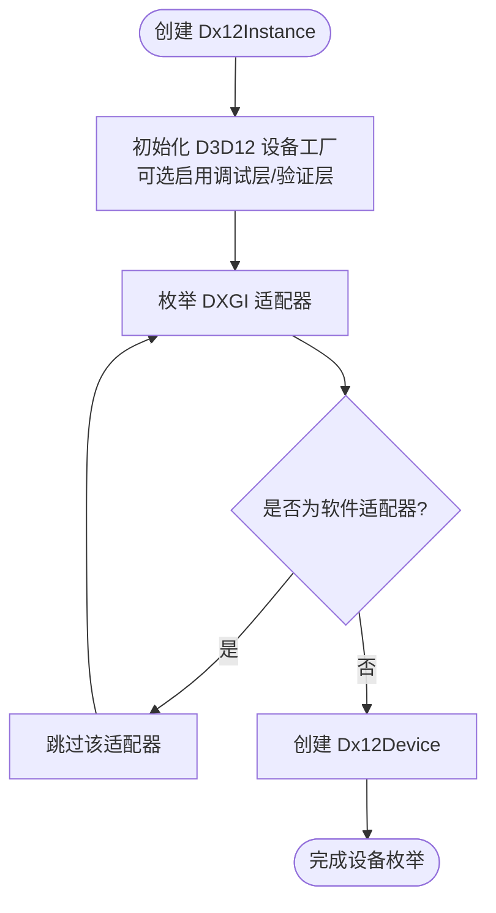
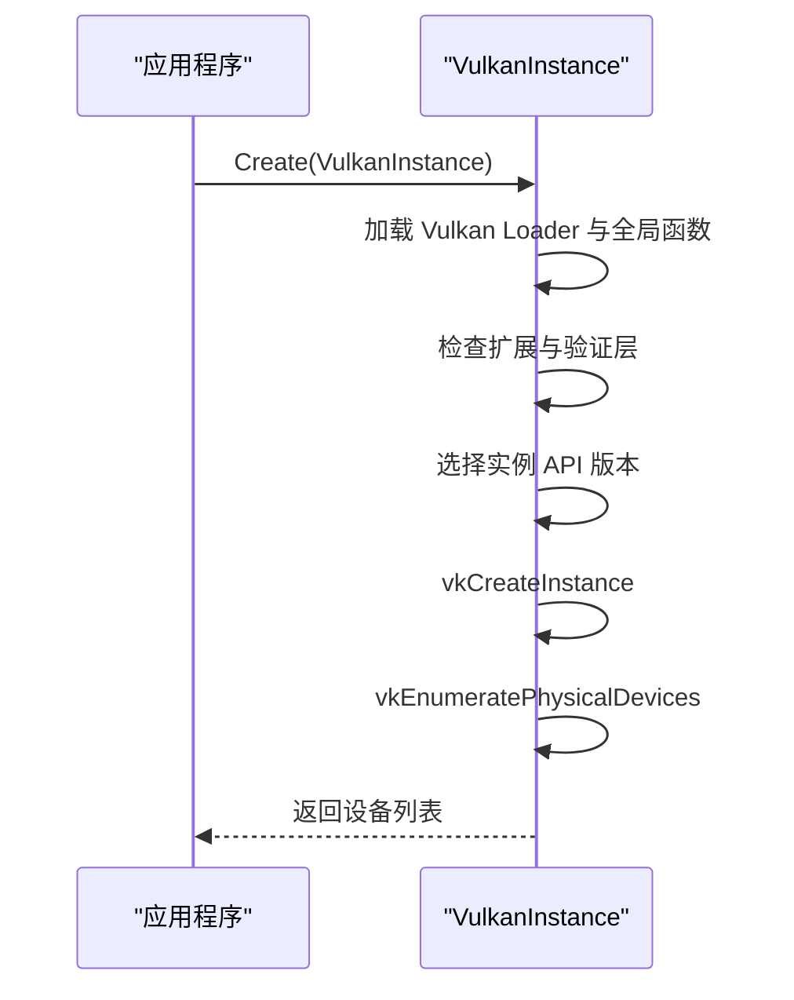
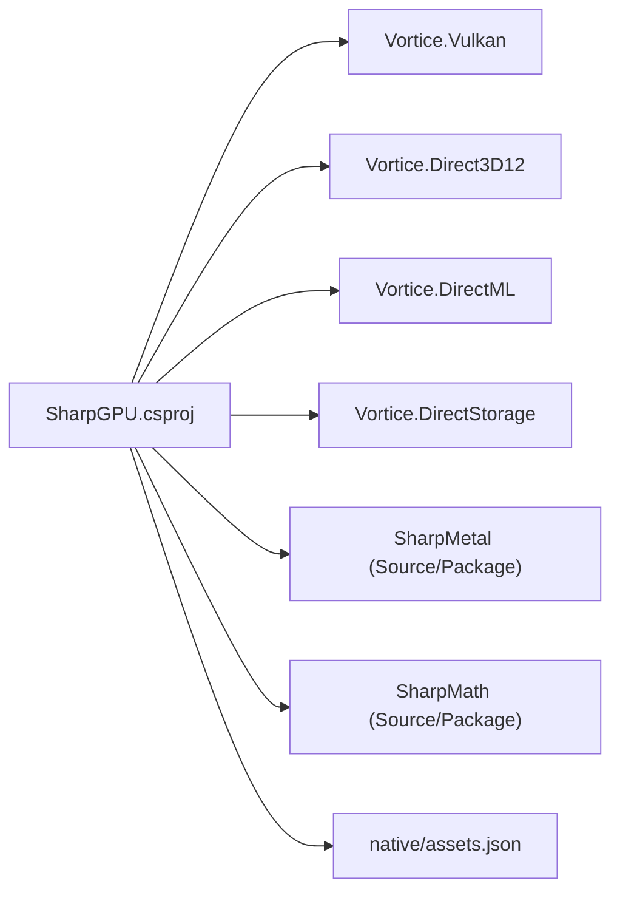

# 项目概览

<cite>
**本文引用的文件**
- [README.md](file://README.md)
- [DESIGN.md](file://DESIGN.md)
- [SharpGPU.csproj](file://src/SharpGPU/SharpGPU.csproj)
- [RHIInstance.cs](file://src/SharpGPU/Abstract/RHIInstance.cs)
- [Dx12Instance.cs](file://src/SharpGPU/Dx12/Dx12Instance.cs)
- [VulkanInstance.cs](file://src/SharpGPU/Vulkan/VulkanInstance.cs)
- [MetalInstance.cs](file://src/SharpGPU/Metal/MetalInstance.cs)
- [RHIDevice.cs](file://src/SharpGPU/Abstract/RHIDevice.cs)
- [SharpGpuNativeLibraries.cs](file://src/SharpGPU/Common/SharpGpuNativeLibraries.cs)
- [FeatureMatrix.md](file://docs/SharpGPU/FeatureMatrix.md)
- [assets.json](file://native/assets.json)
- [Program.cs](file://samples/ComputeAndDraw/Program.cs)
</cite>

## 目录
1. [简介](#简介)
2. [项目结构](#项目结构)
3. [核心组件](#核心组件)
4. [架构总览](#架构总览)
5. [关键组件详解](#关键组件详解)
6. [依赖关系分析](#依赖关系分析)
7. [性能与运行时特性](#性能与运行时特性)
8. [故障排查指南](#故障排查指南)
9. [结论](#结论)
10. [附录](#附录)

## 简介
SharpGPU 是一个面向 .NET 10 的低级 GPU 硬件抽象层（HAL），统一封装 DirectX 12、Vulkan 和 Metal 后端，提供跨平台的设备枚举、能力探测、资源创建、命令编码与提交等底层能力。项目维护了 Vortice 绑定与 MLCook 工具链，并通过运行时能力探测决定设备实际支持的功能集，避免在不可用路径上静默降级。

- 目标：为上层渲染/计算管线提供稳定、可移植的 RHI 契约；以“能力优先”的方式暴露功能，未实现或不可用的能力显式失败。
- 技术栈：.NET 10、Vortice（DirectX 12 / Vulkan）、SharpMetal（Metal）、Vortice.DirectML / DirectStorage（Windows 扩展）。
- 运行期策略：通过 RHIInstance 选择后端并枚举设备；通过 RHIDevice.Capabilities 查询具体能力；所有后端实现遵循同一份抽象接口。

章节来源
- [README.md:1-23](file://README.md#L1-L23)
- [DESIGN.md:1-33](file://DESIGN.md#L1-L33)

## 项目结构
仓库采用分层组织：
- src/SharpGPU：运行时 HAL 代码，包含 Abstract（抽象接口）、Common（通用工具）、以及 Dx12/Vulkan/Metal 三个后端实现。
- samples：示例工作负载（ComputeAndDraw）演示如何创建实例、选择后端并执行计算/光栅化任务。
- docs：设计文档、功能矩阵、验证说明与补丁说明。
- native：原生依赖清单与部署信息（如 D3D12 Agility、DirectML、DirectStorage、PIX）。
- tests：一致性测试与平台限定测试。
- third_party/Vortice.Windows：维护的 Vortice 绑定源码（DXGI/Direct3D12 等）。

图表来源
- [RHIInstance.cs:46-156](file://src/SharpGPU/Abstract/RHIInstance.cs#L46-L156)
- [Dx12Instance.cs:20-130](file://src/SharpGPU/Dx12/Dx12Instance.cs#L20-L130)
- [VulkanInstance.cs:74-418](file://src/SharpGPU/Vulkan/VulkanInstance.cs#L74-L418)
- [MetalInstance.cs:16-76](file://src/SharpGPU/Metal/MetalInstance.cs#L16-L76)
- [SharpGpuNativeLibraries.cs:16-57](file://src/SharpGPU/Common/SharpGpuNativeLibraries.cs#L16-L57)

章节来源
- [README.md:12-16](file://README.md#L12-L16)
- [DESIGN.md:3-19](file://DESIGN.md#L3-L19)

## 核心组件
- RHIInstance：后端工厂与设备枚举入口，负责平台检测、后端可用性判断与实例创建。
- RHIDevice：设备抽象，暴露能力、队列、资源创建、格式/附件/解析查询、时钟校准等。
- 后端实现：Dx12Instance/VulkanInstance/MetalInstance，分别对接 DXGI/D3D12、Vulkan Loader、Apple Metal。
- 原生库管理：SharpGpuNativeLibraries 集中配置与解析 DirectML/DirectStorage/PIX 的原生 DLL 位置。
- 构建与依赖：SharpGPU.csproj 声明目标框架、包引用与内嵌资源；assets.json 描述原生资产。

章节来源
- [RHIInstance.cs:6-156](file://src/SharpGPU/Abstract/RHIInstance.cs#L6-L156)
- [RHIDevice.cs:422-601](file://src/SharpGPU/Abstract/RHIDevice.cs#L422-L601)
- [SharpGpuNativeLibraries.cs:7-57](file://src/SharpGPU/Common/SharpGpuNativeLibraries.cs#L7-L57)
- [SharpGPU.csproj:1-46](file://src/SharpGPU/SharpGPU.csproj#L1-L46)
- [assets.json:1-244](file://native/assets.json#L1-L244)

## 架构总览
SharpGPU 采用“抽象 + 多后端”的 HAL 架构：
- 抽象层定义统一的 RHI 契约（设备、资源、命令、查询、交换链等）。
- 后端层针对 DirectX 12、Vulkan、Metal 分别实现，屏蔽平台差异。
- 运行时通过能力探测与平台限定，确保调用路径真实可用，否则抛出明确异常。

图表来源
- [RHIInstance.cs:46-156](file://src/SharpGPU/Abstract/RHIInstance.cs#L46-L156)
- [RHIDevice.cs:422-601](file://src/SharpGPU/Abstract/RHIDevice.cs#L422-L601)

## 关键组件详解

### 后端选择与平台能力探测
- RHIInstance.IsBackendSupported：根据当前操作系统判断后端是否可用（例如 DirectX 12 仅 Windows，Metal 仅 macOS/iOS，Vulkan 在非已知平台无法评估）。
- RHIInstance.GetBackendByPlatform：按平台自动选择默认后端（Windows→DX12，macOS/iOS→Metal，Linux/Android→Vulkan），也可强制使用 Vulkan。
- 示例程序通过 IsBackendSupported 过滤可用后端再执行渲染任务。

图表来源
- [RHIInstance.cs:59-156](file://src/SharpGPU/Abstract/RHIInstance.cs#L59-L156)
- [Program.cs:7-15](file://samples/ComputeAndDraw/Program.cs#L7-L15)

章节来源
- [RHIInstance.cs:59-120](file://src/SharpGPU/Abstract/RHIInstance.cs#L59-L120)
- [Program.cs:7-15](file://samples/ComputeAndDraw/Program.cs#L7-L15)

### DirectX 12 后端初始化与设备枚举
- 使用 D3D12 Agility SDK 初始化设备工厂，可选启用调试层与 GPU 验证。
- 枚举 DXGI 适配器，跳过软件适配器，构造 Dx12Device 列表。
- 若调试层或验证层不可用，会给出明确的诊断信息。

图表来源
- [Dx12Instance.cs:20-130](file://src/SharpGPU/Dx12/Dx12Instance.cs#L20-L130)

章节来源
- [Dx12Instance.cs:20-130](file://src/SharpGPU/Dx12/Dx12Instance.cs#L20-L130)

### Vulkan 后端初始化、扩展与设备枚举
- 动态加载 Vulkan Loader 并获取全局函数指针（vkGetInstanceProcAddr 等）。
- 检查所需扩展（如表面扩展、调试扩展）与验证层可用性。
- 选择实例 API 版本，创建 VkInstance，枚举物理设备并构造 VulkanDevice。
- 对 Android 等平台有最低版本要求。

图表来源
- [VulkanInstance.cs:74-418](file://src/SharpGPU/Vulkan/VulkanInstance.cs#L74-L418)

章节来源
- [VulkanInstance.cs:74-418](file://src/SharpGPU/Vulkan/VulkanInstance.cs#L74-L418)

### Metal 后端初始化与设备枚举
- 通过 SharpMetal 获取系统所有 MTLDevice，若无则创建默认设备。
- 将每个可用设备包装为 MetalDevice。

章节来源
- [MetalInstance.cs:16-76](file://src/SharpGPU/Metal/MetalInstance.cs#L16-L76)

### 设备能力与查询
- RHIDevice 暴露 Capabilities、Limit、队列数量、状态等属性。
- 提供 QueryFormatSupport、QueryResolveSupport、QueryRasterAttachmentSupport、QueryClockCalibration 等精确查询方法。
- 能力缺失时，相关工厂或编码器应抛出 NotSupportedException，不静默降级。

章节来源
- [RHIDevice.cs:422-601](file://src/SharpGPU/Abstract/RHIDevice.cs#L422-L601)
- [FeatureMatrix.md:44-88](file://docs/SharpGPU/FeatureMatrix.md#L44-L88)

### 原生库定位与配置
- SharpGpuNativeLibraries 允许在首次运行时请求前配置 DirectML、DirectStorage、PIX 的原生目录。
- 解析逻辑优先使用配置的绝对路径，否则回退到 runtimes/win-<arch>/native 或应用目录。
- 一旦开始解析即冻结配置，防止后续修改导致不一致。

章节来源
- [SharpGpuNativeLibraries.cs:7-57](file://src/SharpGPU/Common/SharpGpuNativeLibraries.cs#L7-L57)
- [assets.json:1-244](file://native/assets.json#L1-L244)

## 依赖关系分析
- 运行时目标：net10.0，启用不安全块与可空注解。
- 第三方绑定：Vortice.Vulkan、Vortice.Direct3D12、Vortice.DirectML、Vortice.DirectStorage。
- 平台特定依赖：SharpMath、SharpMetal（可通过 Source 或 Package 模式引入）。
- 原生资产：D3D12 Agility、DirectML、DirectStorage、PIX，由 assets.json 管理与部署。

图表来源
- [SharpGPU.csproj:15-46](file://src/SharpGPU/SharpGPU.csproj#L15-L46)
- [assets.json:1-244](file://native/assets.json#L1-L244)

章节来源
- [SharpGPU.csproj:1-46](file://src/SharpGPU/SharpGPU.csproj#L1-L46)
- [DESIGN.md:5-19](file://DESIGN.md#L5-L19)

## 性能与运行时特性
- 能力探测驱动：所有高级特性（光线追踪、运动模糊、Mesh Shading、存储队列、工作图、函数库、管道缓存等）均通过 RHIDevice.Capabilities 报告，并在不可用时显式失败。
- 精确查询：格式支持、MSAA 解析、附件组合、时钟校准等提供细粒度查询，避免运行时猜测。
- 后端差异化：
  - DX12：Agility SDK 初始化、调试层/验证层可选、适配器枚举。
  - Vulkan：Loader 动态加载、扩展/层检查、实例版本协商、平台最低版本约束。
  - Metal：设备枚举与默认设备回退。
- 原生库：DirectML/DirectStorage/PIX 通过集中配置与解析，保证部署一致性与可追溯性。

章节来源
- [FeatureMatrix.md:44-88](file://docs/SharpGPU/FeatureMatrix.md#L44-L88)
- [VulkanInstance.cs:519-626](file://src/SharpGPU/Vulkan/VulkanInstance.cs#L519-L626)
- [Dx12Instance.cs:26-76](file://src/SharpGPU/Dx12/Dx12Instance.cs#L26-L76)
- [SharpGpuNativeLibraries.cs:16-57](file://src/SharpGPU/Common/SharpGpuNativeLibraries.cs#L16-L57)

## 故障排查指南
- 后端不可用：
  - 检查 IsBackendSupported 返回的原因字符串，确认平台限制。
  - 示例程序仅在支持的后端上执行渲染任务。
- DX12 初始化失败：
  - 确认 D3D12 Agility SDK 已部署到输出目录的 D3D12 文件夹，且存在 D3D12Core.dll。
  - 调试层/验证层不可用时会抛出明确异常。
- Vulkan 初始化失败：
  - 确认 Vulkan Loader 可用，所需扩展与验证层存在。
  - Android 需要 Vulkan 1.1+ 的 Loader。
- 原生库定位失败：
  - 使用 SharpGpuNativeLibraries.Configure 设置绝对路径，或在 runtimes/win-<arch>/native 下放置对应 DLL。
  - 一旦开始解析，配置将被冻结，避免后续变更。
- 设备丢失：
  - 通过 RHIDevice.State 与 DeviceLossDiagnostic 获取诊断信息，必要时重建设备。

章节来源
- [Program.cs:7-15](file://samples/ComputeAndDraw/Program.cs#L7-L15)
- [Dx12Instance.cs:26-76](file://src/SharpGPU/Dx12/Dx12Instance.cs#L26-L76)
- [VulkanInstance.cs:127-230](file://src/SharpGPU/Vulkan/VulkanInstance.cs#L127-L230)
- [SharpGpuNativeLibraries.cs:16-57](file://src/SharpGPU/Common/SharpGpuNativeLibraries.cs#L16-L57)
- [RHIDevice.cs:465-525](file://src/SharpGPU/Abstract/RHIDevice.cs#L465-L525)

## 结论
SharpGPU 以稳定的抽象层统一 DirectX 12、Vulkan 与 Metal 后端，通过运行时能力探测与精确查询机制，确保上层调用路径的真实可用性与错误可见性。其模块化设计与清晰的职责边界，使新增后端或扩展能力成为可能，同时保持向后兼容与可验证性。对于初学者，可从示例程序入手理解后端选择与设备枚举；对于经验开发者，可深入各后端实现与能力查询细节，按需定制优化。

## 附录
- 快速开始：参考 samples/ComputeAndDraw 与 docs/VERIFICATION.md。
- 功能矩阵：详见 docs/SharpGPU/FeatureMatrix.md，了解公开契约与平台限定。
- 原生资产：native/assets.json 记录所有原生依赖的版本、哈希与部署路径。