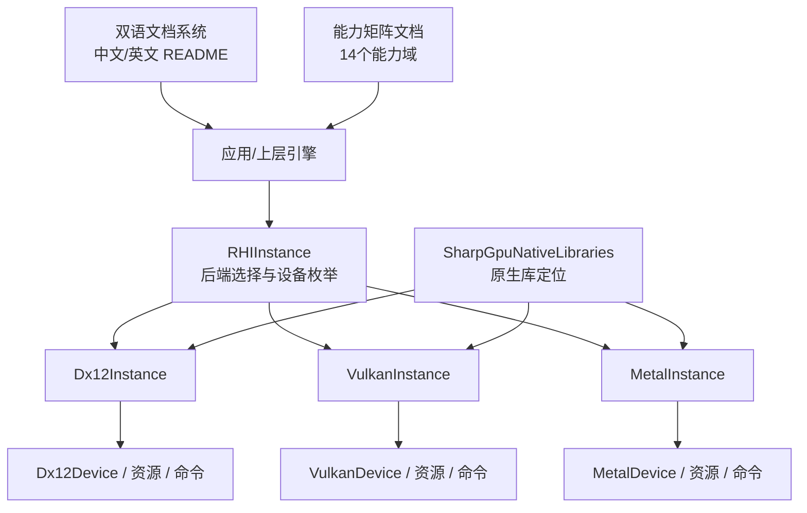
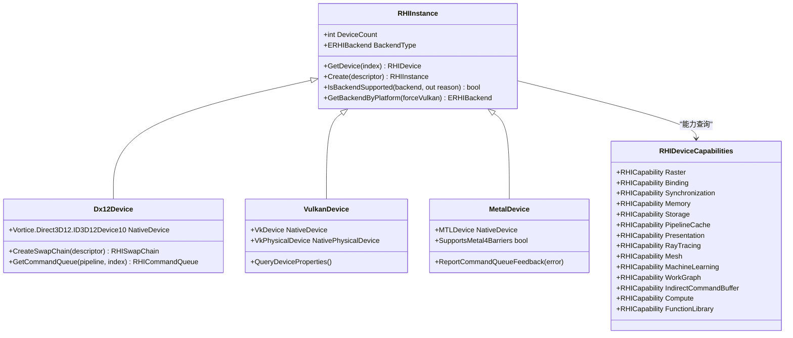
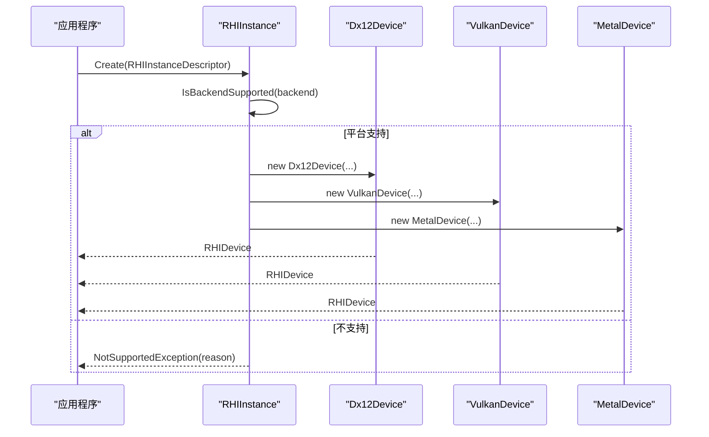
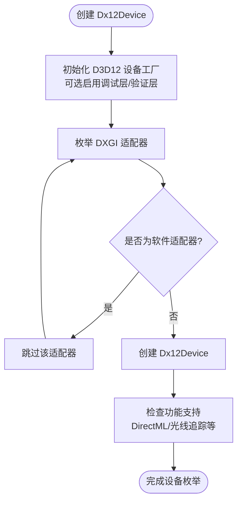
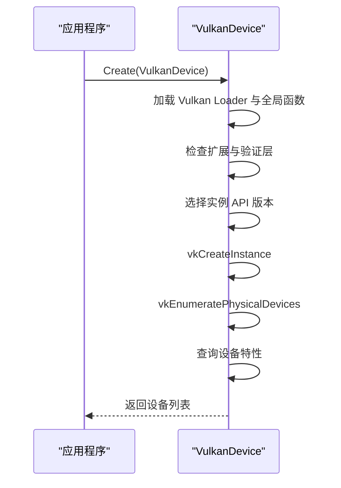
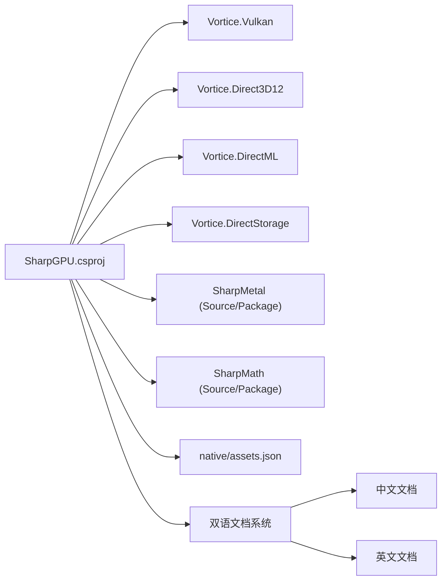

# 项目概览

<cite>
**本文引用的文件**
- [README.md](file://README.md)
- [README.en.md](file://README.en.md)
- [PackageReadme.md](file://docs/SharpGPU/PackageReadme.md)
- [FeatureMatrix.md](file://docs/SharpGPU/FeatureMatrix.md)
- [QuickStart.md](file://docs/SharpGPU/QuickStart.md)
- [RHIInstance.cs](file://src/SharpGPU/Abstract/RHIInstance.cs)
- [RHIDevice.cs](file://src/SharpGPU/Abstract/RHIDevice.cs)
- [Dx12Device.cs](file://src/SharpGPU/Dx12/Dx12Device.cs)
- [VulkanDevice.cs](file://src/SharpGPU/Vulkan/VulkanDevice.cs)
- [MetalDevice.cs](file://src/SharpGPU/Metal/MetalDevice.cs)
- [Program.cs](file://samples/ComputeAndDraw/Program.cs)
</cite>

## 更新摘要
**所做更改**
- 更新了简介部分，反映双语支持（中文和英文 README）的增强技术文档
- 扩展了能力领域章节，详细说明14个能力域的具体实现
- 增强了后端实现细节，包括 DirectX 12、Vulkan 和 Metal 的完整描述
- 完善了 RHI 契约详情，包括设备枚举、资源管理和命令编码
- 更新了架构图表以反映最新的项目结构

## 目录
1. [简介](#简介)
2. [项目结构](#项目结构)
3. [核心组件](#核心组件)
4. [架构总览](#架构总览)
5. [关键组件详解](#关键组件详解)
6. [依赖关系分析](#依赖关系分析)
7. [性能与运行时特性](#性能与运行时特性)
8. [故障排查指南](#故障排查指南)
9. [结论](#结论)
10. [附录](#附录)

## 简介
SharpGPU 是一个面向 .NET 10 的低级 GPU 硬件抽象层（HAL），统一封装 DirectX 12、Vulkan 和 Metal 后端，提供跨平台的设备枚举、能力探测、资源创建、命令编码与提交等底层能力。项目维护了 Vortice 绑定与 MLCook 工具链，并通过运行时能力探测决定设备实际支持的功能集，避免在不可用路径上静默降级。

**更新** 现在提供完整的双语支持（中文和英文），包含所有14个能力领域的详细技术文档，涵盖后端实现和完整的 RHI 契约说明。

- **目标**：为上层渲染/计算管线提供稳定、可移植的 RHI 契约；以"能力优先"的方式暴露功能，未实现或不可用的能力显式失败。
- **技术栈**：.NET 10、Vortice（DirectX 12 / Vulkan）、SharpMetal（Metal）、Vortice.DirectML / DirectStorage（Windows 扩展）。
- **运行期策略**：通过 RHIInstance 选择后端并枚举设备；通过 RHIDevice.Capabilities 查询具体能力；所有后端实现遵循同一份抽象接口。
- **双语支持**：提供完整的中文和英文文档，确保全球开发者都能获得一致的技术信息。

章节来源
- [README.md:1-126](file://README.md#L1-L126)
- [README.en.md:1-126](file://README.en.md#L1-L126)
- [PackageReadme.md:1-22](file://docs/SharpGPU/PackageReadme.md#L1-L22)

## 项目结构
仓库采用分层组织：
- src/SharpGPU：运行时 HAL 代码，包含 Abstract（抽象接口）、Common（通用工具）、以及 Dx12/Vulkan/Metal 三个后端实现。
- samples：示例工作负载（ComputeAndDraw）演示如何创建实例、选择后端并执行计算/光栅化任务。
- docs：设计文档、功能矩阵、验证说明与补丁说明，包含完整的双语文档。
- native：原生依赖清单与部署信息（如 D3D12 Agility、DirectML、DirectStorage、PIX）。
- tests：一致性测试与平台限定测试。
- third_party/Vortice.Windows：维护的 Vortice 绑定源码（DXGI/Direct3D12 等）。

图表来源
- [RHIInstance.cs:46-156](file://src/SharpGPU/Abstract/RHIInstance.cs#L46-L156)
- [Dx12Device.cs:48-161](file://src/SharpGPU/Dx12/Dx12Device.cs#L48-L161)
- [VulkanDevice.cs:11-191](file://src/SharpGPU/Vulkan/VulkanDevice.cs#L11-L191)
- [MetalDevice.cs:12-95](file://src/SharpGPU/Metal/MetalDevice.cs#L12-L95)

章节来源
- [README.md:115-122](file://README.md#L115-L122)
- [README.en.md:115-122](file://README.en.md#L115-L122)

## 核心组件
- **RHIInstance**：后端工厂与设备枚举入口，负责平台检测、后端可用性判断与实例创建。
- **RHIDevice**：设备抽象，暴露能力、队列、资源创建、格式/附件/解析查询、时钟校准等。
- **后端实现**：Dx12Device/VulkanDevice/MetalDevice，分别对接 DXGI/D3D12、Vulkan Loader、Apple Metal。
- **能力系统**：14个能力域（Raster、Binding、Synchronization、Memory、Storage、PipelineCache、Presentation、RayTracing、Mesh、MachineLearning、WorkGraph、IndirectCommandBuffer、Compute、FunctionLibrary）。
- **双语文档**：完整的中文和英文技术文档，涵盖所有功能特性和使用指南。

章节来源
- [RHIInstance.cs:6-156](file://src/SharpGPU/Abstract/RHIInstance.cs#L6-L156)
- [RHIDevice.cs:2071-2105](file://src/SharpGPU/Abstract/RHIDevice.cs#L2071-L2105)
- [FeatureMatrix.md:44-88](file://docs/SharpGPU/FeatureMatrix.md#L44-L88)

## 架构总览
SharpGPU 采用"抽象 + 多后端"的 HAL 架构：
- 抽象层定义统一的 RHI 契约（设备、资源、命令、查询、交换链等）。
- 后端层针对 DirectX 12、Vulkan、Metal 分别实现，屏蔽平台差异。
- 运行时通过能力探测与平台限定，确保调用路径真实可用，否则抛出明确异常。
- 双语文档系统为全球开发者提供一致的技术支持。

图表来源
- [RHIInstance.cs:46-156](file://src/SharpGPU/Abstract/RHIInstance.cs#L46-L156)
- [Dx12Device.cs:48-161](file://src/SharpGPU/Dx12/Dx12Device.cs#L48-L161)
- [VulkanDevice.cs:11-191](file://src/SharpGPU/Vulkan/VulkanDevice.cs#L11-L191)
- [MetalDevice.cs:12-95](file://src/SharpGPU/Metal/MetalDevice.cs#L12-L95)
- [RHIDevice.cs:2071-2105](file://src/SharpGPU/Abstract/RHIDevice.cs#L2071-L2105)

## 关键组件详解

### 后端选择与平台能力探测
- **RHIInstance.IsBackendSupported**：根据当前操作系统判断后端是否可用（例如 DirectX 12 仅 Windows，Metal 仅 macOS/iOS，Vulkan 在非已知平台无法评估）。
- **RHIInstance.GetBackendByPlatform**：按平台自动选择默认后端（Windows→DX12，macOS/iOS→Metal，Linux/Android→Vulkan），也可强制使用 Vulkan。
- **双语支持**：中文和英文文档提供相同的平台兼容性信息和配置指导。

图表来源
- [RHIInstance.cs:59-156](file://src/SharpGPU/Abstract/RHIInstance.cs#L59-L156)
- [Program.cs:7-15](file://samples/ComputeAndDraw/Program.cs#L7-L15)

章节来源
- [RHIInstance.cs:59-120](file://src/SharpGPU/Abstract/RHIInstance.cs#L59-L120)
- [README.md:19-30](file://README.md#L19-L30)
- [README.en.md:19-30](file://README.en.md#L19-L30)

### DirectX 12 后端初始化与设备枚举
- 使用 D3D12 Agility SDK 初始化设备工厂，可选启用调试层与 GPU 验证。
- 枚举 DXGI 适配器，跳过软件适配器，构造 Dx12Device 列表。
- 若调试层或验证层不可用，会给出明确的诊断信息。
- 支持 DirectML 集成用于机器学习推理。

图表来源
- [Dx12Device.cs:48-161](file://src/SharpGPU/Dx12/Dx12Device.cs#L48-L161)

章节来源
- [Dx12Device.cs:48-161](file://src/SharpGPU/Dx12/Dx12Device.cs#L48-L161)

### Vulkan 后端初始化、扩展与设备枚举
- 动态加载 Vulkan Loader 并获取全局函数指针（vkGetInstanceProcAddr 等）。
- 检查所需扩展（如表面扩展、调试扩展）与验证层可用性。
- 选择实例 API 版本，创建 VkInstance，枚举物理设备并构造 VulkanDevice。
- 对 Android 等平台有最低版本要求。
- 支持多种高级特性：动态渲染、光线追踪、稀疏内存等。

图表来源
- [VulkanDevice.cs:11-191](file://src/SharpGPU/Vulkan/VulkanDevice.cs#L11-L191)

章节来源
- [VulkanDevice.cs:11-191](file://src/SharpGPU/Vulkan/VulkanDevice.cs#L11-L191)

### Metal 后端初始化与设备枚举
- 通过 SharpMetal 获取系统所有 MTLDevice，若无则创建默认设备。
- 将每个可用设备包装为 MetalDevice。
- 要求 Metal 4 支持和原生参数表功能。
- 支持 Metal ML 和高级屏障操作。

章节来源
- [MetalDevice.cs:12-95](file://src/SharpGPU/Metal/MetalDevice.cs#L12-L95)

### 设备能力与查询 - 14个能力域
SharpGPU 定义了14个核心能力域，每个域都有详细的等级、策略和来源信息：

1. **Raster** - 光栅化能力
2. **Binding** - 绑定表能力  
3. **Synchronization** - 同步能力（时间戳、遮挡查询、管道统计）
4. **Memory** - 内存管理（统一内存、放置资源、稀疏内存）
5. **Storage** - 存储队列（DirectStorage、GPU解压）
6. **PipelineCache** - 管道缓存
7. **Presentation** - 呈现（交换链、HDR）
8. **RayTracing** - 光线追踪（管线、内联、不透明度微映射、运动）
9. **Mesh** - 网格着色器
10. **MachineLearning** - 机器学习执行
11. **WorkGraph** - 工作图
12. **IndirectCommandBuffer** - 间接命令缓冲
13. **Compute** - 计算能力（波操作、协作矩阵）
14. **FunctionLibrary** - 函数库复用

**更新** 现在提供完整的双语文档，详细说明每个能力域的API契约、平台限定和实现策略。

章节来源
- [RHIDevice.cs:2071-2105](file://src/SharpGPU/Abstract/RHIDevice.cs#L2071-L2105)
- [FeatureMatrix.md:44-88](file://docs/SharpGPU/FeatureMatrix.md#L44-L88)
- [README.md:92-107](file://README.md#L92-L107)
- [README.en.md:92-107](file://README.en.md#L92-L107)

### 快速开始与示例
- **最小传输Pass**：参考 QuickStart 文档，展示最基础的缓冲区上传操作。
- **计算和绘制示例**：ComputeAndDraw 示例演示完整的计算和光栅化流程。
- **双语支持**：所有示例和文档都提供中文和英文版本。

章节来源
- [QuickStart.md:1-31](file://docs/SharpGPU/QuickStart.md#L1-L31)
- [Program.cs:7-15](file://samples/ComputeAndDraw/Program.cs#L7-L15)

## 依赖关系分析
- **运行时目标**：net10.0，启用不安全块与可空注解。
- **第三方绑定**：Vortice.Vulkan、Vortice.Direct3D12、Vortice.DirectML、Vortice.DirectStorage。
- **平台特定依赖**：SharpMath、SharpMetal（可通过 Source 或 Package 模式引入）。
- **原生资产**：D3D12 Agility、DirectML、DirectStorage、PIX，由 assets.json 管理与部署。
- **文档依赖**：完整的双语文档系统，确保全球开发者访问一致的技术信息。

图表来源
- [README.md:115-122](file://README.md#L115-L122)
- [README.en.md:115-122](file://README.en.md#L115-L122)

## 性能与运行时特性
- **能力探测驱动**：所有高级特性（光线追踪、运动模糊、Mesh Shading、存储队列、工作图、函数库、管道缓存等）均通过 RHIDevice.Capabilities 报告，并在不可用时显式失败。
- **精确查询**：格式支持、MSAA 解析、附件组合、时钟校准等提供细粒度查询，避免运行时猜测。
- **后端差异化**：
  - DX12：Agility SDK 初始化、调试层/验证层可选、适配器枚举。
  - Vulkan：Loader 动态加载、扩展/层检查、实例版本协商、平台最低版本约束。
  - Metal：设备枚举与默认设备回退。
- **双语支持**：中文和英文文档提供相同的技术深度和使用指导。
- **原生库**：DirectML/DirectStorage/PIX 通过集中配置与解析，保证部署一致性与可追溯性。

章节来源
- [FeatureMatrix.md:44-88](file://docs/SharpGPU/FeatureMatrix.md#L44-L88)
- [README.md:92-107](file://README.md#L92-L107)
- [README.en.md:92-107](file://README.en.md#L92-L107)

## 故障排查指南
- **后端不可用**：
  - 检查 IsBackendSupported 返回的原因字符串，确认平台限制。
  - 示例程序仅在支持的后端上执行渲染任务。
- **DX12 初始化失败**：
  - 确认 D3D12 Agility SDK 已部署到输出目录的 D3D12 文件夹，且存在 D3D12Core.dll。
  - 调试层/验证层不可用时会抛出明确异常。
- **Vulkan 初始化失败**：
  - 确认 Vulkan Loader 可用，所需扩展与验证层存在。
  - Android 需要 Vulkan 1.1+ 的 Loader。
- **Metal 初始化失败**：
  - 确认 Metal 4 支持和原生参数表功能可用。
- **双语文档问题**：
  - 中文和英文文档内容保持一致，如有差异请报告问题。
- **设备丢失**：
  - 通过 RHIDevice.State 与 DeviceLossDiagnostic 获取诊断信息，必要时重建设备。

章节来源
- [Program.cs:7-15](file://samples/ComputeAndDraw/Program.cs#L7-L15)
- [Dx12Device.cs:48-161](file://src/SharpGPU/Dx12/Dx12Device.cs#L48-L161)
- [VulkanDevice.cs:11-191](file://src/SharpGPU/Vulkan/VulkanDevice.cs#L11-L191)
- [MetalDevice.cs:12-95](file://src/SharpGPU/Metal/MetalDevice.cs#L12-L95)

## 结论
SharpGPU 以稳定的抽象层统一 DirectX 12、Vulkan 与 Metal 后端，通过运行时能力探测与精确查询机制，确保上层调用路径的真实可用性与错误可见性。其模块化设计与清晰的职责边界，使新增后端或扩展能力成为可能，同时保持向后兼容与可验证性。

**更新** 现在提供完整的双语支持，中文和英文文档都包含所有14个能力领域的详细技术说明，涵盖后端实现和完整的 RHI 契约详情。对于初学者，可从示例程序入手理解后端选择与设备枚举；对于经验开发者，可深入各后端实现与能力查询细节，按需定制优化。双语文档系统确保全球开发者都能获得一致的技术支持。

## 附录
- **快速开始**：参考 samples/ComputeAndDraw 与 docs/VERIFICATION.md。
- **功能矩阵**：详见 docs/SharpGPU/FeatureMatrix.md，了解公开契约与平台限定。
- **双语文档**：README.md（中文）和 README.en.md（英文）提供完整的技术文档。
- **原生资产**：native/assets.json 记录所有原生依赖的版本、哈希与部署路径。
- **能力域详情**：14个能力域的完整说明，包括等级、策略和来源信息。