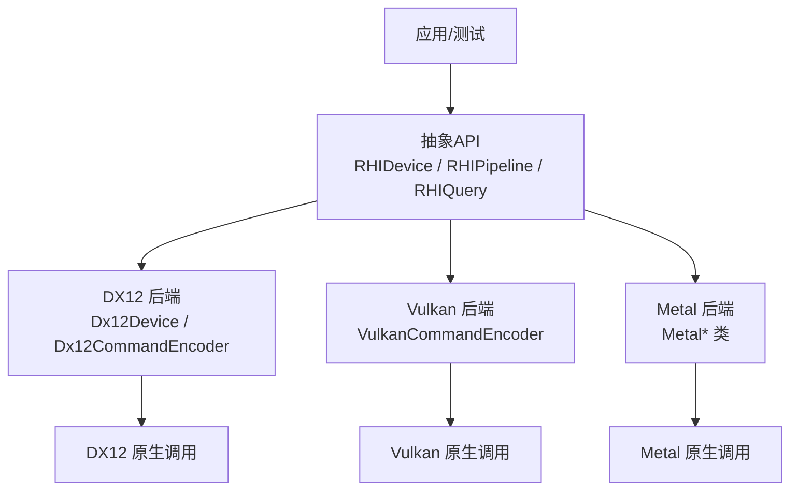
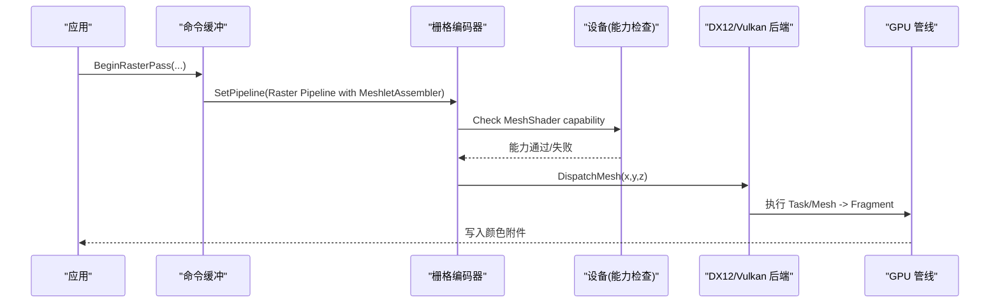
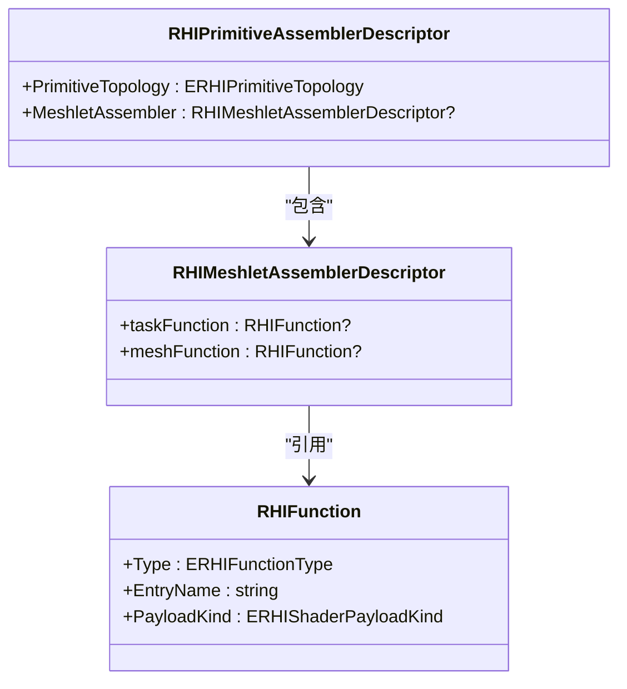
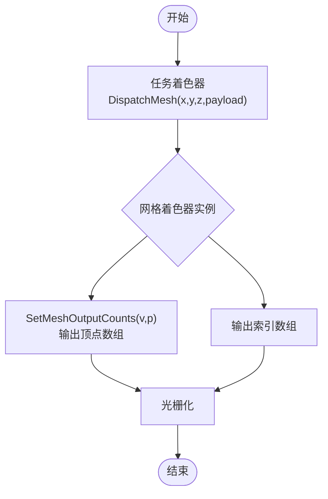
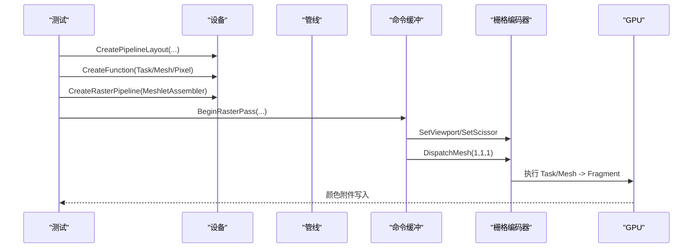
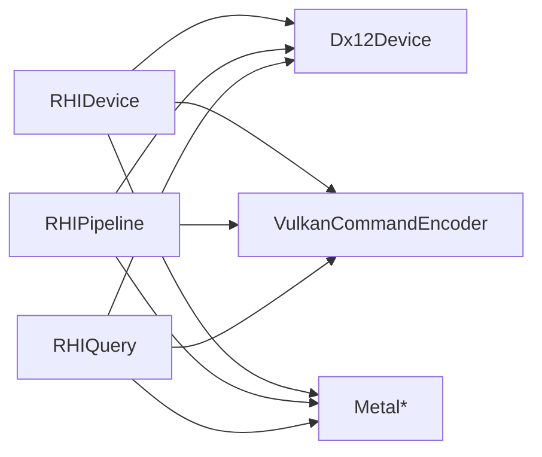

# Mesh Shading

<cite>
**本文引用的文件**
- [RHIDevice.cs](file://src/SharpGPU/Abstract/RHIDevice.cs)
- [RHIQuery.cs](file://src/SharpGPU/Abstract/RHIQuery.cs)
- [RHIPipeline.cs](file://src/SharpGPU/Abstract/RHIPipeline.cs)
- [Dx12CommandEncoder.cs](file://src/SharpGPU/Dx12/Dx12CommandEncoder.cs)
- [Dx12Device.cs](file://src/SharpGPU/Dx12/Dx12Device.cs)
- [VulkanCommandEncoder.cs](file://src/SharpGPU/Vulkan/VulkanCommandEncoder.cs)
- [MeshShadingPortableContractTests.cs](file://tests/SharpGPU.Conformance.Tests/MeshShadingPortableContractTests.cs)
- [MeshShadingWindowsQualifiedTests.cs](file://tests/SharpGPU.Conformance.Tests/MeshShadingWindowsQualifiedTests.cs)
- [MeshShadingVulkanQualifiedTests.cs](file://tests/SharpGPU.Conformance.Tests/MeshShadingVulkanQualifiedTests.cs)
- [MeshShadingMslCompileTests.cs](file://tests/SharpGPU.Conformance.Tests/MeshShadingMslCompileTests.cs)
</cite>

## 目录
1. [简介](#简介)
2. [项目结构](#项目结构)
3. [核心组件](#核心组件)
4. [架构总览](#架构总览)
5. [详细组件分析](#详细组件分析)
6. [依赖关系分析](#依赖关系分析)
7. [性能考量](#性能考量)
8. [故障排查指南](#故障排查指南)
9. [结论](#结论)
10. [附录](#附录)

## 简介
本文件系统性梳理 SharpGPU 在 Mesh Shading（网格着色）方面的能力与实现，覆盖现代图形管线中任务着色器（Task Shader）与网格着色器（Mesh Shader）的概念、ABI 接口、工作单元组织方式、不同后端（DX12、Vulkan、Metal）支持情况，以及完整的渲染示例与性能优化建议。文档基于仓库中的抽象 API、后端实现与一致性测试进行归纳，确保内容与实际代码一致。

## 项目结构
SharpGPU 将 Mesh Shading 的能力以跨后端抽象的方式暴露：
- 抽象层定义设备能力、查询统计、管线描述符等
- 各后端（DX12、Vulkan、Metal）提供具体实现与特性探测
- 测试用例验证跨平台行为、编译与执行路径

图表来源
- [RHIDevice.cs:1815-1824](file://src/SharpGPU/Abstract/RHIDevice.cs#L1815-L1824)
- [RHIPipeline.cs:186-221](file://src/SharpGPU/Abstract/RHIPipeline.cs#L186-L221)
- [Dx12CommandEncoder.cs:3850-3867](file://src/SharpGPU/Dx12/Dx12CommandEncoder.cs#L3850-L3867)
- [VulkanCommandEncoder.cs:3075-3090](file://src/SharpGPU/Vulkan/VulkanCommandEncoder.cs#L3075-L3090)

章节来源
- [RHIDevice.cs:1815-1824](file://src/SharpGPU/Abstract/RHIDevice.cs#L1815-L1824)
- [RHIPipeline.cs:186-221](file://src/SharpGPU/Abstract/RHIPipeline.cs#L186-L221)
- [Dx12CommandEncoder.cs:3850-3867](file://src/SharpGPU/Dx12/Dx12CommandEncoder.cs#L3850-L3867)
- [VulkanCommandEncoder.cs:3075-3090](file://src/SharpGPU/Vulkan/VulkanCommandEncoder.cs#L3075-L3090)

## 核心组件
- 设备能力
  - RHIMeshCapabilities：暴露 MeshShader 与 TaskShader 能力，用于运行时判断是否可用及能力等级
- 管线装配
  - RHIMeshletAssemblerDescriptor：封装可选的 Task 与 Mesh 函数指针，配合 RHIPrimitiveAssemblerDescriptor 启用 Mesh Shading
- 命令编码
  - RHIRasterEncoder.DispatchMesh / DispatchMeshIndirect：在栅格通道中调度 Mesh 阶段
- 查询统计
  - RHIQuery 枚举与结果字段：包含 MeshShaderInvocations、TaskShaderInvocations、MeshShaderPrimitives

章节来源
- [RHIDevice.cs:1815-1824](file://src/SharpGPU/Abstract/RHIDevice.cs#L1815-L1824)
- [RHIPipeline.cs:186-221](file://src/SharpGPU/Abstract/RHIPipeline.cs#L186-L221)
- [RHIQuery.cs:109-128](file://src/SharpGPU/Abstract/RHIQuery.cs#L109-L128)
- [Dx12CommandEncoder.cs:3850-3867](file://src/SharpGPU/Dx12/Dx12CommandEncoder.cs#L3850-L3867)

## 架构总览
Mesh Shading 在现代管线中以“任务-网格”两阶段替代传统顶点/几何阶段：
- 任务着色器（Task Shader）：负责生成或调度网格块（meshlets），可携带 payload 给网格着色器
- 网格着色器（Mesh Shader）：输出顶点与索引，形成图元供后续光栅化
- 像素着色器（Fragment/Pixel）：完成逐片元着色

图表来源
- [Dx12CommandEncoder.cs:3850-3867](file://src/SharpGPU/Dx12/Dx12CommandEncoder.cs#L3850-L3867)
- [VulkanCommandEncoder.cs:3075-3090](file://src/SharpGPU/Vulkan/VulkanCommandEncoder.cs#L3075-L3090)
- [MeshShadingWindowsQualifiedTests.cs:198-218](file://tests/SharpGPU.Conformance.Tests/MeshShadingWindowsQualifiedTests.cs#L198-L218)
- [MeshShadingVulkanQualifiedTests.cs:259-279](file://tests/SharpGPU.Conformance.Tests/MeshShadingVulkanQualifiedTests.cs#L259-L279)

## 详细组件分析

### 设备能力与限制
- RHIMeshCapabilities 提供 MeshShader 与 TaskShader 两个能力项，便于应用按能力分支
- ERHICapabilityLimitKind 定义了 Mesh 相关限制种类，如最大输出顶点数、图元数、负载大小、工作组尺寸等
- 设备能力探测由后端实现，例如 DX12 根据硬件特性设置 MeshShaderTier/TaskShaderTier

章节来源
- [RHIDevice.cs:1815-1824](file://src/SharpGPU/Abstract/RHIDevice.cs#L1815-L1824)
- [MeshShadingPortableContractTests.cs:22-32](file://tests/SharpGPU.Conformance.Tests/MeshShadingPortableContractTests.cs#L22-L32)
- [Dx12Device.cs:1351-1354](file://src/SharpGPU/Dx12/Dx12Device.cs#L1351-L1354)

### 管线装配与 ABI
- RHIMeshletAssemblerDescriptor(taskFunction, meshFunction) 用于声明 Mesh Shading 阶段的两个着色器入口
- RHIPrimitiveAssemblerDescriptor.MeshletAssembler 为可选，若存在则启用 Mesh Shading 管线
- 着色器 ABI 约定（来自测试中的 HLSL 片段）：
  - Task Shader：使用 DispatchMesh(groupX, groupY, groupZ, payload) 调度网格
  - Mesh Shader：使用 SetMeshOutputCounts(vertexCount, primitiveCount)，输出 vertices[] 与 indices[]
  - 拓扑与线程组：[outputtopology("triangle")]、[numthreads(1,1,1)]
- 后端对 ABI 的处理：
  - DX12：使用 DXIL 目标；任务/网格阶段分别对应 Amplification/Mesh 阶段
  - Vulkan：使用 SPIR-V 目标；任务/网格阶段映射到相应扩展
  - Metal：MSL 编译路径支持 Mesh Shader 翻译（仅编译期）

图表来源
- [RHIPipeline.cs:186-221](file://src/SharpGPU/Abstract/RHIPipeline.cs#L186-L221)
- [MeshShadingWindowsQualifiedTests.cs:198-218](file://tests/SharpGPU.Conformance.Tests/MeshShadingWindowsQualifiedTests.cs#L198-L218)
- [MeshShadingVulkanQualifiedTests.cs:259-279](file://tests/SharpGPU.Conformance.Tests/MeshShadingVulkanQualifiedTests.cs#L259-L279)

章节来源
- [RHIPipeline.cs:186-221](file://src/SharpGPU/Abstract/RHIPipeline.cs#L186-L221)
- [MeshShadingWindowsQualifiedTests.cs:198-218](file://tests/SharpGPU.Conformance.Tests/MeshShadingWindowsQualifiedTests.cs#L198-L218)
- [MeshShadingVulkanQualifiedTests.cs:259-279](file://tests/SharpGPU.Conformance.Tests/MeshShadingVulkanQualifiedTests.cs#L259-L279)
- [MeshShadingMslCompileTests.cs:10-48](file://tests/SharpGPU.Conformance.Tests/MeshShadingMslCompileTests.cs#L10-L48)

### 工作单元组织
- 任务着色器：通常以单线程组启动，内部通过 DispatchMesh 发起网格调度
- 网格着色器：每个网格实例独立运行，输出顶点与索引数组
- 线程组维度：测试中使用 [numthreads(1,1,1)]，实际应用中可按需求调整
- 数据传递：任务着色器可通过 payload 向网格着色器传递状态（如常量、索引偏移等）

图表来源
- [MeshShadingWindowsQualifiedTests.cs:20-78](file://tests/SharpGPU.Conformance.Tests/MeshShadingWindowsQualifiedTests.cs#L20-L78)
- [MeshShadingVulkanQualifiedTests.cs:20-78](file://tests/SharpGPU.Conformance.Tests/MeshShadingVulkanQualifiedTests.cs#L20-L78)

章节来源
- [MeshShadingWindowsQualifiedTests.cs:20-78](file://tests/SharpGPU.Conformance.Tests/MeshShadingWindowsQualifiedTests.cs#L20-L78)
- [MeshShadingVulkanQualifiedTests.cs:20-78](file://tests/SharpGPU.Conformance.Tests/MeshShadingVulkanQualifiedTests.cs#L20-L78)

### 后端支持与差异
- DX12
  - 能力探测：Caps.Mesh.MeshShader.Tier 决定可用性
  - 命令：Dx12CommandEncoder.DispatchMesh 直接调用原生命令
  - 着色器目标：DXIL，任务阶段映射为 Amplification，网格阶段为 Mesh
- Vulkan
  - 能力探测：Caps.Mesh.MeshShader.Tier 决定可用性
  - 命令：VulkanCommandEncoder 在栅格通道中调度 Mesh
  - 着色器目标：SPIR-V，任务/网格阶段映射至相应扩展
- Metal
  - 编译期支持：MSL 翻译 Mesh Shader 源码成功（测试验证）
  - 运行时：通过 Metal 后端管线执行（具体细节由后端实现）

章节来源
- [Dx12Device.cs:1351-1354](file://src/SharpGPU/Dx12/Dx12Device.cs#L1351-L1354)
- [Dx12CommandEncoder.cs:3850-3867](file://src/SharpGPU/Dx12/Dx12CommandEncoder.cs#L3850-L3867)
- [VulkanCommandEncoder.cs:3075-3090](file://src/SharpGPU/Vulkan/VulkanCommandEncoder.cs#L3075-L3090)
- [MeshShadingMslCompileTests.cs:10-48](file://tests/SharpGPU.Conformance.Tests/MeshShadingMslCompileTests.cs#L10-L48)

### 完整渲染示例（替代传统顶点/几何阶段）
以下流程展示了如何使用 Mesh Shading 绘制一个三角形并写入像素：
- 创建管线布局与绑定表
- 编译任务着色器（可选）、网格着色器、像素着色器
- 配置 RHIPrimitiveAssemblerDescriptor.MeshletAssembler
- 在栅格通道中设置视口/裁剪矩形，调用 DispatchMesh
- 提交命令并读取结果

图表来源
- [MeshShadingWindowsQualifiedTests.cs:198-218](file://tests/SharpGPU.Conformance.Tests/MeshShadingWindowsQualifiedTests.cs#L198-L218)
- [MeshShadingVulkanQualifiedTests.cs:259-279](file://tests/SharpGPU.Conformance.Tests/MeshShadingVulkanQualifiedTests.cs#L259-L279)

章节来源
- [MeshShadingWindowsQualifiedTests.cs:198-218](file://tests/SharpGPU.Conformance.Tests/MeshShadingWindowsQualifiedTests.cs#L198-L218)
- [MeshShadingVulkanQualifiedTests.cs:259-279](file://tests/SharpGPU.Conformance.Tests/MeshShadingVulkanQualifiedTests.cs#L259-L279)

## 依赖关系分析
- 抽象层依赖
  - RHIDevice 暴露 Mesh 能力
  - RHIPipeline 提供 MeshletAssembler 装配点
  - RHIQuery 提供 Mesh 阶段统计计数
- 后端实现依赖
  - DX12：Dx12Device 探测能力，Dx12CommandEncoder 执行 DispatchMesh
  - Vulkan：VulkanCommandEncoder 在栅格通道中调度 Mesh
  - Metal：MSL 编译路径支持 Mesh Shader 翻译

图表来源
- [RHIDevice.cs:1815-1824](file://src/SharpGPU/Abstract/RHIDevice.cs#L1815-L1824)
- [RHIPipeline.cs:186-221](file://src/SharpGPU/Abstract/RHIPipeline.cs#L186-L221)
- [RHIQuery.cs:109-128](file://src/SharpGPU/Abstract/RHIQuery.cs#L109-L128)
- [Dx12Device.cs:1351-1354](file://src/SharpGPU/Dx12/Dx12Device.cs#L1351-L1354)
- [Dx12CommandEncoder.cs:3850-3867](file://src/SharpGPU/Dx12/Dx12CommandEncoder.cs#L3850-L3867)
- [VulkanCommandEncoder.cs:3075-3090](file://src/SharpGPU/Vulkan/VulkanCommandEncoder.cs#L3075-L3090)

章节来源
- [RHIDevice.cs:1815-1824](file://src/SharpGPU/Abstract/RHIDevice.cs#L1815-L1824)
- [RHIPipeline.cs:186-221](file://src/SharpGPU/Abstract/RHIPipeline.cs#L186-L221)
- [RHIQuery.cs:109-128](file://src/SharpGPU/Abstract/RHIQuery.cs#L109-L128)
- [Dx12Device.cs:1351-1354](file://src/SharpGPU/Dx12/Dx12Device.cs#L1351-L1354)
- [Dx12CommandEncoder.cs:3850-3867](file://src/SharpGPU/Dx12/Dx12CommandEncoder.cs#L3850-L3867)
- [VulkanCommandEncoder.cs:3075-3090](file://src/SharpGPU/Vulkan/VulkanCommandEncoder.cs#L3075-L3090)

## 性能考量
- 批处理策略
  - 合理分组网格块：利用任务着色器批量调度，减少 Draw/Dispatch 调用次数
  - 合并小网格：将多个小网格合并为较大 meshlet，降低调度开销
- 内存访问模式
  - 局部共享内存：在任务/网格着色器内复用数据，减少全局内存访问
  - 连续写入：顶点/索引输出尽量顺序写入，提升缓存命中
- 输出规模控制
  - 精确设置 SetMeshOutputCounts，避免过度分配
  - 依据场景动态调整顶点/图元数量，平衡带宽与计算
- 统计与调优
  - 使用 RHIQuery 统计 MeshShaderInvocations、TaskShaderInvocations、MeshShaderPrimitives，定位瓶颈
  - 结合后端工具（PIX、RenderDoc、Vulkan Validation Layers）观察内存与吞吐

章节来源
- [RHIQuery.cs:109-128](file://src/SharpGPU/Abstract/RHIQuery.cs#L109-L128)
- [MeshShadingWindowsQualifiedTests.cs:20-78](file://tests/SharpGPU.Conformance.Tests/MeshShadingWindowsQualifiedTests.cs#L20-L78)
- [MeshShadingVulkanQualifiedTests.cs:20-78](file://tests/SharpGPU.Conformance.Tests/MeshShadingVulkanQualifiedTests.cs#L20-L78)

## 故障排查指南
- 能力不可用
  - 现象：CreateRasterPipeline 抛出 NotSupportedException
  - 原因：Caps.Mesh.MeshShader.Tier 为 Unavailable
  - 处理：回退到传统顶点/几何阶段或提示用户设备不支持
- 缺少必要函数
  - 现象：传入 null 的 meshFunction 或 taskFunction 导致异常
  - 原因：管线要求提供有效的 Mesh/Task 函数
  - 处理：确保 RHIMeshletAssemblerDescriptor 中包含有效函数指针
- 后端特定错误
  - DX12：检查 DXIL 编译与功能级别
  - Vulkan：检查 SPIR-V 编译与环境版本
  - Metal：确认 MSL 编译选项与平台目标

章节来源
- [MeshShadingPortableContractTests.cs:34-80](file://tests/SharpGPU.Conformance.Tests/MeshShadingPortableContractTests.cs#L34-L80)
- [MeshShadingWindowsQualifiedTests.cs:186-196](file://tests/SharpGPU.Conformance.Tests/MeshShadingWindowsQualifiedTests.cs#L186-L196)
- [MeshShadingVulkanQualifiedTests.cs:136-176](file://tests/SharpGPU.Conformance.Tests/MeshShadingVulkanQualifiedTests.cs#L136-L176)

## 结论
SharpGPU 通过统一的抽象 API 与多后端实现，提供了完整的 Mesh Shading 支持。开发者可在 DX12、Vulkan、Metal 上以一致的接口启用任务/网格着色器，获得更灵活的网格生成与更高的渲染效率。借助能力探测、统计查询与测试用例，可在不同平台上稳定地集成 Mesh Shading，并通过批处理与内存访问优化进一步提升性能。

## 附录
- 关键类型与用法参考
  - RHIMeshCapabilities：能力查询
  - RHIMeshletAssemblerDescriptor：装配 Mesh 阶段
  - RHIRasterEncoder.DispatchMesh：调度 Mesh 阶段
  - RHIQuery 统计：评估 Mesh 阶段性能

章节来源
- [RHIDevice.cs:1815-1824](file://src/SharpGPU/Abstract/RHIDevice.cs#L1815-L1824)
- [RHIPipeline.cs:186-221](file://src/SharpGPU/Abstract/RHIPipeline.cs#L186-L221)
- [Dx12CommandEncoder.cs:3850-3867](file://src/SharpGPU/Dx12/Dx12CommandEncoder.cs#L3850-L3867)
- [RHIQuery.cs:109-128](file://src/SharpGPU/Abstract/RHIQuery.cs#L109-L128)