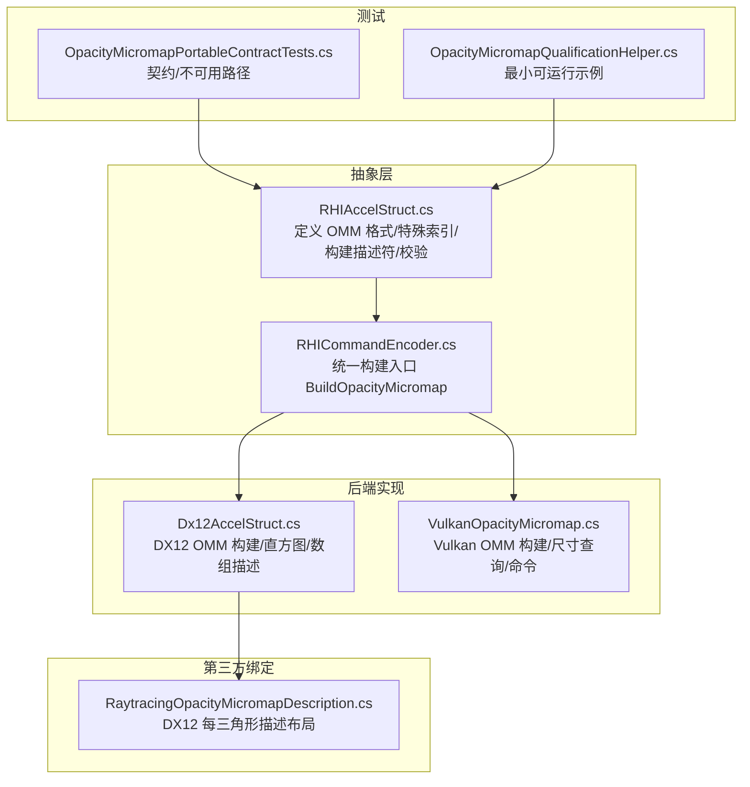
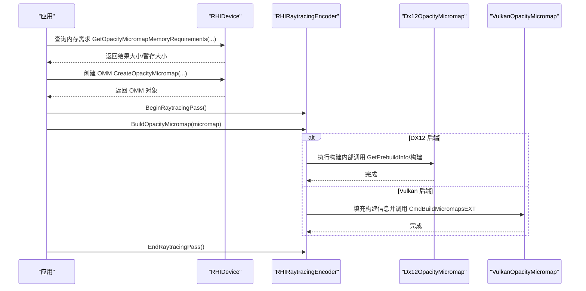
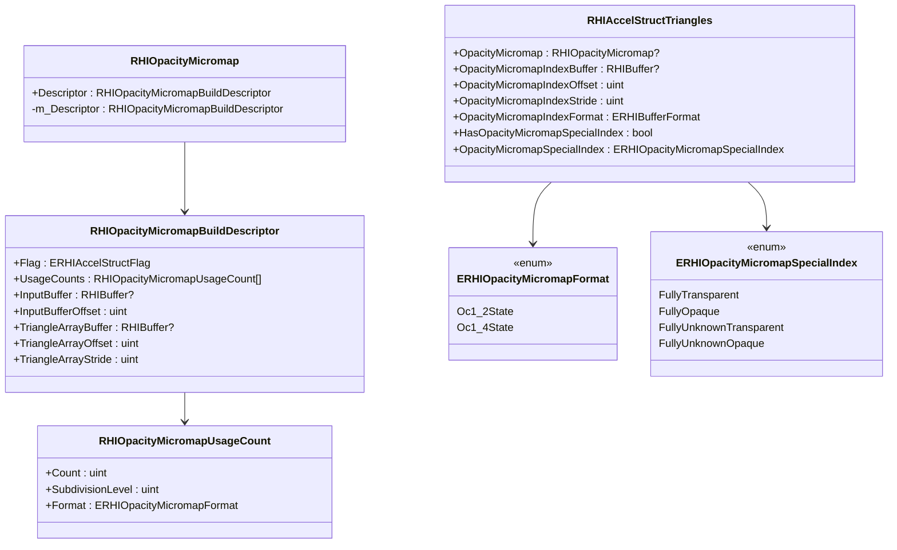
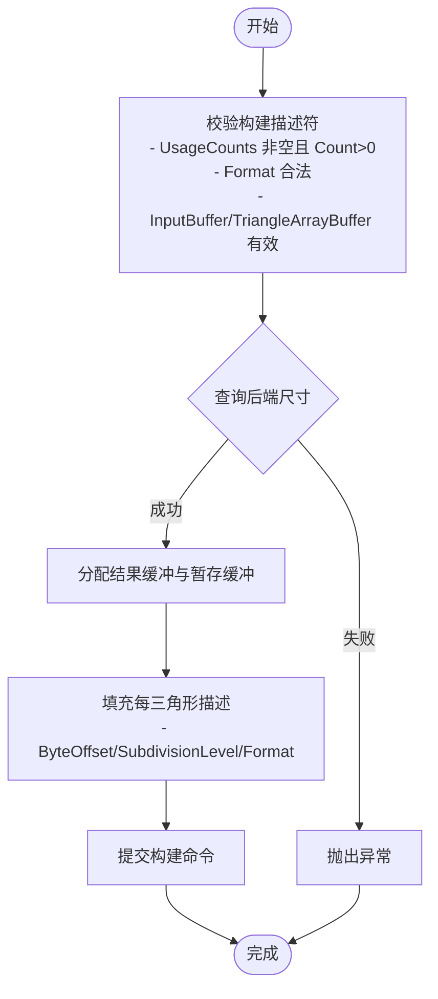
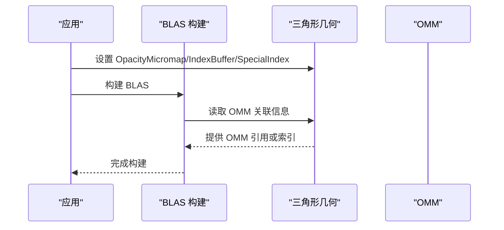
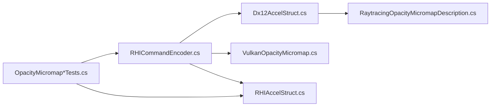

# 不透明度微图

<cite>
**本文引用的文件**
- [RHIAccelStruct.cs](file://src/SharpGPU/Abstract/RHIAccelStruct.cs)
- [VulkanOpacityMicromap.cs](file://src/SharpGPU/Vulkan/VulkanOpacityMicromap.cs)
- [Dx12AccelStruct.cs](file://src/SharpGPU/Dx12/Dx12AccelStruct.cs)
- [RHICommandEncoder.cs](file://src/SharpGPU/Abstract/RHICommandEncoder.cs)
- [RaytracingOpacityMicromapDescription.cs](file://third_party/Vortice.Windows/src/Vortice.Direct3D12/RaytracingOpacityMicromapDescription.cs)
- [OpacityMicromapPortableContractTests.cs](file://tests/SharpGPU.Conformance.Tests/OpacityMicromapPortableContractTests.cs)
- [OpacityMicromapQualificationHelper.cs](file://tests/SharpGPU.Conformance.Tests/OpacityMicromapQualificationHelper.cs)
</cite>

## 目录
1. [简介](#简介)
2. [项目结构](#项目结构)
3. [核心组件](#核心组件)
4. [架构总览](#架构总览)
5. [详细组件分析](#详细组件分析)
6. [依赖关系分析](#依赖关系分析)
7. [性能考虑](#性能考虑)
8. [故障排查指南](#故障排查指南)
9. [结论](#结论)
10. [附录](#附录)

## 简介
本文件面向使用 SharpGPU 进行光线追踪的开发者，系统性说明“不透明度微图（Opacity Micromap, OMM）”在光线追踪中的作用与实现方式。OMM 用于加速透明与半透明表面的光线求交与可见性判断，通过为三角形预计算并存储细粒度的不透明度信息，显著降低射线与复杂几何体的求交成本，提升整体渲染性能。

在本项目中，OMM 的构建、内存需求查询、压缩以及与其他后端（DirectX 12、Vulkan）的集成均有明确抽象与实现；同时提供测试用例验证接口契约与不可用后端的错误行为。

## 项目结构
围绕 OMM 的关键代码分布在以下位置：
- 抽象层定义：枚举、描述符、对象模型与校验逻辑
- 后端实现：DX12 与 Vulkan 的具体构建流程、资源分配与命令编码
- 命令编码器：统一的构建入口与能力检查
- 第三方绑定：DX12 平台上的每三角形描述结构布局
- 测试：跨后端契约与资格性测试

图表来源
- [RHIAccelStruct.cs:41-53](file://src/SharpGPU/Abstract/RHIAccelStruct.cs#L41-L53)
- [RHIAccelStruct.cs:173-206](file://src/SharpGPU/Abstract/RHIAccelStruct.cs#L173-L206)
- [RHICommandEncoder.cs:296-327](file://src/SharpGPU/Abstract/RHICommandEncoder.cs#L296-L327)
- [Dx12AccelStruct.cs:641-794](file://src/SharpGPU/Dx12/Dx12AccelStruct.cs#L641-L794)
- [VulkanOpacityMicromap.cs:202-414](file://src/SharpGPU/Vulkan/VulkanOpacityMicromap.cs#L202-L414)
- [RaytracingOpacityMicromapDescription.cs:1-29](file://third_party/Vortice.Windows/src/Vortice.Direct3D12/RaytracingOpacityMicromapDescription.cs#L1-L29)
- [OpacityMicromapPortableContractTests.cs:11-33](file://tests/SharpGPU.Conformance.Tests/OpacityMicromapPortableContractTests.cs#L11-L33)
- [OpacityMicromapQualificationHelper.cs:9-103](file://tests/SharpGPU.Conformance.Tests/OpacityMicromapQualificationHelper.cs#L9-L103)

章节来源
- [RHIAccelStruct.cs:41-53](file://src/SharpGPU/Abstract/RHIAccelStruct.cs#L41-L53)
- [RHIAccelStruct.cs:173-206](file://src/SharpGPU/Abstract/RHIAccelStruct.cs#L173-L206)
- [RHICommandEncoder.cs:296-327](file://src/SharpGPU/Abstract/RHICommandEncoder.cs#L296-L327)
- [Dx12AccelStruct.cs:641-794](file://src/SharpGPU/Dx12/Dx12AccelStruct.cs#L641-L794)
- [VulkanOpacityMicromap.cs:202-414](file://src/SharpGPU/Vulkan/VulkanOpacityMicromap.cs#L202-L414)
- [RaytracingOpacityMicromapDescription.cs:1-29](file://third_party/Vortice.Windows/src/Vortice.Direct3D12/RaytracingOpacityMicromapDescription.cs#L1-L29)
- [OpacityMicromapPortableContractTests.cs:11-33](file://tests/SharpGPU.Conformance.Tests/OpacityMicromapPortableContractTests.cs#L11-L33)
- [OpacityMicromapQualificationHelper.cs:9-103](file://tests/SharpGPU.Conformance.Tests/OpacityMicromapQualificationHelper.cs#L9-L103)

## 核心组件
- 不透明度微图格式与特殊索引
  - 支持两种格式：Oc1_2State、Oc1_4State
  - 特殊索引用于表达全透明、全不透明、未知透明/不透明等语义
- 构建描述符与使用计数直方图
  - RHIOpacityMicromapBuildDescriptor 包含输入缓冲区、三角形数组缓冲、每条目步长与标志
  - UsageCounts 指定不同细分级别与格式的计数，作为后端优化依据
- 三角形与 OMM 的关联
  - 三角形几何体可通过 OMM 对象或每三角形索引缓冲关联到具体微图
  - 支持特殊索引常量替代逐三角形索引
- 设备与命令编码器
  - 设备提供内存需求查询与创建 OMM 的工厂方法
  - 命令编码器提供统一的构建与压缩入口，并进行能力检查

章节来源
- [RHIAccelStruct.cs:41-53](file://src/SharpGPU/Abstract/RHIAccelStruct.cs#L41-L53)
- [RHIAccelStruct.cs:173-206](file://src/SharpGPU/Abstract/RHIAccelStruct.cs#L173-L206)
- [RHIAccelStruct.cs:271-298](file://src/SharpGPU/Abstract/RHIAccelStruct.cs#L271-L298)
- [RHICommandEncoder.cs:296-327](file://src/SharpGPU/Abstract/RHICommandEncoder.cs#L296-L327)

## 架构总览
下图展示从应用调用到后端实现的端到端流程，包括 DX12 与 Vulkan 两条路径。

图表来源
- [RHICommandEncoder.cs:296-327](file://src/SharpGPU/Abstract/RHICommandEncoder.cs#L296-L327)
- [Dx12AccelStruct.cs:641-794](file://src/SharpGPU/Dx12/Dx12AccelStruct.cs#L641-L794)
- [VulkanOpacityMicromap.cs:202-414](file://src/SharpGPU/Vulkan/VulkanOpacityMicromap.cs#L202-L414)

## 详细组件分析

### 数据模型与枚举
- 不透明度微图格式
  - Oc1_2State：两态不透明度（常用于高效栅格化/快速剔除）
  - Oc1_4State：四态不透明度（更精细的半透明表示）
- 特殊索引
  - FullyTransparent、FullyOpaque、FullyUnknownTransparent、FullyUnknownOpaque
- 构建描述符
  - Flag：构建标志（如允许压缩、偏好快速追踪等）
  - UsageCounts：使用计数直方图，按细分级别与格式统计
  - InputBuffer：微图数组输入缓冲（设备地址+偏移）
  - TriangleArrayBuffer：每三角形描述缓冲（设备地址+偏移+步长）
- 三角形附加
  - OpacityMicromap：直接引用 OMM 对象
  - OpacityMicromapIndexBuffer：每三角形索引缓冲（可选）
  - HasOpacityMicromapSpecialIndex + OpacityMicromapSpecialIndex：使用特殊索引常量（可选）

图表来源
- [RHIAccelStruct.cs:41-53](file://src/SharpGPU/Abstract/RHIAccelStruct.cs#L41-L53)
- [RHIAccelStruct.cs:173-206](file://src/SharpGPU/Abstract/RHIAccelStruct.cs#L173-L206)
- [RHIAccelStruct.cs:129-150](file://src/SharpGPU/Abstract/RHIAccelStruct.cs#L129-L150)

章节来源
- [RHIAccelStruct.cs:41-53](file://src/SharpGPU/Abstract/RHIAccelStruct.cs#L41-L53)
- [RHIAccelStruct.cs:129-150](file://src/SharpGPU/Abstract/RHIAccelStruct.cs#L129-L150)
- [RHIAccelStruct.cs:173-206](file://src/SharpGPU/Abstract/RHIAccelStruct.cs#L173-L206)

### 构建流程与输入缓冲区格式
- 输入缓冲区（InputBuffer）
  - 必须包含微图数组数据，且标记为 AccelStruct 构建输入只读
  - 设备地址通过 InputBufferOffset 定位
- 三角形数组缓冲（TriangleArrayBuffer）
  - 每三角形描述项，默认步长为 8 字节（DX12 对应 RaytracingOpacityMicromapDescription 的大小）
  - 可自定义步长，但需与后端期望一致
- 使用计数直方图（UsageCounts）
  - 每个条目指定 Count、SubdivisionLevel、Format
  - 至少一个条目且 Count > 0
  - Format 仅允许 Oc1_2State 或 Oc1_4State
- 构建标志
  - 可设置 AllowCompaction 以启用压缩
  - 可设置 PreferFastTrace 以提升追踪性能（后端内部映射）

图表来源
- [RHIAccelStruct.cs:222-260](file://src/SharpGPU/Abstract/RHIAccelStruct.cs#L222-L260)
- [Dx12AccelStruct.cs:696-754](file://src/SharpGPU/Dx12/Dx12AccelStruct.cs#L696-L754)
- [VulkanOpacityMicromap.cs:324-368](file://src/SharpGPU/Vulkan/VulkanOpacityMicromap.cs#L324-L368)

章节来源
- [RHIAccelStruct.cs:222-260](file://src/SharpGPU/Abstract/RHIAccelStruct.cs#L222-L260)
- [Dx12AccelStruct.cs:696-754](file://src/SharpGPU/Dx12/Dx12AccelStruct.cs#L696-L754)
- [VulkanOpacityMicromap.cs:324-368](file://src/SharpGPU/Vulkan/VulkanOpacityMicromap.cs#L324-L368)

### 不同不透明度格式与特殊索引的使用场景
- Oc1_2State
  - 适用于对性能敏感的场景，两态表示（透明/不透明），便于快速剔除
  - 适合大量简单透明表面或需要高吞吐的场景
- Oc1_4State
  - 提供更精细的半透明表示，适合复杂材质或高质量视觉效果
  - 可能带来更高的内存占用与构建成本
- 特殊索引
  - FullyTransparent：整片完全透明，可用于跳过着色或进一步剔除
  - FullyOpaque：整片完全不透明，可直接视为不透明几何
  - FullyUnknownTransparent / FullyUnknownOpaque：未知状态，交由后续阶段处理

章节来源
- [RHIAccelStruct.cs:41-53](file://src/SharpGPU/Abstract/RHIAccelStruct.cs#L41-L53)

### 不透明度微图与三角形的关联方法
- 直接关联
  - 在三角形几何中设置 OpacityMicromap 字段指向已创建的 OMM 对象
- 索引缓冲关联
  - 提供 OpacityMicromapIndexBuffer 与相关偏移/步长/格式，按三角形索引读取对应微图
- 特殊索引常量
  - 当 HasOpacityMicromapSpecialIndex 为真时，使用 OpacityMicromapSpecialIndex 作为统一常量

图表来源
- [RHIAccelStruct.cs:129-150](file://src/SharpGPU/Abstract/RHIAccelStruct.cs#L129-L150)
- [RHIAccelStruct.cs:271-298](file://src/SharpGPU/Abstract/RHIAccelStruct.cs#L271-L298)

章节来源
- [RHIAccelStruct.cs:129-150](file://src/SharpGPU/Abstract/RHIAccelStruct.cs#L129-L150)
- [RHIAccelStruct.cs:271-298](file://src/SharpGPU/Abstract/RHIAccelStruct.cs#L271-L298)

### 在加速结构中的集成方式
- 构建 OMM 后，将其作为三角形几何的一部分参与 BLAS 构建
- 在 TLAS 实例中可选择禁用 OMM 或强制特定状态（后端能力要求）
- 若实例或 BLAS 设置了 DisableOmms 标志，需确保相应能力与标志匹配

章节来源
- [RHIAccelStruct.cs:311-395](file://src/SharpGPU/Abstract/RHIAccelStruct.cs#L311-L395)

### 后端兼容性说明
- DirectX 12
  - 使用 RaytracingOpacityMicromapDescription 作为每三角形描述布局
  - 通过 PrebuildInfo 获取结果与暂存大小，构建时使用数组描述与直方图
- Vulkan
  - 通过 VK_EXT_opacity_micromap 扩展暴露 API
  - 使用 vkGetMicromapBuildSizesEXT 查询尺寸，vkCmdBuildMicromapsEXT 执行构建
- 能力检测
  - 未探测或不支持的后台将抛出 NotSupportedException
  - 公共契约测试覆盖不可用路径的行为

章节来源
- [RaytracingOpacityMicromapDescription.cs:1-29](file://third_party/Vortice.Windows/src/Vortice.Direct3D12/RaytracingOpacityMicromapDescription.cs#L1-L29)
- [VulkanOpacityMicromap.cs:157-179](file://src/SharpGPU/Vulkan/VulkanOpacityMicromap.cs#L157-L179)
- [OpacityMicromapPortableContractTests.cs:35-89](file://tests/SharpGPU.Conformance.Tests/OpacityMicromapPortableContractTests.cs#L35-L89)

## 依赖关系分析
- 抽象层依赖
  - RHICommandEncoder 提供统一构建入口，并在调用前进行能力检查
  - RHIAccelStruct 定义数据模型与校验逻辑，约束格式与描述符
- 后端实现依赖
  - DX12 依赖 Vortice.Direct3D12 的 OMM 描述结构与 PrebuildInfo
  - Vulkan 依赖 VK_EXT_opacity_micromap 扩展函数指针加载与命令编码
- 测试依赖
  - 契约测试验证公开符号存在性与不可用路径行为
  - 资格性测试提供最小可运行示例，涵盖构建与 BLAS 集成

图表来源
- [RHICommandEncoder.cs:296-327](file://src/SharpGPU/Abstract/RHICommandEncoder.cs#L296-L327)
- [Dx12AccelStruct.cs:641-794](file://src/SharpGPU/Dx12/Dx12AccelStruct.cs#L641-L794)
- [VulkanOpacityMicromap.cs:202-414](file://src/SharpGPU/Vulkan/VulkanOpacityMicromap.cs#L202-L414)
- [RaytracingOpacityMicromapDescription.cs:1-29](file://third_party/Vortice.Windows/src/Vortice.Direct3D12/RaytracingOpacityMicromapDescription.cs#L1-L29)
- [OpacityMicromapPortableContractTests.cs:11-33](file://tests/SharpGPU.Conformance.Tests/OpacityMicromapPortableContractTests.cs#L11-L33)

章节来源
- [RHICommandEncoder.cs:296-327](file://src/SharpGPU/Abstract/RHICommandEncoder.cs#L296-L327)
- [Dx12AccelStruct.cs:641-794](file://src/SharpGPU/Dx12/Dx12AccelStruct.cs#L641-L794)
- [VulkanOpacityMicromap.cs:202-414](file://src/SharpGPU/Vulkan/VulkanOpacityMicromap.cs#L202-L414)
- [RaytracingOpacityMicromapDescription.cs:1-29](file://third_party/Vortice.Windows/src/Vortice.Direct3D12/RaytracingOpacityMicromapDescription.cs#L1-L29)
- [OpacityMicromapPortableContractTests.cs:11-33](file://tests/SharpGPU.Conformance.Tests/OpacityMicromapPortableContractTests.cs#L11-L33)

## 性能考虑
- 选择合适的 OMM 格式
  - Oc1_2State 更适合高性能场景，减少内存带宽与构建开销
  - Oc1_4State 提供更精细的半透明表现，但会增加内存与构建成本
- 合理配置 UsageCounts
  - 准确统计不同细分级别与格式的用量，有助于后端优化内存布局与构建路径
- 启用压缩
  - 设置 AllowCompaction 可在构建后压缩 OMM，减少显存占用
- 避免不必要的特殊索引
  - 仅在确实需要时启用特殊索引，以减少分支与条件判断
- 后端差异
  - DX12 与 Vulkan 在尺寸查询与命令编码上略有差异，建议根据目标平台调整构建参数

[本节为通用指导，无需特定文件来源]

## 故障排查指南
- 常见错误与原因
  - 未知格式：Format 不在允许范围内会触发失败关闭策略
  - 缺少必要缓冲：InputBuffer 或 TriangleArrayBuffer 为空会导致构建失败
  - 非法 UsageCounts：Count 为零或数组为空将抛出异常
  - 能力缺失：未探测或不支持的后端将抛出 NotSupportedException
- 排查步骤
  - 确认 UsageCounts 非空且 Count > 0
  - 确认 InputBuffer 与 TriangleArrayBuffer 具备正确的用途标志
  - 检查后端能力是否满足 RayTracing.OpacityMicromap
  - 使用最小示例复现问题（参考资格性测试）

章节来源
- [RHIAccelStruct.cs:222-260](file://src/SharpGPU/Abstract/RHIAccelStruct.cs#L222-L260)
- [OpacityMicromapPortableContractTests.cs:91-149](file://tests/SharpGPU.Conformance.Tests/OpacityMicromapPortableContractTests.cs#L91-L149)

## 结论
SharpGPU 在不透明度微图方面提供了清晰的抽象与多后端实现，覆盖了从数据模型、构建流程到加速结构集成的完整链路。通过合理的格式选择、直方图配置与后端特性利用，可以在保证视觉效果的同时显著提升光线追踪性能。建议在开发过程中结合测试用例与能力检测，确保在不同平台上的兼容性与稳定性。

[本节为总结，无需特定文件来源]

## 附录
- 最小可运行示例
  - 参考资格性测试中的构建流程，包含输入缓冲、三角形数组、BLAS 构建与命令提交
- 关键 API 路径
  - 设备：GetOpacityMicromapMemoryRequirements、CreateOpacityMicromap
  - 命令编码器：BuildOpacityMicromap、CompactOpacityMicromap

章节来源
- [OpacityMicromapQualificationHelper.cs:9-103](file://tests/SharpGPU.Conformance.Tests/OpacityMicromapQualificationHelper.cs#L9-L103)
- [RHICommandEncoder.cs:296-327](file://src/SharpGPU/Abstract/RHICommandEncoder.cs#L296-L327)