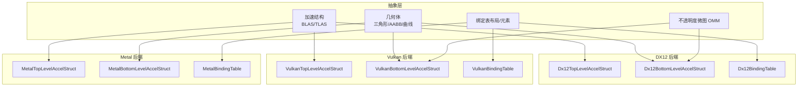
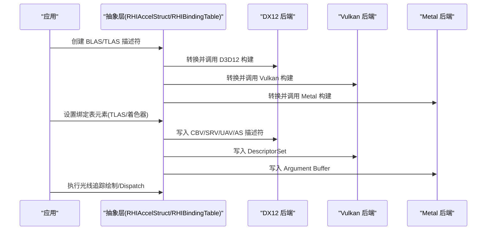
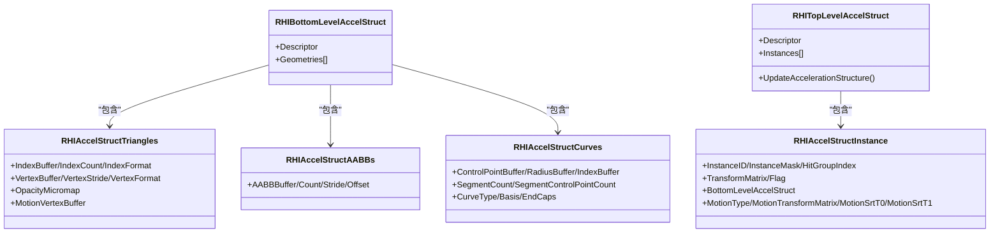
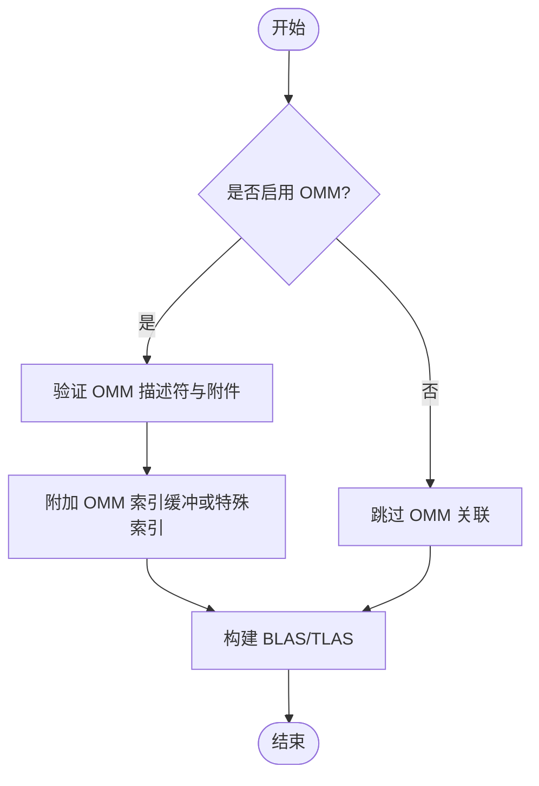
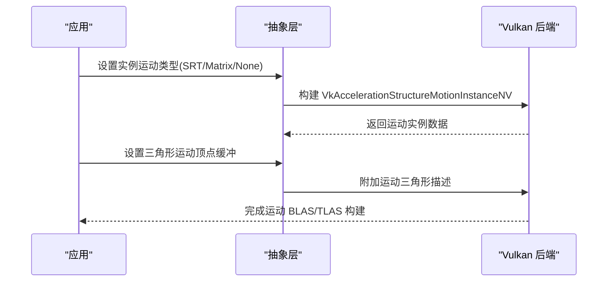
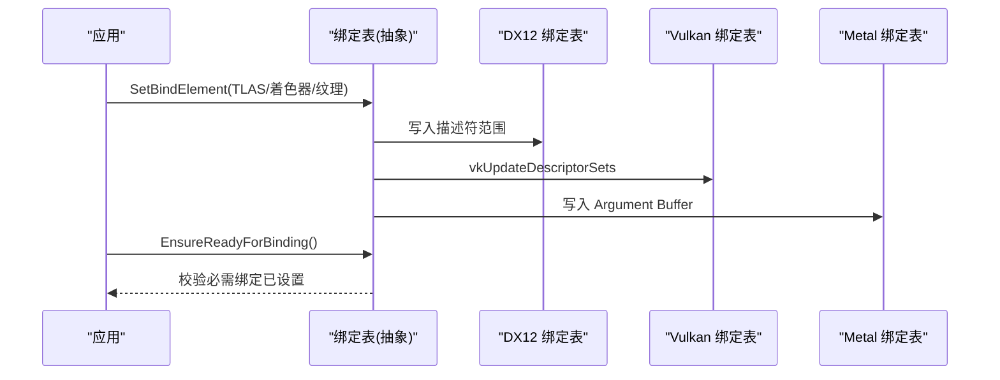
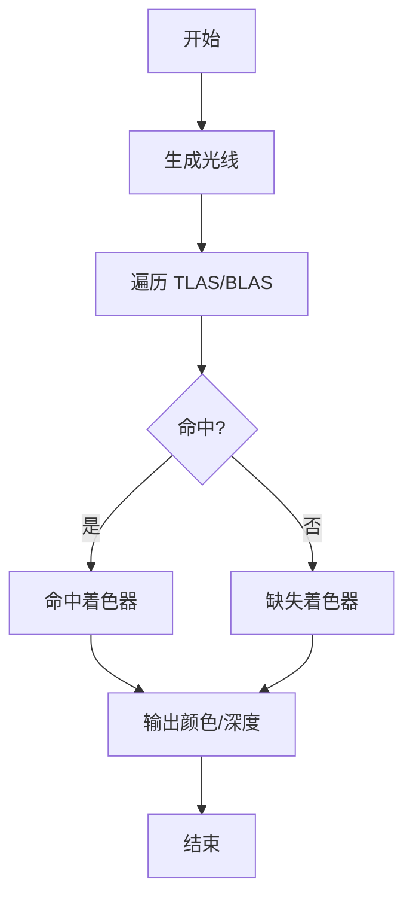
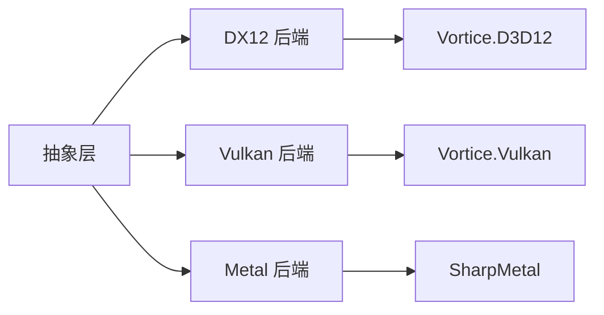

# 光线追踪

<cite>
**本文引用的文件**
- [RHIAccelStruct.cs](file://src/SharpGPU/Abstract/RHIAccelStruct.cs)
- [Dx12AccelStruct.cs](file://src/SharpGPU/Dx12/Dx12AccelStruct.cs)
- [VulkanAccelStruct.cs](file://src/SharpGPU/Vulkan/VulkanAccelStruct.cs)
- [MetalAccelStruct.cs](file://src/SharpGPU/Metal/MetalAccelStruct.cs)
- [RHIBindingTable.cs](file://src/SharpGPU/Abstract/RHIBindingTable.cs)
- [Dx12BindingTable.cs](file://src/SharpGPU/Dx12/Dx12BindingTable.cs)
- [VulkanBindingTable.cs](file://src/SharpGPU/Vulkan/VulkanBindingTable.cs)
- [MetalBindingTable.cs](file://src/SharpGPU/Metal/MetalBindingTable.cs)
</cite>

## 目录
1. [简介](#简介)
2. [项目结构](#项目结构)
3. [核心组件](#核心组件)
4. [架构总览](#架构总览)
5. [详细组件分析](#详细组件分析)
6. [依赖关系分析](#依赖关系分析)
7. [性能考虑](#性能考虑)
8. [故障排查指南](#故障排查指南)
9. [结论](#结论)
10. [附录](#附录)

## 简介
本文件面向使用 SharpGPU 进行光线追踪的开发者，系统性阐述加速结构（Acceleration Structure）的概念与使用方法，涵盖底层加速结构（BLAS）与顶层加速结构（TLAS）的创建、更新与管理；详细说明三角形、AABB、曲线等几何类型的配置方式，以及不透明度微图（Opacity Micromap, OMM）的使用；覆盖运动图形支持、实例变换、光线追踪着色器绑定表（Binding Table）等高级特性；并提供完整的光线追踪渲染管线示例流程（光线生成、命中处理、缺失处理）及不同后端（DX12、Vulkan、Metal）的能力差异与兼容性注意事项。

## 项目结构
SharpGPU 将光线追踪相关能力抽象为跨后端的统一接口，并在各后端（DX12、Vulkan、Metal）中实现具体细节：
- 抽象层定义加速结构、几何体、OMM、绑定表等通用类型与契约校验逻辑
- 后端层负责将抽象描述转换为原生 API 调用（如 D3D12 Raytracing、Vulkan Ray Tracing、Metal Acceleration Structure）
- 绑定表在各后端分别实现，用于将 BLAS/TLAS、着色器入口等绑定到管线状态

图表来源
- [RHIAccelStruct.cs:10-150](file://src/SharpGPU/Abstract/RHIAccelStruct.cs#L10-L150)
- [Dx12AccelStruct.cs:53-203](file://src/SharpGPU/Dx12/Dx12AccelStruct.cs#L53-L203)
- [VulkanAccelStruct.cs:7-413](file://src/SharpGPU/Vulkan/VulkanAccelStruct.cs#L7-L413)
- [MetalAccelStruct.cs:31-299](file://src/SharpGPU/Metal/MetalAccelStruct.cs#L31-L299)
- [RHIBindingTable.cs:12-62](file://src/SharpGPU/Abstract/RHIBindingTable.cs#L12-L62)
- [Dx12BindingTable.cs:584-703](file://src/SharpGPU/Dx12/Dx12BindingTable.cs#L584-L703)
- [VulkanBindingTable.cs:84-247](file://src/SharpGPU/Vulkan/VulkanBindingTable.cs#L84-L247)
- [MetalBindingTable.cs:141-322](file://src/SharpGPU/Metal/MetalBindingTable.cs#L141-L322)

章节来源
- [RHIAccelStruct.cs:10-150](file://src/SharpGPU/Abstract/RHIAccelStruct.cs#L10-L150)
- [RHIBindingTable.cs:12-62](file://src/SharpGPU/Abstract/RHIBindingTable.cs#L12-L62)

## 核心组件
- 加速结构
  - BLAS：封装三角形、AABB、曲线等几何体的构建与查询数据结构
  - TLAS：管理实例引用、变换、标志位，并链接到 BLAS
- 几何体
  - 三角形：顶点/索引缓冲、可选 OMM 关联
  - AABB：批量包围盒数据
  - 曲线：控制点、半径、索引、段数、基函数、端盖等
- 不透明度微图（OMM）
  - 按三角形粒度提供细粒度不透明度信息，可配合特殊索引或每三角索引缓冲
- 绑定表
  - 声明槽位、类型、可见性、是否必需
  - 将资源（包括 TLAS）写入后端特定的描述符/寄存器空间
- 运动图形
  - 实例级 SRT/矩阵关键帧、三角形运动顶点缓冲
  - 后端对运动模式的支持与限制

章节来源
- [RHIAccelStruct.cs:90-150](file://src/SharpGPU/Abstract/RHIAccelStruct.cs#L90-L150)
- [RHIAccelStruct.cs:174-206](file://src/SharpGPU/Abstract/RHIAccelStruct.cs#L174-L206)
- [RHIAccelStruct.cs:707-751](file://src/SharpGPU/Abstract/RHIAccelStruct.cs#L707-L751)
- [RHIBindingTable.cs:12-62](file://src/SharpGPU/Abstract/RHIBindingTable.cs#L12-L62)

## 架构总览
SharpGPU 在抽象层定义统一的加速结构与绑定表模型，各后端实现具体的构建与绑定流程。下图展示从应用侧到后端的整体调用链：

图表来源
- [Dx12AccelStruct.cs:70-135](file://src/SharpGPU/Dx12/Dx12AccelStruct.cs#L70-L135)
- [VulkanAccelStruct.cs:36-132](file://src/SharpGPU/Vulkan/VulkanAccelStruct.cs#L36-L132)
- [MetalAccelStruct.cs:332-347](file://src/SharpGPU/Metal/MetalAccelStruct.cs#L332-L347)
- [Dx12BindingTable.cs:584-703](file://src/SharpGPU/Dx12/Dx12BindingTable.cs#L584-L703)
- [VulkanBindingTable.cs:84-247](file://src/SharpGPU/Vulkan/VulkanBindingTable.cs#L84-L247)
- [MetalBindingTable.cs:324-461](file://src/SharpGPU/Metal/MetalBindingTable.cs#L324-L461)

## 详细组件分析

### 加速结构（BLAS/TLAS）与几何体
- BLAS
  - 三角形：支持索引/非索引、顶点格式、可选 OMM 关联、运动顶点缓冲
  - AABB：批量 AABB 缓冲、步长、偏移
  - 曲线：控制点缓冲、半径缓冲、索引缓冲、段数、每段控制点数、曲线类型/基/端盖
- TLAS
  - 实例数组：每个实例包含 ID、掩码、命中组索引、变换矩阵、标志位、BLAS 引用
  - 运动实例：支持静态、矩阵关键帧、SRT（后端差异）
  - 更新：支持增量更新（PerformUpdate），避免重建

图表来源
- [RHIAccelStruct.cs:90-150](file://src/SharpGPU/Abstract/RHIAccelStruct.cs#L90-L150)
- [RHIAccelStruct.cs:707-751](file://src/SharpGPU/Abstract/RHIAccelStruct.cs#L707-L751)

章节来源
- [RHIAccelStruct.cs:90-150](file://src/SharpGPU/Abstract/RHIAccelStruct.cs#L90-L150)
- [RHIAccelStruct.cs:707-751](file://src/SharpGPU/Abstract/RHIAccelStruct.cs#L707-L751)

### 不透明度微图（OMM）
- 用途：为三角形提供细粒度不透明度信息，提升透明/半透明场景的性能与质量
- 构建：需要输入缓冲、每三角描述缓冲、使用计数直方图
- 关联：可在三角形几何上附加 OMM 索引缓冲或特殊索引常量
- 后端差异：
  - DX12：通过 OmmTriangles 描述与 OMM 链接描述关联
  - Vulkan：通过扩展结构附加到三角形几何
  - Metal：需显式要求 OpacityMicromap 能力

图表来源
- [RHIAccelStruct.cs:174-206](file://src/SharpGPU/Abstract/RHIAccelStruct.cs#L174-L206)
- [RHIAccelStruct.cs:222-261](file://src/SharpGPU/Abstract/RHIAccelStruct.cs#L222-L261)
- [Dx12AccelStruct.cs:502-588](file://src/SharpGPU/Dx12/Dx12AccelStruct.cs#L502-L588)
- [VulkanAccelStruct.cs:734-800](file://src/SharpGPU/Vulkan/VulkanAccelStruct.cs#L734-L800)
- [MetalAccelStruct.cs:111-121](file://src/SharpGPU/Metal/MetalAccelStruct.cs#L111-L121)

章节来源
- [RHIAccelStruct.cs:174-206](file://src/SharpGPU/Abstract/RHIAccelStruct.cs#L174-L206)
- [RHIAccelStruct.cs:222-261](file://src/SharpGPU/Abstract/RHIAccelStruct.cs#L222-L261)
- [Dx12AccelStruct.cs:502-588](file://src/SharpGPU/Dx12/Dx12AccelStruct.cs#L502-L588)
- [VulkanAccelStruct.cs:734-800](file://src/SharpGPU/Vulkan/VulkanAccelStruct.cs#L734-L800)
- [MetalAccelStruct.cs:111-121](file://src/SharpGPU/Metal/MetalAccelStruct.cs#L111-L121)

### 运动图形支持
- 实例运动
  - 静态：无运动数据
  - 矩阵关键帧：T0/T1 两个矩阵
  - SRT：缩放/倾斜/旋转/平移参数（后端差异）
- 三角形运动：额外 MotionVertexBuffer，步长需与顶点步长一致（后端限制）
- 后端差异
  - DX12：支持运动 BLAS/TLAS，需设置相应标志
  - Vulkan：使用 NV 扩展结构描述运动实例与运动三角形
  - Metal：仅支持矩阵关键帧，SRT 失败关闭

图表来源
- [VulkanAccelStruct.cs:241-284](file://src/SharpGPU/Vulkan/VulkanAccelStruct.cs#L241-L284)
- [VulkanAccelStruct.cs:717-732](file://src/SharpGPU/Vulkan/VulkanAccelStruct.cs#L717-L732)
- [MetalAccelStruct.cs:369-446](file://src/SharpGPU/Metal/MetalAccelStruct.cs#L369-L446)

章节来源
- [RHIAccelStruct.cs:426-559](file://src/SharpGPU/Abstract/RHIAccelStruct.cs#L426-L559)
- [VulkanAccelStruct.cs:241-284](file://src/SharpGPU/Vulkan/VulkanAccelStruct.cs#L241-L284)
- [MetalAccelStruct.cs:369-446](file://src/SharpGPU/Metal/MetalAccelStruct.cs#L369-L446)

### 实例变换与标志位
- 变换：列主序 4x4 矩阵，映射到后端特定结构
- 标志位：三角形剔除禁用、正面朝向、强制不透明/非不透明、OMM 控制等
- 后端差异：
  - DX12：RaytracingInstanceFlags
  - Vulkan：VkGeometryInstanceFlagsKHR 及自定义位
  - Metal：选项位与掩码

章节来源
- [Dx12AccelStruct.cs:80-98](file://src/SharpGPU/Dx12/Dx12AccelStruct.cs#L80-L98)
- [VulkanAccelStruct.cs:211-239](file://src/SharpGPU/Vulkan/VulkanAccelStruct.cs#L211-L239)
- [MetalAccelStruct.cs:752-773](file://src/SharpGPU/Metal/MetalAccelStruct.cs#L752-L773)

### 光线追踪着色器绑定表（Binding Table）
- 作用：将 TLAS、着色器入口、采样器等绑定到管线状态
- 抽象：布局元素（槽位、数量、类型、阶段、是否必需）、元素（资源句柄）
- 后端实现：
  - DX12：CBV/SRV/UAV/AS 描述符堆与范围
  - Vulkan：DescriptorSetLayout 与 WriteDescriptorSet
  - Metal：Argument Buffer 与引用缓冲

图表来源
- [RHIBindingTable.cs:12-62](file://src/SharpGPU/Abstract/RHIBindingTable.cs#L12-L62)
- [Dx12BindingTable.cs:584-703](file://src/SharpGPU/Dx12/Dx12BindingTable.cs#L584-L703)
- [VulkanBindingTable.cs:84-247](file://src/SharpGPU/Vulkan/VulkanBindingTable.cs#L84-L247)
- [MetalBindingTable.cs:324-461](file://src/SharpGPU/Metal/MetalBindingTable.cs#L324-L461)

章节来源
- [RHIBindingTable.cs:12-62](file://src/SharpGPU/Abstract/RHIBindingTable.cs#L12-L62)
- [Dx12BindingTable.cs:584-703](file://src/SharpGPU/Dx12/Dx12BindingTable.cs#L584-L703)
- [VulkanBindingTable.cs:84-247](file://src/SharpGPU/Vulkan/VulkanBindingTable.cs#L84-L247)
- [MetalBindingTable.cs:324-461](file://src/SharpGPU/Metal/MetalBindingTable.cs#L324-L461)

### 光线追踪渲染管线示例
- 步骤概览
  1. 准备几何体与 OMM（如有）
  2. 构建 BLAS（三角形/AABB/曲线）
  3. 构建 TLAS（实例数组、变换、标志位、运动数据）
  4. 设置绑定表（TLAS、着色器入口、其他资源）
  5. 执行光线追踪（DispatchRays / vkCmdTraceRays / MTLRenderCommandEncoder）
  6. 着色器程序：光线生成、命中、缺失、任意命中等
- 注意：着色器源码不在本仓库中，此处仅提供调用流程与绑定要点

[此图为概念流程图，无需图表来源]

## 依赖关系分析
- 抽象层依赖：
  - 几何体与 OMM 描述由抽象层定义并校验
  - 绑定表布局与元素由抽象层定义，后端实现具体写入
- 后端依赖：
  - DX12：Vortice.Direct3D12 原生类型
  - Vulkan：Vortice.Vulkan 原生类型与扩展
  - Metal：SharpMetal 原生类型
- 耦合与内聚：
  - 抽象层保持高内聚（描述与校验），后端低耦合（仅关注原生映射）

图表来源
- [Dx12AccelStruct.cs:1-51](file://src/SharpGPU/Dx12/Dx12AccelStruct.cs#L1-L51)
- [VulkanAccelStruct.cs:1-6](file://src/SharpGPU/Vulkan/VulkanAccelStruct.cs#L1-L6)
- [MetalAccelStruct.cs:1-8](file://src/SharpGPU/Metal/MetalAccelStruct.cs#L1-L8)

章节来源
- [Dx12AccelStruct.cs:1-51](file://src/SharpGPU/Dx12/Dx12AccelStruct.cs#L1-L51)
- [VulkanAccelStruct.cs:1-6](file://src/SharpGPU/Vulkan/VulkanAccelStruct.cs#L1-L6)
- [MetalAccelStruct.cs:1-8](file://src/SharpGPU/Metal/MetalAccelStruct.cs#L1-L8)

## 性能考虑
- 构建优化
  - 使用 PreferFastBuild/PreferFastTrace 标志平衡构建与查询性能
  - 合理设置 MinimizeMemory 减少内存占用
  - 增量更新 TLAS（PerformUpdate）避免全量重建
- 几何与 OMM
  - 曲线 AABB 预计算保守包围盒，减少射线测试开销
  - OMM 细分级别与格式选择影响内存与质量
- 绑定表
  - 最小化必需绑定数量，避免多余描述符
  - 合理使用数组绑定与共享描述符范围
- 运动图形
  - 优先使用矩阵关键帧（Metal 限制）
  - 确保运动顶点步长与顶点步长一致（后端限制）

[本节为一般性指导，无需章节来源]

## 故障排查指南
- 常见错误与定位
  - OMM 附件缺失或不匹配：检查三角形几何是否附带 OMM 索引缓冲或特殊索引
  - 运动模式不一致：确保 TLAS/BLAS 标志与实际数据一致，禁止运行时切换运动模式
  - 绑定表必需项未设置：调用 EnsureReadyForBinding 前确认所有必需槽位已绑定
  - 后端能力不足：如 Metal 不支持 SRT 运动，需降级为矩阵关键帧
- 诊断建议
  - 使用后端提供的调试工具（PIX、Vulkan Validation Layers、Metal System Trace）
  - 打印/记录构建尺寸与内存需求，核对缓冲区大小
  - 逐步简化几何与实例，定位问题来源

章节来源
- [RHIAccelStruct.cs:222-261](file://src/SharpGPU/Abstract/RHIAccelStruct.cs#L222-L261)
- [RHIAccelStruct.cs:488-553](file://src/SharpGPU/Abstract/RHIAccelStruct.cs#L488-L553)
- [Dx12BindingTable.cs:650-678](file://src/SharpGPU/Dx12/Dx12BindingTable.cs#L650-L678)
- [VulkanBindingTable.cs:203-238](file://src/SharpGPU/Vulkan/VulkanBindingTable.cs#L203-L238)
- [MetalBindingTable.cs:463-485](file://src/SharpGPU/Metal/MetalBindingTable.cs#L463-L485)

## 结论
SharpGPU 通过抽象层统一了光线追踪的核心概念（BLAS/TLAS、几何体、OMM、绑定表），并在 DX12、Vulkan、Metal 三个后端实现了高效且一致的调用路径。开发者可基于该抽象快速构建复杂场景的光线追踪渲染管线，同时利用后端特定的优化能力（如增量更新、运动图形、OMM）。在实际工程中，应重点关注几何与 OMM 的配置正确性、运动模式的兼容性、绑定表的必需项完整性，以及后端能力差异带来的限制与替代方案。

[本节为总结，无需章节来源]

## 附录
- 术语
  - BLAS：底层加速结构，存储几何体
  - TLAS：顶层加速结构，管理实例与变换
  - OMM：不透明度微图，提供三角形级不透明度
  - 绑定表：将资源与着色器入口绑定到管线状态
- 参考文件路径
  - 抽象层：[RHIAccelStruct.cs](file://src/SharpGPU/Abstract/RHIAccelStruct.cs)、[RHIBindingTable.cs](file://src/SharpGPU/Abstract/RHIBindingTable.cs)
  - DX12：[Dx12AccelStruct.cs](file://src/SharpGPU/Dx12/Dx12AccelStruct.cs)、[Dx12BindingTable.cs](file://src/SharpGPU/Dx12/Dx12BindingTable.cs)
  - Vulkan：[VulkanAccelStruct.cs](file://src/SharpGPU/Vulkan/VulkanAccelStruct.cs)、[VulkanBindingTable.cs](file://src/SharpGPU/Vulkan/VulkanBindingTable.cs)
  - Metal：[MetalAccelStruct.cs](file://src/SharpGPU/Metal/MetalAccelStruct.cs)、[MetalBindingTable.cs](file://src/SharpGPU/Metal/MetalBindingTable.cs)

[本节为附录，无需章节来源]