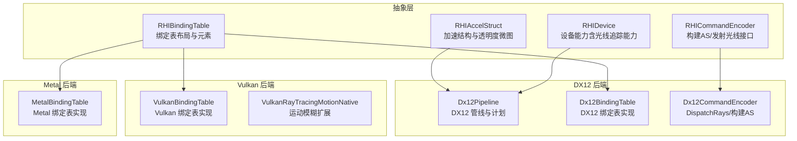
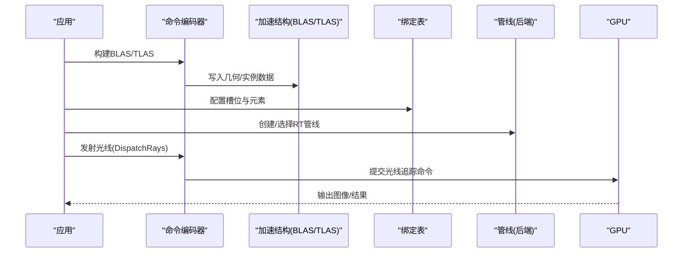
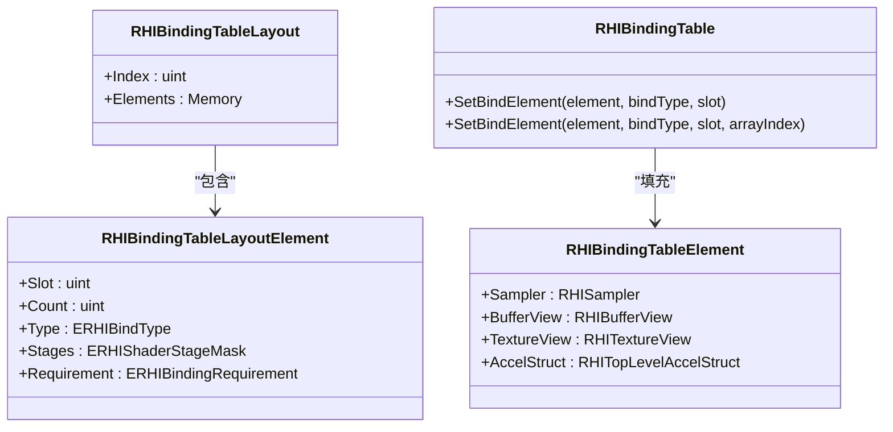
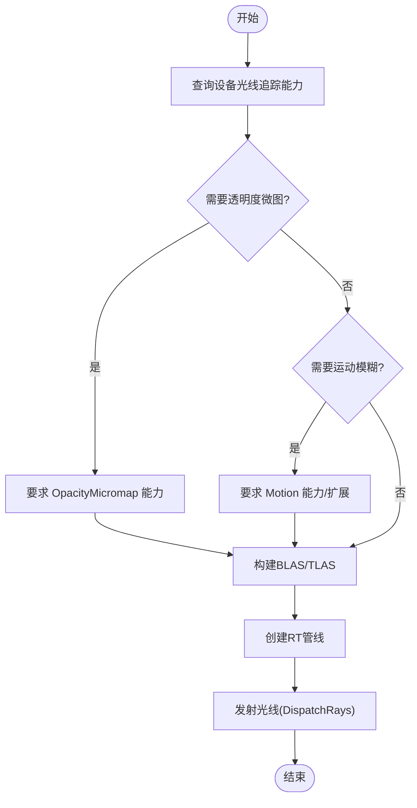
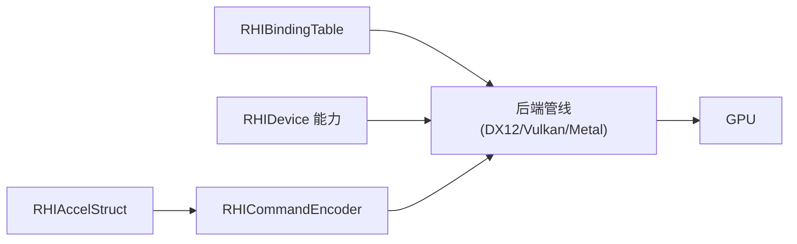

# 光线追踪管线

<cite>
**本文引用的文件**
- [RHIAccelStruct.cs](file://src/SharpGPU/Abstract/RHIAccelStruct.cs)
- [RHIBindingTable.cs](file://src/SharpGPU/Abstract/RHIBindingTable.cs)
- [RHIDevice.cs](file://src/SharpGPU/Abstract/RHIDevice.cs)
- [RHICommandEncoder.cs](file://src/SharpGPU/Abstract/RHICommandEncoder.cs)
- [Dx12Pipeline.cs](file://src/SharpGPU/Dx12/Dx12Pipeline.cs)
- [Dx12BindingTable.cs](file://src/SharpGPU/Dx12/Dx12BindingTable.cs)
- [Dx12CommandEncoder.cs](file://src/SharpGPU/Dx12/Dx12CommandEncoder.cs)
- [MetalBindingTable.cs](file://src/SharpGPU/Metal/MetalBindingTable.cs)
- [VulkanBindingTable.cs](file://src/SharpGPU/Vulkan/VulkanBindingTable.cs)
- [VulkanRayTracingMotionNative.cs](file://src/SharpGPU/Vulkan/VulkanRayTracingMotionNative.cs)
- [Program.cs（HelloDirect3D12Raytracing）](file://third_party/Vortice.Windows/samples/HelloDirect3D12Raytracing/Program.cs)
</cite>

## 目录
1. [简介](#简介)
2. [项目结构](#项目结构)
3. [核心组件](#核心组件)
4. [架构总览](#架构总览)
5. [详细组件分析](#详细组件分析)
6. [依赖关系分析](#依赖关系分析)
7. [性能考虑](#性能考虑)
8. [故障排查指南](#故障排查指南)
9. [结论](#结论)
10. [附录](#附录)

## 简介
本文件面向使用 SharpGPU 进行光线追踪开发的工程师，系统性说明光线追踪着色器程序的组织方式、绑定表与函数表的创建配置、管线状态对象构建流程，以及不同后端（DX12、Vulkan、Metal）的能力差异与限制。文档同时提供从着色器编译到管线创建的端到端示例路径指引，帮助读者快速搭建并调试光线追踪渲染流程。

## 项目结构
SharpGPU 将光线追踪相关能力抽象为跨后端的统一接口，并在各后端实现具体细节：
- 抽象层（Abstract）：定义加速结构、绑定表、设备能力、命令编码器等通用类型与接口。
- 后端实现（Dx12、Vulkan、Metal）：分别实现绑定表布局、管线构建、命令编码等。
- 第三方示例（third_party）：包含基于 Vortice 的 DX12 光线追踪最小示例，用于理解底层调用。

图表来源
- [RHIAccelStruct.cs:10-150](file://src/SharpGPU/Abstract/RHIAccelStruct.cs#L10-L150)
- [RHIBindingTable.cs:12-62](file://src/SharpGPU/Abstract/RHIBindingTable.cs#L12-L62)
- [RHIDevice.cs:1792-1813](file://src/SharpGPU/Abstract/RHIDevice.cs#L1792-L1813)
- [Dx12Pipeline.cs:14-128](file://src/SharpGPU/Dx12/Dx12Pipeline.cs#L14-L128)
- [Dx12BindingTable.cs:163-584](file://src/SharpGPU/Dx12/Dx12BindingTable.cs#L163-L584)
- [Dx12CommandEncoder.cs:2032-2126](file://src/SharpGPU/Dx12/Dx12CommandEncoder.cs#L2032-L2126)
- [VulkanBindingTable.cs:8-871](file://src/SharpGPU/Vulkan/VulkanBindingTable.cs#L8-L871)
- [VulkanRayTracingMotionNative.cs:7-157](file://src/SharpGPU/Vulkan/VulkanRayTracingMotionNative.cs#L7-L157)
- [MetalBindingTable.cs:141-502](file://src/SharpGPU/Metal/MetalBindingTable.cs#L141-L502)

章节来源
- [RHIAccelStruct.cs:10-150](file://src/SharpGPU/Abstract/RHIAccelStruct.cs#L10-L150)
- [RHIBindingTable.cs:12-62](file://src/SharpGPU/Abstract/RHIBindingTable.cs#L12-L62)
- [RHIDevice.cs:1792-1813](file://src/SharpGPU/Abstract/RHIDevice.cs#L1792-L1813)

## 核心组件
- 加速结构（BLAS/TLAS）与几何描述：定义三角形、曲线、AABB 等几何体，支持透明度微图（Opacity Micromap）与运动模糊（Motion）。
- 绑定表（Binding Table）：声明每个槽位绑定的资源类型、数量、阶段与是否必需；运行时填充具体元素（纹理视图、缓冲视图、采样器、加速结构）。
- 设备能力：暴露光线追踪能力（管线、内联、透明度微图、序列化、运动），用于在运行期判断特性可用性。
- 命令编码器：提供构建加速结构与发射光线（Dispatch Rays）的统一入口。

章节来源
- [RHIAccelStruct.cs:90-150](file://src/SharpGPU/Abstract/RHIAccelStruct.cs#L90-L150)
- [RHIBindingTable.cs:12-62](file://src/SharpGPU/Abstract/RHIBindingTable.cs#L12-L62)
- [RHIDevice.cs:1792-1813](file://src/SharpGPU/Abstract/RHIDevice.cs#L1792-L1813)
- [RHICommandEncoder.cs:294-295](file://src/SharpGPU/Abstract/RHICommandEncoder.cs#L294-L295)

## 架构总览
下图展示了从应用层到后端的光线追踪执行流：应用通过命令编码器构建 BLAS/TLAS，设置绑定表与管线，最终发出 DispatchRays 触发光线追踪执行。

图表来源
- [RHICommandEncoder.cs:294-295](file://src/SharpGPU/Abstract/RHICommandEncoder.cs#L294-L295)
- [Dx12CommandEncoder.cs:2032-2126](file://src/SharpGPU/Dx12/Dx12CommandEncoder.cs#L2032-L2126)
- [RHIAccelStruct.cs:722-751](file://src/SharpGPU/Abstract/RHIAccelStruct.cs#L722-L751)
- [RHIBindingTable.cs:44-62](file://src/SharpGPU/Abstract/RHIBindingTable.cs#L44-L62)

## 详细组件分析

### 光线追踪着色器程序组织
- 光线生成着色器（Ray Generation）：负责生成初始光线（如每像素一条），通常由 DispatchRays 启动。
- 命中着色器（Hit）：处理几何命中后的着色计算。
- 缺失着色器（Miss）：处理未命中时的背景或环境光计算。
- 任意命中着色器（Any Hit）：用于自定义早期剔除或透明度混合逻辑。
- 可调用着色器（Callable）：支持递归或共享计算，常用于全局光照、反射等。

在 SharpGPU 中，这些着色器通过“函数表”和“绑定表”关联到具体的导出名与记录项，并由后端管线对象管理调度。

章节来源
- [RHIBindingTable.cs:12-62](file://src/SharpGPU/Abstract/RHIBindingTable.cs#L12-L62)
- [Dx12Pipeline.cs:14-128](file://src/SharpGPU/Dx12/Dx12Pipeline.cs#L14-L128)

### 绑定表（Binding Table）的创建与配置
- 布局定义：通过 RHIBindingTableLayoutDescriptor 指定索引、槽位、类型、阶段与是否必需。
- 元素填充：RHIBindingTableElement 承载采样器、缓冲视图、纹理视图、加速结构等资源。
- 后端实现：
  - DX12：Dx12BindingTableLayout/Dx12BindingTable 负责组规划与存储布局。
  - Vulkan：VulkanBindingTableLayout/VulkanBindingTable 映射至 SBT 记录。
  - Metal：MetalBindingTableLayout/MetalBindingTable 完成绑定计划。

图表来源
- [RHIBindingTable.cs:12-62](file://src/SharpGPU/Abstract/RHIBindingTable.cs#L12-L62)
- [Dx12BindingTable.cs:163-584](file://src/SharpGPU/Dx12/Dx12BindingTable.cs#L163-L584)
- [VulkanBindingTable.cs:8-871](file://src/SharpGPU/Vulkan/VulkanBindingTable.cs#L8-L871)
- [MetalBindingTable.cs:141-502](file://src/SharpGPU/Metal/MetalBindingTable.cs#L141-L502)

章节来源
- [RHIBindingTable.cs:12-62](file://src/SharpGPU/Abstract/RHIBindingTable.cs#L12-L62)
- [Dx12BindingTable.cs:163-584](file://src/SharpGPU/Dx12/Dx12BindingTable.cs#L163-L584)
- [VulkanBindingTable.cs:8-871](file://src/SharpGPU/Vulkan/VulkanBindingTable.cs#L8-L871)
- [MetalBindingTable.cs:141-502](file://src/SharpGPU/Metal/MetalBindingTable.cs#L141-L502)

### 函数表（Function Table）的设置方法
- 函数表将着色器导出名映射到 SBT 记录偏移，供光线追踪调度时查找。
- 在 DX12 中，通过 State Object/Subobject 将导出名与记录项关联；在 Vulkan 中，通过 SBT 记录中的偏移字段指向对应着色器。
- SharpGPU 在后端绑定表实现中封装了这些细节，用户只需按布局声明槽位与类型，并填充元素即可。

章节来源
- [Dx12Pipeline.cs:14-128](file://src/SharpGPU/Dx12/Dx12Pipeline.cs#L14-L128)
- [VulkanBindingTable.cs:8-871](file://src/SharpGPU/Vulkan/VulkanBindingTable.cs#L8-L871)

### 光线追踪描述符与根签名配置
- 根签名（Root Signature）用于声明常量、SRV/UAV/CBV 等资源的绑定方式，确保着色器能访问所需数据。
- 光线追踪描述符（如 DX12 的 Raytracing Pipeline Config）用于指定最大递归深度、SRT 大小、SBT 大小等。
- SharpGPU 在后端管线构建过程中自动组合这些配置，用户通过高层 API 控制关键参数。

章节来源
- [Dx12Pipeline.cs:14-128](file://src/SharpGPU/Dx12/Dx12Pipeline.cs#L14-L128)

### 管线状态对象的创建过程
- 步骤概览：
  1) 准备着色器字节码与导出名。
  2) 定义绑定表布局与元素。
  3) 创建/更新 BLAS 与 TLAS。
  4) 构建光线追踪管线（包含根签名、状态对象、递归深度等）。
  5) 在命令缓冲区中提交构建与发射光线命令。
- 后端差异：
  - DX12：使用 StateObjectDescription/RaytracingPipelineConfig 组合。
  - Vulkan：通过管线创建标志与扩展（如运动模糊）启用特性。
  - Metal：通过 Metal 特定 API 构建管线与绑定表。

章节来源
- [Dx12Pipeline.cs:14-128](file://src/SharpGPU/Dx12/Dx12Pipeline.cs#L14-L128)
- [VulkanRayTracingMotionNative.cs:7-157](file://src/SharpGPU/Vulkan/VulkanRayTracingMotionNative.cs#L7-L157)

### 完整的光线追踪渲染示例（从着色器编译到管线创建）
- 参考路径：
  - 示例入口：[Program.cs（HelloDirect3D12Raytracing）](file://third_party/Vortice.Windows/samples/HelloDirect3D12Raytracing/Program.cs)
  - 命令编码与 DispatchRays：[Dx12CommandEncoder.cs:2032-2126](file://src/SharpGPU/Dx12/Dx12CommandEncoder.cs#L2032-L2126)
  - 绑定表与布局：[Dx12BindingTable.cs:163-584](file://src/SharpGPU/Dx12/Dx12BindingTable.cs#L163-L584)
  - 管线计划与构建：[Dx12Pipeline.cs:14-128](file://src/SharpGPU/Dx12/Dx12Pipeline.cs#L14-L128)
- 典型流程：
  1) 编译着色器并获取导出名。
  2) 创建绑定表布局与元素，填充加速结构引用。
  3) 构建 BLAS/TLAS，必要时启用透明度微图或运动模糊。
  4) 创建 RT 管线（设置递归深度、SBT 大小等）。
  5) 在命令缓冲区中提交构建与 DispatchRays。
  6) 读取输出纹理并呈现。

章节来源
- [Program.cs（HelloDirect3D12Raytracing）:1-35](file://third_party/Vortice.Windows/samples/HelloDirect3D12Raytracing/Program.cs#L1-L35)
- [Dx12CommandEncoder.cs:2032-2126](file://src/SharpGPU/Dx12/Dx12CommandEncoder.cs#L2032-L2126)
- [Dx12BindingTable.cs:163-584](file://src/SharpGPU/Dx12/Dx12BindingTable.cs#L163-L584)
- [Dx12Pipeline.cs:14-128](file://src/SharpGPU/Dx12/Dx12Pipeline.cs#L14-L128)

### 不同后端的光线追踪能力差异与限制
- 能力查询：通过 RHIDevice.RayTracingCapabilities 获取管线、内联、透明度微图、序列化、运动等能力。
- DX12：
  - 通过 State Object 与 Root Signature 管理管线与绑定。
  - 支持透明度微图与运动模糊（取决于驱动/系统）。
- Vulkan：
  - 通过扩展（如 VK_NV_ray_tracing_motion_blur）启用运动模糊。
  - 需要检查 vkGetAccelerationStructureBuildSizesKHR、vkCmdBuildAccelerationStructuresKHR 等导出。
- Metal：
  - 绑定表与管线构建遵循 Metal 特定 API。
  - 能力受平台与驱动支持影响。

图表来源
- [RHIDevice.cs:1792-1813](file://src/SharpGPU/Abstract/RHIDevice.cs#L1792-L1813)
- [VulkanRayTracingMotionNative.cs:122-153](file://src/SharpGPU/Vulkan/VulkanRayTracingMotionNative.cs#L122-L153)

章节来源
- [RHIDevice.cs:1792-1813](file://src/SharpGPU/Abstract/RHIDevice.cs#L1792-L1813)
- [VulkanRayTracingMotionNative.cs:122-153](file://src/SharpGPU/Vulkan/VulkanRayTracingMotionNative.cs#L122-L153)

## 依赖关系分析
- 抽象层依赖：
  - 加速结构（RHIAccelStruct）被命令编码器用于构建 BLAS/TLAS。
  - 绑定表（RHIBindingTable）被管线与命令编码器用于调度着色器与资源。
  - 设备能力（RHIDevice）用于特性探测与分支。
- 后端实现：
  - DX12：Dx12Pipeline/Dx12BindingTable/Dx12CommandEncoder 组合完成管线与命令。
  - Vulkan：VulkanBindingTable 与 VulkanRayTracingMotionNative 处理扩展与特性。
  - Metal：MetalBindingTable 完成绑定计划与管线构建。

图表来源
- [RHIAccelStruct.cs:722-751](file://src/SharpGPU/Abstract/RHIAccelStruct.cs#L722-L751)
- [RHICommandEncoder.cs:294-295](file://src/SharpGPU/Abstract/RHICommandEncoder.cs#L294-L295)
- [RHIDevice.cs:1792-1813](file://src/SharpGPU/Abstract/RHIDevice.cs#L1792-L1813)
- [Dx12Pipeline.cs:14-128](file://src/SharpGPU/Dx12/Dx12Pipeline.cs#L14-L128)

章节来源
- [RHIAccelStruct.cs:722-751](file://src/SharpGPU/Abstract/RHIAccelStruct.cs#L722-L751)
- [RHICommandEncoder.cs:294-295](file://src/SharpGPU/Abstract/RHICommandEncoder.cs#L294-L295)
- [RHIDevice.cs:1792-1813](file://src/SharpGPU/Abstract/RHIDevice.cs#L1792-L1813)
- [Dx12Pipeline.cs:14-128](file://src/SharpGPU/Dx12/Dx12Pipeline.cs#L14-L128)

## 性能考虑
- 加速结构构建：
  - 合理设置 BLAS/TLAS 标志（如 PreferFastTrace/PreferFastBuild）以平衡构建与查询性能。
  - 使用透明度微图减少透明几何体的光线求交开销。
- 绑定表优化：
  - 最小化槽位数量与数组长度，避免不必要的可选绑定。
  - 复用绑定表布局，减少重建成本。
- 管线与命令：
  - 批量构建与发射光线，减少状态切换。
  - 利用统计查询（RayTracingPipelineStatistics）评估瓶颈。

[本节为通用指导，不直接分析具体文件]

## 故障排查指南
- 常见错误与定位：
  - 透明度微图相关：
    - 若附加透明度微图但未提供每三角索引或特殊索引，会抛出异常。
    - 需确保输入缓冲包含 AccelStruct 使用标志。
  - 运动模糊相关：
    - 若启用运动但无运动数据，或反之，会抛出参数异常。
    - Vulkan 需检查运动模糊扩展导出函数是否存在。
  - 绑定表相关：
    - 槽位类型与元素不匹配会导致后端绑定失败。
- 建议步骤：
  1) 检查设备能力（OpacityMicromap、Motion）是否满足需求。
  2) 验证加速结构描述符与几何数据一致性。
  3) 确认绑定表布局与元素类型一致。
  4) 在 DX12 中使用对象跟踪与验证层辅助定位问题。

章节来源
- [RHIAccelStruct.cs:222-261](file://src/SharpGPU/Abstract/RHIAccelStruct.cs#L222-L261)
- [RHIAccelStruct.cs:488-509](file://src/SharpGPU/Abstract/RHIAccelStruct.cs#L488-L509)
- [VulkanRayTracingMotionNative.cs:122-153](file://src/SharpGPU/Vulkan/VulkanRayTracingMotionNative.cs#L122-L153)

## 结论
SharpGPU 提供了跨后端的光线追踪抽象与实现，涵盖加速结构、绑定表、管线构建与命令编码。通过统一的 API，开发者可以在 DX12、Vulkan、Metal 上构建高效的光线追踪管线，并利用透明度微图与运动模糊等高级特性。建议在开发初期明确能力需求，合理规划绑定表与管线配置，结合统计查询持续优化性能。

[本节为总结性内容，不直接分析具体文件]

## 附录
- 参考示例路径：
  - HelloDirect3D12Raytracing 入口：[Program.cs](file://third_party/Vortice.Windows/samples/HelloDirect3D12Raytracing/Program.cs)
  - 命令编码与 DispatchRays：[Dx12CommandEncoder.cs](file://src/SharpGPU/Dx12/Dx12CommandEncoder.cs)
  - 绑定表实现：[Dx12BindingTable.cs](file://src/SharpGPU/Dx12/Dx12BindingTable.cs)、[VulkanBindingTable.cs](file://src/SharpGPU/Vulkan/VulkanBindingTable.cs)、[MetalBindingTable.cs](file://src/SharpGPU/Metal/MetalBindingTable.cs)
  - 管线构建：[Dx12Pipeline.cs](file://src/SharpGPU/Dx12/Dx12Pipeline.cs)
- 关键数据结构路径：
  - 加速结构描述与实例：[RHIAccelStruct.cs](file://src/SharpGPU/Abstract/RHIAccelStruct.cs)
  - 绑定表布局与元素：[RHIBindingTable.cs](file://src/SharpGPU/Abstract/RHIBindingTable.cs)
  - 设备能力：[RHIDevice.cs](file://src/SharpGPU/Abstract/RHIDevice.cs)

[本节为附录信息，不直接分析具体文件]