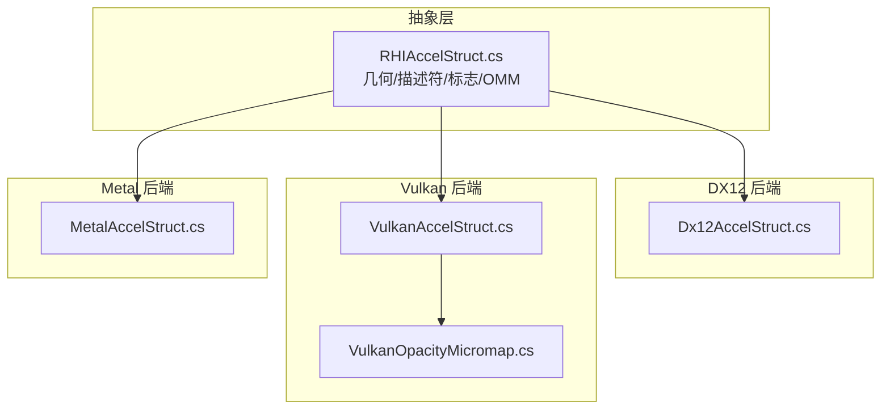
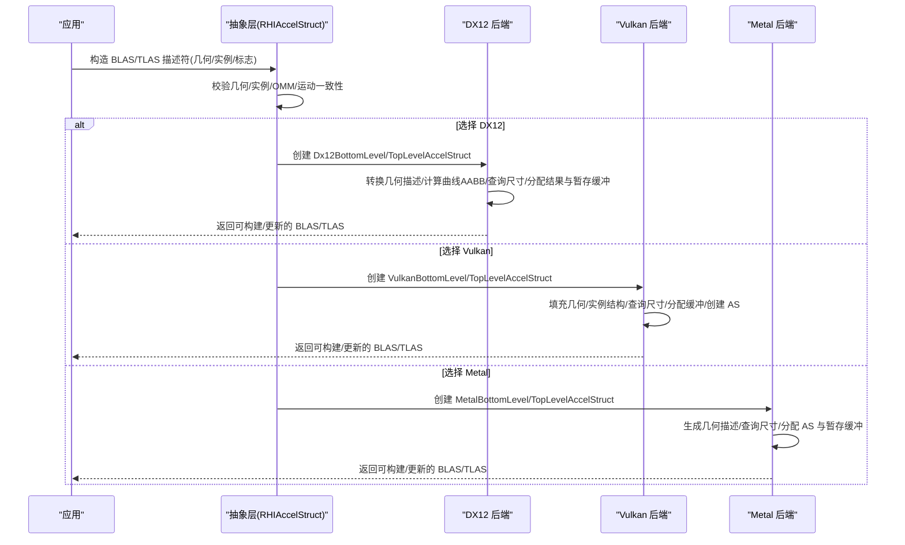
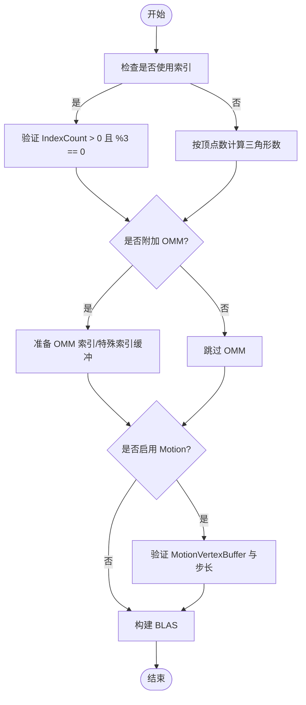
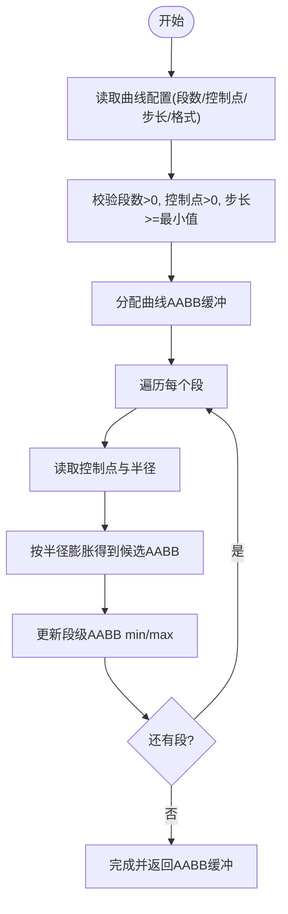
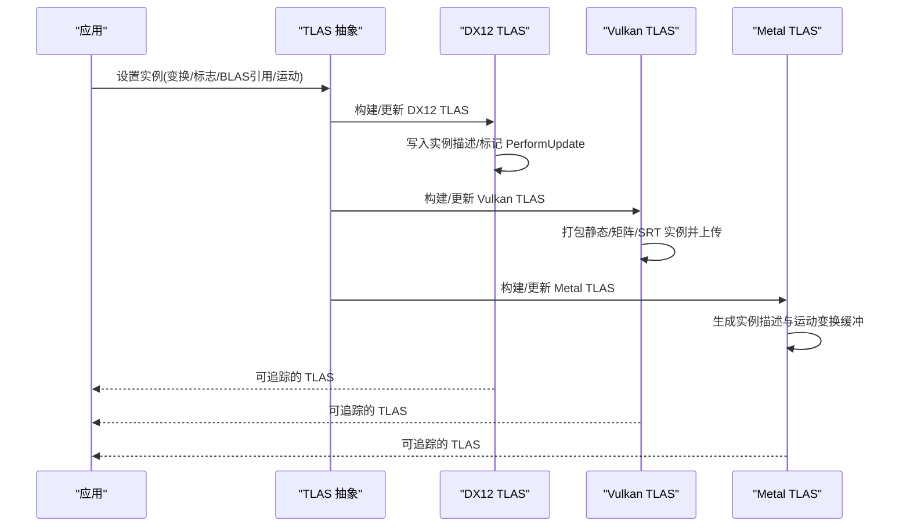
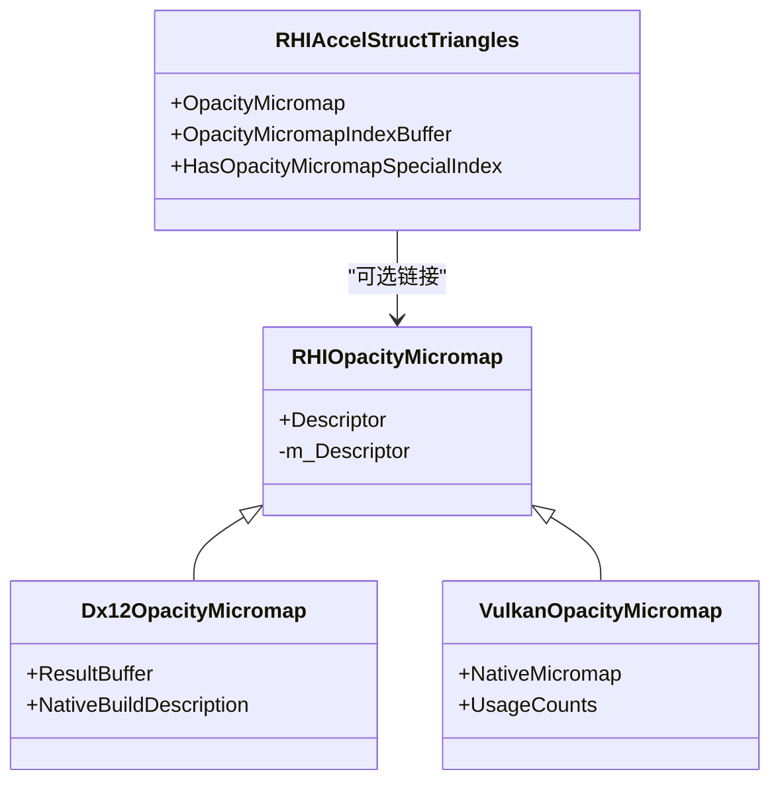
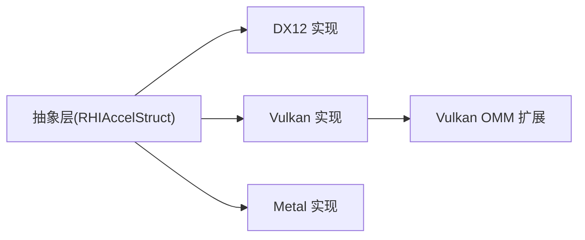

# 加速结构

<cite>
**本文引用的文件**
- [RHIAccelStruct.cs](file://src/SharpGPU/Abstract/RHIAccelStruct.cs)
- [Dx12AccelStruct.cs](file://src/SharpGPU/Dx12/Dx12AccelStruct.cs)
- [VulkanAccelStruct.cs](file://src/SharpGPU/Vulkan/VulkanAccelStruct.cs)
- [MetalAccelStruct.cs](file://src/SharpGPU/Metal/MetalAccelStruct.cs)
- [VulkanOpacityMicromap.cs](file://src/SharpGPU/Vulkan/VulkanOpacityMicromap.cs)
</cite>

## 目录
1. [简介](#简介)
2. [项目结构](#项目结构)
3. [核心组件](#核心组件)
4. [架构总览](#架构总览)
5. [详细组件分析](#详细组件分析)
6. [依赖关系分析](#依赖关系分析)
7. [性能考量](#性能考量)
8. [故障排查指南](#故障排查指南)
9. [结论](#结论)
10. [附录](#附录)

## 简介
本文件系统性说明 SharpGPU 中的加速结构（Acceleration Structure, AS）实现，覆盖底层加速结构（BLAS）与顶层加速结构（TLAS）的概念、创建流程与管理方式；详述三角形、AABB、曲线等几何类型的配置方法（顶点缓冲区、索引缓冲区、控制点缓冲区的设置）；解释加速结构标志位（AllowUpdate、PreferFastTrace、Motion 等）对构建与追踪性能的影响；并提供实例变换、运动图形支持、不透明度微图（Opacity Micromap, OMM）等特殊功能的配置与使用示例。最后给出 DX12、Vulkan、Metal 三大后端的兼容性说明与最佳实践建议。

## 项目结构
SharpGPU 将加速结构抽象为跨后端接口，并在各后端提供具体实现：
- 抽象层：定义几何类型、描述符、标志位、OMM 数据结构以及 BLAS/TLAS 的抽象基类与校验契约。
- 后端实现：
  - DX12：通过 Vortice.Direct3D12 调用 DXR 构建 BLAS/TLAS，并处理曲线 AABB 预计算与 OMM 链接。
  - Vulkan：通过 VK_KHR_acceleration_structure 与扩展（如 VK_EXT_opacity_micromap、NV 运动扩展）完成构建与更新。
  - Metal：通过 MTLAccelerationStructure API 构建 BLAS/TLAS，并对运动实例采用矩阵关键帧。

图表来源
- [RHIAccelStruct.cs:10-150](file://src/SharpGPU/Abstract/RHIAccelStruct.cs#L10-L150)
- [Dx12AccelStruct.cs:53-220](file://src/SharpGPU/Dx12/Dx12AccelStruct.cs#L53-L220)
- [VulkanAccelStruct.cs:7-140](file://src/SharpGPU/Vulkan/VulkanAccelStruct.cs#L7-L140)
- [MetalAccelStruct.cs:31-110](file://src/SharpGPU/Metal/MetalAccelStruct.cs#L31-L110)
- [VulkanOpacityMicromap.cs:202-311](file://src/SharpGPU/Vulkan/VulkanOpacityMicromap.cs#L202-L311)

章节来源
- [RHIAccelStruct.cs:10-150](file://src/SharpGPU/Abstract/RHIAccelStruct.cs#L10-L150)
- [Dx12AccelStruct.cs:53-220](file://src/SharpGPU/Dx12/Dx12AccelStruct.cs#L53-L220)
- [VulkanAccelStruct.cs:7-140](file://src/SharpGPU/Vulkan/VulkanAccelStruct.cs#L7-L140)
- [MetalAccelStruct.cs:31-110](file://src/SharpGPU/Metal/MetalAccelStruct.cs#L31-L110)
- [VulkanOpacityMicromap.cs:202-311](file://src/SharpGPU/Vulkan/VulkanOpacityMicromap.cs#L202-L311)

## 核心组件
- 几何类型与描述符
  - 三角形：包含顶点/索引缓冲区、可选 OMM 索引或特殊索引、可选运动顶点缓冲。
  - AABB：包含 AABB 缓冲区、计数、步长与偏移。
  - 曲线：包含控制点缓冲区、半径缓冲区、可选索引缓冲区、段数、每段控制点数、曲线类型/基函数/端盖。
- 实例与 TLAS
  - 实例包含 ID、掩码、命中组索引、变换矩阵、标志位、引用 BLAS、运动类型及数据。
  - TLAS 描述符包含实例数组、偏移与标志位。
- BLAS 与 OMM
  - BLAS 描述符包含几何数组与标志位。
  - OMM 构建描述符包含用法直方图、输入缓冲、三角形数组缓冲等。
- 标志位
  - 加速结构标志：AllowUpdate、PerformUpdate、MinimizeMemory、PreferFastTrace、PreferFastBuild、AllowCompaction、AllowDisableOmms、Motion。
  - 几何标志：Opaque、NoDuplicateAnyhitInverseOcclusion。
  - 实例标志：TriangleCullDisable、TriangleFrontCounterclockwise、ForceOpaque、ForceNonOpaque、ForceOmm2State、DisableOmms。

章节来源
- [RHIAccelStruct.cs:10-150](file://src/SharpGPU/Abstract/RHIAccelStruct.cs#L10-L150)
- [RHIAccelStruct.cs:707-735](file://src/SharpGPU/Abstract/RHIAccelStruct.cs#L707-L735)
- [RHIAccelStruct.cs:174-206](file://src/SharpGPU/Abstract/RHIAccelStruct.cs#L174-L206)

## 架构总览
下图展示从应用层到各后端的具体构建流程，包括几何描述、缓冲区绑定、尺寸查询、资源分配与构建/更新。

图表来源
- [Dx12AccelStruct.cs:53-220](file://src/SharpGPU/Dx12/Dx12AccelStruct.cs#L53-L220)
- [VulkanAccelStruct.cs:7-140](file://src/SharpGPU/Vulkan/VulkanAccelStruct.cs#L7-L140)
- [MetalAccelStruct.cs:31-110](file://src/SharpGPU/Metal/MetalAccelStruct.cs#L31-L110)

## 详细组件分析

### BLAS：三角形几何
- 配置要点
  - 顶点缓冲：指定起始地址、步长、格式；DX12 中若为 float4 布局需显式以 xyz 视图+步长兼容 DXR。
  - 索引缓冲（可选）：指定格式、偏移、数量（必须能被 3 整除）。
  - OMM 附件（可选）：需要 OMM 对象与每三角形索引缓冲或特殊索引常量；DX12/Vulkan 会创建临时特殊索引缓冲并链接到几何。
  - 运动顶点缓冲（可选）：当启用 Motion 标志且存在运动数据时需提供 MotionVertexBuffer，且 MotionVertexStride 需与 VertexStride 一致。
- 构建流程
  - 抽象层校验几何意图与 OMM/运动附件。
  - 后端根据几何类型填充原生描述（DX12 RaytracingGeometryTrianglesDescription / Vulkan VkAccelerationStructureGeometryTrianglesDataKHR / Metal MTLAccelerationStructureTriangleGeometryDescriptor）。
  - 查询构建尺寸并分配结果与暂存缓冲。

图表来源
- [RHIAccelStruct.cs:398-424](file://src/SharpGPU/Abstract/RHIAccelStruct.cs#L398-L424)
- [RHIAccelStruct.cs:511-544](file://src/SharpGPU/Abstract/RHIAccelStruct.cs#L511-L544)
- [Dx12AccelStruct.cs:264-304](file://src/SharpGPU/Dx12/Dx12AccelStruct.cs#L264-L304)
- [VulkanAccelStruct.cs:469-539](file://src/SharpGPU/Vulkan/VulkanAccelStruct.cs#L469-L539)
- [MetalAccelStruct.cs:111-207](file://src/SharpGPU/Metal/MetalAccelStruct.cs#L111-L207)

章节来源
- [RHIAccelStruct.cs:398-424](file://src/SharpGPU/Abstract/RHIAccelStruct.cs#L398-L424)
- [RHIAccelStruct.cs:511-544](file://src/SharpGPU/Abstract/RHIAccelStruct.cs#L511-L544)
- [Dx12AccelStruct.cs:264-304](file://src/SharpGPU/Dx12/Dx12AccelStruct.cs#L264-L304)
- [VulkanAccelStruct.cs:469-539](file://src/SharpGPU/Vulkan/VulkanAccelStruct.cs#L469-L539)
- [MetalAccelStruct.cs:111-207](file://src/SharpGPU/Metal/MetalAccelStruct.cs#L111-L207)

### BLAS：AABB 几何
- 配置要点
  - AABB 缓冲：包含最小/最大坐标，指定计数、步长与偏移。
  - 几何标志：可设置 Opaque。
- 构建流程
  - 抽象层校验几何类型与缓冲有效性。
  - 后端填充 AABB 几何描述并参与尺寸查询与资源分配。

章节来源
- [RHIAccelStruct.cs:97-103](file://src/SharpGPU/Abstract/RHIAccelStruct.cs#L97-L103)
- [Dx12AccelStruct.cs:248-262](file://src/SharpGPU/Dx12/Dx12AccelStruct.cs#L248-L262)
- [VulkanAccelStruct.cs:540-562](file://src/SharpGPU/Vulkan/VulkanAccelStruct.cs#L540-L562)
- [MetalAccelStruct.cs:209-225](file://src/SharpGPU/Metal/MetalAccelStruct.cs#L209-L225)

### BLAS：曲线几何
- 配置要点
  - 控制点缓冲：位置数据，指定偏移、计数、步长与格式。
  - 半径缓冲：每控制点半径，指定偏移、步长与格式。
  - 索引缓冲（可选）：用于按段索引控制点。
  - 段信息：SegmentCount、SegmentControlPointCount、CurveType/Basis/EndCaps。
- 构建流程
  - 后端在构建前计算保守 AABB（基于控制点与半径膨胀），写入临时 AABB 缓冲供 BLAS 使用。
  - 校验段数与控制点计数非零，步长满足最小要求。

图表来源
- [Dx12AccelStruct.cs:306-401](file://src/SharpGPU/Dx12/Dx12AccelStruct.cs#L306-L401)
- [Dx12AccelStruct.cs:424-500](file://src/SharpGPU/Dx12/Dx12AccelStruct.cs#L424-L500)
- [VulkanAccelStruct.cs:563-660](file://src/SharpGPU/Vulkan/VulkanAccelStruct.cs#L563-L660)
- [MetalAccelStruct.cs:227-266](file://src/SharpGPU/Metal/MetalAccelStruct.cs#L227-L266)

章节来源
- [Dx12AccelStruct.cs:306-401](file://src/SharpGPU/Dx12/Dx12AccelStruct.cs#L306-L401)
- [Dx12AccelStruct.cs:424-500](file://src/SharpGPU/Dx12/Dx12AccelStruct.cs#L424-L500)
- [VulkanAccelStruct.cs:563-660](file://src/SharpGPU/Vulkan/VulkanAccelStruct.cs#L563-L660)
- [MetalAccelStruct.cs:227-266](file://src/SharpGPU/Metal/MetalAccelStruct.cs#L227-L266)

### TLAS：实例与变换
- 实例字段
  - InstanceID、InstanceMask、HitGroupIndex、TransformMatrix、Flag、BottomLevelAccelStruct、MotionType、MotionTransformMatrix、Srt 变换（T0/T1）。
- 变换与运动
  - 静态：仅 TransformMatrix。
  - 矩阵运动：提供 T0 与 T1 矩阵（DX12/Vulkan/Metal 均支持矩阵关键帧）。
  - SRT 运动：Vulkan 支持 SRT 运动实例；Metal 不支持 SRT（失败关闭）。
- 构建/更新
  - 首次构建：填充实例描述/运动实例数据，查询尺寸并创建 AS。
  - 更新：仅上传实例数据（必要时重新计算尺寸并重建 AS 资源，Metal 路径会替换状态）。

图表来源
- [Dx12AccelStruct.cs:53-190](file://src/SharpGPU/Dx12/Dx12AccelStruct.cs#L53-L190)
- [VulkanAccelStruct.cs:7-141](file://src/SharpGPU/Vulkan/VulkanAccelStruct.cs#L7-L141)
- [MetalAccelStruct.cs:301-492](file://src/SharpGPU/Metal/MetalAccelStruct.cs#L301-L492)

章节来源
- [RHIAccelStruct.cs:707-735](file://src/SharpGPU/Abstract/RHIAccelStruct.cs#L707-L735)
- [Dx12AccelStruct.cs:53-190](file://src/SharpGPU/Dx12/Dx12AccelStruct.cs#L53-L190)
- [VulkanAccelStruct.cs:7-141](file://src/SharpGPU/Vulkan/VulkanAccelStruct.cs#L7-L141)
- [MetalAccelStruct.cs:301-492](file://src/SharpGPU/Metal/MetalAccelStruct.cs#L301-L492)

### 不透明度微图（OMM）
- 概念与作用
  - OMM 用于表达三角形的透明度分布，可在光线求交阶段加速透明/半透明场景。
- 构建与链接
  - 构建：提供 UsageCounts（直方图）、InputBuffer（OMM 数组）、TriangleArrayBuffer（每三角形描述）。
  - 链接：三角形几何可附加 OMM 索引缓冲或特殊索引常量；后端会创建必要的临时缓冲并链接到几何。
- 后端差异
  - DX12：通过 OmmTriangles 描述与 OmmLinkage 链接。
  - Vulkan：通过 VK_EXT_opacity_micromap 扩展构建与链接。
  - Metal：通过能力检测与相应描述符支持。

图表来源
- [RHIAccelStruct.cs:174-206](file://src/SharpGPU/Abstract/RHIAccelStruct.cs#L174-L206)
- [Dx12AccelStruct.cs:641-773](file://src/SharpGPU/Dx12/Dx12AccelStruct.cs#L641-L773)
- [VulkanOpacityMicromap.cs:202-311](file://src/SharpGPU/Vulkan/VulkanOpacityMicromap.cs#L202-L311)

章节来源
- [RHIAccelStruct.cs:174-206](file://src/SharpGPU/Abstract/RHIAccelStruct.cs#L174-L206)
- [Dx12AccelStruct.cs:641-773](file://src/SharpGPU/Dx12/Dx12AccelStruct.cs#L641-L773)
- [VulkanOpacityMicromap.cs:202-311](file://src/SharpGPU/Vulkan/VulkanOpacityMicromap.cs#L202-L311)

## 依赖关系分析
- 抽象层依赖
  - 几何/实例/OMM 数据结构与校验逻辑集中在抽象层，确保跨后端一致性。
- 后端实现
  - DX12：依赖 Vortice.Direct3D12 进行 DXR 调用；曲线几何需额外计算 AABB。
  - Vulkan：依赖 VK_KHR_acceleration_structure 与扩展（OMM、运动）；实例与几何结构直接映射。
  - Metal：依赖 MTLAccelerationStructure；运动实例仅支持矩阵关键帧。
- 耦合与内聚
  - 抽象层高内聚于数据模型与校验；后端低耦合于各自原生 API。
  - 通过统一的描述符与枚举减少跨后端差异。

图表来源
- [RHIAccelStruct.cs:10-150](file://src/SharpGPU/Abstract/RHIAccelStruct.cs#L10-L150)
- [Dx12AccelStruct.cs:53-220](file://src/SharpGPU/Dx12/Dx12AccelStruct.cs#L53-L220)
- [VulkanAccelStruct.cs:7-140](file://src/SharpGPU/Vulkan/VulkanAccelStruct.cs#L7-L140)
- [MetalAccelStruct.cs:31-110](file://src/SharpGPU/Metal/MetalAccelStruct.cs#L31-L110)
- [VulkanOpacityMicromap.cs:202-311](file://src/SharpGPU/Vulkan/VulkanOpacityMicromap.cs#L202-L311)

章节来源
- [RHIAccelStruct.cs:10-150](file://src/SharpGPU/Abstract/RHIAccelStruct.cs#L10-L150)
- [Dx12AccelStruct.cs:53-220](file://src/SharpGPU/Dx12/Dx12AccelStruct.cs#L53-L220)
- [VulkanAccelStruct.cs:7-140](file://src/SharpGPU/Vulkan/VulkanAccelStruct.cs#L7-L140)
- [MetalAccelStruct.cs:31-110](file://src/SharpGPU/Metal/MetalAccelStruct.cs#L31-L110)
- [VulkanOpacityMicromap.cs:202-311](file://src/SharpGPU/Vulkan/VulkanOpacityMicromap.cs#L202-L311)

## 性能考量
- 标志位影响
  - AllowUpdate：允许后续 UpdateAccelerationStructure 增量更新，避免重建成本。
  - PerformUpdate：在 DX12 更新路径中显式标记增量更新。
  - PreferFastTrace：优先优化追踪速度（可能增加构建时间/内存）。
  - PreferFastBuild：优先优化构建速度（可能降低追踪效率）。
  - MinimizeMemory：降低内存占用（可能影响构建/追踪性能）。
  - AllowCompaction：允许压缩结果（释放未用空间，适合静态场景）。
  - AllowDisableOmms：允许实例禁用 OMM（需 BLAS 也开启该标志）。
  - Motion：启用运动图形支持，需配合运动实例/几何数据。
- 几何与缓冲区
  - 三角形：合理设置顶点/索引格式与步长，避免不必要的拷贝与对齐开销。
  - 曲线：保守 AABB 计算会影响包围盒质量，进而影响 BVH 剪枝效率。
  - OMM：合适的 UsageCounts 直方图有助于后端优化存储与访问模式。
- 后端差异
  - DX12：注意顶点格式与 stride 的兼容性（float4 布局需显式 xyz 视图）。
  - Vulkan：严格遵循实例/几何结构大小与对齐；运动实例需使用规范步长。
  - Metal：运动实例仅支持矩阵关键帧；SRT 运动失败关闭。

章节来源
- [RHIAccelStruct.cs:10-21](file://src/SharpGPU/Abstract/RHIAccelStruct.cs#L10-L21)
- [Dx12AccelStruct.cs:137-190](file://src/SharpGPU/Dx12/Dx12AccelStruct.cs#L137-L190)
- [VulkanAccelStruct.cs:134-141](file://src/SharpGPU/Vulkan/VulkanAccelStruct.cs#L134-L141)
- [MetalAccelStruct.cs:332-356](file://src/SharpGPU/Metal/MetalAccelStruct.cs#L332-L356)

## 故障排查指南
- 常见错误与原因
  - 三角形索引无效：IndexCount 不为 0 且不能被 3 整除，或缺少 IndexBuffer。
  - OMM 附件不完整：缺少 OMM 对象或索引/特殊索引；或 OMM 索引缓冲未设置正确用途。
  - 运动数据不一致：设置了 Motion 标志但无运动数据，或有运动数据但未设置 Motion 标志；MotionVertexStride 与 VertexStride 不一致。
  - 实例类型不匹配：TLAS 实例引用了非对应后端的 BLAS。
  - 曲线几何参数非法：段数或控制点数为 0；步长小于最小值。
- 定位方法
  - 检查抽象层校验抛出的异常信息（如“Indexed triangle geometry requires...”、“Motion vertex offset or stride requires...”）。
  - 确认后端构建尺寸查询返回值非零，资源分配成功。
  - 对于 OMM，确认 UsageCounts 非空且格式合法。

章节来源
- [RHIAccelStruct.cs:398-424](file://src/SharpGPU/Abstract/RHIAccelStruct.cs#L398-L424)
- [RHIAccelStruct.cs:511-544](file://src/SharpGPU/Abstract/RHIAccelStruct.cs#L511-L544)
- [Dx12AccelStruct.cs:221-236](file://src/SharpGPU/Dx12/Dx12AccelStruct.cs#L221-L236)
- [VulkanAccelStruct.cs:445-464](file://src/SharpGPU/Vulkan/VulkanAccelStruct.cs#L445-L464)
- [MetalAccelStruct.cs:44-75](file://src/SharpGPU/Metal/MetalAccelStruct.cs#L44-L75)

## 结论
SharpGPU 通过抽象层统一了 BLAS/TLAS 的数据模型与校验逻辑，并在 DX12、Vulkan、Metal 三个后端实现了高效且一致的加速结构构建与更新。三角形、AABB、曲线几何提供了灵活的缓冲区配置；OMM 与运动图形进一步增强了复杂场景的渲染能力。选择合适的标志位与几何配置，结合后端特性，可获得更优的性能与稳定性。

## 附录
- 使用示例（路径指引）
  - 三角形 BLAS 构建：参考三角形几何描述与 OMM/运动附件的校验与后端填充。
  - AABB BLAS 构建：参考 AABB 几何描述与后端填充。
  - 曲线 BLAS 构建：参考曲线几何描述与 AABB 预计算流程。
  - TLAS 构建/更新：参考实例描述与运动实例打包。
  - OMM 构建与链接：参考 OMM 构建描述与后端链接逻辑。

章节来源
- [Dx12AccelStruct.cs:264-304](file://src/SharpGPU/Dx12/Dx12AccelStruct.cs#L264-L304)
- [Dx12AccelStruct.cs:306-401](file://src/SharpGPU/Dx12/Dx12AccelStruct.cs#L306-L401)
- [VulkanAccelStruct.cs:469-660](file://src/SharpGPU/Vulkan/VulkanAccelStruct.cs#L469-L660)
- [MetalAccelStruct.cs:111-266](file://src/SharpGPU/Metal/MetalAccelStruct.cs#L111-L266)
- [VulkanOpacityMicromap.cs:217-311](file://src/SharpGPU/Vulkan/VulkanOpacityMicromap.cs#L217-L311)