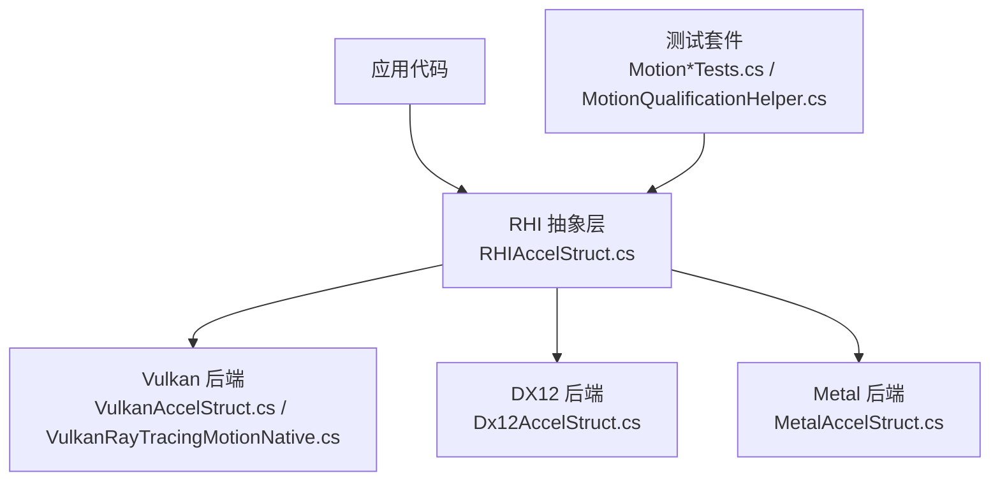
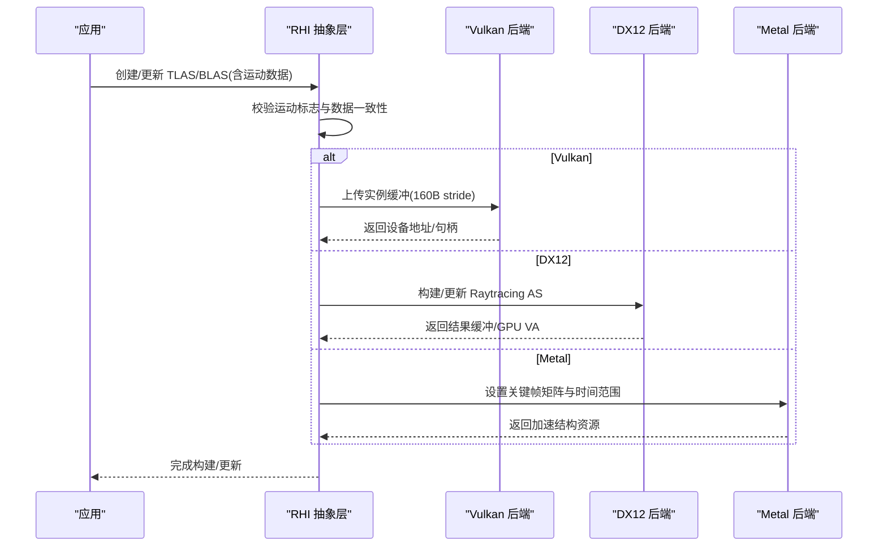
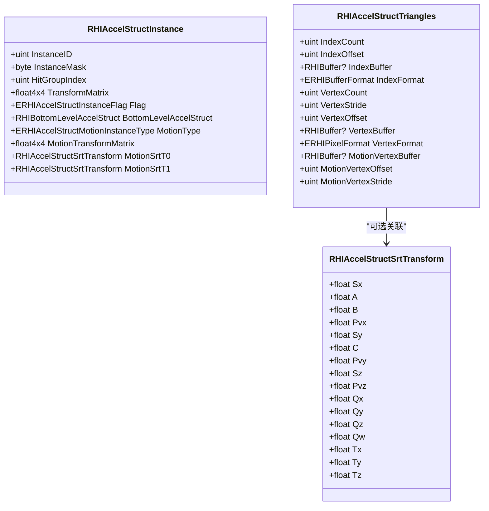
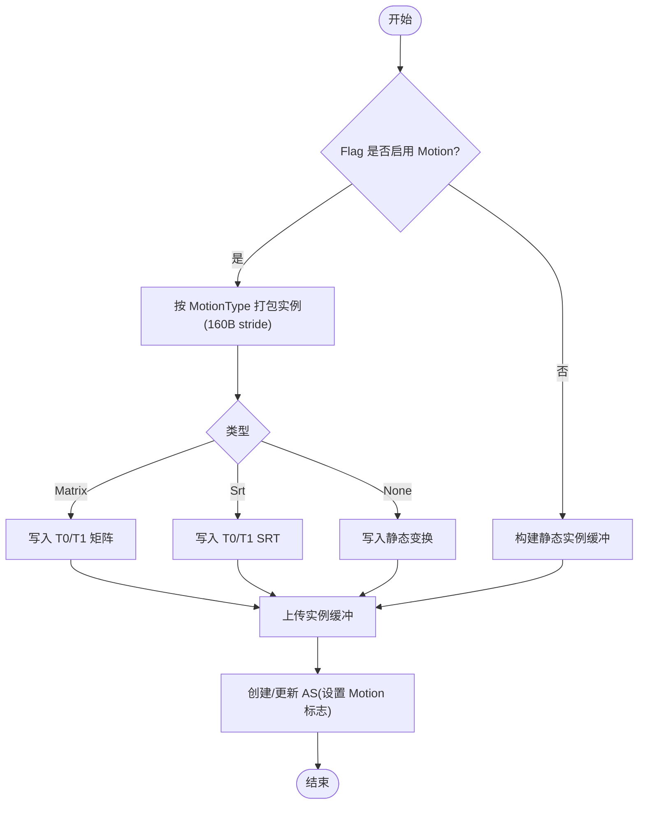
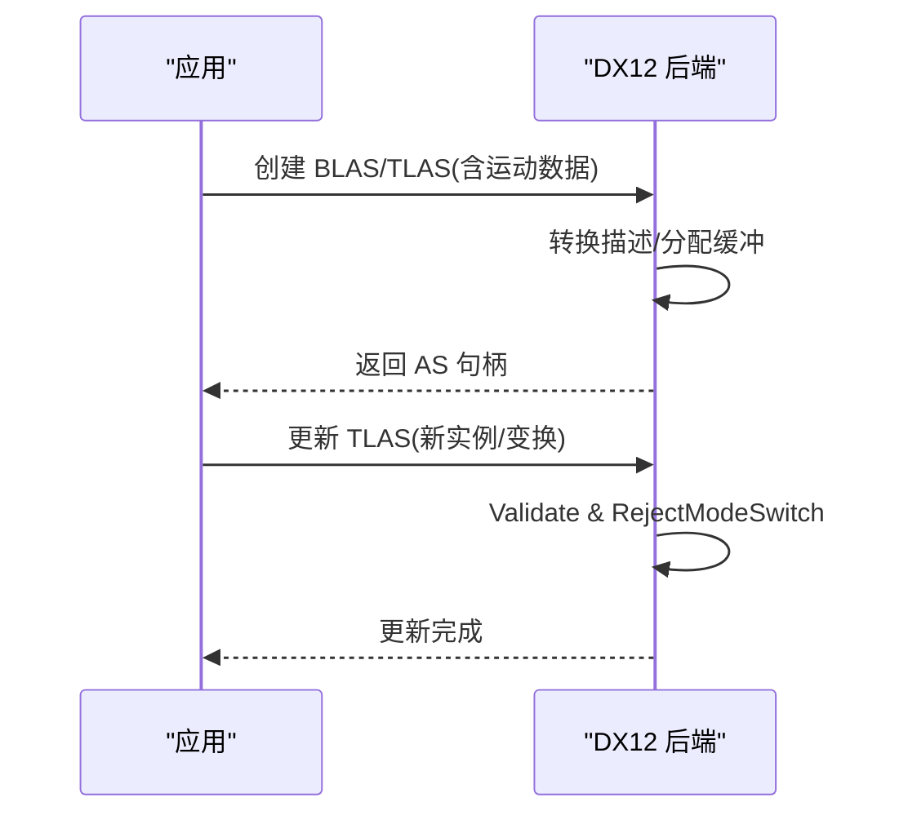
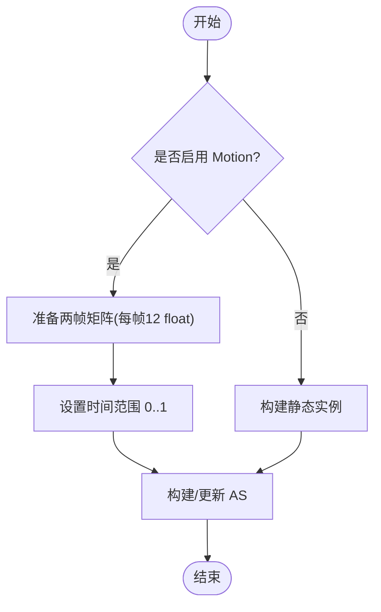
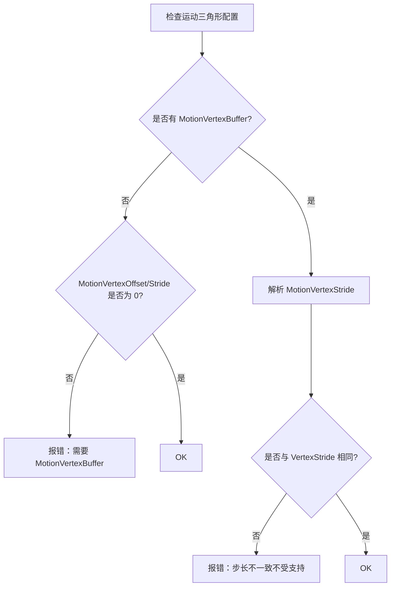
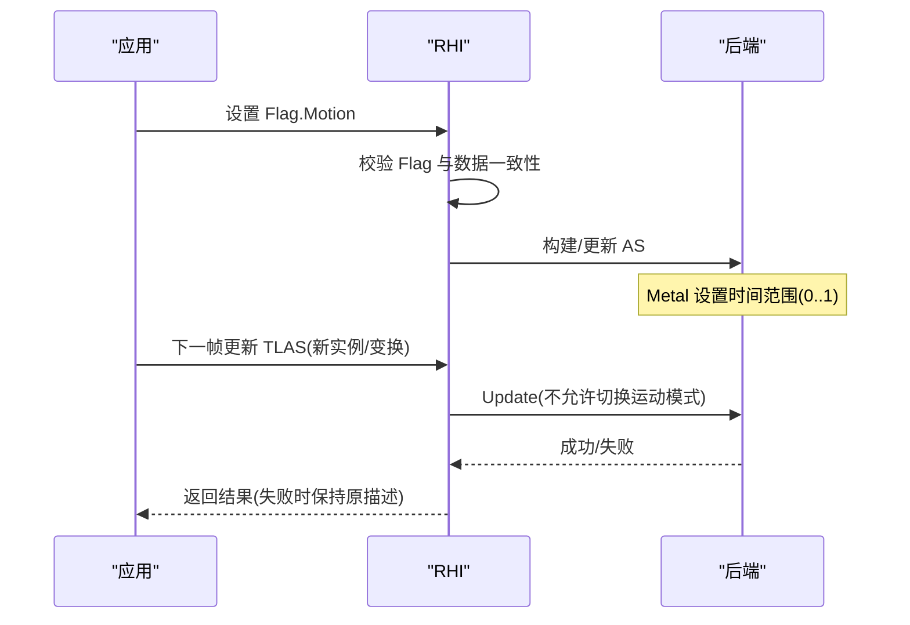
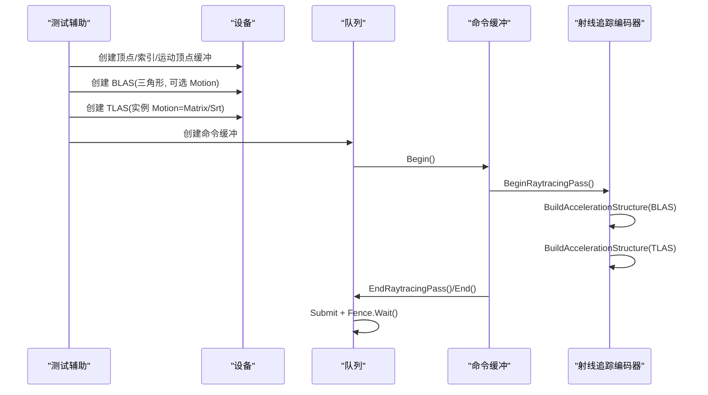
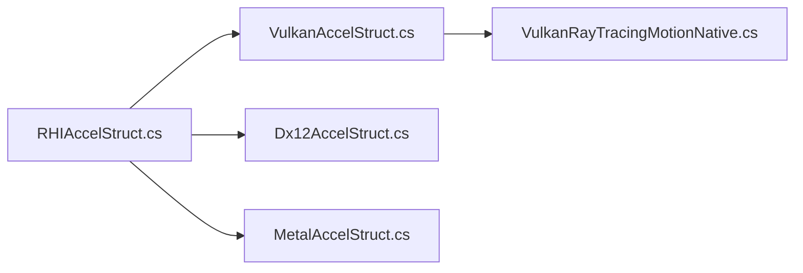

# 运动光线追踪

<cite>
**本文引用的文件**
- [RHIAccelStruct.cs](file://src/SharpGPU/Abstract/RHIAccelStruct.cs)
- [VulkanRayTracingMotionNative.cs](file://src/SharpGPU/Vulkan/VulkanRayTracingMotionNative.cs)
- [VulkanAccelStruct.cs](file://src/SharpGPU/Vulkan/VulkanAccelStruct.cs)
- [Dx12AccelStruct.cs](file://src/SharpGPU/Dx12/Dx12AccelStruct.cs)
- [MetalAccelStruct.cs](file://src/SharpGPU/Metal/MetalAccelStruct.cs)
- [MotionPortableContractTests.cs](file://tests/SharpGPU.Conformance.Tests/MotionPortableContractTests.cs)
- [MotionQualificationHelper.cs](file://tests/SharpGPU.Conformance.Tests/MotionQualificationHelper.cs)
</cite>

## 目录
1. [简介](#简介)
2. [项目结构](#项目结构)
3. [核心组件](#核心组件)
4. [架构总览](#架构总览)
5. [详细组件分析](#详细组件分析)
6. [依赖关系分析](#依赖关系分析)
7. [性能考虑](#性能考虑)
8. [故障排查指南](#故障排查指南)
9. [结论](#结论)
10. [附录](#附录)

## 简介
本文件面向在动画与动态场景中实现高效光线追踪的开发者，系统阐述 SharpGPU 的运动光线追踪能力。内容涵盖：
- 运动光线追踪的概念与应用场景（帧间几何体位移、形变）
- 运动实例变换的两种模式：矩阵变换与 SRT（缩放、旋转、平移）的配置方法
- 运动顶点缓冲区、偏移量与步长的配置要点
- 运动标志位设置、时间参数传递与跨帧更新策略
- 后端支持情况（DirectX12、Vulkan、Metal）与性能注意事项
- 通过测试用例展示的最小可运行示例流程

## 项目结构
SharpGPU 将运动光线追踪抽象为统一的 RHI 层接口，并在各后端（DX12、Vulkan、Metal）中分别实现。关键文件组织如下：
- 抽象层：定义加速结构、几何体、实例描述符、运动类型与校验逻辑
- Vulkan 后端：提供 NV 运动模糊扩展的结构体映射与实例打包
- DX12 后端：构建 BLAS/TLAS 并处理更新路径
- Metal 后端：基于金属加速结构 API 的关键帧矩阵与时间范围
- 测试：覆盖可用性探测、失败关闭行为、最小构建流程等

图表来源
- [RHIAccelStruct.cs:10-21](file://src/SharpGPU/Abstract/RHIAccelStruct.cs#L10-L21)
- [VulkanAccelStruct.cs:36-141](file://src/SharpGPU/Vulkan/VulkanAccelStruct.cs#L36-L141)
- [Dx12AccelStruct.cs:70-190](file://src/SharpGPU/Dx12/Dx12AccelStruct.cs#L70-L190)
- [MetalAccelStruct.cs:332-446](file://src/SharpGPU/Metal/MetalAccelStruct.cs#L332-L446)

章节来源
- [RHIAccelStruct.cs:10-21](file://src/SharpGPU/Abstract/RHIAccelStruct.cs#L10-L21)
- [VulkanRayTracingMotionNative.cs:1-24](file://src/SharpGPU/Vulkan/VulkanRayTracingMotionNative.cs#L1-L24)

## 核心组件
- 加速结构标志与几何体描述
  - 顶层/底层加速结构描述符包含 Flag、Instances/Geometries 等字段
  - 运动标志 ERHIAccelStructFlag.Motion 用于启用运动模式
- 运动实例类型
  - ERHIAccelStructMotionInstanceType.None/Matrix/Srt
  - 实例 RHIAccelStructInstance 包含静态变换、运动类型及对应数据（矩阵或 SRT）
- 运动三角形
  - RHIAccelStructTriangles 支持 MotionVertexBuffer、MotionVertexOffset、MotionVertexStride
- 运动校验契约
  - 统一校验运动类型、标志与数据一致性、顶点步长约束、索引意图等
- 后端绑定
  - Vulkan：使用 VK_NV_ray_tracing_motion_blur 扩展，按 160 字节 stride 打包实例
  - DX12：通过 RaytracingAccelerationStructure 构建与更新
  - Metal：使用关键帧矩阵与时间范围（StartTime/EndTime）

章节来源
- [RHIAccelStruct.cs:55-60](file://src/SharpGPU/Abstract/RHIAccelStruct.cs#L55-L60)
- [RHIAccelStruct.cs:129-150](file://src/SharpGPU/Abstract/RHIAccelStruct.cs#L129-L150)
- [RHIAccelStruct.cs:426-553](file://src/SharpGPU/Abstract/RHIAccelStruct.cs#L426-L553)
- [VulkanRayTracingMotionNative.cs:1-24](file://src/SharpGPU/Vulkan/VulkanRayTracingMotionNative.cs#L1-L24)

## 架构总览
下图展示了从应用到后端的调用链与数据流，重点体现运动模式下的实例与几何体装配过程。

图表来源
- [VulkanAccelStruct.cs:143-209](file://src/SharpGPU/Vulkan/VulkanAccelStruct.cs#L143-L209)
- [Dx12AccelStruct.cs:137-190](file://src/SharpGPU/Dx12/Dx12AccelStruct.cs#L137-L190)
- [MetalAccelStruct.cs:332-446](file://src/SharpGPU/Metal/MetalAccelStruct.cs#L332-L446)

## 详细组件分析

### 运动实例与几何体模型
- 运动实例类型枚举与数据结构
  - None：静态实例
  - Matrix：两帧矩阵（起始帧 TransformMatrix，结束帧 MotionTransformMatrix）
  - Srt：两帧 SRT（MotionSrtT0/MotionSrtT1），包含缩放、旋转四元数、平移
- 运动三角形
  - 需要 MotionVertexBuffer，可选 MotionVertexOffset/MotionVertexStride
  - 若未显式设置 MotionVertexStride，则默认复用 VertexStride；且后端要求两者一致
- 标志位与一致性校验
  - 若 Flag 设置了 Motion，则必须存在运动实例或运动三角形数据；反之亦然
  - 未知运动类型会触发失败关闭（抛出异常）

图表来源
- [RHIAccelStruct.cs:129-171](file://src/SharpGPU/Abstract/RHIAccelStruct.cs#L129-L171)
- [RHIAccelStruct.cs:707-720](file://src/SharpGPU/Abstract/RHIAccelStruct.cs#L707-L720)

章节来源
- [RHIAccelStruct.cs:55-60](file://src/SharpGPU/Abstract/RHIAccelStruct.cs#L55-L60)
- [RHIAccelStruct.cs:129-171](file://src/SharpGPU/Abstract/RHIAccelStruct.cs#L129-L171)
- [RHIAccelStruct.cs:426-553](file://src/SharpGPU/Abstract/RHIAccelStruct.cs#L426-L553)

### Vulkan 后端：运动实例打包与构建
- 扩展与常量
  - 使用 VK_NV_ray_tracing_motion_blur 扩展
  - 运动实例数组 stride 固定为 160 字节
- 实例打包
  - 根据 MotionType 选择静态、矩阵或 SRT 实例布局
  - 矩阵模式写入起始/结束帧 3x4 矩阵；SRT 模式写入两帧 SRT 数据
- 构建流程
  - 创建 TLAS/BLAS 时根据 Flag 设置 CreateMotionBit
  - 上传实例缓冲至 HostVisible 内存，再交由驱动构建

图表来源
- [VulkanAccelStruct.cs:143-209](file://src/SharpGPU/Vulkan/VulkanAccelStruct.cs#L143-L209)
- [VulkanAccelStruct.cs:241-343](file://src/SharpGPU/Vulkan/VulkanAccelStruct.cs#L241-L343)
- [VulkanRayTracingMotionNative.cs:1-24](file://src/SharpGPU/Vulkan/VulkanRayTracingMotionNative.cs#L1-L24)

章节来源
- [VulkanAccelStruct.cs:36-141](file://src/SharpGPU/Vulkan/VulkanAccelStruct.cs#L36-L141)
- [VulkanAccelStruct.cs:143-209](file://src/SharpGPU/Vulkan/VulkanAccelStruct.cs#L143-L209)
- [VulkanAccelStruct.cs:241-343](file://src/SharpGPU/Vulkan/VulkanAccelStruct.cs#L241-L343)
- [VulkanRayTracingMotionNative.cs:1-24](file://src/SharpGPU/Vulkan/VulkanRayTracingMotionNative.cs#L1-L24)

### DX12 后端：构建与更新
- 构建 BLAS/TLAS
  - 将几何体/实例描述转换为原生结构，分配结果与暂存缓冲
- 更新 TLAS
  - 使用 PerformUpdate 标志进行增量更新
  - 拒绝在 Update 过程中切换运动模式（需重建）
- 运动三角形
  - 通过顶点格式与步长适配，确保与后端期望一致

图表来源
- [Dx12AccelStruct.cs:70-190](file://src/SharpGPU/Dx12/Dx12AccelStruct.cs#L70-L190)

章节来源
- [Dx12AccelStruct.cs:70-190](file://src/SharpGPU/Dx12/Dx12AccelStruct.cs#L70-L190)

### Metal 后端：关键帧矩阵与时间范围
- 关键帧与时间
  - 使用两个关键帧矩阵作为起止时刻，时间范围为 StartTime=0 到 EndTime=1
  - 不支持 SRT 运动实例（失败关闭）
- 实例描述
  - 为每个实例准备两个 packed 矩阵（每帧 12 个 float），写入 MotionTransformBuffer
- 构建与更新
  - 首次构建与后续更新均会重新计算尺寸并替换资源，保证原子性

图表来源
- [MetalAccelStruct.cs:332-446](file://src/SharpGPU/Metal/MetalAccelStruct.cs#L332-L446)
- [MetalAccelStruct.cs:494-713](file://src/SharpGPU/Metal/MetalAccelStruct.cs#L494-L713)

章节来源
- [MetalAccelStruct.cs:332-446](file://src/SharpGPU/Metal/MetalAccelStruct.cs#L332-L446)
- [MetalAccelStruct.cs:494-713](file://src/SharpGPU/Metal/MetalAccelStruct.cs#L494-L713)

### 运动顶点缓冲区、偏移量与步长
- 运动顶点缓冲区
  - 必须为 AccelStruct 用途的缓冲，并提供 GPU 设备地址
- 偏移量与步长
  - MotionVertexOffset：运动顶点缓冲的起始偏移
  - MotionVertexStride：若为 0 则复用静态顶点步长；若非 0 则必须与静态步长一致（否则抛出不受支持异常）
- 验证与错误处理
  - 缺少 MotionVertexBuffer 但设置了偏移/步长会报错
  - 步长不一致会抛出不受支持异常

图表来源
- [RHIAccelStruct.cs:511-544](file://src/SharpGPU/Abstract/RHIAccelStruct.cs#L511-L544)

章节来源
- [RHIAccelStruct.cs:511-544](file://src/SharpGPU/Abstract/RHIAccelStruct.cs#L511-L544)

### 标志位、时间与跨帧更新策略
- 标志位
  - ERHIAccelStructFlag.Motion：启用运动模式
  - 标志与数据必须一致：有运动数据则必须置位，否则报错
- 时间参数
  - Metal：通过 MotionStartTime/MotionEndTime 指定时间范围（通常 0..1）
  - Vulkan/DX12：由驱动在着色器阶段依据管线/状态插值（应用侧不直接传时间）
- 跨帧更新
  - TLAS 可通过 UpdateAccelerationStructure 增量更新实例数据
  - 禁止在 Update 中切换运动模式（需重建 AS）
  - 失败更新应保持原描述不变（测试覆盖）

图表来源
- [RHIAccelStruct.cs:483-553](file://src/SharpGPU/Abstract/RHIAccelStruct.cs#L483-L553)
- [MetalAccelStruct.cs:332-446](file://src/SharpGPU/Metal/MetalAccelStruct.cs#L332-L446)
- [Dx12AccelStruct.cs:137-190](file://src/SharpGPU/Dx12/Dx12AccelStruct.cs#L137-L190)

章节来源
- [RHIAccelStruct.cs:483-553](file://src/SharpGPU/Abstract/RHIAccelStruct.cs#L483-L553)
- [MetalAccelStruct.cs:332-446](file://src/SharpGPU/Metal/MetalAccelStruct.cs#L332-L446)
- [Dx12AccelStruct.cs:137-190](file://src/SharpGPU/Dx12/Dx12AccelStruct.cs#L137-L190)

### 运动场景的光线追踪示例（最小可运行流程）
以下示例来自测试辅助函数，演示如何构建一个带运动的三角形 BLAS 与一个带矩阵运动的 TLAS，并提交命令队列执行构建。

- 步骤概览
  - 准备静态与运动顶点缓冲（带 AccelStruct 用途）
  - 创建 BLAS（三角形几何，必要时启用 Motion 标志）
  - 创建 TLAS（实例启用 Motion，选择 Matrix 或 Srt）
  - 在射线追踪通道中构建 BLAS/TLAS
  - 提交命令并等待完成

图表来源
- [MotionQualificationHelper.cs:95-170](file://tests/SharpGPU.Conformance.Tests/MotionQualificationHelper.cs#L95-L170)
- [MotionQualificationHelper.cs:10-93](file://tests/SharpGPU.Conformance.Tests/MotionQualificationHelper.cs#L10-L93)

章节来源
- [MotionQualificationHelper.cs:10-93](file://tests/SharpGPU.Conformance.Tests/MotionQualificationHelper.cs#L10-L93)
- [MotionQualificationHelper.cs:95-170](file://tests/SharpGPU.Conformance.Tests/MotionQualificationHelper.cs#L95-L170)

## 依赖关系分析
- 抽象层依赖
  - 所有后端共享 RHIAccelStruct.* 中的类型与校验逻辑
- Vulkan 后端依赖
  - 依赖 VulkanRayTracingMotionNative 提供的扩展常量与结构体布局
- DX12/Metal 后端
  - 各自封装原生 API，但遵循相同的 RHI 契约与校验规则

图表来源
- [RHIAccelStruct.cs:426-553](file://src/SharpGPU/Abstract/RHIAccelStruct.cs#L426-L553)
- [VulkanAccelStruct.cs:36-141](file://src/SharpGPU/Vulkan/VulkanAccelStruct.cs#L36-L141)
- [VulkanRayTracingMotionNative.cs:1-24](file://src/SharpGPU/Vulkan/VulkanRayTracingMotionNative.cs#L1-L24)

章节来源
- [RHIAccelStruct.cs:426-553](file://src/SharpGPU/Abstract/RHIAccelStruct.cs#L426-L553)
- [VulkanAccelStruct.cs:36-141](file://src/SharpGPU/Vulkan/VulkanAccelStruct.cs#L36-L141)
- [VulkanRayTracingMotionNative.cs:1-24](file://src/SharpGPU/Vulkan/VulkanRayTracingMotionNative.cs#L1-L24)

## 性能考虑
- 实例缓冲大小与对齐
  - Vulkan 使用固定 160 字节 stride，避免额外填充带来的浪费
- 更新策略
  - 优先使用增量更新（PerformUpdate）减少重建开销
  - 避免在 Update 中切换运动模式，防止强制重建
- 顶点步长
  - 保持 MotionVertexStride 与 VertexStride 一致，减少跨端差异与潜在重排
- 时间范围
  - Metal 上合理设置时间范围（如 0..1）以匹配渲染时序
- 资源复用
  - 复用 BLAS/TLAS 的结果与暂存缓冲，降低频繁分配成本

[本节为通用指导，不直接分析具体文件]

## 故障排查指南
- 常见错误与定位
  - 未启用 Motion 标志却提供了运动数据：构造时会抛出参数异常
  - 启用了 Motion 标志但未提供运动数据：构造时会抛出参数异常
  - 未知运动类型：抛出参数越界异常（失败关闭）
  - 运动顶点步长不一致：抛出不受支持异常
  - 索引三角形意图无效：抛出参数异常
  - 不可用后端尝试创建运动 AS：抛出不支持异常
- 调试建议
  - 先确认 Flag 与数据一致性
  - 检查 MotionVertexBuffer 是否具备 AccelStruct 用途
  - 确认 MotionVertexStride 与 VertexStride 一致
  - 在各后端分别验证最小示例（参考测试辅助函数）

章节来源
- [MotionPortableContractTests.cs:148-281](file://tests/SharpGPU.Conformance.Tests/MotionPortableContractTests.cs#L148-L281)
- [MotionQualificationHelper.cs:172-357](file://tests/SharpGPU.Conformance.Tests/MotionQualificationHelper.cs#L172-L357)

## 结论
SharpGPU 通过统一的抽象层与严格的校验契约，为 DirectX12、Vulkan、Metal 提供了跨平台的运动光线追踪能力。开发者可在动画与动态场景中利用矩阵或 SRT 变换高效表达几何体的运动，并通过增量更新与合理的资源管理获得良好性能。建议在开发初期即启用最小示例流程，逐步集成到实际渲染管线中。

[本节为总结，不直接分析具体文件]

## 附录
- 术语
  - BLAS：底层加速结构，描述几何体
  - TLAS：顶层加速结构，描述实例及其引用
  - OMM：不透明度微图（与本主题相关但不展开）
- 参考
  - 测试用例中的最小构建流程可作为快速上手模板

[本节为补充信息，不直接分析具体文件]