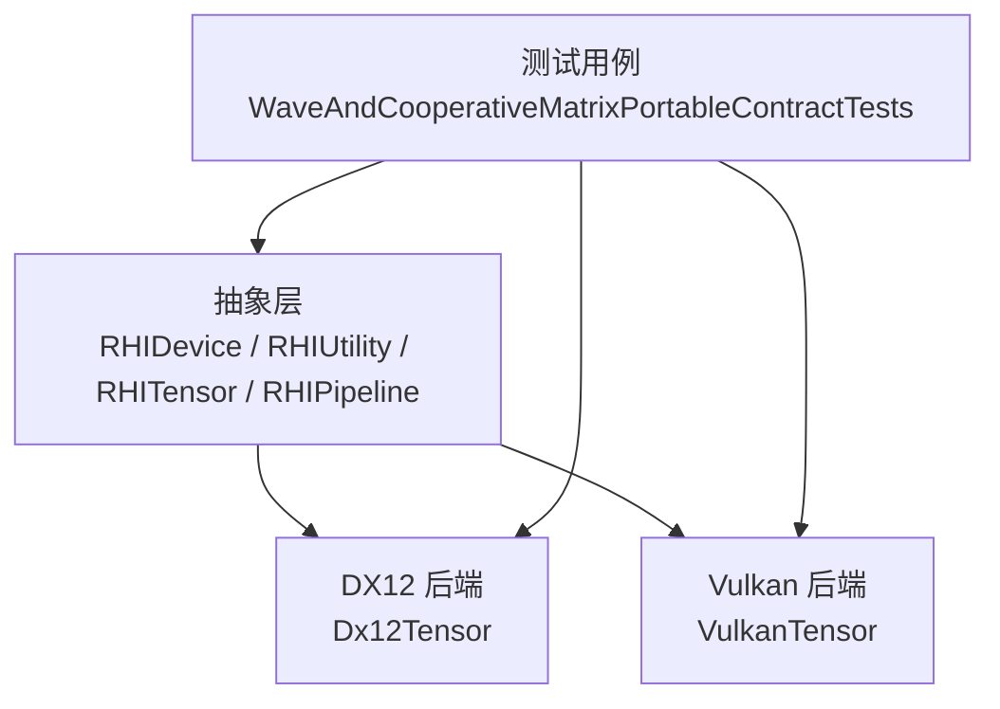
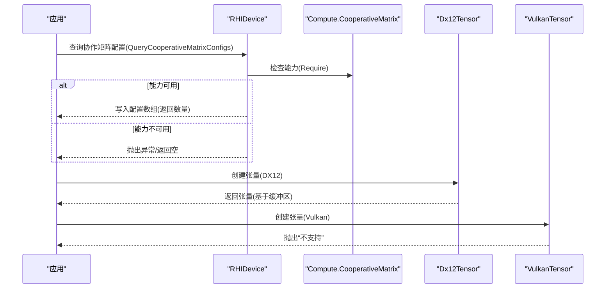
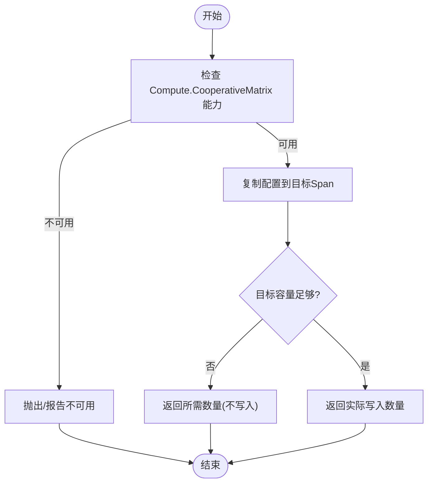
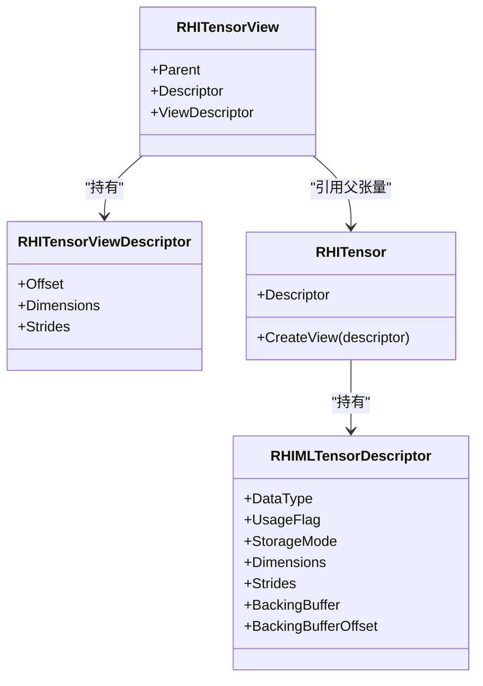
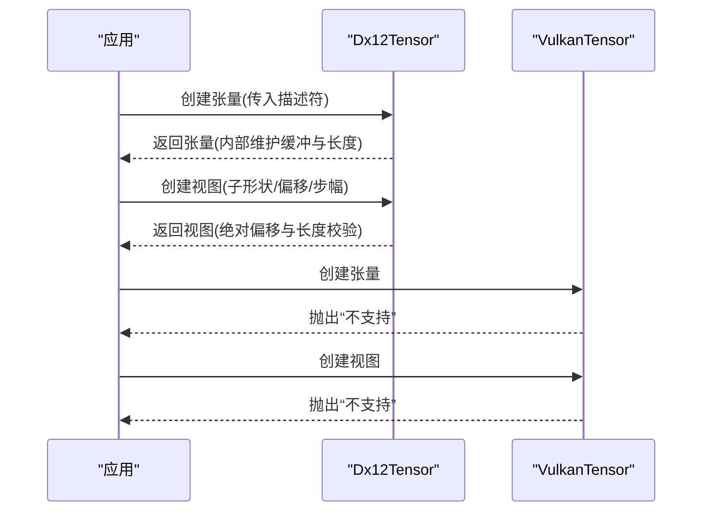
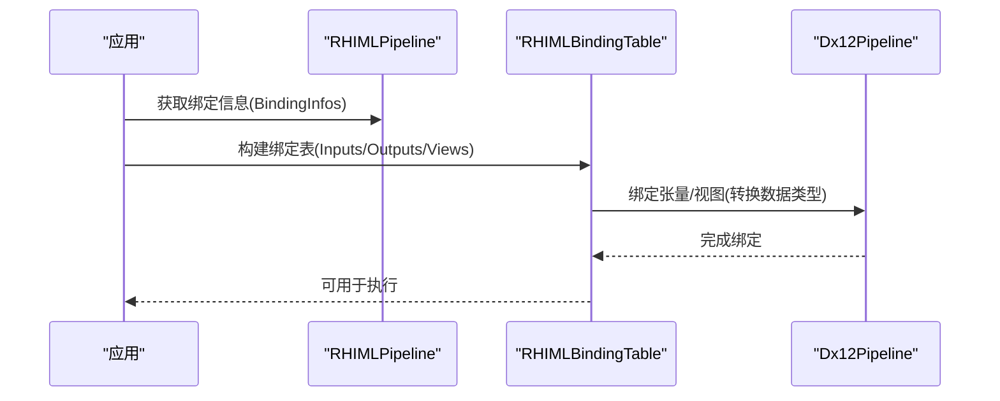
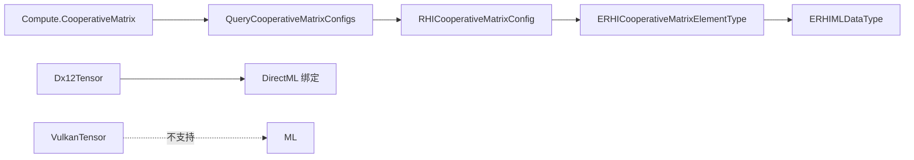

# 协作矩阵

<cite>
**本文引用的文件**
- [RHIDevice.cs](file://src/SharpGPU/Abstract/RHIDevice.cs)
- [RHIUtility.cs](file://src/SharpGPU/Abstract/RHIUtility.cs)
- [RHITensor.cs](file://src/SharpGPU/Abstract/RHITensor.cs)
- [RHIPipeline.cs](file://src/SharpGPU/Abstract/RHIPipeline.cs)
- [Dx12Tensor.cs](file://src/SharpGPU/Dx12/Dx12Tensor.cs)
- [VulkanTensor.cs](file://src/SharpGPU/Vulkan/VulkanTensor.cs)
- [WaveAndCooperativeMatrixPortableContractTests.cs](file://tests/SharpGPU.Conformance.Tests/WaveAndCooperativeMatrixPortableContractTests.cs)
</cite>

## 目录
1. [简介](#简介)
2. [项目结构](#项目结构)
3. [核心组件](#核心组件)
4. [架构总览](#架构总览)
5. [详细组件分析](#详细组件分析)
6. [依赖关系分析](#依赖关系分析)
7. [性能考虑](#性能考虑)
8. [故障排查指南](#故障排查指南)
9. [结论](#结论)
10. [附录](#附录)

## 简介
本文件聚焦 SharpGPU 的协作矩阵（Cooperative Matrix）能力，说明其在现代 GPU 架构中的角色与价值，并基于仓库源码梳理：
- 如何查询设备支持的协作矩阵配置（元素类型、维度 M/N/K、作用域等）。
- 张量（Tensor）的创建、布局与视图（View）机制，包括数据类型支持、内存布局与对齐。
- 不同后端对协作矩阵的支持现状：DX12 通过 DirectML 集成机器学习管线；Vulkan 当前未提供官方 ML Tensor API。
- 矩阵运算与深度学习操作的使用路径与示例流程。
- 性能调优建议：内存带宽、并行度、缓存策略等。

## 项目结构
围绕协作矩阵与张量的关键代码分布在抽象层与各后端实现中：
- 抽象能力与枚举定义位于 Abstract 层，包含协作矩阵元素类型与作用域、机器学习的张量描述符与工具方法。
- 后端特定实现位于 Dx12、Vulkan、Metal 子目录，其中 DX12 张量由缓冲区承载并通过 DirectML 绑定；Vulkan 张量当前返回“不支持”。
- 测试用例覆盖协作矩阵能力探测与枚举行为。

图表来源
- [RHIDevice.cs:600-636](file://src/SharpGPU/Abstract/RHIDevice.cs#L600-L636)
- [RHIUtility.cs:70-103](file://src/SharpGPU/Abstract/RHIUtility.cs#L70-L103)
- [RHITensor.cs:6-45](file://src/SharpGPU/Abstract/RHITensor.cs#L6-L45)
- [RHIPipeline.cs:764-949](file://src/SharpGPU/Abstract/RHIPipeline.cs#L764-L949)
- [Dx12Tensor.cs:5-146](file://src/SharpGPU/Dx12/Dx12Tensor.cs#L5-L146)
- [VulkanTensor.cs:5-32](file://src/SharpGPU/Vulkan/VulkanTensor.cs#L5-L32)
- [WaveAndCooperativeMatrixPortableContractTests.cs:135-167](file://tests/SharpGPU.Conformance.Tests/WaveAndCooperativeMatrixPortableContractTests.cs#L135-L167)

章节来源
- [RHIDevice.cs:600-636](file://src/SharpGPU/Abstract/RHIDevice.cs#L600-L636)
- [RHIUtility.cs:70-103](file://src/SharpGPU/Abstract/RHIUtility.cs#L70-L103)
- [RHITensor.cs:6-45](file://src/SharpGPU/Abstract/RHITensor.cs#L6-L45)
- [RHIPipeline.cs:764-949](file://src/SharpGPU/Abstract/RHIPipeline.cs#L764-L949)
- [Dx12Tensor.cs:5-146](file://src/SharpGPU/Dx12/Dx12Tensor.cs#L5-L146)
- [VulkanTensor.cs:5-32](file://src/SharpGPU/Vulkan/VulkanTensor.cs#L5-L32)
- [WaveAndCooperativeMatrixPortableContractTests.cs:135-167](file://tests/SharpGPU.Conformance.Tests/WaveAndCooperativeMatrixPortableContractTests.cs#L135-L167)

## 核心组件
- 协作矩阵能力查询
  - 通过设备能力接口暴露 Compute.CooperativeMatrix，并在不可用时给出原因。
  - 提供 QueryCooperativeMatrixConfigs 将原生协作矩阵配置复制到调用方提供的 Span。
- 协作矩阵配置结构
  - 包含 A/B/C/Result 元素类型、作用域（Subgroup/Workgroup/Device/QueueFamily），以及维度 M/N/K。
- 张量描述符与工具
  - RHIMLTensorDescriptor 指定数据类型、用途标志、存储模式、维度、可选显式步幅、底层缓冲与偏移。
  - RHIMLHelpers 提供元素大小计算、最小字节长度计算、有效步幅推导、布局克隆与兼容性检查。
- 后端张量实现
  - DX12：张量以缓冲区为后援，按描述符解释布局；支持创建视图（View）。
  - Vulkan：当前不实现 ML Tensor，构造与视图均抛出“不支持”。

章节来源
- [RHIDevice.cs:600-636](file://src/SharpGPU/Abstract/RHIDevice.cs#L600-L636)
- [RHIUtility.cs:70-103](file://src/SharpGPU/Abstract/RHIUtility.cs#L70-L103)
- [RHITensor.cs:6-45](file://src/SharpGPU/Abstract/RHITensor.cs#L6-L45)
- [RHIPipeline.cs:764-949](file://src/SharpGPU/Abstract/RHIPipeline.cs#L764-L949)
- [Dx12Tensor.cs:5-146](file://src/SharpGPU/Dx12/Dx12Tensor.cs#L5-L146)
- [VulkanTensor.cs:5-32](file://src/SharpGPU/Vulkan/VulkanTensor.cs#L5-L32)

## 架构总览
协作矩阵在 SharpGPU 中的位置：
- 抽象层统一暴露能力查询与张量模型。
- 后端层负责具体资源绑定与限制：
  - DX12 借助 DirectML 进行机器学习管线绑定，张量数据驻留在 D3D12 缓冲区。
  - Vulkan 当前无官方 ML Tensor API，相关操作暂不支持。

图表来源
- [RHIDevice.cs:600-636](file://src/SharpGPU/Abstract/RHIDevice.cs#L600-L636)
- [Dx12Tensor.cs:27-71](file://src/SharpGPU/Dx12/Dx12Tensor.cs#L27-L71)
- [VulkanTensor.cs:9-14](file://src/SharpGPU/Vulkan/VulkanTensor.cs#L9-L14)

## 详细组件分析

### 协作矩阵能力与配置
- 能力入口
  - 通过 RHIDevice.Capabilities.Compute.CooperativeMatrix 获取能力对象，若不可用则提供不可用原因。
- 配置枚举
  - QueryCooperativeMatrixConfigs 将原生配置复制到目标 Span；空目标返回 0，容量不足返回所需数量。
- 配置项
  - 元素类型：Float16/Float32/Float64/SInt8..SInt64/UInt8..UInt64/BFloat16/Float8E4M3/Float8E5M2/Unknown。
  - 作用域：Subgroup/Workgroup/Device/QueueFamily。
  - 维度：M/N/K 非零值表示该配置的有效规模。

图表来源
- [RHIDevice.cs:600-636](file://src/SharpGPU/Abstract/RHIDevice.cs#L600-L636)
- [RHIUtility.cs:70-103](file://src/SharpGPU/Abstract/RHIUtility.cs#L70-L103)

章节来源
- [RHIDevice.cs:600-636](file://src/SharpGPU/Abstract/RHIDevice.cs#L600-L636)
- [RHIUtility.cs:70-103](file://src/SharpGPU/Abstract/RHIUtility.cs#L70-L103)
- [WaveAndCooperativeMatrixPortableContractTests.cs:135-167](file://tests/SharpGPU.Conformance.Tests/WaveAndCooperativeMatrixPortableContractTests.cs#L135-L167)

### 张量（Tensor）模型与布局
- 描述符字段
  - 数据类型：Float32/Float16/BFloat16/Int32/Int16/Int8/UInt32/UInt16/UInt8。
  - 用途标志：用于指示张量在管线中的使用方式。
  - 存储模式：决定内存归属与访问语义。
  - 维度与步幅：可显式提供步幅，否则按行主序推导。
  - 底层缓冲与偏移：支持复用已有缓冲或自动分配。
- 工具方法
  - GetElementSize：根据数据类型返回元素字节数。
  - CalculateMinimumByteLength：考虑显式步幅时的最小字节长度。
  - GetEffectiveStrides：若无显式步幅，按维度从右向左推导连续步幅。
  - CloneLayoutDescriptor/HasCompatibleLayout：用于布局拷贝与兼容性判断。

图表来源
- [RHITensor.cs:6-45](file://src/SharpGPU/Abstract/RHITensor.cs#L6-L45)
- [RHIPipeline.cs:832-949](file://src/SharpGPU/Abstract/RHIPipeline.cs#L832-L949)

章节来源
- [RHITensor.cs:6-45](file://src/SharpGPU/Abstract/RHITensor.cs#L6-L45)
- [RHIPipeline.cs:832-949](file://src/SharpGPU/Abstract/RHIPipeline.cs#L832-L949)

### 后端实现差异
- DX12
  - 张量以 D3D12 缓冲区为后援，描述符用于解释布局。
  - 支持创建视图（View），视图会继承父张量的缓冲与偏移，并重新计算自身范围。
  - 与 DirectML 结合时，张量作为输入/输出参与机器学习管线。
- Vulkan
  - 当前不提供 ML Tensor API，构造与视图均抛出“不支持”。

图表来源
- [Dx12Tensor.cs:27-146](file://src/SharpGPU/Dx12/Dx12Tensor.cs#L27-L146)
- [VulkanTensor.cs:9-20](file://src/SharpGPU/Vulkan/VulkanTensor.cs#L9-L20)

章节来源
- [Dx12Tensor.cs:27-146](file://src/SharpGPU/Dx12/Dx12Tensor.cs#L27-L146)
- [VulkanTensor.cs:9-20](file://src/SharpGPU/Vulkan/VulkanTensor.cs#L9-L20)

### 机器学习管线与张量绑定
- 绑定信息
  - RHIMLTensorBindingInfo 包含名称、索引、种类（输入/输出）、描述符。
  - RHIMLPipeline 暴露临时/持久资源大小、输入/输出计数与绑定信息。
- 绑定表
  - RHIMLBindingTableDescriptor 允许直接绑定张量或张量视图（Additive view bindings）。
- 数据类型转换
  - DX12 管道中将 ERHIMLDataType 转换为 DirectML 的数据类型以完成绑定。

图表来源
- [RHIPipeline.cs:764-830](file://src/SharpGPU/Abstract/RHIPipeline.cs#L764-L830)
- [Dx12Pipeline.cs:1928-1933](file://src/SharpGPU/Dx12/Dx12Pipeline.cs#L1928-L1933)

章节来源
- [RHIPipeline.cs:764-830](file://src/SharpGPU/Abstract/RHIPipeline.cs#L764-L830)
- [Dx12Pipeline.cs:1928-1933](file://src/SharpGPU/Dx12/Dx12Pipeline.cs#L1928-L1933)

## 依赖关系分析
- 能力依赖
  - 协作矩阵能力受 Compute.CooperativeMatrix 控制，查询前需确保能力可用。
- 类型映射
  - 协作矩阵元素类型枚举宽于机器学习数据类型枚举，避免 Vulkan 组件类型被静默收窄。
- 后端耦合
  - DX12 张量强依赖 D3D12 缓冲与 DirectML 绑定；Vulkan 张量当前无实现。

图表来源
- [RHIDevice.cs:600-636](file://src/SharpGPU/Abstract/RHIDevice.cs#L600-L636)
- [RHIUtility.cs:70-103](file://src/SharpGPU/Abstract/RHIUtility.cs#L70-L103)
- [Dx12Tensor.cs:5-146](file://src/SharpGPU/Dx12/Dx12Tensor.cs#L5-L146)
- [VulkanTensor.cs:5-32](file://src/SharpGPU/Vulkan/VulkanTensor.cs#L5-L32)

章节来源
- [RHIDevice.cs:600-636](file://src/SharpGPU/Abstract/RHIDevice.cs#L600-L636)
- [RHIUtility.cs:70-103](file://src/SharpGPU/Abstract/RHIUtility.cs#L70-L103)
- [Dx12Tensor.cs:5-146](file://src/SharpGPU/Dx12/Dx12Tensor.cs#L5-L146)
- [VulkanTensor.cs:5-32](file://src/SharpGPU/Vulkan/VulkanTensor.cs#L5-L32)

## 性能考虑
- 内存带宽优化
  - 优先选择与硬件协作矩阵匹配的元素类型（如 FP16、INT8），减少数据转换开销。
  - 尽量使用连续内存布局与合适的步幅，避免不必要的重排与拷贝。
- 并行度设置
  - 依据设备能力（如 Wavefront 尺寸、协作矩阵作用域）调整工作分组大小，使 M/N/K 与硬件块大小匹配。
- 缓存使用策略
  - 利用子组/工作组级协作矩阵寄存器文件，减少全局内存访问频率。
  - 合理划分分块（Tiling）大小，平衡局部性与带宽占用。
- 后端差异
  - DX12：通过 DirectML 管线高效绑定张量，注意缓冲区生命周期与访问模式。
  - Vulkan：当前无 ML Tensor API，无法直接使用协作矩阵加速 ML 算子。

[本节为通用性能指导，不直接分析具体文件]

## 故障排查指南
- 能力不可用
  - 当 Compute.CooperativeMatrix 不可用时，查询配置会失败；应检查设备能力与驱动支持。
- 张量范围越界
  - DX12 张量/视图创建时会校验绝对偏移与长度是否超出底层缓冲大小，越界将抛出异常。
- 步幅不匹配
  - 显式步幅的秩必须与维度一致，否则计算最小字节长度时会报错。
- 后端不支持
  - Vulkan 张量构造与视图创建均抛出“不支持”，需切换至 DX12 或使用其他方案。

章节来源
- [RHIDevice.cs:600-636](file://src/SharpGPU/Abstract/RHIDevice.cs#L600-L636)
- [Dx12Tensor.cs:50-132](file://src/SharpGPU/Dx12/Dx12Tensor.cs#L50-L132)
- [RHIPipeline.cs:876-899](file://src/SharpGPU/Abstract/RHIPipeline.cs#L876-L899)
- [VulkanTensor.cs:9-20](file://src/SharpGPU/Vulkan/VulkanTensor.cs#L9-L20)

## 结论
- SharpGPU 在抽象层提供了统一的协作矩阵能力查询与张量模型，便于跨后端使用。
- DX12 后端通过 DirectML 实现了机器学习张量绑定，适合在 Windows 平台进行高性能矩阵运算与深度学习任务。
- Vulkan 后端当前未提供 ML Tensor API，暂不支持协作矩阵相关的机器学习张量操作。
- 性能优化需结合设备能力、数据类型、内存布局与并行度进行综合调优。

[本节为总结性内容，不直接分析具体文件]

## 附录
- 常用数据类型与元素大小
  - Float32: 4 字节；Float16/BFloat16: 2 字节；Int8/UInt8: 1 字节；Int16/UInt16: 2 字节；Int32/UInt32: 4 字节。
- 协作矩阵作用域
  - Subgroup/Workgroup/Device/QueueFamily，影响寄存器与共享内存的使用范围。
- 参考测试
  - 协作矩阵能力探测与配置枚举行为见测试用例，确保至少存在一个有效配置且 M/N/K 非零。

章节来源
- [RHIPipeline.cs:839-853](file://src/SharpGPU/Abstract/RHIPipeline.cs#L839-L853)
- [RHIUtility.cs:70-103](file://src/SharpGPU/Abstract/RHIUtility.cs#L70-L103)
- [WaveAndCooperativeMatrixPortableContractTests.cs:135-167](file://tests/SharpGPU.Conformance.Tests/WaveAndCooperativeMatrixPortableContractTests.cs#L135-L167)